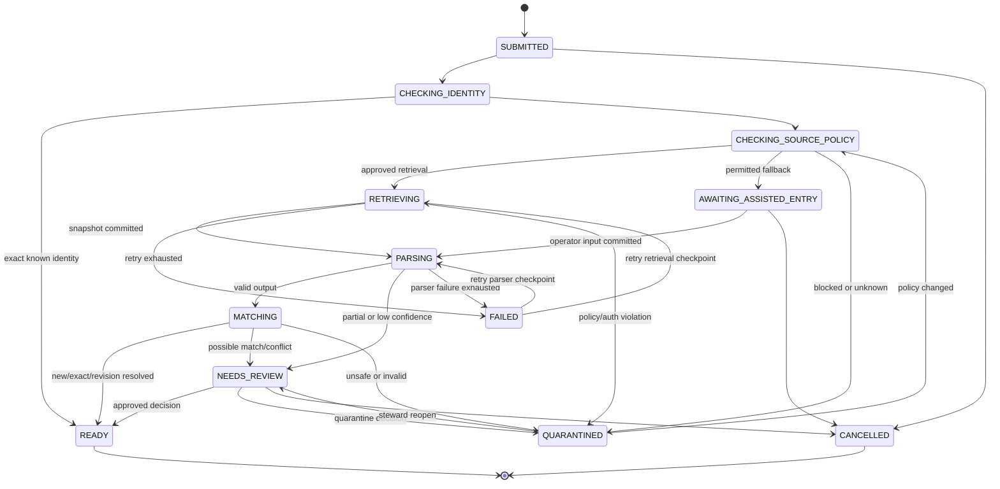
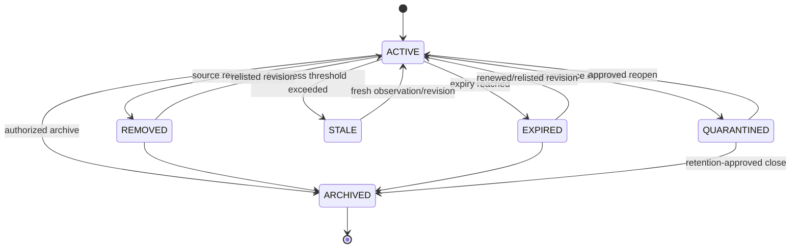
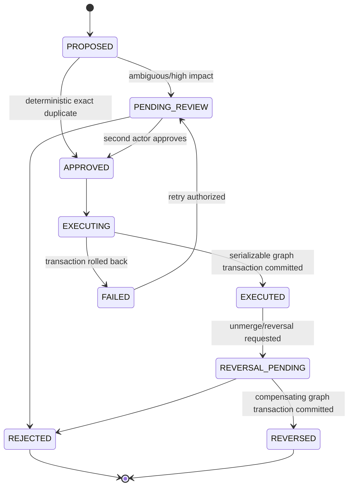
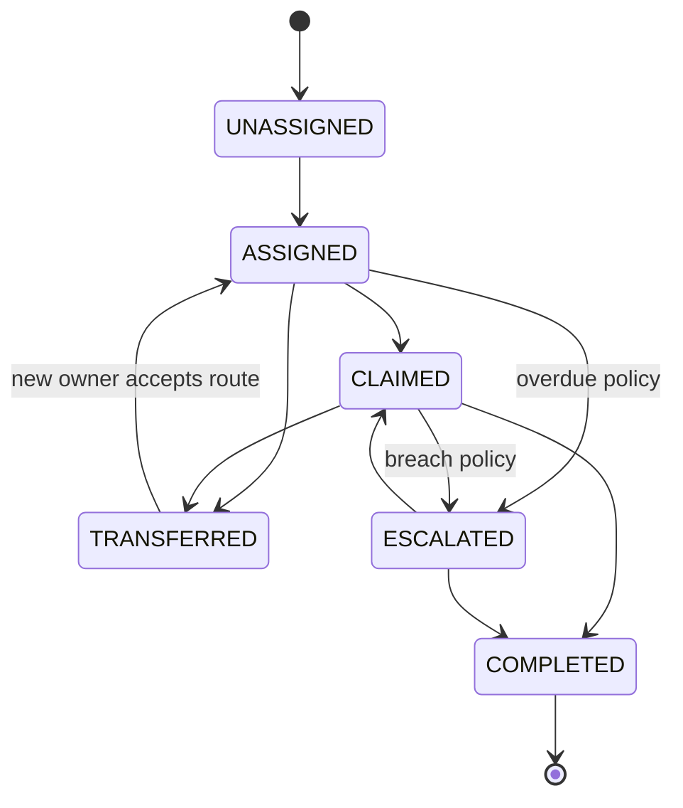
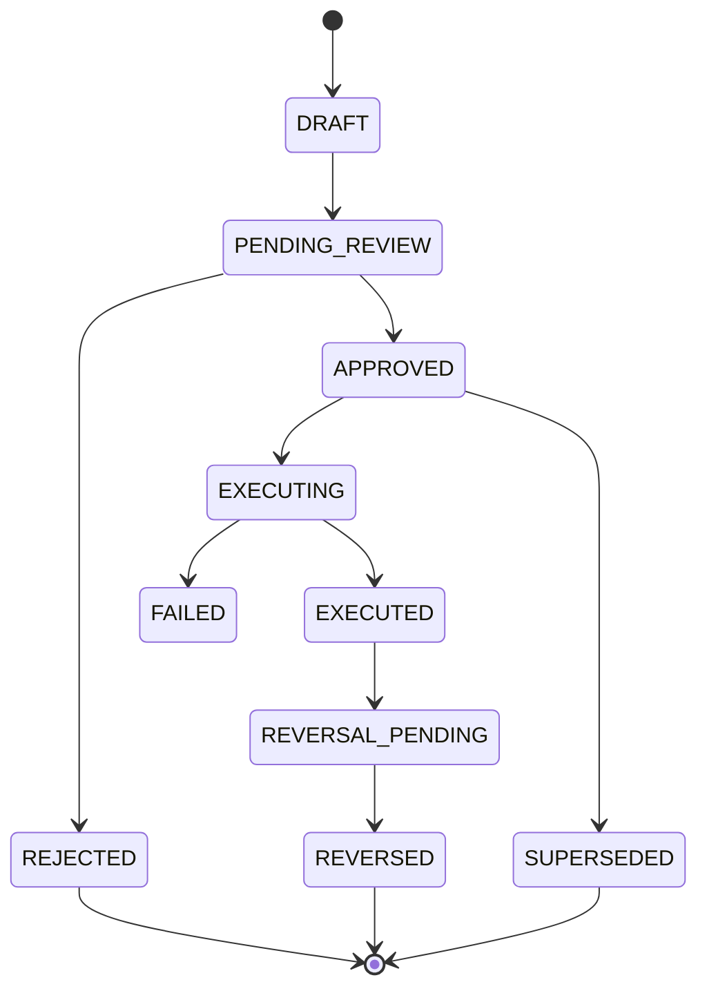
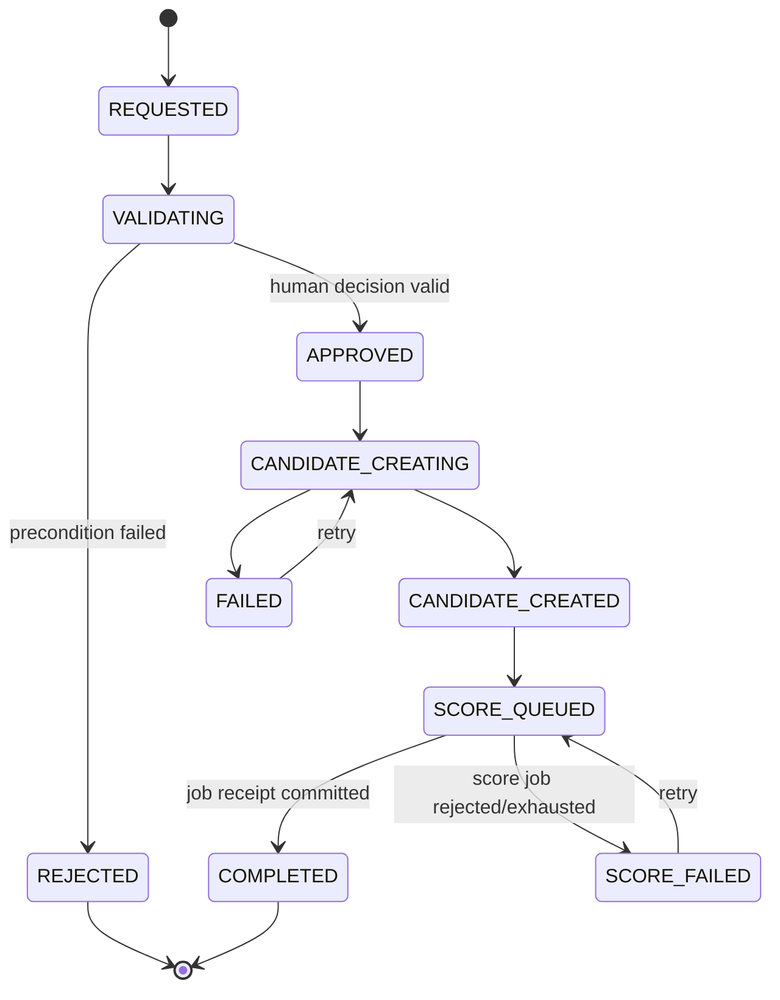

# ODay Plus Assisted Listing Intake Binding State Contracts

This document is normative for `SDI-002`, `SDI-003`, `SDI-005`, `SDI-006`, `SDI-007`, and `SDI-008`. A handler, worker, UI, migration, or test must not introduce a state or transition that is absent here without an approved C3/C4 change.

## 1. Cross-machine mutation contract

Every human or service transition persists:

- `tenant_id`, aggregate ID and aggregate `version_before/version_after`;
- actor/service principal, role, request purpose, correlation and causation IDs;
- `idempotency_key`, request fingerprint, source snapshot/parser run when applicable;
- transition reason, risk acknowledgement, reviewer identity when required;
- append-only transition row, audit event, and transactional outbox event.

Human mutations require `If-Match: W/"<version>"`. Missing tokens return `428 PRECONDITION_REQUIRED`; stale tokens return `409 VERSION_CONFLICT`. Replayed idempotency keys with the same fingerprint return the original receipt; a different fingerprint returns `409 IDEMPOTENCY_KEY_REUSED`.

`QUARANTINED` and `FAILED` are controlled, reopenable states. They are not terminal. Only `READY`, `CANCELLED`, `ARCHIVED`, and `COMPLETED` are terminal where explicitly named.

## 2. Intake processing

| From | To | Initiator / permission | Preconditions | Idempotency / concurrency | Evidence, audit, event | Failure result | Terminal / reopen |
|---|---|---|---|---|---|---|---|
| `[*]` | `SUBMITTED` | Expansion staff or intake API / `intake.submit` | Valid tenant, allowed intake method, URL/manual/CSV/feed envelope valid | Idempotency key required; no prior key conflict | Intake envelope; `intake.submitted.v1` | `422 VALIDATION_FAILED`, `403 SCOPE_DENIED` | Reopenable |
| `SUBMITTED` | `CHECKING_IDENTITY` | Orchestrator / `intake.process` | Intake not cancelled; source evidence retained | Job ID + fencing token | Canonical URL inputs; `intake.identity_check_started.v1` | Stay `SUBMITTED`, job retry | Reopenable |
| `CHECKING_IDENTITY` | `READY` | Identity service / `identity.resolve` | Exact tenant/source/provider ID or canonical URL identity | Intake version + deterministic resolution key | Match evidence; `intake.resolved.v1` | `NEEDS_REVIEW` if contradictory | Terminal |
| `CHECKING_IDENTITY` | `CHECKING_SOURCE_POLICY` | Orchestrator / `source_policy.evaluate` | No exact identity | Intake version | Source host and policy version; `intake.source_policy_started.v1` | `FAILED` on transient platform error | Reopenable |
| `CHECKING_SOURCE_POLICY` | `RETRIEVING` | Policy service / `source.retrieve` | Policy=`APPROVED_RETRIEVAL`, approval unexpired, kill switch off | Policy decision ID + version | Policy decision; `intake.retrieval_approved.v1` | `QUARANTINED` if policy changes | Reopenable |
| `CHECKING_SOURCE_POLICY` | `AWAITING_ASSISTED_ENTRY` | Policy service / `intake.assisted_entry` | Policy permits fallback; no raw credentials requested | Policy decision ID | Policy result; `intake.assisted_entry_required.v1` | `QUARANTINED` if fallback prohibited | Reopenable |
| `CHECKING_SOURCE_POLICY` | `QUARANTINED` | Policy service / `intake.quarantine` | `SOURCE_BLOCKED`, `POLICY_UNKNOWN`, expired license, prohibited source | Policy decision ID | Quarantine reason; `intake.quarantined.v1` | Fail closed | Reopenable by steward/policy |
| `RETRIEVING` | `PARSING` | Retrieval worker / `snapshot.create` | GCS object written, checksum verified, metadata committed | Job fence + snapshot natural key | Snapshot ID/checksum; `snapshot.created.v1`, `intake.parsing_started.v1` | Stay `RETRIEVING` and retry before budget | Reopenable |
| `RETRIEVING` | `FAILED` | Retrieval worker / `job.fail` | Retryable attempts/time budget exhausted | Job attempt token | Error code/checkpoint; `intake.processing_failed.v1` | None | Reopenable by replay authority |
| `RETRIEVING` | `QUARANTINED` | Retrieval/policy / `intake.quarantine` | Auth wall, prohibited content, policy revoked | Intake version | Retrieval evidence; `intake.quarantined.v1` | Fail closed | Reopenable |
| `AWAITING_ASSISTED_ENTRY` | `PARSING` | Expansion staff / `intake.correct` | Required fields or approved HTML snapshot provided; reason for identity/commercial correction | If-Match + idempotency | Correction set; `intake.assisted_entry_completed.v1` | `422 CORRECTION_INVALID` | Reopenable |
| `PARSING` | `MATCHING` | Parser worker / `parser.execute` | Active parser release, schema compatible, required output valid | Parser run ID + snapshot ID | Parser run/output lineage; `parser.run_completed.v1`, `intake.matching_started.v1` | `FAILED` or `NEEDS_REVIEW` | Reopenable |
| `PARSING` | `NEEDS_REVIEW` | Parser worker / `intake.route_review` | Partial output or confidence below field threshold | Parser run ID | Field confidence warnings; `intake.review_required.v1` | None | Reopenable |
| `PARSING` | `FAILED` | Parser worker / `job.fail` | Non-retryable parser defect or retry exhaustion | Job fence | Error/checkpoint; `intake.processing_failed.v1` | None | Reopenable |
| `MATCHING` | `READY` | Matcher or reviewer / `identity.decide` | Outcome NEW, EXACT_DUPLICATE, or unambiguous REVISION; persistence transaction committed | Match case version; decision idempotency | Match case/decision; `match.decided.v1`, `intake.resolved.v1` | `NEEDS_REVIEW` on conflict | Terminal |
| `MATCHING` | `NEEDS_REVIEW` | Matcher / `identity.review` | `POSSIBLE_MATCH` or contradictory evidence | Match case ID/version | Candidates/evidence; `match.review_required.v1` | None | Reopenable |
| `MATCHING` | `QUARANTINED` | Matcher/steward / `intake.quarantine` | Invalid/unsafe identity evidence | Match case version | Reason/evidence; `intake.quarantined.v1` | Fail closed | Reopenable |
| `NEEDS_REVIEW` | `READY` | Expansion manager or data steward / `identity.decide` | Authorized explicit human decision; second actor where required | If-Match + decision idempotency | Decision before/after/reason; `match.decided.v1`, `intake.resolved.v1` | `409 REVIEW_CONFLICT` | Terminal |
| `NEEDS_REVIEW` | `QUARANTINED` | Manager/steward / `intake.quarantine` | Quarantine reason selected | If-Match + idempotency | Decision reason; `intake.quarantined.v1` | No optimistic update | Reopenable |
| `QUARANTINED` | `CHECKING_SOURCE_POLICY` | Data steward / `intake.reopen` | Policy defect corrected or approval renewed | If-Match + second review for high risk | Reopen reason/policy; `intake.reopened.v1` | Remain quarantined | Reopenable |
| `QUARANTINED` | `NEEDS_REVIEW` | Data steward / `intake.reopen` | Data defect correctable; evidence preserved | If-Match | Reopen reason; `intake.reopened.v1` | Remain quarantined | Reopenable |
| `FAILED` | `RETRIEVING` or `PARSING` | Data steward/operator / `job.replay` | Retry checkpoint exists, source policy still permits, retry budget authorized | Replay key + job fence | Replay receipt; `job.replay_requested.v1` | Remain failed | Reopenable |
| `SUBMITTED`,`AWAITING_ASSISTED_ENTRY`,`NEEDS_REVIEW` | `CANCELLED` | Submitter/manager / `intake.cancel` | No executed identity/promotion decision | If-Match + idempotency | Cancel reason; `intake.cancelled.v1` | `409 CANNOT_CANCEL` | Terminal |

## 3. Listing lifecycle

| From | To | Initiator / permission | Preconditions | Idempotency / concurrency | Evidence, audit, event | Failure | Terminal / reopen |
|---|---|---|---|---|---|---|---|
| `[*]` | `ACTIVE` | Listing service / `listing.create` | Resolved NEW; revision 1 and source identity committed | Listing natural key + transaction version | Revision/snapshot/parser; `listing.created.v1` | Rollback transaction | Reopenable |
| `ACTIVE` | `ACTIVE` | Listing service / `listing.revise` | Material fingerprint changed; same listing identity | Listing version + revision fingerprint | Immutable revision; `listing.revised.v1` | `409 VERSION_CONFLICT` | Reopenable |
| `ACTIVE` | `REMOVED` | Observation worker/steward / `listing.observe` | Source explicitly removed and evidence captured | Observation natural key | Observation/snapshot; `listing.status_changed.v1` | Stay active on uncertain evidence | Reopenable |
| `ACTIVE` | `EXPIRED` | Scheduler/steward / `listing.observe` | Contractual expiry reached | Listing version | Observation; `listing.status_changed.v1` | Retry scheduler | Reopenable |
| `ACTIVE` | `STALE` | Freshness scheduler / `listing.observe` | `last_observed_at` exceeds source threshold | Deterministic threshold run | Observation; `listing.status_changed.v1` | Alert only | Reopenable |
| `ACTIVE` | `QUARANTINED` | Steward/governance / `listing.quarantine` | Invalid, prohibited, unsafe, or identity conflict; reason required | If-Match + idempotency | Decision/evidence; `listing.quarantined.v1` | No optimistic update | Reopenable |
| `REMOVED`,`EXPIRED`,`STALE` | `ACTIVE` | Listing service/reviewer / `listing.revise` | New snapshot proves relisted/current; new revision kind=`RELISTED` | Listing version + snapshot | Revision; `listing.relisted.v1` | Remain prior state | Reopenable |
| `QUARANTINED` | `ACTIVE` | Data steward + independent manager / `listing.reopen` | Defect resolved, second actor, reason/risk ack | If-Match + decision idempotency | Reopen decision; `listing.reopened.v1` | Remain quarantined | Reopenable |
| Any non-archived | `ARCHIVED` | Records manager/governance / `listing.archive` | No legal hold; retention/operational prerequisites met | If-Match + archive key | Archive reason; `listing.archived.v1` | `409 LEGAL_HOLD_CONFLICT` | Terminal |

## 4. Identity graph and reversible resolution

### 4.1 Graph rules

- Source snapshots, source identities, listing revisions, and historical edges are immutable.
- `SourceIdentityEdge(edge_id, tenant_id, source_id, source_entity_id, listing_id, property_id, effective_from, effective_to, supersedes_edge_id, decision_id, edge_version)` records the complete history.
- Exactly one effective edge exists for `(tenant_id, source_id, source_entity_id)` using a partial unique index where `effective_to IS NULL`.
- `PropertyRedirect(from_property_id, to_property_id, decision_id, effective_from, reversed_at)` provides canonical resolution after merge. Redirect cycles are rejected by a recursive CTE check inside the serializable identity transaction.
- Reads resolve references through the current effective edge plus redirects; audit/history queries may request `as_of` time and return the historical target.
- Downstream Listing retains its original `property_id_at_creation`; current reads additionally expose `effective_property_id`. Candidate references are never rewritten silently: merge/split operations create explicit candidate reassignment decisions or leave the candidate bound to the historical property until reviewed.

| From | To | Initiator / permission | Preconditions | Idempotency / concurrency | Evidence, audit, event | Failure | Terminal / reopen |
|---|---|---|---|---|---|---|---|
| `[*]` | `PROPOSED` | Matcher/steward / `identity.propose` | Match evidence and candidate set persisted | Case natural key | Signals/conflicts; `match.case_created.v1` | None | Reopenable |
| `PROPOSED` | `APPROVED` | Identity service / `identity.decide_exact` | Confidence 1.0 exact source key; no contradictory effective edge | Match case version | Decision; `match.decided.v1` | Route pending review | Reopenable |
| `PROPOSED` | `PENDING_REVIEW` | Matcher / `identity.review` | Possible match, merge, split, unmerge, or identity-affecting correction | Match case version | Evidence; `match.review_required.v1` | None | Reopenable |
| `PENDING_REVIEW` | `APPROVED` | Expansion manager/data steward / `identity.decide` | Reason; risk ack for merge/split/unmerge; actor differs from proposer | If-Match + idempotency | Before/after graph plan; `match.decided.v1` | `403 SELF_REVIEW_DENIED` | Reopenable |
| `PENDING_REVIEW` | `REJECTED` | Reviewer / `identity.decide` | Reason required | If-Match | Decision; `match.rejected.v1` | Conflict leaves pending | Terminal |
| `APPROVED` | `EXECUTING` | Identity service / `identity.execute` | Decision not expired/reversed; all target versions match | Decision ID as idempotency key | Execution plan; `identity.execution_started.v1` | Return approved for retry | Reopenable |
| `EXECUTING` | `EXECUTED` | Identity service / `identity.execute` | Serializable transaction closes prior edges, creates effective edges/redirects, updates resolution indexes, writes audit/outbox | Row locks + aggregate versions | Edge/redirect receipts; `identity.resolution_changed.v1` | Full SQL rollback | Reopenable via reversal |
| `EXECUTING` | `FAILED` | Identity service / `identity.execute` | Transaction/dependency failure | Attempt token | Failure receipt; `identity.execution_failed.v1` | No partial graph visible | Reopenable |
| `EXECUTED` | `REVERSAL_PENDING` | Steward/manager / `identity.unmerge` | Original decision/evidence available; no unresolved dependent mutation; reason/risk ack | Graph version + reversal key | Reversal plan; `identity.reversal_requested.v1` | `409 DEPENDENCY_CONFLICT` | Reopenable |
| `REVERSAL_PENDING` | `REVERSED` | Independent reviewer + identity service / `identity.unmerge` | Second actor approval; cycle-free replacement graph | Serializable transaction + fencing | Superseding edges/redirect closure; `identity.resolution_reversed.v1` | Full rollback; remain pending | Terminal |
| `FAILED` | `PENDING_REVIEW` | Data steward / `identity.retry` | Root cause resolved | If-Match + replay key | Retry receipt; `identity.execution_retry_requested.v1` | Remain failed | Reopenable |

## 5. Assignment and SLA

| From | To | Initiator / permission | Preconditions | Idempotency / concurrency | Evidence, audit, event | Failure | Terminal / reopen |
|---|---|---|---|---|---|---|---|
| `[*]` | `UNASSIGNED` | Intake service / `assignment.create` | Intake created; routing context persisted | Intake ID | Queue reason; `assignment.created.v1` | None | Reopenable |
| `UNASSIGNED` | `ASSIGNED` | Manager/router / `assignment.assign` | Assignee in tenant/scope; due time calculated from policy/calendar | If-Match + assignment key | Owner/due/policy; `assignment.assigned.v1` | `409 OWNER_CONFLICT` | Reopenable |
| `ASSIGNED` | `CLAIMED` | Assignee / `assignment.claim` | Principal equals assignee; not transferred/completed | If-Match | Claim time; `assignment.claimed.v1` | Conflict | Reopenable |
| `ASSIGNED`,`CLAIMED` | `TRANSFERRED` | Owner/manager / `assignment.transfer` | Target authorized; handoff note required | If-Match + transfer key | Before/after owner; `assignment.transferred.v1` | Stay prior owner | Reopenable |
| `TRANSFERRED` | `ASSIGNED` | Target owner/router / `assignment.accept` | Transfer current and target active | If-Match | Acceptance; `assignment.assigned.v1` | Remain transferred | Reopenable |
| `ASSIGNED`,`CLAIMED` | `ESCALATED` | SLA worker/manager / `assignment.escalate` | `now >= due_at` or policy breach; pause excluded | Deterministic SLA instance/version | Breach calculation; `sla.breached.v1`, `assignment.escalated.v1` | Retry worker; no duplicate escalation | Reopenable |
| `ESCALATED` | `CLAIMED` | Escalation owner / `assignment.claim` | Authorized escalation queue | If-Match | Claim; `assignment.claimed.v1` | Conflict | Reopenable |
| `CLAIMED`,`ESCALATED` | `COMPLETED` | Owner/manager / `assignment.complete` | Required decision/correction/review completed | If-Match + completion key | Completion receipt; `assignment.completed.v1`, `sla.completed.v1` | `409 WORK_INCOMPLETE` | Terminal |

SLA state is derived and persisted from authoritative `due_at`, business calendar, pause intervals, and escalation policy: `ON_TRACK -> DUE_SOON -> OVERDUE -> BREACHED -> COMPLETED`; `PAUSED` may enter only with an approved pause reason and resume timestamp. Derived state changes emit `sla.state_changed.v1` once per SLA version.

## 6. Decision review, execution, and reversal

High-impact decisions (`MERGE`, `SPLIT`, `UNMERGE`, identity-affecting correction, quarantine release, promotion, purge, legal-hold release) require proposer/reviewer segregation. Self-review returns `403 SELF_REVIEW_DENIED`. Emergency administration may only restore availability, never approve a business outcome; it requires incident ID, two-person authorization, 24-hour expiry, and retrospective governance review.

## 7. Candidate promotion and SiteScore saga

| From | To | Initiator / permission | Preconditions | Idempotency / concurrency | Evidence, audit, event | Failure / compensation | Terminal / reopen |
|---|---|---|---|---|---|---|---|
| `[*]` | `REQUESTED` | Expansion staff / `candidate.promote` | Intake `READY`; listing active; candidate gate satisfied | Promotion idempotency key | Request/reason; `candidate.promotion_requested.v1` | Validation response | Reopenable |
| `REQUESTED` | `VALIDATING` | Promotion service / `candidate.validate` | Decision row persisted | Promotion version | Validation snapshot; `candidate.promotion_validating.v1` | Stay requested | Reopenable |
| `VALIDATING` | `REJECTED` | Promotion service/reviewer / `candidate.reject` | Missing property/address/rent/area/H3/geocode, duplicate candidate, or authorization denial | Promotion version | Failure codes; `candidate.promotion_rejected.v1` | No candidate created | Terminal |
| `VALIDATING` | `APPROVED` | Expansion manager / `candidate.approve` | Explicit human decision, reason, independent reviewer when proposer high risk | If-Match + idempotency | Decision/evidence; `candidate.promotion_approved.v1` | Remain validating | Reopenable |
| `APPROVED` | `CANDIDATE_CREATING` | Promotion service / `candidate.execute` | Listing/property versions unchanged; unique candidate slot available | Decision ID + transaction fence | Execution start; `candidate.creation_started.v1` | Return approved for retry | Reopenable |
| `CANDIDATE_CREATING` | `CANDIDATE_CREATED` | Promotion service / `candidate.execute` | Single SQL transaction creates candidate, links decision, writes audit/outbox | Partial unique index `(tenant,property,target_format)` + version | Candidate receipt; `candidate.created.v1` | Full rollback; no partial candidate | Reopenable |
| `CANDIDATE_CREATING` | `FAILED` | Promotion service / `candidate.execute` | SQL/dependency failure | Attempt token | Failure receipt; `candidate.creation_failed.v1` | Candidate absent or transaction rolled back | Reopenable |
| `CANDIDATE_CREATED` | `SCORE_QUEUED` | Promotion service / `sitescore.execute` | Candidate visible and gate snapshot retained | Deterministic score request key | Job receipt; `sitescore.requested.v1` | Candidate remains; score may retry | Reopenable |
| `SCORE_QUEUED` | `COMPLETED` | SiteScore worker / `sitescore.execute` | Job accepted/committed; promotion receipt contains candidate and score job IDs | Job ID/fence | Authoritative receipt; `candidate.promotion_completed.v1` | None | Terminal |
| `SCORE_QUEUED` | `SCORE_FAILED` | SiteScore worker / `job.fail` | Retry budget exhausted or permanent validation error | Job attempt token | Error/checkpoint; `sitescore.failed.v1` | Candidate remains `SCORING_FAILED`; no deletion | Reopenable |
| `FAILED`,`SCORE_FAILED` | prior execution state | Expansion manager/data steward / `job.replay` | Root cause fixed, versions still valid, replay authorized | Replay idempotency + fence | Replay receipt; `job.replay_requested.v1` | Remain failed | Reopenable |

Authoritative promotion success is `201 PromotionReceipt` containing `promotion_decision_id`, `candidate_site_id`, `site_score_job_id`, aggregate versions, audit event ID, and correlation ID. A lost HTTP response is recovered by replaying the same idempotency key or querying the decision; neither creates a second candidate.
