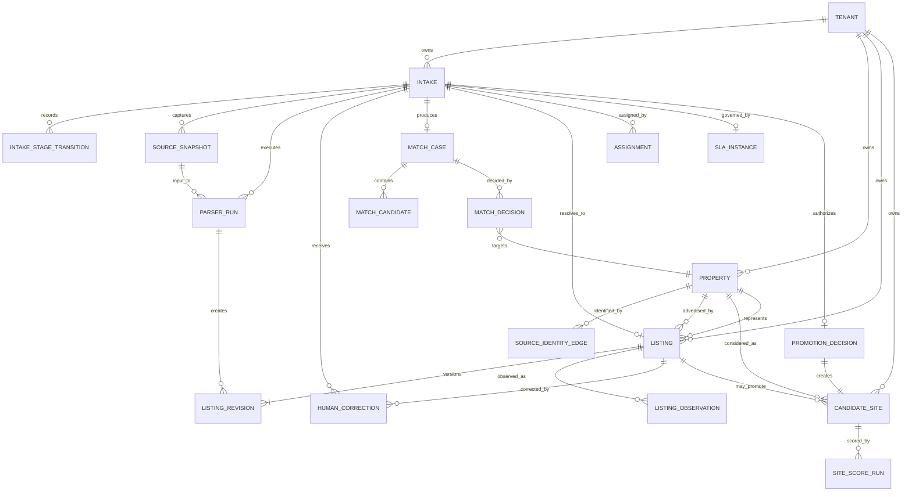
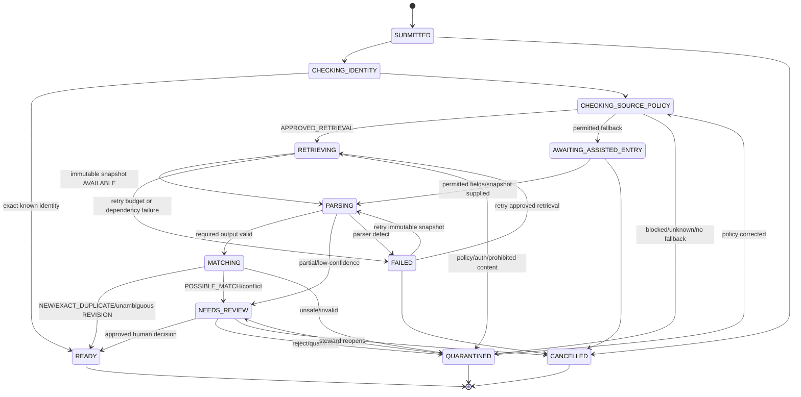
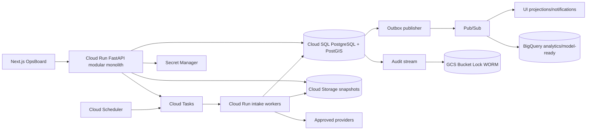

# ODay Plus Assisted Listing Intake System Design Response

## 1. Executive Decision

System Design accepts the Assisted Listing Intake product boundary and approves a target architecture that extends the current `dev` modular-monolith baseline.

The target production topology is:

- **Cloud SQL PostgreSQL 16 + PostGIS** for transactional state, identity, revisions, decisions, assignments, idempotency, jobs, outbox, and audit index.
- **Cloud Storage** for immutable raw/redacted source snapshots and WORM evidence.
- **Cloud Tasks** for command/job delivery and retry scheduling.
- **Pub/Sub** for versioned domain events published through a transactional outbox.
- **Secret Manager** for provider credentials; product APIs and UI never accept or expose provider credentials, cookies, bearer tokens, or private endpoints.
- **Cloud Run** for API, workers, publisher, and scheduled reconciliation workloads.

The current implementation is retained as implementation evidence, but the following target changes are binding:

1. `ListingPipeline` must no longer create `CandidateSiteDraft` automatically after hard-rule success. Candidate promotion is a separate, explicit, authorized, audited human decision.
2. Intake stage, listing lifecycle, match outcome, assignment/SLA, decision state, and job state are separate state models.
3. Property identity must not include rent. A rent-only change is a `ListingRevision`, not a new property.
4. Exact source-key resolution remains a primitive; ambiguous property identity requires a persisted `MatchCase` and human `MatchDecision`.
5. Memory and SQLite remain unit/local/fixture/Product-E2E adapters only. They are not production topology.
6. Provider registry, RBAC/ABAC, audit, idempotency, canonical schemas, and the GCP execution baseline are extended rather than replaced.

### 1.1 Non-negotiable release gates

- Unknown, expired, unauthorized, unlicensed, kill-switched, or prohibited sources fail closed.
- Intake starts only from URL, manual entry, CSV, approved feed, or approved operator snapshot. No continuous result-page crawling or third-party listing-ID enumeration.
- `POSSIBLE_MATCH` is never auto-merged.
- Candidate promotion always requires an explicit human decision.
- Merge, split, unmerge, reject, quarantine, identity-affecting correction, and promotion are non-optimistic, attributable, idempotent, version-checked, and auditable.
- Tenant, brand, region, assigned area, role, workflow state, field sensitivity, source policy, and risk are enforced by backend policy.
- Production rollout is blocked until Cloud SQL, snapshot storage, Cloud Tasks, Pub/Sub outbox publication, backup/PITR, audit WORM, monitoring, and restore drills are proven.

## 2. Context and Constraints

### 2.1 Normative sources

This response uses the `dev` branch as the implementation baseline and responds to:

- `docs/design/ODAY_PLUS_ASSISTED_LISTING_INTAKE_SYSTEM_DESIGN_ALIGNMENT_REQUEST.md`
- `docs/design/ODAY_PLUS_ASSISTED_LISTING_INTAKE_DESIGN_REQUIREMENTS.md`
- `docs/design/ODAY_PLUS_EXPANSION_WORKFLOW_BLUEPRINT.md`
- `docs/design/ODAY_PLUS_NAVIGATION_AND_WORKFLOW_SPEC.md`
- `docs/design/ODAY_PLUS_COMPONENT_CONTRACTS.md`
- `docs/evidence/fleet_dispatch/ODP-EXT-002-R5-ADDENDUM.md`
- `docs/evidence/fleet_dispatch/ODP-EXT-002.md`
- `docs/data/ODAY_PLUS_CANONICAL_SCHEMA_BASELINE.md`
- `docs/architecture/ODAY_PLUS_EXECUTION_BASELINE.md`

Existing code and tests are evidence, not architecture authority. Where current behavior conflicts with this document, this document is the target contract and section 10 defines migration and compatibility.

### 2.2 Architecture style

The feature remains inside the ODay Plus modular monolith for transactional ownership, with separately deployable workers for retrieval, parsing, matching, reconciliation, SLA processing, and event publication. A later ADR is required before extracting a separately owned service.

## 3. Canonical Domain and ERD

### 3.1 Aggregate ownership

| Aggregate / record | Purpose | Authoritative owner | Production store | Required scope keys |
|---|---|---|---|---|
| `Intake` | One submitted URL/manual/CSV/feed item and durable processing state | Listing Intake application service | Cloud SQL `expansion.intakes` | `tenant_id`, optional `brand_id`, `region_id`, `assigned_area_id`, `heat_zone_id` |
| `IntakeStageTransition` | Append-only processing history | Listing Intake service | Cloud SQL | `tenant_id`, `intake_id` |
| `Property` | Canonical physical premises identity | Identity Resolution service | Cloud SQL `identity.properties` | `tenant_id`, optional `region_id` |
| `SourceIdentityEdge` | Effective source identity/canonical URL mapping | Identity Resolution service | Cloud SQL | `tenant_id`, `source_id` |
| `MatchCase` | Machine-proposed exact/probable/ambiguous matches | Identity Resolution service | Cloud SQL | `tenant_id`, `intake_id` |
| `MatchDecision` | Human create/revise/duplicate/merge/split/unmerge decision | Identity Resolution service | Cloud SQL | `tenant_id`, `match_case_id` |
| `Listing` | One source advertisement identity | Listing service | Cloud SQL `expansion.listings` | `tenant_id`, `source_id`, optional `property_id` |
| `ListingRevision` | Immutable material content version | Listing service | Cloud SQL | `tenant_id`, `listing_id` |
| `ListingObservation` | Freshness/removal/unchanged observation | Listing service | Cloud SQL | `tenant_id`, `listing_id` |
| `SourceSnapshot` | Raw/redacted immutable source evidence metadata | External Data service | Cloud SQL metadata + GCS objects | `tenant_id`, `source_id`, `intake_id` |
| `ParserRun` | Parser release, input snapshot, lineage, output and quality | External Data service | Cloud SQL | `tenant_id`, `source_id`, `intake_id` |
| `HumanCorrection` | Field-level proposed/applied correction | Listing service; identity-affecting corrections reviewed by Identity service | Cloud SQL | `tenant_id`, `intake_id`, optional `listing_id` |
| `Assignment` | Current/historical queue ownership | Workflow service | Cloud SQL | `tenant_id`, `intake_id` |
| `SlaInstance` | Persisted due time and escalation state | Workflow service | Cloud SQL | `tenant_id`, `intake_id` |
| `PromotionDecision` | Human authorization to create a candidate | Candidate Promotion boundary | Cloud SQL | `tenant_id`, `intake_id`, `listing_id` |
| `CandidateSite` | Human-promoted expansion candidate | Candidate Promotion boundary | Cloud SQL | `tenant_id`, `property_id`, `target_format_code` |
| `IdempotencyRecord` | Request fingerprint and replayable response | API platform | Cloud SQL | `tenant_id`, `actor_id`, `operation` |
| `Job` | Durable asynchronous execution and retry | Workflow/jobs platform | Cloud SQL + Cloud Tasks | `tenant_id`, `aggregate_id` |
| `OutboxEvent` | Transactional publication record | Owning transaction | Cloud SQL | `tenant_id`, `aggregate_id` |
| `AuditEvent` | Immutable business/security audit | Audit platform | Cloud SQL append-only + GCS WORM | `tenant_id`, `actor_id`, `resource_id` |

### 3.2 Canonical ERD



### 3.3 Identity, cardinality, and revision rules

- All public aggregate IDs are opaque UUIDs generated by the authoritative service.
- `tenant_id` is `NOT NULL` on every business, workflow, snapshot, job, outbox, idempotency, and audit record.
- A `Property` can have many source `Listing` records.
- A `Listing` has one current revision pointer and one or more immutable revisions.
- An `Intake` resolves to zero or one listing; each CSV row becomes an independent intake.
- Only one non-terminal candidate is allowed for `(tenant_id, property_id, target_format_code)`.
- Original source records and snapshots are immutable. Corrections produce `HumanCorrection` plus a new revision.

A new `ListingRevision` is created when normalized address/property identity, status, rent/price, currency, deposit/fee, area, floor, frontage, parking, utilities, availability, description-derived feasibility flags, or a corrected identity field changes.

A `ListingObservation` is created when the material fingerprint is unchanged, freshness is refreshed, a page is unavailable/blocked, or a removed/stale state is observed without material content change.

`REVISED` is not a lifecycle state. `RELISTED` is a revision kind plus a transition back to `ACTIVE`.

## 4. State Machines

### 4.1 Intake processing



Every transition persists actor/service principal, reason, correlation/causation IDs, job ID, idempotency key, source-policy version, parser version, snapshot ID, match-case ID, expected version, resulting version, and timestamps.

Illegal transitions return `409 INTAKE_TRANSITION_CONFLICT`. Human mutations require `If-Match`; missing precondition returns `428 PRECONDITION_REQUIRED`.

Timeouts remain job state, not fake product stages. The intake stays at the current stage while the job exposes attempts, retry-after, and last error. Retry exhaustion transitions to `FAILED` or `QUARANTINED` by error class.

### 4.2 Independent state models

Source policy:

- `APPROVED_RETRIEVAL`
- `ASSISTED_ENTRY_ONLY`
- `AUTH_REQUIRED`
- `SOURCE_BLOCKED`
- `POLICY_UNKNOWN`

Match outcome:

- `NEW`
- `EXACT_DUPLICATE`
- `REVISION`
- `POSSIBLE_MATCH`
- `QUARANTINED`

Listing lifecycle:

- `ACTIVE`
- `REMOVED`
- `EXPIRED`
- `STALE`
- `QUARANTINED`
- `ARCHIVED`

Assignment:

- `UNASSIGNED`
- `ASSIGNED`
- `CLAIMED`
- `TRANSFERRED`
- `ESCALATED`
- `COMPLETED`

SLA:

- `ON_TRACK`
- `DUE_SOON`
- `OVERDUE`
- `BREACHED`
- `PAUSED`
- `COMPLETED`

Decision status:

- `DRAFT`
- `PENDING_REVIEW`
- `APPROVED`
- `REJECTED`
- `EXECUTED`
- `REVERSED`
- `SUPERSEDED`

### 4.3 Match classification

- `EXACT_DUPLICATE`: same tenant + source + stable provider listing ID, or same tenant + source + canonical URL hash. Confidence `1.00`.
- `REVISION`: exact source identity, or exact normalized address with compatible floor/type, geocode distance <= 30 m, area difference <= max(1 ping, 5%), and no contradictory signal. Confidence >= `0.95`.
- `POSSIBLE_MATCH`: address similarity >= `0.92` or geocode distance <= 50 m, area difference <= 10%, no hard contradiction; confidence `0.70–0.9499`. Always human review.
- `NEW`: no exact identity and best property score < `0.70`, with valid source and required fields.
- `QUARANTINED`: source/integrity/policy failure or unresolved unsafe identity.

Rent is revision evidence, never property identity.

### 4.4 Human decision requirements

Decision types:

- `CREATE_LISTING`
- `APPEND_REVISION`
- `MARK_DUPLICATE`
- `QUARANTINE`
- `REJECT`
- `REOPEN`
- `MERGE_PROPERTY`
- `SPLIT_PROPERTY`
- `UNMERGE_PROPERTY`
- `PROMOTE_CANDIDATE`

Reason is mandatory for identity-affecting correction, override, quarantine, rejection, merge/split/unmerge, and promotion. Merge, split, unmerge, low-confidence identity override, and promotion after an identity override require risk acknowledgement and an independent second actor.

No decision is displayed as complete until the authoritative backend transaction returns.

### 4.5 Assignment and SLA

- Only one active assignment exists per intake.
- Assign, claim, transfer, and completion use compare-and-swap on aggregate version.
- Transfer closes the prior assignment and creates a new record; history is never overwritten.
- Due time is calculated from versioned SLA policy and business calendar; absolute `due_at` is persisted.
- Pause is allowed only for assisted entry, legal approval, or configured source dependency; reason and expected resume time are required.
- Browser timers do not determine breach. The SLA scheduler persists breach and escalation events.

Initial design targets:

- ambiguous match assignment <= 30 business minutes;
- possible-match decision <= 8 business hours;
- quarantine/source-policy review <= 1 business day;
- `POLICY_UNKNOWN` escalates at 4 business hours.

### 4.6 Candidate promotion transaction

Candidate promotion is one Cloud SQL transaction:

1. Authorize `PROMOTE` against RBAC, tenant/region/area scope, workflow state, field policy, source policy, risk, and segregation rules.
2. Validate `If-Match`, intake `READY`, allowed match outcome, listing lifecycle, evidence completeness, hard-rule status/override, and unique active candidate constraint.
3. Require an approved match decision where applicable.
4. Insert `PromotionDecision`.
5. Insert `CandidateSite`.
6. Update aggregate links/versions.
7. Insert audit and outbox events.
8. Commit.

SiteScore execution is asynchronous. Outbox or task-delivery failure does not roll back the candidate; the score remains `PENDING` and is replayable.

Same idempotency key + same fingerprint returns the original candidate, decision, and job IDs. Same key + different fingerprint returns `409 IDEMPOTENCY_KEY_REUSED`.

## 5. Source and Parser Control Plane

### 5.1 Source registry

The existing provider registry becomes a persisted, versioned control plane with:

```text
source_id
source_version
source_name
category
allowed_hosts[]
allowed_path_patterns[]
canonicalization_policy_version
retrieval_mode
approved_methods[]
legal_approval_status
legal_owner_id
approved_at
review_expires_at
license_attribution
allowed_downstream_uses[]
export_allowed
credential_reference_names[]
rate_limit_policy
concurrency_limit
kill_switch_state
kill_switch_owner_id
default_parser_release_id
policy_version
created_at
updated_at
```

Rules:

- HTTPS and registered host/path are required.
- Unknown source/method, expired/revoked approval, kill switch, missing service credential, or prohibited production use fails closed.
- Original URL and canonical URL remain distinct.
- Product UI/API never accepts provider credentials.
- Platform administrators cannot override legal/source policy through frontend visibility.

### 5.2 Parser registry

Parser release fields:

```text
parser_release_id
parser_name
parser_version
artifact_uri
artifact_sha256
source_id
input_contract_version
output_contract_version
supported_content_types[]
test_corpus_uri
test_corpus_sha256
validation_report_uri
release_status
canary_tenant_ids[]
canary_percentage
rollback_release_id
released_by
approved_by
released_at
deprecated_at
```

Lifecycle:

```text
DRAFT -> VALIDATED -> CANARY -> ACTIVE -> DEPRECATED
                      |          |
                      v          v
                  ROLLED_BACK <- BLOCKED
```

Reprocessing creates a new `ParserRun`; it creates a listing revision only when material normalized content changes.

### 5.3 Snapshot/provenance

Cloud SQL stores metadata; GCS stores immutable bytes.

Required metadata includes snapshot ID, tenant/intake/source IDs, encrypted original URL, canonical URL, capture mode, raw/redacted object URIs and generations, content type/length, checksums, observed/captured/ingested times, source-policy decision/version, parser eligibility, retention class, classification, status, and service principal.

Publication protocol:

1. insert `PENDING_UPLOAD` metadata;
2. upload with create-only generation precondition and CMEK;
3. verify checksum/content limits;
4. mark `AVAILABLE` and publish outbox event;
5. reconcile orphan metadata/objects.

Human corrections never mutate source evidence.

## 6. APIs, Events, and Jobs

### 6.1 Common API contract

Base path: `/api/v1/expansion`

Mutation headers:

- `Authorization`
- `X-Correlation-Id`
- `Idempotency-Key`
- `If-Match` for versioned/high-impact mutations

Response headers:

- `X-Correlation-Id`
- `ETag`
- `Location`
- `Retry-After` where applicable

Canonical error envelope:

```json
{
  "error": {
    "code": "VERSION_CONFLICT",
    "message": "The intake changed after it was loaded.",
    "correlation_id": "corr-...",
    "occurred_at": "2026-07-16T12:00:00Z",
    "retryable": false,
    "current_version": 7,
    "field_errors": [],
    "details": {"changed_fields": ["stage", "owner_id"]}
  }
}
```

Tenant and principal are derived from the token; clients cannot select another tenant.

### 6.2 Required endpoints

| Method/path | Purpose |
|---|---|
| `POST /intakes` | URL/manual single intake |
| `POST /intake-batches` | CSV/feed batch and upload receipt |
| `POST /intake-batches/{batchId}:finalize` | Validate/enqueue rows with partial success |
| `GET /intakes` | Listing Inbox query |
| `GET /intakes/{intakeId}` | Intake detail/state timeline |
| `POST /intakes/{intakeId}:assisted-entry` | Submit permitted manual fields/snapshot reference |
| `POST /intakes/{intakeId}/corrections` | Propose/apply correction |
| `POST /intakes/{intakeId}/decisions` | Create/revise/duplicate/quarantine/reject/reopen |
| `POST /intakes/{intakeId}:retry` | Retry from persisted checkpoint |
| `PUT /intakes/{intakeId}/assignment` | Assign/transfer |
| `POST /intakes/{intakeId}:claim` | Claim eligible work |
| `POST /intakes/{intakeId}:promote` | Human candidate promotion |
| `GET /listings/{listingId}` | Listing detail |
| `GET /listings/{listingId}/revisions` | Revision history |
| `GET /properties/{propertyId}/identity-graph` | Effective identity graph |
| `POST /match-cases/{caseId}:merge` | Merge |
| `POST /match-cases/{caseId}:split` | Split |
| `POST /match-cases/{caseId}:unmerge` | Reverse merge |
| `GET /jobs/{jobId}` | Job state/attempt/error |
| `POST /jobs/{jobId}:cancel` | Cancellation request |

### 6.3 Unified intake envelope

Common fields are method, client request ID, source URL/source ID, tenant-bound context, optional requested owner, and optional manual payload.

- URL: original URL required; server resolves source and canonical URL.
- Manual: required fields in manual payload; source is `manual.operator`.
- CSV: batch endpoint; every row is an independent intake.
- Approved feed: service identity only; source/snapshot IDs required.
- Operator snapshot: approved object reference only; credentials/session content rejected.

Batch maximum is 5,000 rows. Partial success is allowed; failed rows do not roll back accepted rows.

### 6.4 Listing Inbox query

Supported filters:

```text
stage
match_outcome
source_policy_state
intake_method
source_id
submitted_by
owner_id
assigned_area_id
heat_zone_id
needs_review
sla_state
freshness_state
updated_after
updated_before
q
saved_view_id
```

- Default order: `submitted_at DESC, intake_id DESC`.
- Cursor binds sort tuple, filter hash, tenant, field policy, and `as_of` time.
- New records after `as_of` do not shift subsequent pages.
- Limit default 50, maximum 100.
- Initial search uses PostgreSQL FTS/trigram; no external search cluster until capacity/SLO evidence requires it.
- Field masking occurs before serialization.

### 6.5 Idempotency/concurrency

Scope:

```text
(tenant_id, actor_or_service_id, method, route_template, idempotency_key)
```

Stored data includes request fingerprint, original response, aggregate IDs, and expiry.

- Normal mutations: 7-day replay window.
- High-impact decisions/promotion: 30-day replay window; permanent decision/audit remains.
- Same key/same fingerprint returns original response.
- Same key/different fingerprint returns `409`.
- Aggregate version is integer; ETag is `W/"<version>"`.

### 6.6 Domain events

Key versioned events:

- `expansion.intake.submitted.v1`
- `expansion.intake.stage_changed.v1`
- `external.source_policy.evaluated.v1`
- `external.snapshot.captured.v1`
- `external.parser.completed.v1`
- `expansion.identity.match_proposed.v1`
- `expansion.identity.decision_recorded.v1`
- `expansion.listing.created.v1`
- `expansion.listing.revision_appended.v1`
- `expansion.listing.observed.v1`
- `expansion.intake.quarantined.v1`
- `expansion.assignment.changed.v1`
- `expansion.sla.breached.v1`
- `expansion.candidate.promoted.v1`
- `expansion.sitescore.requested.v1`
- `audit.high_impact_action.recorded.v1`

Outbox row commits with the aggregate. Pub/Sub delivery is at least once with ordering key `tenant_id:aggregate_id`; consumers deduplicate by event ID.

### 6.7 Job contract

Cloud Tasks delivers commands; Cloud SQL is authoritative.

Job state:

- `QUEUED`
- `RUNNING`
- `SUCCEEDED`
- `FAILED`
- `CANCEL_REQUESTED`
- `CANCELLED`
- `DEAD_LETTER`

Jobs persist identity, aggregate/stage, idempotency, request fingerprint, correlation/causation, attempt/max attempts, lease owner/token, fence version, lease/heartbeat/retry/timeout times, errors, and payload/result references.

Workers claim transactionally, increment fencing version, heartbeat every 30 seconds, and cannot commit with stale leases. Poison records are isolated to dead-letter/quarantine.

Retry budgets:

| Stage | Attempts / behavior |
|---|---|
| Policy | deterministic once; dependency timeout up to 3 |
| Retrieval | 5 with jitter and `Retry-After` |
| Snapshot upload | 5 with orphan reconciliation |
| Parsing | 3; partial -> review |
| Matching | 3; ambiguity -> review |
| Outbox | retry for 24h, then P1 while row remains pending |
| SLA notification | 5, then dead-letter/incident |

## 7. Security, Privacy, and Evidence

### 7.1 Authorization

Add actions:

```text
VIEW SUBMIT CORRECT ASSIGN CLAIM TRANSFER DECIDE QUARANTINE REOPEN
MERGE SPLIT UNMERGE PROMOTE RETRY EXPORT PURGE CONFIGURE_SOURCE RELEASE_PARSER
```

Allow only when authentication, RBAC, tenant/brand/region/area scope, workflow state, source policy, field classification, risk/segregation, and retention/legal-hold policy all pass.

Role summary:

- Expansion staff: scoped view/submit, own low-risk correction, claim, assisted entry.
- Expansion manager: assign/transfer, listing decisions, promotion, retry; high-risk identity operations require second actor.
- Data steward: identity/address corrections, quarantine/reopen, parser/source governance proposals; merge/split/unmerge requires independent manager.
- Governance reviewer: read/verify/export-redacted evidence; not a business mutation actor.
- Service identity: approved-feed submission, parsing/matching proposals, retries within budget; never human decisions.
- Platform admin: identity/role/configuration transport; no implicit business-data visibility.

### 7.2 Sensitive data

- Provider secrets: never accepted/stored/returned by product; Secret Manager only.
- Broker/owner contact: restricted PII, masked by default, purpose-bound access, default 180-day retention after terminal intake/negotiation.
- Original URL query string/raw snapshot: sensitive evidence; encrypted, purpose-bound, 24-month raw retention by default.
- Exact address/rent/commercial terms: confidential, scoped, retained through listing life + 7-year decision history.
- Decision/correction/audit data: audit-restricted, retained 7 years.
- Raw evidence export requires provider license plus two-person approval; redacted export is default.

### 7.3 Audit integrity

High-impact transaction atomically writes business record, audit event, and outbox row.

Audit includes actor/roles, resource, before/after, reason, risk acknowledgement, source/snapshot/parser/match/decision/candidate references, policy version, idempotency/fingerprint, correlation/causation, outcome/error, timestamps, hash-chain fields, and WORM receipt URI.

Cloud SQL audit is append-only. Tenant streams are hash chained. GCS WORM uses Bucket Lock, object versioning, CMEK, create-only writes, and daily KMS-signed digest.

If audit cannot commit, high-impact mutation fails closed with `503 AUDIT_UNAVAILABLE`.

## 8. Persistence and Runtime Topology



Transaction rules:

- Intake receipt, idempotency, stage history, job, audit, and outbox commit together.
- Human corrections/decisions/assignments and audit/outbox commit together.
- Snapshot upload uses staged metadata + checksum + availability protocol.
- BigQuery and UI projections are eventually consistent and never authorize writes.

Tenant isolation:

- tenant keys in all tables and unique indexes;
- PostgreSQL RLS for application tables;
- transaction-local tenant set after token validation;
- repository methods require tenant context;
- ABAC rechecks tenant/brand/region/area/field/workflow state.

Memory/SQLite are limited to tests, local boot, deterministic fixture replay, and Product-E2E. Production startup fails if memory/SQLite is selected.

## 9. Capacity, SLO, and Recovery

### 9.1 Initial design envelope

| Dimension | Target |
|---|---:|
| Active tenants | 100 |
| Named expansion users | 2,000 |
| Canonical listings | 1,000,000 |
| Revisions + observations | 5,000,000 |
| Normal intake | 5,000/day |
| Peak intake | 25,000/day |
| API burst | 50 req/s platform, 10 req/s tenant |
| CSV batch | 5,000 rows, 10 concurrent batches |
| Raw snapshot max | 10 MiB HTML/text, 25 MiB operator document |

### 9.2 Service targets

- Intake/query availability: 99.9% monthly.
- Submit acknowledgement: p95 <= 500 ms, p99 <= 1 s.
- First-page query: p95 <= 750 ms, p99 <= 1.5 s.
- High-impact mutation: p95 <= 1.5 s, p99 <= 3 s.
- Policy-to-next-stage: 95% <= 60 s; 99% <= 5 min excluding provider retry-after.
- 5,000-row batch: 95% <= 60 min.
- Interactive queue age p95 < 30 s; alert at 2 min.
- Outbox publication 99.9% < 60 s; P1 at 15 min oldest pending.

Targets require Product/SRE sign-off before contractual claim.

### 9.3 Recovery

| Capability | RPO | RTO |
|---|---:|---:|
| Intakes/listings/revisions/decisions/assignments | <= 5 min | <= 60 min |
| Candidate promotion | atomic logical commit; infra <= 5 min | <= 60 min |
| Available snapshots | 0 for committed object | <= 15 min object, <= 4 h full |
| Audit/WORM | 0 for committed high-impact action | <= 2 h |
| Jobs/idempotency | <= 1 min | <= 30 min |
| Outbox events | 0 after business commit | <= 60 min |
| Search projection | rebuildable | <= 4 h |
| BigQuery analytics | <= 24 h | <= 24 h |

Restore order: IAM/KMS/secrets -> Cloud SQL/RLS -> audit/idempotency/jobs/outbox -> snapshot reconciliation -> tasks/outbox replay -> UI projections -> analytics.

Required drills: quarterly PITR, quarterly snapshot restore/checksum, quarterly outbox/job reconstruction, and semiannual cross-region failover after residency approval.

## 10. Migration and Rollout

### 10.1 Current-to-target changes

| Current `dev` behavior | Target |
|---|---|
| hard-rule success auto-saves candidate | stop at listing/match; explicit promotion transaction |
| property duplicate key includes rent/area | exact source identity/canonical URL; rent becomes revision evidence |
| source-key-only in-memory identity | persisted property graph, match cases, reversible decisions |
| mutable listing record | immutable revisions + observations |
| mixed listing pipeline status | separate processing/lifecycle/match/decision/assignment/job states |
| snapshot path/string | immutable metadata/checksum/policy/parser/retention contract |
| memory/SQLite runtime | Cloud SQL/GCS/Cloud Tasks/Pub/Sub production adapters |
| generic RBAC verbs | granular assisted-intake actions and field/segregation policy |
| simple queue | durable job lease/fencing/heartbeat/DLQ |

### 10.2 Phases

1. Deploy additive schemas through Alembic.
2. Freeze legacy migration input with counts/checksums/tenant mapping.
3. Dry-run property/listing/revision/intake/candidate mapping and ambiguity report.
4. Steward review of ambiguity; no automatic merge beyond exact identity.
5. Deterministic checkpointed backfill with per-tenant evidence.
6. Shadow process internal/manual intake while legacy read is authoritative.
7. Dual-read comparison; no permanent dual authoritative write.
8. Canary writes for one internal tenant/manual source, then one approved source.
9. Roll out 5%, 25%, 100% by acceptance metrics.
10. Disable direct candidate creation and production fixture fallback; remove legacy compatibility after one release.

Existing candidates become `LEGACY_MIGRATION` promotion decisions and require review before new approval when non-terminal. Missing historical evidence is marked unavailable; it is never fabricated.

### 10.3 Flags

```text
assisted_listing_intake_v1
listing_identity_graph_v1
listing_revision_model_v1
candidate_promotion_v1
listing_inbox_v2
source_retrieval_<source_id>
parser_release_<source_id>_<version>
intake_batch_v1
intake_event_publish_v1
```

### 10.4 Canary acceptance

- zero cross-tenant access;
- zero automatic candidate promotion;
- zero automatic merge for possible matches;
- 100% high-impact audit + WORM receipt;
- 100% idempotent replay returns original IDs;
- 100% migration counts/checksums reconcile or enter owned exception queue;
- unclassified errors < 0.5%;
- SLOs pass seven consecutive days;
- no retrieval without active source policy and parser release.

Rollback disables retrieval/promotion, routes submissions to assisted entry or read-only mode, rolls back parser binding, preserves new records, and reconciles/replays jobs/outbox. Rollback itself is audited.

## 11. UX-Binding System Facts

Product/UX and frontend must not invent or rename these semantics without reviewed contract change.

### 11.1 Required visible facts

Intake detail exposes, subject to policy:

- original and canonical URL;
- source and source-policy state/version;
- submitter, owner, tenant/region/area/HeatZone;
- submitted/observed/captured/ingested/updated/due/freshness times;
- exact current stage and stage timeline;
- job status, attempt, retry-after, error code, correlation ID;
- snapshot availability/ID;
- parser name/version/run;
- parsed/normalized/corrected/missing/low-confidence fields;
- match outcome/confidence/supporting/contradictory evidence;
- decision status/reason/actor/reviewer/before-after;
- listing/revision/property/candidate/SiteScore links;
- masking state and backend reason for unavailable action/field.

### 11.2 Action facts

- Possible match offers comparison and human decision; never auto-merge.
- Candidate promotion is explicit with confirmation summary.
- High-impact actions are not optimistic.
- Disabled actions show backend reason code/explanation.
- `AUTH_REQUIRED` never asks for credentials.
- Policy unknown/blocked stops retrieval and names next owner/action.
- Retry preserves corrections and reuses snapshot when permitted.
- Version conflicts show changed fields and require reload/reapply.
- Duplicate idempotent submission opens the original receipt.

### 11.3 Frontend error codes

```text
INTAKE_URL_INVALID
INTAKE_METHOD_NOT_ALLOWED
INTAKE_DUPLICATE_REQUEST
SOURCE_UNKNOWN
SOURCE_POLICY_UNKNOWN
SOURCE_BLOCKED
SOURCE_AUTH_REQUIRED
SOURCE_LICENSE_EXPIRED
SOURCE_RATE_LIMITED
SOURCE_KILL_SWITCH_ACTIVE
RETRIEVAL_TIMEOUT
RETRIEVAL_CHALLENGE
RETRIEVAL_CONTENT_TOO_LARGE
SNAPSHOT_UPLOAD_FAILED
SNAPSHOT_UNAVAILABLE
PARSER_PARTIAL
PARSER_FAILED
MATCH_AMBIGUOUS
MATCH_DECISION_REQUIRED
CORRECTION_REASON_REQUIRED
SEGREGATION_OF_DUTIES_REQUIRED
ASSIGNMENT_CONFLICT
VERSION_CONFLICT
PRECONDITION_REQUIRED
IDEMPOTENCY_KEY_REUSED
PROMOTION_PRECONDITION_FAILED
CANDIDATE_ALREADY_EXISTS
AUDIT_UNAVAILABLE
PERMISSION_DENIED
FIELD_MASKED
LEGAL_HOLD_ACTIVE
```

Every error surface shows summary, next action, code, correlation ID, occurrence time, and retryability.

Freshness is explicit: source observed, snapshot captured, platform ingested, parser completed, last material revision, last observation; state is `FRESH`, `STALE`, `PARTIAL`, `MISSING`, `LOW_CONFIDENCE`, `FAILED_QA`, or `BLOCKED`.

Listing Inbox filters, sort, cursor/page, selected row, and drawer state remain URL-addressable. Returning from detail preserves the view.

## 12. Decision Matrix

| ID | Decision | Contract | Rationale / rejected alternative | Migration impact | Owner | Open dependency |
|---|---|---|---|---|---|---|
| SDI-001 | MODIFY | §3 aggregates/ERD | separate evidence, identity, listing, revision, intake, decision, candidate; reject one mutable listing row | new schemas/repos | System Design + Data | data review |
| SDI-002 | MODIFY | §3.3 | immutable revision + observation; reject `REVISED` as lifecycle | revision-1 backfill | Listing | terminology sign-off |
| SDI-003 | MODIFY | §4.3 | reversible identity graph; reject destructive/source-key-only resolution | graph backfill/ambiguity queue | Integration/Data | steward staffing |
| SDI-004 | MODIFY | §3/§8 | tenant on every record, backend scope/RLS; reject frontend-only visibility | tenant/RLS indexes | Security/Data | tenant mapping |
| SDI-005 | ACCEPT | §4.1 | 11 product stages plus cancelled; retry remains job state | replace mixed pipeline state | Listing/Workflow | none |
| SDI-006 | MODIFY | §4.4/§7 | exact decision types, reason, risk, second actor; reject generic update | decision/API migration | Product/Security | role assignment |
| SDI-007 | ACCEPT | §4.5/§9 | separate assignment and SLA; reject combined state | workflow tables/scheduler | Workflow/Ops | business calendar |
| SDI-008 | MODIFY | §4.6 | atomic promotion + async scoring/outbox; reject automatic promotion/distributed transaction | remove direct candidate creation | Listing/SiteScore | job contract |
| SDI-009 | MODIFY | §5.1 | persisted source policy; reject environment-only registry | registry migration/flags | External Data/Legal | provider approvals |
| SDI-010 | MODIFY | §5.2 | versioned parser/corpus/canary/rollback | parser run/release tables | External Data | corpus |
| SDI-011 | MODIFY | §5.3 | immutable raw/redacted snapshot contract | GCS migration/legacy marker | External Data/Security | buckets/KMS |
| SDI-012 | ACCEPT | §6.4 | server cursor/stable ordering/masking/freshness | query/index/client changes | API/Frontend | load test |
| SDI-013 | ACCEPT | §6.3 | common envelope + method extensions + row receipts | version contracts | API/External Data | CSV schema |
| SDI-014 | ACCEPT | §6.5 | tenant/actor-scoped replay + ETag/If-Match | idempotency table/client | API Platform | none |
| SDI-015 | ACCEPT | §6.6 | outbox/PubSub at-least-once/dedup | publisher/events | Platform | topics/IAM |
| SDI-016 | MODIFY | §7.1 | granular actions/field policy/segregation; reject admin superuser | auth migration/tests | Security | product role map |
| SDI-017 | ACCEPT | §7.2 | classification, minimization, masking, retention/export | retention/masking/legal hold | Security/Privacy | residency approval |
| SDI-018 | MODIFY | §7.3 | atomic audit + hash chain + WORM; reject best-effort mutable audit | audit extension | Audit/Security | Bucket Lock |
| SDI-019 | ACCEPT | §8 | Cloud SQL/PostGIS + GCS + RLS/CMEK; SQLite test-only | prod adapters/Alembic | Platform/Data | cloud resources |
| SDI-020 | MODIFY | §6.7 | Cloud Tasks + lease/fencing/heartbeat/DLQ | new worker/job protocol | Platform | queues |
| SDI-021 | ACCEPT | §9.1/§9.2 | initial measurable capacity/SLO targets | load tests/dashboards | Product/SRE | GA sign-off |
| SDI-022 | ACCEPT | §9.3 | quantitative RPO/RTO/drills | runbooks/replica/PITR | SRE/Security | residency approval |
| SDI-023 | ACCEPT | §10.1/§10.2 | deterministic dry run/backfill/reconciliation/checksum | C3 migration | Data/Listing | tenant mapping |
| SDI-024 | ACCEPT | §10.3/§10.4 | source/tenant canary, shadow, kill switch; reject big bang/permanent dual write | flags/legacy removal | Release Owner | staging/live proof |

## 13. Open Questions and Required Approvals

| Dependency | Owner | Interim fail-closed behavior | Release gate |
|---|---|---|---|
| provider legal/license, hosts and retrieval method | Legal + External Data | assisted-entry-only or blocked | no approved retrieval |
| cross-region restricted-PII residency | Security/Privacy/Legal | restricted PII replica disabled; GA blocked if recovery target cannot be met | DR gate |
| capacity/SLO and business review targets | Product/Ops/SRE | design targets used only for tests, not contractual claim | GA sign-off |
| parser corpus and source release | External Data/Steward | assisted-entry-only | parser gate |
| Cloud SQL/GCS/Tasks/PubSub/KMS provisioning | Platform | fixture/SQLite clearly non-production | production topology gate |
| steward and independent reviewer staffing | Ops/Data Governance | merge/split/unmerge and override-promotion disabled | high-impact gate |

## 14. Implementation Handoff Boundaries

### 14.1 Work packages

| Task | Scope | Primary owner/path | Required proof |
|---|---|---|---|
| `ODP-INTAKE-DOM-001` | aggregates, Alembic schema, repos | listing/integration/data | schema/tenant/FK/unique/RLS tests |
| `ODP-INTAKE-WF-001` | state machines and assignment/SLA | listing application/shared workflow | transition/concurrency matrix |
| `ODP-INTAKE-SRC-001` | persisted source policy/kill switch | external data | unknown/expired/revoked fail-closed |
| `ODP-INTAKE-PARSER-001` | parser release/canary/rollback | external data | corpus/compatibility/rollback |
| `ODP-INTAKE-SNAPSHOT-001` | GCS snapshot/lineage | external data/audit | checksum/create-only/orphan reconcile |
| `ODP-INTAKE-API-001` | OpenAPI/query/batch/mutations | API/generated clients | contract/error/idempotency tests |
| `ODP-INTAKE-AUTH-001` | resources/actions/fields/segregation | shared auth/API | cross-tenant/masking/2-person tests |
| `ODP-INTAKE-JOB-001` | Cloud Tasks/job lease/fencing/DLQ | shared jobs/worker/scheduler | stale worker/retry/cancel/DLQ |
| `ODP-INTAKE-EVENT-001` | outbox/PubSub/dedup | platform/modules | schema/order/replay |
| `ODP-INTAKE-EVID-001` | audit/hash/WORM/export | audit/OpsBoard | fail-closed/integrity |
| `ODP-INTAKE-MIG-001` | dry run/backfill/reconcile/rollback | migration/data | count/checksum/ambiguity evidence |
| `ODP-INTAKE-UX-001` | bind UI to authoritative states/contracts | web/generated client | role/state/error/freshness E2E |
| `ODP-INTAKE-QA-001` | contract/integration/security/E2E/load/recovery | tests/release evidence | complete acceptance suite |
| `ODP-INTAKE-ROLLOUT-001` | flags/canary/source enablement | release/platform | staging proof/rollout dashboard |

Sequence:

```text
DOM
-> WF + SRC + PARSER
-> SNAPSHOT + AUTH
-> API + JOB + EVENT + EVIDENCE
-> MIGRATION
-> UX
-> QA
-> ROLLOUT
```

### 14.2 Required end-to-end acceptance evidence

- first URL submission;
- exact duplicate before retrieval;
- rent-change revision;
- possible match requiring human decision;
- assisted-entry-only source with no fetch;
- policy unknown/source blocked fail closed;
- partial parse correction with source evidence preserved;
- idempotent retry and lost-response replay;
- concurrent assignment/version conflict;
- merge/split/unmerge segregation;
- explicit candidate promotion and duplicate prevention;
- audit failure blocks high-impact mutation;
- snapshot checksum/parser/lineage proof;
- migration count/checksum/reconciliation report;
- Cloud SQL PITR, outbox replay, job reconstruction, GCS restore drill;
- role-based Product E2E for expansion staff, manager, steward, and reviewer.

### 14.3 Approval status

This response is `proposed`. Product, Security/Privacy, Data, Platform/SRE, Expansion Engineering, and QA must approve it. Engineering may refine code structure after approval, but state names, aggregate ownership, identity semantics, authorization, persistence topology, and recovery targets require ADR/change-control review to change.
