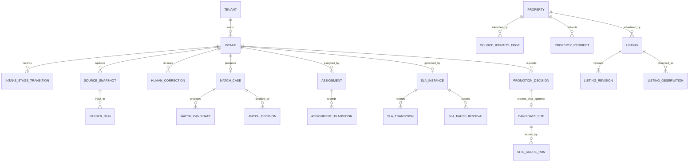

# ODay Plus Assisted Listing Intake System Design Response

## 1. Executive Decision

System Design accepts the Assisted Listing Intake product boundary and selects a modular-monolith transactional owner with separately deployable workers. The production target is Cloud Run, Cloud SQL PostgreSQL 16 + PostGIS, regional GCS snapshot/WORM storage, Cloud Tasks, Pub/Sub through a transactional outbox, Secret Manager/KMS, and OpenTelemetry-compatible observability.

The following target changes relative to the current `dev` implementation are binding:

1. Listing ingestion must not automatically create `CandidateSiteDraft`. Candidate promotion is an explicit human request, independent review, and asynchronous execution saga.
2. Rent is not part of physical property identity. A rent-only change creates a `ListingRevision`.
3. Intake stage, listing lifecycle, match outcome, identity decision/execution, assignment, SLA, promotion, job, event, and audit are separate state models.
4. Ambiguous identity is persisted as `MatchCase` and is never auto-merged.
5. Source snapshots, listing revisions, observations, audit evidence, and historical identity edges are immutable. Merge, split, and unmerge use superseding edges, redirects, and reviewed reversal.
6. Memory and SQLite remain unit/local/fixture/Product-E2E adapters only. Production uses the selected GCP topology.
7. High-impact actions are non-optimistic, version-checked, idempotent, attributable, independently reviewed where required, and audit/WORM protected.
8. Tenant equality is enforced in backend ABAC, RLS, and tenant-qualified foreign keys; frontend visibility is not authorization.
9. Every domain event must exist in the committed event catalog and resolve to a complete typed payload schema.
10. A review is valid only when bound to the exact current PR head SHA. A review of another commit is historical evidence, not a decision on the current design.

Unknown, prohibited, expired, unauthorized, unlicensed, or kill-switched sources fail closed. Product UI/API never accepts provider credentials, cookies, bearer tokens, passwords, or private endpoints. Scheduled third-party result-page crawling and automatic listing-ID enumeration are outside this release.

## 2. Normative Artifact Register and Precedence

Engineering, Product Design, QA, and reviewers must use the following committed artifacts. Runtime handlers, migrations, reducers, policies, events, or tests must not invent contracts outside them.

| Contract group | Normative artifact | Decisions / finding |
|---|---|---|
| Alignment source | `docs/design/ODAY_PLUS_ASSISTED_LISTING_INTAKE_SYSTEM_DESIGN_ALIGNMENT_REQUEST.md` | ODP-SD-INTAKE-ALIGN-001 |
| Consolidated response | This document | SDI-001..024 |
| Cross-contract corrections | `docs/design/ODAY_PLUS_ASSISTED_LISTING_INTAKE_V021_CROSS_CONTRACT_CORRECTIONS.md` | v0.2.1 precedence and real v0.2 defects |
| Base state contracts | `docs/design/ODAY_PLUS_ASSISTED_LISTING_INTAKE_STATE_CONTRACTS.md` | SDI-002/003/005/006/007/008 |
| Base relational schema | `docs/data/ODAY_PLUS_ASSISTED_LISTING_INTAKE_SCHEMA.sql` | SDI-001..004/009..011/014/018 |
| Schema consistency patch | `docs/data/ODAY_PLUS_ASSISTED_LISTING_INTAKE_SCHEMA_0002_CONSISTENCY_PATCH.sql` | tenant FK/RLS, history, migration consistency |
| Base OpenAPI | `docs/api/openapi/ODAY_PLUS_ASSISTED_LISTING_INTAKE_V1.yaml` | SDI-012/013/014 |
| OpenAPI command overlay | `docs/api/openapi/ODAY_PLUS_ASSISTED_LISTING_INTAKE_V1_1_OVERLAY.yaml` | promotion/review/assignment/SLA/error corrections |
| Authorization/segregation | `docs/design/ODAY_PLUS_ASSISTED_LISTING_INTAKE_AUTHORIZATION_MATRIX.md` | SDI-004/006/016/017/018 |
| Base event catalog | `docs/events/ODAY_PLUS_ASSISTED_LISTING_INTAKE_EVENTS_V1.yaml` | SDI-015 |
| Event addendum | `docs/events/ODAY_PLUS_ASSISTED_LISTING_INTAKE_EVENTS_V1_1_ADDENDUM.yaml` | state/event alignment and missing events |
| Event payload registry | `docs/events/ODAY_PLUS_ASSISTED_LISTING_INTAKE_EVENT_PAYLOAD_SCHEMAS_V1.yaml` | complete typed base payload schemas |
| Reliability/privacy/evidence | `docs/operations/ODAY_PLUS_ASSISTED_LISTING_INTAKE_RELIABILITY_PRIVACY_CONTRACT.md` | SDI-017..022 |
| Migration/cutover/rollback | `docs/operations/ODAY_PLUS_ASSISTED_LISTING_INTAKE_MIGRATION_ROLLOUT_RUNBOOK.md` | SDI-023/024 |
| Review manifest | `docs/design/ODAY_PLUS_ASSISTED_LISTING_INTAKE_REVIEW_MANIFEST.yaml` | commit-bound review gate |
| Pre-review validator | `scripts/validate_assisted_listing_intake_design.py` | cross-contract consistency gate |

Precedence is:

```text
alignment request
> this consolidated v0.2.1 response
> v0.2.1 correction pack and machine-readable patches/addenda
> unchanged clauses in v0.2.0 base artifacts
> current runtime implementation
```

All artifacts remain `proposed` until approvals in section 13 are recorded. Fail-closed gates remain binding meanwhile.

## 3. Canonical Domain, Identity, and Ownership

### 3.1 Aggregate ownership

| Aggregate / record | Authoritative owner | Production record |
|---|---|---|
| `Intake`, `IntakeStageTransition` | Listing Intake application service | `intake.intakes`, `intake.intake_stage_transitions` |
| `SourceRegistry`, `ParserRelease`, `SourceSnapshot`, `ParserRun` | External Data / policy / parser services | `intake.source_registry`, `parser_releases`, `source_snapshots`, `parser_runs` |
| `Property`, effective identity edge, redirect | Identity Resolution service | `identity.properties`, `source_identity_edges`, `property_redirects` |
| `MatchCase`, `MatchDecision` | Identity Resolution service | `identity.match_cases`, `match_candidates`, `match_decisions` |
| `Listing`, immutable revision/observation | Listing service | `expansion.listings`, `listing_revisions`, `listing_observations` |
| `HumanCorrection` | Listing service; Identity reviews identity-affecting corrections | `intake.human_corrections` |
| `Assignment`, assignment history | Workflow service | `workflow.assignments`, `assignment_transitions` |
| `SlaInstance`, SLA history/pause interval | Workflow/SLA service | `workflow.sla_instances`, `sla_transitions`, `sla_pause_intervals` |
| `PromotionDecision`, `CandidateSite` | Candidate Promotion boundary | `expansion.promotion_decisions`, `candidate_sites` |
| `IdempotencyRecord`, `Job`, `OutboxEvent` | API/job/platform owners | `workflow.idempotency_records`, `jobs`, `outbox_events` |
| `AuditEvent`, legal hold, export manifest | Audit/Privacy platform | `audit.audit_events`, `legal_holds`, `export_manifests` |
| `ReconciliationFinding` | Migration/Reconciliation service | `workflow.reconciliation_findings` |

Every persisted business, workflow, evidence, job, outbox, idempotency, decision, and audit record carries `tenant_id`. Tenant-bearing relationships use composite tenant-qualified foreign keys after migration reconciliation. All tenant tables require RLS plus backend ABAC.

### 3.2 Canonical relations



A `Property` may have many source `Listing` records. A `Listing` has immutable revisions and observations. An intake resolves to zero or one listing. Only one active candidate is allowed for `(tenant_id, property_id, target_format_code)`. Original source evidence is never overwritten by a correction.

Rent and other commercial terms are not property identity inputs. Exact source identity and canonical URL identify a source advertisement; property resolution uses normalized address/geospatial/physical evidence and a reversible graph.

## 4. Binding State and Transaction Contracts

The base diagrams cover intake, listing, identity, assignment, decision, and candidate promotion. The v0.2.1 correction pack adds the previously missing binding SLA transitions and the per-transition decision review/execution/reversal table.

### 4.1 State families

- Intake: `SUBMITTED`, `CHECKING_IDENTITY`, `CHECKING_SOURCE_POLICY`, `AWAITING_ASSISTED_ENTRY`, `RETRIEVING`, `PARSING`, `MATCHING`, `NEEDS_REVIEW`, `READY`, `QUARANTINED`, `FAILED`, `CANCELLED`.
- Listing: `ACTIVE`, `REMOVED`, `EXPIRED`, `STALE`, `QUARANTINED`, `ARCHIVED`.
- Match outcome: `NEW`, `EXACT_DUPLICATE`, `REVISION`, `POSSIBLE_MATCH`, `QUARANTINED`.
- Assignment: `UNASSIGNED`, `ASSIGNED`, `CLAIMED`, `TRANSFERRED`, `ESCALATED`, `COMPLETED`.
- SLA: `ON_TRACK`, `DUE_SOON`, `OVERDUE`, `BREACHED`, `PAUSED`, `COMPLETED`.
- Decision: `DRAFT`, `PENDING_REVIEW`, `APPROVED`, `REJECTED`, `EXECUTING`, `EXECUTED`, `FAILED`, `REVERSAL_PENDING`, `REVERSED`, `SUPERSEDED`.
- Promotion: `REQUESTED`, `VALIDATING`, `PENDING_REVIEW`, `REJECTED`, `APPROVED`, `CANDIDATE_CREATING`, `CANDIDATE_CREATED`, `SCORE_QUEUED`, `COMPLETED`, `FAILED`, `SCORE_FAILED`.
- Job: `QUEUED`, `RUNNING`, `RETRYING`, `SUCCEEDED`, `FAILED`, `CANCELLED`, `DEAD_LETTER`.

`QUARANTINED` and `FAILED` are controlled reopenable states, not terminal. Human mutations require `Idempotency-Key` and `If-Match`; missing precondition returns `428 PRECONDITION_REQUIRED`, stale version returns `409 VERSION_CONFLICT`, and same key/different fingerprint returns `409 IDEMPOTENCY_KEY_REUSED`.

Every transition persists actor/service, permission, reason, version before/after, correlation/causation, idempotency, source/parser/snapshot/decision references, audit event, and transactional outbox event where cataloged.

### 4.2 Candidate promotion transaction

The human API does not return a candidate before approval:

```text
POST promotion-requests
-> PromotionDecision REQUESTED/VALIDATING/PENDING_REVIEW
-> independent reviewer APPROVE/REJECT/RETURN
-> approved execution creates Candidate atomically
-> SiteScore job is durably queued
-> decision detail exposes candidate/job only after commit
```

The unique active candidate constraint prevents duplicates. Lost HTTP responses replay the original receipt. Candidate creation failure rolls back the SQL transaction. SiteScore failure leaves the candidate with `SCORING_FAILED` and supports authorized replay; it does not delete the candidate.

## 5. Source, Parser, Snapshot, Correction, and Evidence

The source registry owns allowed hosts, canonicalization version, retrieval mode, legal/license references, review expiry, rate limits, production enablement, and kill switch. Policy is fail closed. `AUTH_REQUIRED` never requests user credentials.

Parser releases are immutable, checksummed, source-bound, schema-versioned, corpus-validated, canaried, rollback-capable, and retained for lineage. Reprocessing always names source snapshot and parser release.

Raw/redacted snapshots are immutable GCS objects identified by checksum and object generation. Metadata records captured, observed, and stored times, source, capture method, retention, residency, encryption key, and legal hold. Snapshot uniqueness is per intake/source/content so separate submissions never lose evidence lineage.

Corrections preserve parsed, normalized, corrected, before-effective, after-effective, reason, proposer/reviewer, snapshot, parser run, supersession, and reversal. Identity-affecting corrections require independent review.

## 6. API, Query, Concurrency, and Events

The effective API is the base OpenAPI plus v1.1 overlay. Client generation and contract testing must bundle both. The overlay supersedes the premature final promotion route and adds:

- promotion request, decision detail, and independent review;
- intake cancel, quarantine, and reopen;
- assignment claim, transfer, and complete;
- SLA pause and resume;
- identity-decision detail, review, and reversal;
- canonical error codes, `429 RATE_LIMITED`, and `503 BACKPRESSURE_ACTIVE`.

Listing Inbox uses stable signed cursor pagination, server filters/search, total-count accuracy, freshness timestamp, field masking, and saved-view ownership. Batch intake returns per-row receipts and partial success. High-impact mutations use versioned durable receipts.

Internal domain events use Pub/Sub through a transactional outbox with at-least-once delivery, per-aggregate ordering, consumer deduplication, bounded retry/DLQ, retained replay, and compatibility/deprecation policy. Event type strings do not carry `.v1`; `event_version` is separate. Granular transition labels not in the event catalog are audit action codes.

Every catalog `schema_ref` resolves to a complete JSON Schema in the payload registry or addendum. External webhooks are not supported in v1; no registration or outbound delivery API exists.

## 7. Authorization, Privacy, and Evidence

Authorization is deny-by-default:

```text
authenticated
AND role/service grant
AND tenant
AND brand/region/area/HeatZone scope
AND ownership
AND workflow state
AND risk/segregation
AND field classification
AND purpose/source policy/legal hold
```

The matrix covers Expansion staff/manager, Data Steward, Governance Reviewer, Privacy Officer, Platform/Emergency Admin, and service identities. It defines self-review prohibitions, second-actor pairs, restricted export/purge/legal-hold permissions, emergency constraints, service limitations, and exact denial/masking codes.

Field classes are `PUBLIC`, `INTERNAL`, `CONFIDENTIAL`, `RESTRICTED`, and `CREDENTIAL`. Credentials are never collected, returned, or exported. Masked fields preserve their structural path with `masked=true` and `FIELD_MASKED`.

High-impact SQL audit and outbox records commit with the business transaction. WORM-required operations abort if no receipt is obtained. Other audit records may enter `worm_pending`, but after five minutes high-risk mutations are disabled and Security/Platform are paged.

Privacy lifecycle defines minimization, retention, legal hold, purge dependency order, residency, export manifests, watermarking, checksum verification, and fail-closed conflict behavior.

## 8. Persistence, Jobs, Reliability, and Recovery

Cloud SQL PostgreSQL 16/PostGIS regional HA is the write authority. GCS regional buckets hold snapshots and WORM evidence. Default residency is `TW_ONLY`; APAC DR remains disabled until approved. SQLite/memory are rejected by production configuration.

Object writes precede SQL snapshot metadata commit. GCS success/SQL failure creates an orphan reconciliation case; SQL metadata/GCS integrity failure quarantines the snapshot and blocks parsing.

Cloud Tasks supplies delivery; `workflow.jobs` is authoritative. Jobs use versions, fence tokens, heartbeat/lease, timeouts, bounded backoff, cancellation checkpoints, DLQ, replay authorization, rate/concurrency controls, and backpressure. No request is acknowledged as accepted without a durable receipt.

Capacity, SLO, RPO/RTO, backup/PITR, KMS rotation, restore order, and drill cadence are quantitatively proposed in the reliability contract. They are not contractual commitments until owner approval; production flags remain off meanwhile.

## 9. Migration and Rollout

The rollout is contract-first:

1. Validate response, base/patch DDL, bundled OpenAPI, auth matrix, event catalog/payload schemas, and review manifest.
2. Apply schema in staging, run tenant FK/RLS and backup/PITR evidence.
3. Backfill by tenant/source/month without fabricating source snapshots or human approvals.
4. Run target identity/listing processing in shadow; ambiguous matches remain review cases.
5. Reconcile historical candidates. Existing automatic candidates use `decision_type=LEGACY_RECONCILED`, `status=COMPLETED`, and `migration_ref`; this is migration evidence, not human approval.
6. Run read parity, write canary, event canary, and separately gated promotion canary.
7. Enable target authority per tenant/source. No indefinite dual-write is selected.
8. Remove legacy production paths only after stable watch window and rollback checkpoint expiry.

Cross-tenant/orphaned rows, duplicate candidates, identity cycles, missing evidence, count/checksum differences, and invalid state mappings become persisted reconciliation findings. Blocking findings prevent cutover.

Rollback disables flags, parks work at fenced checkpoints, retains evidence/outbox, and uses the last compatible application against the target schema. Identity and promotion decisions are reversed only by their approved state machines.

## 10. UX-Binding System Facts

Product/UX must expose, not invent:

- exact intake, listing, match, assignment, SLA, decision, promotion, and job states;
- original/canonical URL, source policy, parser/snapshot/correlation/freshness facts;
- parsed, normalized, corrected, effective, confidence, and masking state;
- match evidence, contradictions, current effective property, history/as-of lineage;
- current owner, due time, SLA state, pause/transfer/escalation history;
- ETag/version conflicts and exact backend reason codes;
- non-optimistic progress and durable receipts for review, correction, identity, quarantine, promotion, export, purge, and legal hold;
- candidate/job IDs only after the promotion execution transaction commits;
- retry checkpoint, attempt, next retry, cancellation, DLQ, and replay authority;
- audit actor/time/reason/before-after/snapshot/parser/decision and WORM state.

Errors display summary, code, correlation ID, occurred time, retryability, current state/version, and next action. Deep links and list query state remain durable.

## 11. Decision Matrix

| ID | Decision | Binding contract / reference | Rationale / migration impact | Owner | Open dependency / gate |
|---|---|---|---|---|---|
| SDI-001 | MODIFY | Base DDL + patch + §3 | Split shortcut model into canonical aggregates and tenant-safe relations | System Design/Data | Schema approval/tests |
| SDI-002 | MODIFY | Base states §3 + DDL | Revision/observation separated from lifecycle | Listing owner | Transition tests |
| SDI-003 | MODIFY | State identity §4 + DDL/patch | Immutable reversible graph; rent excluded | Identity/Data | Reconciliation approval |
| SDI-004 | ACCEPT | Tenant-qualified FK/RLS + auth matrix | Backend tenancy and scope enforcement | Security/Data | RLS/ABAC tests |
| SDI-005 | MODIFY | Intake state table | Quarantine/failed reopen semantics and legal transitions | Intake owner | Exhaustive state tests |
| SDI-006 | MODIFY | Decision table + auth matrix | Independent review, execution, reversal formalized | Identity/Security | SoD tests |
| SDI-007 | MODIFY | Assignment base + SLA correction + patch | Ownership concurrency and persisted SLA history | Workflow/Ops | Calendar/pause policy approval |
| SDI-008 | MODIFY | Promotion states + OpenAPI overlay | Explicit request/review; atomic candidate + score saga | Expansion Engineering | Promotion E2E |
| SDI-009 | ACCEPT | Source registry DDL + §5 | Fail-closed source control plane | Source owner/Legal | Per-source approval |
| SDI-010 | ACCEPT | Parser release/run DDL + §5 | Versioned canary/rollback/reprocess | Data steward | Corpus evidence |
| SDI-011 | ACCEPT | Snapshot DDL/patch + reliability | Immutable provenance/checksum/residency | External Data/Security | Retention approval |
| SDI-012 | ACCEPT | Base OpenAPI list/detail | Stable cursor, masking, freshness, saved views | API/Data | Contract tests |
| SDI-013 | MODIFY | Base OpenAPI intake/batch | Common envelope, row receipt, partial success/replay | Intake/API | Generated client |
| SDI-014 | ACCEPT | Bundled OpenAPI + idempotency DDL | Tenant/actor/operation replay and versions | API Platform | Concurrency tests |
| SDI-015 | MODIFY | Base events + addendum + payload registry | Pub/Sub/outbox; typed events; no webhooks v1 | Platform | Event contract tests/Product approval |
| SDI-016 | MODIFY | Authorization matrix + canonical errors | Testable deny-by-default policy | Security | Policy tests |
| SDI-017 | MODIFY | Auth + reliability privacy | Masking, purge, hold, residency, export | Privacy/Legal | Approval |
| SDI-018 | MODIFY | Audit DDL/patch + reliability | Hash/WORM/export integrity and fail-closed | Security/Audit | WORM proof |
| SDI-019 | ACCEPT | Reliability topology + DDL/patch | Cloud SQL/GCS production; SQLite/memory tests only | Platform/Data | Infrastructure proof |
| SDI-020 | MODIFY | Reliability jobs + patch | Lease/fence/timeout/backpressure/replay/DLQ | Platform/SRE | Failure/load tests |
| SDI-021 | MODIFY | Reliability capacity/SLO | Quantitative proposed values with owners | Product/Ops/SRE | Owner approval |
| SDI-022 | MODIFY | Reliability recovery | Data-class RPO/RTO, restore order, drills | Platform/SRE/Security | Drill evidence |
| SDI-023 | MODIFY | Runbook + reconciliation table | Mapping/backfill/reconciliation/rollback | Data/Expansion | Staging dry run |
| SDI-024 | MODIFY | Runbook + flags + review manifest | Shadow/canary/cutover/kill switch and commit-bound gate | Release authority | All P0 approvals |

## 12. Approval Records and Fail-Closed Gates

| Approval owner | Status | Approval scope | Fail-closed behavior while pending |
|---|---|---|---|
| Product / Expansion Ops | PENDING | States, review SLA, capacity, webhook exclusion | No production write/promotion rollout |
| Security | PENDING | Authorization, KMS, WORM, break glass | High-risk production mutations disabled |
| Privacy | PENDING | Retention, purge, hold, residency, restricted export | Purge/export/APAC DR disabled |
| Legal / Commercial | PENDING | Per-source retrieval/license/residency | Source assisted-entry-only or blocked |
| Data owner | PENDING | Schema, identity, parser/reconciliation | No authoritative migration/cutover |
| Platform / SRE | PENDING | HA, jobs, SLO/RPO/RTO, restores | Production storage/async flags disabled |
| Expansion Engineering | PENDING | Bundled API/state/promotion feasibility | Handlers cannot invent contracts |
| QA | PENDING | Validator, contract/schema/auth/event/recovery/E2E | No release candidate |
| Release authority | PENDING | Canary/cutover/rollback evidence | All production flags off |

Status may change to `approved` only after every P0 group is approved and evidence is linked.

## 13. Commit-Bound Review Protocol

Formal review must use `ODAY_PLUS_ASSISTED_LISTING_INTAKE_REVIEW_MANIFEST.yaml` and record exact `reviewed_commit`, `base_commit`, `response_version`, and manifest path.

```text
if reviewed_commit != current PR head:
    stop with STALE_REVIEW_TARGET
```

The review of commit `ffe14c77f7d4f1ae97d301db3a8177cd3effeed6` remains historical review evidence for response v0.1.0. It cannot approve or reject this v0.2.1 head.

Before reviewer judgment, run:

```text
python scripts/validate_assisted_listing_intake_design.py \
  --reviewed-commit <current PR head> \
  --current-pr-head <current PR head> \
  --base-commit <current dev head> \
  --strict-review-target
```

A failed validator blocks substantive review and produces a pre-review defect rather than another ambiguous architecture decision.

## 14. Implementation Handoff Boundaries

Contract-first work packages:

1. `ODP-INTAKE-SCHEMA-001` — Alembic migration from base DDL + patch; tenant FK/RLS/constraint tests.
2. `ODP-INTAKE-STATES-001` — exhaustive transition engine tests including SLA and decision tables.
3. `ODP-INTAKE-IDENTITY-001` — immutable graph, merge/split/unmerge, cycle/concurrency/reversal.
4. `ODP-INTAKE-API-001` — bundled OpenAPI validation, generated client, examples, endpoint contract tests.
5. `ODP-INTAKE-AUTH-001` — RBAC/ABAC/masking/segregation/error-code tests.
6. `ODP-INTAKE-EVENTS-001` — event schemas, outbox, consumer dedup/replay/DLQ tests.
7. `ODP-INTAKE-SNAPSHOT-001` — GCS generation/checksum/residency/reconciliation.
8. `ODP-INTAKE-JOBS-001` — Cloud Tasks and durable fencing/timeout/backpressure.
9. `ODP-INTAKE-PRIVACY-001` — hold/purge/export manifests and WORM evidence.
10. `ODP-INTAKE-MIGRATION-001` — staging backfill, reconciliation, rollback evidence.
11. `ODP-INTAKE-PROMOTION-001` — remove automatic candidate creation; request/review/saga implementation.
12. `ODP-INTAKE-UX-001` — UI from approved API/state/auth facts only.
13. `ODP-INTAKE-LOAD-001` — proposed capacity/SLO validation.
14. `ODP-INTAKE-RELEASE-001` — tenant/source canary, UAT, restore and rollback gates.

Schema, bundled OpenAPI, transition, authorization, event, and validator gates must pass before product behavior implementation. Documentation alone does not close runtime tasks.
