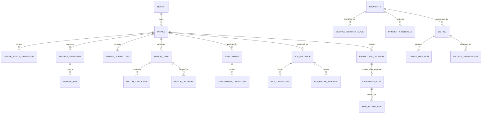

# ODay Plus Assisted Listing Intake System Design Response

## 1. Executive Decision

System Design accepts the Assisted Listing Intake product boundary and selects a modular-monolith transactional owner with separately deployable workers. The production target is Cloud Run, Cloud SQL PostgreSQL 16 + PostGIS, regional GCS snapshot/WORM storage, Cloud Tasks, Pub/Sub through a transactional outbox, Secret Manager/KMS, and OpenTelemetry-compatible observability.

Binding target changes relative to current `dev` implementation:

1. Listing ingestion must not automatically create `CandidateSiteDraft`. Candidate promotion is an explicit human request, independent review, and asynchronous execution saga.
2. Rent is not part of physical property identity. A rent-only change creates a `ListingRevision`.
3. Intake stage, listing lifecycle, match outcome, identity decision/execution, assignment, SLA, promotion, job, event, and audit are separate state models.
4. Ambiguous identity is persisted as `MatchCase` and never auto-merged.
5. Source snapshots, listing revisions/observations, audit evidence, and historical identity edges are immutable. Merge/split/unmerge use superseding edges, redirects, and reviewed reversal.
6. Memory and SQLite remain unit/local/fixture/Product-E2E adapters only. Production uses the selected GCP topology.
7. High-impact actions are non-optimistic, version-checked, idempotent, attributable, independently reviewed where required, and audit/WORM protected.
8. Tenant equality is enforced through backend ABAC, RLS, and tenant-qualified foreign keys; frontend visibility is not authorization.
9. Every domain event exists in the committed event catalog and resolves to a complete typed payload schema.
10. A review is valid only when bound to the exact current PR head SHA. A review of another commit is historical evidence, not a decision on the current design.

Unknown, prohibited, expired, unauthorized, unlicensed, or kill-switched sources fail closed. Product UI/API never accepts provider credentials, cookies, bearer tokens, passwords, or private endpoints. Scheduled third-party result-page crawling and automatic listing-ID enumeration are outside this release.

## 2. Normative Artifact Register and Precedence

Engineering, Product Design, QA, and reviewers must use the committed package below. Runtime handlers, migrations, reducers, policies, events, or tests must not invent contracts outside it.

| Contract group | Normative artifact | Purpose |
|---|---|---|
| Alignment source | `docs/design/ODAY_PLUS_ASSISTED_LISTING_INTAKE_SYSTEM_DESIGN_ALIGNMENT_REQUEST.md` | ODP-SD-INTAKE-ALIGN-001 |
| Consolidated response | This document | SDI-001..024 |
| Cross-contract corrections | `docs/design/ODAY_PLUS_ASSISTED_LISTING_INTAKE_V021_CROSS_CONTRACT_CORRECTIONS.md` | v0.2 defects, correction detail and precedence |
| Base state contracts | `docs/design/ODAY_PLUS_ASSISTED_LISTING_INTAKE_STATE_CONTRACTS.md` | Intake/listing/identity/assignment/decision/promotion base contracts |
| Base schema | `docs/data/ODAY_PLUS_ASSISTED_LISTING_INTAKE_SCHEMA.sql` | PostgreSQL/PostGIS baseline |
| Schema patch 0002 | `docs/data/ODAY_PLUS_ASSISTED_LISTING_INTAKE_SCHEMA_0002_CONSISTENCY_PATCH.sql` | Tenant FK/RLS, history, lineage and migration consistency |
| Schema patch 0003 | `docs/data/ODAY_PLUS_ASSISTED_LISTING_INTAKE_SCHEMA_0003_PROMOTION_STATE_PATCH.sql` | Promotion `PENDING_REVIEW` state constraint |
| Base OpenAPI | `docs/api/openapi/ODAY_PLUS_ASSISTED_LISTING_INTAKE_V1.yaml` | Query/intake/correction/identity baseline |
| OpenAPI v1.1 overlay | `docs/api/openapi/ODAY_PLUS_ASSISTED_LISTING_INTAKE_V1_1_OVERLAY.yaml` | Promotion request/review and missing commands |
| OpenAPI v1.1.1 overlay | `docs/api/openapi/ODAY_PLUS_ASSISTED_LISTING_INTAKE_V1_1_1_CONSISTENCY_OVERLAY.yaml` | Complete error registry and review action consistency |
| Authorization/segregation | `docs/design/ODAY_PLUS_ASSISTED_LISTING_INTAKE_AUTHORIZATION_MATRIX.md` | Deny-by-default role/action/field/scope/state/risk rules |
| Base event catalog | `docs/events/ODAY_PLUS_ASSISTED_LISTING_INTAKE_EVENTS_V1.yaml` | Envelope, outbox and base event catalog |
| Event addendum | `docs/events/ODAY_PLUS_ASSISTED_LISTING_INTAKE_EVENTS_V1_1_ADDENDUM.yaml` | State/event alignment and missing events |
| Event payload registry | `docs/events/ODAY_PLUS_ASSISTED_LISTING_INTAKE_EVENT_PAYLOAD_SCHEMAS_V1.yaml` | Complete typed payload schemas |
| Reliability/privacy/evidence | `docs/operations/ODAY_PLUS_ASSISTED_LISTING_INTAKE_RELIABILITY_PRIVACY_CONTRACT.md` | Storage/jobs/SLO/recovery/privacy/evidence |
| Migration/cutover/rollback | `docs/operations/ODAY_PLUS_ASSISTED_LISTING_INTAKE_MIGRATION_ROLLOUT_RUNBOOK.md` | Backfill/reconciliation/canary/cutover/rollback |
| Review manifest | `docs/design/ODAY_PLUS_ASSISTED_LISTING_INTAKE_REVIEW_MANIFEST.yaml` | Apply order and exact-head review gate |
| Validator | `scripts/validate_assisted_listing_intake_design.py` | Executable cross-contract pre-review gate |
| CI gate | `.github/workflows/assisted-intake-design-validation.yml` | Runs validator on PRs to `dev` |

Apply order:

```text
Schema: base -> 0002 -> 0003
OpenAPI: base -> v1.1 overlay -> v1.1.1 consistency overlay
Events: base catalog + v1.1 addendum + payload registry
```

Precedence:

```text
alignment request
> this consolidated v0.2.1 response
> v0.2.1 correction pack and machine-readable patches/addenda
> unchanged clauses in v0.2.0 base artifacts
> current runtime implementation
```

All artifacts remain `proposed` until approvals in section 12 are recorded. Fail-closed gates remain binding meanwhile.

## 3. Canonical Domain, Identity, and Ownership

| Aggregate / record | Authoritative owner | Production record |
|---|---|---|
| `Intake`, transition history | Listing Intake application service | `intake.intakes`, `intake.intake_stage_transitions` |
| Source registry/parser/snapshot/run | External Data / policy / parser services | `intake.source_registry`, `parser_releases`, `source_snapshots`, `parser_runs` |
| `Property`, effective identity edge, redirect | Identity Resolution service | `identity.properties`, `source_identity_edges`, `property_redirects` |
| `MatchCase`, candidate evidence, decision | Identity Resolution service | `identity.match_cases`, `match_candidates`, `match_decisions` |
| `Listing`, revision, observation | Listing service | `expansion.listings`, `listing_revisions`, `listing_observations` |
| `HumanCorrection` | Listing service; Identity reviews identity-affecting corrections | `intake.human_corrections` |
| Assignment and history | Workflow service | `workflow.assignments`, `assignment_transitions` |
| SLA and pause/history | Workflow/SLA service | `workflow.sla_instances`, `sla_transitions`, `sla_pause_intervals` |
| Promotion decision and candidate | Candidate Promotion boundary | `expansion.promotion_decisions`, `candidate_sites` |
| Idempotency/job/outbox | API/job/platform owners | `workflow.idempotency_records`, `jobs`, `outbox_events` |
| Audit/hold/export | Audit/Privacy platform | `audit.audit_events`, `legal_holds`, `export_manifests` |
| Reconciliation finding | Migration/Reconciliation service | `workflow.reconciliation_findings` |

Every persisted business, workflow, evidence, job, outbox, idempotency, decision, and audit record carries `tenant_id`. Tenant-bearing relationships use tenant-qualified composite foreign keys after reconciliation. All tenant tables require RLS plus backend ABAC.



A `Property` may have many source listings. Listing revisions and observations are immutable. An intake resolves to zero or one listing. Only one active candidate is allowed for `(tenant_id, property_id, target_format_code)`. Rent/commercial terms do not define property identity. Corrections never overwrite source evidence.

## 4. Binding State and Transaction Contracts

Effective state families:

- Intake: `SUBMITTED`, `CHECKING_IDENTITY`, `CHECKING_SOURCE_POLICY`, `AWAITING_ASSISTED_ENTRY`, `RETRIEVING`, `PARSING`, `MATCHING`, `NEEDS_REVIEW`, `READY`, `QUARANTINED`, `FAILED`, `CANCELLED`.
- Listing: `ACTIVE`, `REMOVED`, `EXPIRED`, `STALE`, `QUARANTINED`, `ARCHIVED`.
- Match outcome: `NEW`, `EXACT_DUPLICATE`, `REVISION`, `POSSIBLE_MATCH`, `QUARANTINED`.
- Assignment: `UNASSIGNED`, `ASSIGNED`, `CLAIMED`, `TRANSFERRED`, `ESCALATED`, `COMPLETED`.
- SLA: `ON_TRACK`, `DUE_SOON`, `OVERDUE`, `BREACHED`, `PAUSED`, `COMPLETED`.
- Decision: `DRAFT`, `PENDING_REVIEW`, `APPROVED`, `REJECTED`, `EXECUTING`, `EXECUTED`, `FAILED`, `REVERSAL_PENDING`, `REVERSED`, `SUPERSEDED`.
- Promotion: `REQUESTED`, `VALIDATING`, `PENDING_REVIEW`, `REJECTED`, `APPROVED`, `CANDIDATE_CREATING`, `CANDIDATE_CREATED`, `SCORE_QUEUED`, `COMPLETED`, `FAILED`, `SCORE_FAILED`.
- Job: `QUEUED`, `RUNNING`, `RETRYING`, `SUCCEEDED`, `FAILED`, `CANCELLED`, `DEAD_LETTER`.

The base state file plus correction pack defines every legal transition with source/target, actor, backend permission, preconditions, idempotency, concurrency token, persisted evidence, audit/domain event, failure result, and reopen/terminal semantics. `QUARANTINED` and `FAILED` are controlled reopenable states. Human mutations require `Idempotency-Key` and `If-Match`.

Candidate promotion is:

```text
promotion request
-> validation
-> independent review
-> approved execution transaction creates candidate
-> SiteScore job durably queued
-> receipt exposes candidate/job only after commit
```

The removed v0.2 route must not return a candidate before review. Candidate creation failure rolls back the transaction. SiteScore failure leaves `SCORING_FAILED` and supports authorized replay; it does not delete the candidate.

Review action v1 is deliberately `APPROVE` or `REJECT`. Return-for-change is deferred until a complete changes-requested/resubmission state and API contract is separately approved.

## 5. Source, Parser, Snapshot, Correction, and Evidence

Source registry owns hosts, canonicalization version, retrieval mode, legal/license references, expiry, limits, enablement, and kill switch. Evaluation fails closed; `AUTH_REQUIRED` never requests user credentials.

Parser releases are immutable, checksummed, source-bound, schema-versioned, corpus-validated, canaried, rollback-capable, and retained for lineage. Reprocessing names the snapshot and parser release.

Snapshots are immutable GCS objects identified by checksum and object generation. Metadata records captured/observed/stored times, source, capture method, retention, residency, encryption key, and hold. Snapshot uniqueness is per intake/source/content, so separate submissions preserve evidence lineage.

Corrections preserve parsed, normalized, corrected, before-effective, after-effective, reason, proposer/reviewer, snapshot, parser run, supersession, and reversal. Identity-affecting corrections require independent review.

## 6. API, Query, Concurrency, and Events

The effective API is the three-file bundle listed in section 2. Client generation and contract tests must apply overlays in order.

The effective API includes:

- signed stable cursor query, filters/search/count/freshness/masking/saved views;
- URL/manual/CSV/approved-feed intake and per-row partial receipts;
- correction and match/identity proposal APIs;
- intake cancel/quarantine/reopen;
- assignment claim/transfer/complete;
- SLA pause/resume;
- identity decision detail/review/reversal;
- promotion request/detail/independent review;
- `Idempotency-Key`, `If-Match`, ETag and lost-response replay;
- one canonical error registry, including authorization, workflow, retry, rate and backpressure codes.

Internal events use Pub/Sub through a transactional outbox with at-least-once delivery, aggregate ordering, consumer deduplication, bounded retry/DLQ, controlled replay, and compatibility/deprecation rules. `event_type` carries no version suffix; `event_version` is separate. Granular transition labels absent from the catalog are audit action codes, not domain events. Every `schema_ref` resolves to a complete JSON Schema in the payload registry or addendum.

External webhooks are not supported in v1. No webhook registration or outbound HTTP delivery API exists.

## 7. Authorization, Privacy, and Audit

Authorization is deny-by-default:

```text
authenticated
AND role/service grant
AND tenant
AND brand/region/area/HeatZone scope
AND ownership
AND workflow state
AND risk/segregation
AND field classification
AND purpose/source-policy/legal-hold obligations
```

The matrix covers Expansion staff/manager, Data Steward, Governance Reviewer, Privacy Officer, Platform/Emergency Admin, and service identities. It defines self-review prohibitions, second-actor pairs, restricted export/purge/hold permissions, emergency limits, service limits, and exact denial/masking codes.

Field classes are `PUBLIC`, `INTERNAL`, `CONFIDENTIAL`, `RESTRICTED`, and `CREDENTIAL`. Credentials are never collected, returned, or exported. Masked fields retain their structural path with `masked=true` and `FIELD_MASKED`.

High-impact SQL audit/outbox records commit with the business transaction. WORM-required operations abort without a receipt. Other records may enter `worm_pending`; after five minutes high-risk mutations disable and Security/Platform are paged.

Privacy lifecycle defines minimization, retention, legal hold, purge dependency order, residency, export manifests/watermarks, checksum verification, and fail-closed conflicts.

## 8. Persistence, Jobs, Reliability, and Recovery

Cloud SQL PostgreSQL 16/PostGIS regional HA is write authority. GCS regional buckets hold snapshots and WORM evidence. Default residency is `TW_ONLY`; APAC DR remains disabled until approved. SQLite/memory are rejected by production configuration.

Object writes precede SQL snapshot metadata commit. GCS success/SQL failure creates an orphan finding; SQL metadata/GCS integrity failure quarantines the snapshot and blocks parsing.

Cloud Tasks supplies delivery; `workflow.jobs` is authoritative. Jobs use versions, fence tokens, heartbeat/lease, stage timeouts, bounded backoff, cancellation checkpoints, DLQ, replay authorization, concurrency/rate controls, and backpressure. No request is acknowledged without a durable receipt.

Capacity, SLO, RPO/RTO, backup/PITR, KMS rotation, restore order, and drills remain quantitatively proposed until owner approval. Production flags remain off meanwhile.

## 9. Migration and Rollout

1. Validate the consolidated response, DDL stack, OpenAPI overlay stack, authorization matrix, event catalog/payload schemas, and review manifest.
2. Apply schema in staging and validate tenant FK/RLS plus backup/PITR evidence.
3. Backfill by tenant/source/month without fabricating snapshots or approvals.
4. Run target matching/listing processing in shadow; ambiguous matches remain review cases.
5. Reconcile historical candidates with `decision_type=LEGACY_RECONCILED`, `status=COMPLETED`, and `migration_ref`; this is migration evidence, not human approval.
6. Run read parity, write canary, event canary, and separately gated promotion canary.
7. Enable target authority per tenant/source; no indefinite dual-write.
8. Remove legacy production paths only after watch window and rollback checkpoint expiry.

Cross-tenant/orphan rows, duplicate candidates, identity cycles, missing evidence, count/checksum differences, and invalid state mappings become persisted reconciliation findings. Blocking findings prevent cutover.

Rollback disables flags, parks work at fenced checkpoints, retains evidence/outbox, and uses the last compatible application against target schema. Identity and promotion decisions reverse only through approved state machines.

## 10. UX-Binding System Facts

Product/UX must expose, not invent:

- exact intake/listing/match/assignment/SLA/decision/promotion/job states;
- original/canonical URL and policy/parser/snapshot/correlation/freshness facts;
- parsed/normalized/corrected/effective/confidence/masking state;
- match evidence, contradictions, effective property, history/as-of lineage;
- current owner, due time, SLA state, pause/transfer/escalation history;
- ETag/version conflicts and exact backend reason codes;
- non-optimistic progress and durable receipts for review/correction/identity/quarantine/promotion/export/purge/hold;
- candidate/job IDs only after promotion execution commit;
- retry checkpoint, attempts, next retry, cancellation, DLQ and replay authority;
- audit actor/time/reason/before-after/snapshot/parser/decision/WORM state.

Errors display summary, code, correlation ID, occurred time, retryability, current state/version, and next action. Deep links and list URL state remain durable.

## 11. Decision Matrix

| ID | Decision | Binding contract / reference | Rationale / migration impact | Owner | Gate |
|---|---|---|---|---|---|
| SDI-001 | MODIFY | DDL stack + §3 | Canonical aggregates and tenant-safe relations | System Design/Data | Schema tests |
| SDI-002 | MODIFY | Base states + DDL | Revision/observation separated from lifecycle | Listing owner | State tests |
| SDI-003 | MODIFY | Identity states + DDL | Immutable reversible graph; rent excluded | Identity/Data | Reconciliation |
| SDI-004 | ACCEPT | Tenant FK/RLS + auth matrix | Backend tenancy/scope | Security/Data | RLS/ABAC tests |
| SDI-005 | MODIFY | Intake transition table | Reopenable quarantine/failed semantics | Intake owner | State tests |
| SDI-006 | MODIFY | Decision transition table + auth | Independent review/execution/reversal | Identity/Security | SoD tests |
| SDI-007 | MODIFY | Assignment + SLA tables/DDL | Ownership concurrency and SLA history | Workflow/Ops | Calendar/pause approval |
| SDI-008 | MODIFY | Promotion states + OpenAPI stack | Request/review/saga; no automatic candidate | Expansion Engineering | Promotion E2E |
| SDI-009 | ACCEPT | Source registry DDL | Fail-closed source control | Source owner/Legal | Source approval |
| SDI-010 | ACCEPT | Parser DDL/lifecycle | Canary/rollback/reprocess | Data steward | Corpus evidence |
| SDI-011 | ACCEPT | Snapshot DDL/reliability | Immutable provenance/residency | External Data/Security | Retention approval |
| SDI-012 | ACCEPT | Base OpenAPI query | Stable cursor/masking/freshness | API/Data | Contract tests |
| SDI-013 | MODIFY | Base intake/batch API | Common envelope/row receipt/replay | Intake/API | Generated client |
| SDI-014 | ACCEPT | OpenAPI stack + idempotency DDL | Replay and versions | API Platform | Concurrency tests |
| SDI-015 | MODIFY | Event package | Typed Pub/Sub/outbox; no webhooks v1 | Platform | Event tests/Product approval |
| SDI-016 | MODIFY | Auth matrix + error registry | Testable deny-by-default policy | Security | Policy tests |
| SDI-017 | MODIFY | Auth + reliability privacy | Masking/purge/hold/residency/export | Privacy/Legal | Approval |
| SDI-018 | MODIFY | Audit DDL + reliability | Hash/WORM/export integrity | Security/Audit | WORM proof |
| SDI-019 | ACCEPT | Reliability + DDL stack | Cloud SQL/GCS production only | Platform/Data | Infrastructure proof |
| SDI-020 | MODIFY | Reliability jobs + DDL | Lease/fence/timeout/backpressure/DLQ | Platform/SRE | Load/failure tests |
| SDI-021 | MODIFY | Reliability capacity/SLO | Proposed numbers with owners | Product/Ops/SRE | Owner approval |
| SDI-022 | MODIFY | Reliability recovery | RPO/RTO/restore/drills | Platform/SRE/Security | Drill evidence |
| SDI-023 | MODIFY | Runbook + findings table | Backfill/reconciliation/rollback | Data/Expansion | Staging dry run |
| SDI-024 | MODIFY | Runbook/flags/manifest/CI | Shadow/canary/cutover/kill switch | Release authority | All P0 approvals |

## 12. Approval Records and Fail-Closed Gates

| Owner | Status | Approval scope | Fail-closed while pending |
|---|---|---|---|
| Product / Expansion Ops | PENDING | States, review SLA, capacity, webhook exclusion | No production write/promotion |
| Security | PENDING | Authorization, KMS, WORM, break glass | High-risk mutations disabled |
| Privacy | PENDING | Retention, purge, hold, residency, restricted export | Purge/export/APAC DR disabled |
| Legal / Commercial | PENDING | Source retrieval/license/residency | Source assisted-entry-only/blocked |
| Data owner | PENDING | Schema, identity, parser/reconciliation | No authoritative migration |
| Platform / SRE | PENDING | HA, jobs, SLO/RPO/RTO, restores | Production storage/async off |
| Expansion Engineering | PENDING | API/state/promotion feasibility | Handlers cannot invent contracts |
| QA | PENDING | Validator and contract/recovery/E2E plan | No release candidate |
| Release authority | PENDING | Canary/cutover/rollback evidence | All production flags off |

Status changes to `approved` only after every P0 group is approved and linked evidence exists.

## 13. Commit-Bound Review Protocol

Formal review must use the review manifest and record exact `reviewed_commit`, `base_commit`, `response_version`, and manifest path.

```text
if reviewed_commit != current PR head:
    stop with STALE_REVIEW_TARGET
```

The review of `ffe14c77f7d4f1ae97d301db3a8177cd3effeed6` is historical evidence for v0.1.0 and cannot approve or reject this v0.2.1 head.

Before judgment, run:

```text
python scripts/validate_assisted_listing_intake_design.py \
  --reviewed-commit <current PR head> \
  --current-pr-head <current PR head> \
  --base-commit <current dev head> \
  --strict-review-target
```

A validator failure is a pre-review defect, not another ambiguous architecture review result.

## 14. Implementation Handoff Boundaries

1. `ODP-INTAKE-SCHEMA-001` — Alembic migration from DDL stack; tenant FK/RLS/constraint tests.
2. `ODP-INTAKE-STATES-001` — exhaustive transition engine including SLA/decision.
3. `ODP-INTAKE-IDENTITY-001` — immutable graph, merge/split/unmerge, cycle/concurrency/reversal.
4. `ODP-INTAKE-API-001` — bundled OpenAPI validation, generated client and endpoint tests.
5. `ODP-INTAKE-AUTH-001` — RBAC/ABAC/masking/segregation/error-code tests.
6. `ODP-INTAKE-EVENTS-001` — typed events, outbox, consumer dedup/replay/DLQ tests.
7. `ODP-INTAKE-SNAPSHOT-001` — GCS generation/checksum/residency/reconciliation.
8. `ODP-INTAKE-JOBS-001` — Cloud Tasks and durable fencing/timeout/backpressure.
9. `ODP-INTAKE-PRIVACY-001` — hold/purge/export manifests and WORM evidence.
10. `ODP-INTAKE-MIGRATION-001` — staging backfill/reconciliation/rollback evidence.
11. `ODP-INTAKE-PROMOTION-001` — remove automatic candidate creation; request/review/saga implementation.
12. `ODP-INTAKE-UX-001` — UI from approved API/state/auth facts only.
13. `ODP-INTAKE-LOAD-001` — proposed capacity/SLO validation.
14. `ODP-INTAKE-RELEASE-001` — tenant/source canary, UAT, restore and rollback gates.

The validator, schema, bundled OpenAPI, state, auth and event contract tests must pass before product behavior implementation. Documentation alone does not close runtime tasks.
