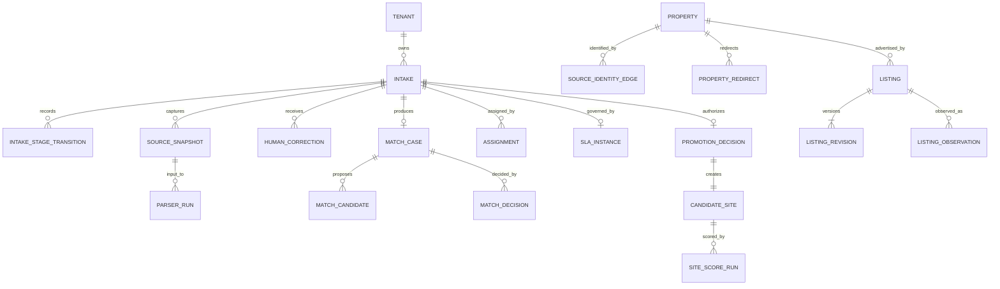

# ODay Plus Assisted Listing Intake System Design Response

## 1. Executive Decision

System Design accepts the Assisted Listing Intake product boundary and selects a modular-monolith transactional owner with separately deployable workers. The target production topology is Cloud Run, Cloud SQL PostgreSQL 16 + PostGIS, regional GCS snapshot/WORM storage, Cloud Tasks, Pub/Sub through a transactional outbox, Secret Manager/KMS, and OpenTelemetry-compatible observability.

The following are binding target changes relative to the current `dev` implementation:

1. Listing ingestion must not automatically create `CandidateSiteDraft`; candidate promotion is a separate explicit human decision and transaction/saga.
2. Rent is not part of property identity. Rent-only changes create `ListingRevision` records.
3. Intake stage, listing lifecycle, identity decision/execution, assignment/SLA, promotion, job, and audit are independent state models.
4. Ambiguous identity is persisted as `MatchCase` and never auto-merged.
5. Source records/snapshots and historical identity edges remain immutable; merge/split/unmerge are reversible through superseding edges and redirects.
6. Memory and SQLite remain test/local/Product-E2E adapters only. Production uses the selected GCP topology.
7. High-impact actions are non-optimistic, version-checked, idempotent, attributable, independently reviewed where required, and audit/WORM protected.

Unknown, prohibited, expired, unauthorized, unlicensed, or kill-switched sources fail closed. Provider credentials, cookies, private tokens, and private endpoints are never accepted by the product UI/API. No scheduled third-party result-page crawling or automatic listing-ID enumeration is part of this release.

## 2. Normative Artifact Register

Engineering, Product Design, QA, and reviewers must use the committed artifacts below. Endpoint handlers, state reducers, migrations, authorization policies, events, and operational runbooks must not invent contracts outside them.

| Contract group | Normative artifact | Decisions / review findings |
|---|---|---|
| Alignment source | `docs/design/ODAY_PLUS_ASSISTED_LISTING_INTAKE_SYSTEM_DESIGN_ALIGNMENT_REQUEST.md` | Preserves ODP-SD-INTAKE-ALIGN-001 on the PR branch |
| Aggregate/state/transition contract | `docs/design/ODAY_PLUS_ASSISTED_LISTING_INTAKE_STATE_CONTRACTS.md` | SDI-002/003/005/006/007/008; SDR-001/002 |
| Persistence schema | `docs/data/ODAY_PLUS_ASSISTED_LISTING_INTAKE_SCHEMA.sql` | SDI-001..004/009..011/014/018; SDR-003 |
| OpenAPI v1 | `docs/api/openapi/ODAY_PLUS_ASSISTED_LISTING_INTAKE_V1.yaml` | SDI-012/013/014; SDR-004 |
| Authorization/segregation | `docs/design/ODAY_PLUS_ASSISTED_LISTING_INTAKE_AUTHORIZATION_MATRIX.md` | SDI-004/006/016/017/018; SDR-005 |
| Event/outbox contract | `docs/events/ODAY_PLUS_ASSISTED_LISTING_INTAKE_EVENTS_V1.yaml` | SDI-015; SDR-006 |
| Reliability/privacy/evidence | `docs/operations/ODAY_PLUS_ASSISTED_LISTING_INTAKE_RELIABILITY_PRIVACY_CONTRACT.md` | SDI-017..022; SDR-007/008 |
| Migration/cutover/rollback | `docs/operations/ODAY_PLUS_ASSISTED_LISTING_INTAKE_MIGRATION_ROLLOUT_RUNBOOK.md` | SDI-023/024; migration review finding |

All artifacts are `proposed` until the approvals in section 13 are recorded. The fail-closed gates in section 13 remain binding meanwhile.

## 3. Canonical Domain and Ownership

### 3.1 Aggregate ownership

| Aggregate / record | Authoritative owner | Production record |
|---|---|---|
| `Intake`, `IntakeStageTransition` | Listing Intake application service | `intake.intakes`, `intake.intake_stage_transitions` |
| `SourceRegistry`, `ParserRelease`, `SourceSnapshot`, `ParserRun` | External Data / source-policy / parser services | `intake.source_registry`, `parser_releases`, `source_snapshots`, `parser_runs` |
| `Property`, effective identity edge, redirect | Identity Resolution service | `identity.properties`, `source_identity_edges`, `property_redirects` |
| `MatchCase`, `MatchDecision` | Identity Resolution service | `identity.match_cases`, `match_candidates`, `match_decisions` |
| `Listing`, immutable revision/observation | Listing service | `expansion.listings`, `listing_revisions`, `listing_observations` |
| `HumanCorrection` | Listing service; Identity service reviews identity-affecting corrections | `intake.human_corrections` |
| `Assignment`, `SlaInstance` | Workflow service | `workflow.assignments`, `workflow.sla_instances` |
| `PromotionDecision`, `CandidateSite` | Candidate Promotion boundary | `expansion.promotion_decisions`, `candidate_sites` |
| `IdempotencyRecord`, `Job`, `OutboxEvent` | API/job/platform owners | `workflow.idempotency_records`, `jobs`, `outbox_events` |
| `AuditEvent`, legal hold, export manifest | Audit/Privacy platform | `audit.audit_events`, `legal_holds`, `export_manifests` |

Every persisted business/workflow/evidence record includes `tenant_id`; scope-bearing records additionally preserve brand, region, assigned area, HeatZone, submitter, queue owner, and source where applicable. Tenant-inclusive uniqueness and backend ABAC are mandatory; frontend visibility is not enforcement.

### 3.2 ERD

Exact columns, constraints, indexes, versioning, retention/legal-hold fields, and timestamps are defined in the SQL artifact.

## 4. Binding State and Transaction Contracts

The complete diagrams and per-transition tables are in `ODAY_PLUS_ASSISTED_LISTING_INTAKE_STATE_CONTRACTS.md`. They name source/target, initiating actor, backend permission, precondition, idempotency, concurrency, evidence, audit/event, failure result, and terminal/reopen semantics.

Key clarifications requested by review:

- `QUARANTINED` is controlled and reopenable; it is not terminal and has no transition to `[*]`.
- Listing lifecycle is `ACTIVE`, `REMOVED`, `EXPIRED`, `STALE`, `QUARANTINED`, `ARCHIVED`; `REVISED` is a revision kind, not lifecycle state.
- Identity uses immutable edges, one effective edge per tenant/source/source-entity, explicit property redirects, serializable graph mutation, cycle prevention, as-of lineage, and compensating reversal.
- Candidate references are not silently rewritten after identity change. A reassignment plan or review is explicit.
- Assignment ownership uses aggregate versions; SLA is persisted from due time/business calendar/pause/escalation policy.
- Promotion success is an authoritative `PromotionReceipt` containing promotion decision, candidate, SiteScore job, versions, audit event, and correlation ID. Lost responses replay by idempotency key.

## 5. Source, Parser, Snapshot, Correction, and Decision Control Plane

### 5.1 Source registry

The source registry owns allowed hosts, canonicalization rule version, retrieval mode, legal/license references, policy owner, approval expiry, rate/concurrency limits, production enablement, and kill switch. Evaluation is fail closed.

`APPROVED_RETRIEVAL`, `ASSISTED_ENTRY_ONLY`, `AUTH_REQUIRED`, `SOURCE_BLOCKED`, and `POLICY_UNKNOWN` are separate from parser success. `AUTH_REQUIRED` never asks a user for credentials; the source remains blocked or assisted-entry-only unless approved server-side access exists.

### 5.2 Parser lifecycle

Parser releases are immutable, artifact-checksummed and source-bound. Lifecycle: `DRAFT -> VALIDATED -> CANARY -> PRODUCTION -> DEPRECATED/ROLLED_BACK/BLOCKED`. Promotion requires corpus evidence and schema compatibility. Reprocessing always names snapshot ID and parser release ID; old outputs remain lineage.

### 5.3 Snapshot and correction

Raw/redacted objects are immutable GCS objects with generation precondition, checksum, captured/observed/stored times, capture method, retention, residency, encryption key, and legal hold. Parser runs reference committed snapshot metadata.

Corrections preserve parsed, normalized, corrected, before-effective, after-effective, reason, proposer/reviewer, source snapshot, parser run, and supersession/reversal lineage. Identity/address/rent/area changes require reason; identity-affecting corrections require independent review.

## 6. API, Query, Concurrency, and Event Contracts

### 6.1 OpenAPI

The committed OpenAPI defines:

- stable cursor pagination and signed 24-hour opaque cursor semantics;
- Listing Inbox filters, search, total-count accuracy, freshness, saved-view ownership;
- URL/manual/CSV/approved-feed intake and 207 per-row batch receipts;
- parsed/normalized/corrected/masked field values;
- correction and match-decision payloads;
- merge/split/unmerge graph inputs;
- assignment concurrency;
- durable retry checkpoints;
- candidate promotion receipts;
- `Idempotency-Key`, `If-Match`, ETag, lost-response replay;
- validation, authorization, conflict, retry, and error-code schemas.

Generated clients and contract tests must derive from this artifact. Runtime handlers must not invent payloads while `ODP-INTAKE-API-001` is active.

### 6.2 Event decision

Internal events use versioned Pub/Sub envelopes published by transactional outbox with at-least-once delivery, per-aggregate ordering, 30-day consumer deduplication, retry/DLQ, controlled replay, and compatibility/deprecation rules.

External webhooks are **not supported in Assisted Listing Intake v1**. Registration/delivery APIs do not exist and outbound HTTP delivery is disabled. Adding webhooks requires a separate approved alignment/ADR; the current event artifact explicitly records this release decision.

## 7. Authorization, Privacy, and Evidence

The authorization artifact contains a deny-by-default role/service/action/resource/field/scope/state/risk matrix for Expansion staff, managers, data stewards, governance reviewers, privacy officers, platform/emergency administrators, and all service identities.

Binding segregation rules include:

- manager-proposed promotion requires another manager;
- merge/split/unmerge proposer cannot review their own decision;
- identity-affecting correction requires second actor;
- restricted export, purge, and legal-hold release require independent Privacy/Governance approval;
- emergency administration restores availability only and cannot approve business outcomes.

Field classes are `PUBLIC`, `INTERNAL`, `CONFIDENTIAL`, `RESTRICTED`, and `CREDENTIAL`. Credentials are never collected/returned/exported. Masked API fields remain structurally visible with `masked=true` and a backend reason code.

Privacy lifecycle, retention, purge ordering, legal-hold propagation/release, residency, export manifests/watermarks, WORM verification, and audit fail-closed behavior are defined in the reliability/privacy artifact.

## 8. Production Persistence, Jobs, and Runtime

### 8.1 Storage

- Cloud SQL PostgreSQL 16/PostGIS regional HA is the write authority.
- GCS regional object storage holds immutable source snapshots and WORM evidence.
- Default residency is `TW_ONLY`; cross-region APAC DR is disabled until Legal/Privacy/customer approval.
- CMEK ownership and proposed 90-day rotation belong to Security.
- Proposed PITR and backup retention are documented but do not become commitments until approved.
- SQL/GCS consistency uses object-first write, checksum metadata commit, orphan/integrity reconciliation, and parser gating.

### 8.2 Jobs

Cloud Tasks provides delivery; `workflow.jobs` is authoritative. Jobs use SQL versions, fence tokens, heartbeat/lease, stage timeout, bounded retry/backoff, cancellation checkpoints, DLQ, backpressure, replay authorization, and alert ownership. Cloud Task acknowledgement happens only after authoritative SQL/outbox commit.

## 9. Capacity, SLO, and Recovery

The reliability artifact provides proposed quantitative capacity, p95/p99 latency, queue-age, parser completion, review SLA, outbox, audit, RPO/RTO, restore order, and drill cadence.

These numbers remain `PROPOSED`. They must not appear as contractual commitments until the approval table in section 13 is completed. Before approval, production rollout flags remain disabled.

## 10. Migration and Rollout

The migration runbook defines:

- current-to-target mappings and schema/version artifacts;
- backfill partitioning, source replay, identity reconciliation, and irreconcilable-record ownership;
- historical automatic-candidate classification through explicit `LEGACY_RECONCILED` evidence rather than fabricated human approval;
- count/checksum/identity/candidate/snapshot/audit proof;
- shadow processing, write canary, event/promotion canary, acceptance metrics;
- per-tenant/source feature flags and kill switches;
- rollback triggers and checkpoint-safe rollback;
- legacy memory/SQLite/fixture paths restricted to tests after cutover.

No indefinite dual-write is selected. Target write authority is enabled per tenant/source only after shadow parity and zero blocking findings. Identity and promotion decisions are never rolled back by data scripts; their approved reversal state machines apply.

## 11. UX-Binding System Facts

Product/UX must expose, not infer:

- exact intake, listing, match, assignment/SLA, decision, promotion, and job states;
- original/canonical URL, source policy, parser/snapshot/correlation/freshness identifiers;
- parsed vs normalized vs corrected vs effective values and masking state;
- match evidence, contradictory signals, confidence, current effective property, lineage/as-of link;
- current owner, due time, SLA state, transfer/escalation history;
- aggregate version/ETag conflicts and backend reason codes;
- non-optimistic progress and durable receipts for correction, identity, quarantine, promotion, export, purge, and legal hold;
- `POSSIBLE_MATCH` cannot auto-merge; candidate promotion cannot be automatic;
- source policy and parser status are separate;
- retry checkpoint, attempts, next retry, cancellation availability, and DLQ/replay authorization;
- audit actor/time/reason/before-after/snapshot/parser/decision and WORM verification state.

Errors show summary, next action, code, correlation ID, occurred time, retryability, and current state/version where applicable. Deep links and list URL state remain durable.

## 12. Decision Matrix

| ID | Decision | Binding contract / reference | Rationale and migration impact | Owner | Open dependency / gate |
|---|---|---|---|---|---|
| SDI-001 | MODIFY | SQL schema + §3 | Split current listing/candidate shortcut into canonical aggregates | System Design/Data | Schema approval |
| SDI-002 | MODIFY | State contracts §3 + SQL | Revisions/observations separated from lifecycle | Listing owner | Contract tests |
| SDI-003 | MODIFY | State contracts §4 + SQL identity tables | Immutable reversible graph; rent excluded from identity | Identity/Data | Reconciliation approval |
| SDI-004 | ACCEPT | SQL tenant/scope keys + authorization matrix | Backend tenant/scope enforcement | Security/Data | RLS/ABAC tests |
| SDI-005 | MODIFY | State contracts §2 | Quarantine made non-terminal/reopenable; transitions binding | Intake owner | State tests |
| SDI-006 | MODIFY | State contracts §4/6 + auth matrix | Independent review and reversal formalized | Identity/Security | SoD tests |
| SDI-007 | MODIFY | State contracts §5 + SQL workflow | Assignment concurrency and SLA persisted | Workflow/Ops | Business calendar approval |
| SDI-008 | MODIFY | State contracts §7 + OpenAPI promotion | Explicit human decision; atomic candidate create + score saga | Expansion Engineering | Promotion E2E |
| SDI-009 | ACCEPT | SQL source registry + §5 | Fail-closed source control plane | Source owner/Legal | Per-source approval |
| SDI-010 | ACCEPT | SQL parser release/run + §5 | Versioned canary/rollback/reprocess | Data steward | Corpus evidence |
| SDI-011 | ACCEPT | SQL snapshots + reliability §1.3/5 | Immutable provenance/checksum/residency | External Data/Security | Retention approval |
| SDI-012 | ACCEPT | OpenAPI `GET /v1/intakes` | Stable cursor, masking, freshness, saved views | API/Data | Contract tests |
| SDI-013 | MODIFY | OpenAPI intake/batch endpoints | One envelope, per-row partial receipts and replay | Intake/API | Generated client |
| SDI-014 | ACCEPT | OpenAPI headers/errors + SQL idempotency | Tenant/actor/operation-bound replay and versions | API Platform | Concurrency tests |
| SDI-015 | MODIFY | Event YAML | Pub/Sub/outbox selected; webhooks excluded from v1 | Platform | Product approval of exclusion |
| SDI-016 | MODIFY | Authorization matrix | Testable resource/action/field/scope/state/risk rules | Security | Policy tests |
| SDI-017 | MODIFY | Auth matrix + reliability privacy §5 | Explicit masking, purge, hold, residency, export | Privacy/Legal | Privacy/Legal approval |
| SDI-018 | MODIFY | SQL audit + reliability §5/6 | Hash chain/WORM/export verification and fail-closed actions | Security/Audit | WORM integration proof |
| SDI-019 | ACCEPT | Reliability §1 + SQL | Cloud SQL/GCS production; SQLite/memory test only | Platform/Data | Infrastructure proof |
| SDI-020 | MODIFY | Reliability §2 + SQL jobs | Lease/fence/timeout/backpressure/replay/DLQ | Platform/SRE | Load/failure tests |
| SDI-021 | MODIFY | Reliability §3 | Quantitative proposed capacity/SLO with owners | Product/Ops/SRE | Owner approval |
| SDI-022 | MODIFY | Reliability §4 | Data-class RPO/RTO, restore order and drills | Platform/SRE/Security | Drill evidence |
| SDI-023 | MODIFY | Migration runbook §§2-5 | Executable mapping, reconciliation findings, rollback | Data/Expansion | Staging dry run |
| SDI-024 | MODIFY | Migration runbook §§4-6 | Per-tenant/source flags, shadow/canary/cutover/kill switch | Release authority | All P0 approvals |

## 13. Approval Records and Fail-Closed Gates

| Approval owner | Status | Required approval scope | Fail-closed behavior while pending |
|---|---|---|---|
| Product / Expansion Ops | PENDING | Workflow states, review SLA, capacity, webhook exclusion | No production write/promotion rollout |
| Security | PENDING | Authorization, KMS, WORM, break glass, restricted access | High-risk production mutations disabled |
| Privacy | PENDING | Retention, purge, legal hold, residency, restricted exports | Purge/restricted export/cross-region DR disabled |
| Legal / Commercial | PENDING | Per-source retrieval/license and residency | Source remains assisted-entry-only or blocked |
| Data owner | PENDING | Schema, identity graph, parser/reconciliation | No authoritative migration/cutover |
| Platform / SRE | PENDING | HA, jobs, SLO/RPO/RTO, backups/restores | Production storage/async flags disabled |
| Expansion Engineering | PENDING | API/state/promotion implementation feasibility | No handlers may invent contracts |
| QA | PENDING | Contract/schema/auth/event/recovery/E2E plan | No release candidate |
| Release authority | PENDING | Canary/cutover/rollback evidence | All production flags off |

The document status remains `proposed`. It may change to `approved` only after every P0 contract group is approved and linked evidence is recorded.

## 14. Implementation Handoff Boundaries

Contract-first work packages:

1. `ODP-INTAKE-SCHEMA-001` — Alembic migration and schema constraint tests.
2. `ODP-INTAKE-STATES-001` — transition engine and exhaustive state tests.
3. `ODP-INTAKE-IDENTITY-001` — immutable edge/redirect graph and merge/split/unmerge tests.
4. `ODP-INTAKE-API-001` — OpenAPI validation, generated client, endpoint contract tests.
5. `ODP-INTAKE-AUTH-001` — backend RBAC/ABAC/field-mask/SoD matrix tests.
6. `ODP-INTAKE-EVENTS-001` — outbox publisher, schemas, consumer dedup/replay/DLQ tests.
7. `ODP-INTAKE-SNAPSHOT-001` — GCS snapshot/checksum/residency/reconciliation.
8. `ODP-INTAKE-JOBS-001` — Cloud Tasks + durable job fence/timeout/backpressure.
9. `ODP-INTAKE-PRIVACY-001` — hold/purge/export manifests and WORM evidence.
10. `ODP-INTAKE-MIGRATION-001` — staging backfill/reconciliation/rollback evidence.
11. `ODP-INTAKE-PROMOTION-001` — remove automatic candidate creation; implement decision/saga.
12. `ODP-INTAKE-UX-001` — update UI only from approved states/API/auth facts.
13. `ODP-INTAKE-LOAD-001` — capacity/SLO validation.
14. `ODP-INTAKE-RELEASE-001` — tenant/source canary, UAT, restore and rollback gates.

Schema/OpenAPI/state/auth/event contract tests must land before product behavior implementation. Document-only changes do not close runtime implementation tasks.
