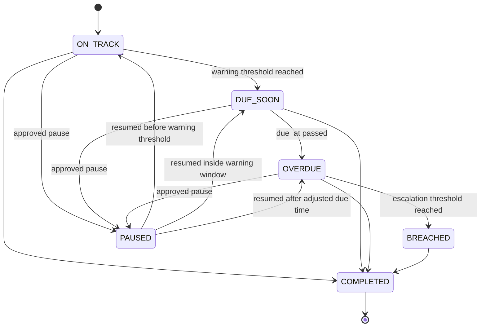

# ODay Plus Assisted Listing Intake v0.2.1 Cross-Contract Corrections

## 1. Purpose, normative register, and precedence

This document records explicit textual corrections to `ODP-SD-INTAKE-001`. It does not maintain an independent or partial artifact list. The review manifest is the sole authority for package membership and apply order, and the identical machine-readable register below is validated against both the manifest and the consolidated response.

<!-- normative-register:start -->
```json
{
  "manifest_path": "docs/design/ODAY_PLUS_ASSISTED_LISTING_INTAKE_REVIEW_MANIFEST.yaml",
  "normative_artifacts": [
    "docs/design/ODAY_PLUS_ASSISTED_LISTING_INTAKE_SYSTEM_DESIGN_ALIGNMENT_REQUEST.md",
    "docs/design/ODAY_PLUS_ASSISTED_LISTING_INTAKE_SYSTEM_DESIGN_RESPONSE.md",
    "docs/design/ODAY_PLUS_ASSISTED_LISTING_INTAKE_V021_CROSS_CONTRACT_CORRECTIONS.md",
    "docs/design/ODAY_PLUS_ASSISTED_LISTING_INTAKE_STATE_CONTRACTS.md",
    "docs/design/ODAY_PLUS_ASSISTED_LISTING_INTAKE_AUTHORIZATION_MATRIX.md",
    "docs/design/ODAY_PLUS_ASSISTED_LISTING_INTAKE_REVIEW_MANIFEST.yaml",
    "docs/data/ODAY_PLUS_ASSISTED_LISTING_INTAKE_SCHEMA.sql",
    "docs/data/ODAY_PLUS_ASSISTED_LISTING_INTAKE_SCHEMA_0002_CONSISTENCY_PATCH.sql",
    "docs/data/ODAY_PLUS_ASSISTED_LISTING_INTAKE_SCHEMA_0003_PROMOTION_STATE_PATCH.sql",
    "docs/data/ODAY_PLUS_ASSISTED_LISTING_INTAKE_SCHEMA_0004_TENANT_RLS_LINEAGE_PATCH.sql",
    "docs/api/openapi/ODAY_PLUS_ASSISTED_LISTING_INTAKE_V1.yaml",
    "docs/api/openapi/ODAY_PLUS_ASSISTED_LISTING_INTAKE_V1_0_1_PRELUDE_OVERLAY.yaml",
    "docs/api/openapi/ODAY_PLUS_ASSISTED_LISTING_INTAKE_V1_1_OVERLAY.yaml",
    "docs/api/openapi/ODAY_PLUS_ASSISTED_LISTING_INTAKE_V1_1_1_CONSISTENCY_OVERLAY.yaml",
    "docs/api/openapi/ODAY_PLUS_ASSISTED_LISTING_INTAKE_V1_1_2_LINT_OVERLAY.yaml",
    "docs/api/openapi/ODAY_PLUS_ASSISTED_LISTING_INTAKE_V1_1_3_REDOCLY_OVERLAY.yaml",
    "docs/events/ODAY_PLUS_ASSISTED_LISTING_INTAKE_EVENTS_V1.yaml",
    "docs/events/ODAY_PLUS_ASSISTED_LISTING_INTAKE_EVENTS_V1_1_ADDENDUM.yaml",
    "docs/events/ODAY_PLUS_ASSISTED_LISTING_INTAKE_EVENT_PAYLOAD_SCHEMAS_V1.yaml",
    "docs/operations/ODAY_PLUS_ASSISTED_LISTING_INTAKE_RELIABILITY_PRIVACY_CONTRACT.md",
    "docs/operations/ODAY_PLUS_ASSISTED_LISTING_INTAKE_MIGRATION_ROLLOUT_RUNBOOK.md",
    "scripts/validate_assisted_listing_intake_design.py",
    "scripts/build_validate_assisted_listing_intake_openapi.py",
    "scripts/validate_assisted_listing_intake_schema.sql",
    ".github/workflows/assisted-intake-design-validation.yml"
  ],
  "precedence": [
    "alignment_request",
    "consolidated_response",
    "review_manifest_for_artifact_register_and_apply_order",
    "correction_pack_for_explicit_textual_corrections",
    "machine_readable_stacks_in_manifest_order_later_artifact_overrides_earlier",
    "unchanged_base_artifact_clauses",
    "runtime_implementation"
  ],
  "schema_apply_order": [
    "docs/data/ODAY_PLUS_ASSISTED_LISTING_INTAKE_SCHEMA.sql",
    "docs/data/ODAY_PLUS_ASSISTED_LISTING_INTAKE_SCHEMA_0002_CONSISTENCY_PATCH.sql",
    "docs/data/ODAY_PLUS_ASSISTED_LISTING_INTAKE_SCHEMA_0003_PROMOTION_STATE_PATCH.sql",
    "docs/data/ODAY_PLUS_ASSISTED_LISTING_INTAKE_SCHEMA_0004_TENANT_RLS_LINEAGE_PATCH.sql"
  ],
  "openapi_bundle_order": [
    "docs/api/openapi/ODAY_PLUS_ASSISTED_LISTING_INTAKE_V1.yaml",
    "docs/api/openapi/ODAY_PLUS_ASSISTED_LISTING_INTAKE_V1_0_1_PRELUDE_OVERLAY.yaml",
    "docs/api/openapi/ODAY_PLUS_ASSISTED_LISTING_INTAKE_V1_1_OVERLAY.yaml",
    "docs/api/openapi/ODAY_PLUS_ASSISTED_LISTING_INTAKE_V1_1_1_CONSISTENCY_OVERLAY.yaml",
    "docs/api/openapi/ODAY_PLUS_ASSISTED_LISTING_INTAKE_V1_1_2_LINT_OVERLAY.yaml",
    "docs/api/openapi/ODAY_PLUS_ASSISTED_LISTING_INTAKE_V1_1_3_REDOCLY_OVERLAY.yaml"
  ],
  "event_apply_order": [
    "docs/events/ODAY_PLUS_ASSISTED_LISTING_INTAKE_EVENTS_V1.yaml",
    "docs/events/ODAY_PLUS_ASSISTED_LISTING_INTAKE_EVENTS_V1_1_ADDENDUM.yaml",
    "docs/events/ODAY_PLUS_ASSISTED_LISTING_INTAKE_EVENT_PAYLOAD_SCHEMAS_V1.yaml"
  ]
}
```
<!-- normative-register:end -->

Precedence semantics are identical to the consolidated response:

1. alignment request;
2. consolidated response;
3. review manifest for artifact membership and apply order;
4. this correction pack for clauses explicitly corrected here;
5. machine-readable stacks in manifest order, with later artifacts overriding earlier conflicts;
6. unchanged base-artifact clauses;
7. runtime implementation.

No runtime task may implement a contradictory earlier clause. A mismatch among the response, this correction pack, and the manifest fails the pre-review gate.

## 2. Confirmed blockers in v0.2.0

| ID | Confirmed problem | Binding correction |
|---|---|---|
| `CCR-001` | Assignment had a transition table, but SLA had only prose. | Add the SLA state diagram and transition contract in §3. |
| `CCR-002` | Decision review/execution/reversal had a diagram but no per-transition contract. | Add the decision transition table in §4. |
| `CCR-003` | Promotion state required independent human review, while OpenAPI exposed only a final `201 PromotionReceipt`. | Promotion becomes request -> review -> asynchronous execution; see §5 and the OpenAPI overlay. |
| `CCR-004` | Assignment claim/transfer/complete, SLA pause/resume, intake cancel/reopen/quarantine, and decision review/reversal had no API operations. | Add command endpoints through the OpenAPI overlay. |
| `CCR-005` | Authorization denial codes, reliability codes, and OpenAPI `ApiError.code` were inconsistent. | §6 defines the canonical error registry; the OpenAPI overlay replaces the enum. |
| `CCR-006` | State tables named many emitted events absent from the event catalog. | §7 distinguishes audit action codes from domain events and adds the missing event catalog entries. |
| `CCR-007` | SQL foreign keys did not consistently enforce tenant equality; RLS was enabled on only a subset of tenant tables. | Apply the complete four-file schema stack through patch `0004`; see §8. |
| `CCR-008` | URL uniqueness prevented later revision observations, and snapshot uniqueness collapsed evidence across separate intakes. | Replace both unique constraints with lineage-safe indexes in schema patch `0002`. |
| `CCR-009` | Assignment/SLA history and pause intervals were not physically modeled. | Add transition and pause interval tables in schema patch `0002`. |
| `CCR-010` | Runbook used `PromotionDecision(decision_type=LEGACY_RECONCILED)` although the schema had no `decision_type`. | Add `decision_type` and `migration_ref`; see §9. |
| `CCR-011` | Event payload entries listed required names but were not complete JSON Schemas. | Event addendum supplies typed schemas for added events and requires base payload schemas to be completed before merge. |
| `CCR-012` | Review was not commit-bound, allowing an old `CHANGES_REQUESTED` artifact to be presented as a new review. | Add review manifest and mandatory target-SHA check; see §10. |

## 3. Binding SLA state machine



| From | To | Initiator / permission | Preconditions | Idempotency / concurrency | Persisted evidence / event | Failure | Terminal / reopen |
|---|---|---|---|---|---|---|---|
| `[*]` | `ON_TRACK` | Workflow service / `sla.create` | Assignment exists; policy/calendar version resolved | Assignment ID + policy version | `sla_instance`, due calculation, `sla.state_changed` | Assignment transaction rolls back | Reopenable |
| `ON_TRACK` | `DUE_SOON` | SLA worker / `sla.evaluate` | `now >= due_soon_at`; not paused/completed | SLA version + deterministic evaluation window | Evaluation receipt; `sla.state_changed` | Remain prior state; retry | Reopenable |
| `DUE_SOON` | `OVERDUE` | SLA worker / `sla.evaluate` | `now >= due_at`; not paused/completed | SLA version + evaluation window | Due evidence; `sla.state_changed` | Remain due soon; retry | Reopenable |
| `OVERDUE` | `BREACHED` | SLA worker / `sla.escalate` | Breach threshold met and escalation not already emitted | SLA version + escalation level | Escalation receipt; `sla.breached` | Remain overdue; page workflow owner | Reopenable |
| `ON_TRACK`,`DUE_SOON`,`OVERDUE` | `PAUSED` | Manager/steward / `sla.pause` | Approved pause reason, start and expected resume; policy permits pause | `If-Match` + idempotency key | Pause interval; `sla.state_changed`; audit | `409 SLA_PAUSE_DENIED` | Reopenable |
| `PAUSED` | `ON_TRACK`,`DUE_SOON`,`OVERDUE` | Manager/steward or scheduled resume / `sla.resume` | Active pause interval; adjusted due time calculated | `If-Match` + resume key | Closed pause interval and due-time before/after; `sla.state_changed` | Remain paused | Reopenable |
| Any non-completed | `COMPLETED` | Workflow service after assignment completion / `sla.complete` | Assignment work requirements completed | Assignment completion key + SLA version | Completion receipt; `sla.state_changed` | `409 WORK_INCOMPLETE` | Terminal |

SLA due time is never inferred only in the UI. The backend returns authoritative `due_at`, `due_soon_at`, `paused_duration_seconds`, `state`, `policy_version`, and `version`.

## 4. Binding decision review, execution, and reversal transitions

| From | To | Initiator / permission | Preconditions | Idempotency / concurrency | Persisted evidence / domain event | Failure | Terminal / reopen |
|---|---|---|---|---|---|---|---|
| `[*]` | `DRAFT` | Authorized proposer / operation-specific `.propose` | Resource and evidence exist in tenant/scope | Idempotency key + resource versions | Draft, proposer, reason, evidence refs; no external event | Validation error | Reopenable |
| `DRAFT` | `PENDING_REVIEW` | Proposer / `.submit_review` | Required reason, graph/gate plan and risk acknowledgement present | `If-Match` + submission key | Reviewer routing; operation-specific review-required event | `422 DECISION_INCOMPLETE` | Reopenable |
| `PENDING_REVIEW` | `APPROVED` | Independent reviewer / `.review` | Reviewer authorized and different from proposer when segregation applies | `If-Match` + review idempotency | Review decision, before/after plan; operation-specific reviewed event | `403 SELF_REVIEW_DENIED`, `409 SECOND_ACTOR_REQUIRED` | Reopenable |
| `PENDING_REVIEW` | `REJECTED` | Independent reviewer / `.review` | Reason required | `If-Match` + review key | Rejection reason; reviewed event | Remain pending on conflict | Terminal |
| `APPROVED` | `EXECUTING` | Owning service / `.execute` | Approval current, not expired/superseded; dependent versions match | Decision ID + execution fence | Job/execution receipt; audit | Return approved for bounded retry | Reopenable |
| `EXECUTING` | `EXECUTED` | Owning service / `.execute` | Atomic transaction or declared saga checkpoint committed | Fence token + versions | Durable result; domain event; audit/outbox | Full transaction rollback or compensation | Reopenable only by reversal |
| `EXECUTING` | `FAILED` | Owning service / `.execute` | Non-retryable failure or retry budget exhausted | Attempt/fence token | Error/checkpoint receipt; audit | No partial result exposed | Reopenable by authorized replay |
| `APPROVED` | `SUPERSEDED` | Owner/reviewer / `.supersede` | New approved decision replaces old one before execution | `If-Match` + replacement decision ID | Supersession lineage; audit | Remain approved | Terminal |
| `EXECUTED` | `REVERSAL_PENDING` | Authorized proposer / `.reverse` | Original evidence/result exists; dependency check passes; reason/risk ack | Resource graph version + reversal key | Reversal plan; review-required event | `409 DEPENDENCY_CONFLICT` | Reopenable |
| `REVERSAL_PENDING` | `REVERSED` | Independent reviewer + owning service / `.review_reverse` | Second actor approval and compensating transaction succeeds | `If-Match` + reversal fence | Compensating result; domain event; audit | Remain pending or `FAILED`; no hidden partial reversal | Terminal |
| `FAILED` | `PENDING_REVIEW` or `APPROVED` | Authorized replay actor / `.retry` | Root cause fixed and retry checkpoint valid | Replay key + fence | Replay receipt; audit | Remain failed | Reopenable |

## 5. Corrected API command model

### 5.1 Promotion

The v0.2.0 `POST /v1/intakes/{intake_id}/promotion -> 201 PromotionReceipt` contract is superseded and must not be implemented.

Canonical flow:

```text
POST /v1/intakes/{intake_id}/promotion-requests
  -> 202 PromotionDecisionReceipt(status=REQUESTED|VALIDATING|PENDING_REVIEW)

POST /v1/promotion-decisions/{promotion_decision_id}/actions/review
  -> 200/202 PromotionDecisionReceipt(status=APPROVED|REJECTED|CANDIDATE_CREATING)

GET /v1/promotion-decisions/{promotion_decision_id}
  -> current decision, candidate ID and SiteScore job ID when committed
```

The human request never returns a fabricated candidate or score job. `candidate_site_id` and `site_score_job_id` are nullable until the execution transaction commits. The execution service may act only after an approved decision.

### 5.2 Assignment and SLA commands

Required operations:

- `POST /v1/assignments/{assignment_id}/actions/claim`
- `POST /v1/assignments/{assignment_id}/actions/transfer`
- `POST /v1/assignments/{assignment_id}/actions/complete`
- `POST /v1/sla-instances/{sla_instance_id}/actions/pause`
- `POST /v1/sla-instances/{sla_instance_id}/actions/resume`

All require `Idempotency-Key` and `If-Match`, except service-created initial assignment/SLA records inside the intake transaction.

### 5.3 Intake and identity commands

Required operations:

- `POST /v1/intakes/{intake_id}/actions/cancel`
- `POST /v1/intakes/{intake_id}/actions/quarantine`
- `POST /v1/intakes/{intake_id}/actions/reopen`
- `GET /v1/identity-decisions/{decision_id}`
- `POST /v1/identity-decisions/{decision_id}/actions/review`
- `POST /v1/identity-decisions/{decision_id}/actions/reverse`

Merge/split/unmerge endpoints create or update a decision proposal. They do not bypass independent review.

The machine-readable API contract is the complete six-artifact OpenAPI bundle in the normative register. The v1.1 command overlay is only one member of that stack; all registered overlays must be applied before client generation, examples, lint, or contract testing.

## 6. Canonical error registry

The following codes are the single cross-contract registry. OpenAPI, backend policy, UI copy, audit, tests and runbooks must use these exact values:

```text
AUTHENTICATION_REQUIRED
ROLE_DENIED
TENANT_SCOPE_DENIED
SCOPE_DENIED
OWNERSHIP_REQUIRED
ASSIGNMENT_SCOPE_DENIED
SOURCE_SCOPE_DENIED
FIELD_MASKED
DATA_CLASSIFICATION_DENIED
PURPOSE_REQUIRED
PRECONDITION_REQUIRED
VERSION_CONFLICT
WORKFLOW_STATE_DENIED
OWNER_CONFLICT
SECOND_ACTOR_REQUIRED
SELF_REVIEW_DENIED
RISK_ACKNOWLEDGEMENT_REQUIRED
SOURCE_POLICY_DENIED
SOURCE_POLICY_UNKNOWN
SOURCE_AUTH_REQUIRED
LEGAL_HOLD_CONFLICT
RETENTION_NOT_REACHED
RESIDENCY_DENIED
EXPORT_APPROVAL_REQUIRED
PURGE_APPROVAL_REQUIRED
BREAK_GLASS_DENIED
DEPENDENCY_CONFLICT
DUPLICATE_CANDIDATE
IDEMPOTENCY_KEY_REUSED
RETRY_BUDGET_EXHAUSTED
CHECKPOINT_UNAVAILABLE
JOB_FENCE_REJECTED
SLA_PAUSE_DENIED
DECISION_INCOMPLETE
BACKPRESSURE_ACTIVE
RATE_LIMITED
RESOURCE_NOT_FOUND
VALIDATION_FAILED
FIELD_REQUIRED
CURSOR_INVALID
CURSOR_EXPIRED
INTERNAL_ERROR
```

`WORKFLOW_STATE_CONFLICT` is retired in favor of `WORKFLOW_STATE_DENIED`. Generic `403 Forbidden` responses still return the specific backend code.

## 7. Domain-event versus audit-action rule

Only event types present in the base event catalog plus the v1.1 addendum are domain events. Granular labels previously written in state tables, such as `intake.identity_check_started.v1`, are audit action codes unless mapped below.

| State-contract action family | Canonical domain event |
|---|---|
| Any intake state transition | `intake.state_changed` |
| Snapshot commit | `snapshot.created` |
| Parser completion | `parser.run_completed` |
| Ambiguous match routed | `match.review_required` |
| Match human/system decision | `match.decided` |
| Effective identity graph change/reversal | `identity.resolution_changed` |
| Listing create/revise/state | `listing.created`, `listing.revised`, `listing.status_changed` |
| Assignment assign/transfer/claim/complete | cataloged assignment event of the same verb |
| SLA state/breach | `sla.state_changed`, `sla.breached` |
| Promotion request/review/create/complete/fail | cataloged promotion event of the same phase |
| Job replay/dead-letter | `job.replay_requested`, `job.dead_lettered` |
| Legal hold/export | cataloged governance event |

`event_version` is a separate integer. Event type strings do not include `.v1`.

## 8. Persistence corrections and canonical schema stack

The canonical relational contract is the complete four-file schema stack, in this exact order:

1. `docs/data/ODAY_PLUS_ASSISTED_LISTING_INTAKE_SCHEMA.sql`
2. `docs/data/ODAY_PLUS_ASSISTED_LISTING_INTAKE_SCHEMA_0002_CONSISTENCY_PATCH.sql`
3. `docs/data/ODAY_PLUS_ASSISTED_LISTING_INTAKE_SCHEMA_0003_PROMOTION_STATE_PATCH.sql`
4. `docs/data/ODAY_PLUS_ASSISTED_LISTING_INTAKE_SCHEMA_0004_TENANT_RLS_LINEAGE_PATCH.sql`

Patch responsibilities:

- `0002` corrects URL/snapshot uniqueness, adds assignment/SLA/pause history, promotion migration lineage, reconciliation findings, and the first tenant-qualified composite constraints.
- `0003` makes promotion `PENDING_REVIEW` schema-valid.
- `0004` completes tenant-qualified current-pointer and lineage foreign keys and enforces `ENABLE ROW LEVEL SECURITY`, `FORCE ROW LEVEL SECURITY`, and the fail-closed `tenant_isolation` policy on every tenant-bearing contract table.

`0002` alone is not the canonical relational patch and must never be applied as the final schema. Production migration must apply all four artifacts, reconcile existing rows, validate every `NOT VALID` constraint, and pass PostgreSQL catalog checks before authoritative writes are enabled. Cross-tenant or orphaned rows become blocking reconciliation findings and are never silently rewritten.

## 9. Migration correction

Historical automatically created candidates use:

```text
promotion_decisions.decision_type = LEGACY_RECONCILED
promotion_decisions.status = COMPLETED
promotion_decisions.migration_ref = <migration receipt>
reviewer_subject_id = NULL
```

This is migration evidence, not a human approval. It is allowed only during the governed backfill and must remain distinguishable in UI, API, audit, analytics and exports.

## 10. Commit-bound review protocol

A review is valid only when its front matter contains:

```yaml
reviewed_commit: <exact PR head SHA>
response_version: 0.2.1
base_branch: dev
base_commit: <exact dev SHA>
artifact_manifest: docs/design/ODAY_PLUS_ASSISTED_LISTING_INTAKE_REVIEW_MANIFEST.yaml
```

Before review begins:

```text
if reviewed_commit != current PR head:
    stop
    result = STALE_REVIEW_TARGET
```

A stale review must never be labeled `APPROVED` or `CHANGES_REQUESTED` for the current head. The old review anchored to `ffe14c77...` remains historical evidence only.

## 11. Release gates

The correction pack does not change the response from `proposed` to `approved`. Re-review must verify:

1. SLA and decision transition tables are accepted.
2. The complete six-artifact OpenAPI stack in the normative register composes and validates with zero Redocly errors or warnings.
3. The complete four-file schema stack in the normative register applies to PostgreSQL 16 and all FORCE RLS, tenant-policy, and tenant-lineage catalog tests pass.
4. Every state-referenced domain event exists in the base catalog or addendum.
5. Authorization denial codes are a subset of the canonical OpenAPI error registry.
6. Promotion request/review/execution and assignment/SLA command paths have contract tests.
7. `LEGACY_RECONCILED` backfill is schema-valid and never appears as human approval.
8. Review front matter is anchored to the exact current PR head.

Until those gates pass, production write, promotion, identity mutation, restricted export, purge and cutover flags remain off.
