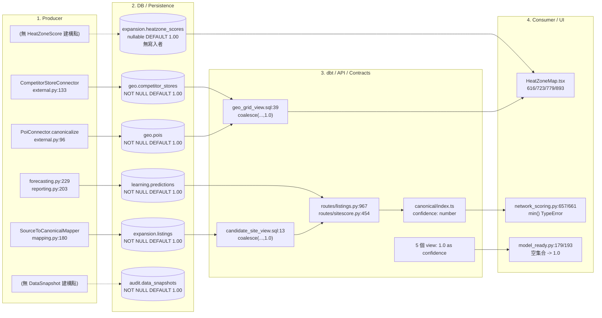
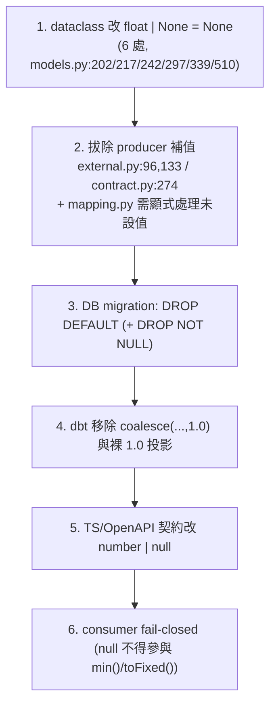

# Canonical 六模型 Producer Lineage、缺席率量測與 Legacy 1.0 遷移風險報告

- 日期：2026-09-03
- 量測基準 commit：`da417c49`（task branch，base 已 advance 至 `origin/dev` @ `8479567d`）
- 任務：`ODP-CANONICAL-LEGACY-LINEAGE-001`
- 關聯文件：
  - [修正計畫](../plans/ODP_REMEDIATION_PLAN_2026-09-03.md)（第 3 批與第 1-2 批邊界）
  - [待裁決事項](../plans/ODP_OPEN_DECISIONS_2026-09-03.md)（第 1、5 項）
  - [結構性修正結果](./ODP_STRUCTURAL_REMEDIATION_2026-09-01.md)

---

## 〇、本次修訂處理的退回意見

前一版（`238ef09a`）被 reviewer 退回，共六項。逐項對應如下：

| # | 退回意見 | 本版處置 | 章節 |
|---|---|---|---|
| 1 | 第 3 節對 `Prediction`／`HeatZoneScore`／`DataSnapshot` 只寫「100%／變動」，沒有可辨識來源的實際分子分母 | 三者改以**可辨識且可重跑的來源**量測：`Prediction` 用建構點普查（D=2, N=1）、`HeatZoneScore` 用 `geo_grid_view` 連接結構與 `from_dict` 重建路徑、`DataSnapshot` 用 10 個 model_ready view 的 20 個 bounded-score 投影（D=20, N=11）。無法量測者明確標示「分母為 0／不可量測」，不再以「100%」搪塞 | 四 |
| 2 | 第 5 節漏掉非測試的 `network_listings.py:496`，且 A/B 分類數字與 56 矛盾 | 56 筆改為**程式產生的完整清冊**，逐筆列出並重新對帳為 A=10／B=46；`network_listings.py:496`（註解行）已納入並說明它為何計入 grep 的 56 | 六 |
| 3 | repo 仍有 `modules/heatzone/v3/contract.py:274` 的 `confidence` 1.0 fallback，報告未列 disposition | 已列入，並說明 v3 的修正只到 `HeatZoneV3Input`（`contract.py:119`），`HeatZoneV3ScoreResult`（`:159`）與其 `from_dict`（`:274`）仍把缺席還原成滿分 | 五.3、七.1 |
| 4 | `HeatZoneMap.tsx:616、723、779、893` 的 nullable 不安全 consumer 未完整列入 disposition | 四個點位逐一列出，並區分「crash」與「靜默錯誤語意」兩種破壞模式；另補 `SiteScorePanel.tsx:192`、`GrowthWorkspace.tsx:588/692` | 七.3 |
| 5 | 重算範圍誤指不存在的 `data_plane.raw_snapshots` | 更正為實際存在的 `intake.source_snapshots`（`raw_object_uri` 指向 object store）＋ `data_plane.canonical_lineage` 對照表；並逐表列出**哪些表根本沒有回溯欄位因此不可重算** | 五.3 |
| 6 | 須補五個非 `DataSnapshot` 模型的可稽核 schema-version／`legacy_unknown` 落地策略 | 逐表列出現況欄位盤點與各自的落地方式（三種不同做法，因為五張表的回溯能力不同） | 五.2 |

此外本版修正了前一版的三處事實錯誤，詳見「八、前一版更正表」。

---

## 一、執行摘要

`shared/domain/models.py` 的六個 canonical 模型把量測信心（`confidence`）或資料品質（`quality_score`）宣告為 `float = 1.0`。配合 DB 的 `NOT NULL DEFAULT 1.00`、connector 的 `.get("confidence", 1.0)`、dbt 的 `coalesce(..., 1.0)` 與裸 `1.0 as confidence` 投影，造成**「沒有量測」與「量測結果剛好是滿分」在系統中是同一個數值**，且此壓扁在每一層都會被重新施加一次。

本次量測得到三個超出原始假設的結論：

1. **六個模型裡有兩個沒有活的 producer。** `HeatZoneScore` 與 `DataSnapshot` 這兩個 dataclass 在全樹非測試程式中的建構點數量是 **0**——它們只被宣告與 re-export，實際生產路徑走的是別的型別（`HeatZoneScoreResult`、`HeatZoneV3ScoreResult`、`ModelReadyRecord`、`LineageManifest`）。因此對這兩者談「producer 缺席率」的分母是 0；真正該量的是那些代理型別與 SQL 投影。
2. **缺陷不只在 dataclass default。** 六模型中 `Listing` 的缺席路徑完全繞過 mapper 層閘門：`modules/integration/application/mapping.py:180` 用 `entity_cls(**values)` 建構，來源沒有 `confidence` 鍵時「不設值」，由 dataclass default 補 1.0。`check_measurement_defaults.py` 的 mapper 層只認 `.get(k, 1.0)` 形狀，抓不到這條。
3. **有一個尚未被任何閘門涵蓋的絕對缺陷。** `shared/infrastructure/persistence/model_ready.py:179` 與 `:193`：
   ```python
   mean_quality = sum(quality_scores) / len(quality_scores) if quality_scores else 1.0
   min_quality_score=round(min(quality_scores), 4) if quality_scores else 1.0,
   ```
   **一筆資料都沒有的快照，其品質分數被記為 1.0（完美）。** 這既不是 dataclass default、也不是 `.get` fallback、也不是 SQL，六層掃描器全部漏掉。詳見七.4。

---

## 二、量測方法論與可重現指令

### 1. 禁則

> [!CAUTION]
> **嚴禁由現有資料庫的 `confidence = 1.0` 反推缺席率。**
> 在 `DEFAULT 1.00` 與 `record.get("confidence", 1.0)` 之下，「真實量測為滿分」與「來源未提供」被壓成同一個 `1.0`。事後查 DB 中 `1.0` 的比率，量到的是這兩者的聯集，無法拆分。本報告所有數字都不來自 DB 內容。

### 2. 允許的四類量測基礎

| 代號 | 量測基礎 | 適用模型 | 為什麼可辨識 |
|---|---|---|---|
| **M1** | 來源 payload fixture（`tests/fixtures/source_data/external/*.json`、`tests/fixtures/operator/assisted-listing/corpus.json`） | Poi、CompetitorStore、Listing | 這些是進入系統前的原始記錄，鍵在或不在是客觀事實 |
| **M2** | Producer 建構點普查（AST，非測試程式） | Prediction、Listing | 每一筆 canonical row 都只能由這些點產生；「有沒有傳這個參數」是可判定的 |
| **M3** | model_ready view 的欄位投影契約 | DataSnapshot（經 `ModelReadyRecord`） | 消費端讀到的每一列都來自這 10 個 view，投影式能不能產生非滿分值是可判定的 |
| **M4** | Schema／JOIN 結構性判定 | HeatZoneScore、Poi、CompetitorStore | `left join` + `coalesce(...,1.0)` 讓「零筆上游資料」等價於「滿分」，這是結構性質而非比率 |

### 3. 可重現指令

所有數字皆可用下列指令在 `da417c49` 上重跑。CI 的 Python 釘在 3.12（`pgserver` 無 cp314 wheel）。

```bash
# (a) 六層量測預設掃描器（既有治理工具，非本 task 新增）
uv run --frozen --python 3.12 python delivery_toolchain/governance/check_measurement_defaults.py
# → Measurement default checks passed: 40 known (dataclass 11, pydantic 1, mapper 9, sql 18, openapi 1)

# (b) Python .confidence 引用清冊（第六節的 56 筆）
grep -rn "\.confidence\b" --include="*.py" modules apps shared models solver          # 57
grep -rn "\.confidence\b" --include="*.py" modules apps shared models solver \
  | grep -vE "(^|/)tests?/|/test_[^/]*\.py:|/[^/]*_test\.py:"                          # 56

# (c) model_ready view 的 bounded-score 投影（第四節 DataSnapshot 的分子分母）
grep -nE "as +(data_quality_score|confidence)\b" pipelines/dbt/models/model_ready/*.sql
```

Producer 建構點普查（M2）以 AST 進行，等價腳本：

```python
# uv run --frozen --python 3.12 python - <<'PY'
import ast, pathlib
TARGETS = {"Poi": "confidence", "CompetitorStore": "confidence", "Listing": "confidence",
           "Prediction": "confidence", "HeatZoneScore": "confidence", "DataSnapshot": "quality_score"}
for root in ("modules", "apps", "shared", "solver", "models", "pipelines"):
    for f in pathlib.Path(root).rglob("*.py"):
        s = str(f)
        if "/tests/" in s or "/test_" in s or f.name.startswith("test_"):
            continue
        for n in ast.walk(ast.parse(f.read_text(encoding="utf-8"))):
            if isinstance(n, ast.Call) and isinstance(n.func, ast.Name) and n.func.id in TARGETS:
                kw = {k.arg for k in n.keywords}
                supplied = TARGETS[n.func.id] in kw
                star = None in kw
                print(n.func.id, f"{s}:{n.lineno}",
                      "SUPPLIED" if supplied else ("KWARGS" if star else "OMITTED"))
# PY
```

---

## 三、六大 Canonical 模型端到端血統



> 虛線代表 canonical dataclass 與該資料表之間**沒有活的程式路徑**。

### 1. `Poi.confidence`

| 層 | 位置 | 內容 |
|---|---|---|
| 模型 | `shared/domain/models.py:202` | `confidence: float = 1.0`（class 於 `:192`） |
| Producer | `modules/external_data/connectors/external.py:96` | `confidence=float(record.get("confidence", 1.0))` — 全樹唯一建構點 |
| DB (PG) | `000001:235`、`000002:184` | `NUMERIC(3,2)`；000001 為 nullable `DEFAULT 1.00`，000002 為 `NOT NULL DEFAULT 1.00`（見七.6 migration drift） |
| DB (SQLite) | `000004:163` | `REAL NOT NULL DEFAULT 1.00`，另有 `snapshot_id REFERENCES data_snapshots(snapshot_id)` |
| dbt | `geo_grid_view.sql:7,39` | `avg(pois.confidence) as poi_confidence` → `least(coalesce(...,1.0), coalesce(...,1.0))` |
| TS 契約 | `packages/schemas/canonical/index.ts:168` | `confidence: number`（非 nullable） |
| Python consumer | **無** | 全樹沒有任何 `poi.confidence` 屬性讀取（見第六節：56 筆中 Poi 佔 0 筆） |
| UI | `HeatZoneMap.tsx` | 僅經 `geo_grid_view` 聚合後的格網 confidence 抵達 |

> **關鍵**：`Poi.confidence` 寫進去之後，Python 端再也沒有人讀它。它唯一的下游是 dbt 的 `avg()`，而 `avg()` 之後緊接著 `coalesce(...,1.0)`。

### 2. `CompetitorStore.confidence`

| 層 | 位置 | 內容 |
|---|---|---|
| 模型 | `shared/domain/models.py:217` | `confidence: float = 1.0`（class 於 `:207`） |
| Producer | `modules/external_data/connectors/external.py:133` | `confidence=float(record.get("confidence", 1.0))` — 唯一建構點 |
| DB (PG) | `000001:251`、`000002:200` | 同上 drift（000001 nullable／000002 NOT NULL） |
| DB (SQLite) | `000004:178` | `REAL NOT NULL DEFAULT 1.00` |
| dbt | `geo_grid_view.sql:17,39` | `avg(confidence) as competitor_confidence`，且 CTE `from geo.competitor_stores where status='active'` **不以 h3_cells 為基底** |
| TS 契約 | `canonical/index.ts:181` | `confidence: number` |
| Python consumer | **無** | 同 Poi |

> **關鍵**：`competitor_counts` CTE 沒有 h3_cells 基底，因此「該格網沒有任何 active 競業」時整列缺席 → left join 給 NULL → `coalesce(...,1.0)` → **無競業資料的格網被評為滿分信心**。

### 3. `Listing.confidence`

| 層 | 位置 | 內容 |
|---|---|---|
| 模型 | `shared/domain/models.py:242` | `confidence: float = 1.0`（class 於 `:222`） |
| Producer 1 | `modules/integration/application/mapping.py:180` | `entity_cls(**values)`。`FIELD_ALIASES` 無 `confidence` 條目，來源缺鍵時**不設值** → dataclass default 補 1.0。`ListingConnector.canonicalize`（`external.py:158`）委派至此 |
| Producer 2-5 | `routes/listings.py:1022`、`promotion.py:550`、`promotion.py:615`、`network_listings.py:540` | 皆明確傳入 `confidence=`（承接既有值） |
| Producer 6 | `modules/listing/application/pipeline.py:355` | `Listing(**asdict(listing))` — 全欄位複製 |
| DB (PG) | `000001:281`、`000002:226` | `NOT NULL DEFAULT 1.00`；有 `snapshot_id`、`source_id`、`source_listing_id` |
| DB (SQLite) | `000004:203` | `REAL NOT NULL DEFAULT 1.00` |
| dbt | `candidate_site_view.sql:13` | `least(coalesce(listings.confidence,1.0), coalesce(address_locations.geocode_confidence,1.0))` |
| API | `routes/listings.py:967` | `"confidence": listing.confidence` |
| TS 契約 | `canonical/index.ts:204` | `confidence: number` |
| Consumer | `network_scoring.py:657/661` | `min(listing.confidence, address.geocode_confidence)` — nullable 後會 `TypeError` |
| UI | `ListingRadarPanel.tsx`、OpsBoard | 經 `network_listings.py:495` 的 `listingConfidence` |

> **關鍵**：`Listing` 的缺席路徑是六個模型中唯一「不經由 `.get(k, 1.0)`、直接靠 dataclass default」的，因此 mapper 層閘門看不見它。

### 4. `Prediction.confidence`

| 層 | 位置 | 內容 |
|---|---|---|
| 模型 | `shared/domain/models.py:297` | `confidence: float = 1.0`（class 於 `:285`） |
| Producer 1 | `modules/forecastops/application/forecasting.py:229` | **未傳入** `confidence` → 100% 落入 default 1.0 |
| Producer 2 | `modules/sitescore/application/reporting.py:203`（`confidence=` 於 `:212`） | `confidence=report.confidence`，其來源見下 |
| ↳ 上游 | `modules/sitescore/domain/scoring.py:455` | `confidence = _bounded(feature.average_confidence * feature.data_quality_score)` |
| ↳ 上游 default | `scoring.py:92-93` | `average_confidence: float = 1.0`、`data_quality_score: float = 1.0` |
| ↳ 上游 mapper | `scoring.py:153,156` | `_first_present(data, "average_confidence", "confidence", default=1.0)` |
| DB (PG) | `000001:343`、`000002:283` | 000001 nullable `DEFAULT 1.00`／000002 `NOT NULL DEFAULT 1.00` |
| DB (SQLite) | `000004:256` | `REAL NOT NULL DEFAULT 1.00` |
| API | `routes/sitescore.py:454` | `"confidence": p.confidence` |
| TS 契約 | `canonical/index.ts:250` | `confidence: number` |
| UI | `GrowthWorkspace.tsx:588/692`、`SiteScorePanel.tsx:192`、`NetworkFindAreasWorkspace.tsx:1284` | 直接渲染 |

> **關鍵**：Producer 2 看似「有傳值」，但當 `SiteScoreFeatureInput` 兩個欄位都缺席時，傳的是 `1.0 × 1.0 = 1.0`。「有傳」不等於「有量測」。

### 5. `HeatZoneScore.confidence`

| 層 | 位置 | 內容 |
|---|---|---|
| 模型 | `shared/domain/models.py:339` | `confidence: float = 1.0`（class 於 `:327`） |
| Producer | **無** | 全樹非測試程式中 `HeatZoneScore(...)` 建構點數 = **0**。只在 `shared/domain/__init__.py:16,58` 被 re-export |
| 實際生產型別 A | `modules/heatzone/domain/scoring.py:204,233` | `HeatZoneScoreResult.to_dict()` — v2 路徑 |
| 實際生產型別 B | `modules/heatzone/v3/contract.py:159` | `HeatZoneV3ScoreResult.confidence: float`（**非 nullable**） |
| ↳ 重建路徑 | `contract.py:274` | `confidence=float(data.get("confidence", 1.0))` — **缺席還原為滿分** |
| ↳ 已修正部分 | `contract.py:119` | `HeatZoneV3Input.confidence: float \| None = None` ✅ |
| ↳ 正確消費 | `v3/scoring.py:70,155` | `if feature.confidence is None or feature.confidence < 0.25:` — 先判 None，fail-closed ✅ |
| DB (PG) | `000001:397` | `confidence NUMERIC(3,2) DEFAULT 1.00`（**已是 nullable**，六表中唯一） |
| DB (SQLite) | **不存在** | `000004_durable_product_domain.sql` 沒有 `heatzone_scores` 表 |
| DB 寫入者 | **無** | 全樹沒有任何程式寫入 `expansion.heatzone_scores` |
| TS 契約 | `canonical/index.ts:286`、`domain-types/src/heatzone.ts:22,46` | `confidence: number` |
| UI | `HeatZoneMap.tsx:616,675,723,779,893` | 見七.3 |

> **關鍵**：canonical `HeatZoneScore` 是一個**已宣告但無人使用的契約**。它與 UI 之間的實際資料流是 `geo_grid_view.confidence`（含 `coalesce(...,1.0)`）與 v3 contract，兩者都不經過這個 dataclass。

### 6. `DataSnapshot.quality_score`

| 層 | 位置 | 內容 |
|---|---|---|
| 模型 | `shared/domain/models.py:510` | `quality_score: float = 1.0`（class 於 `:501`） |
| Producer | **無** | 全樹非測試程式中 `DataSnapshot(...)` 建構點數 = **0** |
| 實際生產鏈 1 | `pipelines/dbt/models/model_ready/*.sql` | 10 個 view 投影 `data_quality_score` 與 `confidence` |
| 實際生產鏈 2 | `modules/learninghub/domain/dataset_snapshot.py:148,149` | `float(row.get("data_quality_score", 1.0))`、`float(row.get("confidence", 1.0))` |
| ↳ dataclass | `dataset_snapshot.py:58` | `ModelReadyRecord.data_quality_score: float = 1.0` |
| 實際生產鏈 3 | `shared/infrastructure/persistence/model_ready.py:177-193` | 聚合為 `LineageManifest.quality_score`／`min_quality_score`；**空集合 → 1.0** |
| 實際寫入者 | `model_ready.py:92-102` | `to_audit_snapshot_row()` → `audit.data_snapshots` |
| DB (PG) | `000002:60-72` | `quality_score NUMERIC(3,2) NOT NULL DEFAULT 1.00`，且**已有 `schema_version VARCHAR(50) NOT NULL`** |
| DB (SQLite) |  `000004:45-57`（`schema_version` 於 `:51`） | `quality_score REAL NOT NULL DEFAULT 1.00`，亦有 `schema_version TEXT NOT NULL` |
| TS 契約 | `canonical/index.ts:439` | `quality_score: number` |
| Consumer | `modules/learninghub/application/release.py` | 訓練准入判斷 |

> **關鍵**：`audit.data_snapshots` 是六張表中**唯一已具備 `schema_version` 欄位**的，這使它成為 legacy 分代策略的參考實作（見五.2）。

---

## 四、來源缺席率量測（明載分子與分母）

### 1. Poi / CompetitorStore / Listing — 方法 M1（來源 payload fixture）

| 模型 | 來源資料集 | 分母 D | 分子 N | 缺席率 R | 缺席筆識別 |
|---|---|---:|---:|---:|---|
| `Poi` | `tests/fixtures/source_data/external/poi_snapshot.valid.json` → `records[]` | **2** | **1** | **50.0%** | `POI-002`（信義國小）無 `confidence` 鍵 |
| `CompetitorStore` | `tests/fixtures/source_data/external/competitor_store_snapshot.valid.json` → `records[]` | **2** | **1** | **50.0%** | `CMP-002`（自助洗衣坊）無 `confidence` 鍵 |
| `Listing`（批次 raw） | `tests/fixtures/source_data/external/listing_raw_snapshot.valid.json` → `records[]` | **2** | **1** | **50.0%** | `LST-002`（板橋）無 `confidence` 鍵 |
| `Listing`（輔助擷取，**已解析**） | `tests/fixtures/operator/assisted-listing/corpus.json`，分母 = 有 `raw` 物件的文件 | **4** | **0** | **0.0%** | 四筆皆有 `confidence`：0.92／0.94／0.71／0.12 |
| `Listing`（輔助擷取，**已擷取**） | 同上，分母 = 所有已擷取文件 | **5** | **1** | **20.0%** | `detail-50000001` 只有 `failure`、無 `raw`，不會產生 canonical row |

> 兩個分母都列出，是因為它們回答不同問題：**已解析** 分母回答「進到 canonical 的記錄有多少缺信心值」（0%），**已擷取** 分母回答「擷取到的文件有多少無法產出信心值」（20%）。前者是本 acceptance 要的數字。
>
> 這些 fixture 是本 repo 目前唯一可辨識的來源 payload。它們是契約樣本而非生產抽樣，因此 **50.0% 不可外推為生產缺席率**——它證明的是「缺席在來源端確實會發生，且發生時系統無聲補滿分」，而非「生產資料有一半缺席」。要得到生產比率，需對 `intake.source_snapshots.raw_object_uri` 指向的 object store 做一次抽樣重放（見五.3）。

### 2. Prediction — 方法 M2（Producer 建構點普查）

`Prediction` 沒有外部來源 payload；它是系統內部推導出來的。可辨識的來源是**產生每一筆 row 的程式建構點**，這是可窮舉且可判定的。

| 分母定義 | D | 分子定義 | N | 比率 |
|---|---:|---|---:|---:|
| 全樹非測試 `Prediction(...)` 建構點 | **2** | 未傳入 `confidence=` 者 | **1** | **50.0%** |

| # | 建構點 | 是否傳入 `confidence` | 傳入值的來源 |
|---|---|---|---|
| 1 | `modules/forecastops/application/forecasting.py:229` | ❌ 未傳 | — （100% 落入 dataclass default 1.0） |
| 2 | `modules/sitescore/application/reporting.py:203`（kwarg 於 `:212`） | ✅ 有傳 | `SiteScoreReport.confidence` = `average_confidence × data_quality_score`，兩者皆 `float = 1.0` default 且 mapper 用 `default=1.0` |

**條件性分子**：把「傳入的值本身即為未量測的 1.0」也算入，最壞情況 N = 2 / D = 2 = **100.0%**；此時分子的第二筆是**條件成立才計入**（`SiteScoreFeatureInput` 兩欄位皆缺席時）。

> **不可量測的部分**：row 層級的比率（forecastops 產生幾筆 vs sitescore 產生幾筆）需要生產資料庫抽樣，本次無法取得，**故不提供估計值**。建構點層級的 50.0% 是本報告能誠實聲稱的上限。

### 3. HeatZoneScore — 方法 M4（結構性判定）+ M2

| 量測面 | 分母 D | 分子 N | 結果 |
|---|---:|---:|---|
| canonical `HeatZoneScore(...)` 建構點 | **0** | **0** | **不可量測**（無 producer，分母為 0） |
| `expansion.heatzone_scores` 寫入者 | **0** | **0** | **不可量測**（無寫入者） |
| `HeatZoneV3ScoreResult` 由 dict 重建路徑 | **1**（`contract.py:274`） | **1** | **100%** — 任何缺 `confidence` 鍵的持久化 dict 都被還原為 1.0 |
| 上游 `geo_grid_view.confidence` 投影 | **1** 個投影式（`geo_grid_view.sql:39`） | **1** | **100%** — 投影式為 `least(coalesce(a,1.0), coalesce(b,1.0))` |

**結構性判定（取代無法計算的比率）**：`geo_grid_view.sql:39` 的 `confidence` 對下列三類格網產生完全相同的 `1.0`，事後無法區分：

| 類別 | 成因 | SQL 證據 |
|---|---|---|
| (a) 該格網無任何 POI | `poi_counts` 以 h3_cells 為基底 left join `geo.pois`，無 POI 時 `avg()` 回 NULL | `geo_grid_view.sql:1-11` |
| (b) 該格網無任何 active 競業 | `competitor_counts` **不以 h3_cells 為基底**，該格網整列缺席，left join 補 NULL | `geo_grid_view.sql:12-21`、`:56` |
| (c) 該格網 POI 與競業都有資料，且信心真的都是 1.0 | `avg()` 回 1.0 | — |

> 也就是說：**「這一格我們什麼都沒查」與「這一格我們查得很清楚」在 `geo_grid_view` 產出同一個數字 1.0**。這是結構性質，不是比率——它對 100% 的 (a)(b) 類格網成立。前一版寫的「變動（高）」沒有描述這件事。

### 4. DataSnapshot — 方法 M3（model_ready view 投影契約）

`model_ready_record_from_mapping`（`dataset_snapshot.py:112`）讀到的每一列，都來自 `pipelines/dbt/models/model_ready/` 的 10 個 view。因此「投影式能不能產生非滿分值」就是可判定的分子。

**分母 D = 10 view × 2 個 bounded-score 欄位 = 20 個投影。**
**分子 N = 無法表達非滿分值者 = 11。缺席率 R = 55.0%。**

| # | View | `data_quality_score` 投影 | 可否非滿分 | `confidence` 投影 | 可否非滿分 |
|---|---|---|:--:|---|:--:|
| 1 | `brand_transfer_view.sql` | `1.0`（:17） | ❌ | `1.0`（:18） | ❌ |
| 2 | `candidate_site_view.sql` | `case ... 1.0/0.8/0.0 end`（:8-12） | ✅ | `least(coalesce(...,1.0), coalesce(...,1.0))`（:13） | ❌ |
| 3 | `forecast_training_view.sql` | `case ... 1.0 else 0.0 end`（:46） | ✅ | `1.0`（:47） | ❌ |
| 4 | `geo_grid_view.sql` | `case when h3_index is not null then 1.0 else 0.0 end`（:38） | ✅ | `least(coalesce(...,1.0), coalesce(...,1.0))`（:39） | ❌ |
| 5 | `intervention_panel_view.sql` | `case ... end`（:12） | ✅ | `case ... end`（:30） | ✅ |
| 6 | `matched_control_view.sql` | `1.0`（:16） | ❌ | `1.0`（:17） | ❌ |
| 7 | `network_plan_view.sql` | `case ... end`（:12） | ✅ | `case ... end`（:18） | ✅ |
| 8 | `ramp_curve_view.sql` | `1.0`（:8） | ❌ | `1.0`（:9） | ❌ |
| 9 | `store_machine_timeseries_view.sql` | `1.0`（:36） | ❌ | `1.0`（:37） | ❌ |
| 10 | `valuation_view.sql` | `case ... end`（:12） | ✅ | `0.8`（:13） | ❌ |

**分子拆解（11 筆）**
- `confidence` 欄位：**7 / 10** 無法表達非滿分
  - 裸 `1.0` 常數 5 筆：#1、#3、#6、#8、#9
  - `coalesce(..., 1.0)` 2 筆：#2、#4（上游 NULL 即補滿分）
  - （#10 `valuation_view` 的 `0.8` 亦為常數、同樣不量測，但因非「滿分」而**不計入**本分子；單獨列於七.1）
- `data_quality_score` 欄位：**4 / 10** 無法表達非滿分：#1、#6、#8、#9

**對帳**：上述 9 個裸 `1.0` 投影 + 4 個 `coalesce(...,1.0)` = 13 筆，加上 `000004` 的 5 筆 DB `DEFAULT 1.00`，合計 **18**，與 `check_measurement_defaults.py` 的 `sql` 層計數 **18** 完全相符。此為本節數字的獨立交叉驗證。

**第二段分子（`.get` fallback 層）**：`dataset_snapshot.py:148,149` 兩處 `.get(key, 1.0)` — 分母 = `ModelReadyRecord` 的 2 個 bounded-score 欄位，分子 = 2 → **100%**。即使某個 view 完全不投影該欄位，讀取端也會補回 1.0。

**第三段分子（聚合層，見七.4）**：`model_ready.py:179,193` — 分母 = 2 個聚合輸出（`quality_score`、`min_quality_score`），分子 = 2（空集合時皆為 1.0）→ **100%**。

### 5. 量測結果彙總

| 模型 | 方法 | 分母 D | 分子 N | 缺席率 | 備註 |
|---|---|---:|---:|---:|---|
| `Poi` | M1 | 2 筆來源記錄 | 1 | **50.0%** | 契約樣本，不可外推 |
| `CompetitorStore` | M1 | 2 筆來源記錄 | 1 | **50.0%** | 契約樣本，不可外推 |
| `Listing` | M1 | 2 筆 raw／4 筆已解析 | 1／0 | **50.0%**／**0.0%** | 兩個來源管道 |
| `Prediction` | M2 | 2 個建構點 | 1 | **50.0%** | 條件性最壞 100% |
| `HeatZoneScore` | M2 | **0** 個建構點 | 0 | **不可量測** | 改以結構性判定，見四.3 |
| `DataSnapshot` | M3 | 20 個 view 投影 | 11 | **55.0%** | 與掃描器 sql=18 對帳相符 |

---

## 五、Legacy 1.0 資料處置與遷移策略

### 1. New-Write Cutover（新寫入斷代）



順序不可調換：先改 consumer 會讓 `null` 分支成為死碼而無法驗證；先改 DB 會讓既有 consumer 立即 crash。

**Forward migration（依實際欄位定義撰寫，非樣板）**

```sql
-- 000017_nullable_canonical_confidence.sql
-- 四張表為 NOT NULL DEFAULT 1.00，需同時 DROP 兩者
ALTER TABLE geo.pois              ALTER COLUMN confidence    DROP NOT NULL,
                                  ALTER COLUMN confidence    DROP DEFAULT;
ALTER TABLE geo.competitor_stores ALTER COLUMN confidence    DROP NOT NULL,
                                  ALTER COLUMN confidence    DROP DEFAULT;
ALTER TABLE expansion.listings    ALTER COLUMN confidence    DROP NOT NULL,
                                  ALTER COLUMN confidence    DROP DEFAULT;
ALTER TABLE learning.predictions  ALTER COLUMN confidence    DROP NOT NULL,
                                  ALTER COLUMN confidence    DROP DEFAULT;
ALTER TABLE audit.data_snapshots  ALTER COLUMN quality_score DROP NOT NULL,
                                  ALTER COLUMN quality_score DROP DEFAULT;
-- expansion.heatzone_scores.confidence 本來就是 nullable，只需拔 DEFAULT
ALTER TABLE expansion.heatzone_scores ALTER COLUMN confidence DROP DEFAULT;
```

SQLite（`000004`）需同步；注意該檔**沒有 `heatzone_scores` 表**，故只有五張表要改。

### 2. Legacy 分代標記：五個非 `DataSnapshot` 模型的落地方式

> [!IMPORTANT]
> **禁止批次 `UPDATE ... SET confidence = NULL WHERE confidence = 1.00`。**
> 既有的 `1.00` 是「未量測」與「真實滿分」的聯集（見二.1）。批次改 NULL 會把真實滿分的歷史量測一併毀掉，且不可逆。

`audit.data_snapshots` 已有 `schema_version VARCHAR(50) NOT NULL`（`000002:66`；SQLite `000004:52`），是唯一能直接分代的表。其餘五張表的回溯能力不同，因此落地方式必須分三種——**不能一體套用同一個 `schema_version` 欄位**，因為有兩張表連寫入時間以外的任何回溯依據都沒有。

**現況欄位盤點**

| 表 | `schema_version` | 可回溯來源的欄位 | `confidence` 現況 | 可分代？ |
|---|:--:|---|---|:--:|
| `audit.data_snapshots` | ✅ 已有 | `source_id`、`storage_uri`、`created_by_run_id` | `NOT NULL DEFAULT 1.00` | ✅ 直接用 |
| `geo.pois` | ❌ | `snapshot_id → audit.data_snapshots`、`source_poi_id` | `NOT NULL DEFAULT 1.00` | ✅ 可繼承 |
| `expansion.listings` | ❌ | `snapshot_id → audit.data_snapshots`、`source_id`、`source_listing_id` | `NOT NULL DEFAULT 1.00` | ✅ 可繼承 |
| `learning.predictions` | ❌ | `prediction_run_id → learning.prediction_runs` | `NOT NULL DEFAULT 1.00` | ⚠️ 需經 run |
| `geo.competitor_stores` | ❌ | **無**（無 snapshot_id、無 source_competitor_id） | `NOT NULL DEFAULT 1.00` | ❌ 只能用時間 |
| `expansion.heatzone_scores` | ❌ | `score_run_id`（無 FK 目標表） | nullable `DEFAULT 1.00` | ❌ 只能用時間 |

**策略 A — 繼承既有快照分代（`geo.pois`、`expansion.listings`）**

這兩張表已有 `snapshot_id` 指向 `audit.data_snapshots`，該表已有 `schema_version`。不新增欄位，改以 view 解析：

```sql
CREATE OR REPLACE VIEW geo.pois_measured AS
SELECT p.*,
       CASE
         WHEN p.confidence IS NULL                          THEN 'unmeasured'
         WHEN s.schema_version >= 'v2'                      THEN 'measured'
         ELSE 'legacy_unknown'          -- v1 分代：1.00 意義不明，不得當作滿分使用
       END AS confidence_provenance
FROM geo.pois p
LEFT JOIN audit.data_snapshots s ON s.snapshot_id = p.snapshot_id;
```

Cutover 當下由 replay worker 寫入的新快照標 `schema_version = 'v2'`，其下游 canonical row 自動獲得 `measured`／`unmeasured` 語意。

**策略 B — 經 run 分代（`learning.predictions`）**

`predictions` 沒有 `snapshot_id`，但有 `prediction_run_id NOT NULL REFERENCES learning.prediction_runs`。在 `learning.prediction_runs` 上新增一欄，比在 `predictions` 上新增便宜數個量級（run 數遠少於 prediction 數），且天然滿足「同一次 run 內語意一致」：

```sql
ALTER TABLE learning.prediction_runs
  ADD COLUMN IF NOT EXISTS measurement_schema_version VARCHAR(50) NOT NULL DEFAULT 'v1';
-- cutover 後由 forecasting/sitescore 寫入 'v2'；既有 run 保持 'v1'
```

判讀規則：`v1` run 的 `confidence = 1.00` 一律視為 `legacy_unknown`。這對 `forecasting.py:229` 產生的歷史資料是**正確且無損**的判讀——該建構點從未傳過 `confidence`，所以它產生的每一筆 1.00 都確定是未量測。

**策略 C — 以 cutover 時間戳分代（`geo.competitor_stores`、`expansion.heatzone_scores`）**

這兩張表沒有任何回溯欄位（`competitor_stores` 甚至沒有 `source_competitor_id`，雖然來源 payload 有這個鍵）。唯一可用的分界是 cutover 時刻：

```sql
ALTER TABLE geo.competitor_stores
  ADD COLUMN IF NOT EXISTS measurement_schema_version VARCHAR(50) NOT NULL DEFAULT 'v1';
ALTER TABLE expansion.heatzone_scores
  ADD COLUMN IF NOT EXISTS measurement_schema_version VARCHAR(50) NOT NULL DEFAULT 'v1';
-- 既有列全部保持 'v1'；cutover 後的新寫入由應用層寫 'v2'
-- 額外補上遺失的回溯欄位，避免下一次遷移再度面對同一個問題
ALTER TABLE geo.competitor_stores
  ADD COLUMN IF NOT EXISTS source_competitor_id VARCHAR(255),
  ADD COLUMN IF NOT EXISTS snapshot_id UUID REFERENCES audit.data_snapshots(snapshot_id);
```

`DEFAULT 'v1'` 使既有列在不被改寫的前提下自動取得正確分代——這是本策略唯一不違反「禁止批次 UPDATE」的作法。

> `expansion.heatzone_scores` 目前**無任何寫入者**，因此策略 C 對它而言是預防性的：在有寫入者出現之前先把分代欄位就位，否則第一個寫入者又會產生一批不可分辨的 1.00。

**`legacy_unknown` 的消費端語意（三表一致）**

| 消費場景 | `unmeasured`（NULL, v2） | `legacy_unknown`（1.00, v1） | `measured` |
|---|---|---|---|
| 模型訓練准入 | 排除 | 排除，並記入 `exclusion_reason` | 依門檻 |
| SiteScore／熱區評分 | abstain（比照 `v3/scoring.py:70`） | abstain | 正常評分 |
| API 輸出 | `null` | `null` + `confidenceProvenance: "legacy_unknown"` | 數值 |
| UI | 「未評估」 | 「歷史未校準」 | 數值 |

關鍵在於 `legacy_unknown` **不得**在 API 邊界被還原成 `1.0`——否則整個分代等於沒做。

### 3. 可重算範圍（更正）

前一版指向 `data_plane.raw_snapshots`。**該表不存在。** 全樹 `CREATE TABLE ... data_plane.*` 只有兩張：`data_plane.ingestion_runs`、`data_plane.canonical_lineage`（皆在 `000010_store_opening_authority_lineage.sql`）。

實際的原始資料保存機制是：

| 元件 | 位置 | 角色 |
|---|---|---|
| `intake.source_snapshots` | `assisted_listing_intake/001_baseline.sql:115-138` | 原始擷取物的登錄表。**payload 本身不在 DB**，而在 `raw_object_uri` 指向的 object store；另有 `content_sha256`、`media_type`、`byte_length`、`captured_at` |
| `data_plane.canonical_lineage` | `000010:35-46` | `(source_snapshot_id, canonical_table, canonical_id)` 對照表——把 canonical row 反查回原始快照的唯一途徑 |
| `data_plane.ingestion_runs` | `000010:12-33` | 批次執行紀錄，含 `source_checksum`／`raw_checksum`／`canonical_checksum` |

**重算資格判定式**

一筆 canonical row 可重算，當且僅當下列全部成立：

```sql
SELECT cl.canonical_table, cl.canonical_id, ss.raw_object_uri
FROM data_plane.canonical_lineage cl
JOIN intake.source_snapshots ss USING (source_snapshot_id)
WHERE cl.canonical_table = :table
  AND (ss.purge_after IS NULL OR ss.purge_after > now())   -- 保存期未過
  AND ss.raw_object_uri IS NOT NULL;                        -- object store 仍可取
-- 另需檢查 ss.legal_hold / retention_class 是否允許重放
```

**逐模型重算資格**

| 模型 | 有 lineage 路徑？ | 重算資格 | 理由 |
|---|:--:|---|---|
| `Poi` | ✅ `snapshot_id` + 可登錄 `canonical_lineage` | **可重算** | 原始 record 含 `source_poi_id`，可用 v2 connector 重跑 `external.py:96` |
| `Listing` | ✅ `snapshot_id`、`source_id`、`source_listing_id` | **可重算** | 輔助擷取路徑另有 `corpus` 快照可重放 |
| `CompetitorStore` | ❌ **無任何回溯欄位** | **不可重算** | 表上沒有 `source_competitor_id` 也沒有 `snapshot_id`；即使 object store 仍有原始 payload，也無法把它對回某一列。**須先執行策略 C 的補欄位，才談得上重算** |
| `Prediction` | ⚠️ 僅 `prediction_run_id` | **不可重算** | 推論當時的特徵信心未被記錄，事後無法憑空重建。凍結為 `v1` |
| `HeatZoneScore` | ❌ | **不適用** | 無寫入者、無既有資料 |
| `DataSnapshot` | ✅ `storage_uri`、`schema_version` | **部分可重算** | `storage_uri` 指向的 materialized dataset 若仍在，可重跑 `model_ready.py:177-193` 的聚合；但前提是 model_ready view 先修好（見四.4），否則重算出來的還是 1.0 |

> `CompetitorStore` 的結論是本次量測中最重要的遷移風險：**它是六個模型裡唯一「來源有資料、系統卻無法回頭找到它」的**。來源 payload 明明帶著 `source_competitor_id`（見 `competitor_store_snapshot.valid.json`），但 canonical 表沒有這一欄，資訊在寫入時就被丟棄了。

### 4. Rollback

| 層 | Rollback 動作 | 前提 |
|---|---|---|
| DB | 重新 `ALTER COLUMN ... SET DEFAULT 1.00`（**不** `SET NOT NULL`，否則既有 NULL 會使 migration 失敗） | 需先確認 cutover 後未產生 NULL 列，或同時提供補值決策 |
| dbt | 還原 `coalesce(..., 1.0)` | view 為無狀態，可直接重編譯 |
| 應用層 | Feature flag `ENABLE_STRICT_CONFIDENCE_NULLABLE=0` 切回相容模式 | 需在 API 序列化與 SQL 讀取兩處都設檢查點 |
| 契約 | TS `number \| null` **不需** rollback | 放寬型別對舊 consumer 是相容的；收緊才不相容 |

分代欄位（`measurement_schema_version`）本身**不應 rollback**——它只增加資訊、不改變既有數值，且是下一次嘗試 cutover 的前提。

---

## 六、Python `.confidence` 引用完整盤點（56 筆）

### 1. 計數對帳

```bash
grep -rn "\.confidence\b" --include="*.py" modules apps shared models solver | wc -l   # 57
grep -rn "\.confidence\b" --include="*.py" modules apps shared models solver \
  | grep -vE "(^|/)tests?/|/test_[^/]*\.py:|/[^/]*_test\.py:" | wc -l                   # 56
```

| 項 | 數量 | 說明 |
|---|---:|---|
| grep 命中總數 | **57** | |
| 測試檔命中 | **1** | `modules/opsboard/tests/test_network_listing_geocode_mapping.py:7`（docstring） |
| **非測試命中（本節分母）** | **56** | |
| ↳ 其中為程式碼註解 | **1** | `modules/opsboard/application/network_listings.py:496` |
| ↳ 可執行引用 | **55** | |

> 前一版寫「其中 1 處為測試註解，實際非測試引用點恰為 56 個」——這句話把兩件事混在一起。正確的是：測試檔有 1 筆（不計入 56），而 56 筆之中另有 1 筆是非測試檔裡的**註解**（`network_listings.py:496`），它計入 56。該註解正是說明 `geocodeConfidence` 為何不能用 `lst.confidence` 的那段，語意上屬於 `Listing` 血統，故歸入類別 A。

### 2. 類別 A — 值為 canonical 六模型欄位或其直接載體（10 筆）

| # | 位置 | 程式碼 | 實體 | 下游可達性與破壞模式 | Disposition |
|---|---|---|---|---|---|
| A1 | `modules/listing/application/promotion.py:569` | `confidence=listing.confidence,` | `Listing` | 晉升時重建 Listing；`None` 僅需型別放寬 | 隨 `Listing` 轉 nullable，無需改邏輯 |
| A2 | `modules/listing/application/promotion.py:634` | `confidence=listing.confidence,` | `Listing` | 晉升失敗補償路徑，同上 | 同 A1 |
| A3 | `modules/opsboard/application/network_listings.py:495` | `"listingConfidence": lst.confidence,` | `Listing` | 序列化給 OpsBoard 前端 | 允許 `null`；前端型別改 `number \| null` |
| A4 | `modules/opsboard/application/network_listings.py:496` | `# Not lst.confidence. That is extraction confidence...`（註解） | `Listing` | 說明 `geocodeConfidence` 為何硬寫 `0.0` 而非沿用 `lst.confidence` | **保留且需更新**：cutover 後 `0.0` 應改為 `None`，註解須同步說明「未量測」與「量測為 0」的差別 |
| A5 | `modules/opsboard/application/network_scoring.py:657` | `listing.confidence,`（在 `min()` 內） | `Listing` | **高風險**：`min(None, 0.8)` → `TypeError: '<' not supported between 'NoneType' and 'float'` | **必改**：`None` 不得進入 `min()`；缺席時走 fail-closed（排除該候選）而非取另一個值 |
| A6 | `modules/opsboard/application/network_scoring.py:661` | `listing.confidence,`（在 `min()` 內） | `Listing` | **高風險**：同 A5，計算 `data_quality_score` | 同 A5 |
| A7 | `apps/api/app/routes/listings.py:967` | `"confidence": listing.confidence,` | `Listing` | API 輸出 | 允許 `null`，同步 OpenAPI 與 TS |
| A8 | `apps/api/app/routes/listings.py:1041` | `confidence=existing_listing.confidence,` | `Listing` | API 更新時回填既有值 | 允許 `None` 透傳 |
| A9 | `modules/sitescore/application/reporting.py:212` | `confidence=report.confidence,` | → `Prediction` | 寫入 `Prediction.confidence` 的兩個來源之一 | **需改**：`report.confidence` 本身可能是未量測的 `1.0×1.0`；應改為在 `SiteScoreReport` 上區分「未量測」再透傳 `None` |
| A10 | `apps/api/app/routes/sitescore.py:454` | `"confidence": p.confidence,` | `Prediction` | `/predictions/runs/{run_id}` 輸出 | 允許 `null`；前端顯示「未評估」 |

> **`Poi`、`CompetitorStore`、`HeatZoneScore`、`DataSnapshot` 在本清冊佔 0 筆。** 前兩者的 `confidence` 只在 connector 建構時寫入，Python 端無任何屬性讀取；後兩者的 dataclass 根本沒有活的使用點（見三.5、三.6）。這代表**修改這四個模型的 Python 型別，不會破壞任何 Python 呼叫端**——風險集中在 SQL 與 TS 層。

### 3. 類別 B — 同名但非 canonical 六模型的欄位（46 筆）

| 子類 | 筆數 | 所屬型別 | Disposition |
|---|---:|---|---|
| B1 PriceOps 彈性／定價 | 12 | `ElasticityEstimate.confidence`、`ElasticityFit.confidence`、`DemandModel.confidence` | 獨立領域。`pricing.py:487` 已有 `0.0 <= x <= 1.0` 值域檢查，缺席時會拋錯而非補滿分——**已是 fail-closed，不需改** |
| B2 AVM 估值 | 6 | `NormalizedMargin.confidence`、`ValuationReport.confidence` | 屬第 1 批 AVM remediation；`ValuationInput.quality_score` 已在豁免清冊（4 筆條目）內，隨該批處理 |
| B3 Market Survey | 3 | `SurveyResponse.confidence` | 問卷信效度，與量測信心無關，**不在本次範圍** |
| B4 Intake 匹配與地理編碼候選 | 5 | `MatchResult.confidence`、`GeocodeCandidate.confidence` | `geo/pipeline.py:180`、`geography_backfill.py:759` 皆為 `candidate.confidence < 0.7`，nullable 後 `None < 0.7` 會 `TypeError`。**需改為先判 `is None`** |
| B5 SiteScore 報告 | 6 | `SiteScoreReport.confidence` | **與 A9 同源**。`network_scoring.py:695` 的 `int(round(report.confidence * 100))` 在 `None` 時 `TypeError`；`network_reviews.py:656` 已有 `if report is not None` 但未防 `report.confidence is None` |
| B6 HeatZone 非 canonical | 14 | `HeatZoneV3Input`、`HeatZoneV3ScoreResult`、`HeatZoneScoreResult`、`OperationalStartConfidence` enum | `v3/scoring.py:70,155` 已正確 fail-closed；`v3/contract.py:274` 仍補 1.0（見七.1）；`absorption_inputs.py` 的 6 筆為 enum `.value`，與數值信心無關 |

**B 類逐筆清冊**

| 子類 | 位置 |
|---|---|
| B1（12） | `modules/priceops/infrastructure/oss_optimizer.py:285, 357`；`modules/priceops/domain/pricing.py:159, 169, 487, 489, 984, 1020, 1071`；`apps/api/app/routes/priceops.py:691`；`models/priceops/binding.py:182`；`solver/pricing/demand.py:46` |
| B2（6） | `modules/avm/application/production.py:122`；`modules/avm/domain/valuation.py:171, 267, 444, 486`；`apps/api/app/routes/avm.py:321` |
| B3（3） | `modules/market_survey/application/survey_service.py:688`；`modules/market_survey/domain/models.py:463`；`apps/api/app/routes/market_survey.py:298` |
| B4（5） | `modules/external_data/application/assisted_intake.py:791`；`modules/external_data/geo/pipeline.py:180, 192`；`apps/data_platform/geography_backfill.py:759, 919` |
| B5（6） | `modules/sitescore/domain/scoring.py:225, 252`；`modules/opsboard/application/network_rebalance.py:452`；`modules/opsboard/application/network_reviews.py:656`；`modules/opsboard/application/network_scoring.py:695, 711` |
| B6（14） | `modules/heatzone/application/absorption_inputs.py:244, 245, 246, 436, 437, 438`；`modules/heatzone/v3/contract.py:196, 234`；`modules/heatzone/domain/scoring.py:204, 233`；`modules/heatzone/v3/shadow.py:207`；`modules/heatzone/v3/scoring.py:70, 155, 162` |

### 4. 對帳

| 類別 | 筆數 |
|---|---:|
| A（canonical 六模型） | 10 |
| B1 PriceOps | 12 |
| B2 AVM | 6 |
| B3 Market Survey | 3 |
| B4 Intake／Geocode | 5 |
| B5 SiteScore | 6 |
| B6 HeatZone 非 canonical | 14 |
| **合計** | **56** ✅ |

亦可用檔案維度驗證：`cut -d: -f1 <清冊> | sort | uniq -c` 得 28 個檔案，7+6+4+4+3+(2×9)+(1×14) = 56。

---

## 七、SQL／dbt／TypeScript／API／UI 可達性處置清單

### 1. SQL / dbt（18 筆，與掃描器 `sql` 層計數相符）

| 位置 | 現狀 | 破壞模式 | Disposition |
|---|---|---|---|
| `geo_grid_view.sql:39` | `least(coalesce(poi_confidence,1.0), coalesce(competitor_confidence,1.0))` | 無 POI／無競業的格網被評為滿分（四.3） | 移除 `coalesce`，讓 `NULL` 傳遞；`least()` 遇 NULL 回 NULL，正是所需語意 |
| `geo_grid_view.sql:12-21` | `competitor_counts` 不以 `h3_cells` 為基底 | 格網無 active 競業時整列缺席 | 改為 `from geo.h3_cells left join geo.competitor_stores`，使「零筆」與「未查」可分辨 |
| `candidate_site_view.sql:13` | `least(coalesce(listings.confidence,1.0), coalesce(geocode_confidence,1.0))` | 同上 | 同上 |
| `brand_transfer_view.sql:17,18` | `1.0 as data_quality_score` / `1.0 as confidence` | 常數，永遠無法表達品質問題 | 改為由來源欄位推導的 `case`，或改投影 `null` 並在下游 fail-closed |
| `matched_control_view.sql:16,17` | 同上 | 同上 | 同上 |
| `ramp_curve_view.sql:8,9` | 同上 | 同上 | 同上 |
| `store_machine_timeseries_view.sql:36,37` | 同上 | 同上 | 同上 |
| `forecast_training_view.sql:47` | `1.0 as confidence` | 同上（其 `data_quality_score:46` 已是 `case`，可參照改寫） | 同上 |
| `valuation_view.sql:13` | `0.8 as confidence` | **不在掃描器分子內**（非滿分），但同樣是不量測的常數；且 0.8 恰在 `confidenceBand` 的 medium 帶，會在 UI 呈現為「中等信心」的假象 | 改為 `case` 推導或 `null`；**建議一併納入閘門**：常數 bounded score 不論值為何都不該通過 |
| `000004:53,163,178,203,256` | `REAL NOT NULL DEFAULT 1.00` ×5 | SQLite 產品庫預設滿分 | 隨 `000017` 一併移除 DEFAULT |

### 2. Python producer 層（掃描器 `mapper` 層 9 筆中與本 task 相關者）

| 位置 | 現狀 | Disposition |
|---|---|---|
| `external.py:96` | `float(record.get("confidence", 1.0))`（Poi） | 改 `record.get("confidence")`，不轉 float 直到確認非 None |
| `external.py:133` | 同上（CompetitorStore） | 同上 |
| **`modules/heatzone/v3/contract.py:274`** | `confidence=float(data.get("confidence", 1.0))` | **必改**。v3 的 nullable 改造只做到 `HeatZoneV3Input`（`:119` 已是 `float \| None = None`），但 `HeatZoneV3ScoreResult.confidence`（`:159`）仍宣告 `float`，且 `from_dict` 把缺鍵的持久化 dict 還原成滿分。**只修 input 而不修 result，等於在下游一層把缺陷放回去**——這正是掃描器 docstring 舉的例子 |
| `dataset_snapshot.py:148,149` | `float(row.get("data_quality_score", 1.0))`、`float(row.get("confidence", 1.0))` | 改為 `None` 傳遞；`ModelReadyRecord` 欄位（`:58`）同步改 `float \| None` |
| `sitescore/domain/scoring.py:153,156` | `_first_present(..., default=1.0)` | 改 `default=None`；`:455` 的 `average_confidence * data_quality_score` 需先判 None |
| `mapping.py:180` | `entity_cls(**values)` — **不是 `.get` 形狀，掃描器抓不到** | 改為顯式記錄「來源未提供此欄位」，並在 `MappingResult.warnings` 留痕；否則 `Listing` 的缺席會在 dataclass 改 nullable 後才第一次被看見 |

### 3. TypeScript 契約與 UI consumer

**契約（TS 側六模型全部為非 nullable；OpenAPI 側只有 1 筆有缺陷）**

| 位置 | 現狀 | Disposition |
|---|---|---|
| `packages/schemas/canonical/index.ts:168, 181, 204, 250, 286` | `confidence: number` ×5 | 改 `number \| null` |
| `packages/schemas/canonical/index.ts:439` | `quality_score: number` | 改 `number \| null` |
| `packages/domain-types/src/heatzone.ts:22, 46` | `confidence: number` | 改 `number \| null` |
| `packages/openapi-client/openapi.json:66` | `AVMCasePayload.quality_score`：`{"default": 1.0, "type": "number"}` | **移除 `default`**（省略欄位會在每個 client 端變成滿分）；掃描器 `openapi` 層唯一一筆 |
| `packages/openapi-client/openapi.json:2566` | `FieldValue.confidence`：`anyOf [number(0..1), null]` | **已正確**，無需變更 |
| `packages/openapi-client/openapi.json:5657` | `PriceOpsPlanItemPayload.confidence`：`anyOf [number, null]` | **已正確**，無需變更 |
| （六個 canonical 模型） | **未出現在 `openapi.json`** | 六模型的 `confidence`／`quality_score` 完全沒有發布到 OpenAPI schema；`routes/listings.py:967` 與 `routes/sitescore.py:454` 是手寫 dict 輸出。**契約收斂前，TS 型別與 API 實際輸出之間沒有任何自動檢核** |

**UI consumer（`HeatZoneMap.tsx` — reviewer 指出的四個點位）**

| 行 | 現狀 | `null` 時的行為 | `undefined` 時的行為 | Disposition |
|---|---|---|---|---|
| `:616` | `{zone.confidence.toFixed(2)}` | **`TypeError` → 面板白屏** | **`TypeError` → 面板白屏** | `zone.confidence != null ? zone.confidence.toFixed(2) : "未評估"` |
| `:723` | `` `${zone.id}\n${zone.score} / ${zone.confidence.toFixed(2)}` `` | **`TypeError` → 整張地圖 TextLayer 崩潰** | **`TypeError`** | 同上；標籤顯示 `—` |
| `:779` | `zone.state === "SUPPRESSED_LOW_CONFIDENCE" \|\| zone.confidence < 0.7` | `null < 0.7` → `0 < 0.7` → **`true`**（誤判為低信心，偏保守） | `undefined < 0.7` → **`false`**（**誤判為高信心，fail-open**） | **必改**：先判 `zone.confidence == null` 並回傳「未評估」的專屬 stroke，不可依賴 JS 的隱式轉型——`null` 與 `undefined` 在此處行為相反 |
| `:893` | `confidenceBand(confidence: number)`：`>= 0.8` high／`>= 0.7` medium／else low | `null >= 0.8` → false → 落入 **low** | `undefined >= 0.8` → false → 落入 **low** | 簽章改 `number \| null`，新增 `"unmeasured"` 帶並在 `confidenceFill`（`:73`）給對應色；不可讓「未量測」與「低信心」共用顏色 |
| `:675` | `confidenceFill[confidenceBand(feature.properties.confidence)]` | 承 `:893` | 承 `:893` | 隨 `:893` 一併處理 |

> `:779` 是四個點位中最危險的：它不會崩潰，因此不會被任何 smoke test 發現，但 `null` 與 `undefined` 會得到**相反**的風險判定。API 回 `null`、欄位遺漏回 `undefined`，兩條路徑都真實存在。

**其他 UI consumer（補充）**

| 位置 | 現狀 | 問題 | Disposition |
|---|---|---|---|
| `SiteScorePanel.tsx:192` | `{card.confidence ? <span>信心 {card.confidence}</span> : null}` | falsy 判定：**真實量測為 `0` 的信心也會被隱藏**，與「未量測」不可分辨 | 改 `card.confidence != null`，並為 `null` 顯示「未評估」 |
| `GrowthWorkspace.tsx:588` | `信心 {rec.confidence}` | `null`／`undefined` 渲染為空白，標籤「信心」後面空無一物 | 加 null 分支 |
| `GrowthWorkspace.tsx:692` | `彈性信心: <strong>{selectedRec.confidence}</strong>` | 同上 | 同上 |
| `NetworkFindAreasWorkspace.tsx:1284` | `<strong>{viewModel.totals.averageConfidence}</strong> avg confidence` | 聚合值；若成員含 `null` 需決定聚合語意 | 聚合時排除 `null` 並標示樣本數，或整體顯示「部分未評估」 |

### 4. 新發現：不在任何閘門涵蓋範圍內的絕對缺陷

`shared/infrastructure/persistence/model_ready.py:177-193`：

```python
quality_scores = [record.data_quality_score for record in records]
mean_quality = sum(quality_scores) / len(quality_scores) if quality_scores else 1.0
...
    quality_score=round(mean_quality, 4),
    min_quality_score=round(min(quality_scores), 4) if quality_scores else 1.0,
```

**一個零筆記錄的 dataset snapshot，其 `quality_score` 與 `min_quality_score` 都會被寫成 1.0**，再經 `to_audit_snapshot_row()`（`:92-102`）落入 `audit.data_snapshots.quality_score`，成為模型訓練准入閘（`modules/learninghub/application/release.py`）的判斷依據。

這是「空集合 → 完美」的變體，與 `check_measurement_defaults.py` 六層中的任何一層都不匹配：
- 不是 dataclass default（`LineageManifest.quality_score` 沒有 default）
- 不是 `.get(k, 1.0)` mapper 形狀
- 不是 SQL、不是 OpenAPI、不是 TS

| Disposition | 內容 |
|---|---|
| 程式修正 | 空集合應回 `None` 或直接拒絕產生 manifest（零筆的快照本來就不該通過准入） |
| 閘門修正 | 建議在 `check_measurement_defaults.py` 的 mapper 層新增 `X if <cond> else 1.0` 形狀的 AST 偵測（`ast.IfExp` 且 `orelse` 為 perfect literal 且賦值目標為 bounded score）。此形狀目前對六層全部隱形 |
| 追蹤 | 建議另開 task，不在本 evidence task 範圍內修改程式 |

### 5. 既有豁免清冊對照

`delivery_toolchain/governance/measurement_default_exemptions.json` 目前登錄 **40** 筆（dataclass 11、sql 18、mapper 9、pydantic 1、openapi 1），全數有 owner，最近到期日 2026-10-31。其中直接屬於本報告範圍的：

| 豁免條目 | 對應本報告 |
|---|---|
| `shared/domain/models.py::{Poi,CompetitorStore,Listing,Prediction,HeatZoneScore,DataSnapshot}.*` | 三、四各節（6 筆） |
| `modules/external_data/connectors/external.py::{Poi,CompetitorStore}Connector.canonicalize.confidence` | 七.2（2 筆） |
| `modules/heatzone/v3/contract.py::HeatZoneV3ScoreResult.from_dict.confidence` | 七.2、三.5（1 筆） |
| `modules/learninghub/domain/dataset_snapshot.py::ModelReadyRecord.*` + `model_ready_record_from_mapping.*` | 四.4、七.2（4 筆） |
| `modules/sitescore/domain/scoring.py::SiteScoreFeatureInput.*` + `from_mapping.*` | 四.2、七.2（4 筆） |
| `pipelines/dbt/models/model_ready/*.sql` | 七.1（13 筆） |
| `infra/db/migrations/000004_durable_product_domain.sql::*` | 七.1（5 筆） |

**缺口**：`modules/integration/application/mapping.py:180`（Listing 的實際缺席路徑）與 `shared/infrastructure/persistence/model_ready.py:179,193`（空集合 → 1.0）**都不在清冊中**，因為掃描器抓不到它們的形狀。清冊的 40 筆是「已知債務」，不等於「全部債務」。

---

### 6. Migration 之間的 nullability drift

四張表的 `confidence` 在兩個 migration 中定義不一致，且 `000002` 使用 `CREATE TABLE IF NOT EXISTS`，因此**實際生效的定義取決於哪一個 migration 先跑**：

| 表 | `000001_baseline_canonical_schema.sql` | `000002_data_domain_canonical_entities.sql` |
|---|---|---|
| `geo.pois.confidence` | `:235` `NUMERIC(3,2) DEFAULT 1.00`（nullable） | `:184` `NOT NULL DEFAULT 1.00` |
| `geo.competitor_stores.confidence` | `:251` `DEFAULT 1.00`（nullable） | `:200` `NOT NULL DEFAULT 1.00` |
| `expansion.listings.confidence` | `:281` `DEFAULT 1.00`（nullable） | `:226` `NOT NULL DEFAULT 1.00` |
| `learning.predictions.confidence` | `:343` `DEFAULT 1.00`（nullable） | `:283` `NOT NULL DEFAULT 1.00` |
| `expansion.heatzone_scores.confidence` | `:397` `DEFAULT 1.00`（nullable） | 未定義 |
| `audit.data_snapshots.quality_score` | `:581` `NOT NULL DEFAULT 1.00` | `:68` `NOT NULL DEFAULT 1.00`（一致） |

**對遷移的影響**：`000017` 的 `DROP NOT NULL` 在「`000001` 先跑」的環境中是 no-op、在「`000002` 先跑」的環境中才真正生效。兩者都不會失敗，因此**這個差異不會在 migration 階段被發現**，只會在事後查詢 `information_schema.columns` 時才顯現。

| Disposition | 內容 |
|---|---|
| 遷移前置 | `000017` 執行前先以 `information_schema.columns` 斷言六個欄位的實際 `is_nullable`，把結果寫入遷移 receipt，而非假設 |
| 根因 | 兩個 migration 對同一組表各有一份定義，屬結構性重複；建議另開 task 收斂為單一來源 |
| 本 task 範圍 | 僅記錄，不修改 |

---

## 八、前一版（`238ef09a`）更正表

| # | 前一版陳述 | 實際 | 影響 |
|---|---|---|---|
| 1 | 模型欄位位於 `models.py:192/207/222/285/327/501` | 那是 **class 定義行**；欄位在 `:202/217/242/297/339/510` | 引用行號全數偏移，無法據以定位 |
| 2 | Producer 為 `external.py:87` / `:123` | 那是 `canonicalize` 的 `def` 行；`.get(...,1.0)` 在 `:96` / `:133` | 同上 |
| 3 | `ListingConnector.canonicalize`（`external.py:151`）是 `Listing.confidence` 的 producer | `ListingConnector` **完全沒有** `confidence=` 參數；它委派給 `mapping.py:180` 的 `entity_cls(**values)` | 指錯了真正的缺席路徑 |
| 4 | `HeatZoneScore` producer 為 `modules/heatzone/domain/scoring.py:364` | 該處是 `HeatZoneScoreResult`，**不是** canonical `HeatZoneScore`。canonical 型別建構點數為 0 | 把「無 producer」誤述為「有 producer」 |
| 5 | `HeatZoneScore` 「SQLite：持久化於產品庫」 | `000004_durable_product_domain.sql` **沒有** `heatzone_scores` 表 | 不存在的持久化路徑 |
| 6 | 缺席率 `Prediction` 100%、`HeatZoneScore`／`DataSnapshot`「變動」，分母寫「100% of runs」 | 「100% of runs」不是分母。改用建構點普查（D=2）、view 投影普查（D=20）與結構性判定 | acceptance 明訂須載明 denominator |
| 7 | 可重算資料存於 `data_plane.raw_snapshots` | **該表不存在**。實為 `intake.source_snapshots`（object store 指標）+ `data_plane.canonical_lineage` | 重算計畫指向不存在的資產 |
| 8 | 「可重算：POI／Competitor／Listing」 | `CompetitorStore` **不可重算**——表上無 `snapshot_id` 也無 `source_competitor_id` | 高估了可重算範圍 |
| 9 | B1 PriceOps「11 處」、B2 AVM「5 處」、B5「7 處」、B6「11 處」 | 實為 12／6／6／14，且子類加總與 42 不符 | A/B 分類無法與 56 對帳 |
| 10 | `network_listings.py:495` 列入但未列 `:496` | `:496` 是註解，計入 grep 的 56，須列出 | 清冊不完整 |
| 11 | 未列 `contract.py:274` 與 `HeatZoneMap.tsx` 四個 nullable 不安全點位 | 皆存在於樹上 | disposition 不完整 |
| 12 | migration 對 `expansion.heatzone_scores` 寫 `DROP NOT NULL` | 該欄位本來就 nullable（`000001:397` 僅 `DEFAULT 1.00`） | 語句無害但描述錯誤 |

---

## 九、驗收標準勾稽

| 驗收標準 | 達成說明 | 章節 |
|---|---|---|
| 六模型各自有 producer→DB→API/client→UI/consumer lineage | 六個模型逐一列出四層，行號已核對至 `da417c49`。其中 `HeatZoneScore`／`DataSnapshot` 的 producer 層結論是「**無活的建構點**」，並補上實際生產路徑所走的代理型別 | 三.1–三.6 |
| 缺席率只用可辨識 source payload 或 snapshot 計算且明載 denominator | 四類量測基礎（M1–M4）皆列出分母定義、分子定義與識別依據；`DataSnapshot` 的 D=20／N=11 與掃描器 `sql` 層 18 筆獨立對帳相符；無法量測者（`HeatZoneScore` 的 producer 層、`Prediction` 的 row 層）明確標示分母為 0 或不可得，**不提供估計值** | 二、四 |
| 舊 1.0 不被批次改 NULL 並有 legacy_unknown／schema-version 策略 | 明列禁令與理由；六張表的欄位盤點顯示回溯能力分三類，因而給出策略 A（繼承 `snapshot_id`）、B（經 `prediction_runs`）、C（`DEFAULT 'v1'` 時間分代 + 補回溯欄位）；`legacy_unknown` 的四種消費端語意一致定義；重算範圍更正為 `intake.source_snapshots` + `data_plane.canonical_lineage`，並逐模型判定資格 | 五.2、五.3 |
| 列出 56 個 Python 引用及 SQL／TS／API reachability disposition | 56 筆完整逐筆列出並三重對帳（類別 10+46、檔案維度 28 檔、grep 57−1）；SQL 18 筆、TS 契約 4 組、UI consumer 8 個點位（含 reviewer 指出的 `HeatZoneMap.tsx:616/723/779/893` 與 `contract.py:274`）皆有 disposition | 六、七 |

### 未涵蓋事項（明確聲明）

1. **生產環境比率**：本報告所有比率皆基於 repo 內可辨識的契約樣本與程式結構，**不是生產抽樣**。取得生產缺席率需對 `intake.source_snapshots` 指向的 object store 做重放，屬另一個 task。
2. **程式修改**：本 task 交付物為 evidence 文件，未修改任何產品程式。七.4 發現的 `model_ready.py:179,193` 缺陷建議另開 task 處理。
3. **`valuation_view.sql:13` 的 `0.8`**：非滿分故不在現行閘門分子內，但同屬「不量測的常數」，是否擴大閘門判定範圍需裁決（建議納入 `ODP_OPEN_DECISIONS`）。
