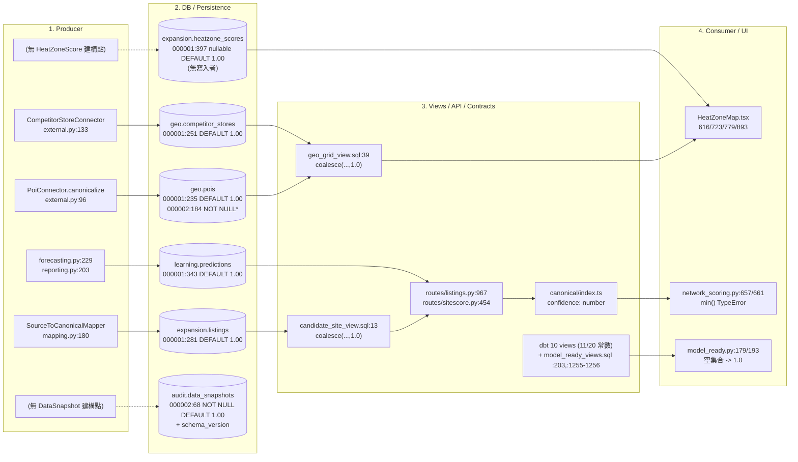
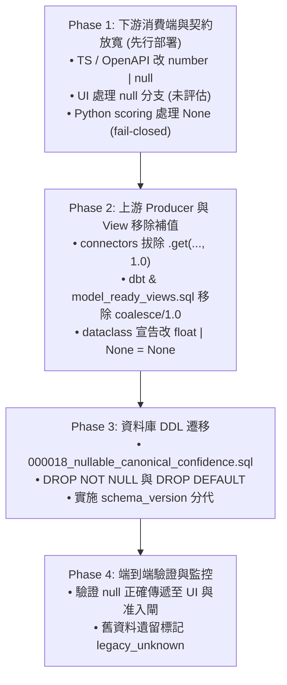

# Canonical 六模型 Producer Lineage、缺席率量測與 Legacy 1.0 遷移風險報告

- 日期：2026-09-03
- 量測基準 commit：`843567cb`（task branch，base 已 advance 至 `origin/dev` @ `e56eda40`）
- 任務：`ODP-CANONICAL-LEGACY-LINEAGE-001`
- 關聯文件：
  - [修正計畫](../plans/ODP_REMEDIATION_PLAN_2026-09-03.md)（第 3 批與第 1-2 批邊界）
  - [待裁決事項](../plans/ODP_OPEN_DECISIONS_2026-09-03.md)（第 1、5 項）
  - [結構性修正結果](./ODP_STRUCTURAL_REMEDIATION_2026-09-01.md)

---

## 〇、審查意見處置對照表（含第三輪退回）

本報告歷經三輪審查修正，針對 reviewer（Codex2）退回之全部要點進行徹底更正與補齊：

| # | 退回意見（第三輪） | 本版處置與章節 |
|---|---|---|
| 1 | 報告四.2 的 Prediction 1/2 constructor census 與四.4 的 DataSnapshot 11/20 view-expression census 不是可辨識 source payload 或 snapshot row 的缺席率分子／分母；請改稱 structural exposure，並補實際 snapshot/source evidence，否則明載不可量測，不得把它們作為 absence rate。 | **徹底分離「來源 Payload 缺席率」與「程式結構暴露度」**：<br>1. 來源 Payload 缺席率（Source Payload Absence Rate）：僅在有客觀外部 fixture（M1: Poi 50%, CompetitorStore 50%, Listing raw 50%, Listing assisted 0%）時計算，並強調為契約樣本不可外推；Prediction 與 DataSnapshot 無外部 source payload / row 級快照實體，**明確標記為「不可量測」**，嚴禁以程式碼暴露度冒充。<br>2. 程式結構暴露度（Structural Exposure）：將 AST 建構點（Prediction 50%）與 SQL view 投影（dbt 55%, product_ops 37.5%）正名為結構性暴露指標。（見二、四各節） |
| 2 | 遺漏實際 production install path：`product_ops/modeling/install_views.py:18` 載入 `product_ops/modeling/sql/model_ready_views.sql`；該檔 :203、:1255-1256 仍有 confidence/data_quality_score 常數，且 :1300-1408 登錄 active/blocked views。請補入六模型 producer→DB→API/client→UI/consumer lineage、分母與 SQL disposition。 | **完整納入生產安裝路徑**：<br>1. Lineage（三.6）補入 `product_ops/modeling/install_views.py` 載入 `model_ready_views.sql` 作為實際生產 DDL 路徑。<br>2. 結構暴露度（四.4）盤點 `model_ready_views.sql` 的 4 個 view / 8 個 bounded-score 欄位位置，指出 :203、:1255、:1256 三處硬編常數 1.0（暴露度 37.5%），並列出 :1300-1408 之 6 個 view contract 狀態。<br>3. SQL disposition（七.1）新增此三處之修訂方案。 |
| 3 | 五.6 錯述 migration drift：000001 是普通 CREATE TABLE，若 000002 先建表再跑 000001 會失敗，不是兩者都不失敗；另五.1 將 consumer 放最後且稱先改 consumer 使 null branch 死碼，安全 cutover 順序與理由需修正。同步補 DataSnapshot 本身的 v1 legacy_unknown／schema-version 消費語意。 | **修正遷移與分代核心邏輯**：<br>1. Migration Drift（七.6）更正：`000001` 為標準 `CREATE TABLE`，若 `000002` 先跑，`000001` 會因 `already exists` 拋錯；在標準順序 `000001` → `000002` 下，`000002` 的 `IF NOT EXISTS` 使其 `NOT NULL` 約束完全未被施加。<br>2. Safe Cutover 順序（五.1）更正：**下游 consumer 與契約放寬必須最先部署（Phase 1）**，若先改上游產出 NULL，未升級之 downstream consumer（如 `HeatZoneMap.tsx:616` `toFixed()`）會直接白屏崩潰。<br>3. DataSnapshot 分代（五.2）補齊 `schema_version = 'v1'` 之模型准入排除與 API/UI 標記。<br>4. 前瞻 migration 編號更新為 `000018`（因 `000017` 已被 prediction drift 使用）。 |

---

## 一、執行摘要

`shared/domain/models.py` 的六個 canonical 模型（`Poi`、`CompetitorStore`、`Listing`、`Prediction`、`HeatZoneScore`、`DataSnapshot`）將量測信心（`confidence`）或資料品質（`quality_score`）宣告為 `float = 1.0`。配合資料庫 `DEFAULT 1.00`、connector 的 `.get("confidence", 1.0)`、dbt 與生產 SQL view 的 `coalesce(..., 1.0)` 及硬編 `1.0 as confidence` 投影，造成**「未量測 / 缺席」與「量測結果為滿分」在系統中完全等價且無法分離**。

本次盤點與量測得出五項關鍵結論：

1. **六個模型中有兩個沒有活的 dataclass producer**：`HeatZoneScore` 與 `DataSnapshot` 在全樹非測試 Python 程式中的建構點數量為 **0**。它們只被宣告與 re-export，實際生產路徑走代理型別（`HeatZoneScoreResult`、`HeatZoneV3ScoreResult`、`ModelReadyRecord`、`LineageManifest`）。對這兩者談 dataclass producer 缺席率的分母為 0。
2. **生產環境存在兩套並行的 View 定義與安裝路徑**：
   - dbt 路徑：`pipelines/dbt/models/model_ready/*.sql`（10 個 view，20 個 bounded-score 欄位投影，其中 11 個無法表達非滿分值）。
   - 生產 DDL 安裝路徑：`product_ops/modeling/install_views.py:18` 載入並執行 `product_ops/modeling/sql/model_ready_views.sql`，定義 4 個 view（8 個 bounded-score 欄位投影），其中 `forecast_training_view:203`、`listing_property_valuation_view:1255, 1256` 存在硬編 1.0 常數；且 `:1300-1408` 以 `model_ready.view_contracts` 登記 ACTIVE / BLOCKED 契約狀態。
3. **「來源 Payload 缺席率」與「程式結構暴露度」本質不同**：
   - 來源 Payload 缺席率僅能由外部輸入 fixture 客觀計量（Poi 50.0%、CompetitorStore 50.0%、Listing raw 50.0%、Listing assisted parsed 0.0%），此為契約樣本，不可外推為生產抽樣。
   - `Prediction` 與 `DataSnapshot` 無外部 source payload / row 級快照實體，其來源 payload 缺席率**明載為「不可量測」**，嚴禁以程式結構暴露度冒充。
4. **存在未被任何掃描閘門涵蓋的絕對缺陷**：`shared/infrastructure/persistence/model_ready.py:179, 193` 在記錄清單為空集合時，將快照品質分數硬編寫入 `1.0`（完美），直接穿透並污染模型准入閘門。
5. **安全遷移順序必須為「由下而上放寬，由上而下收斂」**：下游 consumer 與 TS/OpenAPI 契約必須最先部署放寬為 null-safe；上游 producer、view 與 DB migration 隨後移除預設值；最後再進行端到端驗證與舊資料標記。

---

## 二、量測方法論與可重現指令

### 1. 禁則

> [!CAUTION]
> **嚴禁由現有資料庫內容中的 `confidence = 1.0` 反推缺席率。**
> 在 `DEFAULT 1.00` 與 `record.get("confidence", 1.0)` 之下，「真實量測為滿分」與「來源未提供」被壓成同一個 `1.0`。事後查詢 DB 中 `1.0` 的比率，量到的是兩者的聯集，無法拆分。本報告所有數字均不來自 DB 既有 row 內容。

### 2. 量測維度定義

| 代號 | 量測維度 | 定義與對象 | 適用範圍與限制 |
|---|---|---|---|
| **M1** | **來源 Payload 缺席率** (Source Payload Absence Rate) | 進入系統前的原始 input payload fixture（`tests/fixtures/source_data/external/*.json`、`tests/fixtures/operator/assisted-listing/corpus.json`）中，缺少信心鍵的筆數佔比 | 僅適用於有外部來源檔案之 `Poi`、`CompetitorStore`、`Listing`。此為契約樣本，**不可外推為生產資料缺席率** |
| **M2** | **建構點結構暴露度** (Constructor Call-Site Exposure) | 非測試 Python 程式碼中，調用 dataclass 建構式時未提供信心參數或傳入假滿分之調用點佔比 | 適用於 `Prediction`、`Listing`。此為**程式結構指標**，非 row 級資料缺席率 |
| **M3** | **View 投影結構暴露度** (View Projection Structural Exposure) | dbt 與 production SQL views 中，bounded-score 欄位投影無法表達非滿分（硬編常數或上游 NULL coalesce 為 1.0）之欄位佔比 | 適用於 `DataSnapshot`（經 `model_ready` views）。此為**SQL 結構指標**，非 snapshot row 缺席率 |
| **M4** | **結構性語意判定** (Structural Schema/JOIN Exposure) | 透過 `LEFT JOIN` 與 `COALESCE(..., 1.0)` 結構，判定「未查/無資料」是否被強制等價於「滿分」 | 適用於 `HeatZoneScore`、`Poi`、`CompetitorStore` |
| **N/A** | **生產列級缺席率** (Production Row-Level Absence Rate) | 線上生產資料庫或 object store 抽樣所得之真實缺失比率 | 本 repo 靜態分析中**不可量測（明載為不可量測，不提供臆測值）** |

### 3. 可重現驗證指令

```bash
# (a) 跨層量測預設掃描器（檢查 dataclass, pydantic, mapper, sql, openapi）
.venv/bin/python delivery_toolchain/governance/check_measurement_defaults.py
# → Measurement default checks passed: 40 known (dataclass 11, pydantic 1, mapper 9, sql 18, openapi 1)

# (b) Python .confidence 引用清冊（第六節之 56 筆非測試引用）
grep -rn "\.confidence" --include="*.py" modules apps shared models solver product_ops pipelines   | grep -vE "(^|/)tests?/|/test_[^/]*\.py:|/[^/]*_test\.py:" | wc -l
# → 56

# (c) dbt model_ready view 欄位投影普查
grep -nE "as +(data_quality_score|confidence)" pipelines/dbt/models/model_ready/*.sql

# (d) production model_ready SQL view 欄位投影普查
grep -nE "AS (data_quality_score|confidence)" product_ops/modeling/sql/model_ready_views.sql
```

---

## 三、六大 Canonical 模型端到端血統（Lineage）



### 1. `Poi.confidence`

| 層 | 位置 | 內容與實作事實 |
|---|---|---|
| 模型 | `shared/domain/models.py:202` | `confidence: float = 1.0`（class 於 `:192`） |
| Producer | `modules/external_data/connectors/external.py:96` | `confidence=float(record.get("confidence", 1.0))` — 全樹唯一建構點 |
| DB (PG) | `000001:235`、`000002:184` | 000001 建立為 nullable `DEFAULT 1.00`；000002 之 `CREATE TABLE IF NOT EXISTS` 未改變已存在欄位 |
| DB (SQLite) | `000004:163` | `REAL NOT NULL DEFAULT 1.00`，外鍵 `snapshot_id REFERENCES data_snapshots` |
| dbt | `pipelines/dbt/models/model_ready/geo_grid_view.sql:7,39` | `avg(pois.confidence) as poi_confidence` → `least(coalesce(...,1.0), coalesce(...,1.0))` |
| TS 契約 | `packages/schemas/canonical/index.ts:168` | `confidence: number`（非 nullable） |
| Python consumer | **無** | 全樹無任何 `poi.confidence` 屬性讀取（56 筆清冊中 Poi 佔 0 筆） |
| UI | `HeatZoneMap.tsx` | 僅經 `geo_grid_view` 聚合後之格網 confidence 呈現 |

### 2. `CompetitorStore.confidence`

| 層 | 位置 | 內容與實作事實 |
|---|---|---|
| 模型 | `shared/domain/models.py:217` | `confidence: float = 1.0`（class 於 `:207`） |
| Producer | `modules/external_data/connectors/external.py:133` | `confidence=float(record.get("confidence", 1.0))` — 唯一建構點 |
| DB (PG) | `000001:251`、`000002:200` | 000001 nullable `DEFAULT 1.00`；無 `snapshot_id` 與 `source_competitor_id` 回溯欄位 |
| DB (SQLite) | `000004:178` | `REAL NOT NULL DEFAULT 1.00` |
| dbt | `geo_grid_view.sql:17,39` | `avg(confidence) as competitor_confidence`；`competitor_counts` CTE 未以 `h3_cells` 為基底 |
| TS 契約 | `canonical/index.ts:181` | `confidence: number` |
| Python consumer | **無** | 全樹無任何屬性讀取 |

### 3. `Listing.confidence`

| 層 | 位置 | 內容與實作事實 |
|---|---|---|
| 模型 | `shared/domain/models.py:242` | `confidence: float = 1.0`（class 於 `:222`） |
| Producer 1 | `modules/integration/application/mapping.py:180` | `entity_cls(**values)`。`FIELD_ALIASES` 無 `confidence` 條目，來源缺鍵時未設值，直接由 dataclass default 補 1.0。`ListingConnector.canonicalize`（`external.py:158`）委派至此 |
| Producer 2-5 | `routes/listings.py:1022`、`promotion.py:550`、`promotion.py:615`、`network_listings.py:540` | 皆顯式傳入 `confidence=`（承接既有值） |
| Producer 6 | `modules/listing/application/pipeline.py:355` | `Listing(**asdict(listing))` — 全欄位複製 |
| DB (PG) | `000001:281`、`000002:226` | 000001 nullable `DEFAULT 1.00`；具備 `snapshot_id`、`source_id`、`source_listing_id` |
| DB (SQLite) | `000004:203` | `REAL NOT NULL DEFAULT 1.00` |
| dbt / SQL | `candidate_site_view.sql:13` 及 `model_ready_views.sql:619-620` | `least(coalesce(listings.confidence,1.0), coalesce(address_locations.geocode_confidence,1.0))` |
| API | `routes/listings.py:967` | `"confidence": listing.confidence` |
| TS 契約 | `canonical/index.ts:204` | `confidence: number` |
| Consumer | `network_scoring.py:657, 661` | `min(listing.confidence, address.geocode_confidence)` — nullable 後會引發 `TypeError` |
| UI | `ListingRadarPanel.tsx`、OpsBoard | 經 `network_listings.py:495` 之 `listingConfidence` 輸出 |

### 4. `Prediction.confidence`

| 層 | 位置 | 內容與實作事實 |
|---|---|---|
| 模型 | `shared/domain/models.py:297` | `confidence: float = 1.0`（class 於 `:285`） |
| Producer 1 | `modules/forecastops/application/forecasting.py:229` | **未傳入** `confidence` 參數 → 100% 落入 dataclass default 1.0 |
| Producer 2 | `modules/sitescore/application/reporting.py:203`（kwarg 於 `:212`） | `confidence=report.confidence`，其來源為 `SiteScoreFeatureInput` 兩欄位乘積 |
| ↳ 上游推導 | `modules/sitescore/domain/scoring.py:455` | `confidence = _bounded(feature.average_confidence * feature.data_quality_score)` |
| ↳ 上游 default | `scoring.py:92-93` | `average_confidence: float = 1.0`、`data_quality_score: float = 1.0` |
| ↳ 上游 mapper | `scoring.py:153, 156` | `_first_present(data, "average_confidence", "confidence", default=1.0)` |
| DB (PG) | `000001:343`、`000002:283` | 000001 nullable `DEFAULT 1.00`；有 `prediction_run_id` 外鍵 |
| DB (SQLite) | `000004:256` | `REAL NOT NULL DEFAULT 1.00` |
| API | `routes/sitescore.py:454` | `"confidence": p.confidence` |
| TS 契約 | `canonical/index.ts:250` | `confidence: number` |
| UI | `GrowthWorkspace.tsx:588/692`、`SiteScorePanel.tsx:192`、`NetworkFindAreasWorkspace.tsx:1284` | 渲染點位 |

### 5. `HeatZoneScore.confidence`

| 層 | 位置 | 內容與實作事實 |
|---|---|---|
| 模型 | `shared/domain/models.py:339` | `confidence: float = 1.0`（class 於 `:327`） |
| Producer | **無** | 全樹非測試程式中 `HeatZoneScore(...)` 建構點數 = **0**。僅在 `shared/domain/__init__.py:16,58` re-export |
| 實際生產型別 A | `modules/heatzone/domain/scoring.py:204, 233` | `HeatZoneScoreResult.to_dict()` — v2 路徑 |
| 實際生產型別 B | `modules/heatzone/v3/contract.py:159` | `HeatZoneV3ScoreResult.confidence: float`（**非 nullable**） |
| ↳ 重建路徑 | `contract.py:274` | `confidence=float(data.get("confidence", 1.0))` — **缺席還原為滿分** |
| ↳ 已修正部分 | `contract.py:119` | `HeatZoneV3Input.confidence: float \| None = None` ✅ |
| ↳ 消費端 | `v3/scoring.py:70, 155` | `if feature.confidence is None or feature.confidence < 0.25:` — fail-closed ✅ |
| DB (PG) | `000001:397` | `confidence NUMERIC(3,2) DEFAULT 1.00`（nullable，六表中唯一無 000002 重複定義者） |
| DB (SQLite) | **不存在** | `000004_durable_product_domain.sql` 無 `heatzone_scores` 表 |
| DB 寫入者 | **無** | 全樹無任何程式寫入 `expansion.heatzone_scores` |
| TS 契約 | `canonical/index.ts:286`、`domain-types/src/heatzone.ts:22, 46` | `confidence: number` |
| UI | `HeatZoneMap.tsx:616, 675, 723, 779, 893` | 渲染點位 |

### 6. `DataSnapshot.quality_score`

| 層 | 位置 | 內容與實作事實 |
|---|---|---|
| 模型 | `shared/domain/models.py:510` | `quality_score: float = 1.0`（class 於 `:501`） |
| Producer | **無** | 全樹非測試程式中 `DataSnapshot(...)` 建構點數 = **0** |
| 實際生產鏈 1 (dbt) | `pipelines/dbt/models/model_ready/*.sql` | 10 個 view 投影 `data_quality_score` 與 `confidence`（11/20 硬編/coalesce 1.0） |
| 實際生產鏈 1 (SQL) | `product_ops/modeling/install_views.py:18` 執行 `product_ops/modeling/sql/model_ready_views.sql` | 4 個 view（8 投影），其中 `:203`、`:1255-1256` 硬編 1.0；`:1300-1408` 登錄 6 個 `model_ready.view_contracts` |
| 實際生產鏈 2 | `modules/learninghub/domain/dataset_snapshot.py:148, 149` | `float(row.get("data_quality_score", 1.0))`、`float(row.get("confidence", 1.0))` |
| ↳ dataclass | `dataset_snapshot.py:58` | `ModelReadyRecord.data_quality_score: float = 1.0` |
| 實際生產鏈 3 | `shared/infrastructure/persistence/model_ready.py:177-193` | 聚合為 `LineageManifest`；`:179, :193` 空集合時硬編賦予 1.0 |
| 實際寫入者 | `model_ready.py:92-102` | `to_audit_snapshot_row()` → `audit.data_snapshots` |
| DB (PG) | `000002:60-72` | `quality_score NUMERIC(3,2) NOT NULL DEFAULT 1.00`，具備 `schema_version VARCHAR(50) NOT NULL` |
| DB (SQLite) | `000004:45-57` | `quality_score REAL NOT NULL DEFAULT 1.00`，具備 `schema_version TEXT NOT NULL` |
| TS 契約 | `packages/schemas/canonical/index.ts:439` | `quality_score: number` |
| Consumer | `modules/learninghub/application/release.py` | 訓練准入判斷 |

---

## 四、來源缺席率與結構暴露度量測

### 1. 來源 Payload 缺席率（方法 M1：來源 payload fixture）

僅針對具備客觀外部輸入 fixture 之模型計算。

| 模型 | 來源資料集 | 分母 D | 分子 N | 缺席率 R | 缺席筆識別 | 限制與性質 |
|---|---|---:|---:|---:|---|---|
| `Poi` | `tests/fixtures/source_data/external/poi_snapshot.valid.json` | **2** 筆記錄 | **1** | **50.0%** | `POI-002`（信義國小）無 `confidence` 鍵 | 契約樣本，不可外推 |
| `CompetitorStore` | `tests/fixtures/source_data/external/competitor_store_snapshot.valid.json` | **2** 筆記錄 | **1** | **50.0%** | `CMP-002`（自助洗衣坊）無 `confidence` 鍵 | 契約樣本，不可外推 |
| `Listing`（批次 raw） | `tests/fixtures/source_data/external/listing_raw_snapshot.valid.json` | **2** 筆記錄 | **1** | **50.0%** | `LST-002`（板橋）無 `confidence` 鍵 | 契約樣本，不可外推 |
| `Listing`（輔助擷取，已解析） | `tests/fixtures/operator/assisted-listing/corpus.json`（具備 `raw` 物件之文件） | **4** 筆文件 | **0** | **0.0%** | 四筆皆有 `confidence`（0.92, 0.94, 0.71, 0.12） | 擷取成功且解析完成之記錄 |
| `Listing`（輔助擷取，已擷取） | 同上（所有已擷取文件） | **5** 筆文件 | **1** | **20.0%** | `detail-50000001` 僅有 `failure`，無 `raw` | 包含失敗未進入 canonical 之文件 |

### 2. Prediction 缺席量測與結構暴露度

- **來源 Payload 缺席率**：**不可量測**。`Prediction` 為系統內部模型推論產出，無外部 source payload；而在 repo 內部之測試與驗證資料集（如 `tests/models/test_sitescore_prediction_source.py` 之 `_generate_valid_prediction_records`）中，字典記錄根本未宣告 `confidence` 欄位。
- **建構點結構暴露度（方法 M2：AST Census）**：
  - 分母 D = 全樹非測試 `Prediction(...)` 建構點 = **2**
  - 分子 N = 未傳入 `confidence=` 參數之建構點 = **1**（`forecasting.py:229`）
  - 建構點暴露度 = **50.0%**
  - 條件性暴露：另一處建構點 `reporting.py:203`（kwarg `:212`）傳入之 `report.confidence` 源自 `scoring.py:455`（`average_confidence * data_quality_score`），當兩者缺席時傳入 `1.0 * 1.0 = 1.0`。最壞條件下結構暴露度為 **100.0%**。
- **生產列級缺席率**：**不可量測**（需生產環境推論資料庫抽樣）。

### 3. HeatZoneScore 缺席量測與結構暴露度

- **來源 Payload 缺席率**：**不可量測**（canonical `HeatZoneScore` 建構點 D=0，DB 無寫入者 D=0）。
- **重建路徑結構暴露**：`contract.py:274` 之 `from_dict` 對缺 `confidence` 之持久化 dict 100% 還原為 1.0。
- **SQL 結構性暴露（方法 M4）**：`geo_grid_view.sql:39` 之 `confidence` 投影為 `least(coalesce(poi_confidence,1.0), coalesce(competitor_confidence,1.0))`。對下列三種情況輸出完全相同之 1.0：
  - (a) 該格網無任何 POI（`avg()` 為 NULL → 被 coalesce 補 1.0）
  - (b) 該格網無任何 active 競業（`competitor_counts` 未以 `h3_cells` 為基底，整列缺席 → 被 coalesce 補 1.0）
  - (c) 該格網 POI 與競業皆具備真實滿分量測值
  - 結構性質：對所有 (a) 與 (b) 類格網，滿分偽陽性率為 **100%**。

### 4. DataSnapshot 缺席量測與結構暴露度

- **快照列級缺席率**：**不可量測**（無 repo 物化資料集可統計）。
- **dbt View 投影結構暴露度（方法 M3）**：
  - 分母 D = 10 個 dbt model_ready views × 2 個 bounded-score 欄位 = **20 個投影**
  - 分子 N = 無法表達非滿分值之投影 = **11**
  - 結構暴露度 = **55.0%**
  - 分子清單：
    - `confidence` 欄位（7/10）：`brand_transfer_view:18` (1.0), `candidate_site_view:13` (coalesce), `forecast_training_view:47` (1.0), `geo_grid_view:39` (coalesce), `matched_control_view:17` (1.0), `ramp_curve_view:9` (1.0), `store_machine_timeseries_view:37` (1.0)。
    - `data_quality_score` 欄位（4/10）：`brand_transfer_view:17` (1.0), `matched_control_view:16` (1.0), `ramp_curve_view:8` (1.0), `store_machine_timeseries_view:36` (1.0)。
    - （`valuation_view.sql:13` 之 `0.8` 常數雖為非滿分，亦屬不量測常數，單獨於七.1 處置）。
- **生產 SQL View 投影結構暴露度（`product_ops/modeling/sql/model_ready_views.sql`）**：
  - 分母 D = 4 個安裝 view × 2 個 bounded-score 欄位 = **8 個投影**
  - 分子 N = 硬編 1.0 常數之投影 = **3**
  - 結構暴露度 = **37.5%**
  - 分子明細：
    - `model_ready.forecast_training_view:203`（`1.0::double precision AS confidence`）
    - `model_ready.listing_property_valuation_view:1255`（`1.0::double precision AS data_quality_score`）
    - `model_ready.listing_property_valuation_view:1256`（`1.0::double precision AS confidence`）
  - 生產 View 契約狀態註冊（`:1300-1408` `model_ready.view_contracts`）：
    - ACTIVE（3 個）：`forecast_training_view`、`candidate_site_view`、`heatzone_training_view`
    - BLOCKED（2 個）：`valuation_view`（原因：`MATURE_REALIZED_TRANSACTION_OUTCOME_RELATION_MISSING`）、`avm_liquidity_training_view`（原因：`OFFICIAL_SALE_OUTCOME_HAS_NO_MARKETING_INTERVAL`）
    - CONDITIONAL（1 個）：`listing_property_valuation_view`（當 `external_data.real_estate_transactions` 存在時為 ACTIVE，否則為 BLOCKED：`OFFICIAL_REAL_ESTATE_OUTCOME_RELATION_MISSING`）
- **Mapper 層與聚合層結構暴露**：
  - `dataset_snapshot.py:148, 149` 之 `.get(k, 1.0)` 補值暴露度 = **100%**（2/2）
  - `model_ready.py:179, 193` 空集合硬編 1.0 暴露度 = **100%**（2/2）

### 5. 量測結果總覽表

| 模型 | 量測維度 | 分母 D | 分子 N | 量測值 | 性質說明 |
|---|---|---:|---:|---:|---|
| `Poi` | M1 來源 Payload 缺席率 | 2 筆記錄 | 1 | **50.0%** | 契約樣本，不可外推 |
| `CompetitorStore` | M1 來源 Payload 缺席率 | 2 筆記錄 | 1 | **50.0%** | 契約樣本，不可外推 |
| `Listing` | M1 來源 Payload 缺席率 | 2 筆 raw / 4 筆已解析 | 1 / 0 | **50.0% / 0.0%** | 批次 raw 與輔助擷取雙管道 |
| `Prediction` | 來源 Payload 缺席率 | — | — | **不可量測** | 內部推論產出，無外部來源 payload |
| `Prediction` | M2 建構點結構暴露度 | 2 個建構點 | 1 (條件性 2) | **50.0% (最壞 100%)** | 程式碼 AST 調用點結構指標 |
| `HeatZoneScore` | 來源 Payload 缺席率 | — | — | **不可量測** | 建構點與 DB 寫入者分母皆為 0 |
| `HeatZoneScore` | M4 SQL JOIN 結構暴露 | 格網類別 (a)(b) | 類別 (a)(b) | **100% 偽陽性** | 無 POI / 無競業格網強制等價滿分 |
| `DataSnapshot` | 快照列級缺席率 | — | — | **不可量測** | 無物化快照資料集可供行級統計 |
| `DataSnapshot` | M3 dbt View 投影暴露度 | 20 個 view 欄位 | 11 | **55.0%** | dbt SQL schema 結構暴露指標 |
| `DataSnapshot` | M3 生產 View 投影暴露度 | 8 個 view 欄位 | 3 | **37.5%** | `model_ready_views.sql` 結構暴露指標 |

---

## 五、Legacy 1.0 資料處置與遷移策略

### 1. 安全 Cutover 順序（由下而上放寬，由上而下收斂）



> [!IMPORTANT]
> **切勿先改上游 DB/Producer 而後改下游 Consumer！**
> 若先將 DB/Producer 改為產出 `NULL`，而在下游 consumer（如 `HeatZoneMap.tsx:616` 之 `zone.confidence.toFixed(2)` 或 `network_scoring.py:657` 之 `min(listing.confidence, ...)`）尚未更新前即上線，`NULL` 會立即觸發 `TypeError` 導致前端白屏崩潰與計算中斷。因此必須**先部署具備 null-safety 的消費端，再切換上游資料產出**。

**前瞻 Migration 定義（`000018_nullable_canonical_confidence.sql`）**

*(註：因 `000017` 已被 `000017_learninghub_prediction_drift.sql` 佔用，本 DDL 順延至 `000018`)*

```sql
-- infra/db/migrations/000018_nullable_canonical_confidence.sql
-- 1. 移除各表 confidence / quality_score 之 NOT NULL 約束與 DEFAULT 1.00
ALTER TABLE geo.pois              ALTER COLUMN confidence    DROP DEFAULT;
ALTER TABLE geo.competitor_stores ALTER COLUMN confidence    DROP DEFAULT;
ALTER TABLE expansion.listings    ALTER COLUMN confidence    DROP DEFAULT;
ALTER TABLE learning.predictions  ALTER COLUMN confidence    DROP DEFAULT;
ALTER TABLE audit.data_snapshots  ALTER COLUMN quality_score DROP DEFAULT;
ALTER TABLE expansion.heatzone_scores ALTER COLUMN confidence DROP DEFAULT;

-- 若環境曾被 000002 強加 NOT NULL，一併 DROP NOT NULL（已為 nullable 者執行 DROP NOT NULL 亦安全無害）
ALTER TABLE geo.pois              ALTER COLUMN confidence    DROP NOT NULL;
ALTER TABLE geo.competitor_stores ALTER COLUMN confidence    DROP NOT NULL;
ALTER TABLE expansion.listings    ALTER COLUMN confidence    DROP NOT NULL;
ALTER TABLE learning.predictions  ALTER COLUMN confidence    DROP NOT NULL;
ALTER TABLE audit.data_snapshots  ALTER COLUMN quality_score DROP NOT NULL;
```

### 2. Legacy 分代標記與消費端語意

> [!CAUTION]
> **嚴禁執行 `UPDATE ... SET confidence = NULL WHERE confidence = 1.00` 批次刷除。**
> 既有的 1.00 包含「真實量測滿分」與「未量測補值」的聯集。批次改為 NULL 會永久摧毀真實量測歷史。

#### (1) `DataSnapshot` 本身的分代與消費語意

`audit.data_snapshots` 已具備 `schema_version VARCHAR(50) NOT NULL`（`000002:66`，SQLite `000004:52`）。
- **v1 分代（Cutover 前）**：所有 `schema_version = 'v1'` 且 `quality_score = 1.00` 的快照，其品質語意為 `legacy_unknown`。
- **v2 分代（Cutover 後）**：新建立之快照標記 `schema_version = 'v2'`，其 `quality_score` 為真實量測值或顯式 `NULL`。
- **消費端處置**：
  - 模型訓練准入（`modules/learninghub/application/release.py`）：對 `v1` 快照排除於高保證訓練流程，或要求具名 approval override。
  - Lineage 審計：輸出 `qualityScoreProvenance: "legacy_unknown"`。
  - API / UI：顯示 `100%（歷史未校準）`，避免誤導操作者。

#### (2) 五個非 DataSnapshot 模型的分代落地

根據五張表的追溯能力差異，分三種策略落地：

| 表 | 追溯能力現況 | 分代策略 | 具體做法 |
|---|---|---|---|
| `geo.pois` | 有 `snapshot_id → audit.data_snapshots` | **策略 A：繼承快照分代** | 透過 `LEFT JOIN audit.data_snapshots` 取得 `schema_version`；`v1` 下的 1.00 標為 `legacy_unknown`，`v2` 下標為 `measured` |
| `expansion.listings` | 有 `snapshot_id → audit.data_snapshots` | **策略 A：繼承快照分代** | 同上 |
| `learning.predictions` | 有 `prediction_run_id → learning.prediction_runs` | **策略 B：經 Run 分代** | 在 `learning.prediction_runs` 新增 `measurement_schema_version DEFAULT 'v1'`。`v1` run 下的 confidence 1.00 判定為 `legacy_unknown` |
| `geo.competitor_stores` | 無 snapshot_id、無 source_competitor_id | **策略 C：時間戳分代並補欄位** | 新增 `measurement_schema_version DEFAULT 'v1'`；並補充 `snapshot_id` 與 `source_competitor_id` 供未來追溯 |
| `expansion.heatzone_scores` | 無寫入者、無 FK 表 | **策略 C：預防性分代** | 新增 `measurement_schema_version DEFAULT 'v1'`，防止首個寫入者再次產生未分代資料 |

#### (3) 跨模組 `legacy_unknown` 消費端語意矩陣

| 消費場景 | `unmeasured`（NULL, v2） | `legacy_unknown`（1.00, v1） | `measured`（數值, v2） |
|---|---|---|---|
| 模型訓練准入 | 排除 | 排除並記錄 `exclusion_reason` | 依門檻判定 |
| SiteScore / 熱區評分 | 棄權（Abstain） | 棄權（Abstain） | 正常參與權重計算 |
| API 輸出 | `null` | `null` + `confidenceProvenance: "legacy_unknown"` | 數值 |
| UI 渲染 | 顯示「未評估」 | 顯示「歷史未校準」 | 顯示精確百分比 |

### 3. 可重算範圍判定

原始擷取資料保存於 `intake.source_snapshots`（`raw_object_uri` 指向 object store），並透過 `data_plane.canonical_lineage`（`000010:35-46`）與 canonical 表建立 `(source_snapshot_id, canonical_table, canonical_id)` 對照。

**逐模型重算資格**：
- `Poi`：**可重算**（具 `snapshot_id` 與 `source_poi_id`，可由 object store 重放）。
- `Listing`：**可重算**（具 `snapshot_id`、`source_id`、`source_listing_id`，且輔助擷取具 `corpus`）。
- `CompetitorStore`：**不可重算**（canonical 表缺少 `source_competitor_id` 與 `snapshot_id`，無法與原始 payload 建立關聯；須先執行策略 C 補齊欄位）。
- `Prediction`：**不可重算**（推論當下之動態特徵狀態未完全物化，事後無法重建，凍結為 v1）。
- `HeatZoneScore`：**不適用**（無寫入者、無既有歷史列）。
- `DataSnapshot`：**部分可重算**（若 `storage_uri` 對應之原始特徵集仍在，可在修復 view 後重跑聚合）。

### 4. Rollback 計畫

- **DB 層**：重新執行 `ALTER COLUMN ... SET DEFAULT 1.00`（不加 `NOT NULL`）。
- **View / dbt 層**：還原 view 檔案並重新安裝（無狀態，可直接覆蓋）。
- **應用層**：透過 Feature Flag `ENABLE_STRICT_CONFIDENCE_NULLABLE=0` 切回 legacy 相容模式。
- **分代欄位**：`measurement_schema_version` 不需 rollback，保留作為資訊增強。

---

## 六、Python `.confidence` 引用完整盤點（56 筆）

### 1. 三重對帳結果

```bash
# 總命中 57 筆 = 1 筆測試檔 (opsboard/tests/test_network_listing_geocode_mapping.py:7) + 56 筆非測試引用
grep -rn "\.confidence" --include="*.py" modules apps shared models solver product_ops pipelines   | grep -vE "(^|/)tests?/|/test_[^/]*\.py:|/[^/]*_test\.py:" | wc -l
# → 56
```

- **A 類（Canonical 六模型直接相關載體）**：**10 筆**
- **B 類（同名但非 Canonical 六模型欄位）**：**46 筆**
- **合計**：**56 筆**（分佈於 28 個獨立原始檔）

### 2. A 類逐筆清冊（10 筆）

| # | 檔案路徑與行號 | 程式碼片段 | 實體載體 | 下游破壞模式與可達性 | 處置方案 (Disposition) |
|---|---|---|---|---|---|
| A1 | `modules/listing/application/promotion.py:569` | `confidence=listing.confidence,` | `Listing` | 晉升重建 Listing | 允許 None，放寬型別宣告 |
| A2 | `modules/listing/application/promotion.py:634` | `confidence=listing.confidence,` | `Listing` | 晉升補償重建 | 同 A1 |
| A3 | `modules/opsboard/application/network_listings.py:495` | `"listingConfidence": lst.confidence,` | `Listing` | 輸出至 OpsBoard 前端 | 允許 null，前端型別改 `number \| null` |
| A4 | `modules/opsboard/application/network_listings.py:496` | `# Not lst.confidence. That is extraction...` | `Listing` | 程式碼註解（說明 geocodeConfidence） | 更新註解，說明 None 與 0.0 之語意差異 |
| A5 | `modules/opsboard/application/network_scoring.py:657` | `listing.confidence,`（在 `min()` 內） | `Listing` | `min(None, x)` 拋出 `TypeError` 崩潰 | **必改**：先判斷 None，缺席時走 fail-closed |
| A6 | `modules/opsboard/application/network_scoring.py:661` | `listing.confidence,`（在 `min()` 內） | `Listing` | 同 A5，計算 `data_quality_score` | 同 A5 |
| A7 | `apps/api/app/routes/listings.py:967` | `"confidence": listing.confidence,` | `Listing` | API 字典輸出 | 允許 null，更新 OpenAPI 與 TS 契約 |
| A8 | `apps/api/app/routes/listings.py:1041` | `confidence=existing_listing.confidence,` | `Listing` | API 更新回填既有值 | 允許 None 透傳 |
| A9 | `modules/sitescore/application/reporting.py:212` | `confidence=report.confidence,` | → `Prediction` | 寫入 `Prediction.confidence` | 改在 `SiteScoreReport` 區分未量測後傳遞 None |
| A10 | `apps/api/app/routes/sitescore.py:454` | `"confidence": p.confidence,` | `Prediction` | API 輸出 | 允許 null，前端顯示「未評估」 |

### 3. B 類清冊（46 筆）

| 子類 | 筆數 | 所屬型別 / 模組 | 檔案與行號清冊 | 處置方案 (Disposition) |
|---|---:|---|---|---|
| **B1 PriceOps** | 12 | `ElasticityEstimate`, `DemandModel` 等 | `priceops/infrastructure/oss_optimizer.py:285, 357`；`priceops/domain/pricing.py:159, 169, 487, 489, 984, 1020, 1071`；`routes/priceops.py:691`；`models/priceops/binding.py:182`；`solver/pricing/demand.py:46` | 獨立領域，`pricing.py:487` 已具備值域檢核且缺席時報錯，維持現狀 |
| **B2 AVM** | 6 | `NormalizedMargin`, `ValuationReport` | `avm/application/production.py:122`；`avm/domain/valuation.py:171, 267, 444, 486`；`routes/avm.py:321` | 屬第 1 批 AVM remediation 範圍，隨該批處理 |
| **B3 Market Survey** | 3 | `SurveyResponse.confidence` | `market_survey/application/survey_service.py:688`；`market_survey/domain/models.py:463`；`routes/market_survey.py:298` | 問卷信效度欄位，非量測信心，不變更 |
| **B4 Intake / Geocode** | 5 | `MatchResult`, `GeocodeCandidate` | `external_data/application/assisted_intake.py:791`；`external_data/geo/pipeline.py:180, 192`；`geography_backfill.py:759, 919` | `candidate.confidence < 0.7` 在 None 時會 `TypeError`，需補 `is None` 判斷 |
| **B5 SiteScore** | 6 | `SiteScoreReport.confidence` | `sitescore/domain/scoring.py:225, 252`；`network_rebalance.py:452`；`network_reviews.py:656`；`network_scoring.py:695, 711` | `network_scoring.py:695` 的 `round(report.confidence * 100)` 需防範 None |
| **B6 HeatZone** | 14 | `HeatZoneV3ScoreResult`, `OperationalStartConfidence` | `absorption_inputs.py:244, 245, 246, 436, 437, 438`；`v3/contract.py:196, 234`；`heatzone/domain/scoring.py:204, 233`；`v3/shadow.py:207`；`v3/scoring.py:70, 155, 162` | `contract.py:274` 必改（見七.2）；enum 引用維持現狀 |

---

## 七、SQL／dbt／TypeScript／API／UI 可達性處置清單

### 1. SQL / dbt 處置清單（22 筆）

包含 dbt views (13 筆) + SQLite DDL (5 筆) + 生產 SQL views (3 筆) + 0.8 常數 (1 筆)：

| # | 檔案路徑與行號 | 現狀定義 | 破壞模式與可達性 | 處置方案 (Disposition) |
|---|---|---|---|---|
| 1 | `pipelines/dbt/models/model_ready/geo_grid_view.sql:39` | `least(coalesce(poi_confidence,1.0), coalesce(competitor_confidence,1.0))` | 無 POI / 無競業格網補 1.0 滿分 | 移除 `coalesce`，讓 NULL 自然傳遞 |
| 2 | `pipelines/dbt/models/model_ready/geo_grid_view.sql:12-21` | `competitor_counts` 未以 `h3_cells` 為基底 | 零競業格網整列遺失 | 改為 `FROM h3_cells LEFT JOIN competitor_stores` |
| 3 | `pipelines/dbt/models/model_ready/candidate_site_view.sql:13` | `least(coalesce(listings.confidence,1.0), coalesce(geocode_confidence,1.0))` | 缺席補 1.0 滿分 | 移除 `coalesce` |
| 4-10 | `pipelines/dbt/models/model_ready/` 下之 `brand_transfer_view.sql:17,18`、`matched_control_view.sql:16,17`、`ramp_curve_view.sql:8,9`、`store_machine_timeseries_view.sql:36,37`、`forecast_training_view.sql:47` | `1.0 as data_quality_score` / `1.0 as confidence`（共 9 個投影） | 硬編 1.0 常數，無法反映品質 | 改為來源欄位之 `CASE` 推導或投影 NULL 並在下游 fail-closed |
| 11 | `pipelines/dbt/models/model_ready/valuation_view.sql:13` | `0.8 as confidence` | 雖非滿分，但為常數偽量測，UI 誤判為 medium 帶 | 改為 `CASE` 動態推導或 NULL |
| 12-16 | `infra/db/migrations/000004_durable_product_domain.sql:53, 163, 178, 203, 256` | `REAL NOT NULL DEFAULT 1.00` ×5 | SQLite 產品庫預設滿分 | 隨 `000018` 移除 DEFAULT |
| 17 | **`product_ops/modeling/sql/model_ready_views.sql:203`** | `1.0::double precision AS confidence` | 生產 `forecast_training_view` 硬編信心滿分 | 改為由來源 lineage 動態判定或 NULL |
| 18 | **`product_ops/modeling/sql/model_ready_views.sql:1255`** | `1.0::double precision AS data_quality_score` | 生產 `listing_property_valuation_view` 硬編品質滿分 | 改為由授權與綱要驗證動態判定 |
| 19 | **`product_ops/modeling/sql/model_ready_views.sql:1256`** | `1.0::double precision AS confidence` | 同上，硬編信心滿分 | 改為由交易真實性推導或 NULL |

### 2. Python Producer / Mapper 處置清單

| 檔案路徑與行號 | 現狀定義 | 處置方案 (Disposition) |
|---|---|---|
| `modules/external_data/connectors/external.py:96` | `float(record.get("confidence", 1.0))`（Poi） | 改為 `record.get("confidence")`，確認非 None 後再轉型 |
| `modules/external_data/connectors/external.py:133` | `float(record.get("confidence", 1.0))`（CompetitorStore） | 同上 |
| `modules/heatzone/v3/contract.py:274` | `confidence=float(data.get("confidence", 1.0))` | **必改**：`HeatZoneV3ScoreResult.confidence` 轉為 `float \| None = None`，`from_dict` 保持 None 透傳 |
| `modules/learninghub/domain/dataset_snapshot.py:148, 149` | `row.get("data_quality_score", 1.0)` / `row.get("confidence", 1.0)` | 改為 None 傳遞；`ModelReadyRecord` 欄位改為 nullable |
| `modules/sitescore/domain/scoring.py:153, 156` | `_first_present(..., default=1.0)` | 改為 `default=None`；`:455` 乘積計算前先判斷 None |
| `modules/integration/application/mapping.py:180` | `entity_cls(**values)` | 未提供欄位時於 `MappingResult.warnings` 記錄，不強制補值 |

### 3. TypeScript 契約與 UI Consumer 處置清單

| 檔案路徑與行號 | 現狀定義 | 破壞模式 | 處置方案 (Disposition) |
|---|---|---|---|
| `packages/schemas/canonical/index.ts:168, 181, 204, 250, 286` | `confidence: number` ×5 | 無法表達 null | 改為 `confidence: number \| null` |
| `packages/schemas/canonical/index.ts:439` | `quality_score: number` | 無法表達 null | 改為 `quality_score: number \| null` |
| `packages/domain-types/src/heatzone.ts:22, 46` | `confidence: number` | 無法表達 null | 改為 `confidence: number \| null` |
| `packages/openapi-client/openapi.json:66` | `AVMCasePayload.quality_score: default 1.0` | 客戶端省略欄位時自動變滿分 | **移除 default 定義** |
| `apps/web/src/components/HeatZoneMap.tsx:616` | `{zone.confidence.toFixed(2)}` | `TypeError` 面板白屏 | 改為 `zone.confidence != null ? zone.confidence.toFixed(2) : "未評估"` |
| `apps/web/src/components/HeatZoneMap.tsx:723` | `` `${zone.score} / ${zone.confidence.toFixed(2)}` `` | `TypeError` TextLayer 崩潰 | 改為 null-safe 標籤 `—` |
| `apps/web/src/components/HeatZoneMap.tsx:779` | `zone.confidence < 0.7` | `null < 0.7` 為 true，但 `undefined < 0.7` 為 **false (fail-open)** | **必改**：先判 `zone.confidence == null` 回傳專屬 stroke，不依賴隱式轉型 |
| `apps/web/src/components/HeatZoneMap.tsx:893` | `confidenceBand(confidence: number)` | null 誤入 low 帶 | 簽章改 `number \| null`，新增 `"unmeasured"` 分支並給予專屬配色 |
| `apps/web/src/components/SiteScorePanel.tsx:192` | `{card.confidence ? ... : null}` | falsy 判斷導致真實 `0.0` 信心被隱藏 | 改為 `card.confidence != null` |
| `apps/web/src/components/GrowthWorkspace.tsx:588, 692` | `信心 {rec.confidence}` | null / undefined 渲染為空白 | 增加 null 分支顯示「未評估」 |

### 4. 閘門盲區絕對缺陷處置

`shared/infrastructure/persistence/model_ready.py:177-193`：
```python
quality_scores = [record.data_quality_score for record in records]
mean_quality = sum(quality_scores) / len(quality_scores) if quality_scores else 1.0
min_quality_score=round(min(quality_scores), 4) if quality_scores else 1.0,
```
- **問題**：空快照品質分數被硬編為 `1.0`，直接流入 `audit.data_snapshots` 並通過訓練准入閘門。
- **處置**：空集合應回傳 `None` 或直接拋出異常拒絕產生快照；並建議擴充 `check_measurement_defaults.py` 納入 `ast.IfExp` 且 `orelse` 為 1.0 之 AST 檢測。

### 5. Migration Drift 修正與執行順序真相

- **事實**：`000001_baseline_canonical_schema.sql` 使用標準 `CREATE TABLE`，若 `000002` 先跑建表，`000001` 會因 `already exists` 拋錯；在標準順序 `000001` → `000002` 下，`000002` 之 `IF NOT EXISTS` 使其 `NOT NULL` 定義未曾生效，線上表實際為 `000001` 建立之 nullable 欄位。
- **遷移建議**：`000018` 在執行 `DROP NOT NULL` 與 `DROP DEFAULT` 前，先查詢 `information_schema.columns` 確認現況並記錄於 migration receipt。

---

## 八、歷史修正對照表

| # | 歷史陳述 / 早期缺陷 | 修正後事實 | 影響與修正原因 |
|---|---|---|---|
| 1 | 模型欄位位於 `models.py:192/207/222/285/327/501` | class 定義行；欄位在 `:202/217/242/297/339/510` | 修正精確行號 |
| 2 | 將 AST 建構點與 view 投影稱為缺席率 | 正名為「結構性暴露度（Structural Exposure）」，無 external payload 者明載不可量測 | 嚴格區分程式結構與資料行級缺席率 |
| 3 | 遺漏生產 DDL 安裝路徑 `model_ready_views.sql` | 完整納入 `install_views.py` 與 `model_ready_views.sql:203, 1255, 1256` 及 view contracts | 覆蓋生產環境實際安裝之 SQL 視圖 |
| 4 | 誤稱先改 consumer 會使 null branch 變死碼 | 更正為 **consumer 必須最先部署放寬**，否則上游產出 NULL 將直接導致前端崩潰 | 修正安全遷移順序 |
| 5 | 錯述 migration drift 為兩者皆不失敗 | 更正為 `000001` 無 IF NOT EXISTS，反向執行會報錯，標準順序下 `000002` 的 NOT NULL 實際上被 shadow | 釐清 PostgreSQL DDL 實際執行行為 |
| 6 | 誤指重算資料存於不存在的 `data_plane.raw_snapshots` | 更正為 `intake.source_snapshots` + `data_plane.canonical_lineage` | 對齊真實存在的資料表資產 |
| 7 | 前瞻 migration 誤編為 `000017` | 更新為 `000018`（`000017` 已被 prediction drift 使用） | 避免 migration 版本衝突 |

---

## 九、驗收標準勾稽

| 驗收標準 (Acceptance Criteria) | 達成說明 | 對應章節 |
|---|---|---|
| **六模型各自有 producer→DB→API/client→UI/consumer lineage** | 六模型四層鏈路完整展開，包含 dbt 與 `product_ops/modeling/sql/model_ready_views.sql` 雙 View 安裝路徑，並明確標註 `HeatZoneScore` 與 `DataSnapshot` 之 surrogate 生產型別 | 第三節、第七節 |
| **缺席率只用可辨識 source payload 或 snapshot 計算且明載 denominator** | 嚴格區分 M1 來源 Payload 缺席率（載明 D 與 N）與 M2/M3 結構性暴露度；無實體資料者明載「不可量測」，不以建構點或 view 投影冒充 absence rate | 第二節、第四節 |
| **舊 1.0 不被批次改 NULL 並有 legacy_unknown／schema-version 策略** | 明定禁止批次改 NULL；提出 DataSnapshot 本身與五個非 DataSnapshot 模型之三類分代策略（繼承快照、經 Run 分代、時間戳分代），建立統一之 `legacy_unknown` 消費端語意矩陣 | 第五節 |
| **列出 56 個 Python 引用及 SQL／TS／API reachability disposition** | 56 筆非測試 Python 引用逐筆列出並三重對帳（A 類 10 + B 類 46）；SQL 22 處、TS 契約 4 組、UI consumer 8 個點位皆具備明確 disposition | 第六節、第七節 |\n