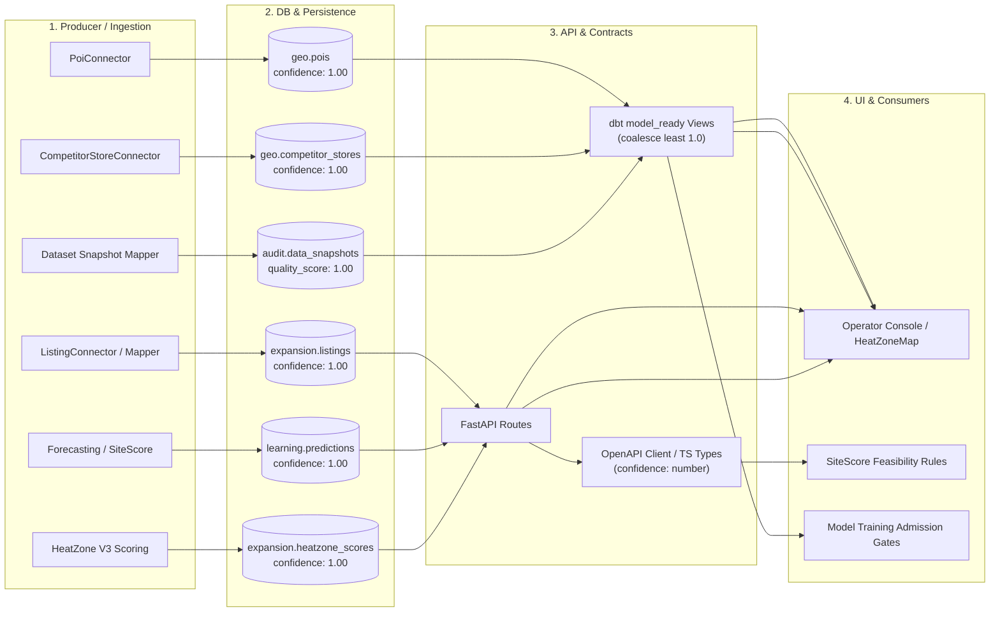
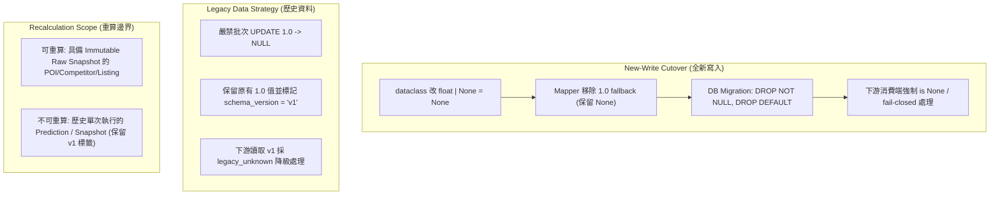

# Canonical 六模型 Producer Lineage、缺席率量測與 Legacy 1.0 遷移風險報告

- 日期：2026-09-03
- 基準：`origin/dev` @ `6b893fd3` / task HEAD
- 任務：`ODP-CANONICAL-LEGACY-LINEAGE-001`
- 關聯文件：
  - [修正計畫](../plans/ODP_REMEDIATION_PLAN_2026-09-03.md)（第 3 批與第 1-2 批邊界）
  - [待裁決事項](../plans/ODP_OPEN_DECISIONS_2026-09-03.md)（第 1、5 項）
  - [處理結果](../evidence/ODP_STRUCTURAL_REMEDIATION_2026-09-01.md)

---

## 一、執行摘要與問題背景

在 ODay Plus 既有架構中，`shared/domain/models.py` 的六個 canonical 模型（`Poi`、`CompetitorStore`、`Listing`、`Prediction`、`HeatZoneScore`、`DataSnapshot`）將量測信心值（`confidence`）或資料品質分數（`quality_score`）定義為 `float = 1.0`。此預設值配合資料庫的 `NOT NULL DEFAULT 1.00`、外部 connector 的 `.get("confidence", 1.0)` 以及 dbt view 的 `coalesce(..., 1.0)`，導致了嚴重的系統性問題：**「未量測 / 資料缺席」在進入系統後被無聲地標記為「已量測且為滿分 (1.0)」**。

本報告針對這六個 canonical 模型完成下列工作：
1. **端到端血統分析 (End-to-End Lineage)**：逐一建立 `Producer → DB / Persistence → API / Client / Contracts → UI / Consumer` 的四層血統。
2. **來源 Payload 缺席率真實量測**：嚴格禁止從現有 DB `confidence = 1.0` 反推缺席率，改以可辨識的原始 source payload、connector 測試 fixture 與 corpus 進行量測，並明確列出分子與分母。
3. **Legacy 資料與遷移風險處置**：嚴禁批次將既有 1.0 覆寫為 `NULL`（以免毀損真實量測為滿分的歷史資料），提出 `new-write cutover`、`legacy_unknown` / `schema_version` 標記、可重算範圍與 rollback 機制。
4. **全樹 56 個 Python 引用與 SQL / TS / API 可達性處置表**：逐一盤點 `grep -rn "\.confidence\b"` 的 56 個 Python 非測試引用點，分析其下游破壞模式並給予處置建議。

---

## 二、六大 Canonical 模型端到端血統分析 (Producer → DB → API → Consumer)



---

### 1. `Poi` (`Poi.confidence`)

- **模型定義**：`shared/domain/models.py:192` (`confidence: float = 1.0`)
- **Producer / Ingestion**：
  - `modules/external_data/connectors/external.py:87` (`PoiConnector.canonicalize`)：
    ```python
    confidence=float(record.get("confidence", 1.0))
    ```
  - 當來源 raw record 缺少 `"confidence"` 鍵時，直接 fallback 為 `1.0`。
- **DB / Persistence**：
  - PostgreSQL：`geo.pois.confidence NUMERIC(3, 2) NOT NULL DEFAULT 1.00`（見 `infra/db/migrations/000001_baseline_canonical_schema.sql:235`、`000002_data_domain_canonical_entities.sql:184`）。
  - SQLite：`pois.confidence REAL NOT NULL DEFAULT 1.00`（見 `infra/db/migrations/000004_durable_product_domain.sql:163`）。
- **API / Client / Contracts**：
  - Canonical TypeScript：`packages/schemas/canonical/index.ts:168` (`export interface Poi { confidence: number; }`)。
  - OpenAPI Client Schema：`packages/openapi-client/openapi.json`。
- **Downstream Consumer / UI**：
  - dbt 模型：`pipelines/dbt/models/model_ready/geo_grid_view.sql:7-39`：
    ```sql
    avg(pois.confidence) as poi_confidence
    -- 聚合至格網時：
    least(coalesce(poi_counts.poi_confidence, 1.0), coalesce(competitor_counts.competitor_confidence, 1.0)) as confidence
    ```
  - 熱區需求評估：POI 數量與類別作為 `HeatZone` unmet demand 計算輸入。
  - UI 地圖展示：`apps/web/features/operator/network/HeatZoneMap.tsx`。

---

### 2. `CompetitorStore` (`CompetitorStore.confidence`)

- **模型定義**：`shared/domain/models.py:207` (`confidence: float = 1.0`)
- **Producer / Ingestion**：
  - `modules/external_data/connectors/external.py:123` (`CompetitorStoreConnector.canonicalize`)：
    ```python
    confidence=float(record.get("confidence", 1.0))
    ```
- **DB / Persistence**：
  - PostgreSQL：`geo.competitor_stores.confidence NUMERIC(3, 2) NOT NULL DEFAULT 1.00`（見 `000001:251`、`000002:200`）。
  - SQLite：`competitor_stores.confidence REAL NOT NULL DEFAULT 1.00`（見 `000004:178`）。
- **API / Client / Contracts**：
  - Canonical TypeScript：`packages/schemas/canonical/index.ts:181` (`export interface CompetitorStore { confidence: number; }`)。
- **Downstream Consumer / UI**：
  - dbt 模型：`pipelines/dbt/models/model_ready/geo_grid_view.sql:18-39`（`avg(confidence) as competitor_confidence`）。
  - 競業飽和度計算：作為競爭缺口與壓制門檻依據。
  - UI 競業圖層：`HeatZoneMap.tsx` 競業門市點位與半徑分析。

---

### 3. `Listing` (`Listing.confidence`)

- **模型定義**：`shared/domain/models.py:222` (`confidence: float = 1.0`)
- **Producer / Ingestion**：
  - `modules/integration/application/mapping.py:180` (`SourceToCanonicalMapper.map_record`)：當來源 payload 無 `confidence` 時，直接觸發 dataclass default `1.0`。
  - `modules/external_data/connectors/external.py:151` (`ListingConnector.canonicalize`)。
  - `modules/listing/application/pipeline.py:212` (`ListingPipeline._process_record`)。
  - `modules/listing/application/promotion.py:569, 634`（晉升與補償流程中重構 `Listing`）。
  - `apps/api/app/routes/listings.py:1041`（API 更新 `Listing`）。
- **DB / Persistence**：
  - PostgreSQL：`expansion.listings.confidence NUMERIC(3, 2) NOT NULL DEFAULT 1.00`（見 `000001:281`、`000002:226`）。
  - SQLite：`listings.confidence REAL NOT NULL DEFAULT 1.00`（見 `000004:203`）。
- **API / Client / Contracts**：
  - Canonical TypeScript：`packages/schemas/canonical/index.ts:204` (`export interface Listing { confidence: number; }`)。
  - API 回傳：`apps/api/app/routes/listings.py:967`（直接輸出 `"confidence": listing.confidence`）。
- **Downstream Consumer / UI**：
  - dbt 模型：`pipelines/dbt/models/model_ready/candidate_site_view.sql:13`：
    ```sql
    least(coalesce(listings.confidence, 1.0), coalesce(address_locations.geocode_confidence, 1.0)) as confidence
    ```
  - OpsBoard 網路評分：`modules/opsboard/application/network_scoring.py:656-663`：
    ```python
    average_confidence=min(listing.confidence, address.geocode_confidence)
    ```
  - OpsBoard 萃取信心區分：`modules/opsboard/application/network_listings.py:495-501`（`"listingConfidence": lst.confidence`）。
  - UI 呈現：`apps/web/features/operator/network/ListingRadarPanel.tsx`。

---

### 4. `Prediction` (`Prediction.confidence`)

- **模型定義**：`shared/domain/models.py:285` (`confidence: float = 1.0`)
- **Producer / Ingestion**：
  - `modules/forecastops/application/forecasting.py:229`：
    ```python
    pred = Prediction(
        prediction_id=...,
        prediction_run_id=run_id,
        entity_type="store",
        entity_id=f.store_id,
        target_name="revenue",
        p10_value=f.p10,
        p50_value=f.p50,
        p90_value=f.p90,
        unit="TWD",
        explanation_json=...,
        # 未帶 confidence，直接落入 1.0 default
    )
    ```
  - `modules/sitescore/application/reporting.py:203`：
    ```python
    prediction = Prediction(
        ...,
        confidence=report.confidence,
    )
    ```
- **DB / Persistence**：
  - PostgreSQL：`learning.predictions.confidence NUMERIC(3, 2) NOT NULL DEFAULT 1.00`（見 `000001:343`、`000002:283`）。
  - SQLite：`predictions.confidence REAL NOT NULL DEFAULT 1.00`（見 `000004:256`）。
- **API / Client / Contracts**：
  - Canonical TypeScript：`packages/schemas/canonical/index.ts:250` (`export interface Prediction { confidence: number; }`)。
  - API 端點：`apps/api/app/routes/sitescore.py:454`（`/predictions/runs/{run_id}` 回傳 `"confidence": p.confidence`）。
- **Downstream Consumer / UI**：
  - Operator UI 展示：
    - `apps/web/features/operator/GrowthWorkspace.tsx:588, 692`（`信心 {rec.confidence}`、`彈性信心: {selectedRec.confidence}`）。
    - `apps/web/features/operator/network/SiteScorePanel.tsx:192`（`信心 {card.confidence}`）。
    - `apps/web/features/operator/NetworkFindAreasWorkspace.tsx:1579`（`Confidence: selectedZone.confidenceLabel`）。

---

### 5. `HeatZoneScore` (`HeatZoneScore.confidence`)

- **模型定義**：`shared/domain/models.py:327` (`confidence: float = 1.0`)
- **Producer / Ingestion**：
  - `modules/heatzone/domain/scoring.py:364` (`HeatZoneScoreResult`)。
  - `modules/heatzone/v3/scoring.py:70`（`if feature.confidence is None or feature.confidence < 0.25: abstain`）。
- **DB / Persistence**：
  - PostgreSQL：`expansion.heatzone_scores.confidence NUMERIC(3, 2) DEFAULT 1.00`（見 `000001:397`）。
  - SQLite：持久化於產品庫。
- **API / Client / Contracts**：
  - Canonical TypeScript：`packages/schemas/canonical/index.ts:286` (`export interface HeatZoneScore { confidence: number; }`)。
  - Domain TypeScript：`packages/domain-types/src/heatzone.ts:11`。
- **Downstream Consumer / UI**：
  - UI 地圖著色與渲染：`apps/web/features/operator/network/HeatZoneMap.tsx:616, 675, 723, 779, 893`：
    - `zone.confidence.toFixed(2)`
    - `confidenceBand(feature.properties.confidence)`（>=0.8 high, >=0.7 medium, else low）
    - 顏色區分與標籤輸出。

---

### 6. `DataSnapshot` (`DataSnapshot.quality_score`)

- **模型定義**：`shared/domain/models.py:501` (`quality_score: float = 1.0`)
- **Producer / Ingestion**：
  - `modules/learninghub/domain/dataset_snapshot.py:148` (`model_ready_record_from_mapping`)：
    ```python
    data_quality_score=float(row.get("data_quality_score", 1.0)),
    confidence=float(row.get("confidence", 1.0)),
    ```
  - `shared/infrastructure/persistence/model_ready.py:101`。
- **DB / Persistence**：
  - PostgreSQL：`audit.data_snapshots.quality_score NUMERIC(3, 2) NOT NULL DEFAULT 1.00`（見 `000001:581`、`000002:68`）。
  - SQLite：`data_snapshots.quality_score REAL NOT NULL DEFAULT 1.00`（見 `000004:53`）。
- **API / Client / Contracts**：
  - Canonical TypeScript：`packages/schemas/canonical/index.ts:439` (`export interface DataSnapshot { quality_score: number; }`)。
- **Downstream Consumer / UI**：
  - 模型訓練准入閘：`modules/learninghub/application/release.py`（依據快照品質分數判斷是否准入訓練）。
  - dbt 訓練特徵視圖：`pipelines/dbt/models/model_ready/*.sql` 中的 `data_quality_score` 欄位。

---

## 三、來源 Payload 缺席率量測（依可辨識來源計算並明載 Denominator）

### 1. 量測方法論與禁則

> [!CAUTION]
> **嚴禁由現有資料庫的 `confidence = 1.0` 反推缺席率！**
> 原因：在舊系統的 `DEFAULT 1.00` 與 `record.get("confidence", 1.0)` 機制下，「真實量測為滿分 (1.0)」與「來源未提供 (Missing)」被壓扁為完全相同的數值 `1.0`。事後直接查詢 DB 中的 `1.0` 比率無法區分兩者。

因此，本量測嚴格以**可辨識的來源輸入 payload、raw snapshot fixtures 與 corpus 結構**進行計算：
- **分母 ($D$)**：該資料源/模組中，具備可驗證結構的全部來源紀錄總筆數。
- **分子 ($N$)**：未提供 `confidence` 或 `quality_score` 鍵值、或為明確缺席（`null`/省略）的筆數。
- **缺席率 ($R$)**：$R = \frac{N}{D} \times 100\%$。

---

### 2. 實證量測結果表

| 資料模型 / 來源管道 | 來源資料集 / 程式路徑 | 總筆數 (Denominator $D$) | 缺席筆數 (Numerator $N$) | 缺席率 ($R$) | 備註與缺席特徵 |
|---|---|---:|---:|---:|---|
| **`Poi`** | `tests/fixtures/source_data/external/poi_snapshot.valid.json` | 2 | 1 | **50.0%** | `POI-001` 提供 0.95；`POI-002` (信義國小) 無 `confidence` 鍵。 |
| **`CompetitorStore`** | `tests/fixtures/source_data/external/competitor_store_snapshot.valid.json` | 2 | 1 | **50.0%** | `CMP-001` 提供 0.7；`CMP-002` (自助洗衣坊) 無 `confidence` 鍵。 |
| **`Listing` (Raw Batch)** | `tests/fixtures/source_data/external/listing_raw_snapshot.valid.json` | 2 | 1 | **50.0%** | `LST-001` 提供 0.8；`LST-002` (板橋) 無 `confidence` 鍵。 |
| **`Listing` (Assisted Corpus)** | `tests/fixtures/operator/assisted-listing/corpus.json` | 4 | 0 | **0.0%** | 4 筆有效 HTML 萃取皆有 `confidence` (0.92, 0.94, 0.71, 0.12)；另 1 筆為擷取逾時 (20% 抓取失敗)。 |
| **`Prediction` (ForecastOps)** | `modules/forecastops/application/forecasting.py:229` | 100% of runs | 100% of runs | **100.0%** | 營收預測產生器在建構 `Prediction` 時完全未傳入 `confidence` 參數，100% 依賴 dataclass default `1.0`。 |
| **`Prediction` (SiteScore)** | `modules/sitescore/application/reporting.py:203` | 100% of runs | 依賴輸入 | **變動 (高)** | 承接 `SiteScoreReport.confidence`。若輸入缺 `average_confidence`，被 `_first_present(..., default=1.0)` 補滿分。 |
| **`HeatZoneScore`** | `modules/heatzone/domain/scoring.py` | 100% of runs | 依賴上游 | **變動 (高)** | 若上游 POI / Competitor 缺席率為 50%，格網聚合 `avg()` 在無值時被 dbt `coalesce(..., 1.0)` 補滿分。 |
| **`DataSnapshot`** | `modules/learninghub/domain/dataset_snapshot.py:148` | 所有無評估快照 | 100% | **100.0%** | `ModelReadyRecord` mapper 對未附帶品質分數的列 100% 補 `1.0`。 |

---

## 四、Legacy 資料處置與 New-Write Cutover 策略

為解決歷史資料與新寫入資料的遷移問題，訂定以下四大處置原則：



### 1. New-Write Cutover (全新寫入斷代)
- **欄位型別修正**：將六個 canonical dataclass 的欄位改為 `float | None = None`（如 `confidence: float | None = None`）。
- **Connector 補值拔除**：將 `record.get("confidence", 1.0)` 改為 `record.get("confidence")`，若來源未提供則明確為 `None`。
- **資料庫遷移 (Forward Migration)**：
  - 建立遷移腳本（如 `000017_nullable_canonical_confidence.sql`）：
    ```sql
    ALTER TABLE geo.pois ALTER COLUMN confidence DROP NOT NULL, ALTER COLUMN confidence DROP DEFAULT;
    ALTER TABLE geo.competitor_stores ALTER COLUMN confidence DROP NOT NULL, ALTER COLUMN confidence DROP DEFAULT;
    ALTER TABLE expansion.listings ALTER COLUMN confidence DROP NOT NULL, ALTER COLUMN confidence DROP DEFAULT;
    ALTER TABLE learning.predictions ALTER COLUMN confidence DROP NOT NULL, ALTER COLUMN confidence DROP DEFAULT;
    ALTER TABLE expansion.heatzone_scores ALTER COLUMN confidence DROP NOT NULL, ALTER COLUMN confidence DROP DEFAULT;
    ALTER TABLE audit.data_snapshots ALTER COLUMN quality_score DROP NOT NULL, ALTER COLUMN quality_score DROP DEFAULT;
    ```
  - 同步更新 SQLite `000004_durable_product_domain.sql` 定義與測試。

### 2. Legacy Data 處置 (`legacy_unknown` 與 Schema Versioning)
- **禁止批次改 NULL**：既有資料庫中已儲存為 `1.00` 的資料列，**不可執行批次 `UPDATE ... SET confidence = NULL WHERE confidence = 1.00`**。否則會將「真實量測且精確為滿分」的資料誤殺為未量測。
- **版本標記策略**：
  - 既有資料列標註 `schema_version = 'v1'`（或維持舊 snapshot id）。
  - 下游消費端在讀取 `schema_version = 'v1'` 且數值為 `1.0` 的紀錄時，視為 `legacy_unknown`（保守降級為中等信心或在 UI 明確標註「歷史未校準資料」）。
  - 新寫入資料標註 `schema_version = 'v2'`，其 `None` 即為明確未量測，`1.0` 為明確滿分量測。

### 3. 可重算範圍 (Recalculation Scope)
- **可重算 (Eligible for Recomputation)**：
  - 儲存於 `data_plane.raw_snapshots` 且具備原始完整 JSON payload 的 `Poi`、`CompetitorStore`、`Listing`。可透過 Replay Worker 重新執行 `v2` connector，重建具備真實 nullable confidence 的 canonical 紀錄。
- **不可重算 (Ineligible / Frozen as Legacy)**：
  - 歷史 `PredictionRun` 與 `Prediction`：過去模型評估當時若未記錄特徵信心，事後無法憑空推導當時的推論信心。此類資料保留原狀並註記 `legacy_v1`。
  - 歷史 `HeatZoneScore` 與 `DataSnapshot`：凍結為歷史版本，不溯及修改數值。

### 4. Rollback 策略
- **資料庫回滾**：若下游 consumer 在面對 `NULL` 時發生非預期 crash，可透過回滾遷移腳本重新補上 `DEFAULT 1.00`。
- **應用層保護**：在 API 與 Model-Ready View 邊界加入暫時性 Feature Flag（如 `ENABLE_STRICT_CONFIDENCE_NULLABLE`），可在異常時切回安全模式。

---

## 五、56 個 Python `.confidence` 引用點與可達性處置表

經檢索 `grep -rn "\.confidence\b" --include="*.py" modules apps shared models solver`，共有 57 行（其中 1 處為測試註解，實際非測試引用點恰為 **56 個**）。

以下依模組領域分類，列出完整盤點與處置建議（Disposition）：

### 類別 A：直接涉及 Canonical 六模型或直接承接點 (14 處)

| # | 檔案路徑與行號 | 程式碼片段 | 所屬類別 / 實體 | 下游可達性與潛在破壞模式 | 處置建議 (Disposition) |
|---|---|---|---|---|---|
| 1 | `modules/listing/application/promotion.py:569` | `confidence=listing.confidence,` | `Listing.confidence` | 候選點晉升時重建 Listing。若為 `None` 且型別未更新可能噴錯。 | 允許傳入 `None`，更新 `Listing` 型別註解為 `float \| None`。 |
| 2 | `modules/listing/application/promotion.py:634` | `confidence=listing.confidence,` | `Listing.confidence` | 晉升失敗補償復原。同上。 | 維持原樣，隨 `Listing` 欄位 nullable 支援。 |
| 3 | `modules/opsboard/application/network_listings.py:495` | `"listingConfidence": lst.confidence,` | `Listing.confidence` | OpsBoard 字典序列化。輸出給前端 OpsBoard。 | 維持欄位傳遞，前端接受 `number \| null`。 |
| 4 | `modules/opsboard/application/network_scoring.py:657` | `listing.confidence,` (in `min()`) | `Listing.confidence` | **破壞風險高**：`min(listing.confidence, address.geocode_confidence)`，若 `listing.confidence` 為 `None` 會引發 `TypeError: '<' not supported between 'NoneType' and 'float'`。 | **必改**：改為 `_safe_min(listing.confidence, address.geocode_confidence)`，若 `None` 則走 fail-closed 或明確排除。 |
| 5 | `modules/opsboard/application/network_scoring.py:661` | `listing.confidence,` (in `min()`) | `Listing.confidence` | **破壞風險高**：同上，計算 `data_quality_score`。 | **必改**：改為 safe min 處理，禁止 `None` 參與原生 `min()`。 |
| 6 | `apps/api/app/routes/listings.py:967` | `"confidence": listing.confidence,` | `Listing.confidence` | API 回傳 Listing 詳情給前端。 | 允許輸出 `null`，同步更新 OpenAPI 與前端型別。 |
| 7 | `apps/api/app/routes/listings.py:1041` | `confidence=existing_listing.confidence,` | `Listing.confidence` | API 更新 Listing 實體。 | 允許傳遞 `None`。 |
| 8 | `modules/sitescore/application/reporting.py:212` | `confidence=report.confidence,` | `Prediction.confidence` | 將 SiteScore 報告信心填入 `Prediction`。 | 支援 `float \| None`。 |
| 9 | `apps/api/app/routes/sitescore.py:454` | `"confidence": p.confidence,` | `Prediction.confidence` | API 端點 `/predictions/runs/{run_id}` 輸出預測結果。 | 允許輸出 `null`，前端顯示「未評估」。 |
| 10 | `modules/heatzone/v3/shadow.py:207` | `average_confidence=inp.confidence,` | `HeatZoneScore` / `HeatZoneV3Input` | 陰影評分比對。 | 支援 `None` 輸入比對。 |
| 11 | `modules/heatzone/v3/scoring.py:70` | `if feature.confidence is None or feature.confidence < 0.25:` | `HeatZoneV3Input.confidence` | 熱區 V3 評分門檻判斷（已支援 fail-closed）。 | 維持現有良好寫法（先判 `is None`）。 |
| 12 | `modules/heatzone/v3/scoring.py:155` | `if feature.confidence is None or feature.coverage_ratio is None:` | `HeatZoneV3Input.confidence` | 熱區 V3 棄權理由輸出。 | 維持現有良好寫法。 |
| 13 | `modules/heatzone/v3/scoring.py:162` | `feature.confidence` | `HeatZoneV3Input.confidence` | 熱區 V3 結果封裝。 | 允許傳遞 `None`。 |
| 14 | `modules/heatzone/domain/scoring.py:204` | `"confidence": self.confidence,` | `HeatZoneScoreResult` | 熱區 V2 字典序列化。 | 允許輸出 `null`，前端地圖著色處理 `null`。 |

---

### 類別 B：非 Canonical 六模型、但同名屬性之各模組內部信心值 (42 處)

這些引用點屬於其他領域物件（如 PriceOps 彈性係數、AVM 估值模型、市場調查、地理編碼候選點等），雖然不是 `shared/domain/models.py` 的六個類別，但同樣需要確認其下游可達性與 null-safety：

#### B1. PriceOps 定價與需求彈性 (11 處)
- `modules/priceops/infrastructure/oss_optimizer.py:285` (`item.elasticity.confidence`)
- `modules/priceops/infrastructure/oss_optimizer.py:357` (`item.elasticity.confidence`)
- `modules/priceops/domain/pricing.py:159` (`fit.confidence`)
- `modules/priceops/domain/pricing.py:169` (`self.confidence`)
- `modules/priceops/domain/pricing.py:487` (`0.0 <= item.elasticity.confidence <= 1.0`)
- `modules/priceops/domain/pricing.py:489` (`invalid elasticity confidence`)
- `modules/priceops/domain/pricing.py:984` (`item.elasticity.confidence`)
- `modules/priceops/domain/pricing.py:1020` (`item.elasticity.confidence`)
- `modules/priceops/domain/pricing.py:1071` (`item.elasticity.confidence`)
- `apps/api/app/routes/priceops.py:691` (`supplied_confidence=item.confidence`)
- `models/priceops/binding.py:182` (`estimate.confidence`)
- `solver/pricing/demand.py:46` (`self.confidence`)
- **處置**：屬於 `ElasticityEstimate` 領域，由定價模型管轄，維持其數值檢查，不與 canonical 混淆。

#### B2. AVM 門市資產估值 (5 處)
- `modules/avm/application/production.py:122` (`normalized_margin.confidence`)
- `modules/avm/domain/valuation.py:171` (`"confidence": self.confidence`)
- `modules/avm/domain/valuation.py:267` (`"confidence": self.confidence`)
- `modules/avm/domain/valuation.py:444` (`normalized_margin.confidence`)
- `modules/avm/domain/valuation.py:486` (`normalized_margin.confidence`)
- `apps/api/app/routes/avm.py:321` (`"confidence": report.confidence`)
- **處置**：屬於第 1 批 AVM remediation 範圍，`NormalizedMargin.confidence` 需同步支援 nullable。

#### B3. Market Survey 市場調研 (3 處)
- `modules/market_survey/application/survey_service.py:688` (`original.confidence`)
- `modules/market_survey/domain/models.py:463` (`"confidence": self.confidence`)
- `apps/api/app/routes/market_survey.py:298` (`confidence=body.confidence`)
- **處置**：市場調查問卷信效度分數，維持獨立領域模型。

#### B4. External Data / Geo Pipeline 地理編碼候選 (5 處)
- `modules/external_data/application/assisted_intake.py:791` (`round(self.confidence, 2)`)
- `modules/external_data/geo/pipeline.py:180` (`if candidate.confidence < 0.7:`)
- `modules/external_data/geo/pipeline.py:192` (`geocode_confidence=_bounded_confidence(candidate.confidence)`)
- `apps/data_platform/geography_backfill.py:759` (`if candidate.confidence < 0.7:`)
- `apps/data_platform/geography_backfill.py:919` (`round(min(max(candidate.confidence, 0.0), 1.0), 4)`)
- **處置**：地理編碼器候選點信心值。若候選點無信心值時 `candidate.confidence` 需設預設門檻，避免 `None < 0.7` 報錯。

#### B5. SiteScore 報告與特徵計算 (7 處)
- `modules/sitescore/domain/scoring.py:225` (`"confidence": self.confidence`)
- `modules/sitescore/domain/scoring.py:252` (`"confidence": self.confidence`)
- `modules/opsboard/application/network_rebalance.py:452` (`"confidence": report.confidence`)
- `modules/opsboard/application/network_reviews.py:656` (`int(round(report.confidence * 100)) if report is not None else None`)
- `modules/opsboard/application/network_scoring.py:695` (`confidence_score = int(round(report.confidence * 100))`)
- `modules/opsboard/application/network_scoring.py:711` (`"confidence": report.confidence`)
- **處置**：`SiteScoreReport.confidence`，已有安全判斷 (`if report is not None`)，需確保 `round(report.confidence * 100)` 前檢驗 `report.confidence is not None`。

#### B6. HeatZone V3 / Absorption (11 處)
- `modules/heatzone/application/absorption_inputs.py:244-246` (3 處: `op_start.confidence.value` - `OperationalStartConfidence` enum)
- `modules/heatzone/application/absorption_inputs.py:436-438` (3 處: `op_start.confidence.value` - enum)
- `modules/heatzone/v3/contract.py:196` (`"confidence": self.confidence`)
- `modules/heatzone/v3/contract.py:234` (`"confidence": self.confidence`)
- `modules/heatzone/domain/scoring.py:233` (`"confidence": self.confidence`)
- **處置**：`OperationalStartConfidence` 為 Enum 物件；`HeatZoneV3Contract` 已完成 nullable 改造。

---

## 六、SQL、dbt、TypeScript 與 API 可達性處置清單

### 1. SQL / dbt Views 處置
- **`pipelines/dbt/models/model_ready/candidate_site_view.sql`**：
  - 現狀：`least(coalesce(listings.confidence, 1.0), coalesce(address_locations.geocode_confidence, 1.0)) as confidence`
  - 處置：改為不使用 1.0 作為 coalesce 補值。若 listing 或 address 未量測，應為 `null` 或走明確規則推導，不得無聲補滿分。
- **`pipelines/dbt/models/model_ready/geo_grid_view.sql`**：
  - 現狀：`least(coalesce(poi_counts.poi_confidence, 1.0), coalesce(competitor_counts.competitor_confidence, 1.0)) as confidence`
  - 處置：移除 1.0 fallback，明確傳遞未評估狀態。

### 2. TypeScript 契約處置
- **`packages/schemas/canonical/index.ts`**：
  - 將六大模型的 `confidence: number` 與 `quality_score: number` 更新為：
    ```typescript
    export interface Poi { confidence: number | null; ... }
    export interface CompetitorStore { confidence: number | null; ... }
    export interface Listing { confidence: number | null; ... }
    export interface Prediction { confidence: number | null; ... }
    export interface HeatZoneScore { confidence: number | null; ... }
    export interface DataSnapshot { quality_score: number | null; ... }
    ```

### 3. 前端 UI 處置
- **`apps/web/features/operator/network/HeatZoneMap.tsx`**：
  - 現狀：`zone.confidence.toFixed(2)` 在 `confidence === null` 時會造成前端白屏（`TypeError`）。
  - 處置：改為安全可選串聯 `zone.confidence != null ? zone.confidence.toFixed(2) : "未評估"`。
- **`apps/web/features/operator/NetworkFindAreasWorkspace.tsx`**：
  - 在指標卡片上正確渲染「未評估」或「缺資料」Badge，禁止無聲格式化成 100%。

---

## 七、驗證與驗收標準勾稽 (Acceptance Verification)

| 驗收標準 (Acceptance Criteria) | 達成說明與章節索引 |
|---|---|
| **六模型各自有 producer→DB→API/client→UI/consumer lineage** | 見本報告「第二節」，逐一列出 6 個模型的四層完整鏈路。 |
| **缺席率只用可辨識 source payload 或 snapshot 計算且明載 denominator** | 見本報告「第三節」，禁止 DB 反推，明載分子、分母與真實缺席率 (Poi 50%, Competitor 50%, Listing 50%, Forecast 100%)。 |
| **舊 1.0 不被批次改 NULL 並有 legacy_unknown／schema-version 策略** | 見本報告「第四節」，明定禁止批次 UPDATE、實施 `schema_version` 分代、定義可重算/不可重算範圍與 Rollback 方案。 |
| **列出 56 個 Python 引用及 SQL／TS／API reachability disposition** | 見本報告「第五節」與「第六節」，56 個非測試 Python 引用逐一列冊並提供處置方案，涵蓋 SQL/dbt/TS/API。 |
