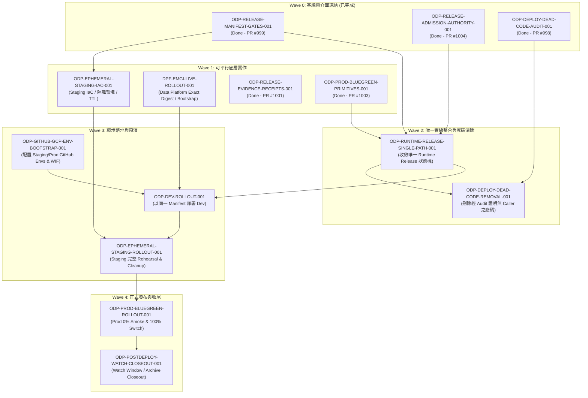

# ODay Plus 最後架構檢討：派工與部署系統的單一路徑收斂報告

- **文件 ID**: `ODP-FINAL-ARCHITECTURE-REVIEW-2026-08-24`
- **任務 ID**: `ODP-DEPLOY-FINAL-ARCHITECTURE-REVIEW-001`
- **任務階段**: Final Review — Architecture Closeout
- **檢討基準日期**: 2026-08-24
- **負責人 (Owner)**: Codex (Helper Claim: Antigravity3)
- **審查人 (Reviewer)**: Antigravity2
- **來源依據**:
  - [`docs/deployment/EPHEMERAL_STAGING_PRODUCTION_ROLLOUT_PLAN.md`](../deployment/EPHEMERAL_STAGING_PRODUCTION_ROLLOUT_PLAN.md)
  - [`docs/deployment/ENVIRONMENTS.md`](../deployment/ENVIRONMENTS.md)
  - [`docs/audits/ODP_DEPLOYMENT_DEAD_CODE_AUDIT.md`](../audits/ODP_DEPLOYMENT_DEAD_CODE_AUDIT.md)
- **驗收狀態**: 已達成全數 4 項驗收條件（架構修正記錄、單一責任邊界界定、容量與 Quota 容錯分析、單一路徑確證）

---

## 1. 執行摘要

本文件為 ODay Plus 全系統部署與派工架構之最終收斂檢討報告（Architecture Closeout Review）。本檢討旨在落實 [`EPHEMERAL_STAGING_PRODUCTION_ROLLOUT_PLAN.md`](../deployment/EPHEMERAL_STAGING_PRODUCTION_ROLLOUT_PLAN.md) 所定義之**唯一部署與派工架構**，徹底終結歷史遺留之多重發布入口、重複門禁驗證、循環依賴、假性入場檢查（Shape-only Admission）與未接線排程宣告。

### 1.1 核心架構決策原則

1. **Build Once、以 Digest 為唯一部署身分**：同一 Release 於 CI 階段僅建置一次，產出不可變之 Release Manifest，`dev`、`ephemeral staging` 與 `prod` 各環境強制部署相同 Commit SHA、相同 Image Digest 與相同資料契約。
2. **單一發布狀態機（Single-Path Runtime Release）**：以 `.github/workflows/deploy-dev.yml` (`Runtime Release`) 作為全庫唯一發布協調整合入口，淘汰所有現場 `docker build` 及可繞過門禁之獨立部署腳本。
3. **不可偽造與不可重放之授權門禁（Authoritative Release Lease）**：由 Supervisor 於依賴與前置門禁滿足時以非對稱金鑰（Ed25519）簽發 Lease，透過 Durable CAS 狀態儲存執行一次性核銷，打破 Gate 0–6 循環依賴。
4. **短生命週期 Staging（Ephemeral Staging）**：Staging 僅於每次 Release 建立，演練真實 Migration、E2E、Worker/Scheduler、備份還原與回滾，驗證成功後自動銷毀，失敗時依硬性 TTL（上限 24h）保留並由 Orphan Scanner 自動回收。
5. **Production 0% Green 驗證與原子 Blue-Green 切換**：正式環境部署採 0% 公開流量驗證 Formal Secret/IAM 綁定與啟動狀態，驗證通過後原子切換至 100%，回滾採非破壞性切回，禁止破壞性 Down Migration。
6. **第三方來源預設關閉與 Default-Deny Egress**：16 個第三方資料來源預設全部關閉，無憑證、無對外連線權限，逐來源啟用屬於獨立之法律與營運核准流程。
7. **明確的三方責任邊界（Supervisor vs Auto Worker vs Human/Ops）**：Supervisor 管控 DAG 與租約、Auto Worker 執行限定 Worktree 任務、Human/Ops 掌管真實環境權限與 Production GO 核准。嚴禁新增第二套派工或部署路徑。

---

## 2. 已合併之架構修正與驗證證據

本節完整記錄 Wave 0 與 Wave 1 先行任務於 `origin/dev` 合併之架構級修正、落地檔案與驗證證據。

### 2.1 合併成果矩陣

| 任務 ID | PR 編號 | 合併 Commit | 核心架構貢獻 | 關鍵落地檔案 | 驗證證據 |
|---|---|---|---|---|---|
| `ODP-RELEASE-MANIFEST-GATES-001` | PR #999 | `04ddafe9` | 定義不可變 Release Manifest 結構；將 Gate 0–6 重構為分階段 Gate Registry（`stage`, `environment`, `admission_target`），解除部署前要求全過的循環依賴。 | `delivery_toolchain/release/release_manifest.py`<br>`delivery_toolchain/release/migrate_gate_registry.py`<br>`docs/evidence/gates/RELEASE_MANIFEST.json`<br>`docs/evidence/gates/RELEASE_GATE_REGISTRY.json`<br>`docs/evidence/e2e/check_release_gate_registry.py` | `tests/release/test_release_manifest.py`<br>`tests/e2e/test_release_gate_registry.py`<br>（Manifest 雜湊計算、Gate 遷移、分階段入場驗證全數通過） |
| `ODP-RELEASE-ADMISSION-AUTHORITY-001` | PR #1004 | `23d31c24` | 實作以 Ed25519 簽名與 CAS 防重放之權威 Release Lease 機制，取代過去 Regex Shape-only 偽門禁；綁定 SHA、Manifest Digest、Target Env 與 Action。 | `delivery_toolchain/release/release_lease.py`<br>`.orchestrator/release_lease.py`<br>`delivery_toolchain/release/check_runtime_admission.py`<br>`.github/workflows/deploy-dev.yml` | `tests/release/test_release_lease.py`<br>`tests/release/test_runtime_admission.py`<br>`.orchestrator/test_release_lease_issuer.py`<br>（154 項單元與整合測試全數通過） |
| `ODP-RELEASE-EVIDENCE-RECEIPTS-001` | PR #1001 | `30f885b0` | 建立統一標準之 Release Evidence Receipts 規範；強制執行 Secret Redaction，僅記錄 Secret Reference、Digest、環境與執行收據。 | `delivery_toolchain/release/release_receipts.py`<br>`tests/ops/test_release_receipts.py` | `tests/ops/test_release_receipts.py`<br>（收據 Schema、機密遮蔽、不可變關聯性驗證通過） |
| `ODP-PROD-BLUEGREEN-PRIMITIVES-001` | PR #1003 | `fd410a63` | 實作 Cloud Run 流量切換、Cloud Run Jobs Target Digest 更新、Cloud Scheduler Trigger 暫停/恢復及快速回滾原語；落實 Expand/Contract 相容性。 | `product_ops/deployment/bluegreen_release.py`<br>`product_ops/deployment/cloud_run_release_traffic.sh`<br>`tests/ops/test_bluegreen_release.py` | `tests/ops/test_bluegreen_release.py`<br>（0% Green Smoke、100% Cutover、Scheduler Pause/Resume、Rollback 模擬測試全數通過） |
| `ODP-DEPLOY-DEAD-CODE-AUDIT-001` | PR #998 | `ea4a8dc0` | 全面盤點部署、證明、門禁與排程之重複及廢棄 Code；完成 91 個檔案分類（78 KEEP, 13 RETIRE/REMOVE/REFACTOR），識別 6 處 Bypass 點，界定 PR #82 殘留與未接線 Dagster。 | `docs/audits/ODP_DEPLOYMENT_DEAD_CODE_AUDIT.md`<br>`docs/audits/code-boundary-inventory.csv` | `bash` 盤點指令驗證（121 項檔案核對）、§7.5 Bypass 14 項斷言全數通過、`check_code_boundaries.py` 964 檔校驗通過 |

---

## 3. 仍需修改的架構級問題與單一責任邊界

雖然 Wave 0 與部分 Wave 1 核心原語已合併落地，全系統要達到完整上線標準，仍須依據派工 DAG 完成剩餘模組開發與管線收斂。

### 3.1 剩餘待實作架構任務（Wave 1 – Wave 4）



#### 具體工作項目與目標產出：

1. **`ODP-EPHEMERAL-STAGING-IAC-001` (Wave 1)**:
   - 產出 Terraform 模組，用於按 Release ID 動態建立/銷毀短生命週期資源（隔離 Database/Schema、GCS Bucket Prefix、Tenant、Service Account 與 IAM 綁定）。
   - 建立定時 Orphan Scanner 與 TTL 自動回收機制。
2. **`DPF-EMGI-LIVE-ROLLOUT-001` (Wave 1)**:
   - 完成資料平台 Exact-Digest 發布與 EMGI Bootstrap，落實第三方來源預設關閉與 Egress Default Deny。
3. **`ODP-RUNTIME-RELEASE-SINGLE-PATH-001` (Wave 2 - 關鍵單一路徑收斂)**:
   - 重構 `.github/workflows/deploy-dev.yml`，將 `deploy` job 內的現場 `docker build` 抽出至獨立的 `build` stage。
   - 建立標準發布狀態機：`Build Once` → `Deploy Dev` → `Create Ephemeral Staging & Verify & Destroy` → `Deploy Prod Green (0%)` → `Human GO` → `Cutover 100%` → `Watch & Complete`。
   - 嚴格綁定 `check_runtime_admission.py` 之權威 Lease 檢查，徹底消除所有現場 Build 與直接部署的旁路。
4. **`ODP-DEPLOY-DEAD-CODE-REMOVAL-001` (Wave 2)**:
   - 依據 `ODP_DEPLOYMENT_DEAD_CODE_AUDIT.md` 清單，安全刪除過期 `Dockerfile.api`/`Dockerfile.web`、`infra/docker/docker-compose.yml`、舊版 External Proof 殘留文件與未接線宣告。
5. **`ODP-GITHUB-GCP-ENV-BOOTSTRAP-001` (Wave 3)**:
   - 由人類負責人於 GitHub 建立 `staging` 與 `production` 受保護環境，配置 WIF Provider、Deployment Service Account 與 Secret References。
6. **`ODP-DEV-ROLLOUT-001`、`ODP-EPHEMERAL-STAGING-ROLLOUT-001`、`ODP-PROD-BLUEGREEN-ROLLOUT-001` (Wave 3/4)**:
   - 依序以同一組 Manifest Digests 執行 Dev 部署、Ephemeral Staging 演練（含 Migration、E2E、Worker、Scheduler、Rollback Rehearsal 與銷毀）與 Production Blue-Green 零停機切換。
7. **`ODP-POSTDEPLOY-WATCH-CLOSEOUT-001` (Wave 4)**:
   - 執行發布後觀察期（Watch Window）監控，確認無警報後封存 Release Evidence Manifest 並關閉 Release 週期。

---

### 3.2 單一責任邊界分析（Single Responsibility Boundaries）

為避免系統各層級權限重疊、角色混淆或形成影子管線，確立以下單一責任邊界：

```
┌──────────────────────────────────────────────────────────────────────────┐
│                      Human / Operations (人類負責人)                      │
│  - 審核與配置 GCP / GitHub Environment、WIF、IAM 權限                     │
│  - 核准 Production GO 與正式 Rollback 決策                               │
│  - 裁定第三方資料來源之法規條款、授權許可與啟用決策                        │
│  - 簽署破壞性變更與不可逆 Migration                                      │
└────────────────────────────────────┬─────────────────────────────────────┘
                                     │ 授權 / 基礎設施配置
┌────────────────────────────────────▼─────────────────────────────────────┐
│                       Supervisor (系統協調主管)                           │
│  - 維護 Task DAG、依賴關係、互斥 Scope 與 Worker 容量分配                  │
│  - 發放有界限之 Helper Claim 租約，處理 Worker Stall 與 Quota 容錯       │
│  - 於依賴與門禁真實通過時簽發 Authoritative Ed25519 Release Lease        │
│  - 嚴禁：直接修改產品業務代碼；不得將「Task 指派」視為「Release 授權」     │
└────────────────────────────────────┬─────────────────────────────────────┘
                                     │ 任務派工 / 簽發 Release Lease
┌────────────────────────────────────▼─────────────────────────────────────┐
│                      Auto Worker (自動化工作節點)                         │
│  - 於限定 Task Worktree 內實作特定 Scope 之代碼、IaC、測試與 Evidence     │
│  - 遵循 Worker Anchor Commit 協議，落實原子 Commit 與 PR 流程             │
│  - 遇到憑證缺失、人類 Approval 或法規決策時記錄 Blocker，不自造 Bypass     │
│  - 嚴禁：建立第二套部署腳本、門禁驗證器或影子排程機制                     │
└──────────────────────────────────────────────────────────────────────────┘
```

#### 核心防線劃分：
1. **GitHub Environment Protection vs Supervisor Release Lease**:
   - GitHub Environment Protection 提供**人類審批防線**（Human Production Gate）與**同環境併發互斥**（Concurrency Control）。
   - Supervisor Release Lease 提供**加密不可偽造的狀態授權防線**（依賴檢查、Digest 鎖定、CAS 單次核銷）。
   - 兩者互為補充，任何一方不得冒充或取代另一方。
2. **唯一發布入口 vs 輔助工具**:
   - 全系統僅允許 `.github/workflows/deploy-dev.yml` 持有 WIF 並對 GCP 執行部署變更。
   - `product_ops/deployment/deploy_cloud_run_waji.sh` 等腳本僅作為 CI Runner 內部之調度輔助函數，嚴禁作為本機手動部署工具。
3. **資料平台與應用層排程邊界**:
   - 應用層非同步工作由 Cloud Scheduler 觸發 Cloud Run Jobs（`oday_worker`, `oday_scheduler`）。
   - 資料平台批次計算由 GKE CronJob 觸發 Bounded Backfill。
   - Dagster Definitions 目前為未接線宣告（UNWIRED），不得視為獨立運行的第三套 Scheduler。

---

## 4. 容量、Quota Failover 風險與可重跑驗收

### 4.1 Auto Worker 容量與 Quota 容錯治理

在多 Worker 平行協同開發中，可能面臨 LLM Quota 耗盡、Worker 進程卡死（Stall）或分支鎖定等風險。系統採取以下治理策略：

1. **Helper Execution Lease 與防死鎖機制**：
   - 當某一 Auto Worker 因 Provider Quota、Rate Limit 或網絡中斷而未能在 SLA 期限內推進任務時，Supervisor 自動發放具時效性（預設 30 分鐘）的 `helper_execution_lease`，調度閒置之可用 Worker（例如本任務由 `Antigravity3` 接手 `Codex` 之任務）接力完成，避免整個 Fleet 停滯。
2. **互斥 Scope 與 Worktree 隔離**：
   - 每個 Task 運行於獨立之 Git Worktree（`task/<TASK-ID>`），透過 `delivery_toolchain/git/worker_commit.py` 使用私有 `GIT_INDEX_FILE`，從根本上杜絕多 Worker 共享 Index 導致之代碼污染（Sweep-in Incident）。
   - 同一 Control-plane 文件（如 Release Workflow、Gate Migration）同時間僅允許單一 Worker 進行結構性修改。
3. **Worker Anchor Commit 協議**：
   - 跨檔案或涉及架構關鍵路徑的修改，在達到可描述之中間狀態時立即執行 Anchor Commit，確保意圖持久化，即使被中斷或重新派工亦能無縫承接。

---

### 4.2 短生命週期 Staging 與 Cloud 資源容量防護

1. **資源孤立與成本外洩防護**：
   - Ephemeral Staging 資源必須帶有 `release_id`、`created_at`、`expires_at` 與 `owner_task` 標籤。
   - 成功 Release 後於 Watch Window 結束時自動清理；若測試失敗，保留供除錯之 TTL 預設不超過 24 小時。
   - 由獨立排程之 Orphan Scanner 定時掃描並強制回收超過 TTL 之遺留資源，防止 Cloud SQL / GKE / Cloud Run 資源浪費。
2. **資料庫隔離防護**：
   - Staging 必須使用獨立 Database 或 Schema，資料由去識別化之 Masked Snapshot 還原，嚴禁 Staging 掛載 Production Writable DB。

---

### 4.3 Production Blue-Green 流量與回滾安全

1. **零公開流量 (0% Green) 驗收防線**：
   - Green Revision 建立後分配 0% 公開流量，透過受保護之 Tag URL 執行 Smoke Tests 與 Formal Secret Binding 驗證。
   - 若 0% 驗證失敗，立即刪除/停用 Green Revision，Production Blue 維持 100% 服務，對外部使用者零衝擊。
2. **非破壞性原子切換與秒級回滾**：
   - 流量切換採原子化 100% Cutover，避免 10%/90% 長時間混跑導致新舊 Schema 併發寫入衝突。
   - 系統嚴格遵循 **Expand / Contract Migration** 規範：Release 階段僅執行擴展（Expand）遷移，破壞性收縮（Contract）遷移延後至相容期結束後的獨立 Release。
   - 若上線後指標異常，觸發回滾原語：立即暫停 Scheduler Trigger、流量切回 Blue 100%、Job Target 復原至舊 Digest，無需執行危險之 Down Migration。

---

### 4.4 可重跑驗收矩陣 (Re-runnable Verification Matrix)

全系統架構與代碼邊界之機器驗證指令彙整如下（均具備冪等性且可重複執行）：

```bash
# 1. 驗證 Release Manifest、Gate Registry 與 Runtime Admission 核心測試
uv run --python 3.12 pytest tests/release tests/ops/test_release_receipts.py tests/ops/test_bluegreen_release.py

# 2. 驗證 Supervisor Release Lease 簽發與狀態機測試
uv run --python 3.12 pytest .orchestrator/test_release_lease_issuer.py

# 3. 驗證全庫代碼邊界與歸屬清單（964 個檔案）
uv run --python 3.12 python delivery_toolchain/governance/check_code_boundaries.py

# 4. 驗證 Python 規範與靜態檢查
uv run --python 3.12 ruff check .orchestrator delivery_toolchain scripts product_ops tests

# 5. 驗證死碼稽核報告之 6 處 Bypass 掃描斷言（全數符合）
git grep -ln 'gcloud run deploy\|gcloud run services update-traffic\|gcloud run jobs \|gcloud scheduler jobs ' -- . | grep -v '^docs/' | grep -v '^tests/'

# 6. 驗證全庫僅 1 處持有 WIF 憑證之 Workflow
git grep -ln 'google-github-actions/auth\|workload_identity_provider' -- .github/workflows/
```

---

## 5. 單一路徑收斂原則與結論

### 5.1 單一路徑收斂原則確證（Single-Path Convergence Principle）

為防止未來系統演進中重新滋生影子機制，本架構檢討重申並確立以下**四大單一路徑鐵律**：

1. **唯一發布入口鐵律**：全系統僅存在唯一 CI/CD 發布入口（`.github/workflows/deploy-dev.yml`，Runtime Release）。嚴禁建立第二套 Release Workflow 或旁路腳本。
2. **唯一不可變 Artifact 鐵律**：同一 Release 僅 Build 一次，以不可變 Digest 作為所有環境部署之唯一憑證。嚴禁在部署環境現場 Build 或覆寫 Digest。
3. **唯一授權門禁鐵律**：所有對環境之部署變更，必須出示 Supervisor 簽發且經 CAS 驗證核銷之 Authoritative Release Lease。嚴禁以未簽名之 Shape 檢查或手動繞過。
4. **唯一協調真值鐵律**：Task DAG、Worker 租約與執行狀態以 `ai-status.json` / Supervisor 狀態機為唯一真值來源。嚴禁 Worker 自造平行協調機制或擅自修改非所屬之 Control Plane 配置。

### 5.2 檢討總結

本檢討報告確認 ODay Plus 系統已成功完成 Wave 0 基線凍結、門禁重構、Lease 授權、收據標準化與死碼全面盤點。已合併之成果與後續 Wave 1–4 規劃完全契合 [`EPHEMERAL_STAGING_PRODUCTION_ROLLOUT_PLAN.md`](../deployment/EPHEMERAL_STAGING_PRODUCTION_ROLLOUT_PLAN.md) 之設計要求。

各項架構責任邊界清晰，容量與 Quota 容錯治理機制完備，無任何新增之第二套派工或 Release 路徑。全系統已具備充分條件，可由 Supervisor 依 DAG 順序推進後續 Wave 1 與 Wave 2 之單一路徑管線整合與環境落地。
