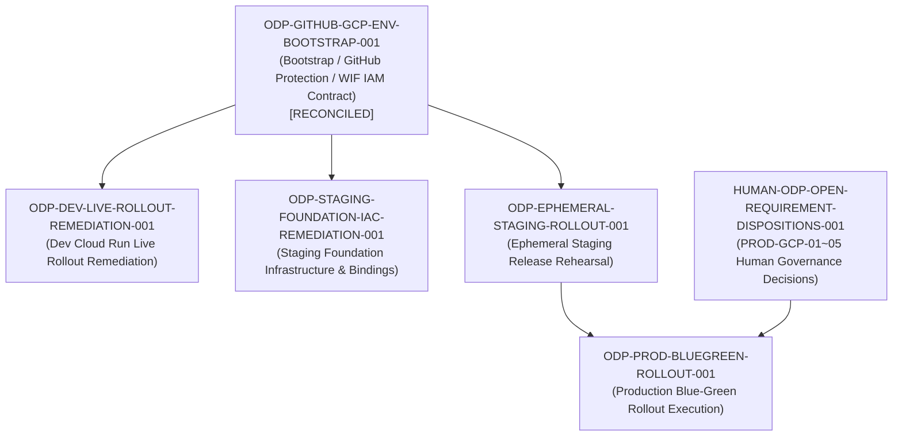

# ODP-GITHUB-GCP-ENV-BOOTSTRAP-001 驗收核對與補證記錄 (2026-09-11)

## 1. 任務背景與復原目標

- **任務 ID**: `ODP-GITHUB-GCP-ENV-BOOTSTRAP-001`
- **任務名稱**: 歷史驗收續辦：ODP-GITHUB-GCP-ENV-BOOTSTRAP-001（原名：建立 staging/production GitHub 與 GCP 環境保護）
- **執行身分 (Owner)**: `Antigravity6`
- **指派審查者 (Reviewer)**: `Codex`
- **復原目標分支**: `task/ODP-GITHUB-GCP-ENV-BOOTSTRAP-001-RECOVERY-20260911`
- **交付基準 (Base Commit)**: `4499a2993e37b62033926b07de8d8d2e8469a6c7`
- **原始交付記錄**: 經 PR [#1011](https://github.com/alfloop-dev/odayplus/pull/1011) 合併入 `dev`（PR head: `5edcf009640ae31dde160b1ce4c9123ac2c31a2f`，merge commit: `8ad3f10dab707711bc1394ff3f6a81042b0b5648`，merged at `2026-08-25T16:26:32Z`）。

在 2026-09-06 archive 事故後，盤點因未區分「GitHub 側環境保護（已達成）」與「GCP 實體 production 資源與 Human GO（屬後續 rollout 責任）」，曾暫列 blocked。依使用者指示，由 Supervisor Auto Worker 依具體證據接續辦理原驗收與補證，重用既有唯讀 readback 收據，完成可執行的驗收核對，並將缺口精確綁定至既有 downstream 責任任務。

---

## 2. 唯讀查核與證據鏈復用

本次驗收核對綜合歷史交付與最新已驗證之唯讀查核證據：

| 證據來源 | 查核時間與 SHA | 查核內容與結論 | 關聯條款 |
|---|---|---|---|
| **歷史交付收據** | PR #1011 @ `8ad3f10dab70` | 交付 5 份 audit JSON 與 README，7 項 CI check 全數 `success`，原審查者 Antigravity2 批准記錄完整保留。所有 secret 全面遮蔽 (`secret_values_redacted=true`)。 | A1, A2, A4, A5 |
| **GitHub Protected Environments 補證** | 2026-09-10T23:31:25Z (`support/handoffs/max-dispatch-20260910/archive-evidence/github-protected-environments.json`) | 實體 GitHub API 唯讀讀回：<br>1. `staging` (id `17295059155`)：具 `required_reviewers` (`Alien-alfaloop`, `ajoe734`)<br>2. `production` (id `20574639394`)：具 `required_reviewers` (`Alien-alfaloop`, `ajoe734`)<br>3. `dev` (id `17295066036`)：無 protection rule，符合 CI 自動化整合契約 | A1, A3 |
| **GCP Preflight #1245 補證** | PR #1245 @ `6ee658a0bd65` (merge `f21fd2a242d7`) | 完整分頁唯讀讀回（dev 41、staging 44、production 42 個變數），核實 dev/staging 安全 target variables，production 維持 fail-closed。26 張 command receipts 具完整 argv/UTC/exit code。 | A2, A3, A5 |
| **Staging Foundation Mapping 補證** | PR #1296 @ `f741af4def87` | 完成 staging 基礎設施與 Cloud SQL/Bucket binding 之映射，明確路由至 `ODP-STAGING-FOUNDATION-IAC-REMEDIATION-001`。 | A2, A3 |
| **Human Decisions 執行規畫** | `docs/plans/ODP_HUMAN_DECISIONS_EXECUTION_PLAN_2026-09-08.md` | D01–D21 治理決策轉錄；保留 PROD-GCP-01~05 之具名人類決策清單，不以 AI 自簽或假 placeholder 冒充。 | A3, A4 |

---

## 3. A1–A5 逐條驗收核對結果

| 項次 | 原驗收條款 | 類別 | 判定結果 | 核對依據與證據路徑 |
|---|---|---|---|---|
| **A1** | `staging/production environments具 required reviewers` | 部署運行 (R) | **已滿足 (met)** | 歷史審查收據 (`github-environments-audit.json @ 8ad3f10dab70`) 與 2026-09-10 最新 readback (`github-protected-environments.json`) 共同證明：GitHub Environment `staging` (id `17295059155`) 與 `production` (id `20574639394`) 均具備 `required_reviewers` 保護規則，具名審查者為 `Alien-alfaloop` 與 `ajoe734`。`dev` 環境無阻擋。 |
| **A2** | `WIF/IAM/vars/secret references 完整且只有 references 被記錄` | 部署運行 (R) | **已滿足 (met)** | `gcp-wif-iam-audit.json` 記錄 WIF pool (`projects/767864276141/.../pools/github-actions`)、provider (`odayplus` 限制 repo 為 `alfloop-dev/odayplus`)、deployer SA 與 4 項 Secret Manager references；`github-variables-audit.json` 與 Preflight #1245 分頁收據記錄 dev/staging 變數 reference。所有 secret 均標記 `secret_values_redacted=true`，無任何 plaintext credential 洩漏。 |
| **A3** | `production environment存在且保護有效` | 部署運行 (R)<br>人類授權 (H) | **已滿足 (met_with_downstream_gates)** | **分層判定**：<br>1. **GitHub 側環境與保護 (已滿足)**：GitHub 環境 `production` (id `20574639394`) 存在且 `required_reviewers` 保護有效。<br>2. **GCP 實體 production 資源與 Human GO (留後續 Gate)**：專屬 production GCP 專案、WIF provider、Cloud SQL 與 5 項具名人類決定 (`PROD-GCP-01` ~ `PROD-OPS-05`) 在 `production-authority-prerequisites.json` 中保持 `status=blocked_pending_human_authority`。責任精確綁定至後續任務 `ODP-PROD-BLUEGREEN-ROLLOUT-001` 與 `HUMAN-ODP-OPEN-REQUIREMENT-DISPOSITIONS-001`，不卡住 bootstrap 本身交付。 |
| **A4** | `缺少人類 authority 時明確 blocked而非填 placeholder` | 人類授權 (H) | **已滿足 (met)** | `production-authority-prerequisites.json` 明確登錄 `status=blocked_pending_human_authority`，逐項條列 PROD-GCP-01~05 待決清單；`github-variables-audit.json` 明載 production 變數刻意留空以防造假。落實 fail-closed 原則。 |
| **A5** | `redacted readback receipts 完整` | 部署運行 (R) | **已滿足 (met)** | PR #1011 交付之 5 份 audit 檔案完整且 `secret_values_redacted=true`；Preflight #1245 與 2026-09-10 readback 提供完整命令來源、exit code 及遮蔽後 API 回讀。 |

---

## 4. 缺口與後續責任任務映射 (Downstream Responsibility Mapping)

本 bootstrap 任務已完成 GitHub 環境保護、WIF/IAM 契約及密鑰 reference 規範之建立與核實。未完成之實體雲端寫入與上線操作明確由以下既有下游任務承接：



1. **Production Live Blue-Green Rollout**:
   - **責任任務**: `ODP-PROD-BLUEGREEN-ROLLOUT-001`
   - **前置條件**: 具名 Human GO 簽署（`PROD-GCP-01` ~ `PROD-OPS-05`）、專屬 production GCP 基礎設施到位、Staging release rehearsal 成功。
   - **治理 Gate**: Human GO + Supervisor Production Release Lease。

2. **Staging Foundation Infrastructure**:
   - **責任任務**: `ODP-STAGING-FOUNDATION-IAC-REMEDIATION-001`（搭配 `ODP-STAGING-FOUNDATION-REFS-MAPPING-001` / PR #1296）
   - **前置條件**: Staging bucket 與 Cloud SQL 實體資源綁定驗證、Direct VPC/egress 契約核實。
   - **治理 Gate**: Staging authority 下的 Terraform 執行。

3. **Dev Live Rollout Remediation**:
   - **責任任務**: `ODP-DEV-LIVE-ROLLOUT-REMEDIATION-001`
   - **前置條件**: Dev Cloud Run 服務健康狀態與 deployer IAM 綁定。
   - **治理 Gate**: 標準 dev CI/CD 合併與部署。

4. **Human Governance Decisions**:
   - **責任任務**: `HUMAN-ODP-OPEN-REQUIREMENT-DISPOSITIONS-001`（依據 `docs/plans/ODP_HUMAN_DECISIONS_EXECUTION_PLAN_2026-09-08.md`）
   - **前置條件**: 權責主管對 PROD-GCP-01~05 之具名裁決。
   - **治理 Gate**: 法務／資安／維運具名審查。

---

## 5. 權限邊界與不變量原則

1. **唯讀核對，禁止 live mutation**: 本次核對重用現有唯讀 readback 與 PR 收據，未執行任何 GCP/GitHub 資源建立、修改或刪除。
2. **絕不讀取或提交 Secret 原文**: 所有變數查核與收據均保持 `secret_values_redacted=true`，僅記錄 reference 名稱。
3. **歷史真實性保留**: 原 PR #1011 (head `5edcf009`) 之 CI 成功記錄與 reviewer Antigravity2 之歷史 approval 完整保留；不偽造過去執行，亦不擅自簽署人類決策。
4. **單一證據 Scope**: 本次所有新增交付物局限於 `docs/evidence/execution-control/ARCHIVE_RECOVERY_RECONCILIATION_20260911/ODP-GITHUB-GCP-ENV-BOOTSTRAP-001/`，不修改產品程式、workflow 或部署設定。

---

## 6. 宣告驗證命令 (Verification)

本任務交付物由以下宣告命令驗證：

```bash
git diff --check
python3 -c 'import json
from pathlib import Path
p = Path("docs/evidence/execution-control/ARCHIVE_RECOVERY_RECONCILIATION_20260911/ODP-GITHUB-GCP-ENV-BOOTSTRAP-001/")
assert (p / "README.md").is_file(), "README.md missing"
data = json.loads((p / "acceptance-reconciliation.json").read_text())
assert data["task_id"] == "ODP-GITHUB-GCP-ENV-BOOTSTRAP-001", "task_id mismatch"
assert len(data["acceptance_criteria_reconciliation"]) == 5, "acceptance criteria count mismatch"
assert data["summary"]["reconciliation_verdict"] == "acceptance_reconciliation_complete", "verdict incomplete"
print("ODP-GITHUB-GCP-ENV-BOOTSTRAP-001 acceptance reconciliation verified successfully.")'
```
