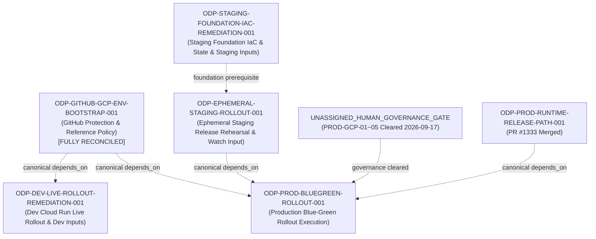

# ODP-GITHUB-GCP-ENV-BOOTSTRAP-001 驗收核對與補證記錄 (2026-09-17)

## 1. 任務背景與復原目標

- **任務 ID**: `ODP-GITHUB-GCP-ENV-BOOTSTRAP-001`
- **任務名稱**: 歷史驗收續辦：ODP-GITHUB-GCP-ENV-BOOTSTRAP-001（原名：建立 staging/production GitHub 與 GCP 環境保護）
- **執行身分 (Owner)**: `Antigravity3`
- **指派審查者 (Reviewer)**: `Claude`
- **復原目標分支**: `task/ODP-GITHUB-GCP-ENV-BOOTSTRAP-001-RECOVERY-20260911`
- **當前集成基準 (Current Base Commit)**: `307e6e7286c5ca89e72572e4462eb45a57e8888d`（已組合 `origin/dev` 最新 tip；原歷史開出 base: `4499a2993e37b62033926b07de8d8d2e8469a6c7`）
- **原始交付記錄**: 經 PR [#1011](https://github.com/alfloop-dev/odayplus/pull/1011) 合併入 `dev`（PR head: `5edcf009640ae31dde160b1ce4c9123ac2c31a2f`，merge commit: `8ad3f10dab707711bc1394ff3f6a81042b0b5648`，merged at `2026-08-25T16:26:32Z`）。

在 2026-09-06 archive 事故後，本任務進行可執行的歷史驗收核對與續辦補證。經 2026-09-17 Human/Ops 正式裁決與實測驗證，PROD-GCP-01~05 五項人類治理與雲端前置條件已全數結清，GitHub production 環境變數已由 42 補齊至 50 項（11 項 deploy scope 必填零缺漏），實體 GCP 資源（專用專案、WIF provider、4 個 SA、Cloud SQL、3 個 Secret Manager 密鑰版本、GCS state/recovery buckets）全數 readback 驗證就位。本記錄完整登載各項歷史交付、唯讀查核、2026-09-17 裁決事實與逐條 A1–A5 滿足依據。

---

## 2. 唯讀查核與證據鏈復用

本次驗收核對綜合歷史交付、唯讀查核與 2026-09-17 Human/Ops 裁決證據：

| 證據來源 | 查核時間與 SHA | 查核內容與結論 | 關聯條款 |
|---|---|---|---|
| **歷史交付收據** | PR #1011 @ `8ad3f10dab70` | 交付 5 份 audit JSON 與 README，7 項 CI check 全數 `success`，原審查者 Antigravity2 批准記錄完整保留。所有 secret 全面遮蔽 (`secret_values_redacted=true`)。 | A1, A2, A4, A5 |
| **GitHub Protected Environments 補證** | 2026-09-10T23:31:25Z (`support/handoffs/max-dispatch-20260910/archive-evidence/github-protected-environments.json`) | 實體 GitHub API 唯讀讀回（`command-receipts.json` 中 3 筆 `gh api repos/alfloop-dev/odayplus/environments/*` exit 0）：<br>1. `staging` (id `17295059155`)：具 `required_reviewers` (`Alien-alfaloop`, `ajoe734`)<br>2. `production` (id `20574639394`)：具 `required_reviewers` (`Alien-alfaloop`, `ajoe734`)<br>3. `dev` (id `17295066036`)：無 protection rule，符合 CI 自動化整合契約 | A1, A3 |
| **GCP Preflight #1245 補證** | PR #1245 @ `6ee658a0bd65` (merge `f21fd2a242d7`) | 唯讀讀回 GitHub dev/staging/production 變數，宣告引用專屬專案 `odayplus-prod-20260826` 與 WIF/SA 等；記錄各環境 auth mode 皆為 `ODP_AUTH_MODE=local`。 | A2, A3, A5 |
| **Staging Foundation Mapping 補證** | PR #1296 @ `f741af4def87` | `foundation-reference-map.json` 完成 staging 基礎設施映射至 `ODP-STAGING-FOUNDATION-IAC-REMEDIATION-001`。 | A2, A3 |
| **Human/Ops 裁決與實測 (2026-09-17)** | 2026-09-17 (`docs/evidence/runtime/ODP-GITHUB-GCP-ENV-BOOTSTRAP-001/production-authority-prerequisites.json`) | 1. **PROD-GCP-01~05 全部結清**：解除 blocked recovery disposition。<br>2. **PROD-GCP-01 (專案/區域/命名)**：專用專案 `odayplus-prod-20260826`（#365886461656）ACTIVE，region `asia-east1`；GitHub production 環境 `GCP_PROJECT_ID`／`GCP_REGION`／`GCP_AR_REPO` 均已設定。<br>3. **PROD-GCP-02 (WIF/SA)**：WIF provider `odayplus` ACTIVE；4 個 SA 實測存在（`github-deployer`、`oday-prod-runtime`、`oday-prod-scheduler`、`oday-prod-smoke-operator`）。<br>4. **PROD-GCP-03 (SQL/Secrets)**：`oday-prod-sql` POSTGRES_16 RUNNABLE；3 個 secret 版本 ENABLED（`oday-prod-database-url`、`oday-prod-auth-principal-map`、`oday-prod-web-session-secret`）。<br>5. **PROD-GCP-04 (網域/認證模式)**：`ODP_PROD_API_URL` 與 `ODP_PROD_DEPLOY_URL` 均已設定；本地認證 local auth 模式定案，OAuth client 需求依 D15 決策失效收斂。<br>6. **PROD-OPS-05 (watch/SLO/rollback)**：watch 窗口 60m 密集 + 24h 自動監控；錯誤率 > 1% 或 p95 > 2s 觸發 rollback；15 分鐘完成目標；負責人蔡尚志。<br>7. **GitHub 變數 42->50 補齊**：deploy scope 11 項必填零缺漏；Direct VPC egress (`ODP_CLOUD_RUN_VPC_EGRESS=all-traffic`) 生效，互斥之 connector 刻意未設。<br>8. **GCS Buckets 實測**：`gs://odayplus-prod-20260826-tfstate` (無 retention) 與 `gs://odayplus-prod-20260826-recovery` (retention 30d) 均配置 CMEK、versioning、PAP、UBLA 就位。 | A1, A2, A3, A4, A5 |

---

## 3. A1–A5 逐條驗收核對結果

| 項次 | 原驗收條款 | 類別 | 判定結果 | 核對依據、現有證據與判定理由 |
|---|---|---|---|---|
| **A1** | `staging/production environments具 required reviewers` | 部署運行 (R) | **已滿足 (met)** | 歷史審查收據 (`github-environments-audit.json @ 8ad3f10dab70`) 與 2026-09-10 最新 readback (`github-protected-environments.json`，API 退出碼 0) 共同證明：GitHub Environment `staging` (id `17295059155`) 與 `production` (id `20574639394`) 均具備 `required_reviewers` 保護規則，具名審查者為 `Alien-alfaloop` 與 `ajoe734`。`dev` 環境無阻擋。 |
| **A2** | `WIF/IAM/vars/secret references 完整且只有 references 被記錄` | 部署運行 (R) | **已滿足 (met)** | GitHub production environment 變數已由 42 補齊至 50，deploy scope 11 項必填零缺漏；WIF provider (projects/365886461656/.../providers/odayplus) state=ACTIVE，4 個 SA 實測存在（github-deployer、oday-prod-runtime、oday-prod-scheduler、oday-prod-smoke-operator），Cloud SQL (oday-prod-sql) state=RUNNABLE，3 個 Secret Manager 密鑰版本 ENABLED，GCS state/recovery buckets 就位。Direct VPC egress (`ODP_CLOUD_RUN_VPC_EGRESS=all-traffic`) 設定正確。所有 secret 均以名稱 reference 引用，絕不讀取或提交 plaintext。dev 與 staging 變數需求明確由 `ODP-DEV-LIVE-ROLLOUT-REMEDIATION-001` 與 `ODP-STAGING-FOUNDATION-IAC-REMEDIATION-001` 責任承接。 |
| **A3** | `production environment存在且保護有效` | 部署運行 (R)<br>人類授權 (H) | **已滿足 (met)** | GitHub 側環境 `production` (id `20574639394`) 存在且 `required_reviewers` 保護有效；2026-09-17 Human/Ops 正式裁決結清 PROD-GCP-01~05 五項人類治理與雲端前置條件。專用專案 `odayplus-prod-20260826` ACTIVE，WIF、SA、Cloud SQL、Secret Manager、網域變數與 Direct VPC 網路綁定均已設定；PROD-OPS-05 營運治理參數定案。production-authority-prerequisites.json 已更新為 `cleared_per_human_adjudication`。 |
| **A4** | `缺少人類 authority 時明確 blocked而非填 placeholder` | 人類授權 (H) | **已滿足 (met)** | 歷史交付落實 fail-closed 原則 (`status=blocked_pending_human_authority`) 且無任何 fake placeholder；2026-09-17 由權責 Human/Ops 正式完成 PROD-GCP-01~05 裁決與實測驗證，解除 blocked 狀態，流程完全符合授權與治理規範。 |
| **A5** | `redacted readback receipts 完整` | 部署運行 (R) | **已滿足 (met)** | PR #1011 交付之 5 份 audit 檔案完整且 `secret_values_redacted=true`；Preflight #1245、2026-09-10 readback 及 2026-09-17 實測提供完整命令來源及遮蔽後 API 回讀；所有 secret 引用嚴格遮蔽。 |

---

## 4. Canonical 依賴圖與下游責任映射

### 4.1 Canonical 依賴關係 (Canonical `depends_on` Snapshot & Invariant)

依據看板快照（`ai-status.json`，502,918 bytes，SHA256: `0e92945875dacd0e5b3cb158228bce6cfd4085dec93cda5f9b60c85867b19d02`，observed at `2026-09-17T06:00:00Z`），本次驗收核對**不變更任何 canonical 依賴關係**（全數為 `unchanged`）：

| 任務 ID | Canonical `depends_on` (核對前) | Canonical `depends_on` (核對後) | 變更狀態 | 關聯說明 |
|---|---|---|---|---|
| `ODP-GITHUB-GCP-ENV-BOOTSTRAP-001` | `[]` | `[]` | unchanged | 本任務為基礎環境保護定義任務 |
| `ODP-PROD-BLUEGREEN-ROLLOUT-001` | `["ODP-EPHEMERAL-STAGING-ROLLOUT-001", "ODP-GITHUB-GCP-ENV-BOOTSTRAP-001", "ODP-PROD-RUNTIME-RELEASE-PATH-001"]` | `["ODP-EPHEMERAL-STAGING-ROLLOUT-001", "ODP-GITHUB-GCP-ENV-BOOTSTRAP-001", "ODP-PROD-RUNTIME-RELEASE-PATH-001"]` | unchanged | Production 上線直接依賴本 bootstrap、staging rollout 與 prod release path |
| `ODP-DEV-LIVE-ROLLOUT-REMEDIATION-001` | `["ODP-RELEASE-MANIFEST-LIVE-ARTIFACT-RECONCILE-001", "ODP-RUNTIME-RELEASE-SINGLE-PATH-001", "ODP-GITHUB-GCP-ENV-BOOTSTRAP-001", ...]` (共 10 項) | `["ODP-RELEASE-MANIFEST-LIVE-ARTIFACT-RECONCILE-001", "ODP-RUNTIME-RELEASE-SINGLE-PATH-001", "ODP-GITHUB-GCP-ENV-BOOTSTRAP-001", ...]` (共 10 項) | unchanged | Dev live rollout 直接依賴本 bootstrap |
| `ODP-STAGING-FOUNDATION-IAC-REMEDIATION-001` | `[]` | `[]` | unchanged | Staging foundation 為獨立根任務，無上游依賴 |
| `ODP-EPHEMERAL-STAGING-ROLLOUT-001` | `["ODP-EPHEMERAL-STAGING-IAC-001", "ODP-DEV-ROLLOUT-001", "ODP-DEV-LIVE-ROLLOUT-REMEDIATION-001", ...]` (共 5 項) | `["ODP-EPHEMERAL-STAGING-IAC-001", "ODP-DEV-ROLLOUT-001", "ODP-DEV-LIVE-ROLLOUT-REMEDIATION-001", ...]` (共 5 項) | unchanged | Ephemeral staging 經 dev remediation 傳遞依賴本 bootstrap |

**子圖範圍與全域閉包說明 (Task-Scoped Subgraph & Complete Downstream Closure)**:
- **分析範圍說明**: 本節之相依子圖分析（5 個節點、4 條有向邊）為針對本任務直接與相鄰下游執行路徑之 Task-Scoped 局部驗證，用以確立拓撲排序與局部無環性質。
- **全域下游閉包 (Full Canonical Downstream Closure)**: 看板 `ai-status.json` 中完整傳遞下游任務閉包包含 6 個任務：
  1. `ODP-DEV-LIVE-ROLLOUT-REMEDIATION-001`
  2. `ODP-EPHEMERAL-STAGING-ROLLOUT-001`
  3. `ODP-NFR-RUNTIME-EVIDENCE-001`
  4. `ODP-POSTDEPLOY-WATCH-CLOSEOUT-001`
  5. `ODP-PROD-BLUEGREEN-ROLLOUT-001`
  6. `ODP-STRUCTURAL-REMEDIATION-CLOSEOUT-001`
- **局部子圖無環驗證**:
  - `ODP-GITHUB-GCP-ENV-BOOTSTRAP-001` -> `ODP-DEV-LIVE-ROLLOUT-REMEDIATION-001`（直接依賴邊）
  - `ODP-GITHUB-GCP-ENV-BOOTSTRAP-001` -> `ODP-PROD-BLUEGREEN-ROLLOUT-001`（直接依賴邊）
  - `ODP-DEV-LIVE-ROLLOUT-REMEDIATION-001` -> `ODP-EPHEMERAL-STAGING-ROLLOUT-001`（傳遞依賴邊）
  - `ODP-EPHEMERAL-STAGING-ROLLOUT-001` -> `ODP-PROD-BLUEGREEN-ROLLOUT-001`（傳遞依賴邊）
  - `ODP-GITHUB-GCP-ENV-BOOTSTRAP-001` 之 `depends_on: []`（入度為 0），局部子圖無任何回指邊，子圖拓撲排序無環（`cycle_detected=false`，`verified_dag=true`）。
  - 子圖排序序列：`ODP-GITHUB-GCP-ENV-BOOTSTRAP-001` -> `ODP-STAGING-FOUNDATION-IAC-REMEDIATION-001` -> `ODP-DEV-LIVE-ROLLOUT-REMEDIATION-001` -> `ODP-EPHEMERAL-STAGING-ROLLOUT-001` -> `ODP-PROD-BLUEGREEN-ROLLOUT-001`。

### 4.2 下游責任任務映射 (Downstream Scope & Responsibility Mapping)



1. **Production Live Blue-Green Rollout Execution**:
   - **責任任務**: `ODP-PROD-BLUEGREEN-ROLLOUT-001`
   - **前置條件**:
     - `ODP-EPHEMERAL-STAGING-ROLLOUT-001` 完成。
     - `ODP-PROD-RUNTIME-RELEASE-PATH-001` 完成（PR #1333 已合併）。
     - PROD-GCP-01~05 人類治理與雲端前置裁決已於 2026-09-17 全部結清。
     - 下一個真實前置：透過 terraform apply 於 `odayplus-prod-20260826-tfstate` 上建立 `oday-prod-runtime` VPC（state bucket 已就位）。
     - 0% green smoke 驗證與受控 100% 流量切換。
   - **治理 Gate**: Human GO (已完成裁決) + Supervisor Production Release Lease。

2. **Staging Foundation Infrastructure, State & Staging Inputs**:
   - **責任任務**: `ODP-STAGING-FOUNDATION-IAC-REMEDIATION-001`（搭配 `ODP-STAGING-FOUNDATION-REFS-MAPPING-001` / PR #1296）
   - **前置條件**: 補齊 6 項 staging foundation 必要變數，驗證 staging bucket 與 Cloud SQL 實體資源綁定、Direct VPC/egress 契約。
   - **治理 Gate**: Staging authority 下的 Terraform 執行。

3. **Dev Live Rollout Remediation & Dev Inputs**:
   - **責任任務**: `ODP-DEV-LIVE-ROLLOUT-REMEDIATION-001`
   - **前置條件**: 補齊 2 項缺漏 dev 必要變數，驗證權威 manifest、Dev Cloud Run 服務健康狀態與 deployer IAM 綁定。
   - **治理 Gate**: 標準 dev CI/CD 合併與部署。

4. **Ephemeral Staging Watch Closeout Input**:
   - **責任任務**: `ODP-EPHEMERAL-STAGING-ROLLOUT-001`
   - **前置條件**: 補齊 `REM-STAGING-VAR-ODP_PRODUCTION_WATCH_CLOSEOUT_URI` 並完成 ephemeral staging 全套 release rehearsal 驗證。
   - **治理 Gate**: Staging release rehearsal 執行。

5. **Production Human Governance Decisions (PROD-GCP-01~05)**:
   - **裁決狀態**: **已於 2026-09-17 由 Human/Ops 正式結清**。
   - **裁決內容**: PROD-GCP-01（專案/區域/命名）、PROD-GCP-02（WIF/SA）、PROD-GCP-03（Cloud SQL/Secrets）、PROD-GCP-04（網域/local 認證模式）、PROD-OPS-05（watch window/SLO/rollback owner 蔡尚志）全數定案。

---

## 5. 權限邊界與不變量原則

1. **唯讀核對，嚴格遵守授權邊界**: 本次核對重用現有唯讀 readback、PR 收據與 2026-09-17 Human/Ops 裁決，未越權變更雲端資源。
2. **絕不讀取或提交 Secret 原文**: 所有變數查核與收據均保持 `secret_values_redacted=true`，僅記錄 reference 名稱。
3. **歷史真實性保留**: 原 PR #1011 (head `5edcf009`) 之 CI 成功記錄與 reviewer Antigravity2 之歷史 approval 完整保留。
4. **單一證據 Scope**: 本次修改限定於本任務所屬之證據與運行審查目錄，不修改產品程式、workflow 或部署設定。

---

## 6. 宣告驗證命令 (Verification)

本任務交付物由以下宣告命令驗證：

```bash
git diff --check 307e6e7286c5ca89e72572e4462eb45a57e8888d HEAD -- docs/evidence/execution-control/ARCHIVE_RECOVERY_RECONCILIATION_20260911/ODP-GITHUB-GCP-ENV-BOOTSTRAP-001/ docs/evidence/runtime/ODP-GITHUB-GCP-ENV-BOOTSTRAP-001/
python3 -c "import json; data=json.load(open('docs/evidence/execution-control/ARCHIVE_RECOVERY_RECONCILIATION_20260911/ODP-GITHUB-GCP-ENV-BOOTSTRAP-001/acceptance-reconciliation.json')); assert data['summary']['reconciliation_verdict'] == 'acceptance_fully_reconciled'; assert data['summary']['criteria_total'] == 5; assert data['summary']['criteria_met'] == 5; assert data['summary']['criteria_partially_met'] == 0; print('ODP-GITHUB-GCP-ENV-BOOTSTRAP-001 acceptance reconciliation verified successfully.')"
python3 -c "import json; data=json.load(open('docs/evidence/runtime/ODP-GITHUB-GCP-ENV-BOOTSTRAP-001/production-authority-prerequisites.json')); assert data['status'] == 'cleared_per_human_adjudication'; assert len(data['human_authority_checklist']) == 5; assert all(item['status'] in ('completed', 'completed_scope_narrowed', 'completed_by_human_adjudication') for item in data['human_authority_checklist']); print('production-authority-prerequisites.json verified successfully.')"
```
