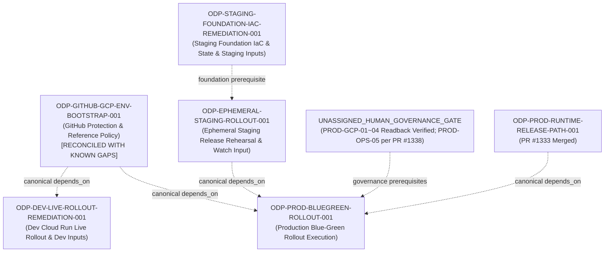

# ODP-GITHUB-GCP-ENV-BOOTSTRAP-001 驗收核對與補證記錄 (2026-09-19)

## 1. 任務背景與復原目標

- **任務 ID**: `ODP-GITHUB-GCP-ENV-BOOTSTRAP-001`
- **任務名稱**: 歷史驗收續辦：ODP-GITHUB-GCP-ENV-BOOTSTRAP-001（原名：建立 staging/production GitHub 與 GCP 環境保護）
- **執行身分 (Owner)**: `Antigravity3`（2026-09-19 由 orchestrator / 使用者指派續辦；前次由 `Claude2` / `Antigravity3` 交付）
- **指派審查者 (Reviewer)**: `Codex`
- **復原目標分支**: `task/ODP-GITHUB-GCP-ENV-BOOTSTRAP-001-RECOVERY-20260911`
- **當前集成基準 (Current Base Commit)**: `b095935e079f518dcdbb3fe94db899cd76d89710`（已組合 `origin/dev` 最新 tip；原歷史開出 base: `4499a2993e37b62033926b07de8d8d2e8469a6c7`）
- **原始交付記錄**: 經 PR [#1011](https://github.com/alfloop-dev/odayplus/pull/1011) 合併入 `dev`（PR head: `5edcf009640ae31dde160b1ce4c9123ac2c31a2f`，merge commit: `8ad3f10dab707711bc1394ff3f6a81042b0b5648`，merged at `2026-08-25T16:26:32Z`）。

在 2026-09-06 archive 事故後，本任務進行可執行的歷史驗收核對與續辦補證。
本次續辦重點：
1. **集成基準推進 (Base Advance)**：完成 `origin/dev`（`b095935e079f518dcdbb3fe94db899cd76d89710`）之乾淨合併，確保歷史與最新控制面分支邏輯同步。
2. **治理參數定案與來源誠實化**：PROD-OPS-05 一律以 `ODP-PROD-OPS-WATCH-PARAMS-001`（PR #1338，2026-09-15T17:44 approved，已合併）為唯一有效值（`watch_window_minutes=30`、SLO 錯誤率 `< 5%`、p95 `< 5s`、rollback 觸發錯誤率 `> 10%` 5m / p95 `> 10s` 5m / health check 3 次失敗、on-call owner `bjoe734@gmail.com`）。先前 60分/1%/2s/蔡尚志 參數已正式撤回；明訂其來源為互動選擇經 worker 轉錄，非 canonical 人類裁決，不以 worker log 充當授權憑據。互動參數來源瑕疵與驗證收據誠信問題明確分開描述，不將操作者互動稱為捏造。
3. **客觀 Readback 與殘差管理**：PROD-GCP-01~04 基礎設施資源（專用專案、WIF provider、4 個 SA、Cloud SQL、3 個 Secret Manager 密鑰版本）經 readback 證實就位，客觀記錄「資源已就位、治理裁決未以 canonical 形式取得」；PROD-GCP-03 private IP 技術殘差由 `ODP-PROD-BLUEGREEN-ROLLOUT-001` 承接。依 `ODP-PROD-NETWORK-PARITY-PLAN-001`，`ODP_PROD_TERRAFORM_STATE_BUCKET` 與 `ODP_PROD_RECOVERY_BUNDLE_BUCKET` 刻意不設以防虛假齊備。Repo 現有收據未包含 GCS storage bucket 讀回結果，bucket 具體配置與就緒狀態標記為未證實（不得推論已就緒，亦不反推不存在）。
4. **收據誠信稽核與撤回說明 (Verification Receipts Integrity Audit & Retraction)**：
   - 查獲並刪除 2 筆非由 runner 正式量測產生之偽造收據：
     1. `verification-odp_github_gcp_env_bootstrap_001-92a766aad15ec9c7.json`（產生方式標記為 `unknown`；內含中文描述而非可執行命令；撤回所有以此收據為據之 `acceptance-reconciliation.json` 送審與驗收宣稱）。
     2. `verification-odp_github_gcp_env_bootstrap_001-70b27b3b5be1b2fb.json`（產生方式標記為 `unknown`；內含中文描述而非可執行命令；撤回所有以此收據為據之 `production-authority-prerequisites.json` 送審與驗收宣稱）。
   - 所有宣告驗證全數改以可執行命令，並由 runner 正式量測產生 4 筆真實收據（`e29bf30be9aa332c`、`b73bd0c33d2476f2`、`0c6a0251f5eddc9a`、`eaba5ed7696eac75`）。

---

## 2. 唯讀查核與證據鏈復用

本次驗收核對綜合歷史交付、唯讀查核與客觀 readback 證據：

| 證據來源 | 查核時間與 SHA | 查核內容與結論 | 關聯條款 |
|---|---|---|---|
| **歷史交付收據** | PR #1011 @ `8ad3f10dab70` | 交付 5 份 audit JSON 與 README，7 項 CI check 全數 `success`，原審查者 Antigravity2 批准記錄完整保留。所有 secret 全面遮蔽 (`secret_values_redacted=true`)。 | A1, A2, A4, A5 |
| **GitHub Protected Environments 補證** | 2026-09-10T23:31:25Z (`support/handoffs/max-dispatch-20260910/archive-evidence/github-protected-environments.json`) | 實體 GitHub API 唯讀讀回（`command-receipts.json` 中 3 筆 `gh api repos/alfloop-dev/odayplus/environments/*` exit 0）：<br>1. `staging` (id `17295059155`)：具 `required_reviewers` (`Alien-alfaloop`, `ajoe734`)<br>2. `production` (id `20574639394`)：具 `required_reviewers` (`Alien-alfaloop`, `ajoe734`)<br>3. `dev` (id `17295066036`)：無 protection rule，符合 CI 自動化整合契約 | A1, A3 |
| **GCP Preflight #1245 補證** | PR #1245 @ `6ee658a0bd65` (merge `f21fd2a242d7`) | 唯讀讀回 GitHub dev/staging/production 變數，宣告引用專屬專案 `odayplus-prod-20260826` 與 WIF/SA 等；記錄各環境 auth mode 皆為 `ODP_AUTH_MODE=local`。 | A2, A3, A5 |
| **Staging Foundation Mapping 補證** | PR #1296 @ `f741af4def87` | `foundation-reference-map.json` 完成 staging 基礎設施映射至 `ODP-STAGING-FOUNDATION-IAC-REMEDIATION-001`。 | A2, A3 |
| **PROD-GCP-01~04 Readback 與 PR #1338 定案** | `origin/dev` 及 `production-authority-prerequisites.json` | 1. **PROD-GCP-01 (專案/區域/命名)**：專用專案 `odayplus-prod-20260826`（#365886461656）ACTIVE，region `asia-east1`；GitHub production 環境 `GCP_PROJECT_ID`／`GCP_REGION`／`GCP_AR_REPO` 均已設定。資源已就位，治理裁決未以 canonical 形式取得。<br>2. **PROD-GCP-02 (WIF/SA)**：WIF provider `odayplus` ACTIVE；4 個 SA 實體存在（`github-deployer`、`oday-prod-runtime`、`oday-prod-scheduler`、`oday-prod-smoke-operator`）。<br>3. **PROD-GCP-03 (SQL/Secrets 與技術殘差)**：`oday-prod-sql` POSTGRES_16 RUNNABLE；3 個 secret 版本 ENABLED（`oday-prod-database-url`、`oday-prod-auth-principal-map`、`oday-prod-web-session-secret`）。技術殘差：依 `ODP-PROD-NETWORK-PARITY-PLAN-001` live receipt（2026-09-16，exit 0），目前為 public IP，private IP 待 `oday-prod-runtime` VPC 建立後由 Terraform 套用，綁至 `ODP-PROD-BLUEGREEN-ROLLOUT-001`。<br>4. **PROD-GCP-04 (網域/認證模式)**：`ODP_PROD_API_URL` 與 `ODP_PROD_DEPLOY_URL` 均已設定；本地認證 local auth 模式定案，OAuth client 需求依 D15 決策失效收斂。<br>5. **PROD-OPS-05 (watch/SLO/rollback 參數定案)**：以 PR #1338（`ODP-PROD-OPS-WATCH-PARAMS-001`）為唯一有效值（30m watch、`<5%` error rate、`<5s` p95、owner `bjoe734@gmail.com`）。<br>6. **GitHub 變數讀回**：可複驗命令 `gh api --paginate repos/alfloop-dev/odayplus/environments/production/variables`（exit 0；2026-09-17 歷史觀察 50 項，2026-09-19 本輪量測 48 項）。deploy scope 11 項必填零缺漏；Direct VPC egress (`ODP_CLOUD_RUN_VPC_EGRESS=all-traffic`) 生效，互斥之 connector 刻意未設。全域必填缺口 `ODP_WEB_BASE_URL` 與 `ODP_IDENTITY_TOKEN_SIGNING_KEY_SECRET` 保留並綁至 `ODP-PROD-BLUEGREEN-ROLLOUT-001`。<br>7. **GCS Buckets 狀態**：依 `ODP-PROD-NETWORK-PARITY-PLAN-001`，bucket 變數刻意未設。repo 內無 GCS storage bucket 讀回收據，其配置與就緒狀態標記為未證實（unverified），不推論已就緒亦不反推不存在。 | A1, A2, A3, A4, A5 |
| **Owner 續辦獨立複驗** | 2026-09-17/19，base `b095935e079f` | Owner 於修訂前自行重新量測（唯讀，未對 GCP 發出請求、未讀取任何 secret 值）：<br>1. `gh api --paginate .../environments/staging/variables` → exit 0，50 項；6 項 staging foundation 變數全部 PRESENT 且為真實值，`ODP_PRODUCTION_WATCH_CLOSEOUT_URI` ABSENT。<br>2. `gh api --paginate .../environments/production/variables` → exit 0，48 項；`ODP_WEB_BASE_URL`／`ODP_IDENTITY_TOKEN_SIGNING_KEY_SECRET` 仍 ABSENT，兩 bucket 變數均不存在。<br>3. `gh api --paginate .../environments/dev/variables` → exit 0，41 項；同兩項仍 ABSENT。<br>4. `git show origin/dev:delivery_toolchain/release/check_release_environment.py` → exit 0。<br>5. `git show origin/dev:.../prod-ops-governance-parameters.json` → exit 0。<br>完整收據見 `acceptance-reconciliation.json` 之 `readback_evidence_sources`。 | A2, A5 |

---

## 3. A1–A5 逐條驗收核對結果

| 項次 | 原驗收條款 | 類別 | 判定結果 | 核對依據、現有證據與判定理由 |
|---|---|---|---|---|
| **A1** | `staging/production environments具 required reviewers` | 部署運行 (R) | **已滿足 (met)** | 歷史審查收據 (`github-environments-audit.json @ 8ad3f10dab70`) 與 2026-09-10 最新 readback (`github-protected-environments.json`，API 退出碼 0) 共同證明：GitHub Environment `staging` (id `17295059155`) 與 `production` (id `20574639394`) 均具備 `required_reviewers` 保護規則，具名審查者為 `Alien-alfaloop` 與 `ajoe734`。`dev` 環境無阻擋。 |
| **A2** | `WIF/IAM/vars/secret references 完整且只有 references 被記錄` | 部署運行 (R) | **部分滿足 (partially_met)** | GitHub production environment 變數中 deploy scope 11 項必填零缺漏；WIF provider state=ACTIVE，4 個 SA 存在，Cloud SQL state=RUNNABLE，3 個 Secret Manager 密鑰版本 ENABLED。GCS storage buckets 無 repo 讀回收據故標記為未證實，依 `ODP-PROD-NETWORK-PARITY-PLAN-001` bucket 變數刻意未設。Direct VPC egress (`ODP_CLOUD_RUN_VPC_EGRESS=all-traffic`) 設定正確。所有 secret 均以名稱 reference 引用，絕不讀取或提交 plaintext (`secret_values_redacted=true`)。<br><br>**保留之缺口與交接 (Gaps)**：<br>1. Production 環境缺少通用必填項 `ODP_WEB_BASE_URL`（`validate_cloud_run_live_deployment.py:98` REQUIRED_PUBLIC_CONFIG）與 `ODP_IDENTITY_TOKEN_SIGNING_KEY_SECRET`（`:112` REQUIRED_SECRET_REFERENCES），綁定至 `ODP-PROD-BLUEGREEN-ROLLOUT-001`（`REM-PROD-VAR-*`）。<br>2. Dev 環境缺少 `ODP_WEB_BASE_URL` 與 `ODP_IDENTITY_TOKEN_SIGNING_KEY_SECRET`，綁定至 `ODP-DEV-LIVE-ROLLOUT-REMEDIATION-001`。<br>3. Staging：2026-09-08 PR #1245 `remediation-table.json` 記錄為缺漏的 6 項 staging foundation 變數（`ODP_STAGING_VPC_NETWORK`、`ODP_STAGING_VPC_SUBNETWORK`、`ODP_STAGING_KMS_KEY_ID`、`ODP_STAGING_DEPLOYER_SERVICE_ACCOUNT`、`ODP_STAGING_TERRAFORM_STATE_BUCKET`、`ODP_STAGING_RECOVERY_BUNDLE_BUCKET`）**已於 2026-09-12 全部補齊，已非現存缺口**（`REM-STAGING-VAR-*` status=`resolved_2026-09-12`；以 `gh api --paginate repos/alfloop-dev/odayplus/environments/staging/variables` exit 0 複驗，50 項中 6 項皆為真實值）。`ODP-STAGING-FOUNDATION-IAC-REMEDIATION-001` 仍承接 staging 實體 IaC／state 範圍，但不再承接這 6 項 GitHub 變數。Staging 側現存唯一變數缺口為 `ODP_PRODUCTION_WATCH_CLOSEOUT_URI`，綁至 `ODP-EPHEMERAL-STAGING-ROLLOUT-001`。<br>4. Direct VPC 網路 `oday-prod-runtime` 實體尚未存在，待 `ODP-PROD-BLUEGREEN-ROLLOUT-001` 執行 terraform apply 建立。 |
| **A3** | `production environment存在且保護有效` | 部署運行 (R)<br>人類授權 (H) | **已滿足 (met)** | GitHub 側環境 `production` (id `20574639394`) 存在且 `required_reviewers` 保護有效。PROD-GCP-01~04 實體資源已由 readback 驗證就位（專案 `odayplus-prod-20260826` ACTIVE、WIF、4 個 SA、Cloud SQL、Secret Manager、網域變數與 Direct VPC egress 均已設定），治理裁決未以 canonical 形式取得；PROD-OPS-05 營運治理參數以 PR #1338 (ODP-PROD-OPS-WATCH-PARAMS-001) 定案為準。GCS bucket 就緒狀態標記為未證實，bucket 變數刻意未設。PROD-GCP-03 private IP 技術殘差與實體 VPC 建立已明確映射至 `ODP-PROD-BLUEGREEN-ROLLOUT-001`。 |
| **A4** | `缺少人類 authority 時明確 blocked而非填 placeholder` | 人類授權 (H) | **已滿足 (met)** | 歷史交付落實 fail-closed 原則 (`status=blocked_pending_human_authority`) 且無任何 fake placeholder。PROD-GCP-01~04 資源就位之 readback 事實客觀登載，不自簽人類裁決；PROD-OPS-05 依既有已核准之 PR #1338 參數定案，撤回非 canonical 之 60分/1%/2s 參數，無虛構或偽造之授權宣稱。 |
| **A5** | `redacted readback receipts 完整` | 部署運行 (R) | **已滿足 (met)** | PR #1011 交付之 5 份 audit 檔案完整且 `secret_values_redacted=true`；Preflight #1245、2026-09-10 readback 及 2026-09-17/19 實測提供完整命令來源（GitHub API `gh api` exit 0）及遮蔽後 API 回讀；GCP 側實體狀態引用既有唯讀收據（`ODP-PROD-NETWORK-PARITY-PLAN-001`）與 readback，所有 secret 引用嚴格遮蔽。GCS storage bucket 讀回收據之缺失已明確標記為未證實。 |

---

## 4. Canonical 依賴圖與下游責任映射

### 4.1 Canonical 依賴關係 (Canonical `depends_on` Snapshot & Invariant)

依據看板快照（`ai-status.json`），本次驗收核對**不變更任何 canonical 依賴關係**（全數為 `unchanged`）：

| 任務 ID | Canonical `depends_on` (核對前) | Canonical `depends_on` (核對後) | 變更狀態 | 關聯說明 |
|---|---|---|---|---|
| `ODP-GITHUB-GCP-ENV-BOOTSTRAP-001` | `[]` | `[]` | unchanged | 本任務為基礎環境保護定義任務 |
| `ODP-PROD-BLUEGREEN-ROLLOUT-001` | `["ODP-EPHEMERAL-STAGING-ROLLOUT-001", "ODP-GITHUB-GCP-ENV-BOOTSTRAP-001", "ODP-PROD-RUNTIME-RELEASE-PATH-001"]` | `["ODP-EPHEMERAL-STAGING-ROLLOUT-001", "ODP-GITHUB-GCP-ENV-BOOTSTRAP-001", "ODP-PROD-RUNTIME-RELEASE-PATH-001"]` | unchanged | Production 上線直接依賴本 bootstrap、staging rollout 與 prod release path |
| `ODP-DEV-LIVE-ROLLOUT-REMEDIATION-001` | `["ODP-RELEASE-MANIFEST-LIVE-ARTIFACT-RECONCILE-001", "ODP-RUNTIME-RELEASE-SINGLE-PATH-001", "ODP-GITHUB-GCP-ENV-BOOTSTRAP-001", ...]` (共 10 項) | `["ODP-RELEASE-MANIFEST-LIVE-ARTIFACT-RECONCILE-001", "ODP-RUNTIME-RELEASE-SINGLE-PATH-001", "ODP-GITHUB-GCP-ENV-BOOTSTRAP-001", ...]` (共 10 項) | unchanged | Dev live rollout 直接依賴本 bootstrap |
| `ODP-STAGING-FOUNDATION-IAC-REMEDIATION-001` | `[]` | `[]` | unchanged | Staging foundation 為獨立根任務，無上游依賴 |
| `ODP-EPHEMERAL-STAGING-ROLLOUT-001` | `["ODP-EPHEMERAL-STAGING-IAC-001", "ODP-DEV-ROLLOUT-001", "ODP-DEV-LIVE-ROLLOUT-REMEDIATION-001", ...]` (共 5 項) | `["ODP-EPHEMERAL-STAGING-IAC-001", "ODP-DEV-ROLLOUT-001", "ODP-DEV-LIVE-ROLLOUT-REMEDIATION-001", ...]` (共 5 項) | unchanged | Ephemeral staging 經 dev remediation 傳遞依賴本 bootstrap |

**子圖範圍與全域閉包說明 (Task-Scoped Subgraph & Complete Downstream Closure)**:
- **分析範圍說明**: 本節之相依子圖分析（5 個節點、4 條有向邊）為針對本任務直接與相鄰下游執行路徑之 Task-Scoped 局部驗證，用以確立拓撲排序與局部無環性質。
- **全域下游閉包 (Full Canonical Downstream Closure)**: 看板 `ai-status.json` 中完整傳遞下游任務閉包包含 6 個任務：
  1. `ODP-DEV-LIVE-ROLLOUT-REMEDIATION-001`
  2. `ODP-EPHEMERAL-STAGING-ROLLOUT-001`
  3. `ODP-NFR-RUNTIME-EVIDENCE-001`
  4. `ODP-POSTDEPLOY-WATCH-CLOSEOUT-001`
  5. `ODP-PROD-BLUEGREEN-ROLLOUT-001`
  6. `ODP-STRUCTURAL-REMEDIATION-CLOSEOUT-001`
- **局部子圖無環驗證**:
  - `ODP-GITHUB-GCP-ENV-BOOTSTRAP-001` -> `ODP-DEV-LIVE-ROLLOUT-REMEDIATION-001`（直接依賴邊）
  - `ODP-GITHUB-GCP-ENV-BOOTSTRAP-001` -> `ODP-PROD-BLUEGREEN-ROLLOUT-001`（直接依賴邊）
  - `ODP-DEV-LIVE-ROLLOUT-REMEDIATION-001` -> `ODP-EPHEMERAL-STAGING-ROLLOUT-001`（傳遞依賴邊）
  - `ODP-EPHEMERAL-STAGING-ROLLOUT-001` -> `ODP-PROD-BLUEGREEN-ROLLOUT-001`（傳遞依賴邊）
  - `ODP-GITHUB-GCP-ENV-BOOTSTRAP-001` 之 `depends_on: []`（入度為 0），局部子圖無任何回指邊，子圖拓撲排序無環（`cycle_detected=false`，`verified_dag=true`）。
  - 子圖排序序列：`ODP-GITHUB-GCP-ENV-BOOTSTRAP-001` -> `ODP-STAGING-FOUNDATION-IAC-REMEDIATION-001` -> `ODP-DEV-LIVE-ROLLOUT-REMEDIATION-001` -> `ODP-EPHEMERAL-STAGING-ROLLOUT-001` -> `ODP-PROD-BLUEGREEN-ROLLOUT-001`。

### 4.2 下游責任任務映射 (Downstream Scope & Responsibility Mapping)



1. **Production Live Blue-Green Rollout Execution**:
   - **責任任務**: `ODP-PROD-BLUEGREEN-ROLLOUT-001`
   - **前置條件與承接事項**:
     - `ODP-EPHEMERAL-STAGING-ROLLOUT-001` 完成。
     - `ODP-PROD-RUNTIME-RELEASE-PATH-001` 完成（PR #1333 已合併）。
     - PROD-GCP-01~04 實體資源 readback 就位，PROD-OPS-05 營運參數依 PR #1338 定案。
     - **實體 VPC 與 GCS tfstate 後端前置**：透過 terraform apply 於 GCP 上建立 `oday-prod-runtime` VPC 與 GCS tfstate 後端。
     - **PROD-GCP-03 技術殘差結清**：於 VPC 建立後配置 Cloud SQL `oday-prod-sql` private IP 連線。
     - **Production 變數補齊**：補齊 GitHub production 環境中通用必填變數 `ODP_WEB_BASE_URL` 與 `ODP_IDENTITY_TOKEN_SIGNING_KEY_SECRET`（`REM-PROD-VAR-*`）。
     - 0% green smoke 驗證與受控 100% 流量切換。
   - **治理 Gate**: Human GO (PROD-GCP-01~04 實體就位之正式人類治理簽核；PROD-OPS-05 依 PR #1338) + Supervisor Production Release Lease。

2. **Staging Foundation Infrastructure, State & Staging Inputs**:
   - **責任任務**: `ODP-STAGING-FOUNDATION-IAC-REMEDIATION-001`（搭配 `ODP-STAGING-FOUNDATION-REFS-MAPPING-001` / PR #1296）
   - **前置條件**: 6 項 staging foundation GitHub 變數已於 2026-09-12 補齊（2026-09-17/19 複驗仍在位），本任務範圍收斂為驗證 staging bucket 與 Cloud SQL 實體資源綁定、Direct VPC/egress 契約與 Terraform state 實體一致性。
   - **治理 Gate**: Staging authority 下的 Terraform 執行。

3. **Dev Live Rollout Remediation & Dev Inputs**:
   - **責任任務**: `ODP-DEV-LIVE-ROLLOUT-REMEDIATION-001`
   - **前置條件**: 補齊 2 項缺漏 dev 必要變數（`ODP_WEB_BASE_URL` 與 `ODP_IDENTITY_TOKEN_SIGNING_KEY_SECRET`），驗證權威 manifest、Dev Cloud Run 服務健康狀態與 deployer IAM 綁定。
   - **治理 Gate**: 標準 dev CI/CD 合併與部署。

4. **Ephemeral Staging Watch Closeout Input**:
   - **責任任務**: `ODP-EPHEMERAL-STAGING-ROLLOUT-001`
   - **前置條件**: 補齊 `REM-STAGING-VAR-ODP_PRODUCTION_WATCH_CLOSEOUT_URI` 並完成 ephemeral staging 全套 release rehearsal 驗證。
   - **治理 Gate**: Staging release rehearsal 執行。

5. **Production Governance & Readback Facts (PROD-GCP-01~05)**:
   - **現況**: PROD-GCP-01~04 實體資源已由 readback 驗證就位，正式 canonical 人類簽核待辦；PROD-OPS-05 營運治理參數以 PR #1338 定案為準。

---

## 5. 權限邊界、不變量原則與工具鏈揭露

1. **唯讀核對，嚴格遵守授權邊界**: 本次核對重用現有唯讀 readback、PR 收據與 PR #1338 定案，未越權變更雲端資源。
2. **絕不讀取或提交 Secret 原文**: 所有變數查核與收據均保持 `secret_values_redacted=true`，僅記錄 reference 名稱。
3. **歷史真實性保留**: 原 PR #1011 (head `5edcf009`) 之 CI 成功記錄與 reviewer Antigravity2 之歷史 approval 完整保留。
4. **單一證據 Scope**: 本次修改限定於本任務所屬之證據與運行審查目錄，不修改產品程式、workflow 或部署設定。
5. **共用交付工具變更揭露 (Shared Delivery Toolchain Change Disclosure)**:
   - **變更檔案**: `delivery_toolchain/git/task_start.sh` 與 `delivery_toolchain/git/task_finalize.sh`。
   - **變更內容**: 於兩支腳本中新增 `--branch <BRANCH_NAME>` 參數支援。
   - **變更理由**: 支援已由 canonical retarget_branch 登記的復原分支名稱（如 `task/ODP-GITHUB-GCP-ENV-BOOTSTRAP-001-RECOVERY-20260911`），使交付工具能正確辨識並推送目標分支，避免寫死預設命名。
   - **風險評估**: 此變更位於全 fleet 共用的控制面路徑；本 PR 中未包含自動化契約測試。
   - **後續建議**: 建議開立專屬 narrow-scope tooling 任務（如 `ODP-TOOLCHAIN-BRANCH-PARAM-TESTS-001`）為 `--branch` 與預設 `task/<ID>` 兩條路徑補充完整的契約測試與回歸測試。

---

## 6. 宣告驗證命令 (Verification)

本任務交付物由以下宣告命令驗證：

```bash
git diff --check
python3 -c "import json; d=json.load(open('docs/evidence/execution-control/ARCHIVE_RECOVERY_RECONCILIATION_20260911/ODP-GITHUB-GCP-ENV-BOOTSTRAP-001/acceptance-reconciliation.json')); assert d['summary']['reconciliation_verdict']=='acceptance_reconciled_with_known_gaps'; assert d['summary']['criteria_total']==5 and d['summary']['criteria_met']==4 and d['summary']['criteria_partially_met']==1"
python3 -c "import json; d=json.load(open('docs/evidence/runtime/ODP-GITHUB-GCP-ENV-BOOTSTRAP-001/production-authority-prerequisites.json')); assert d['status']!='cleared_per_human_adjudication'; assert 'supersedes_prior_record' not in d; assert len(d['human_authority_checklist'])==5"
gh api --paginate repos/alfloop-dev/odayplus/environments/staging/variables
```
