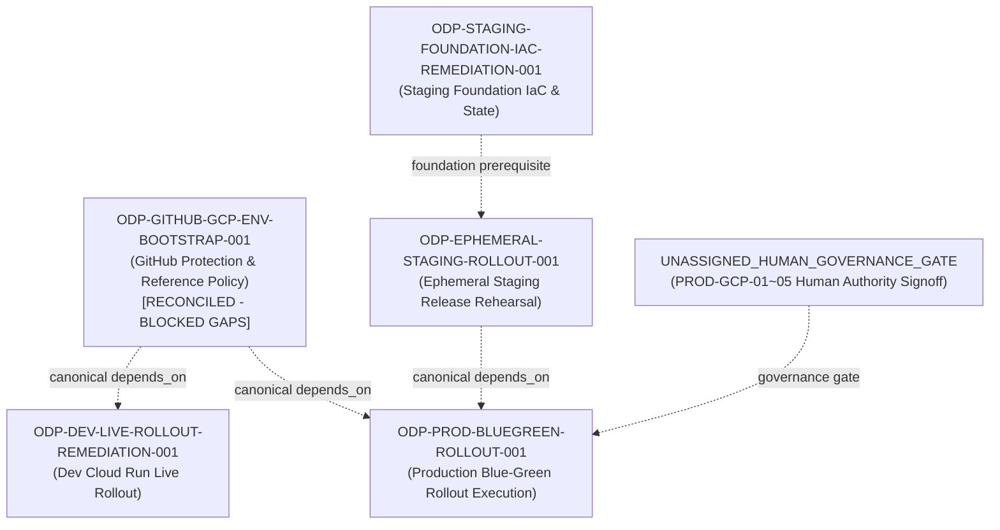

# ODP-GITHUB-GCP-ENV-BOOTSTRAP-001 驗收核對與補證記錄 (2026-09-11)

## 1. 任務背景與復原目標

- **任務 ID**: `ODP-GITHUB-GCP-ENV-BOOTSTRAP-001`
- **任務名稱**: 歷史驗收續辦：ODP-GITHUB-GCP-ENV-BOOTSTRAP-001（原名：建立 staging/production GitHub 與 GCP 環境保護）
- **執行身分 (Owner)**: `Antigravity6`
- **指派審查者 (Reviewer)**: `Codex`
- **復原目標分支**: `task/ODP-GITHUB-GCP-ENV-BOOTSTRAP-001-RECOVERY-20260911`
- **交付基準 (Base Commit)**: `4499a2993e37b62033926b07de8d8d2e8469a6c7`
- **原始交付記錄**: 經 PR [#1011](https://github.com/alfloop-dev/odayplus/pull/1011) 合併入 `dev`（PR head: `5edcf009640ae31dde160b1ce4c9123ac2c31a2f`，merge commit: `8ad3f10dab707711bc1394ff3f6a81042b0b5648`，merged at `2026-08-25T16:26:32Z`）。

在 2026-09-06 archive 事故後，本任務進行可執行的歷史驗收核對。本核對嚴格區分「GitHub 側環境保護（已核實且有效）」與「GCP 實體 production 資源、環境變數與 Human GO（屬尚未達成之缺口，由後續責任任務與治理 Gate 承接）」。本記錄保留歷史交付事實、唯讀補證收據、逐條條款判讀與明確缺口，不以舊收據或 fail-closed 假裝驗收全部滿足。

---

## 2. 唯讀查核與證據鏈復用

本次驗收核對綜合歷史交付與最新已驗證之唯讀查核證據：

| 證據來源 | 查核時間與 SHA | 查核內容與結論 | 關聯條款 |
|---|---|---|---|
| **歷史交付收據** | PR #1011 @ `8ad3f10dab70` | 交付 5 份 audit JSON 與 README，7 項 CI check 全數 `success`，原審查者 Antigravity2 批准記錄完整保留。所有 secret 全面遮蔽 (`secret_values_redacted=true`)。 | A1, A2, A4, A5 |
| **GitHub Protected Environments 補證** | 2026-09-10T23:31:25Z (`support/handoffs/max-dispatch-20260910/archive-evidence/github-protected-environments.json`) | 實體 GitHub API 唯讀讀回（`command-receipts.json` 中 3 筆 `gh api repos/alfloop-dev/odayplus/environments/*` exit 0）：<br>1. `staging` (id `17295059155`)：具 `required_reviewers` (`Alien-alfaloop`, `ajoe734`)<br>2. `production` (id `20574639394`)：具 `required_reviewers` (`Alien-alfaloop`, `ajoe734`)<br>3. `dev` (id `17295066036`)：無 protection rule，符合 CI 自動化整合契約 | A1, A3 |
| **GCP Preflight #1245 補證** | PR #1245 @ `6ee658a0bd65` (merge `f21fd2a242d7`) | 唯讀讀回（dev 41、staging 44、production 42 個變數；`receipt-gh-env-vars-production.json` exit 0，timestamp `2026-09-08T11:46:09Z`）。`preflight-results.json:279-287` 包含專案 `odayplus-prod-20260826`、專屬 WIF/deployer SA/SQL 等 references；`:294-295` 明載 `gcp_runtime_readback_established=false` / `runtime_readback_status=not_established`。非 release identity 探針失敗不證明資源存在或不存在，記錄為 unknown。production 維持 fail-closed。 | A2, A3, A5 |
| **Staging Foundation Mapping 補證** | PR #1296 @ `f741af4def87` | `foundation-reference-map.json` 完成 staging 基礎設施映射至 `ODP-STAGING-FOUNDATION-IAC-REMEDIATION-001`。保留 candidate pending live、recovery bucket unknown、SQL legacy mismatch (指向 unmanaged `oday-staging-sql`) 逐項缺口。 | A2, A3 |
| **Human Decisions 執行規畫** | `docs/plans/ODP_HUMAN_DECISIONS_EXECUTION_PLAN_2026-09-08.md` | D01–D21 治理決策轉錄。本計畫 §8 line 273 明確排除 production deploy/GO/lease；`HUMAN-ODP-OPEN-REQUIREMENT-DISPOSITIONS-001` 僅處理 6 項 requirement dispositions，不含 PROD-GCP-01~05。PROD-GCP-01~05 維持為獨立待決之人類授權缺口。 | A3, A4 |

---

## 3. A1–A5 逐條驗收核對結果

| 項次 | 原驗收條款 | 類別 | 判定結果 | 核對依據、現有證據與明確缺口 |
|---|---|---|---|---|
| **A1** | `staging/production environments具 required reviewers` | 部署運行 (R) | **已滿足 (met)** | 歷史審查收據 (`github-environments-audit.json @ 8ad3f10dab70`) 與 2026-09-10 最新 readback (`github-protected-environments.json`，API 退出碼 0) 共同證明：GitHub Environment `staging` (id `17295059155`) 與 `production` (id `20574639394`) 均具備 `required_reviewers` 保護規則，具名審查者為 `Alien-alfaloop` 與 `ajoe734`。`dev` 環境無阻擋。 |
| **A2** | `WIF/IAM/vars/secret references 完整且只有 references 被記錄` | 部署運行 (R) | **部分滿足 (partially_met)** | **已達成部分**：2026-08-25 歷史審查收據 (`gcp-wif-iam-audit.json`、`github-variables-audit.json @ 8ad3f10dab70`) 記錄 dev/staging 變數與密鑰引用規範；2026-09-08 Preflight #1245 補證收據 (`receipt-gh-env-vars-production.json` exit 0) 記錄 production 42 個環境變數，包含專屬專案 `odayplus-prod-20260826`、WIF provider、deployer SA、Cloud SQL 與 4 項 Secret Manager references，全數 `secret_values_redacted=true`。<br>**缺口**：Preflight #1245 (`preflight-results.json:279-295`) 明載 `runtime_readback_status=not_established` / `gcp_runtime_readback_established=false`，非 release identity 探針無法建立實體 GCP 資源與 IAM 之存在、配置或存取權限，狀態記為 unknown；PR #1296 標明 staging recovery bucket unknown 與 SQL legacy mismatch。此條款只對 GitHub 變數與密鑰引用規範成立，live GCP 實體資源與 IAM 運行狀態未建立。 |
| **A3** | `production environment存在且保護有效` | 部署運行 (R)<br>人類授權 (H) | **部分滿足 (partially_met)** | **已達成部分**：GitHub 側環境 `production` (id `20574639394`) 存在且 `required_reviewers` 保護有效；GitHub production 環境具備 42 項變數 reference 宣告（包含專案 `odayplus-prod-20260826`）。<br>**缺口**：專屬 production GCP 專案、WIF provider、Cloud SQL、Secret Manager 之實體運行狀態未由 release identity 讀回建立（unknown）；5 項具名人類決定 (`PROD-GCP-01` ~ `PROD-OPS-05`) 處於 `status=blocked_pending_human_authority`。不以 fail-closed 或變數引用視為驗收完成；保留 A3 缺口並明確交由後續責任任務承接。 |
| **A4** | `缺少人類 authority 時明確 blocked而非填 placeholder` | 人類授權 (H) | **已滿足 (met)** | `production-authority-prerequisites.json` 明確登錄 `status=blocked_pending_human_authority`，逐項條列 PROD-GCP-01~05 待決清單；`github-variables-audit.json` 明載 production 變數刻意留空以防造假。落實 fail-closed 原則且無任何 fake placeholder。 |
| **A5** | `redacted readback receipts 完整` | 部署運行 (R) | **已滿足 (met)** | PR #1011 交付之 5 份 audit 檔案完整且 `secret_values_redacted=true`；Preflight #1245 與 2026-09-10 readback 提供完整命令來源及遮蔽後 API 回讀；無法追溯之 runtime 欄位明記 unknown，不造假收據。 |

---

## 4. Canonical 依賴圖與下游責任映射

### 4.1 Canonical 依賴關係 (Canonical `depends_on` Snapshot & Invariant)

本任務核對嚴格區分「Canonical `depends_on` 邊」與「下游責任映射」。依據看板快照（`ai-status.json`，SHA256: `03a8c32f4c6956af745bbf5574a423fbea82ceda1dc1a97c902c52d82f0d6ae5`），本次驗收核對**不變更任何 canonical 依賴關係**（全數為 `unchanged`）：

| 任務 ID | Canonical `depends_on` (核對前) | Canonical `depends_on` (核對後) | 變更狀態 | 關聯說明 |
|---|---|---|---|---|
| `ODP-GITHUB-GCP-ENV-BOOTSTRAP-001` | `[]` | `[]` | unchanged | 本任務為基礎環境保護定義任務 |
| `ODP-PROD-BLUEGREEN-ROLLOUT-001` | `["ODP-EPHEMERAL-STAGING-ROLLOUT-001", "ODP-GITHUB-GCP-ENV-BOOTSTRAP-001"]` | `["ODP-EPHEMERAL-STAGING-ROLLOUT-001", "ODP-GITHUB-GCP-ENV-BOOTSTRAP-001"]` | unchanged | Production 上線直接依賴本 bootstrap 與 staging rollout |
| `ODP-DEV-LIVE-ROLLOUT-REMEDIATION-001` | `["ODP-RELEASE-MANIFEST-LIVE-ARTIFACT-RECONCILE-001", "ODP-RUNTIME-RELEASE-SINGLE-PATH-001", "ODP-GITHUB-GCP-ENV-BOOTSTRAP-001", ...]` (共 10 項) | `["ODP-RELEASE-MANIFEST-LIVE-ARTIFACT-RECONCILE-001", "ODP-RUNTIME-RELEASE-SINGLE-PATH-001", "ODP-GITHUB-GCP-ENV-BOOTSTRAP-001", ...]` (共 10 項) | unchanged | Dev live rollout 直接依賴本 bootstrap |
| `ODP-STAGING-FOUNDATION-IAC-REMEDIATION-001` | `[]` | `[]` | unchanged | Staging foundation 為獨立根任務，無上游依賴 |
| `ODP-EPHEMERAL-STAGING-ROLLOUT-001` | `["ODP-EPHEMERAL-STAGING-IAC-001", "ODP-DEV-ROLLOUT-001", "ODP-DEV-LIVE-ROLLOUT-REMEDIATION-001", ...]` (共 5 項) | `["ODP-EPHEMERAL-STAGING-IAC-001", "ODP-DEV-ROLLOUT-001", "ODP-DEV-LIVE-ROLLOUT-REMEDIATION-001", ...]` (共 5 項) | unchanged | Ephemeral staging 經 dev remediation 傳遞依賴本 bootstrap |

**DAG 閉包與循環檢查 (Scoped Transitive Closure & Cycle Check)**:
依據 `ai-status.json` (SHA256: `03a8c32f4c6956af745bbf5574a423fbea82ceda1dc1a97c902c52d82f0d6ae5`) 之任務相依閉包：
- `ODP-GITHUB-GCP-ENV-BOOTSTRAP-001` -> `ODP-DEV-LIVE-ROLLOUT-REMEDIATION-001`（直接依賴邊）
- `ODP-GITHUB-GCP-ENV-BOOTSTRAP-001` -> `ODP-PROD-BLUEGREEN-ROLLOUT-001`（直接依賴邊）
- `ODP-DEV-LIVE-ROLLOUT-REMEDIATION-001` -> `ODP-EPHEMERAL-STAGING-ROLLOUT-001`（傳遞依賴邊）
- `ODP-EPHEMERAL-STAGING-ROLLOUT-001` -> `ODP-PROD-BLUEGREEN-ROLLOUT-001`（傳遞依賴邊）

`ODP-GITHUB-GCP-ENV-BOOTSTRAP-001` 之 `depends_on: []`（入度為 0），所有相依關係均嚴格由上游往下游單向流動，下游無任何回指邊，任務閉包拓撲排序無環（`cycle_detected=false`，`verified_dag=true`）。
拓撲排序序列：`ODP-GITHUB-GCP-ENV-BOOTSTRAP-001` -> `ODP-DEV-LIVE-ROLLOUT-REMEDIATION-001` -> `ODP-EPHEMERAL-STAGING-ROLLOUT-001` -> `ODP-PROD-BLUEGREEN-ROLLOUT-001`。

### 4.2 下游責任任務映射 (Downstream Scope & Responsibility Mapping)

未完成之實體雲端寫入、基礎設施補齊與上線授權操作，明確由以下既有責任任務承接：



1. **Production Live Blue-Green Rollout**:
   - **責任任務**: `ODP-PROD-BLUEGREEN-ROLLOUT-001`
   - **前置條件**: `ODP-EPHEMERAL-STAGING-ROLLOUT-001` 完成、專屬 production GCP 基礎設施到位、具名 Human GO 簽署（`PROD-GCP-01` ~ `PROD-OPS-05`）與有效 Supervisor lease。
   - **治理 Gate**: Human GO + Supervisor Production Release Lease。

2. **Staging Foundation Infrastructure & State**:
   - **責任任務**: `ODP-STAGING-FOUNDATION-IAC-REMEDIATION-001`（搭配 `ODP-STAGING-FOUNDATION-REFS-MAPPING-001` / PR #1296）
   - **前置條件**: Staging bucket 與 Cloud SQL 實體資源綁定驗證、GCS 遠端 state backend 受治理管理、Direct VPC/egress 契約核實。
   - **治理 Gate**: Staging authority 下的 Terraform 執行。

3. **Dev Live Rollout Remediation**:
   - **責任任務**: `ODP-DEV-LIVE-ROLLOUT-REMEDIATION-001`
   - **前置條件**: 權威 manifest 驗證、Dev Cloud Run 服務健康狀態與 deployer IAM 綁定、16 個第三方來源 disabled。
   - **治理 Gate**: 標準 dev CI/CD 合併與部署。

4. **Production Human Governance Decisions (PROD-GCP-01~05)**:
   - **責任任務**: `UNASSIGNED_HUMAN_GOVERNANCE_GATE`（待指派專屬治理任務）
   - **範圍邊界說明**: `ODP_HUMAN_DECISIONS_EXECUTION_PLAN_2026-09-08.md:273` 明確排除 production deploy/GO/lease；`HUMAN-ODP-OPEN-REQUIREMENT-DISPOSITIONS-001` 僅處理 6 項 requirement dispositions，不涵蓋 PROD-GCP-01~05。
   - **前置條件**: 權責主管對 PROD-GCP-01 (專案與命名)、PROD-GCP-02 (WIF 與 SA)、PROD-GCP-03 (SQL 與 Secrets)、PROD-GCP-04 (OAuth 與網域)、PROD-OPS-05 (維運/SLO/Rollback) 之具名裁決。
   - **治理 Gate**: 法務／資安／維運具名審查（在正式裁決前維持 A3 缺口）。

---

## 5. 權限邊界與不變量原則

1. **唯讀核對，禁止 live mutation**: 本次核對重用現有唯讀 readback 與 PR 收據，未執行任何 GCP/GitHub 資源建立、修改或刪除。
2. **絕不讀取或提交 Secret 原文**: 所有變數查核與收據均保持 `secret_values_redacted=true`，僅記錄 reference 名稱。
3. **歷史真實性保留**: 原 PR #1011 (head `5edcf009`) 之 CI 成功記錄與 reviewer Antigravity2 之歷史 approval 完整保留；不偽造過去執行，亦不擅自簽署人類決策。
4. **單一證據 Scope**: 本次所有新增交付物局限於 `docs/evidence/execution-control/ARCHIVE_RECOVERY_RECONCILIATION_20260911/ODP-GITHUB-GCP-ENV-BOOTSTRAP-001/`，不修改產品程式、workflow 或部署設定。

---

## 6. 宣告驗證命令 (Verification)

本任務交付物由以下宣告命令驗證：

```bash
git diff --check 4499a2993e37b62033926b07de8d8d2e8469a6c7 HEAD -- docs/evidence/execution-control/ARCHIVE_RECOVERY_RECONCILIATION_20260911/ODP-GITHUB-GCP-ENV-BOOTSTRAP-001/
python3 -c "import json; data=json.load(open('docs/evidence/execution-control/ARCHIVE_RECOVERY_RECONCILIATION_20260911/ODP-GITHUB-GCP-ENV-BOOTSTRAP-001/acceptance-reconciliation.json')); assert data['summary']['reconciliation_verdict'] == 'reconciled_with_known_gaps'; assert data['summary']['criteria_total'] == 5; assert data['summary']['criteria_met'] == 3; assert data['summary']['criteria_partially_met'] == 2; print('ODP-GITHUB-GCP-ENV-BOOTSTRAP-001 acceptance reconciliation verified successfully.')"
```
