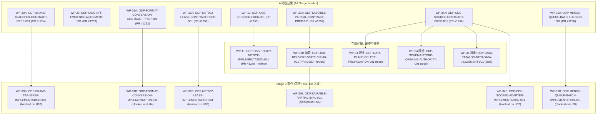

# ODP-HUMAN-DECISIONS-HANDBACK-INTEGRATION-001 — 人工決策集中接回、成果映射與後續實作整合

- **Task ID**: `ODP-HUMAN-DECISIONS-HANDBACK-INTEGRATION-001`
- **Work Package**: `WP-90`（集中整合、需求狀態與 Structural Closeout）
- **Phase**: `confirmed decisions implementation follow-up`
- **Owner**: `Antigravity`
- **Reviewer**: `Codex2`
- **Date**: `2026-09-09`
- **Inspected Base HEAD SHA**: `c42b734ca26e165eabc6f8244787bc46d192f0f9`
- **Base References**:
  - [ODP 人工決策落地與 Supervisor／Auto Worker 執行規畫 2026-09-08](../../../plans/ODP_HUMAN_DECISIONS_EXECUTION_PLAN_2026-09-08.md) (`WP-00` / PR #1247)
  - [需求處置治理清單](../../../../delivery_toolchain/governance/set_valued_requirements.json)
  - [需求處置治理標準與登錄表](../../../governance/ODP_REQUIREMENT_DISPOSITIONS.md)
  - [待裁決事項清單 2026-09-03](../../../plans/ODP_OPEN_DECISIONS_2026-09-03.md)
- **Status**: 集中接回完成，已更新 shared registry、治理登錄表與執行規畫映射；Stage B 實作與待命 Human 任務已結構化指派。

---

## 1. 任務執行摘要 (Executive Summary)

本任務（`WP-90`）承接 2026-09-08 使用者確認之 **21 項人工決策 (D01–D21)**，以及已全數審查通過並合併入 `dev` 的 **8 項 A 階段工程準備成果包**（`WP-10`、`WP-20`、`WP-30A`、`WP-31A`、`WP-32A`、`WP-33A`、`WP-34A`、`WP-35A`）。

本任務交付核心成果：
1. **逐一引用真實 PR 與 Approved HEAD**：完整追溯 8 項 A 階段任務之 PR 編號、Merge Commit SHA、Approved Commit SHA、Owner 與 Reviewer，更新執行規畫 §9 登錄表，徹底消解舊 importer 留下的「待建立映射／待查重」空欄。
2. **誠實區分各層狀態，嚴禁偽實作與假合規**：
   - **D01–D14 (OSS)**：完成 SBOM (775 元件)、npm audit (0 漏洞)、pip-audit (0 漏洞)、16 資料來源決策卡與未簽署收據模板；追蹤 follow-up `ODP-OSS-POLICY-NOTICE-IMPLEMENTATION-001` (PR #1279)。
   - **D15 (Google OIDC)**：完成 15 項控制點查證矩陣（12 pass, 3 unknown）；`HUMAN-GCP-WEB-OAUTH-CLIENTS-001` 對齊為待命事項，非當前部署 blocker。
   - **D16–D20 (五項工程需求)**：保持使用者指定之「實作」方向，不建立 Waiver、不刪除需求；在未取得真實資料 (H03–H07) 前，治理狀態維持 `BLOCKED_BY_EVIDENCE` / `OPEN`，嚴禁冒充 `VERIFIED`。
   - **D21 (Merge Queue 批次)**：將批次隊列確立為正式實作需求，更新 item 19 為 `OPEN`，等待 H08 參數選擇。
3. **建立與派發新 follow-up 實作任務**：
   - `WP-11`: `ODP-OSS-POLICY-NOTICE-IMPLEMENTATION-001` (review, PR #1279)
   - `WP-33B 前置`: `ODP-JOB-DELIVERY-STATE-CLEAR-001` (review, PR #1280)
   - `WP-34 跟進 1`: `ODP-DATA-PLANE-DELETE-PROPAGATION-001` (todo)
   - `WP-34 跟進 2`: `ODP-SCHEMA-STORE-OPENING-AUTHORITY-001` (todo)
   - `WP-34 跟進 3`: `ODP-DATA-CATALOG-METADATA-ALIGNMENT-001` (todo)
   - `Stage B 實作`: 依真實依賴建立 `ODP-BRAND-TRANSFER-IMPLEMENTATION-001` (WP-30B)、`ODP-FORMAT-CONVERSION-IMPLEMENTATION-001` (WP-31B)、`ODP-NET002-LEASE-IMPLEMENTATION-001` (WP-32B)、`ODP-DURABLE-PARTIAL-IMPL-001` (WP-33B)、`ODP-CDC-SCOPED-ADAPTER-IMPLEMENTATION-001` (WP-34B)、`ODP-MERGE-QUEUE-BATCH-IMPLEMENTATION-001` (WP-35B)，目前均精確標記其等待之 Human 資料/參數 (H03–H08)。
4. **共享治理清單與文件一致性同步**：
   - 更新 [`delivery_toolchain/governance/set_valued_requirements.json`](../../../../delivery_toolchain/governance/set_valued_requirements.json)
   - 更新 [`docs/governance/ODP_REQUIREMENT_DISPOSITIONS.md`](../../../governance/ODP_REQUIREMENT_DISPOSITIONS.md)
   - 更新 [`docs/plans/ODP_OPEN_DECISIONS_2026-09-03.md`](../../../plans/ODP_OPEN_DECISIONS_2026-09-03.md)
   - 更新 [`docs/plans/ODP_HUMAN_DECISIONS_EXECUTION_PLAN_2026-09-08.md`](../../../plans/ODP_HUMAN_DECISIONS_EXECUTION_PLAN_2026-09-08.md)

---

## 2. 產物清單與索引 (Artifacts Index)

| 產物檔案 | 格式 | 說明 |
|---|---|---|
| [`README.md`](README.md) | Markdown | 本整合任務之總索引、21 決策對齊、8 成果追溯、後續任務狀態與治理登錄摘要（本文件） |
| [`decision-integration-matrix.json`](decision-integration-matrix.json) | JSON | D01–D21 完整決策對應矩陣（含決策內容、工作包、A 階段任務與 PR、Approved SHA、後續任務、H01–H08 缺口、治理狀態） |
| [`work-package-task-map.json`](work-package-task-map.json) | JSON | WP-00 至 WP-90 之任務識別碼、PR 連結、交付檔案清單、Owner/Reviewer 與目前狀態之結構化映射 |

---

## 3. D01–D21 決策落地與 8 項 A 階段成果總覽

詳細結構化資料見 [`decision-integration-matrix.json`](decision-integration-matrix.json)。

| 決策 | 個案 / 項目 | 使用者選擇 | A 階段交付任務與 PR | Approved HEAD SHA | 後續實作任務 / 待命狀態 | 治理狀態 |
|---|---|---|---|---|---|---|
| **D01** | `LGPL-SHARP-LIBVIPS` | A: 允許使用 | `ODP-OSS-DECISION-PACK-001` (PR #1255) | `21a5e783544aaf14b25bb7ef00eeffe4c1ca49b6` | `ODP-OSS-POLICY-NOTICE-IMPLEMENTATION-001` (PR #1279) | `IMPLEMENTATION_READY` (生效等 H01) |
| **D02** | `LGPL-PSYCOPG2` | A: 接受 linking exception | `ODP-OSS-DECISION-PACK-001` (PR #1255) | `21a5e783544aaf14b25bb7ef00eeffe4c1ca49b6` | `ODP-OSS-POLICY-NOTICE-IMPLEMENTATION-001` (PR #1279) | `IMPLEMENTATION_READY` (生效等 H01) |
| **D03** | `LGPL-PSYCOPG3` | A: 附條件允許 (不沿用例外) | `ODP-OSS-DECISION-PACK-001` (PR #1255) | `21a5e783544aaf14b25bb7ef00eeffe4c1ca49b6` | `ODP-OSS-POLICY-NOTICE-IMPLEMENTATION-001` (PR #1279) | `IMPLEMENTATION_READY` (生效等 H01) |
| **D04** | `LGPL-MOOCORE` | A: 附條件允許 (動態載入) | `ODP-OSS-DECISION-PACK-001` (PR #1255) | `21a5e783544aaf14b25bb7ef00eeffe4c1ca49b6` | `ODP-OSS-POLICY-NOTICE-IMPLEMENTATION-001` (PR #1279) | `IMPLEMENTATION_READY` (生效等 H01) |
| **D05** | `FIRST-PARTY-UNLICENSED` | B: 8 套件標示 UNLICENSED | `ODP-OSS-DECISION-PACK-001` (PR #1255) | `21a5e783544aaf14b25bb7ef00eeffe4c1ca49b6` | `ODP-OSS-POLICY-NOTICE-IMPLEMENTATION-001` (PR #1279) | `IMPLEMENTATION_READY` |
| **D06** | Dev toolchain vulnerability | TEMPORARY_ACCEPT (現況 0 漏洞) | `ODP-OSS-DECISION-PACK-001` (PR #1255) | `21a5e783544aaf14b25bb7ef00eeffe4c1ca49b6` | 無需 waiver（13 high 已修復） | `VERIFIED` (0 findings) |
| **D07** | UNKNOWN / PROPRIETARY | 第一方依 D05；第三方逐件審查 | `ODP-OSS-DECISION-PACK-001` (PR #1255) | `21a5e783544aaf14b25bb7ef00eeffe4c1ca49b6` | `ODP-OSS-POLICY-NOTICE-IMPLEMENTATION-001` | `IMPLEMENTATION_READY` |
| **D08** | Permissive licenses | 允許使用，保留適用義務 | `ODP-OSS-DECISION-PACK-001` (PR #1255) | `21a5e783544aaf14b25bb7ef00eeffe4c1ca49b6` | `ODP-OSS-POLICY-NOTICE-IMPLEMENTATION-001` | `IMPLEMENTATION_READY` |
| **D09** | NOTICE 自動產出 | generate_oss_notice.py + SBOM | `ODP-OSS-DECISION-PACK-001` (PR #1255) | `21a5e783544aaf14b25bb7ef00eeffe4c1ca49b6` | `ODP-OSS-POLICY-NOTICE-IMPLEMENTATION-001` (PR #1279) | `IMPLEMENTATION_READY` |
| **D10** | 例外核准權限 | 具名 Legal/Security 人員；禁 AI 代簽 | `ODP-OSS-DECISION-PACK-001` (PR #1255) | `21a5e783544aaf14b25bb7ef00eeffe4c1ca49b6` | `HUMAN-OSS-LEGAL-APPROVAL-001` | `BLOCKED_BY_EVIDENCE` (等 H01) |
| **D11** | 例外範圍與期限 | 限 package/env/release/expiry | `ODP-OSS-DECISION-PACK-001` (PR #1255) | `21a5e783544aaf14b25bb7ef00eeffe4c1ca49b6` | `HUMAN-OSS-LEGAL-APPROVAL-001` | `BLOCKED_BY_EVIDENCE` (等 H01) |
| **D12** | Receipt Fail-Closed | 缺失/過期/不符一律 fail closed | `ODP-OSS-DECISION-PACK-001` (PR #1255) | `21a5e783544aaf14b25bb7ef00eeffe4c1ca49b6` | `ODP-OSS-POLICY-NOTICE-IMPLEMENTATION-001` | `IMPLEMENTATION_READY` |
| **D13** | 窄 Denylist | AGPL/SSPL/BSL 拒絕; GPL/LGPL 條件 | `ODP-OSS-DECISION-PACK-001` (PR #1255) | `21a5e783544aaf14b25bb7ef00eeffe4c1ca49b6` | `ODP-OSS-POLICY-NOTICE-IMPLEMENTATION-001` | `IMPLEMENTATION_READY` |
| **D14** | 外部權威 Receipt | 外部系統回讀；模板交付；hash 驗完整 | `ODP-OSS-DECISION-PACK-001` (PR #1255) | `21a5e783544aaf14b25bb7ef00eeffe4c1ca49b6` | `HUMAN-OSS-LEGAL-APPROVAL-001` | `BLOCKED_BY_EVIDENCE` (等 H01) |
| **D15** | Google OIDC 關閉 | A: 帳密為預設，Google OIDC 不啟用 | `ODP-OIDC-OFF-EVIDENCE-ALIGNMENT-001` (PR #1253) | `9fc7e2a8a59085a02ea030f02fdfb3dfb4eee47d` | `HUMAN-GCP-WEB-OAUTH-CLIENTS-001` (待命) | `VERIFIED` (12 controls pass; live unknown) |
| **D16** | SITE-001 BRAND_TRANSFER | A: 實作／補齊真實資料與契約 | `ODP-BRAND-TRANSFER-CONTRACT-PREP-001` (PR #1254) | `961225f63afc462cd55e474eda7fc4b0e300faa9` | `ODP-BRAND-TRANSFER-IMPLEMENTATION-001` | `BLOCKED_BY_EVIDENCE` (30A done; 30B 等 H03) |
| **D17** | SITE-001 FORMAT_CONVERSION | A: 實作／補齊真實資料與流程 | `ODP-FORMAT-CONVERSION-CONTRACT-PREP-001` (PR #1252) | `a64b26c4b11a8cc8d3170eda9dd9e970ff4538d3` | `ODP-FORMAT-CONVERSION-IMPLEMENTATION-001` | `BLOCKED_BY_EVIDENCE` (31A done; 31B 等 H04) |
| **D18** | NET-002 LEASE | A: 實作／補齊租約契約 | `ODP-NET002-LEASE-CONTRACT-PREP-001` (PR #1256) | `d70563166e344e2d560ea7cac2eb236ddd118892` | `ODP-NET002-LEASE-IMPLEMENTATION-001` | `BLOCKED_BY_EVIDENCE` (32A done; 32B 等 H05) |
| **D19** | SHARED-001 PARTIAL | A: 實作 partial／receipt／retry | `ODP-DURABLE-PARTIAL-CONTRACT-PREP-001` (PR #1257) | `57019d8d94ab1df9111046061b4be04190dce7bf` | 前置 PR #1280 (review); `ODP-DURABLE-PARTIAL-IMPL-001` | `BLOCKED_BY_EVIDENCE` (33A done; 33B 等 H06) |
| **D20** | INT-001 CDC | A: 實作／補齊 CDC 適用性與契約 | `ODP-CDC-SOURCE-CONTRACT-PREP-001` (PR #1258) | `ec3a218805ff1ccbd176262c3c76d70a62034eac` | 3 跟進任務 (todo); `ODP-CDC-SCOPED-ADAPTER-IMPLEMENTATION-001` | `OPEN` (34A done; 34B 等 H07) |
| **D21** | Merge Queue 批次 | B: 保留為正式實作需求 | `ODP-MERGE-QUEUE-BATCH-DESIGN-001` (PR #1250) | `1ed3f7a94a03411cf6b0b8ec6a038473ced36439` | `ODP-MERGE-QUEUE-BATCH-IMPLEMENTATION-001` | `OPEN` (35A done; 35B 等 H08) |

---

## 4. 三大 Human 任務對齊與待命交接 (Human Tasks Alignment)

| Human 任務 ID | 目前狀態 | 負責人 / 審查人 | 本輪對齊依據與新事實 | 下一步與入場條件 |
|---|---|---|---|---|
| `HUMAN-OSS-LEGAL-APPROVAL-001` | `todo` | `Human/Ops` / `Claude2` | D01–D14 已完成技術盤點與未簽署收據模板（`ODP-OSS-DECISION-PACK-001`，PR #1255）。§4.1 拆分之 16 個來源群組預設關閉。 | 等待法務權責主管提供具名身分、外部決策編號 (H01)，以及逐來源資料集審查確認。不阻擋離線工程。 |
| `HUMAN-GCP-WEB-OAUTH-CLIENTS-001` | `todo` | `Human/Ops` / `Codex` | D15 確定 Google OIDC 關閉、密碼優先（`ODP-OIDC-OFF-EVIDENCE-ALIGNMENT-001`，PR #1253）。12 項程式/CI 控制點已通過驗證。 | **轉為待命事項**：僅在業務方未來明確決定啟用 Google OIDC 時才需執行，**不是目前 dev/staging/prod 部署 blocker**。 |
| `HUMAN-ODP-OPEN-REQUIREMENT-DISPOSITIONS-001` | `todo` | `Human/Ops` / `Claude2` | D16–D21 已全數選定實作路線，6 個 A 階段準備包已合併（PR #1254, #1252, #1256, #1257, #1258, #1250）。禁止再泛稱「等待是否實作」。 | 等待業務與資料負責人回覆 H03–H08 具體資料位置與參數。工程團隊已建立 Stage B 任務等待解鎖。 |

---

## 5. 後續實作任務派發與狀態追蹤 (Follow-up Tasks Dispatch Status)

本輪 Supervisor 已正式建立後續工程任務，納入 canonical 派工佇列：



### 任務狀態表

| Task ID | Work Package | 目前狀態 | Owner | Reviewer | 任務重點與依賴 |
|---|---|---|---|---|---|
| `ODP-OSS-POLICY-NOTICE-IMPLEMENTATION-001` | `WP-11` | `review` | `Antigravity2` | `Codex` | 8 個第一方套件 `UNLICENSED` 與 NOTICE 產出；PR #1279 審查中。 |
| `ODP-JOB-DELIVERY-STATE-CLEAR-001` | `WP-33B 前置` | `review` | `Antigravity` | `Codex2` | 修正 `PARTIAL`/`CANCELLED` 終態殘留 `RETRYING` 傳遞狀態；PR #1280 審查中。 |
| `ODP-DATA-PLANE-DELETE-PROPAGATION-001` | `WP-34 跟進` | `todo` | `Antigravity3` | `Codex2` | 資料落地層（PostgreSQL）刪除與墓碑傳播引擎，修補既有全 upsert 盲區。 |
| `ODP-SCHEMA-STORE-OPENING-AUTHORITY-001` | `WP-34 跟進` | `todo` | `Antigravity2` | `Codex` | 補齊代碼已引用之 `store_opening_authority_snapshot` 來源契約。 |
| `ODP-DATA-CATALOG-METADATA-ALIGNMENT-001` | `WP-34 跟進` | `todo` | `Claude` | `Codex2` | 讓來源契約可表達 Data Owner 與延遲 SLA 字典，未知值保持未確認。 |
| `ODP-BRAND-TRANSFER-IMPLEMENTATION-001` | `WP-30B` | `blocked` | `Claude` | `Codex` | 實作真實品牌轉移觀測與 SiteScore 消費；等待 H03 資料。 |
| `ODP-FORMAT-CONVERSION-IMPLEMENTATION-001` | `WP-31B` | `blocked` | `Claude2` | `Codex2` | 實作店型轉換事件與 Brownfield 財務模擬；等待 H04 資料。 |
| `ODP-NET002-LEASE-IMPLEMENTATION-001` | `WP-32B` | `blocked` | `Claude` | `Codex2` | 將每店租約與候選檔期接入雙求解器硬限制；等待 H05 資料。 |
| `ODP-DURABLE-PARTIAL-IMPL-001` | `WP-33B` | `blocked` | `Claude2` | `Codex` | 接入指定批次業務（推薦 batch-listing-intake）之 PARTIAL 明細持久化；等待 H06。 |
| `ODP-CDC-SCOPED-ADAPTER-IMPLEMENTATION-001` | `WP-34B` | `blocked` | `Claude` | `Codex2` | 依確認來源實作 scoped CDC 與檢查點恢復；等待 H07。 |
| `ODP-MERGE-QUEUE-BATCH-IMPLEMENTATION-001` | `WP-35B` | `blocked` | `Claude2` | `Codex` | 依選定批次參數交付 merge queue 設定與驗證；等待 H08。 |

---

## 6. 人工資料請求追蹤 (Human Input Requests H01–H08)

| 請求編號 | 項目 | 負責提供者 | 具體請求內容 | 阻擋之工作包 |
|---|---|---|---|---|
| **H01** | OSS 權威身分與回讀 | Legal / Security Lead | 具名 approver、身分 principal ID、授權角色、外部決策系統名稱與 ticket/decision ID | `HUMAN-OSS-LEGAL-APPROVAL-001`、`WP-11` 生效閘 |
| **H02** | Dev 依賴風險接受 | Risk Owner | 最新 audit 清單逐件確認（目前 0 finding，暫無需填寫） | `WP-10` dev 例外（目前免除） |
| **H03** | 品牌轉移真實資料 | Market Intelligence Lead | 跨品牌交易/會員/panel 數據位置、資料負責人、授權範圍、最小樣本與統計定義 | `WP-30B` (`ODP-BRAND-TRANSFER-IMPLEMENTATION-001`) |
| **H04** | 店型轉換事件與財務 | Retail Operations Lead | 真實轉型事件來源、原/新店型、改裝 Capex、停業損失、設備殘值與 ramp 參數 | `WP-31B` (`ODP-FORMAT-CONVERSION-IMPLEMENTATION-001`) |
| **H05** | 門市租約最小匯出 | Store Operations / Real Estate | 門市租約合約主檔（起迄日、解約金公式、續約權）及候選新址簽約截止日 | `WP-32B` (`ODP-NET002-LEASE-IMPLEMENTATION-001`) |
| **H06** | 批次 Durable Job 標的 | Platform Infrastructure / Product | 核定至少一項業務任務（推薦 `batch-listing-intake`）採用 PARTIAL 與成員重試契約 | `WP-33B` (`ODP-DURABLE-PARTIAL-IMPL-001`) |
| **H07** | CDC 來源與 SLA 需求 | Data Platform Lead | 確認必要 CDC 來源集合（如 `orders`, `device_log`）、可接受延遲、刪除與 Oplog 視窗 | `WP-34B` (`ODP-CDC-SCOPED-ADAPTER-IMPLEMENTATION-001`) |
| **H08** | Merge Queue 批次參數 | Product / Engineering Lead | 在工程實測提出之選項（推薦 `min_entries=2`, `max_wait=10m`）中核定最終配置 | `WP-35B` (`ODP-MERGE-QUEUE-BATCH-IMPLEMENTATION-001`) |

---

## 7. 共享治理清單與文件更新 (Governance Registry Updates)

本任務集中更新了四大共享治理與規畫文件：

1. **`delivery_toolchain/governance/set_valued_requirements.json`**：
   - 記錄 `ODP-FR-NET-002` (LEASE)、`ODP-FR-SITE-001` (BRAND_TRANSFER, FORMAT_CONVERSION)、`ODP-FR-SHARED-001` (PARTIAL)、`ODP-FR-INT-001` (CDC) 之 2026-09-08 使用者實作決策更新。
   - 綁定已合併之 A 階段證據目錄與成果引用。
   - 嚴格維持 `BLOCKED_BY_EVIDENCE` / `OPEN`，不進行 AI 自簽豁免或虛假 `VERIFIED` 標記。
2. **`docs/governance/ODP_REQUIREMENT_DISPOSITIONS.md`**：
   - 更新 §4 需求成員登錄表，詳載 D16–D20 人工決策記錄、A 階段交付物與 Stage B 接續條件。
3. **`docs/plans/ODP_OPEN_DECISIONS_2026-09-03.md`**：
   - 第 19 項更新為 `OPEN`（D21 選定實作方向，A 階段量測已交付，B 階段等待 H08 參數選擇）。
   - 第 10（PARTIAL）、11（SITE-001）、12（NET-002）、15（INT-001）項新增 2026-09-08 / 2026-09-09 實作決策（D16–D20）與 Stage B / 跟進任務映射之更新備註，同時保留 2026-09-03 歷史評估與安全邊界。
4. **`docs/plans/ODP_HUMAN_DECISIONS_EXECUTION_PLAN_2026-09-08.md`**：
   - 完整填妥 §9 執行登錄表之所有 11 個工作包（`WP-00` 至 `WP-90`），綁定 canonical task ID、PR 編號、Approved HEAD SHA、Owner、Reviewer 與收據參照。

---

## 8. 自動化檢驗與合規證明 (Verification Receipts)

本任務交付物通過以下機械化驗證命令，退出碼皆為 `0`：

```bash
# 1. 驗證 Git diff 格式規範（無空白/行尾違規）
git diff --check

# 2. 驗證集合型需求成員門禁與結構化處置（47 個成員全數通過）
uv run python delivery_toolchain/governance/check_requirement_members.py
```

### 邊界與誠實宣告

1. **未變更外部生產環境或權限**：本任務未修改 IAM、雲端 Provider、配額、Secret 或 CI required checks。
2. **不冒充真實資料已具備**：所有涉及業務資料的 Stage B 任務均維持 `blocked`，直至收到 H03–H08 回覆。
3. **Structural Closeout 維持等候**：全案結構性結案（`ODP-STRUCTURAL-REMEDIATION-CLOSEOUT-001`）仍須等待後續實作與 runtime 驗證完成，本 A 階段整合不等於全案已完成。
