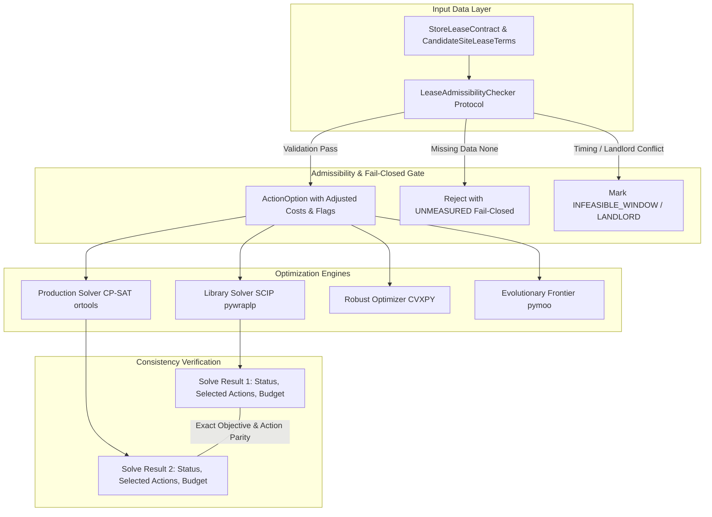

# NetPlan 租約硬限制 Solver 一致性驗收方案與矩陣 (Solver Acceptance Matrix)

- **任務識別碼**：`ODP-NET002-LEASE-CONTRACT-PREP-001`
- **關聯需求**：`ODP-FR-NET-002`（硬限制：租約 LEASE）、`ODP-FR-NET-004`（求解器診斷與可解釋性）
- **關聯決策**：決策 D18（NET-002 LEASE 實作／補齊租約契約）、工作包 WP-32A
- **基準代碼 SHA**：`9048161e058becff5a53593a773d3c42238213fb`
- **生成時間**：2026-09-08T16:11:05Z
- **文件狀態**：A 階段工程準備草案（Draft Specification）
- **關聯產物**：
  - [JSON 契約草案](lease-contract-draft.json)
  - [欄位字典](field-dictionary.md)
  - [H05 資料請求單](human-input-request-H05.md)
  - [實作交接計畫](implementation-handoff.md)
  - [總索引 README](README.md)

---

## 1. 執行目標與驗收原則

NetPlan 規劃系統具備雙求解核心架構：
1. **函式庫求解器 (Library Solver)**：位於 `solver/netplan/optimizer.py`（基於 OR-Tools `pywraplp` / SCIP / 窮舉備援）。
2. **生產求解器 (Production Solver)**：位於 `modules/netplan/application/production.py`（基於 OR-Tools CP-SAT `cp_model`，搭配 CVXPY 穩健優化與 pymoo NSGA-II 邊界探索）。

### 1.1 核心驗收原則

1. **雙求解器約束一致性 (Dual Solver Constraint Parity)**：
   - 任何施加於 Library Solver 的約束邏輯，必須 100% 同步於 Production CP-SAT 求解器。
   - `ConstraintClass.LEASE` 在資料未齊前，兩者均必須在 `unmodelled_constraint_classes` 誠實報告；當資料齊備並實施約束時，兩者必須同步納入 `modelled_classes`。
2. **缺席 (Missing) vs 量測為零 (Measured Zero) 的 Fail-Closed 判定**：
   - `exit_cost = None` 或合約缺失：必須阻擋並回傳 `UNMEASURED`，不得預設為 `0.0`。
   - `exit_cost = 0.0`：經由合法合約確認者，正常計入預算限制。
3. **MOVE 雙側時空與財務一致檢驗 (Dual-Side Validation for MOVE)**：
   - 同時檢驗「舊店解約可行性與違約金」與「新店起租可得日與簽約截止日」，並精確計算重疊期（Overlap Window）雙重租金。

---

## 2. 五種規劃動作 (OPEN, KEEP, IMPROVE, MOVE, EXIT) 驗收矩陣

| 規劃動作 (`Action`) | 適用實體 (`Entity`) | 租約前置檢驗項目 (`Admissibility Checks`) | 成本與預算影響計算 (`Budget Cost Formula`) | 資料缺席行為 (`Missing Data / None`) | 量測為零行為 (`Measured Zero / 0.0`) | 求解器判定與狀態 (`Expected Solver Outcome`) |
|---|---|---|---|---|---|---|
| **`OPEN`** (新設點位) | 候選新址 (`candidate_site`) | 1. `available_from` 落在規劃季度內或之前。 2. `signing_deadline` 未逾期。 3. `zoning_commercial_permitted == true`。 | `open_cost + security_deposit`（期初保證金） | 若 `available_from` 或 `signing_deadline` 缺失，判定為 `UNMEASURED`，Fail-Closed 剔除該 OPEN 選項。 | 若 `security_deposit == 0.0`（房東免押），預算僅計 `open_cost`。 | 合法點位可被納入最優解；檔期衝突點位標記為 `INFEASIBLE_WINDOW` 且不可被選取。 |
| **`KEEP`** (維持營運) | 既有門市 (`existing_store`) | 1. 若規劃期在 `lease_expiry_date` 內：直接通過。 2. 若規劃期跨越到期日：需 `renewal_option_flag == true` 且 `landlord_consent_status != REJECTED`。 | `0.0`（維持常態營運，租金計入經常性 OPEX） | 若全無合約檔或缺到期日，標記 `UNMEASURED`，Fail-Closed 發出不可判定警示。 | 合約在規劃期內無額外資本支出，正常列為可選。 | 正常營運門市可被選取；若即將到期且房東拒絕續約 (`REJECTED`) 則不可選 `KEEP`。 |
| **`IMPROVE`** (門市改裝) | 既有門市 (`existing_store`) | 1. `alteration_permitted == true`（合約允許改裝）。 2. `landlord_consent_status == APPROVED`。 3. 剩餘租期大於改裝投資回收期。 | `improve_cost`（資本化工程費用） | 若 `alteration_permitted` 或合約缺失，標記 `UNMEASURED`，禁止產生 `IMPROVE` 選項。 | 若無改裝限制且合約允許，正常計算改裝預算。 | 房東拒絕或禁止改裝門市標記為 `INFEASIBLE_LANDLORD`，禁止選取 `IMPROVE`。 |
| **`MOVE`** (遷址搬遷) | 既有門市 + 候選新址 (雙側實體) | **雙側檢驗**： 1. 舊店：`break_clause_allowed == true` 且 `early_termination_penalty` 已量測。 2. 新店：`available_from` 檔期吻合且商業分區許可。 3. 重疊期：`overlap_days <= max_overlap_days` (預設 60 天)。 | `termination_penalty + restoration_cost + new_security_deposit + (overlap_days * old_daily_rent) - grace_offset` | 任一側資料為 `None`（舊店違約金未知或新店檔期未知），立即標記 `UNMEASURED`，Fail-Closed 拒絕。 | 舊店無違約金 (`0.0`) 且免復原費 (`0.0`)，合法計算新店押金與重疊租金。 | 雙側均就緒時方可生成 `MOVE` 候選解；時序衝突或單側未知時拒絕求解。 |
| **`EXIT`** (結束關店) | 既有門市 (`existing_store`) | 1. 若合約已自然屆期：無需提前解約條款。 2. 若合約尚未到期：需 `break_clause_allowed == true`。 3. 必須有量測之違約金與原狀復原費。 | `early_termination_penalty + restoration_cost_estimate` | **嚴禁預設為 0.0**。若違約金為 `None`，標記為 `UNMEASURED`，Fail-Closed 拒絕求解。 | 若合約屆期自然終止，違約金實質量測為 `0.0`，合法以 `0.0 + restoration_cost` 計入資本預算。 | 求解器在受限預算下，準確評估關店違約代價，杜絕「偏向免費關店」之重大偏差。 |

---

## 3. 缺席 (Missing) vs 量測為零 (Measured Zero) 語意真值表

| 輸入狀態 (`Input Data State`) | 欄位值 (`Field Values`) | 商業現實意義 | `LeaseAdmissibilityStatus` | 求解器處理行為 (`Solver Behavior`) | 是否觸發 Fail-Closed |
|---|---|---|---|---|---|
| **完全合規且量測為零** | `break_clause=true`, `penalty=0.0`, `restoration=0.0` | 合約已期滿或房東書面同意無條件解約。 | `FEASIBLE` | 接受為合法選項，`budget_cost = 0.0`，正常參與優化求解。 | 否 |
| **完全合規且具量測罰金** | `break_clause=true`, `penalty=240000`, `restoration=150000` | 提前解約需支付 24 萬違約金與 15 萬拆除復原費。 | `PENALTY_REQUIRED` | 接受為合法選項，`budget_cost = 390000`，受 `max_budget` 約束。 | 否 |
| **解約金資料缺失 (None)** | `break_clause=true`, `penalty=None`, `restoration=None` | 系統未串接租約主檔，不知實際違約金金額。 | `UNMEASURED` | **拒絕求解**或將該 Option 標記為不可行；嚴禁以 `0.0` 帶入。 | **是** |
| **禁止期前解約** | `break_clause=false`, `penalty=None`, 尚未到期 | 房東合約嚴格禁止提前解約，期前關店違法。 | `INFEASIBLE_LANDLORD` | 標記為不可行，求解器強制排除 `EXIT` / `MOVE`。 | **是** |
| **新址簽約截止日逾期** | `available_from=2026-11-01`, `signing_deadline=2026-08-01` | 候選點位保留期已過，無法再簽約。 | `INFEASIBLE_WINDOW` | 標記為不可行，求解器強制排除該點位 `OPEN` / `MOVE`。 | **是** |
| **新址資料缺失 (None)** | `available_from=None`, `signing_deadline=None` | 候選物件無任何檔期資料。 | `UNMEASURED` | **拒絕求解**，Fail-Closed 剔除該點位。 | **是** |

---

## 4. 雙求解器（Library MIP vs Production CP-SAT）架構與約束對齊

### 4.1 對齊規範

1. **約束標記宣告**：
   - 兩求解器對於相同 Scenario，`modelled_constraint_classes` 與 `unmodelled_constraint_classes` 必須完全一致。
   - 在本 A 階段（資料尚未匯入生產前），兩者均維持 `ConstraintClass.LEASE` 於 `unmodelled_constraint_classes`。
2. **整數縮放 (Scaling) 一致性**：
   - CP-SAT 使用整數模型（`money_scale = 100`, `risk_scale = 1_000_000`）。
   - 租約成本（違約金、押金、雙重租金）在 CP-SAT 與 SCIP 浮點數求解中必須保持小數點後兩位換算一致，杜絕因精度捨入造成選點分歧。
3. **診斷資訊 (Infeasible Diagnostics)**：
   - 當預算不足以支付租約解約違約金或押金時，兩求解器必須產出一致之診斷原因代碼（如 `DIAG_BUDGET_EXCEEDED_BY_LEASE_PENALTY`）。

---

## 5. 反事實測試案例矩陣 (Counterfactual Test Cases)

以下設計 4 組典型測試案例，用於未來 32B 實作時之精確驗證：

| 測試案例代號 (`Case ID`) | 測試場景描述 (`Scenario Description`) | 輸入條件與參數 (`Inputs`) | 預期 Admissibility 結果 | 預期 Library Solver 結果 | 預期 Production CP-SAT 結果 | 驗收核心要點 |
|---|---|---|---|---|---|---|
| **`TC-LEASE-01`** (量測零關店) | 門市合約已到期，自然關店無違約金。 | `STR-01`: `expiry=2026-09-30`, `penalty=0.0`, `restoration=0.0`, `budget=100k` | `EXIT` 為 `FEASIBLE`，成本 `0.0`。 | `STATUS_OPTIMAL`, 選取 `EXIT`，預算使用 `0.0`。 | `STATUS_OPTIMAL`, 選取 `EXIT`，預算使用 `0.0`。 | 確認合法量測為零不被誤殺，兩求解器均選取。 |
| **`TC-LEASE-02`** (未量測 Fail-Closed) | 門市未串接合約檔，違約金為 `None`。 | `STR-02`: `penalty=None`, `exit_cost=None`, `budget=100k` | `EXIT` 為 `UNMEASURED`，`fail_closed=true`。 | 拒絕生成 `EXIT` 選項，或標記不可行回傳 `STATUS_INFEASIBLE`。 | 拒絕生成 `EXIT` 選項，或標記不可行回傳 `STATUS_INFEASIBLE`。 | **核心安全防線**：杜絕將 `None` 當成 `0.0` 免費關店。 |
| **`TC-LEASE-03`** (高額違約金排擠) | 門市尚有 3 年約，提前解約罰金 50 萬，但總預算僅 30 萬。 | `STR-03`: `penalty=500k`, `max_budget=300k`, 候選點 `open_cost=200k` | `EXIT` 成本修正為 `500k`。 | `EXIT` 因超額預算被拒；求解器轉為選擇 `KEEP` 或回報 `INFEASIBLE`。 | CP-SAT 與 SCIP 一致選擇 `KEEP` 或回報 `INFEASIBLE`。 | 驗證租約違約金真實進入預算限制式，改變決策。 |
| **`TC-LEASE-04`** (MOVE 雙側時空檢驗) | 舊店可解約（罰金 10 萬），但新店簽約截止日已過期 30 天。 | 舊店 `penalty=100k`；新址 `signing_deadline=2026-07-01` (已過期)。 | `MOVE` 判定為 `INFEASIBLE_WINDOW`。 | 排除該 `MOVE` 配對組合。 | CP-SAT 排除該 `MOVE` 配對組合。 | 驗證 MOVE 雙側時序約束，杜絕無效搬遷方案。 |
