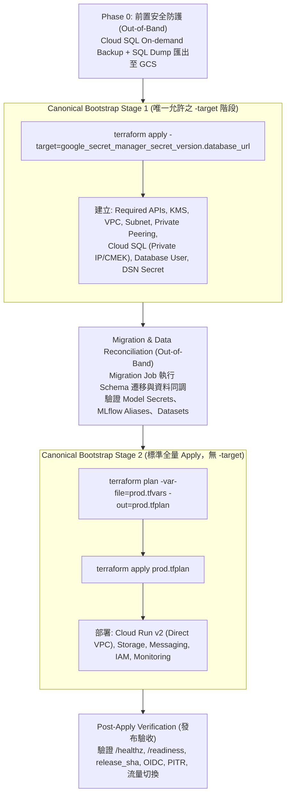

# Production 與 Terraform 網路落差盤點與 Apply 計畫書 (ODP-PROD-NETWORK-PARITY-PLAN-001)

- **任務識別碼**：`ODP-PROD-NETWORK-PARITY-PLAN-001`
- **執行者**：`Antigravity7`
- **審核者**：`Claude`
- **產出時間**：`2026-09-16T01:20:00Z`
- **環境設定**：
  - Production GCP 專案：`odayplus-prod-20260826` (專案編號: `365886461656`)
  - Staging GCP 專案：`odayplus-runtime-20260825` (專案編號: `767864276141`)
  - Terraform 定義參照基準：`origin/dev` 之 `infra/terraform/`
- **相關檔案與結構化產物**：
  - [inventory-discrepancy-matrix.json](file:///tmp/pantheon-worker-worktrees/pantheon/odp-prod-network-parity-plan-001/docs/evidence/runtime/ODP-PROD-NETWORK-PARITY-PLAN-001/inventory-discrepancy-matrix.json)
  - [live-gcp-readback-receipts.json](file:///tmp/pantheon-worker-worktrees/pantheon/odp-prod-network-parity-plan-001/docs/evidence/runtime/ODP-PROD-NETWORK-PARITY-PLAN-001/live-gcp-readback-receipts.json)

---

## 1. 執行背景與原則宣告 (Executive Summary & Principles)

使用者已正式裁示採行**架構一致路線（路線 A）**：將 Production 環境完全建置為 `infra/terraform` 既有定義之標準架構，不另行開立特化或臨時架構。

### 嚴格唯讀界限宣告 (Strict Read-Only Boundary)
本任務全程遵循嚴格唯讀規範：
1. **零雲端變更**：未執行任何 `terraform apply`、`gcloud` 寫入/修補/刪除操作、API 啟用或雲端資源異動。
2. **零 Cloud SQL 異動**：未修改 `oday-prod-sql` 之任何網路、SSL 或安全設定。
3. **零 Secret 洩漏**：所有變數清單僅列出結構與值來源，不填寫真實敏感金鑰。
4. **標準基準**：所有 Terraform 定義均以遠端基準 `origin/dev` 的 `network.tf`、`database.tf`、`cloud_run.tf`、`main.tf`、`variables.tf`、`checks.tf` 為準，不讀取未受控之本機臨時工作樹。

---

## 2. Production 現況與 Terraform 定義逐項落差盤點 (Inventory & Discrepancy Matrix)

本節針對 Production 專案（`odayplus-prod-20260826`）之實際雲端配置，與 `origin/dev:infra/terraform/` 定義進行逐項實測比對。

```
+-------------------------------------------------------------------------------------------------------------------------------+
|                                                架構落差對比概覽 (Parity Overview)                                              |
+--------------------------------+----------------------------------+-----------------------------------------------------------+
| 項目 (Component)               | Production 現況 (GCP Actual)     | Terraform 定義 (origin/dev)                               |
+--------------------------------+----------------------------------+-----------------------------------------------------------+
| VPC Network                    | default (Auto-mode)              | oday-prod-runtime (Custom, auto_create_subnetworks=false)  |
| Subnetwork                     | default (10.140.0.0/20)          | oday-prod-runtime (10.42.0.0/24, Private Google Access)   |
| Private Service Connection     | 未啟用 (API Disabled, 0 Peering) | 16-bit Range + servicenetworking Peering                  |
| Firewall Egress Rules          | 0 條 (僅 default 4 條 ingress)    | 3 條 (嚴格 Egress Lockdown)                               |
| Cloud SQL: IPv4 Public IP      | 開啟 (34.81.148.88)              | 關閉 (ipv4_enabled = false)                               |
| Cloud SQL: Private IP          | 無 (未連接任何 VPC)              | 有 (連接 oday-prod-runtime)                               |
| Cloud SQL: SSL Mode            | ALLOW_UNENCRYPTED_AND_ENCRYPTED  | ENCRYPTED_ONLY                                            |
| Cloud SQL: Tier / HA           | db-f1-micro / ZONAL              | db-custom-4-15360 (prod.tfvars/checks.tf) / REGIONAL      |
| Cloud SQL: Disk CMEK           | Google-managed (無 CMEK)         | KMS CMEK 加密                                             |
| Serverless VPC Connector       | 未啟用 (API Disabled)            | 不使用 (採 Direct VPC Egress)                             |
+--------------------------------+----------------------------------+-----------------------------------------------------------+
```
> [!NOTE]
> 關於 Cloud SQL Tier：`infra/terraform/variables.tf:217` 模組預設值為 `db-custom-2-7680`，但在生產環境中受 `infra/terraform/checks.tf:50` 之 Precondition（`can(regex("^db-custom-([4-9]|[1-9][0-9]+)-[0-9]+$", var.cloud_sql_tier))`）強制約束，且 `infra/terraform/env/prod.tfvars.example:11` 宣告之生產基準為 `db-custom-4-15360`（4 vCPU / 15 GB RAM）。

---

### 2.1 VPC Network (虛擬私有雲網路)

- **Terraform 定義 (`origin/dev:infra/terraform/network.tf:1-7`)**：
  ```terraform
  resource "google_compute_network" "runtime" {
    name                    = "${local.name_prefix}-runtime" # 即 oday-prod-runtime
    auto_create_subnetworks = false
    routing_mode            = "REGIONAL"
    depends_on              = [google_project_service.required]
  }
  ```
- **實測命令**：
  ```bash
  gcloud compute networks list --project=odayplus-prod-20260826 --format=json
  ```
- **實測輸出**：
  ```json
  [
    {
      "autoCreateSubnetworks": true,
      "name": "default",
      "routingConfig": { "routingMode": "REGIONAL" }
    }
  ]
  ```
- **落差判定**：`DRIFT_MISSING`。Production 僅有專案預設之 `default`（Auto-mode）網路，Terraform 所要求的客製化隔離 VPC `oday-prod-runtime`（`auto_create_subnetworks = false`）完全不存在。

---

### 2.2 Subnetwork (子網路)

- **Terraform 定義 (`origin/dev:infra/terraform/network.tf:9-21`)**：
  ```terraform
  resource "google_compute_subnetwork" "runtime" {
    name                     = "${local.name_prefix}-runtime" # 即 oday-prod-runtime
    region                   = var.region                     # asia-east1
    network                  = google_compute_network.runtime.id
    ip_cidr_range            = var.network_cidr               # 預設 10.42.0.0/24
    private_ip_google_access = true

    log_config {
      aggregation_interval = "INTERVAL_5_SEC"
      flow_sampling        = 0.5
      metadata             = "INCLUDE_ALL_METADATA"
    }
  }
  ```
- **實測命令**：
  ```bash
  gcloud compute networks subnets list --project=odayplus-prod-20260826 --filter="region:asia-east1" --format=json
  ```
- **實測輸出**：
  ```json
  [
    {
      "ipCidrRange": "10.140.0.0/20",
      "name": "default",
      "network": "https://www.googleapis.com/compute/v1/projects/odayplus-prod-20260826/global/networks/default",
      "privateIpGoogleAccess": false,
      "region": "https://www.googleapis.com/compute/v1/projects/odayplus-prod-20260826/regions/asia-east1"
    }
  ]
  ```
- **落差判定**：`DRIFT_MISSING`。專用子網路 `oday-prod-runtime` 未建立；現存 `default` 子網路未開啟 `Private Google Access`，亦無 Flow Log 配置。

---

### 2.3 Private Service Connection (私有服務對等連接)

- **Terraform 定義 (`origin/dev:infra/terraform/network.tf:23-38`)**：
  ```terraform
  resource "google_compute_global_address" "private_services" {
    name          = "${local.name_prefix}-private-services"
    purpose       = "VPC_PEERING"
    address_type  = "INTERNAL"
    prefix_length = var.private_service_prefix_length # 16
    network       = google_compute_network.runtime.id
    depends_on    = [google_project_service.required]
  }

  resource "google_service_networking_connection" "private_services" {
    network                 = google_compute_network.runtime.id
    service                 = "servicenetworking.googleapis.com"
    reserved_peering_ranges = [google_compute_global_address.private_services.name]
    depends_on              = [google_project_service.required]
  }
  ```
- **實測命令 1 (`servicenetworking.googleapis.com` API 狀態)**：
  ```bash
  gcloud services list --enabled --project=odayplus-prod-20260826 --filter="name:servicenetworking.googleapis.com" --format=json
  ```
  **實測輸出 1**：`[]` (API 未啟用)
- **實測命令 2 (Global Internal IP 保留清單)**：
  ```bash
  gcloud compute addresses list --global --project=odayplus-prod-20260826 --format=json
  ```
  **實測輸出 2**：`[]` (無任何 global internal IP address 保留)
- **實測命令 3 (VPC Peering 對等連線清單)**：
  ```bash
  gcloud compute networks peerings list --project=odayplus-prod-20260826 --format=json
  ```
  **實測輸出 3**：`[]` (無任何 VPC Peering 連線)
- **實測命令 4 (`vpcaccess.googleapis.com` API 狀態)**：
  ```bash
  gcloud services list --enabled --project=odayplus-prod-20260826 --filter="name:vpcaccess.googleapis.com" --format=json
  ```
  **實測輸出 4**：`[]` (API 未啟用)
- **落差判定**：`DRIFT_MISSING`。`servicenetworking.googleapis.com` API 從未啟用，無保留 IP 區段，亦無 Service Networking Peering 連線。此為 Cloud SQL 無法配置 Private IP 的核心根本原因。

---

### 2.4 Firewall Rules (三則防火牆規則)

- **Terraform 定義 (`origin/dev:infra/terraform/network.tf:54-94`)**：
  1. `deny_all_egress` (優先級 65534, EGRESS, 阻擋 0.0.0.0/0 全協定出站)
  2. `allow_private_egress` (優先級 1000, EGRESS, 允許 10.0.0.0/8, 172.16.0.0/12, 192.168.0.0/16, var.network_cidr)
  3. `allow_restricted_google_apis` (優先級 1000, EGRESS, 允許 TCP 443 至 199.36.153.4/30, 199.36.153.8/30)
- **實測命令**：
  ```bash
  gcloud compute firewall-rules list --project=odayplus-prod-20260826 --format=json
  ```
- **實測輸出**：
  ```json
  [
    { "name": "default-allow-icmp", "direction": "INGRESS", "priority": 65534, "sourceRanges": ["0.0.0.0/0"] },
    { "name": "default-allow-internal", "direction": "INGRESS", "priority": 65534, "sourceRanges": ["10.128.0.0/9"] },
    { "name": "default-allow-rdp", "direction": "INGRESS", "priority": 65534, "sourceRanges": ["0.0.0.0/0"] },
    { "name": "default-allow-ssh", "direction": "INGRESS", "priority": 65534, "sourceRanges": ["0.0.0.0/0"] }
  ]
  ```
- **落差判定**：`DRIFT_MISSING`。現存僅有 GCP default INGRESS 規則，Terraform 定義的三則 Egress Lockdown 防火牆規則全數缺失。

---

### 2.5 Cloud SQL: `oday-prod-sql` 網路與安全配置

- **Terraform 定義 (`origin/dev:infra/terraform/database.tf:10-72`)**：
  ```terraform
  resource "google_sql_database_instance" "primary" {
    name                = "${local.name_prefix}-sql" # 即 oday-prod-sql
    database_version    = "POSTGRES_16"
    region              = var.region
    encryption_key_name = google_kms_crypto_key.runtime.id

    settings {
      tier                        = var.cloud_sql_tier # checks.tf 要求 >= db-custom-4-*, prod.tfvars 設 db-custom-4-15360
      availability_type           = local.is_prod ? "REGIONAL" : "ZONAL" # REGIONAL
      disk_size                   = var.cloud_sql_disk_gb # 100
      disk_type                   = "PD_SSD"
      disk_autoresize             = true
      deletion_protection_enabled = local.is_prod # true

      ip_configuration {
        ipv4_enabled                                  = false
        private_network                               = google_compute_network.runtime.id
        enable_private_path_for_google_cloud_services = true
        ssl_mode                                      = local.is_prod ? "ENCRYPTED_ONLY" : "ALLOW_UNENCRYPTED_AND_ENCRYPTED" # ENCRYPTED_ONLY
      }
      ...
    }
  }
  ```
- **實測命令**：
  ```bash
  gcloud sql instances describe oday-prod-sql --project=odayplus-prod-20260826 --format=json
  ```
- **實測輸出 (關鍵欄位擷取)**：
  ```json
  {
    "name": "oday-prod-sql",
    "state": "RUNNABLE",
    "databaseVersion": "POSTGRES_16",
    "gceZone": "asia-east1-a",
    "ipAddresses": [
      { "ipAddress": "34.81.148.88", "type": "PRIMARY" },
      { "ipAddress": "34.80.196.123", "type": "OUTGOING" }
    ],
    "settings": {
      "tier": "db-f1-micro",
      "availabilityType": "ZONAL",
      "deletionProtectionEnabled": false,
      "ipConfiguration": {
        "ipv4Enabled": true,
        "requireSsl": false,
        "sslMode": "ALLOW_UNENCRYPTED_AND_ENCRYPTED",
        "authorizedNetworks": []
      }
    }
  }
  ```
- **落差判定**：
  1. `ipv4_enabled`: 現況為 `true`（公網 IP `34.81.148.88`），IaC 要求 `false`。
  2. `private_network`: 現況為 `null`（未連接私有網路），IaC 要求綁定 `oday-prod-runtime`。
  3. `ssl_mode`: 現況為 `ALLOW_UNENCRYPTED_AND_ENCRYPTED`（允許明文），IaC 要求 `ENCRYPTED_ONLY`。
  4. `authorizedNetworks`: 現況與 IaC 皆為空清單 `[]`，但因現況 `ipv4Enabled=true`，呈現公網暴露狀態。
  5. `tier` 與 `availabilityType`: 現況為最低階 `db-f1-micro` (0.6GB RAM) 及 `ZONAL`，IaC 要求 `db-custom-4-15360` 及高可用 `REGIONAL`。
  6. `encryption_key_name`: 現況無 CMEK 加密（採 Google 預設金鑰），IaC 要求 KMS CMEK。

---

## 3. Staging VPC Access Connector 來源調查與架構釐清 (Staging Connector Investigation)

### 3.1 Staging VPC Connector 實況與歷史溯源
在 Staging 專案（`odayplus-runtime-20260825`）中實測：
```bash
gcloud compute networks vpc-access connectors describe oday-staging-vpc --region=asia-east1 --project=odayplus-runtime-20260825 --format=json
```
實測結果：
- 名稱：`projects/odayplus-runtime-20260825/locations/asia-east1/connectors/oday-staging-vpc`
- 網路：`default`
- IP 區段：`10.8.0.0/28`
- 規格：`e2-micro`，實例數 2~3

**建立機制與歷史追溯**：
- 透過 Git Commit 歷史追蹤（Commit `33d45bc0` 與 `6a5dbe15`，任務 `ODP-STAGING-VPC-CONNECTOR-001` / `002`，2026-08-26）：
  - 該 Connector 是當初為了解決 staging Cloud Run（如 `oday-staging-mlflow`）連接 private-IP Cloud SQL (`oday-staging-sql`)，由工程人員透過 gcloud 命令於 `default` VPC 手動/指令式建立。
  - 同步於 `product_ops/deployment/deploy_cloud_run_waji.sh` 與 `.github/workflows/deploy-dev.yml` 中加入了 `ODP_CLOUD_RUN_VPC_CONNECTOR` 與 `ODP_CLOUD_RUN_VPC_EGRESS` 參數傳遞。

### 3.2 Terraform 全樹 0 命中原因分析
在 `infra/terraform` 全目錄搜尋 `vpc_access_connector` 結果為 0 命中，原因在於：
- `infra/terraform/cloud_run.tf` 全面採用了 **Cloud Run v2 Direct VPC Egress（直接 VPC 出站）**：
  ```terraform
  vpc_access {
    network_interfaces {
      network    = google_compute_network.runtime.name
      subnetwork = google_compute_subnetwork.runtime.name
    }
    egress = "ALL_TRAFFIC"
  }
  ```
- **Direct VPC Egress 與 Serverless VPC Access Connector 差異**：
  1. **Direct VPC Egress (現代架構)**：容器實例直接掛載於指定 VPC 子網路介面上，延遲更低、吞吐量更高（可達數 Gbps）、支援 `ALL_TRAFFIC` 經由 VPC 路由與防火牆出站，且**無需額外負擔 Connector VM (e2-micro) 運算節點費用**。
  2. **VPC Access Connector (舊版 Gen1 機制)**：需在 /28 子網路上長駐 2~10 台 e2-micro VM 作為轉發代理，有每秒 200~300 Mbps 頻寬瓶頸與每月固定虛擬機成本。

### 3.3 Production 走 Terraform 路線時是否需要 Connector 結論
- **明確結論**：**Production 完全不需要建立 Serverless VPC Access Connector**。
- **依據**：Production 依據 Route A 採用 Terraform 定義建置，Cloud Run 服務直接透過 Direct VPC egress 連接 `oday-prod-runtime` 子網路即可原生存取 Private IP Cloud SQL，無須啟用 `vpcaccess.googleapis.com` API，亦無須配置 Connector。

---

## 4. Gate 與 IaC 脫節分析與修正方案建議 (Gate vs. IaC Disconnect Analysis)

### 4.1 雙重 Fail-Closed 脫節原因分析 (Two-Layer Fail-Closed Gates)

檢視目前的發布工具鏈，存在**兩道互相咬死的 Fail-Closed 阻擋關卡**：

#### 第一道關卡：`delivery_toolchain/release/check_release_environment.py:72-105`
```python
REQUIRED_VARIABLES: dict[str, tuple[str, ...]] = {
    "build": (
        *OIDC_VARIABLES,
        *ARTIFACT_REGISTRY_VARIABLES,
        "ODP_CLOUD_RUN_API_SERVICE",
        "ODP_CLOUD_RUN_WEB_SERVICE",
        "ODP_CLOUD_RUN_WORKER_JOB",
        "ODP_CLOUD_RUN_SCHEDULER_JOB",
        "ODP_CLOUD_RUN_VPC_CONNECTOR", # <--- Gate 1 脫節點 (Build 階段誤查)
        "ODP_CLOUD_RUN_VPC_EGRESS",
    ),
    "deploy": (
        *OIDC_VARIABLES,
        *ARTIFACT_REGISTRY_VARIABLES,
        "ODP_CLOUD_RUN_API_SERVICE",
        "ODP_CLOUD_RUN_WEB_SERVICE",
        "ODP_CLOUD_RUN_MIGRATION_JOB",
        "ODP_CLOUD_RUN_WORKER_JOB",
        "ODP_CLOUD_RUN_SCHEDULER_JOB",
        "ODP_CLOUD_RUN_VPC_CONNECTOR", # <--- Gate 1 脫節點 (Deploy 階段硬要 Connector)
        "ODP_CLOUD_RUN_VPC_EGRESS",
    ),
}
```

#### 第二道關卡：`product_ops/deployment/deploy_cloud_run_waji.sh:81-96`
檢視部署腳本第 81-96 行：
```bash
# A provider-off Runtime Release must route all traffic through the VPC.
# `private-ranges-only` would leave public destinations on Cloud Run's direct
# egress path, so accepting it here would turn an absent endpoint into a false
# default-deny claim. This guard runs before the first Cloud Run mutation.
if [ "${ODP_EXTERNAL_PROVIDER_MODE:-}" = "disabled" ]; then
  : "${ODP_CLOUD_RUN_VPC_CONNECTOR:?Error: sources-off deploy requires ODP_CLOUD_RUN_VPC_CONNECTOR.}"
  : "${MANIFEST_DIGEST:?Error: sources-off deploy requires MANIFEST_DIGEST.}"
  if [[ ! "${MANIFEST_DIGEST}" =~ ^sha256:[0-9a-f]{64}$ ]]; then
    echo "Error: sources-off deploy requires an immutable MANIFEST_DIGEST." >&2
    exit 1
  fi
  case "${ODP_CLOUD_RUN_VPC_EGRESS:-}" in
    all|all-traffic)
      ;;
    *)
      echo "Error: sources-off deploy requires ALL_TRAFFIC VPC egress; got '${ODP_CLOUD_RUN_VPC_EGRESS:-}'." >&2
      exit 1
      ;;
  esac
fi
```
同時，`.github/workflows/deploy-dev.yml:1072` 對所有環境寫死：
```yaml
ODP_EXTERNAL_PROVIDER_MODE: disabled
```

#### 連鎖連帶崩潰後果剖析：
1. **Gate 1 阻擋**：`check_release_environment.py` 要求必須有 `ODP_CLOUD_RUN_VPC_CONNECTOR`。但 IaC Direct VPC egress 根本不產生 Connector 資源名稱。
2. **Gate 2 阻擋 (致命盲點)**：**即使工程師單方面放寬或修改了 `check_release_environment.py`，當部署流程進到 `deploy_cloud_run_waji.sh` 時，因 `ODP_EXTERNAL_PROVIDER_MODE=disabled`，腳本第 82 行的 `: "${ODP_CLOUD_RUN_VPC_CONNECTOR:?Error: ...}"` 仍會直接爆出錯誤終止部署！**
3. **錯誤 Workaround 的災難**：若為通過上述檢查而將 VPC 網路名稱填入 `ODP_CLOUD_RUN_VPC_CONNECTOR`，`deploy_cloud_run_waji.sh:100` 會帶入 `--vpc-connector=oday-prod-runtime`，GCP Cloud Run API 會因資源格式不符直接拋錯中斷。

---

### 4.2 修正方案建議 (Proposed Remediation Design)
> [!NOTE]
> 本方案僅作架構修正提案，依驗收規範不在本任務中修改程式碼。

建議於後續 Release Toolchain 修復任務中實作下列雙軌解耦方案：

```mermaid
flowchart TD
    A["check_release_environment.py (Gate 1)"] --> B{"檢查 Scope"}
    B -->|build scope| C["移除 VPC Connector / Egress 檢查<br>(僅保留 OIDC / AR / 服務名稱)"]
    B -->|deploy scope| D{"判斷網路模式 (Dual-Mode)"}
    D -->|模式 1: Direct VPC (IaC 標準)| E["驗證 ODP_CLOUD_RUN_NETWORK<br>+ ODP_CLOUD_RUN_SUBNETWORK<br>+ ODP_CLOUD_RUN_VPC_EGRESS"]
    D -->|模式 2: Legacy Connector| F["驗證 ODP_CLOUD_RUN_VPC_CONNECTOR<br>+ ODP_CLOUD_RUN_VPC_EGRESS"]
    
    G["deploy_cloud_run_waji.sh (Gate 2)"] --> H{"sources-off Guard (line 81-96)"}
    H -->|Direct VPC 滿足| I["檢查 ODP_CLOUD_RUN_NETWORK / SUBNETWORK<br>+ VPC_EGRESS=all-traffic"]
    H -->|Connector 滿足| J["檢查 ODP_CLOUD_RUN_VPC_CONNECTOR<br>+ VPC_EGRESS=all-traffic"]
    
    G --> K{"Cloud Run 參數組裝 (line 98-102)"}
    K -->|Direct VPC 模式| L["組裝 --network=... --subnet=...<br>--vpc-egress=all-traffic"]
    K -->|Connector 模式| M["組裝 --vpc-connector=...<br>--vpc-egress=..."]
```

1. **Gate 1 (`check_release_environment.py`) 修復**：
   - Build Scope 鬆綁：移除 `ODP_CLOUD_RUN_VPC_CONNECTOR` 與 `ODP_CLOUD_RUN_VPC_EGRESS`。
   - Deploy Scope 支援 Direct VPC 雙軌判斷：支援 `ODP_CLOUD_RUN_NETWORK` + `ODP_CLOUD_RUN_SUBNETWORK` 或 `ODP_CLOUD_RUN_VPC_CONNECTOR` 二擇一通過。
2. **Gate 2 (`deploy_cloud_run_waji.sh:81-96`) sources-off 防護邏輯重構**：
   - 修正 line 82 之硬性要求，改為：若 `ODP_EXTERNAL_PROVIDER_MODE=disabled`，要求 `[ -n "${ODP_CLOUD_RUN_VPC_CONNECTOR:-}" ] || ( [ -n "${ODP_CLOUD_RUN_NETWORK:-}" ] && [ -n "${ODP_CLOUD_RUN_SUBNETWORK:-}" ] )`，確保 Direct VPC 模式合法通過。
3. **部署參數組裝 (`deploy_cloud_run_waji.sh:98-102`)**：
   - 支援 Direct VPC flag：當 `ODP_CLOUD_RUN_NETWORK` 與 `ODP_CLOUD_RUN_SUBNETWORK` 存在時，組裝 `--network` 與 `--subnet` 參數傳遞予 `gcloud run deploy`。

---

## 5. Production Apply 執行計畫 (Production Apply Plan)

### 5.1 所需 `prod.tfvars` 實際值配置清單 (不含真實 Secret)

| 變數名稱 (`Variable Key`) | 建議實際值 / 規格 | 數值來源與說明 |
| :--- | :--- | :--- |
| `project_id` | `"odayplus-prod-20260826"` | GCP Production 專案 ID |
| `environment` | `"prod"` | 固定值，觸發 Production 契約檢查 |
| `region` | `"asia-east1"` | GCP 區域（台灣資料落地規範） |
| `network_cidr` | `"10.42.0.0/24"` | Direct VPC 子網路 RFC1918 網段 |
| `private_service_prefix_length` | `16` | Service Networking Peering 保留網段長度 |
| `cloud_sql_tier` | `"db-custom-4-15360"` | 4 vCPU / 15 GB RAM（生產級效能基準，符 checks.tf:50） |
| `cloud_sql_disk_gb` | `100` | 初始 SSD 容量（checks.tf:48 要求 >= 100） |
| `cloud_sql_retained_backups` | `30` | 備份保留天數（checks.tf:49 要求 >= 30） |
| `cloud_sql_transaction_log_retention_days` | `7` | PITR 交易日誌保留天數（合規要求 >= 7） |
| `cloud_sql_backup_start_time` | `"18:00"` | 每日備份 UTC 時間（台北時間 02:00） |
| `cloud_sql_maintenance_day` | `7` | 週日維護窗口 |
| `cloud_sql_maintenance_hour` | `19` | 維護窗口 UTC 時間（台北時間 03:00） |
| `api_image` | `"asia-east1-docker.pkg.dev/odayplus-prod-20260826/oday-plus/oday-api@sha256:<64_hex>"` | 來自 CI Candidate 之不可變 Digest |
| `web_image` | `"asia-east1-docker.pkg.dev/odayplus-prod-20260826/oday-plus/oday-web@sha256:<64_hex>"` | 來自 CI Candidate 之不可變 Digest |
| `release_sha` | `"<40_hex_git_sha>"` | 部署之 Git Commit SHA |
| `api_min_instances` / `api_max_instances` | `2` / `20` | Production 自動擴縮容區間 |
| `web_min_instances` / `web_max_instances` | `2` / `20` | Production 自動擴縮容區間 |
| `web_base_url` | `"https://app.odayplus.com"` | 生產對外 Web 網域名稱 |
| `auth_mode` | `"local"` (或 `"oidc"`) | 認證模式（依 IdP 設定準備狀況決定） |
| `identity_token_signing_key_ref` | `{ secret_id = "oday-prod-identity-token-signing-key", version = "1" }` | Secret Manager 本地 JWT 簽名金鑰參照 |
| `mlflow_tracking_uri` | `"https://oday-prod-mlflow-icm6xhajsa-de.a.run.app"` | 現存 Production MLflow 服務網址 |
| `model_runtime_config` | RFC3339 時間、審核者、Artifact SHA256 等 | 經審核合規之模型元資料 |
| `api_invoker_members` | `["group:ops@odayplus.com"]` | 內部 API 呼叫者群組（checks.tf:58 禁 allUsers） |
| `web_invoker_members` | `["allUsers"]` | 公開 Web 存取介面 |

---

### 5.2 Canonical 兩階段 Bootstrap 架構與可回復性分析 (Canonical Bootstrap & Reversibility)

依據 `infra/terraform/README.md:103-142` 之官方標準規範，環境首次建置採用**嚴格定義之 Canonical 兩階段 Bootstrap**。

> [!IMPORTANT]
> **關於 `-target` 之最高準則**：
> `infra/terraform/README.md:141-142` 明確規範：**「Never use `-target` for routine updates. The one bootstrap target above exists only to break the initial database-migration/readiness dependency.」**
> 因此，Apply 計畫嚴格遵守 Canonical 兩階段，不得自行切分為多個隨意 `-target` 的破碎階段。



#### 各階段操作與精確可回復性深度分析：

#### Phase 0: 前置安全防護 (Pre-Flight Safety)
1. **操作**：
   - 建立 `oday-prod-sql` 即時備份：`gcloud sql backups create --instance=oday-prod-sql --project=odayplus-prod-20260826`。
   - 匯出全庫 SQL Dump 至 GCS：`gcloud sql export sql oday-prod-sql gs://odayplus-prod-20260826-artifacts/pre_apply_backup.sql.gz --database=oday,mlflow`。
2. **可回復性**：具備 100% 資料快照與匯出檔，任何中斷皆可完整回滾。

#### Stage 1: Canonical Bootstrap Stage 1 (`-target=database_url`)
1. **操作**：
   - 執行 `terraform apply -target=google_secret_manager_secret_version.database_url`。
   - 自動拉起底層相依資源：API 啟用、KMS Key Ring / CryptoKey、VPC、Subnet、Private Service Peering、Cloud SQL、Database User 及 DSN Secret。
2. **可回復性與 KMS `prevent_destroy` 關鍵限制 (Crucial Constraint)**：
   - > [!WARNING]
     > **`terraform destroy` 必失敗警告**：
     > `infra/terraform/kms.tf:13-15` 對 `google_kms_crypto_key.runtime` 設定了 `lifecycle { prevent_destroy = true }`，且 `infra/terraform/README.md:157-158` 載明生產 KMS 金鑰受到防銷毀保護。此外，GCP 底層 KMS CryptoKey 無法直接即時刪除（僅支援排程銷毀或停用版本）。
     > **因此，若 Stage 1 失敗，執行 `terraform destroy` 將直接被 Terraform 引擎攔截並報錯拒絕！**
   - **正確回復與狀態清理處置**：
     - 若 Stage 1 遭遇非預期中斷需清理重置，必須透過 `terraform state rm google_kms_crypto_key.runtime` 將受保護金鑰移出 state，再針對其餘無狀態資源進行銷毀，或保留已建好之 VPC / KMS 並修補配置後重新 apply。

#### Stage 1.5: 資料同調與 Migration (Out-of-Band Migration)
1. **操作**：
   - 由具備 Cloud SQL Client 與 Secret Manager 讀取權限之 Migration Identity 執行資料庫同調與資料移轉。
   - 確認 Model Secrets 已就緒，MLflow Production Aliases 已審核通過。

#### Stage 2: Canonical Bootstrap Stage 2 (全量 Plan & Apply)
1. **操作**：
   - 執行全量 `terraform plan -var-file=/secure/path/prod.tfvars -out=/secure/path/prod.tfplan`。
   - 執行 `terraform apply /secure/path/prod.tfplan`，部署 Cloud Run v2 (API & Web)、GCS Buckets、Pub/Sub Topics/DLQ、IAM 角色等全量資源。
2. **可回復性**：IaC 宣告式全量管理，Cloud Run 支援多版本流量切換（Traffic Split 回滾至舊版）。

---

### 5.3 對現有 `oday-prod-sql` 的深度影響評估與三大遷移路徑評析 (Cloud SQL Cutover Paths)

> [!IMPORTANT]
> **技術事實與實體命名約束**：
> 1. `infra/terraform/database.tf:12` 與 `main.tf:35` 將 instance 名稱固定為 `name = "${local.name_prefix}-sql"`（即 `oday-prod-sql`）。
> 2. GCP 專案中已存在名為 `oday-prod-sql` 的實例（`db-f1-micro`、無 CMEK、公網 IP `34.81.148.88`）。
> 3. **GCP 嚴禁在同一專案中建立兩個同名的 Cloud SQL 實例**。
> 4. 現有實例未啟用 CMEK，而 Terraform 定義宣告了 `encryption_key_name`。在 GCP 與 Terraform Provider 中，**`encryption_key_name` 為不可原處變更（Immutable / ForceNew）屬性**。

基於上述硬性限制，在 Production 執行 Apply 時，有且僅有以下三條路徑，各路徑之操作、代價與風險評估如下：

```
+---------------------------------------------------------------------------------------------------------------------------------------+
|                                                  三大 Cloud SQL 遷移路徑對比矩陣                                                       |
+----------------------+--------------------+---------------------+-----------------------------------+---------------------------------+
| 遷移路徑             | 停機時間 (Downtime)| 資料遺失與營運風險  | 對 Terraform 模組的修改要求       | 執行可行性與推薦評級            |
+----------------------+--------------------+---------------------+-----------------------------------+---------------------------------+
| 路徑 1: 參數化實例名 | 近乎零 (趨近 0)    | 極低 (新舊庫並存驗證)| 需在 database.tf 增加名稱/後綴變數| ★★★★★ 強烈推薦 (最佳實踐)       |
| 路徑 2: Import+重建  | 巨大 (數十分鐘~數時)| 極高 (同名毀滅性重建)| 無須修改模組 (直接 Import)        | ★★☆☆☆ 高風險 (易引發重大事故)   |
| 路徑 3: 先刪除後新建 | 巨大 (數十分鐘~數時)| 極高 (受限名稱冷卻期)| 無須修改模組 (綠地新建)            | ★☆☆☆☆ 極度危險 (可能卡在冷卻期) |
+----------------------+--------------------+---------------------+-----------------------------------+---------------------------------+
```

#### 路徑 1：參數化實例名稱 (Parameterize Instance Name) —— 【強烈推薦路徑】
- **操作步驟**：
  1. 於後續 IaC PR 中將 `database.tf:12` 之 instance 名稱參數化（例如新增 `var.cloud_sql_instance_suffix` 或 `var.cloud_sql_instance_name`，預設或設定為 `oday-prod-sql-v2`）。
  2. 執行 Canonical Bootstrap Stage 1，Terraform 全新建立符合生產標準之新實例 `oday-prod-sql-v2`（具備 CMEK、Regional HA、db-custom-4-15360、Private IP `10.42.0.x`）。
  3. 透過 GCP 跨實例匯入或 pg_dump / pg_restore 將現有 `oday-prod-sql` 之資料完整同步至 `oday-prod-sql-v2`。
  4. Secret Manager 中之 DSN 連線字串指向新庫，Cloud Run 流量無縫切換。
  5. 驗證無誤後，手動封存並刪除舊庫 `oday-prod-sql`。
- **代價與影響**：需在後續 IaC PR 中修改 Terraform 變數與引用，但換取**最短停機時間、零資料遺失風險與最平滑之雙庫切換**。

#### 路徑 2：Terraform Import + 原處 ForceNew 重構 (Import & In-Place Recreate)
- **操作步驟**：
  1. 執行 `terraform import google_sql_database_instance.primary projects/odayplus-prod-20260826/instances/oday-prod-sql` 將現有實例納管進 state。
  2. 手動關閉現有實例之 deletion protection：`gcloud sql instances patch oday-prod-sql --no-deletion-protection`。
  3. 執行 `terraform apply`。由於 `encryption_key_name` 變更為 KMS CMEK，Terraform 判定必須 **Destroy and Recreate**。
  4. Terraform 先刪除現有 `oday-prod-sql`，隨後以原名重新建立具備 CMEK 與 Private IP 的新實例。
  5. 由 Ops 團隊自 Phase 0 的 SQL dump 檔案執行災難還原，將資料匯入全新建立的實例中。
- **代價與影響**：**造成長達數十分鐘至數小時的業務完全中斷**。若重建中途遇到配額、KMS 權限或匯入失敗，現有資料庫已被銷毀，系統處於完全不可用狀態，風險極高。

#### 路徑 3：先行刪除舊實例後執行綠地 Apply (Delete Existing then Greenfield Apply)
- **操作步驟**：
  1. 在 Phase 0 完整匯出備份後，手動執行 `gcloud sql instances delete oday-prod-sql` 刪除舊實例。
  2. 執行 Canonical Bootstrap Stage 1，由 Terraform 原生建立 `oday-prod-sql`。
  3. 將 Phase 0 備份匯入新庫。
- **代價與重大陷阱 (GCP Cloud SQL Name Reuse Restriction)**：
  - **GCP Cloud SQL 名稱重用限制**：Cloud SQL 實例刪除後，其名稱通常會進入一段時間（數小時至數天）的冷卻鎖定保留期。若 GCP API 拒絕立即以 `oday-prod-sql` 重建，Terraform apply 會直接噴錯卡死，無法繼續推進。
  - 同樣伴隨重大停機時間與災難復原風險。

---

## 6. `oday-prod-sql` 公網暴露獨立風險評估與急迫性 (Public Exposure Risk Assessment)

### 6.1 現有公網暴露態勢深度分析 (Vulnerability Breakdown)

```
[Internet (公網)]
        │
        ▼ (Port 5432 / Public IP: 34.81.148.88)
┌─────────────────────────────────────────────────────────────┐
│ oday-prod-sql (Production Database)                         │
│                                                             │
│ 1. IP 配置: ipv4Enabled = true (暴露於公網)                   │
│ 2. 白名單: authorizedNetworks = [] (空白名單)                │
│ 3. 傳輸加密: sslMode = ALLOW_UNENCRYPTED_AND_ENCRYPTED       │
│              requireSsl = false (允許明文連線傳輸密碼與資料)   │
│ 4. 運算規格: db-f1-micro (0.6 GB RAM, 極度脆弱易 OOM 崩潰)   │
│ 5. 防誤刪: deletionProtectionEnabled = false (無防刪保護)    │
│ 6. 高可用: ZONAL (單一可用區，無容錯移轉)                      │
└─────────────────────────────────────────────────────────────┘
```

1. **公網 IP 開啟 (`34.81.148.88`)**：
   - 資料庫直接暴露在公網 IPv4 空間中，接受全球網路掃描與連線探測。
2. **空白名單行為 (`authorizedNetworks: []`)**：
   - 雖然 Cloud SQL 的預設行為是在無白名單時要求使用 Cloud SQL Auth Proxy 或 IAM Token 進行公網代理握手，但公網 TCP 端點依然直接面對外網，存在協定層 DDoS 與潛在漏洞探測風險。
3. **明文傳輸漏洞 (`sslMode: ALLOW_UNENCRYPTED_AND_ENCRYPTED` / `requireSsl: false`)**：
   - 資料庫伺服器未強制要求 TLS/SSL 加密，允許客戶端以純明文發送 SQL 語句、機敏業務資料與帳號密碼，極易遭受中間人攻擊（MITM）或封包側錄。
4. **極高可用性與可靠性風險**：
   - `db-f1-micro` 僅有 0.6 GB 記憶體，在生產環境中只要有數個併發查詢或報表運算即會引發 OOM Kill 導致資料庫重啟。
   - `deletionProtectionEnabled: false` 缺乏基礎防呆機制，具備權限之帳號一鍵即可誤刪實例。

---

### 6.2 急迫性評級 (Urgency Level)
- **綜合風險等級**：**CRITICAL (極高度風險)**
- **評級依據**：結合「公網端點暴露」、「明文傳輸許可」、「生產規格過低 (db-f1-micro)」與「無防誤刪保護」，已嚴重違反金融與正式產品線之安全防護基線。

---

### 6.3 先行緩解評估與完整 Apply 相容性 (Pre-Apply Mitigation vs. IaC Compatibility)

我們評估是否應在執行完整 Terraform Apply 之前先行緩解此風險：

#### 評估項目 A：防誤刪保護 (Deletion Protection)
- **先行緩解命令**：`gcloud sql instances patch oday-prod-sql --deletion-protection --project=odayplus-prod-20260826`
- **相容性評估**：**完全相容 (100% Compatible)**。IaC 定義本來就要求 `deletion_protection_enabled = true`，先行啟用不會造成任何停機，亦能防止誤操作。
- **建議**：**強烈建議 Ops 立即執行**。

#### 評估項目 B：強制 SSL 連線 (Enforce SSL / TLS Only)
- **先行緩解命令**：`gcloud sql instances patch oday-prod-sql --ssl-mode=ENCRYPTED_ONLY --project=odayplus-prod-20260826`
- **相容性評估**：**完全相容 (100% Compatible)**。IaC 定義本來就要求 `ssl_mode = "ENCRYPTED_ONLY"`。
- **注意事項**：執行前須確認現存連線（如 MLflow）是透過 Cloud SQL Auth Proxy / Unix Socket 連線（Proxy 預設自帶雙向 TLS 加密）。
- **建議**：**建議在確認連線客戶端支援後立即先行緩解**。

#### 評估項目 C：關閉公網 IP (`ipv4_enabled = false`)
- **先行緩解可行性**：**絕對不可在 VPC Peering 完成前執行 (NOT Feasible Prior to Peering)**。
- **理由**：目前 Production 專案未建立 VPC Peering，若貿然在公網上 patch 關閉 `ipv4Enabled`，資料庫將完全沒有任何私有 IP 可供連通，導致現有所有服務（包括 MLflow）立即中斷癱瘓。
- **建議**：**嚴格納入 Canonical Bootstrap Stage 1 (VPC Peering 建立) 後之切換階段執行**。

---

## 7. 產物清單與收據索引 (Artifacts & Receipts Index)

| 產物路徑 | 格式 | 說明 |
| :--- | :--- | :--- |
| `docs/evidence/runtime/ODP-PROD-NETWORK-PARITY-PLAN-001/README.md` | Markdown | 本報告書（完整盤點、分析、架構圖、雙閘門脫節剖析、兩階段 Bootstrap 與三大遷移路徑） |
| `docs/evidence/runtime/ODP-PROD-NETWORK-PARITY-PLAN-001/inventory-discrepancy-matrix.json` | JSON | 結構化盤點矩陣，標註每項落差與風險層級 |
| `docs/evidence/runtime/ODP-PROD-NETWORK-PARITY-PLAN-001/live-gcp-readback-receipts.json` | JSON | 實測唯讀命令執行紀錄與 GCP 原始輸出收據 (含 servicenetworking / addresses / peerings / vpcaccess) |

---
*報告產出完成，等待 Reviewer 審查。*
