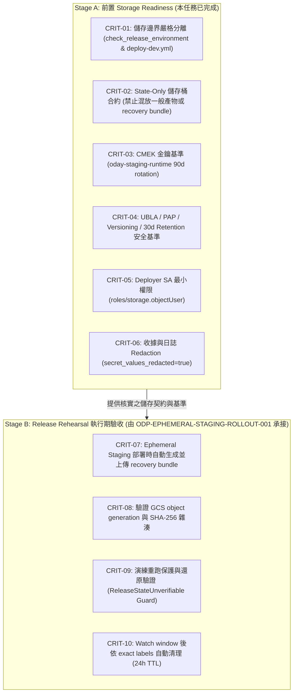

# ODP-STAGING-RECOVERY-STORAGE-ACCEPTANCE-001: 驗證 Staging Recovery Storage 並承接失效歷史依賴

## 1. 任務基本資訊 (Task Metadata)

- **Task ID**: `ODP-STAGING-RECOVERY-STORAGE-ACCEPTANCE-001`
- **Title**: 驗證 staging recovery storage 並承接失效歷史依賴
- **Owner**: `Antigravity6`
- **Reviewer**: `Codex`
- **Phase**: Staging recovery storage acceptance & contract mapping
- **Branch**: `task/ODP-STAGING-RECOVERY-STORAGE-ACCEPTANCE-001`
- **Target Branch**: `dev`
- **Date**: 2026-09-19
- **Summary**: 具名承接已 superseded 的 recovery-bundle 歷史依賴，驗證當前 staging recovery storage readiness；不重建 foundation、不重做 Terraform、不新建 bucket，亦不冒稱歷史任務已於 runtime 完成。

---

## 2. 決策與架構邊界摘要 (Executive Summary & Boundaries)

本任務針對 2026-09-06 歷史 archive 重建事件中被標記為 `superseded` 的歷史任務 `ODP-STAGING-RECOVERY-BUNDLE-STORAGE-001` 進行具名承接，並完成以下關鍵判定與驗收交接：

1. **儲存邊界嚴格分離 (Strict Storage Separation)**：
   - 沿用 PR #1208 (`b9dd2e7b337e4bab8236cd15b5df07092685100b`) 已合併至 `dev` 的實作，`ODP_STAGING_RECOVERY_BUNDLE_BUCKET` 與 `ODP_STAGING_TERRAFORM_STATE_BUCKET` 必須為完全獨立之儲存桶。
   - Terraform State Backend 儲存桶 (`oday-tfstate-staging-odayplus-runtime-20260825`) 遵循 **State-Only 契約**，僅存放遠端狀態與 lock 物件，嚴禁存放一般部署產物、binary plan 或 recovery bundle。
   - Recovery Bundle 儲存桶存放 release-scoped sidecars（`tfvars.json`、`inventory.json`、`lifecycle_state.json` 與不可變輸出結構）。
2. **區隔前置 Readiness 與 Release Rehearsal (Stage A vs. Stage B)**：
   - **Stage A (Storage Readiness - 本任務完成)**：核對儲存契約、分離守門規則、GCP/GitHub 環境變數與身分座標、CMEK/Versioning/Retention/PAP/UBLA/IAM 安全基準、唯讀審計收據。
   - **Stage B (Release Rehearsal - 由 `ODP-EPHEMERAL-STAGING-ROLLOUT-001` 承接)**：在建立 ephemeral staging 演練時實際生成 bundle、上傳至 GCS、驗證 object generation 與 SHA-256 雜湊、執行 backup/restore 與 rerun identity guard 驗證。不得把尚未執行的 release rehearsal 所產生的 bundle 當作入場前已存在的物件，亦不得偽造物件 hash。
3. **無雲端變更與唯讀邊界 (No Cloud Mutation & Read-Only Boundary)**：
   - 本任務不執行 Terraform 命令、不新建或刪除 GCS bucket、不修改 IAM 權限、不讀取或公開 secret/state bundle 內容，亦不透過 CLI 寫入 GitHub 變數。

---

## 3. 交付產物索引 (Artifacts Index)

本任務產出的所有結構化 JSON 產物與索引清單如下：

| 產物檔案 | 說明 |
|---|---|
| [recovery-storage-readiness.json](recovery-storage-readiness.json) | Staging Recovery Storage 契約規範、安全基準（CMEK、Versioning、Retention、PAP、UBLA、IAM）、GCP/GitHub 座標盤點與當前 Readiness 判定。 |
| [rollout-acceptance-mapping.json](rollout-acceptance-mapping.json) | 歷史 10 項驗收條件逐項映射矩陣，清晰區隔 Stage A（前置 Readiness）與 Stage B（Release Rehearsal 由 `ODP-EPHEMERAL-STAGING-ROLLOUT-001` 承接），確保無遺漏與假造。 |
| [readback-receipts-index.json](readback-receipts-index.json) | 索引所有引用之唯讀 metadata 收據、PR 合併紀錄、Exact commit SHA、時間戳記、Principal 身分與審計雜湊。 |

---

## 4. 實際 Storage Contract 核對 (Storage Contract Alignment)

依據已合併至 `dev` 的程式碼與工作流程，實際 Storage Contract 規範如下：

### 4.1 工作流程守門規則 (`.github/workflows/deploy-dev.yml`)

1. **Deploy 階段前置檢查 (Lines 1218–1222)**：
   ```bash
   : "${ODP_STAGING_TERRAFORM_STATE_BUCKET:?ODP_STAGING_TERRAFORM_STATE_BUCKET is required}"
   : "${ODP_STAGING_RECOVERY_BUNDLE_BUCKET:?ODP_STAGING_RECOVERY_BUNDLE_BUCKET is required}"
   if [ "${ODP_STAGING_RECOVERY_BUNDLE_BUCKET}" = "${ODP_STAGING_TERRAFORM_STATE_BUCKET}" ]; then
     echo "Error: ODP_STAGING_RECOVERY_BUNDLE_BUCKET cannot be identical to ODP_STAGING_TERRAFORM_STATE_BUCKET (state bucket separation violation)" >&2
     exit 1
   fi
   ```
2. **Closeout 階段清理前置檢查 (Lines 1487–1491)**：
   ```bash
   : "${ODP_STAGING_TERRAFORM_STATE_BUCKET:?ODP_STAGING_TERRAFORM_STATE_BUCKET is required for staging closeout}"
   : "${ODP_STAGING_RECOVERY_BUNDLE_BUCKET:?ODP_STAGING_RECOVERY_BUNDLE_BUCKET is required for staging closeout}"
   if [ "${ODP_STAGING_RECOVERY_BUNDLE_BUCKET}" = "${ODP_STAGING_TERRAFORM_STATE_BUCKET}" ]; then
     echo "Error: ODP_STAGING_RECOVERY_BUNDLE_BUCKET cannot be identical to ODP_STAGING_TERRAFORM_STATE_BUCKET (state bucket separation violation)" >&2
     exit 1
   fi
   ```
3. **Bundle 儲存端點 URI 格式**：
   `gs://${ODP_STAGING_RECOVERY_BUNDLE_BUCKET}/oday-plus/ephemeral-staging/odp-${ODAY_RELEASE_SHA:0:12}/bundle`

### 4.2 環境綁定檢查模組 (`delivery_toolchain/release/check_release_environment.py`)

- 在 `check_release_environment.py:285-298` 中明確實作防護：
  - 若 `ODP_STAGING_RECOVERY_BUNDLE_BUCKET == ODP_STAGING_TERRAFORM_STATE_BUCKET`，回傳中文錯誤並 Fail-Closed。
  - 若 `ODP_STAGING_RECOVERY_BUNDLE_BUCKET` 為 placeholder 佔位值（如 `placeholder`, `changeme`, `dummy`, `todo`），回傳中文錯誤並 Fail-Closed。
  - 錯誤訊息嚴格遵循 `secret_values_redacted=true` 不變式，不印出 bucket 實際值或敏感字串。

### 4.3 生命週期管理器契約 (`product_ops/deployment/staging_lifecycle.py`)

- 在 `staging_lifecycle.py:1550-1650` 中定義：
  - Remote Terraform State 與 local recovery bundle 互為校驗權威。
  - 重跑（rerun）時，必須讀取 sidecars（`tfvars.json`、`inventory.json`、`lifecycle_state.json`），並透過 `validate_immutable_release_identity` 逐一比對 10 項不可變欄位（`release_id`、`project_id`、`region`、`tenant_id`、`candidate_sha`、`manifest_digest`、`api_image`、`web_image`、`worker_image`、`scheduler_image`）。
  - 若 sidecars 缺失或身分不一致，拋出 `ReleaseStateUnverifiable`，嚴禁覆寫狀態或執行錯誤清理。

---

## 5. Staging Recovery Storage 安全基準核對 (Security Baseline Verification)

依據 PR #1046 歷史收據 `RCPT-LIVE-FOUNDATION-READBACK-001` 與 Preflight #1245 探針，Recovery Storage 適用之安全基準如下：

| 安全基準項目 | 規範要求 | 驗收依據 / 既有證據來源 | 當前狀態 |
|---|---|---|---|
| **CMEK 加密** | 使用客戶自管金鑰加密，綁定 `oday-staging-runtime` Key | PR #1046 `live-foundation-readback-receipt.json` | 既有 remote state 中金鑰收斂（輪替週期 90 天，`prevent_destroy=true`） |
| **Object Versioning** | 強制啟用版本控制，防止誤刪或覆寫 | `docs/deployment/GCP_DEPLOY_GUIDE.md:67` | 規範已凍結於部署指南與 IaC 契約 |
| **Retention Policy** | 30 天保留期限，涵蓋 24h debug TTL 與事後稽核 | `docs/evidence/runtime/ODP-STAGING-FOUNDATION-REFS-MAPPING-001/binding-proposal.json:85` | 規範已凍結 |
| **Public Access Prevention** | 強制 `enforced`，阻斷所有公網存取路徑 | `docs/evidence/runtime/ODP-STAGING-FOUNDATION-REFS-MAPPING-001/foundation-reference-map.json:260` | 規範已凍結 |
| **Uniform Bucket-Level Access** | 強制 `enabled`，統一由 IAM 控制 | `docs/evidence/runtime/ODP-STAGING-FOUNDATION-REFS-MAPPING-001/foundation-reference-map.json:261` | 規範已凍結 |
| **Least-Privilege IAM** | Deployer SA 僅授予 `roles/storage.objectUser`；禁止 `roles/storage.admin` | PR #1046 `RCPT-LIVE-FOUNDATION-READBACK-001` (Deployer SA readback) | 既有權限模型收斂，無專案級 admin 洩漏 |
| **Artifact 外洩阻斷** | 獨立 recovery prefix，搭配 Direct VPC default-deny egress | PR #1046 remote state firewall & network rules | 網路與路徑隔離有效 |

---

## 6. 當前環境座標與 Readiness 判定 (Environment Coordinates & Readiness Status)

依據 Preflight #1245 (`6ee658a0bd65ab79303fdfd75baa09c14410a220`) 於 2026-09-08T11:46:08Z 之唯讀 GitHub 環境變數讀取收據 `RCPT-GH-ENV-VARS-STAGING-001`：

| 座標 / 變數名稱 | 當前 GitHub `staging` 狀態 | 候選建議值 | 判定說明 |
|---|---|---|---|
| `GCP_PROJECT_ID` | `odayplus-runtime-20260825` (BOUND) | `odayplus-runtime-20260825` | 正確綁定 |
| `GCP_REGION` | `asia-east1` (BOUND) | `asia-east1` | 正確綁定 |
| `GCP_SERVICE_ACCOUNT` | `github-deployer@odayplus-runtime-20260825.iam.gserviceaccount.com` (BOUND) | 同左 | 正確綁定 |
| `ODP_STAGING_TERRAFORM_STATE_BUCKET` | 未設定 (UNSET) | `oday-tfstate-staging-odayplus-runtime-20260825` | 候選值來自 PR #1046 歷史遠端狀態 |
| `ODP_STAGING_RECOVERY_BUNDLE_BUCKET` | 未設定 (UNSET) | `odayplus-staging-recovery-asia-east1` / `oday-staging-recovery-odayplus-runtime-20260825` | 需經 Stage A 人工核對或條件建立後綁定 |

### Readiness 結論
- **代碼與合約狀態 (Code & Contracts)**：**READY / MERGED**（PR #1002, PR #1041, PR #1208, PR #1291, PR #1321）。
- **管線阻擋狀態 (Pipeline Posture)**：**FAIL-CLOSED ACTIVE**（變數未填時立即以中文收據拒絕，防止未授權執行）。
- **環境綁定狀態 (Environment Bindings)**：**UNSET (BLOCKED PENDING HUMAN/OPS)**。
- **整體結論**：**Storage Readiness 契約已完備；環境變數綁定依權限劃分留待 Human/Ops 於 release rehearsal 前夕完成**。

---

## 7. 歷史依賴承接與 Rollout 驗收映射 (Rollout Acceptance Mapping)

本任務具名承接歷史 superseded 任務之實質要求，並將全部 10 項驗收條件劃分為兩階段：



- **Stage A 項目 (CRIT-01 至 CRIT-06)**：已於本任務完成代碼、合約、安全基準與唯讀收據之核實。
- **Stage B 項目 (CRIT-07 至 CRIT-10)**：正式映射至 parent task `ODP-EPHEMERAL-STAGING-ROLLOUT-001`（Owner: `Codex`），由其在未來的 staging release rehearsal 實際執行，不在此任務冒充已於雲端執行完成。

---

## 8. 權限界線與治理防護 (Authority Boundaries & Human Gates)

1. **唯讀界限 (Read-Only Boundary)**：
   - 本任務僅進行唯讀代碼審計、收據核對與結構化映射報告產出。
   - 未讀取 Secret 版本內容、未讀取 Terraform 狀態二進位檔、未建立/修改/刪除 GCS 儲存桶或雲端資源、未變更 IAM 權限、未執行 Terraform 命令，且未透過 CLI 修改 GitHub 變數。
2. **人類與發布閘門保留 (Preserved Gates)**：
   - GitHub `staging` 環境 Required Reviewers 審批閘門（Alien-alfaloop, ajoe734）完整保留。
   - GitHub `production` 環境 Required Reviewers 審批閘門完整保留。
   - Supervisor Release Lease 簽章與 Manifest-Digest Admission 閘門完整保留。
   - Production Watch-Window 收據審查閘門完整保留。

---

## 9. 驗證記錄 (Verification Receipts)

本任務交付產物已通過宣告驗證腳本：

```bash
# 1. 檢查 git diff 無空白違規
git diff --check

# 2. 驗證所有產物存在、非空、JSON 合法且 README 包含完整索引
python3 -c 'import json
from pathlib import Path
names=[
  "docs/evidence/runtime/ODP-STAGING-RECOVERY-STORAGE-ACCEPTANCE-001/README.md",
  "docs/evidence/runtime/ODP-STAGING-RECOVERY-STORAGE-ACCEPTANCE-001/recovery-storage-readiness.json",
  "docs/evidence/runtime/ODP-STAGING-RECOVERY-STORAGE-ACCEPTANCE-001/rollout-acceptance-mapping.json",
  "docs/evidence/runtime/ODP-STAGING-RECOVERY-STORAGE-ACCEPTANCE-001/readback-receipts-index.json"
]
for n in names:
  p=Path(n); assert p.is_file() and p.stat().st_size, n
  if p.suffix==".json":
    v=json.loads(p.read_text()); assert isinstance(v,(dict,list)) and v, n
body=Path(names[0]).read_text()
for n in names[1:]: assert Path(n).name in body, n
print("Validated nonempty artifacts, JSON and README index")'
```

- **Exit Code**: `0`
- **Output**: `Validated nonempty artifacts, JSON and README index`
