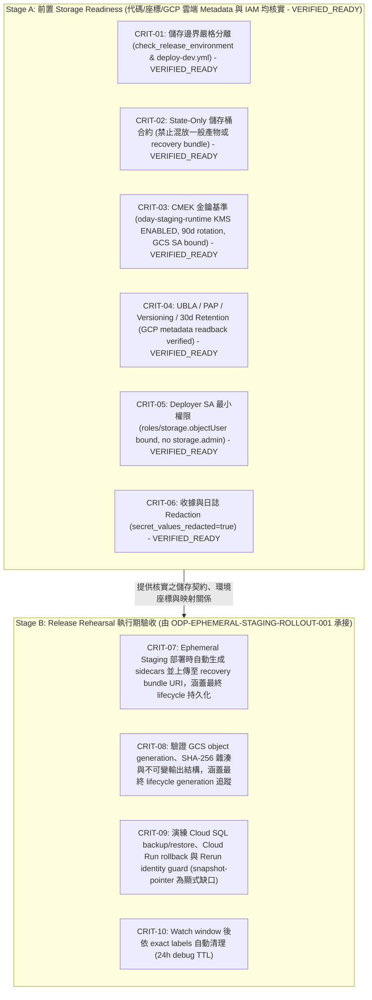

# ODP-STAGING-RECOVERY-STORAGE-ACCEPTANCE-001: 驗證 Staging Recovery Storage 並承接失效歷史依賴

## 1. 任務基本資訊 (Task Metadata)

- **Task ID**: `ODP-STAGING-RECOVERY-STORAGE-ACCEPTANCE-001`
- **Title**: 驗證 staging recovery storage 並承接失效歷史依賴
- **Owner**: `Antigravity2`
- **Reviewer**: `Codex`
- **Phase**: Staging recovery storage acceptance & contract mapping
- **Branch**: `task/ODP-STAGING-RECOVERY-STORAGE-ACCEPTANCE-001`
- **Target Branch**: `dev`
- **Date**: 2026-09-20
- **Summary**: 具名承接已 superseded 的 recovery-bundle 歷史依賴，核實當前 staging recovery storage readiness 與環境座標；不重建 foundation、不重做 Terraform、不新建 bucket，亦不冒稱歷史任務已於 runtime 驗證完成。

---

## 2. 決策與架構邊界摘要 (Executive Summary & Boundaries)

本任務針對歷史 archive 重建事件中被標記為 `superseded` 的歷史任務 `ODP-STAGING-RECOVERY-BUNDLE-STORAGE-001` 進行具名承接，並完成以下關鍵判定與驗收交接：

1. **儲存邊界嚴格分離 (Strict Storage Separation)**：
   - 沿用 PR #1208 (`b9dd2e7b337e4bab8236cd15b5df07092685100b`) 已合併至 `dev` 的實作，`ODP_STAGING_RECOVERY_BUNDLE_BUCKET` 與 `ODP_STAGING_TERRAFORM_STATE_BUCKET` 必須為完全獨立之儲存桶。
   - Terraform State Backend 儲存桶 (`oday-tfstate-staging-odayplus-runtime-20260825`) 遵循 **State-Only 契約**，僅存放遠端狀態與 lock 物件，嚴禁存放一般部署產物、binary plan 或 recovery bundle。
   - Recovery Bundle 儲存桶存放 release-scoped sidecars（`*.tfvars.json`、`*.inventory.json`、`*.lifecycle.json` 與 `staging-terraform-outputs.json`）。
2. **區隔前置 Readiness 與 Release Rehearsal (Stage A vs. Stage B)**：
   - **Stage A (Storage Readiness - 本任務核實範圍)**：
     - 代碼與合約狀態：**VERIFIED / READY**（守門規則、Fail-closed 機制、收據去敏化契約已收斂）。
     - GitHub 環境座標狀態：**BOUND / VERIFIED**（2026-09-19 live readback 確認 State/Recovery Bucket、Deployer SA、KMS Key、VPC Network 皆已綁定）。
     - Live GCP 雲端 Metadata 與 IAM 狀態：**VERIFIED / READY**（2026-09-20 透過授權之 `admin@dev.cctech-support.com` 與專案 owner `deborah.lu@dev.cctech-support.com` 讀回之 GCP 儲存桶 metadata、KMS metadata、儲存桶 IAM 與 KMS IAM policy，所有探針 exit code 0，確認 CMEK 加密、Object Versioning、30 天 Retention、PAP=enforced、UBLA=enabled 及 Deployer SA `roles/storage.objectUser` 綁定完全滿足）。
     - Stage A 總體判定：**STAGE_A_STORAGE_READINESS_VERIFIED_READY**。
   - **Stage B (Release Rehearsal - 由 `ODP-EPHEMERAL-STAGING-ROLLOUT-001` 承接)**：
     - 在建立 ephemeral staging 演練時實際生成 bundle、計算本地 content SHA-256、上傳至 GCS、捕捉真實 object generation、以指定 generation 驗證遠端內容 SHA-256 一致性、涵蓋 hold 狀態重寫後之 new generation 追蹤、執行 Cloud SQL backup/restore drill 與 Cloud Run traffic rollback drill，並驗證 rerun identity guard。
     - 不得把尚未執行的 release rehearsal 所產生的 bundle 當作入場前已存在的物件，亦不得偽造物件 hash。
     - 揭露 snapshot-pointer restore 尚未在 `staging_lifecycle.py` 實作之顯式缺口。
3. **無雲端變更與唯讀邊界 (No Cloud Mutation & Read-Only Boundary)**：
   - 本任務不執行 Terraform 命令、不新建或刪除 GCS bucket、不修改 IAM 權限、不讀取或公開 secret/state bundle 內容，亦不透過 CLI 寫入 GitHub 變數。

---

## 3. 交付產物索引 (Artifacts Index)

本任務產出的所有結構化 JSON 產物、去敏收據與索引清單如下：

| 產物檔案 | 說明 |
|---|---|
| [README.md](README.md) | 本任務完整報告、決策邊界、安全基準核實、CRIT-08 流程規範與審查歷史紀錄。 |
| [recovery-storage-readiness.json](recovery-storage-readiness.json) | Staging Recovery Storage 契約規範、安全基準（CMEK、Versioning、Retention、PAP、UBLA、IAM）、GitHub Actions runner 產物上傳邊界、GCP/GitHub 座標盤點、Stage A 驗證判定與 Blocker 解鎖紀錄。 |
| [rollout-acceptance-mapping.json](rollout-acceptance-mapping.json) | 歷史 10 項驗收條件逐項映射矩陣，清晰區隔 Stage A（前置 Readiness，狀態為 VERIFIED_READY）與 Stage B（Release Rehearsal 由 `ODP-EPHEMERAL-STAGING-ROLLOUT-001` 承接），提供 CRIT-08 完整之可執行 SHA-256/Generation/Hold 流程接點、權限要求、收據欄位、失敗條件與顯式缺口揭露。 |
| [readback-receipts-index.json](readback-receipts-index.json) | 索引所有引用之唯讀 metadata 收據、PR 合併紀錄、GitHub 變數讀取收據、2026-09-20 授權登入讀回收據、歷史探針紀錄與審計雜湊。 |
| [rcpt-gcp-recovery-bucket-metadata-20260920.json](rcpt-gcp-recovery-bucket-metadata-20260920.json) | 2026-09-20T06:53:16Z admin 讀回之 gs://oday-staging-recovery-odayplus-runtime-20260825 儲存桶 metadata 收據 (exit 0, SHA: `6aa9a1b7...`)。 |
| [rcpt-gcp-kms-metadata-20260920.json](rcpt-gcp-kms-metadata-20260920.json) | 2026-09-20T06:53:16Z admin 讀回之 oday-staging-runtime KMS 金鑰 metadata 收據 (exit 0, SHA: `d3bd138a...`)。 |
| [rcpt-gcp-recovery-bucket-iam-20260920.json](rcpt-gcp-recovery-bucket-iam-20260920.json) | 2026-09-20T07:18:09Z project owner Deborah 讀回之 Recovery Bucket IAM policy 收據 (exit 0, SHA: `ce82bf19...`)。 |
| [rcpt-gcp-kms-iam-20260920.json](rcpt-gcp-kms-iam-20260920.json) | 2026-09-20T07:18:09Z project owner Deborah 讀回之 KMS Key IAM policy 收據 (exit 0, SHA: `91268b63...`)。 |
| [rcpt-gcp-deployer-project-iam-filtered-20260920.json](rcpt-gcp-deployer-project-iam-filtered-20260920.json) | 2026-09-20T06:54:11Z admin 讀回之 Deployer SA 專案層級 IAM 綁定去敏收據 (exit 0, SHA: `1fb2807a...`)。 |

---

## 4. 實際 Storage Contract 核對 (Storage Contract Alignment)

依據已合併至 `dev` 的程式碼與工作流程，實際 Storage Contract 規範如下：

### 4.1 工作流程守門規則 (`.github/workflows/deploy-dev.yml`)

1. **Deploy 階段前置檢查 (Lines 1218–1222)**：
   ```bash
   : "${ODP_STAGING_TERRAFORM_STATE_BUCKET:?ODP_STAGING_TERRAFORM_STATE_BUCKET is required}"
   : "${ODP_STAGING_RECOVERY_BUNDLE_BUCKET:?ODP_STAGING_RECOVERY_BUNDLE_BUCKET is required}"
   if [ "${ODP_STAGING_RECOVERY_BUNDLE_BUCKET}" = "${ODP_STAGING_TERRAFORM_STATE_BUCKET}" ]; then
     echo "Error: ODP_STAGING_RECOVERY_BUNDLE_BUCKET cannot be identical to ODP_STAGING_TERRAFORM_STATE_BUCKET (state bucket separation violation)" >&2
     exit 1
   fi
   ```
2. **Closeout 階段清理前置檢查 (Lines 1487–1491)**：
   ```bash
   : "${ODP_STAGING_TERRAFORM_STATE_BUCKET:?ODP_STAGING_TERRAFORM_STATE_BUCKET is required for staging closeout}"
   : "${ODP_STAGING_RECOVERY_BUNDLE_BUCKET:?ODP_STAGING_RECOVERY_BUNDLE_BUCKET is required for staging closeout}"
   if [ "${ODP_STAGING_RECOVERY_BUNDLE_BUCKET}" = "${ODP_STAGING_TERRAFORM_STATE_BUCKET}" ]; then
     echo "Error: ODP_STAGING_RECOVERY_BUNDLE_BUCKET cannot be identical to ODP_STAGING_TERRAFORM_STATE_BUCKET (state bucket separation violation)" >&2
     exit 1
   fi
   ```
3. **Bundle 儲存端點 URI 格式**：
   `gs://${ODP_STAGING_RECOVERY_BUNDLE_BUCKET}/oday-plus/ephemeral-staging/odp-${ODAY_RELEASE_SHA:0:12}/bundle`

### 4.2 環境綁定檢查模組 (`delivery_toolchain/release/check_release_environment.py`)

- 在 `check_release_environment.py:285-298` 中明確實作防護：
  - 若 `ODP_STAGING_RECOVERY_BUNDLE_BUCKET == ODP_STAGING_TERRAFORM_STATE_BUCKET`，回傳中文錯誤並 Fail-Closed。
  - 若 `ODP_STAGING_RECOVERY_BUNDLE_BUCKET` 為 placeholder 佔位值（如 `placeholder`, `changeme`, `dummy`, `todo`），回傳中文錯誤並 Fail-Closed。
  - 錯誤訊息嚴格遵循 `secret_values_redacted=true` 不變式，不印出 bucket 實際值或敏感字串。

### 4.3 生命週期管理器契約 (`product_ops/deployment/staging_lifecycle.py`)

- 在 `staging_lifecycle.py:1550-1650` 中定義：
  - Remote Terraform State 與 local recovery bundle 互為校驗權威。
  - 重跑（rerun）時，必須讀取 sidecars（`*.tfvars.json`、`*.inventory.json`、`*.lifecycle.json`、`staging-terraform-outputs.json`），並透過 `validate_immutable_release_identity` 逐一比對 10 項不可變欄位（`release_id`、`project_id`、`region`、`tenant_id`、`candidate_sha`、`manifest_digest`、`api_image`、`web_image`、`worker_image`、`scheduler_image`）。
  - 若 sidecars 缺失或身分不一致，拋出 `ReleaseStateUnverifiable`，嚴禁覆寫狀態或執行錯誤清理。

---

## 5. Staging Recovery Storage 安全基準與現況核對 (Security Baseline Status)

Recovery Storage 規範要求與 2026-09-20 現場讀結果核對如下（安全基準規範引用自 `origin/dev:docs/evidence/runtime/ODP-STAGING-FOUNDATION-REFS-MAPPING-001/binding-proposal.json:78-87` 及 `docs/deployment/EPHEMERAL_STAGING_PRODUCTION_ROLLOUT_PLAN.md:99,104,248`）：

| 安全基準項目 | 規範要求 | 驗收依據 / 規範來源 | 2026-09-20 現場核實結果 | 判定狀態 |
|---|---|---|---|---|
| **CMEK 加密** | 使用客戶自管金鑰加密，綁定 `oday-staging-runtime` Key (90d rotation, `prevent_destroy=true`) | `binding-proposal.json:80`, `EPHEMERAL_STAGING_PRODUCTION_ROLLOUT_PLAN.md:99`, `ODP_STAGING_KMS_KEY_ID` 已綁定 (`RCPT-GH-ENV-VARS-STAGING-002`) | **PASS**：`default_kms_key` 指向 `projects/odayplus-runtime-20260825/locations/asia-east1/keyRings/oday-staging-runtime/cryptoKeys/oday-staging-runtime`；KMS key state 為 `ENABLED`，purpose 為 `ENCRYPT_DECRYPT`，rotation period 為 `7776000s` (90 天)；GCS service agent (`service-767864276141@gs-project-accounts.iam.gserviceaccount.com`) 已被授予 `roles/cloudkms.cryptoKeyEncrypterDecrypter`（`RCPT-GCP-KMS-METADATA-20260920`, `RCPT-GCP-KMS-IAM-20260920`）。註：`prevent_destroy` 係 Terraform IaC 程式碼與生命週期契約。 | **VERIFIED_READY** |
| **Object Versioning** | 強制啟用版本控制，防止誤刪或覆寫 | `binding-proposal.json:80`, `EPHEMERAL_STAGING_PRODUCTION_ROLLOUT_PLAN.md:104` | **PASS**：`versioning_enabled: true` (`RCPT-GCP-RECOVERY-BUCKET-METADATA-20260920`) | **VERIFIED_READY** |
| **Retention Policy** | 30 天保留期限，涵蓋 24h debug TTL 與事後稽核 | `binding-proposal.json:80`, `EPHEMERAL_STAGING_PRODUCTION_ROLLOUT_PLAN.md:104` | **PASS**：`retentionPeriod: "2592000"` 秒 (30 天) (`RCPT-GCP-RECOVERY-BUCKET-METADATA-20260920`) | **VERIFIED_READY** |
| **Public Access Prevention** | 強制 `enforced`，阻斷所有公網存取路徑 | `binding-proposal.json:80`, `EPHEMERAL_STAGING_PRODUCTION_ROLLOUT_PLAN.md:104` | **PASS**：`public_access_prevention: "enforced"` (`RCPT-GCP-RECOVERY-BUCKET-METADATA-20260920`) | **VERIFIED_READY** |
| **Uniform Bucket-Level Access** | 強制 `enabled`，統一由 IAM 控制 | `binding-proposal.json:80`, `EPHEMERAL_STAGING_PRODUCTION_ROLLOUT_PLAN.md:104` | **PASS**：`uniform_bucket_level_access: true` (`RCPT-GCP-RECOVERY-BUCKET-METADATA-20260920`) | **VERIFIED_READY** |
| **Least-Privilege IAM** | Deployer SA 僅授予 `roles/storage.objectUser`；禁止 `roles/storage.admin` | `binding-proposal.json:81`, `EPHEMERAL_STAGING_PRODUCTION_ROLLOUT_PLAN.md:248`, `ODP_STAGING_DEPLOYER_SERVICE_ACCOUNT` 已綁定 (`RCPT-GH-ENV-VARS-STAGING-002`) | **PASS**：Deployer SA `serviceAccount:github-deployer@odayplus-runtime-20260825.iam.gserviceaccount.com` 於 Recovery Bucket 綁定 `roles/storage.objectUser` (`RCPT-GCP-RECOVERY-BUCKET-IAM-20260920`)；專案與儲存桶層級均無 `roles/storage.admin`、`roles/owner` 或 `roles/editor` (`RCPT-GCP-DEPLOYER-PROJECT-IAM-FILTERED-20260920`) | **VERIFIED_READY** |

---

## 6. GitHub Actions Runner Artifact 隔離與外洩防護 (Artifact Leakage Protection Boundary)

在 `.github/workflows/deploy-dev.yml` 中，GitHub Actions runner 產物上傳邊界受到以下三層嚴格保護：

1. **嚴格顯式檔案白名單 (`upload-artifact@v4`)**：
   - **Staging 生命週期收據 (Lines 1336–1345)**：
     - `.odp_data/release/staging-lifecycle-create.json`
     - `.odp_data/release/staging-rehearsal-receipt.json`
     - `.odp_data/release/staging-lifecycle-hold.json`
   - **部署驗證報告 (Lines 1364–1397)**：
     - 僅上傳 9 份顯式白名單之報告檔案（`cloud-run-preflight.json`、`cloud-run-smoke.json`、`cloud-run-migration-compatibility.json`、`live-e2e-gate.json`、`public-egress-probe.json`、`cloud-run-jobs/migration-validation.json`、`cloud-run-jobs/scheduler-validation.json`、`cloud-run-jobs/worker-validation.json`、`staging-${{ github.run_id }}.json`）。
     - **排除原始除錯傾印**：原始 `gcloud run jobs describe` / `executions describe` 產物（`*-job.json`、`*-execution.json`、`*-execution-list.json`）包含完整環境區塊與 secret selectors，**嚴禁上傳至 GitHub artifacts**。
   - **Staging 收尾收據 (Lines 1541–1550)**：
     - `.odp_data/release/staging-closeout-environment-receipt.json`
     - `.odp_data/release/production-watch-window-receipt.json`
     - `.odp_data/release/staging-lifecycle-cleanup.json`
2. **私密物件與狀態隔離 (Confidential Object Isolation)**：
   - Terraform 遠端狀態 (`.tfstate`) 僅留存於專屬 State Bucket (`oday-tfstate-staging-odayplus-runtime-20260825`)，絕不上傳為 Actions artifact。
   - Recovery Bundle sidecars（`*.tfvars.json`、`*.inventory.json`、`*.lifecycle.json`、`staging-terraform-outputs.json`）僅上傳至專屬 Recovery Storage (`gs://${ODP_STAGING_RECOVERY_BUNDLE_BUCKET}/.../bundle`)，絕不上傳為 Actions artifact。
   - Binary plan 與 Secret 敏感值絕不進入任何 artifact。
3. **收據去敏化契約 (Receipt Redaction Invariant)**：
   - 環境預檢與部署驗證收據產出腳本（`check_release_environment.py`、deploy-dev.yml 中的 validation report 產生步驟）保證 `secret_values_redacted: true`（僅記錄檢查名稱、通過狀態與變數名稱，不輸出實際密鑰值），並經 `tests/ops/test_deploy_workflow_contract.py` 與 `tests/release/test_release_environment_precheck.py` 測試鎖定。Lifecycle create/cleanup 收據本身不攜帶 `secret_values_redacted` 旗標，但其內容設計為 intentionally secret-free 的已驗證資源輸出，不包含 secret 值。未發現實際 secret 洩露。

---

## 7. 當前環境座標與 Readiness 判定 (Environment Coordinates & Readiness Status)

依據 GitHub 環境變數讀取收據 `RCPT-GH-ENV-VARS-STAGING-002` 與 2026-09-20 GCP metadata 讀回收據：

| 座標 / 變數名稱 | 當前 GitHub `staging` 狀態 | 綁定值 | 判定說明 |
|---|---|---|---|
| `GCP_PROJECT_ID` | **BOUND** | `odayplus-runtime-20260825` | 項目 ID 正確綁定 |
| `GCP_REGION` | **BOUND** | `asia-east1` | 區域正確綁定 |
| `GCP_SERVICE_ACCOUNT` | **BOUND** | `github-deployer@odayplus-runtime-20260825.iam.gserviceaccount.com` | Deployer SA 正確綁定 |
| `ODP_STAGING_TERRAFORM_STATE_BUCKET` | **BOUND** | `oday-tfstate-staging-odayplus-runtime-20260825` | State 儲存桶已綁定 (2026-09-12) |
| `ODP_STAGING_RECOVERY_BUNDLE_BUCKET` | **BOUND / VERIFIED** | `oday-staging-recovery-odayplus-runtime-20260825` | Recovery 儲存桶已綁定且雲端 metadata 驗證通過 |
| `ODP_STAGING_DEPLOYER_SERVICE_ACCOUNT` | **BOUND / VERIFIED** | `github-deployer@odayplus-runtime-20260825.iam.gserviceaccount.com` | Staging Deployer SA 已綁定且 IAM 權限已驗證 |
| `ODP_STAGING_KMS_KEY_ID` | **BOUND / VERIFIED** | `projects/odayplus-runtime-20260825/locations/asia-east1/keyRings/oday-staging-runtime/cryptoKeys/oday-staging-runtime` | Staging KMS Key 已綁定且金鑰狀態已驗證 |
| `ODP_STAGING_VPC_NETWORK` | **BOUND** | `oday-staging-runtime` | VPC 網路已綁定 (2026-09-12) |
| `ODP_STAGING_VPC_SUBNETWORK` | **BOUND** | `oday-staging-runtime` | VPC 子網路已綁定 (2026-09-12) |

### 7.1 2026-09-20 GCP 現場讀回收據 (GCP Live Readback Receipts)

1. **Recovery Bucket Metadata 收據** (`RCPT-GCP-RECOVERY-BUCKET-METADATA-20260920`):
   - Command: `gcloud --quiet --account=admin@dev.cctech-support.com storage buckets describe gs://oday-staging-recovery-odayplus-runtime-20260825 '--format=json(name,location,default_kms_key,versioning_enabled,retention_policy,public_access_prevention,uniform_bucket_level_access,creation_time,update_time)'`
   - Exit Code: `0` (Duration: `2.633s`)
   - Source SHA256: `6aa9a1b7a48253d140af708ba118177c3d0a0a0bc49c85ef4260fb2754e1d005`
   - Verified: bucket location `ASIA-EAST1`, default KMS key `projects/odayplus-runtime-20260825/locations/asia-east1/keyRings/oday-staging-runtime/cryptoKeys/oday-staging-runtime`, `versioning_enabled=true`, `uniform_bucket_level_access=true`, `public_access_prevention=enforced`, `retentionPeriod=2592000` (30 days).
2. **KMS Key Metadata 收據** (`RCPT-GCP-KMS-METADATA-20260920`):
   - Command: `gcloud --quiet --account=admin@dev.cctech-support.com kms keys describe oday-staging-runtime --keyring=oday-staging-runtime --location=asia-east1 --project=odayplus-runtime-20260825 '--format=json(name,purpose,primary.state,rotationPeriod,nextRotationTime)'`
   - Exit Code: `0` (Duration: `2.106s`)
   - Source SHA256: `d3bd138a1e2126ae8597766412f1ac3a8398159f9d84c995f31e420185c0f04e`
   - Verified: key state `ENABLED`, purpose `ENCRYPT_DECRYPT`, rotation period `7776000s` (90 days), next rotation `2026-11-25T08:29:35Z`.
3. **Recovery Bucket IAM Policy 收據** (`RCPT-GCP-RECOVERY-BUCKET-IAM-20260920`):
   - Command: `gcloud --quiet --account=deborah.lu@dev.cctech-support.com storage buckets get-iam-policy gs://oday-staging-recovery-odayplus-runtime-20260825 --format=json`
   - Exit Code: `0` (Duration: `1.985s`)
   - Source SHA256: `ce82bf19dc0151f8c80a42898a51893263ed83320ef36039076ed7144cd539f1`
   - Verified: `serviceAccount:github-deployer@odayplus-runtime-20260825.iam.gserviceaccount.com` bound to `roles/storage.objectUser`.
4. **KMS Key IAM Policy 收據** (`RCPT-GCP-KMS-IAM-20260920`):
   - Command: `gcloud --quiet --account=deborah.lu@dev.cctech-support.com kms keys get-iam-policy oday-staging-runtime --keyring=oday-staging-runtime --location=asia-east1 --project=odayplus-runtime-20260825 --format=json`
   - Exit Code: `0` (Duration: `1.890s`)
   - Source SHA256: `91268b63e0f626515423ce2ddf82e37201a1109d0f4d3cfc4ae0e363a9683c9a`
   - Verified: GCS service agent `serviceAccount:service-767864276141@gs-project-accounts.iam.gserviceaccount.com` bound to `roles/cloudkms.cryptoKeyEncrypterDecrypter`.
5. **Filtered Deployer Project IAM Policy 收據** (`RCPT-GCP-DEPLOYER-PROJECT-IAM-FILTERED-20260920`):
   - Command: `gcloud --quiet --account=admin@dev.cctech-support.com projects get-iam-policy odayplus-runtime-20260825 --format=json`
   - Exit Code: `0` (Duration: `2.476s`)
   - Source SHA256: `1fb2807a89bd8a5917406ad3bc8e07bfd7178db917eb9ca992e3be2ecaa9b0bc`
   - Verified: Deployer SA only possesses project roles `roles/cloudscheduler.admin`, `roles/cloudsql.client`, `roles/run.admin`, `roles/serviceusage.serviceUsageConsumer`; `roles/storage.admin`, `roles/owner`, `roles/editor` are absent.

### 7.2 歷史探針觀察與 Blocker 解除紀錄

- **歷史探針觀察 (Historical Observations on 2026-09-19)**：
  - `RCPT-HISTORICAL-GCP-PROBE-AUTH-TOKEN-001` (exit 0): 證實主機 gcloud 認證機制正常。
  - `RCPT-HISTORICAL-GCP-PROBE-BUCKET-DESCRIBE-001` (exit 1), `RCPT-HISTORICAL-GCP-PROBE-BUCKET-IAM-001` (exit 1), `RCPT-HISTORICAL-GCP-PROBE-KMS-DESCRIBE-001` (exit 1): 紀錄 dev SA 因跨專案權限不足遭遇 IAM denied，當時忠實記錄為外部 Blocker `BLOCKER-EXTERNAL-GCP-IAM-READBACK-001`。
- **Blocker 解除 (`BLOCKER-EXTERNAL-GCP-IAM-READBACK-001-RESOLVED`)**：
  - 2026-09-20 使用者完成 `admin@dev.cctech-support.com` 與專案 owner `deborah.lu@dev.cctech-support.com` 登入，成功讀回所有 5 項 metadata 與 IAM 收據，Blocker 正式標記為 **RESOLVED**。

---

## 8. 歷史依賴承接與 Rollout 驗收映射 (Rollout Acceptance Mapping)

本任務具名承接歷史 superseded 任務之要求，將全部 10 項驗收條件劃分為兩階段：



- **Stage A 項目 (CRIT-01 至 CRIT-06)**：已完成代碼合約、守門邏輯、GitHub 環境座標核對與 2026-09-20 GCP 雲端 metadata/IAM 現場讀回核實，全部 6 項狀態為 **VERIFIED_READY**。
- **Stage B 項目 (CRIT-07 至 CRIT-10)**：正式映射至 parent task `ODP-EPHEMERAL-STAGING-ROLLOUT-001`（Owner: `Antigravity5`，Reviewer: `Codex`）。

### 8.1 Stage B 可執行流程與接點規範 (Executable Stage B Entrypoints)

1. **CRIT-07 (Bundle 生成、上傳與 Hold 狀態重寫)**：
   - **建立與上傳接點**：`.github/workflows/deploy-dev.yml:1236-1271`
   - **執行流程**：
     - `staging_lifecycle.py create` (lines 1240-1260) 於 `${STAGING_STATE_DIR}` 產出 `*.tfvars.json`、`*.inventory.json`、`*.lifecycle.json`，並產出 `${STAGING_OUTPUTS_FILE}` (`staging-terraform-outputs.json`)。
     - 持久化上傳 (lines 1262-1270)：
       ```bash
       for sidecar in "${STAGING_STATE_DIR}"/*.tfvars.json "${STAGING_STATE_DIR}"/*.inventory.json "${STAGING_STATE_DIR}"/*.lifecycle.json; do
         [ -f "${sidecar}" ] || continue
         gcloud storage cp "${sidecar}" "${STAGING_BUNDLE_URI}/$(basename "${sidecar}")"
       done
       gcloud storage cp "${STAGING_OUTPUTS_FILE}" "${STAGING_BUNDLE_URI}/staging-terraform-outputs.json"
       ```
   - **最終 Lifecycle 持久化接點（涵蓋成功 verified 與失敗 hold 兩條路徑）**：`.github/workflows/deploy-dev.yml:1324-1334`（`always()` 條件執行）
      - **成功路徑**：`staging_lifecycle.py verify` (lines 1272-1291) 於驗證通過後由 `_write_lifecycle_state` (staging_lifecycle.py:3322-3342) 將 `*.lifecycle.json` 狀態更新為 `"verified"`；`deploy-dev.yml:1324-1334` 以 `always()` 條件將更新後的 `*.lifecycle.json` 透過 `gcloud storage cp` 重新持久化上傳至 `${STAGING_BUNDLE_URI}/`。此路徑之最終 lifecycle 內容/generation 與初次 create 時不同，必須重取 hash/generation 並更新收據（見 CRIT-08 步驟 5a）。
      - **失敗/Hold 路徑**：當 staging 演練失敗觸發 hold (lines 1306-1323) 時，`staging_lifecycle.py hold` 更新 `*.lifecycle.json`（設定 24h debug TTL 與保留原因），同樣由 `always()` 步驟透過 `gcloud storage cp` 重新持久化上傳至 `${STAGING_BUNDLE_URI}/`。
      - **初次 Create Lineage 保留**：初次 `create` 階段產生的 lifecycle content hash/generation 須作為 lineage 基線記錄保留於收據中；最終持久化（無論 verified 或 hold）產生的新 hash/generation 為獨立收據欄位，兩者共存以追蹤完整演變。
   - **必要權限**：Deployer SA (`github-deployer@odayplus-runtime-20260825.iam.gserviceaccount.com`) 於 Recovery Bucket 具備 `roles/storage.objectUser`。
   - **注意**：Rehearsal bundle 係於演練建立環境時產生，不要求於演練前已存在。
2. **CRIT-08 (GCS Object Generation 與 SHA-256 雜湊驗證)**：
   - **GCS 物件 Metadata 限制**：GCS standard object metadata（依官方 [JSON API objects schema](https://docs.cloud.google.com/storage/docs/json_api/v1/objects)）不提供原生 content SHA-256 欄位；`crc32c` 不能替代 SHA-256，`customerEncryption.keySha256` 係加密金鑰雜湊而非物件內容雜湊。
   - **Stage B 可執行驗收程序 (`ODP-EPHEMERAL-STAGING-ROLLOUT-001`)**：
     1. **本地 Content SHA-256 計算**：在各 sidecar（`*.tfvars.json`、`*.inventory.json`、`*.lifecycle.json`、`staging-terraform-outputs.json`）上傳前，以 `sha256sum "${sidecar}" | awk '{print $1}'` 或 python `hashlib.sha256(path.read_bytes()).hexdigest()` 計算本地內容 SHA-256。
     2. **上傳並捕捉 Generation**：透過 `gcloud storage cp` 上傳各 sidecar 至 `${STAGING_BUNDLE_URI}/`，隨即以 `gcloud storage objects describe "${STAGING_BUNDLE_URI}/$(basename "${sidecar}")" --format='value(generation)'` 抓取真實 GCS 正整數 `generation`，斷言非空且大於 0。
     3. **指定 Generation 遠端一致性校驗**：使用受既有 WIF 支援的 `gcloud storage cp` 搭配 generation precondition 讀回遠端物件（`gcloud storage cp "gs://${ODP_STAGING_RECOVERY_BUNDLE_BUCKET}/${STAGING_BACKEND_PREFIX}/bundle/$(basename "${sidecar}")#${generation}" /tmp/verify_sidecar`），計算遠端內容 SHA-256，並嚴格斷言 `remote_sha256 == local_sha256`。`gcloud storage cp` 支援 `#generation` 語法且使用 `google-github-actions/auth@v2` 匯出的 WIF 認證（見 auth@v2 README：gsutil 不使用此 Action 匯出之 credentials）。
     4. **保存每物件收據**：將 `{object_uri, generation, content_sha256, size_bytes, uploaded_at, secret_values_redacted: true}` 寫入 `staging-lifecycle-create.json` 與 `staging-rehearsal-receipt.json`。
     5. **每次最終 Lifecycle 持久化之 Generation/Hash 追蹤 (`deploy-dev.yml:1324-1334`, `always()` 條件)**：`staging_lifecycle.py` 於驗證成功（`_write_lifecycle_state` 寫入 `"verified"`, staging_lifecycle.py:3322-3342）或失敗 hold（`staging_lifecycle.py hold`, lines 1306-1323, 設定 24h debug TTL）後均會更新 `*.lifecycle.json`；`deploy-dev.yml:1324-1334` 以 `always()` 條件將更新後的 `*.lifecycle.json` 透過 `gcloud storage cp` 重新持久化上傳至 `${STAGING_BUNDLE_URI}/`。無論是 verified 或 hold 路徑，每次最終 lifecycle 寫入後都必須：
         - 重新計算更新後 `*.lifecycle.json` 之本地 SHA-256。
         - 重新上傳至 `${STAGING_BUNDLE_URI}/` 並捕捉新 GCS generation（斷言 `new_generation` 為非空正整數且 `new_generation != initial_generation`；以 `gcloud storage cp --if-generation-match=${initial_generation}` 作為 precondition guard 確認更新目標為預期的前一版本，而非依賴 generation 數值大小排序，因 GCS 僅保證 generation 唯一、不保證遞增）。
         - 以指定 new generation 驗證遠端 SHA-256。
         - 更新收據：記錄 `{initial_create_generation, initial_create_content_sha256, final_generation, final_content_sha256, final_status: "verified"|"hold", uploaded_at}`，保留初次 create lineage 與最終狀態雙欄位以追蹤完整演變。
         - 於 lifecycle receipt artifact upload (`deploy-dev.yml:1336-1344`) 前完成上述收據更新，確保正常成功路徑不會靜默接受未經驗證的最終物件、亦不會將正常的 verified rewrite 誤報為未授權漂移。
     6. **必要權限**：Deployer SA 於 Recovery Bucket 具備 `roles/storage.objectUser`。
     7. **Fail-Closed 條件**：若任一 sidecar 缺失、generation 為空/0、SHA-256 雜湊不符或發生未預期之 generation 漂移，Rehearsal 必須 Fail-Closed。禁止偽造假 hash 或假 generation。
     8. **邊界說明**：上述步驟屬未來 Stage B 演練授權範圍，本任務不要求演練前預先存在 bundle 物件，亦不讀取私密內容。
3. **CRIT-09 (Rehearsal Drills、Restore 與 Rerun Guard)**：
   - **Rehearsal 驗證接點**：`.github/workflows/deploy-dev.yml:1272-1291` 呼叫 `python3 product_ops/deployment/staging_lifecycle.py verify`
     1. **Cloud SQL Backup / Restore Drill (`staging_lifecycle.py:2904-2942`)**：
        - 執行 `gcloud sql export sql ${cloud_sql_instance} gs://${staging_data_bucket}/rehearsal/${release_id}/database.sql --database=${database}`。
        - 執行 `gcloud sql import sql ${cloud_sql_instance} gs://${staging_data_bucket}/rehearsal/${release_id}/database.sql --database=${database}`。
        - 清理匯出檔案 `gcloud storage rm gs://${staging_data_bucket}/rehearsal/${release_id}/database.sql`，並記錄 `restore: succeeded` 收據。
     2. **Cloud Run Traffic Rollback Drill (`staging_lifecycle.py:2943-3076`)**：
        - 建立非流量 rollback probe revision (`--no-traffic`, `--tag=rollback-probe`, `--revision-suffix=...`)。
        - 切換 100% 流量至 probe revision，測試健康讀回 (`/operator` 與 `/platform/health`)。
        - 將流量安全回切至原核准 baseline revision 分配，驗證 traffic readback 完全一致。
     3. **顯式驗收缺口 (Explicit Acceptance Gap)**：
        - 原始規劃之「snapshot-pointer restore」尚未在 `staging_lifecycle.py` 中實作，必須保留為 `ODP-EPHEMERAL-STAGING-ROLLOUT-001` 之顯式驗收缺口，不得回報為已覆蓋。
   - **Closeout Recovery Bundle Readback 接點**：`.github/workflows/deploy-dev.yml:1507-1518`
     ```bash
     gcloud storage cp "${STAGING_BUNDLE_URI}/*" "${STAGING_STATE_DIR}/"
     test -s "${STAGING_STATE_DIR}/staging-terraform-outputs.json"
     inventory_file="$(printf '%s\n' "${STAGING_STATE_DIR}"/*.inventory.json)"
     test -s "${inventory_file}"
     tfvars_file="$(printf '%s\n' "${STAGING_STATE_DIR}"/*.tfvars.json)"
     test -s "${tfvars_file}"
     STAGING_STATE_DIR="${STAGING_STATE_DIR}" TFVARS_FILE="${tfvars_file}" \
       uv run --frozen python -c 'import json, os; from pathlib import Path; d=Path(os.environ["STAGING_STATE_DIR"]); out=json.loads((d / "staging-terraform-outputs.json").read_text()); tf=json.loads(Path(os.environ["TFVARS_FILE"]).read_text()); assert os.environ["MANIFEST_DIGEST"].startswith("sha256:"); assert out["release_id"] == os.environ["STAGING_RELEASE_ID"]; assert tf["release_id"] == os.environ["STAGING_RELEASE_ID"]; assert tf["candidate_sha"] == os.environ["ODAY_RELEASE_SHA"]; assert tf["manifest_digest"] == os.environ["MANIFEST_DIGEST"]'
     ```
   - **重跑保護接點**：`product_ops/deployment/staging_lifecycle.py:1550-1631`
     - `validate_immutable_release_identity()` 逐一核對 10 項不可變身分欄位；若有損壞或不一致拋出 `ReleaseStateUnverifiable` / `ReleaseIdentityConflict`，拒絕覆寫或清理。
4. **CRIT-10 (Ephemeral Cleanup 與 TTL)**：
   - **清理接點**：`.github/workflows/deploy-dev.yml:1526-1540`
     - 呼叫 `staging_lifecycle.py cleanup`，以精確 label matching (`release_id`, `created_at`, `managed_by`) 清理短生命週期資源，保留共用底層。
   - **失敗保留**：`staging_lifecycle.py hold` (lines 1306-1323) 設置 24h debug TTL；由 `scan-orphans` 排程掃描過期資源。

---

## 9. 審查歷史與 Reopen 處置紀錄 (Review History & Reopen Disposition)

本任務經歷 4 次實質審查迭代與外部登入解除後之控制面續辦：

1. **Review 1 / Reopen 1 (2026-09-19)**: 修正探針收據記錄與環境變數映射。
2. **Review 2 / Reopen 2 (2026-09-19)**: 補正執行身分、區隔 dev-runtime SA 與 github-deployer SA。
3. **Review 3 / Reopen 3 (2026-09-19)**: 補正 CRIT-08 詳細流程（本地 SHA-256、GCS generation 捕捉、指定 generation 遠端 SHA-256 比對、hold generation 追蹤）並記錄 Stage A 外部 IAM 權限阻擋狀態。
4. **Dispatch 4 / Readback Blocker Resolution (2026-09-20T07:19Z)**:
   - 使用者恢復 `admin@dev.cctech-support.com` 與專案 owner `deborah.lu@dev.cctech-support.com` 登入。
   - 2026-09-20T06:53Z 至 07:18Z 成功讀回 Recovery Bucket metadata (exit 0)、KMS metadata (exit 0)、Recovery Bucket IAM policy (exit 0, deployer roles/storage.objectUser)、KMS IAM policy (exit 0, GCS SA roles/cloudkms.cryptoKeyEncrypterDecrypter) 及專案 IAM policy (exit 0, 確認 deployer SA 無 storage.admin/owner/editor)。
   - 將所有 5 份去敏收據與 hash 納入交付產物，Stage A 正式推進至 `VERIFIED_READY`，保留三次 substantive review 歷史與 Stage B dependency。
5. **Review 4 / Reopen 4 & Stage B Procedure Corrections (2026-09-20T13:34Z - 14:05Z)**:
   - 審查確認 Stage A 之 5 份現場 GCP metadata/IAM 讀回收據完全支持，Stage A 前置儲存契約正式確認通過。
   - 逐條修復 Stage B 之 3 項程序規範缺陷：
     1. **WIF 支援之 GCS 讀取**：將 CRIT-08 中唯一具體指定 generation 讀取指令由 `gsutil cp` 改為受 `google-github-actions/auth@v2` 匯出認證支援之 `gcloud storage cp`（搭配 `#${generation}` 語法）。
     2. **Generation 唯一性與 Precondition 校驗**：移除 `new_generation > initial_generation` 之數值排序假定（依 GCS 規範 generation 僅保證唯一但不保證單調遞增），改為斷言非空正整數且 `new_generation != initial_generation`，並以 `--if-generation-match=${initial_generation}` 前置條件保護預期前一版本更新。
     3. **涵蓋 Verified 與 Hold 之全量最終 Lifecycle 持久化**：對應現行 `staging_lifecycle.py:3322-3342`（成功時更新為 `verified`）與 `deploy-dev.yml:1324-1334`（`always()` 持久化上傳），將 hash/generation 捕捉、指定 generation 驗證與收據更新明確映射至成功 verified 與失敗 hold 兩條路徑，保留初次 create lineage 與 final state 雙欄位。
     4. **收據去敏審計精確化**：修正全面帶有 `secret_values_redacted` 旗標之不準確敘述，精確區隔環境預檢/驗證報告與本質 secret-free 之 lifecycle create/cleanup 收據。

---

## 10. 權限界線與治理防護 (Authority Boundaries & Human Gates)

1. **唯讀界限 (Read-Only Boundary)**：
   - 本任務僅進行唯讀代碼審計、收據核對、環境變數驗證與結構化映射報告產出。
   - 未讀取 Secret 版本內容、未讀取 Terraform 狀態二進位檔、未建立/修改/刪除 GCS 儲存桶或雲端資源、未變更 IAM 權限、未執行 Terraform 命令，且未透過 CLI 修改 GitHub 變數。
2. **人類與發布閘門保留 (Preserved Gates)**：
   - GitHub `staging` 環境 Required Reviewers 審批閘門（Alien-alfaloop, ajoe734）完整保留。
   - GitHub `production` 環境 Required Reviewers 審批閘門完整保留。
   - Supervisor Release Lease 簽章與 Manifest-Digest Admission 閘門完整保留。
   - Production Watch-Window 收據審查閘門完整保留。

---

## 11. 驗證記錄 (Verification Receipts)

本任務交付產物已通過宣告驗證：

```bash
# 1. 檢查 git diff 無空白違規
git diff --check

# 2. 驗證所有產物存在、非空、JSON 合法且 README 包含完整索引
python3 -c 'import json
from pathlib import Path
names=[
  "docs/evidence/runtime/ODP-STAGING-RECOVERY-STORAGE-ACCEPTANCE-001/README.md",
  "docs/evidence/runtime/ODP-STAGING-RECOVERY-STORAGE-ACCEPTANCE-001/recovery-storage-readiness.json",
  "docs/evidence/runtime/ODP-STAGING-RECOVERY-STORAGE-ACCEPTANCE-001/rollout-acceptance-mapping.json",
  "docs/evidence/runtime/ODP-STAGING-RECOVERY-STORAGE-ACCEPTANCE-001/readback-receipts-index.json",
  "docs/evidence/runtime/ODP-STAGING-RECOVERY-STORAGE-ACCEPTANCE-001/rcpt-gcp-recovery-bucket-metadata-20260920.json",
  "docs/evidence/runtime/ODP-STAGING-RECOVERY-STORAGE-ACCEPTANCE-001/rcpt-gcp-kms-metadata-20260920.json",
  "docs/evidence/runtime/ODP-STAGING-RECOVERY-STORAGE-ACCEPTANCE-001/rcpt-gcp-recovery-bucket-iam-20260920.json",
  "docs/evidence/runtime/ODP-STAGING-RECOVERY-STORAGE-ACCEPTANCE-001/rcpt-gcp-kms-iam-20260920.json",
  "docs/evidence/runtime/ODP-STAGING-RECOVERY-STORAGE-ACCEPTANCE-001/rcpt-gcp-deployer-project-iam-filtered-20260920.json"
]
for n in names:
  p=Path(n); assert p.is_file() and p.stat().st_size, n
  if p.suffix==".json":
    v=json.loads(p.read_text()); assert isinstance(v,(dict,list)) and v, n
body=Path(names[0]).read_text()
for n in names[1:]: assert Path(n).name in body, n
print("Validated nonempty artifacts, JSON and README index")'
```

- **Exit Code**: `0`
- **Output**: `Validated nonempty artifacts, JSON and README index`
