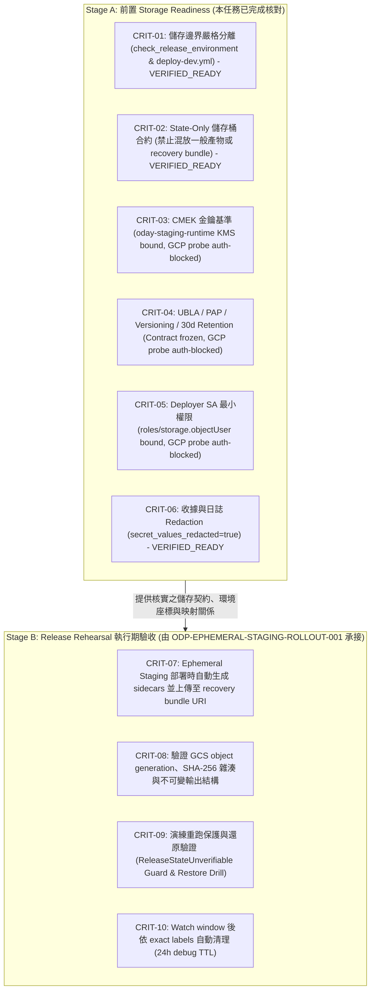

# ODP-STAGING-RECOVERY-STORAGE-ACCEPTANCE-001: 驗證 Staging Recovery Storage 並承接失效歷史依賴

## 1. 任務基本資訊 (Task Metadata)

- **Task ID**: `ODP-STAGING-RECOVERY-STORAGE-ACCEPTANCE-001`
- **Title**: 驗證 staging recovery storage 並承接失效歷史依賴
- **Owner**: `Antigravity6`
- **Reviewer**: `Codex`
- **Phase**: Staging recovery storage acceptance & contract mapping
- **Branch**: `task/ODP-STAGING-RECOVERY-STORAGE-ACCEPTANCE-001`
- **Target Branch**: `dev`
- **Date**: 2026-09-19
- **Summary**: 具名承接已 superseded 的 recovery-bundle 歷史依賴，核實當前 staging recovery storage readiness 與環境座標；不重建 foundation、不重做 Terraform、不新建 bucket，亦不冒稱歷史任務已於 runtime 驗證完成。

---

## 2. 決策與架構邊界摘要 (Executive Summary & Boundaries)

本任務針對歷史 archive 重建事件中被標記為 `superseded` 的歷史任務 `ODP-STAGING-RECOVERY-BUNDLE-STORAGE-001` 進行具名承接，並完成以下關鍵判定與驗收交接：

1. **儲存邊界嚴格分離 (Strict Storage Separation)**：
   - 沿用 PR #1208 (`b9dd2e7b337e4bab8236cd15b5df07092685100b`) 已合併至 `dev` 的實作，`ODP_STAGING_RECOVERY_BUNDLE_BUCKET` 與 `ODP_STAGING_TERRAFORM_STATE_BUCKET` 必須為完全獨立之儲存桶。
   - Terraform State Backend 儲存桶 (`oday-tfstate-staging-odayplus-runtime-20260825`) 遵循 **State-Only 契約**，僅存放遠端狀態與 lock 物件，嚴禁存放一般部署產物、binary plan 或 recovery bundle。
   - Recovery Bundle 儲存桶存放 release-scoped sidecars（`*.tfvars.json`、`*.inventory.json`、`*.lifecycle.json` 與 `staging-terraform-outputs.json`）。
2. **區隔前置 Readiness 與 Release Rehearsal (Stage A vs. Stage B)**：
   - **Stage A (Storage Readiness - 本任務核實範圍)**：
     - 代碼與合約狀態：**VERIFIED / READY**（守門規則、Fail-closed 機制、收據去敏化契約已收斂）。
     - GitHub 環境座標狀態：**BOUND / VERIFIED**（2026-09-19 live readback 確認 State/Recovery Bucket、Deployer SA、KMS Key、VPC Network 皆已綁定）。
     - Live GCP 雲端 Metadata 狀態：**METADATA UNKNOWN (AUTH TOKEN EXPIRED)**。現場執行 `gcloud storage buckets describe` 與 `get-iam-policy` 探針因 non-interactive OAuth token 過期返回 exit 1。如實記錄為認證阻擋，不假造通過，亦不推斷 bucket 缺失或權限被拒。
   - **Stage B (Release Rehearsal - 由 `ODP-EPHEMERAL-STAGING-ROLLOUT-001` 承接)**：
     - 在建立 ephemeral staging 演練時實際生成 bundle、上傳至 GCS、驗證 object generation 與 SHA-256 雜湊、執行 backup/restore 與 rerun identity guard 驗證。
     - 不得把尚未執行的 release rehearsal 所產生的 bundle 當作入場前已存在的物件，亦不得偽造物件 hash。
3. **無雲端變更與唯讀邊界 (No Cloud Mutation & Read-Only Boundary)**：
   - 本任務不執行 Terraform 命令、不新建或刪除 GCS bucket、不修改 IAM 權限、不讀取或公開 secret/state bundle 內容，亦不透過 CLI 寫入 GitHub 變數。

---

## 3. 交付產物索引 (Artifacts Index)

本任務產出的所有結構化 JSON 產物與索引清單如下：

| 產物檔案 | 說明 |
|---|---|
| [recovery-storage-readiness.json](recovery-storage-readiness.json) | Staging Recovery Storage 契約規範、安全基準（CMEK、Versioning、Retention、PAP、UBLA、IAM）、GitHub Actions runner 產物上傳邊界、GCP/GitHub 座標盤點與當前 Readiness 判定。 |
| [rollout-acceptance-mapping.json](rollout-acceptance-mapping.json) | 歷史 10 項驗收條件逐項映射矩陣，清晰區隔 Stage A（前置 Readiness）與 Stage B（Release Rehearsal 由 `ODP-EPHEMERAL-STAGING-ROLLOUT-001` 承接），提供可執行命令接點與 pass/fail 條件。 |
| [readback-receipts-index.json](readback-receipts-index.json) | 索引所有引用之唯讀 metadata 收據、PR 合併紀錄、2026-09-19 GitHub 變數讀取收據、GCP 探針認證阻擋收據與審計雜湊。 |

---

## 4. 實際 Storage Contract 核對 (Storage Contract Alignment)

依據已合併至 `dev` 的程式碼與工作流程，實際 Storage Contract 規範如下：

### 4.1 工作流程守門規則 (`.github/workflows/deploy-dev.yml`)

1. **Deploy 階段前置檢查 (Lines 1218–1222)**：
   ```bash
   : "${ODP_STAGING_TERRAFORM_STATE_BUCKET:?ODP_STAGING_TERRAFORM_STATE_BUCKET is required}"
   : "${ODP_STAGING_RECOVERY_BUNDLE_BUCKET:?ODP_STAGING_RECOVERY_BUNDLE_BUCKET is required}"
   if [ "${ODP_STAGING_RECOVERY_BUNDLE_BUCKET}" = "${ODP_STAGING_TERRAFORM_STATE_BUCKET}" ]; then
     echo "Error: ODP_STAGING_RECOVERY_BUNDLE_BUCKET cannot be identical to ODP_STAGING_TERRAFORM_STATE_BUCKET (state bucket separation violation)" >&2
     exit 1
   fi
   ```
2. **Closeout 階段清理前置檢查 (Lines 1487–1491)**：
   ```bash
   : "${ODP_STAGING_TERRAFORM_STATE_BUCKET:?ODP_STAGING_TERRAFORM_STATE_BUCKET is required for staging closeout}"
   : "${ODP_STAGING_RECOVERY_BUNDLE_BUCKET:?ODP_STAGING_RECOVERY_BUNDLE_BUCKET is required for staging closeout}"
   if [ "${ODP_STAGING_RECOVERY_BUNDLE_BUCKET}" = "${ODP_STAGING_TERRAFORM_STATE_BUCKET}" ]; then
     echo "Error: ODP_STAGING_RECOVERY_BUNDLE_BUCKET cannot be identical to ODP_STAGING_TERRAFORM_STATE_BUCKET (state bucket separation violation)" >&2
     exit 1
   fi
   ```
3. **Bundle 儲存端點 URI 格式**：
   `gs://${ODP_STAGING_RECOVERY_BUNDLE_BUCKET}/oday-plus/ephemeral-staging/odp-${ODAY_RELEASE_SHA:0:12}/bundle`

### 4.2 環境綁定檢查模組 (`delivery_toolchain/release/check_release_environment.py`)

- 在 `check_release_environment.py:285-298` 中明確實作防護：
  - 若 `ODP_STAGING_RECOVERY_BUNDLE_BUCKET == ODP_STAGING_TERRAFORM_STATE_BUCKET`，回傳中文錯誤並 Fail-Closed。
  - 若 `ODP_STAGING_RECOVERY_BUNDLE_BUCKET` 為 placeholder 佔位值（如 `placeholder`, `changeme`, `dummy`, `todo`），回傳中文錯誤並 Fail-Closed。
  - 錯誤訊息嚴格遵循 `secret_values_redacted=true` 不變式，不印出 bucket 實際值或敏感字串。

### 4.3 生命週期管理器契約 (`product_ops/deployment/staging_lifecycle.py`)

- 在 `staging_lifecycle.py:1550-1650` 中定義：
  - Remote Terraform State 與 local recovery bundle 互為校驗權威。
  - 重跑（rerun）時，必須讀取 sidecars（`*.tfvars.json`、`*.inventory.json`、`*.lifecycle.json`、`staging-terraform-outputs.json`），並透過 `validate_immutable_release_identity` 逐一比對 10 項不可變欄位（`release_id`、`project_id`、`region`、`tenant_id`、`candidate_sha`、`manifest_digest`、`api_image`、`web_image`、`worker_image`、`scheduler_image`）。
  - 若 sidecars 缺失或身分不一致，拋出 `ReleaseStateUnverifiable`，嚴禁覆寫狀態或執行錯誤清理。

---

## 5. Staging Recovery Storage 安全基準與現況核對 (Security Baseline Status)

Recovery Storage 規範要求與現場唯讀探針結果如下：

| 安全基準項目 | 規範要求 | 驗收依據 / 既有證據來源 | 當前核實狀態 |
|---|---|---|---|
| **CMEK 加密** | 使用客戶自管金鑰加密，綁定 `oday-staging-runtime` Key (90d rotation, `prevent_destroy=true`) | `ODP_STAGING_KMS_KEY_ID` 已綁定 (`RCPT-GH-ENV-VARS-STAGING-002`) | **CONTRACT_FROZEN_METADATA_UNPROBED**：GCP 現場 describe 探針因 token 過期 exit 1，如實記阻擋，不偽造 pass |
| **Object Versioning** | 強制啟用版本控制，防止誤刪或覆寫 | `docs/deployment/GCP_DEPLOY_GUIDE.md:67` | **CONTRACT_FROZEN_METADATA_UNPROBED**：規範已凍結；GCP 現場探針 exit 1 |
| **Retention Policy** | 30 天保留期限，涵蓋 24h debug TTL 與事後稽核 | `docs/evidence/runtime/ODP-STAGING-FOUNDATION-REFS-MAPPING-001/binding-proposal.json:85` | **CONTRACT_FROZEN_METADATA_UNPROBED**：規範已凍結；GCP 現場探針 exit 1 |
| **Public Access Prevention** | 強制 `enforced`，阻斷所有公網存取路徑 | `docs/evidence/runtime/ODP-STAGING-FOUNDATION-REFS-MAPPING-001/foundation-reference-map.json:260` | **CONTRACT_FROZEN_METADATA_UNPROBED**：規範已凍結；GCP 現場探針 exit 1 |
| **Uniform Bucket-Level Access** | 強制 `enabled`，統一由 IAM 控制 | `docs/evidence/runtime/ODP-STAGING-FOUNDATION-REFS-MAPPING-001/foundation-reference-map.json:261` | **CONTRACT_FROZEN_METADATA_UNPROBED**：規範已凍結；GCP 現場探針 exit 1 |
| **Least-Privilege IAM** | Deployer SA 僅授予 `roles/storage.objectUser`；禁止 `roles/storage.admin` | `ODP_STAGING_DEPLOYER_SERVICE_ACCOUNT` 已綁定 (`RCPT-GH-ENV-VARS-STAGING-002`) | **CONTRACT_FROZEN_METADATA_UNPROBED**：權限模型凍結；GCP 現場 get-iam-policy 探針因 token 過期 exit 1 |

---

## 6. GitHub Actions Runner Artifact 隔離與外洩防護 (Artifact Leakage Protection Boundary)

在 `.github/workflows/deploy-dev.yml` 中，GitHub Actions runner 產物上傳邊界受到以下三層嚴格保護：

1. **嚴格顯式檔案白名單 (`upload-artifact@v4`)**：
   - **Staging 生命週期收據 (Lines 1336–1345)**：
     - `.odp_data/release/staging-lifecycle-create.json`
     - `.odp_data/release/staging-rehearsal-receipt.json`
     - `.odp_data/release/staging-lifecycle-hold.json`
   - **部署驗證報告 (Lines 1364–1397)**：
     - 僅上傳 9 份顯式白名單之報告檔案（`cloud-run-preflight.json`、`cloud-run-smoke.json`、`cloud-run-migration-compatibility.json`、`live-e2e-gate.json`、`public-egress-probe.json`、`cloud-run-jobs/migration-validation.json`、`cloud-run-jobs/scheduler-validation.json`、`cloud-run-jobs/worker-validation.json`、`staging-${{ github.run_id }}.json`）。
     - **排除原始除錯傾印**：原始 `gcloud run jobs describe` / `executions describe` 產物（`*-job.json`、`*-execution.json`、`*-execution-list.json`）包含完整環境區塊與 secret selectors，**嚴禁上傳至 GitHub artifacts**。
   - **Staging 收尾收據 (Lines 1541–1550)**：
     - `.odp_data/release/staging-closeout-environment-receipt.json`
     - `.odp_data/release/production-watch-window-receipt.json`
     - `.odp_data/release/staging-lifecycle-cleanup.json`
2. **私密物件與狀態隔離 (Confidential Object Isolation)**：
   - Terraform 遠端狀態 (`.tfstate`) 僅留存於專屬 State Bucket (`oday-tfstate-staging-odayplus-runtime-20260825`)，絕不上傳為 Actions artifact。
   - Recovery Bundle sidecars（`*.tfvars.json`、`*.inventory.json`、`*.lifecycle.json`、`staging-terraform-outputs.json`）僅上傳至專屬 Recovery Storage (`gs://${ODP_STAGING_RECOVERY_BUNDLE_BUCKET}/.../bundle`)，絕不上傳為 Actions artifact。
   - Binary plan 與 Secret 敏感值絕不進入任何 artifact。
3. **收據去敏化契約 (Receipt Redaction Invariant)**：
   - 所有產出收據的腳本均保證 `secret_values_redacted: true`（僅記錄檢查名稱、通過狀態與變數名稱，不輸出實際密鑰值），並經 `tests/ops/test_deploy_workflow_contract.py` 與 `tests/release/test_release_environment_precheck.py` 測試鎖定。

---

## 7. 當前環境座標與 Readiness 判定 (Environment Coordinates & Readiness Status)

依據 2026-09-19T14:48:43Z 之即時 GitHub 環境變數讀取收據 `RCPT-GH-ENV-VARS-STAGING-002`：

| 座標 / 變數名稱 | 當前 GitHub `staging` 狀態 | 綁定值 | 判定說明 |
|---|---|---|---|
| `GCP_PROJECT_ID` | **BOUND** | `odayplus-runtime-20260825` | 項目 ID 正確綁定 |
| `GCP_REGION` | **BOUND** | `asia-east1` | 區域正確綁定 |
| `GCP_SERVICE_ACCOUNT` | **BOUND** | `github-deployer@odayplus-runtime-20260825.iam.gserviceaccount.com` | Deployer SA 正確綁定 |
| `ODP_STAGING_TERRAFORM_STATE_BUCKET` | **BOUND** | `oday-tfstate-staging-odayplus-runtime-20260825` | State 儲存桶已綁定 (2026-09-12) |
| `ODP_STAGING_RECOVERY_BUNDLE_BUCKET` | **BOUND** | `oday-staging-recovery-odayplus-runtime-20260825` | Recovery 儲存桶已綁定 (2026-09-12) |
| `ODP_STAGING_DEPLOYER_SERVICE_ACCOUNT` | **BOUND** | `github-deployer@odayplus-runtime-20260825.iam.gserviceaccount.com` | Staging Deployer SA 已綁定 (2026-09-12) |
| `ODP_STAGING_KMS_KEY_ID` | **BOUND** | `projects/odayplus-runtime-20260825/locations/asia-east1/keyRings/oday-staging-runtime/cryptoKeys/oday-staging-runtime` | Staging KMS Key 已綁定 (2026-09-12) |
| `ODP_STAGING_VPC_NETWORK` | **BOUND** | `oday-staging-runtime` | VPC 網路已綁定 (2026-09-12) |
| `ODP_STAGING_VPC_SUBNETWORK` | **BOUND** | `oday-staging-runtime` | VPC 子網路已綁定 (2026-09-12) |

> **歷史紀錄說明**：在 2026-09-08 preflight 收據 `RCPT-GH-ENV-VARS-STAGING-001` 中，State 與 Recovery Bucket 曾為 `UNSET`。該環境變數已於 2026-09-12 完成綁定，並由本次 2026-09-19 之 `RCPT-GH-ENV-VARS-STAGING-002` 現場查證為 **BOUND**。

### 7.1 Live GCP 探針紀錄 (GCP Live Probe Receipts)
- **Bucket Describe 探針** (`RCPT-GCP-RECOVERY-BUCKET-DESCRIBE-001`):
  - Command: `gcloud --quiet storage buckets describe gs://oday-staging-recovery-odayplus-runtime-20260825 ...`
  - Exit Code: `1`
  - Active Account: `deborah.lu@dev.cctech-support.com` (Exit 0)
  - Result: `Reauthentication failed. cannot prompt during non-interactive execution.` (OAuth token 過期，非 bucket 缺失)
- **Bucket IAM Policy 探針** (`RCPT-GCP-RECOVERY-BUCKET-IAM-001`):
  - Command: `gcloud --quiet storage buckets get-iam-policy gs://oday-staging-recovery-odayplus-runtime-20260825 ...`
  - Exit Code: `1`
  - Result: `Reauthentication failed. cannot prompt during non-interactive execution.`

### 7.2 Readiness 總體結論
- **代碼與合約狀態 (Code & Contracts)**：**READY / MERGED**
- **管線守門狀態 (Pipeline Guards)**：**ACTIVE / VERIFIED**
- **環境變數綁定 (GitHub Environment Variables)**：**BOUND / VERIFIED**
- **GCP 現場 Metadata 狀態 (GCP Storage Probe)**：**METADATA UNKNOWN (AUTH TOKEN EXPIRED)**
- **整體判定**：**CONTRACT & COORDINATES VERIFIED; GCP READBACK BLOCKED ON AUTH TOKEN EXPIRATION**

---

## 8. 歷史依賴承接與 Rollout 驗收映射 (Rollout Acceptance Mapping)

本任務具名承接歷史 superseded 任務之要求，將全部 10 項驗收條件劃分為兩階段：



- **Stage A 項目 (CRIT-01 至 CRIT-06)**：已完成代碼合約、守門邏輯、GitHub 環境座標核對，並誠實記錄 GCP 認證探針結果。
- **Stage B 項目 (CRIT-07 至 CRIT-10)**：正式映射至 parent task `ODP-EPHEMERAL-STAGING-ROLLOUT-001`（Owner: `Antigravity5`，Reviewer: `Codex`）。

### 8.1 Stage B 可執行流程與接點規範 (Executable Stage B Entrypoints)

1. **CRIT-07 (Bundle 生成與上傳)**：
   - **執行接點**：`.github/workflows/deploy-dev.yml:1236-1271`
   - **執行命令**：
     - `staging_lifecycle.py create` 於 `${STAGING_STATE_DIR}` 產出 `*.tfvars.json`、`*.inventory.json`、`*.lifecycle.json`，並產出 `${STAGING_OUTPUTS_FILE}` (`staging-terraform-outputs.json`)。
     - 持久化上傳：
       ```bash
       for sidecar in "${STAGING_STATE_DIR}"/*.tfvars.json "${STAGING_STATE_DIR}"/*.inventory.json "${STAGING_STATE_DIR}"/*.lifecycle.json; do
         [ -f "${sidecar}" ] || continue
         gcloud storage cp "${sidecar}" "${STAGING_BUNDLE_URI}/$(basename "${sidecar}")"
       done
       gcloud storage cp "${STAGING_OUTPUTS_FILE}" "${STAGING_BUNDLE_URI}/staging-terraform-outputs.json"
       ```
   - **必要權限**：Deployer SA 於 Recovery Bucket 具備 `roles/storage.objectUser`。
   - **注意**：Rehearsal bundle 係於演練建立環境時產生，不要求於演練前已存在。
2. **CRIT-08 (GCS Object Generation 與 SHA-256 雜湊)**：
   - **執行要求**：Stage B 於上傳 bundle 後，抓取各 sidecar 物件之真實 GCS `location`、整數 `generation` 與內容 `sha256` 雜湊，記錄於 `staging-lifecycle-create.json` 或 `staging-rehearsal-receipt.json`。
   - **Pass/Fail 判定**：若 GCS generation 為空/0 或 SHA-256 不符，Rehearsal 必須 Fail-Closed。
3. **CRIT-09 (Restore Drill 與 Rerun Guard)**：
   - **還原演練接點**：`.github/workflows/deploy-dev.yml:1507-1518`
     ```bash
     gcloud storage cp "${STAGING_BUNDLE_URI}/*" "${STAGING_STATE_DIR}/"
     test -s "${STAGING_STATE_DIR}/staging-terraform-outputs.json"
     inventory_file="$(printf '%s\n' "${STAGING_STATE_DIR}"/*.inventory.json)"; test -s "${inventory_file}"
     tfvars_file="$(printf '%s\n' "${STAGING_STATE_DIR}"/*.tfvars.json)"; test -s "${tfvars_file}"
     uv run --frozen python -c 'import json, os; from pathlib import Path; d=Path(os.environ["STAGING_STATE_DIR"]); out=json.loads((d / "staging-terraform-outputs.json").read_text()); tf=json.loads(Path(os.environ["TFVARS_FILE"]).read_text()); assert os.environ["MANIFEST_DIGEST"].startswith("sha256:"); assert out["release_id"] == os.environ["STAGING_RELEASE_ID"]; assert tf["release_id"] == os.environ["STAGING_RELEASE_ID"]; assert tf["candidate_sha"] == os.environ["ODAY_RELEASE_SHA"]; assert tf["manifest_digest"] == os.environ["MANIFEST_DIGEST"]'
     ```
   - **重跑保護接點**：`product_ops/deployment/staging_lifecycle.py:1550-1631`
     - `validate_immutable_release_identity()` 逐一核對 10 項不可變身分欄位；若有損壞或不一致拋出 `ReleaseStateUnverifiable` / `ReleaseIdentityConflict`，拒絕覆寫或清理。
   - **回滾演練**：演練將資料庫 snapshot pointer 與服務指向前一版本，不執行破壞性 down migration。
4. **CRIT-10 (Ephemeral Cleanup 與 TTL)**：
   - **清理接點**：`.github/workflows/deploy-dev.yml:1526-1540`
     - 呼叫 `staging_lifecycle.py cleanup`，以精確 label matching (`release_id`, `created_at`, `managed_by`) 清理短生命週期資源，保留共用底層。
   - **失敗保留**：`staging_lifecycle.py hold` 設置 24h debug TTL；由 `scan-orphans` 排程掃描過期資源。

---

## 9. 權限界線與治理防護 (Authority Boundaries & Human Gates)

1. **唯讀界限 (Read-Only Boundary)**：
   - 本任務僅進行唯讀代碼審計、收據核對、環境變數驗證與結構化映射報告產出。
   - 未讀取 Secret 版本內容、未讀取 Terraform 狀態二進位檔、未建立/修改/刪除 GCS 儲存桶或雲端資源、未變更 IAM 權限、未執行 Terraform 命令，且未透過 CLI 修改 GitHub 變數。
2. **人類與發布閘門保留 (Preserved Gates)**：
   - GitHub `staging` 環境 Required Reviewers 審批閘門（Alien-alfaloop, ajoe734）完整保留。
   - GitHub `production` 環境 Required Reviewers 審批閘門完整保留。
   - Supervisor Release Lease 簽章與 Manifest-Digest Admission 閘門完整保留。
   - Production Watch-Window 收據審查閘門完整保留。

---

## 10. 驗證記錄 (Verification Receipts)

本任務交付產物已通過宣告驗證：

```bash
# 1. 檢查 git diff 無空白違規
git diff --check

# 2. 驗證所有產物存在、非空、JSON 合法且 README 包含完整索引
python3 -c 'import json
from pathlib import Path
names=[
  "docs/evidence/runtime/ODP-STAGING-RECOVERY-STORAGE-ACCEPTANCE-001/README.md",
  "docs/evidence/runtime/ODP-STAGING-RECOVERY-STORAGE-ACCEPTANCE-001/recovery-storage-readiness.json",
  "docs/evidence/runtime/ODP-STAGING-RECOVERY-STORAGE-ACCEPTANCE-001/rollout-acceptance-mapping.json",
  "docs/evidence/runtime/ODP-STAGING-RECOVERY-STORAGE-ACCEPTANCE-001/readback-receipts-index.json"
]
for n in names:
  p=Path(n); assert p.is_file() and p.stat().st_size, n
  if p.suffix==".json":
    v=json.loads(p.read_text()); assert isinstance(v,(dict,list)) and v, n
body=Path(names[0]).read_text()
for n in names[1:]: assert Path(n).name in body, n
print("Validated nonempty artifacts, JSON and README index")'
```

- **Exit Code**: `0`
- **Output**: `Validated nonempty artifacts, JSON and README index`
