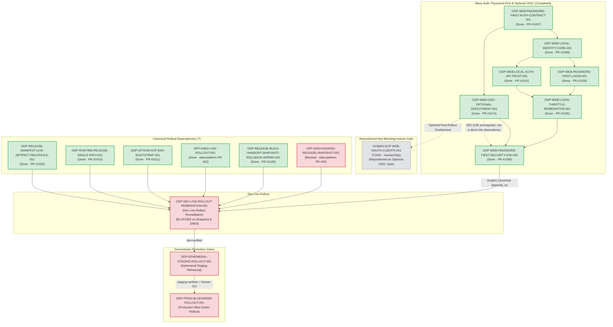

# Updated Rollout Dependency Graph (更新後 Rollout 依賴圖)

- **Task ID**: `ODP-WEB-OAUTH-GATE-RETARGET-001`
- **Phase**: `Wave Auth 3 - Gate Retarget`
- **Status**: Verified & Retargeted
- **Owner**: `Codex`
- **Reviewer**: `Claude`
- **Date**: `2026-09-01`

---

## 1. 依賴重接架構圖 (Retargeted Architecture DAG)

---

## 2. 變更對照表 (Before vs After Retarget)

| 維度 | 變更前 (Before Retarget) | 變更後 (After Retarget) |
|---|---|---|
| **Dev Rollout 身分驗證依賴** | 本次 CLI mutation 前 canonical `depends_on` 已是 6 個非 OAuth rollout dependencies；human OAuth task 已由較早 policy reconciliation 移除 | 權威 CLI 新增 `ODP-WEB-PASSWORD-FIRST-SECURITY-E2E-002`（PR #1096，已完成）；optional OIDC（PR #1074）是 security E2E 的已完成前置，不是直接新增的 dev dependency |
| **`HUMAN-GCP-WEB-OAUTH-CLIENTS-001` 定位** | 歷史規劃中的 P0 Human Gate；較早 policy reconciliation 已在本次 mutation 前將它移出 canonical `depends_on` | 可選 OIDC 啟用作業（Optional OIDC Gate），保留於 `status: todo`，不阻擋 password-first 部署 |
| **Rollout 閘門完整性** | 既有 canonical rollout 依賴與 gate 持續有效；不可將歷史規劃敘述誤當成此次 mutation 的 old state | 僅新增 password-first verification 依賴，嚴格保留 7 個 canonical dependencies、Build Once、Direct VPC、Ephemeral Staging 9-stage rehearsal、Production Blue-Green 及 Watch Window 全部閘門 |
| **第三方來源約束** | 16 個外部來源 disabled、無 credentials、default-deny egress | 100% 保持 disabled 與 default-deny egress |

---

## 3. 防呆與 Fail-Closed 保證

1. **未提前解除 Rollout Gate**：`ODP-DEV-LIVE-ROLLOUT-REMEDIATION-001` 目前仍處於 `blocked`，受限於未完成的 `DPF-EMGI-MASKED-RELEASE-SNAPSHOT-001`（PR #63）；已 done 的 `DPF-EMGI-LIVE-ROLLOUT-001`、WIRING、manifest、single-path 與 environment bootstrap 均如 canonical state 正確標示，未因 OAuth retarget 造成假放行。
2. **零憑證外洩**：所有收據與圖表不包含任何明文秘密（`secret_values_redacted: true`）。
3. **權威狀態可稽核**：`ODP-DEV-LIVE-ROLLOUT-REMEDIATION-001` 的 `depends_on` 異動由 canonical owner `Antigravity3` 於 `2026-09-01T15:41:44Z` 透過 `ai-status.sh set_dependencies` 寫入，並於 `ai-activity-log.jsonl` 留有完整稽核記錄。
