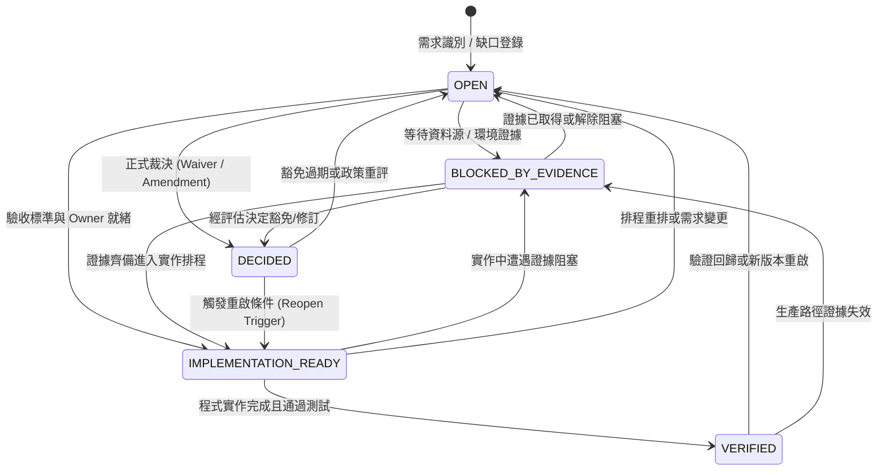

# ODP Requirement Dispositions & Governance Policy

- Status: Active Governance Standard & Registry
- Date: 2026-09-03
- Authority: Architecture Board / Platform Governance
- Enforcement: `delivery_toolchain/governance/check_requirement_members.py`
- Manifest: `delivery_toolchain/governance/set_valued_requirements.json`

---

## 1. 核心原則與治理目的

在軟體系統演進過程中，規格與實作常因時序、資料依賴或業務邊界產生落差。過往的失效模式顯示：
1. **缺席冒充完成**：將未實作的 MUST 需求僅以文字備註 `decided-not-doing`，在未經權限核准下實質改寫規格。
2. **AI 自簽豁免**：AI 代理人在開發或修復過程中自行決定放棄需求並登記豁免，使架構債務無聲累積。
3. **無期限的永久債務**：豁免與風險接受未設有效期限（Expiry），一經登記便永久脫離稽核視線。
4. **裝飾性限制與假精度**：在缺乏資料量測支撐的前提下實作複雜限制（例如無每期產能資料的時序限制，或充滿高度不確定性係數的配對稀釋優化）。

本政策確立機器可讀的 **Requirement Disposition Gate**，擴充既有 `set_valued_requirements.json`，將每一個集合型需求成員納入可驗證的生命週期治理，杜絕未經授權的規格縮水與虛假合規。

---

## 2. 五階段 Disposition 生命週期

每個需求成員的狀態處置必須嚴格遵循五個具名狀態：



### 狀態定義

| 狀態 | 英文標識 | 意義與進入條件 | 退出條件 / 必須欄位 |
|---|---|---|---|
| **待裁決** | `OPEN` | 需求缺口已識別，尚在調查或討論中，尚未做成正式裁決。 | 需具備 `rationale`/`note` 及 `assigned_to` 或 `next_review_date`。 |
| **證據阻塞** | `BLOCKED_BY_EVIDENCE` | 缺乏特定資料源、環境存取或執行期證據，無法判定可行性或進行實作；亦為「已移交人類治理、尚未裁決」之缺口的正確狀態。 | 必須具名 `evidence_needed`、`evidence_owner` 與 `next_review_date`；若宣稱已移交，必須具備可解析之 `formal_handback_ref`（見 §3.7）。**不得**要求其補 `decider`／`expiry`——無人裁決者不得被逼著簽署。 |
| **已裁決** | `DECIDED` | 經有權限之人類負責人做成正式裁決（需求修訂 Amendment 或具期限 Waiver）。 | 必須具備 7 大法定欄位：`formal_decision_ref`、`decider`（非 AI）、`decision_date`（不得為未來日期）、`scope`、`risk_owner`、`expiry`（未過期）、`reopen_trigger`。 |
| **實作就緒** | `IMPLEMENTATION_READY` | 需求與驗收標準已鎖定，已指派實作 Owner，排入具體交付批次。 | 必須具備 `assigned_to`、`target_phase` 或 `acceptance_criteria`。 |
| **已驗證** | `VERIFIED` | 程式碼已實作於代碼庫中，符號可解析，且通過 CI 自動化測試驗證。 | `status` 必須為 `satisfied` 且 `evidence` 參照真實存在的 Python 符號。 |

---

## 3. 嚴格治理守則（Hard Governance Gates）

### 3.1 索引與裁決嚴格區分（Absent is an Index, not a Decision）
- `status: "absent"` 僅表示該成員在目前的代碼庫中尚未有程式碼符號滿足，純屬技術現況索引。
- `absent` **絕對不得冒充裁決**。任何標記為 `absent` 的項目，其 `disposition.state` 不得為 `VERIFIED`。
- 在 `note` 中自行填寫 `DECIDED ...` 而未提供合規結構化 `disposition` 物件者，CI 檢查視為違規並直接中斷。
- **本條自 `ODP-MERGE-QUEUE-DISPOSITION-AUDIT-001` 起才真正被執行。** 此前它只是政策文字：`check_requirement_members.py` 僅審查自願宣告 `state: DECIDED` 的成員，note 內的裁決宣稱無人比對。現由 `find_nonimplementation_claim()` 比對成員 `note` 與 `disposition.rationale`，命中不實作裁決語（`DECIDED <日期>`、`not pursued`、`decided not to implement`、`已裁決不做`、`決定不實作`…）而狀態非 `DECIDED` 者一律拒絕。
- 偵測樣式刻意收窄：**描述缺席的句子必須繼續通過**（例如 `It is not a release mode, so a release cannot be gated on a backtest result.`）。若讓描述性語句命中，每個誠實登記的缺口都會被逼去申請它並不具備的豁免，反而製造假裁決。

### 3.2 嚴禁 AI 自簽豁免（Prohibition of AI Self-Signed Waivers）
- AI 代理人（包含但不限於 `Antigravity*`, `Claude*`, `Gemini*`, `Codex*`, `Copilot*` 等）**不得**作為 `decider` 簽署任何 Waiver、Risk Acceptance 或 Requirement Amendment。
- 裁決者必須為具名的人類治理角色（如 `Human/Ops`, `Architecture Board`, `Platform Governance Lead`, `Product Lead`, `Security Officer`, `Risk Committee` 等）。
- 檢驗工具 `check_requirement_members.py` 會自動以模式匹配拒絕任何 AI 簽署的裁決。

### 3.3 豁免有效期限與持續驗證（Expiry Gate）
- 任何 `DECIDED` 豁免或風險接受必須包含明確的 `expiry`（ISO 日期格式 `YYYY-MM-DD`）。
- CI 執行時會比對當前日期；一旦豁免超過有效期限，CI 立即報紅中斷，強制團隊重新檢視該項架構債務或推進實作。

### 3.4 明確的重啟條件與風險擁有者（Reopen Trigger & Risk Owner）
- 每個 Waiver 必須定義客觀、可觀測的 `reopen_trigger`（例如「當某資料源上線且覆蓋率超過 80% 時」、「當規劃週期需要每期排程時」）。
- 每個 Waiver 必須指派明確的 `risk_owner`，確保殘餘風險有人負責。

### 3.5 法定欄位在何處出現，即在何處受審（No Waiver Parking）
- 法定欄位構成一份豁免，**與它掛在哪個 `state` 底下無關**。成員只要帶有其中任一法定欄位，就必須帶齊全部七項，並通過 reference 可解析、`decider` 非 AI、`expiry` 未過期的完整檢驗。
- 此條修補的實際缺口：`ODP-FR-NET-002 / DILUTION` 為 `status: satisfied` + `disposition.state: VERIFIED`，其 note 裁定完整 pairwise 形式不實作，並帶有 `decider`、`expiry: 2027-09-01` 與 `reopen_trigger`——但在本條生效前，**這些欄位沒有任何一項被驗證過**，其有效期限會在 2027-09-01 靜默失效而 CI 全綠。
- 部分滿足的成員仍可合法在 `VERIFIED` 下承載其未實作部分的豁免；差別在於該豁免現在會如同 `DECIDED` 一樣到期、一樣拒絕 AI 簽署。
- **例外：`reopen_trigger` 不是裁決訊號。** 七項法定欄位中有六項描述「已經做成的裁決」——誰裁、何時裁、範圍、風險擁有者、何時失效、記錄在哪——沒有裁決就寫不出來，因此它們出現即代表有裁決。`reopen_trigger` 描述的是「未來哪個觀測會改變答案」，而移交（handback）需要它的理由與豁免完全相同。觸發集合因此定義為 `WAIVER_SIGNAL_FIELDS`（法定七項扣除 `reopen_trigger`）。
- 此例外的實際成因：`ODP-FR-SITE-001` 的 `BRAND_TRANSFER` 與 `FORMAT_CONVERSION` 是本政策所鼓勵的誠實形狀（`BLOCKED_BY_EVIDENCE` + 未簽署移交單），各自寫明「哪一份資料合約到位就解除阻塞」。把該欄位讀成裁決訊號，會使這兩筆被判為「缺 `decider` 與 `expiry` 的半份豁免」，而唯一的通過方式是把那兩個欄位編出來——正是 §3.2 禁止的 AI 自簽。**閘不得把誠實的缺口逼成假裁決。**
- 只要另有任一項真正的裁決訊號欄位（例如 `decider`）出現在非 `DECIDED` 狀態上，仍須補齊全部七項；`DECIDED` 亦仍須含 `reopen_trigger`。

### 3.6 裁決必須有日期（Decision Date）
- `decision_date`（ISO `YYYY-MM-DD`）為第七項法定欄位，且不得晚於檢查當日。
- 沒有日期的裁決無法計齡、無法排序、無法追溯到做成它的那場會議；`expiry` 只說何時失效，不說它從哪一天起算。

### 3.7 移交必須有可開啟的封包（Handback Must Point At Something）

- 移交（handback）是 AI 面對不得自簽之 MUST 缺口的**唯一合法出口**：缺口原封不動退回人類治理，不製造任何簽署。正因如此，它是 §3.1 的「已裁決不做」被堵死之後，下一個最值得偽造的句子——而且更廉價：一句「已提報 Human/Ops」就能讓成員無限期停在 `BLOCKED_BY_EVIDENCE`，而沒有任何人被記錄為收件者。
- 因此：成員的 `note` 或 `disposition.rationale` 宣稱已移交（`handback ... submitted`、`handed back to`、`HB-XXX-NNN` 封包編號、`已移交`、`移交單`、`已提報`）者，必須具備 `formal_handback_ref`，且該 reference 需通過與 `formal_decision_ref` 相同的可解析檢驗（庫內文件路徑、URL 或 PR/RFC 編號）。由 `find_handback_claim()` 比對。
- 偵測樣式同樣刻意收窄：**描述「尚未做、還欠什麼」的句子必須繼續通過**（例如 `Awaiting Batch 0 data source audit before scheduling solver integration or formal waiver.`）。若讓意向句命中，每個誠實登記的阻塞都會被逼去編一份它並不具備的移交單，與 §3.5 例外要避免的是同一個錯誤。

---

## 4. 正式需求裁決與豁免登錄表（Formal Dispositions Registry）

本節記錄各集合型 MUST 需求成員的正式處置與裁決依據：

### 4.1 `ODP-FR-NET-002`：NetPlan 硬限制

#### 成員：`SEQUENCING`（時序硬限制）
- **處置狀態**：`DECIDED`（正式 Waiver / 技術決策）
- **Formal Decision Ref**: `docs/governance/ODP_REQUIREMENT_DISPOSITIONS.md#odp-fr-net-002-sequencing`
- **裁決者 (Decider)**: `Human/Ops (Architecture Board)`
- **裁決日期 (Decision Date)**: `2026-09-02`
- **適用範圍 (Scope)**: NetPlan 展店求解器最佳化模型與時序排程邊界
- **風險擁有者 (Risk Owner)**: `Platform Architecture Lead`
- **有效期限 (Expiry)**: `2027-09-01`
- **重啟條件 (Reopen Trigger)**: 當業務規劃週期明確需要每期時序排程，且來源系統具備 per-period 施工與人力產能資料時。
- **裁決理由 (Rationale)**:
  時序限制需要 per-period 資源上限與行動先後順序資料。目前施工與人力容量僅以單一總量提供給求解器。在沒有真實數據餵入的情況下建立時序約束，將形成「裝飾性限制」。未建模的時序風險目前已由求解器在每次執行時明確於 `unmodelled_constraint_classes` 回報 `ConstraintClass.SEQUENCING`，避免操作者誤判。

#### 成員：`DILUTION`（稀釋硬限制）
- **處置狀態**：`VERIFIED`（實作 count-cap，並正式修訂 pairwise 形式）
- **Formal Decision Ref**: `docs/governance/ODP_REQUIREMENT_DISPOSITIONS.md#odp-fr-net-002-dilution`
- **裁決者 (Decider)**: `Human/Ops (Architecture Board)`
- **裁決日期 (Decision Date)**: `2026-09-02`
- **適用範圍 (Scope)**: NetPlan 展店求解器商圈稀釋效應模型
- **風險擁有者 (Risk Owner)**: `Optimization & Modeling Lead`
- **有效期限 (Expiry)**: `2027-09-01`
- **重啟條件 (Reopen Trigger)**: 當門市間配對稀釋係數之估計不確定性大幅降低，足以支撐高階線性化最佳化時。
- **裁決理由 (Rationale)**:
  現行採用商圈內開店數上限（`max_open_per_dilution_zone`）作為稀釋約束。完整的門市配對稀釋形式需引入 $O(n^2)$ 輔助變數，且配對稀釋係數本身帶有實質不確定性，對其過度優化屬於製造假精度。投資於 `ODP-FR-HZ-004` 熱區吸收率的真實量測是更優路徑。

#### 成員：`LEASE`（租約條件限制）
- **處置狀態**：`BLOCKED_BY_EVIDENCE`（待 Batch 0 確認資料源）
- **待確認證據 (Evidence Needed)**: 租約檔期與解約金懲罰條件之資料源是否存在於上游系統。
- **證據負責人 (Evidence Owner)**: `Data Operations Lead`
- **下次檢視日期 (Next Review Date)**: `2026-10-01`
- **理由 (Rationale)**: 待 Batch 0 確認資料源後，決定轉為實作或正式申請 Waiver。

---

### 4.2 `ODP-FR-SITE-001`：SiteScore 需求因子

#### 成員：`BRAND_TRANSFER`（品牌移轉）
- **處置狀態**：`BLOCKED_BY_EVIDENCE`（已移交人類治理授權）
- **Formal Handback Ref**: `docs/evidence/ODP_SITE001_COMPONENT_DISPOSITIONS_2026-09-03.md#2-member-1brand-transfer既有品牌客群移轉處置`
- **Evidence Request Ref**: `docs/evidence/ODP_SITE001_DATA_READINESS_2026-09-03.md#34-待查證需求單evidence-request`（`ER-SITE001-BRAND-TRANSFER-001`）
- **Handback Package ID**: `HB-SITE001-BRAND-TRANSFER-001`
- **待確認證據 (Evidence Needed)**: 外部會員跨店消費數據/市調發票面板數據接入協議、資料綱要與特徵提取規格。
- **證據／風險負責人 (Evidence & Risk Owner)**: `Market Intelligence Lead / Commercial Strategy Lead`
- **下次檢視日期 (Next Review Date)**: `2026-10-01`
- **重啟條件 (Reopen Trigger)**: 外部消費者面板數據源或跨品牌 POS 會員數據庫正式簽約並接入 raw data platform，具備可驗證之生產 SLA 與特徵規格。
- **裁決理由 (Rationale)**:
  Repo 內僅有 `core.brands` 靜態代碼主檔；`brand_transfer_view.sql` 僅為基於笛卡兒積的 mock 視圖（`transfer_ratio = 0.15`），無真實生產者與消費路徑。為避免注入裝飾性固定常數與偽造假精度，拒絕將合成視圖接進生產評分模型。已建立人類授權移交單提報至 `Human/Ops`、`Architecture Board` 與 `Commercial Strategy Lead`，待資料源確立後轉為 `IMPLEMENTATION_READY` 或由人類授權人簽署正式修訂／豁免。

#### 成員：`FORMAT_CONVERSION`（店型轉換）
- **處置狀態**：`BLOCKED_BY_EVIDENCE`（已移交人類治理授權）
- **Formal Handback Ref**: `docs/evidence/ODP_SITE001_COMPONENT_DISPOSITIONS_2026-09-03.md#3-member-2format-conversion店型轉換業務事件處置`
- **Evidence Request Ref**: `docs/evidence/ODP_SITE001_DATA_READINESS_2026-09-03.md#44-待查證需求單evidence-request`（`ER-SITE001-FORMAT-CONVERSION-001`）
- **Handback Package ID**: `HB-SITE001-FORMAT-CONVERSION-001`
- **待確認證據 (Evidence Needed)**: 門市營運端之既有店型改裝轉型（Brownfield Conversion）標準作業手冊（Playbook）、停業期營收折損與改裝財務模型參數。
- **證據／風險負責人 (Evidence & Risk Owner)**: `Retail Operations Lead / Site Economics Lead`
- **下次檢視日期 (Next Review Date)**: `2026-10-01`
- **重啟條件 (Reopen Trigger)**: 門市營運端正式核准 Brownfield 店型改裝轉型作業規範與改裝成本/停業損失排程，且資料庫完成 `core.store_format_conversions` 轉型履歷表之 schema migration。
- **裁決理由 (Rationale)**:
  PostgreSQL（`000001`）與 SQLite（`000004`）Schema 僅存靜態 `store_format_code`，無改裝轉型歷程表；`TargetFormatRegistry` 僅依坪數推薦新設店型（選型非轉型）；`simulator.py` 僅模擬 Greenfield 新店經濟效益，無 Brownfield 停業損失與設備殘值折抵邏輯。已明確排除房源流轉與證據等級遷移註記等非店型語境假陽性。已建立人類授權移交單提報至 `Human/Ops`、`Architecture Board` 與 `Retail Operations Lead`，待業務規範與財務參數確立後轉為 `IMPLEMENTATION_READY` 或由人類授權人簽署正式修訂／豁免。

---

### 4.3 `ODP-FR-LH-003`：LearningHub 發布模式

#### 成員：`BACKTEST`（回測發布閘）
- **處置狀態**：`VERIFIED`
- **Formal Decision Ref**: `docs/governance/ODP_REQUIREMENT_DISPOSITIONS.md#odp-fr-lh-003-backtest`
- **負責人 (Assigned To)**: `ML Platform Lead`
- **理由 (Rationale)**: `BacktestReceipt` 已作為版本化 release admission gate 接入 LearningHub 發布流程（FULL 與 CANARY），綁定 model version、dataset snapshot、code version (git SHA) 與 DecisionPolicy 閾值。


---

### 4.4 `ODP-FR-INTV-006`：介入處置生命週期

#### 成員：`ADJUST`（調整中途狀態）
- **處置狀態**：`OPEN`
- **負責人 (Assigned To)**: `Intervention Workflow Lead`
- **下次檢視日期 (Next Review Date)**: `2026-10-01`
- **理由 (Rationale)**: AdLift 目前採 Continue/Scale/Stop/Change_Channel 詞彙；評估是否需增加 Adjust 或維持關聯重建。

---

### 4.5 `ODP-FR-SHARED-001`：工作狀態回報

#### 成員：`PARTIAL`（部分成功狀態）
- **處置狀態**：`BLOCKED_BY_EVIDENCE`（已移交人類治理授權）
- **Formal Handback Ref**: `docs/evidence/ODP_JOB_PARTIAL_DISPOSITION_2026-09-03.md#3-人類授權移交單human-authority-handback-package`
- **Evidence Request Ref**: `docs/evidence/ODP_JOB_PARTIAL_PRODUCER_EVIDENCE_2026-09-03.md`
- **Handback Package ID**: `HB-SHARED001-PARTIAL-001`
- **待確認證據 (Evidence Needed)**: 兩項非代碼庫可獨立判定之證據。(1) live production queue／scheduler／worker receipt inventory，用以判定已部署 job 是否曾回報過 `JobStatus.PARTIAL`；(2) 產品裁決：現存 partial-shaped command outcomes（批次房源寫入之 207 逐列收據、XLSX 局部提交、外部資料攝取之 accepted/quarantined counts）是否應昇格為具備 itemized receipt 與 member retry contract 之 durable queue jobs。
- **證據／風險負責人 (Evidence & Risk Owner)**: `Platform Infrastructure Lead`
- **下次檢視日期 (Next Review Date)**: `2026-10-01`
- **重啟條件 (Reopen Trigger)**: (1) Production worker registry 新增具備可達 `JobStatus.PARTIAL` 狀態轉移之多工作項目批次任務 handler；或 (2) 同步指令操作（批次房源寫入/外部資料攝取）正式排程昇格為具備成員明細收據與成員級重試契約之 durable jobs；或 (3) 線上執行期隊列/worker 審計日誌出現回報 `PARTIAL` 之部署任務。
- **裁決理由 (Rationale)**:
  `JobStatus` 詞彙與 `JobDeliveryState` 交付狀態已完成型別分離，但代碼庫中現行 default worker registry 與所有模組 worker entry points 皆無任何寫入 `JobStatus.PARTIAL` 的生產者。批次房源 207 收據、XLSX commit 與外部資料攝取隔離計數皆屬同步指令或資料層品質標記，而非隊列任務成果；隊列的 `RETRYING` 與 `DEAD_LETTER` 亦屬傳遞狀態而非業務成果。嚴禁為湊齊成員而進行偽實作。已建立結構化人類授權移交單提報至 `Human/Ops`、`Architecture Board` 與 `Platform Infrastructure Lead`，待批次長任務規格確立後轉為 `IMPLEMENTATION_READY` 或由人類授權人簽署正式修訂／豁免。

---

### 4.6 `ODP-FR-LH-005`：模型漂移監控

#### 成員：`PREDICTION_DRIFT`（預測分布漂移）
- **處置狀態**：`IMPLEMENTATION_READY`
- **負責人 (Assigned To)**: `ML Monitoring Lead`
- **目標交付批次 (Target Phase)**: `Batch 4a (ODP Remediation Plan)`
- **理由 (Rationale)**: Evidently 預測分布漂移監控已完成技術規格設計，排入 Batch 4a 實作。

---

### 4.7 `ODP-FR-INT-001`：整合層攝取模式

#### 成員：`BATCH`（批次快照與增量）
- **處置狀態**：`VERIFIED`
- **實作證據 (Evidence)**: `apps/data_platform/source.py::MongoSource`
- **理由 (Rationale)**: 支援 `SNAPSHOT_SOURCE_KINDS` 全量快照分頁讀取及 `_window_query` 水位線時間窗增量讀取，生產路徑已驗證。

#### 成員：`API`（外部 API 介接）
- **處置狀態**：`VERIFIED`
- **實作證據 (Evidence)**: `modules/external_data/connectors/provider_registry.py::PROVIDER_REGISTRY`
- **理由 (Rationale)**: 外部資料提供者註冊表支援商用 POI、地理編碼等多來源 API 介接。

#### 成員：`FILE`（檔案與 Feed 匯入）
- **處置狀態**：`VERIFIED`
- **實作證據 (Evidence)**: `modules/external_data/application/xlsx_import.py::XlsxCommitReceipt`
- **理由 (Rationale)**: 具備治理化 XLSX 試算表解析、預覽驗證與冪等提交，另支援 feed 與 public_dataset。

#### 成員：`EVENT`（事件串流）
- **處置狀態**：`OPEN`
- **負責人 (Assigned To)**: `Platform Infrastructure Lead`
- **下次檢視日期 (Next Review Date)**: `2026-10-01`
- **理由 (Rationale)**:
  `machine_status_event` 契約宣告了 `integration_mode: event_stream` 與 `envelope: event`，但在生產環境中 `core.machine_status_events` 係透過 `SourceKind.DEVICE_LOG` 走批次水位線落地。目前全樹無事件 Broker / Stream Consumer 生產者。待架構與平台團隊評估補建生產者或修訂契約 taxonomy。

#### 成員：`CDC`（異動資料擷取）
- **處置狀態**：`OPEN`（不適用；維持 absent 並提交人類治理修訂/豁免 Handback）
- **負責人 (Assigned To)**: `Data Platform Lead`
- **下次檢視日期 (Next Review Date)**: `2026-10-01`
- **正式移交文件 (Formal Handback Ref)**: `docs/evidence/ODP_INT001_CDC_DISPOSITION_2026-09-03.md`
- **處置依據與查證結論**:
  依 `docs/evidence/ODP_INT001_CDC_SOURCE_EVIDENCE_2026-09-03.md` 與 `docs/evidence/ODP_INT001_CDC_DISPOSITION_2026-09-03.md` 之查證：
  1. **無真實上游需求**：唯一內部來源為 MongoDB `fongniao_prod`，外部來源均為快照。無任何生產上游需要 Change Stream / oplog 讀取。
  2. **延遲與排程已匹配**：下游資產為日粒度（DailyPartitions），上游已有 15 分鐘 Sensor 輪詢，無 sub-15m 延遲需求。
  3. **順序性與冪等保證**：透過 deterministic `_id` cursor 與基於 content hash 之冪等鍵達成，不依賴 CDC 全域變更順序。
  4. **下游無刪除傳播路徑**：上游實體刪除無法由 CDC 解決（因 PostgreSQL 落地層皆為 upsert，無 delete / tombstone 路徑）。
  5. **憑證邊界收斂**：Change Stream 需擴大資料庫權限至 cluster 級別，未經安全核准前嚴格 fail-closed。
  6. **AI 禁止自簽 Waiver**：依本政策 §3.2，AI 代理人嚴禁自簽豁免。本項目維持 `absent` 索引並將處置 Handback 提交人類治理負責人（`Data Platform Lead` / `Human/Ops`），待正式 Amendment / Waiver 裁決後再行更新。
### 4.8 `ODP-FR-FCT-004`：ForecastOps 預測特徵與根因契約

#### 成員：`ROOT_CAUSE_CANDIDATE`（根因候選）
- **處置狀態**：`IMPLEMENTATION_READY`
- **負責人 (Assigned To)**: `ForecastOps / Platform Ops`
- **目標交付批次 (Target Phase)**: `Wave 5+`
- **工程處置 (Engineering Disposition)**:
  全樹追溯證實目前代碼庫中沒有自動化根因推導生產者。保留相容的
  `WorkOrder.root_cause`、`RootCauseEvidenceCardContract.causeCandidate` 與資料庫欄位，並在各契約明確標示為 `RESERVED (unproduced)`；不得製造裝飾性 Heuristic 假生產者。
- **裁決狀態 (Decision Status)**:
  `ODP_OPEN_DECISIONS_2026-09-03.md` § 8 仍為 `OPEN`。本項是已具備 owner／target phase 的工程實作準備，不是本任務代替人類治理角色建立 Waiver 或 Requirement Amendment。

---

### 4.9 `ODP-FR-AVM-001`：AVM 估值組成

#### 成員：`DEPRECIATION`（資產折舊）
- **處置狀態**：`IMPLEMENTATION_READY`
- **負責人 (Assigned To)**: `AVM Domain Lead / Finance Analytics Lead`
- **目標交付批次 (Target Phase)**: `Batch 1 (ODP Remediation Plan) — AVM 估值`
- **契約文件 (Contract Ref)**: [`docs/design/ODP_AVM_DEPRECIATION_CONTRACT_2026-09-03.md`](../design/ODP_AVM_DEPRECIATION_CONTRACT_2026-09-03.md)
- **處置證據 (Evidence Ref)**: [`docs/evidence/ODP_AVM001_DEPRECIATION_DISPOSITION_2026-09-04.md`](../evidence/ODP_AVM001_DEPRECIATION_DISPOSITION_2026-09-04.md)
- **驗收標準 (Acceptance Criteria)**: `modules/avm/tests/test_avm_depreciation_contract.py` 的八條 `xfail(strict=True)` 契約規格（C-1 基數判別、C-2 輸入欄位、C-3 直線折舊計算、C-4 evidence 與版本欄位、C-5 缺席 fail-closed、L-1／L-2 舊估值卡、L-4 校準分版本、R-1 逐位元回滾）。`strict=True` 使實作落地後這些規格會以 XPASS 判紅，強迫實作者回來移除標記——本狀態因此帶有機械式到期機制。
- **工程處置 (Engineering Disposition)**:
  修復計畫第 1 批要求先回答「AVM 資產折舊與 `site_economics` 門市現金流折舊是否同一概念」。判定為**不是**，四項證據：被量測的對象不同（format catalog 的全新機型組合 vs. 已使用 N 個月的特定門市設備）、輸出去向不同（稅盾，從未調低任何資產帳面價值 vs. 直接進 asset lens）、時鐘原點相反（開店月往後 vs. 投入使用日往回）、殘值語意不同（期末退場現金流入 vs. 折舊下限）。因此採 **AVM-specific model**，且**連直線折舊純函式都不抽出共用**——為三行算式建立 `modules/avm` → `modules/site_economics` 依賴，換到的是「兩邊折舊政策一致」的假象。要對齊的是參數（`useful_life_months` 與 `residual_value_ratio` 的 catalog 假設），不是程式碼。
- **為何不是其他狀態**:
  - 不是 `VERIFIED`：`modules/avm` 內沒有任何折舊計算，且依 §3.1 `absent` 不得冒充 `VERIFIED`。
  - 不是 `DECIDED`：沒有任何人類裁決「不納入折舊」。要通過 `DECIDED` 閘就必須編造 `decider`，正是 §3.2 禁止的 AI 自簽豁免。本處置不攜帶任何法定裁決欄位。
  - 不是 `BLOCKED_BY_EVIDENCE`：判定已做出、驗收標準已可執行，實作現在就能開始。欠的是工，不是證據——把它記成阻塞會讓一份寫完的契約看起來像在等別人。
- **仍屬人類治理、本次不代簽**:
  1. 契約 R-4 的三個回滾門檻（數值／結構／校準）由財務 owner 填入，**門檻未填不得 cutover**；
  2. `ODP-FR-AVM-001` 的 canonical 需求 bytes 依 [`ODP_SPEC_SOURCE_PROVENANCE_2026-09-03.md`](../evidence/ODP_SPEC_SOURCE_PROVENANCE_2026-09-03.md) 仍為 `BLOCKED_BY_EVIDENCE`，manifest `_source_provenance` 已記錄。本處置只宣稱「依目前轉錄內容」成立。
- **轉為 `VERIFIED` 的條件**: 八條 xfail 標記被實作而非改寫地移除且全數通過、`status` 轉為 `satisfied` 且 `evidence` 指向可解析符號、R-4 門檻已填。
- **回歸測試**: `tests/governance/test_avm001_disposition.py`（含三條負向測試：冒充 `VERIFIED`、AI 簽署的 `DECIDED`、移除 `disposition` 區塊，checker 均須拒絕）。

---

## 5. 自動化檢驗與 CI 整合

所有登錄於 `delivery_toolchain/governance/set_valued_requirements.json` 的需求成員均由 `delivery_toolchain/governance/check_requirement_members.py` 於 CI 流程中機械式驗證：

```bash
uv run python delivery_toolchain/governance/check_requirement_members.py
```

測試驗證命令：
```bash
uv run pytest delivery_toolchain/governance/test_check_requirement_members.py
```
