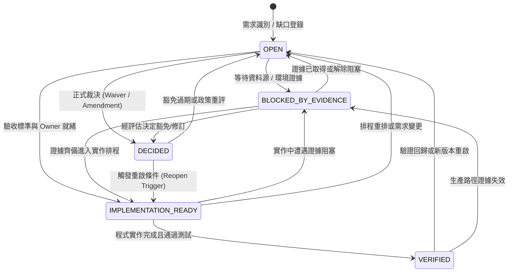

# ODP Requirement Dispositions & Governance Policy

- Status: Active Governance Standard & Registry
- Date: 2026-09-03
- Authority: Architecture Board / Platform Governance
- Enforcement: `delivery_toolchain/governance/check_requirement_members.py`
- Manifest: `delivery_toolchain/governance/set_valued_requirements.json`

---

## 1. 核心原則與治理目的

在軟體系統演進過程中，規格與實作常因時序、資料依賴或業務邊界產生落差。過往的失效模式顯示：
1. **缺席冒充完成**：將未實作的 MUST 需求僅以文字備註 `decided-not-doing`，在未經權限核准下實質改寫規格。
2. **AI 自簽豁免**：AI 代理人在開發或修復過程中自行決定放棄需求並登記豁免，使架構債務無聲累積。
3. **無期限的永久債務**：豁免與風險接受未設有效期限（Expiry），一經登記便永久脫離稽核視線。
4. **裝飾性限制與假精度**：在缺乏資料量測支撐的前提下實作複雜限制（例如無每期產能資料的時序限制，或充滿高度不確定性係數的配對稀釋優化）。

本政策確立機器可讀的 **Requirement Disposition Gate**，擴充既有 `set_valued_requirements.json`，將每一個集合型需求成員納入可驗證的生命週期治理，杜絕未經授權的規格縮水與虛假合規。

---

## 2. 五階段 Disposition 生命週期

每個需求成員的狀態處置必須嚴格遵循五個具名狀態：



### 狀態定義

| 狀態 | 英文標識 | 意義與進入條件 | 退出條件 / 必須欄位 |
|---|---|---|---|
| **待裁決** | `OPEN` | 需求缺口已識別，尚在調查或討論中，尚未做成正式裁決。 | 需具備 `rationale`/`note` 及 `assigned_to` 或 `next_review_date`。 |
| **證據阻塞** | `BLOCKED_BY_EVIDENCE` | 缺乏特定資料源、環境存取或執行期證據，無法判定可行性或進行實作。 | 必須具名 `evidence_needed`、`evidence_owner` 與 `next_review_date`。 |
| **已裁決** | `DECIDED` | 經有權限之人類負責人做成正式裁決（需求修訂 Amendment 或具期限 Waiver）。 | 必須具備 6 大法定欄位：`formal_decision_ref`、`decider`（非 AI）、`scope`、`risk_owner`、`expiry`（未過期）、`reopen_trigger`。 |
| **實作就緒** | `IMPLEMENTATION_READY` | 需求與驗收標準已鎖定，已指派實作 Owner，排入具體交付批次。 | 必須具備 `assigned_to`、`target_phase` 或 `acceptance_criteria`。 |
| **已驗證** | `VERIFIED` | 程式碼已實作於代碼庫中，符號可解析，且通過 CI 自動化測試驗證。 | `status` 必須為 `satisfied` 且 `evidence` 參照真實存在的 Python 符號。 |

---

## 3. 嚴格治理守則（Hard Governance Gates）

### 3.1 索引與裁決嚴格區分（Absent is an Index, not a Decision）
- `status: "absent"` 僅表示該成員在目前的代碼庫中尚未有程式碼符號滿足，純屬技術現況索引。
- `absent` **絕對不得冒充裁決**。任何標記為 `absent` 的項目，其 `disposition.state` 不得為 `VERIFIED`。
- 在 `note` 中自行填寫 `DECIDED ...` 而未提供合規結構化 `disposition` 物件者，CI 檢查視為違規並直接中斷。

### 3.2 嚴禁 AI 自簽豁免（Prohibition of AI Self-Signed Waivers）
- AI 代理人（包含但不限於 `Antigravity*`, `Claude*`, `Gemini*`, `Codex*`, `Copilot*` 等）**不得**作為 `decider` 簽署任何 Waiver、Risk Acceptance 或 Requirement Amendment。
- 裁決者必須為具名的人類治理角色（如 `Human/Ops`, `Architecture Board`, `Platform Governance Lead`, `Product Lead`, `Security Officer`, `Risk Committee` 等）。
- 檢驗工具 `check_requirement_members.py` 會自動以模式匹配拒絕任何 AI 簽署的裁決。

### 3.3 豁免有效期限與持續驗證（Expiry Gate）
- 任何 `DECIDED` 豁免或風險接受必須包含明確的 `expiry`（ISO 日期格式 `YYYY-MM-DD`）。
- CI 執行時會比對當前日期；一旦豁免超過有效期限，CI 立即報紅中斷，強制團隊重新檢視該項架構債務或推進實作。

### 3.4 明確的重啟條件與風險擁有者（Reopen Trigger & Risk Owner）
- 每個 Waiver 必須定義客觀、可觀測的 `reopen_trigger`（例如「當某資料源上線且覆蓋率超過 80% 時」、「當規劃週期需要每期排程時」）。
- 每個 Waiver 必須指派明確的 `risk_owner`，確保殘餘風險有人負責。

---

## 4. 正式需求裁決與豁免登錄表（Formal Dispositions Registry）

本節記錄各集合型 MUST 需求成員的正式處置與裁決依據：

### 4.1 `ODP-FR-NET-002`：NetPlan 硬限制

#### 成員：`SEQUENCING`（時序硬限制）
- **處置狀態**：`DECIDED`（正式 Waiver / 技術決策）
- **Formal Decision Ref**: `docs/governance/ODP_REQUIREMENT_DISPOSITIONS.md#odp-fr-net-002-sequencing`
- **裁決者 (Decider)**: `Human/Ops (Architecture Board)`
- **裁決日期 (Decision Date)**: `2026-09-02`
- **適用範圍 (Scope)**: NetPlan 展店求解器最佳化模型與時序排程邊界
- **風險擁有者 (Risk Owner)**: `Platform Architecture Lead`
- **有效期限 (Expiry)**: `2027-09-01`
- **重啟條件 (Reopen Trigger)**: 當業務規劃週期明確需要每期時序排程，且來源系統具備 per-period 施工與人力產能資料時。
- **裁決理由 (Rationale)**:
  時序限制需要 per-period 資源上限與行動先後順序資料。目前施工與人力容量僅以單一總量提供給求解器。在沒有真實數據餵入的情況下建立時序約束，將形成「裝飾性限制」。未建模的時序風險目前已由求解器在每次執行時明確於 `unmodelled_constraint_classes` 回報 `ConstraintClass.SEQUENCING`，避免操作者誤判。

#### 成員：`DILUTION`（稀釋硬限制）
- **處置狀態**：`VERIFIED`（實作 count-cap，並正式修訂 pairwise 形式）
- **Formal Decision Ref**: `docs/governance/ODP_REQUIREMENT_DISPOSITIONS.md#odp-fr-net-002-dilution`
- **裁決者 (Decider)**: `Human/Ops (Architecture Board)`
- **裁決日期 (Decision Date)**: `2026-09-02`
- **適用範圍 (Scope)**: NetPlan 展店求解器商圈稀釋效應模型
- **風險擁有者 (Risk Owner)**: `Optimization & Modeling Lead`
- **有效期限 (Expiry)**: `2027-09-01`
- **重啟條件 (Reopen Trigger)**: 當門市間配對稀釋係數之估計不確定性大幅降低，足以支撐高階線性化最佳化時。
- **裁決理由 (Rationale)**:
  現行採用商圈內開店數上限（`max_open_per_dilution_zone`）作為稀釋約束。完整的門市配對稀釋形式需引入 $O(n^2)$ 輔助變數，且配對稀釋係數本身帶有實質不確定性，對其過度優化屬於製造假精度。投資於 `ODP-FR-HZ-004` 熱區吸收率的真實量測是更優路徑。

#### 成員：`LEASE`（租約條件限制）
- **處置狀態**：`BLOCKED_BY_EVIDENCE`（待 Batch 0 確認資料源）
- **待確認證據 (Evidence Needed)**: 租約檔期與解約金懲罰條件之資料源是否存在於上游系統。
- **證據負責人 (Evidence Owner)**: `Data Operations Lead`
- **下次檢視日期 (Next Review Date)**: `2026-10-01`
- **理由 (Rationale)**: 待 Batch 0 確認資料源後，決定轉為實作或正式申請 Waiver。

---

### 4.2 `ODP-FR-SITE-001`：SiteScore 需求因子

#### 成員：`BRAND_TRANSFER`（品牌移轉）
- **處置狀態**：`BLOCKED_BY_EVIDENCE`（待 Batch 0 確認資料源）
- **待確認證據 (Evidence Needed)**: 歷史品牌客群移轉資料集是否存在且具可信度。
- **證據負責人 (Evidence Owner)**: `Market Intelligence Lead`
- **下次檢視日期 (Next Review Date)**: `2026-10-01`
- **理由 (Rationale)**: 待 Batch 0 調查歷史資料源後決定納入評分特徵或走正式修訂。

#### 成員：`FORMAT_CONVERSION`（店型轉換）
- **處置狀態**：`BLOCKED_BY_EVIDENCE`（待 Batch 0 確認業務行為）
- **待確認證據 (Evidence Needed)**: 既有門市店型轉換業務動作是否在生產環境實際發生並留有紀錄。
- **證據負責人 (Evidence Owner)**: `Retail Operations Lead`
- **下次檢視日期 (Next Review Date)**: `2026-10-01`
- **理由 (Rationale)**: 目前僅有店型選擇（選 format），尚無轉換（conversion）業務路徑；待 Batch 0 業務確認。

---

### 4.3 `ODP-FR-LH-003`：LearningHub 發布模式

#### 成員：`BACKTEST`（回測發布閘）
- **處置狀態**：`OPEN`
- **負責人 (Assigned To)**: `ML Platform Lead`
- **下次檢視日期 (Next Review Date)**: `2026-10-01`
- **理由 (Rationale)**: `models/shared_ml/backtest.py` 具備滾動回測功能，但未與 LearningHub 發布閘流程對接；列為 Batch 6 評估項目。

---

### 4.4 `ODP-FR-INTV-006`：介入處置生命週期

#### 成員：`ADJUST`（調整中途狀態）
- **處置狀態**：`OPEN`
- **負責人 (Assigned To)**: `Intervention Workflow Lead`
- **下次檢視日期 (Next Review Date)**: `2026-10-01`
- **理由 (Rationale)**: AdLift 目前採 Continue/Scale/Stop/Change_Channel 詞彙；評估是否需增加 Adjust 或維持關聯重建。

---

### 4.5 `ODP-FR-SHARED-001`：工作狀態回報

#### 成員：`PARTIAL`（部分成功狀態）
- **處置狀態**：`OPEN`
- **負責人 (Assigned To)**: `Platform Infrastructure Lead`
- **下次檢視日期 (Next Review Date)**: `2026-10-01`
- **理由 (Rationale)**: `JobStatus` 詞彙已納入 `PARTIAL`，但系統中尚未有會產出部分成功狀態的長任務；不強行假實作。

---

### 4.6 `ODP-FR-LH-005`：模型漂移監控

#### 成員：`PREDICTION_DRIFT`（預測分布漂移）
- **處置狀態**：`IMPLEMENTATION_READY`
- **負責人 (Assigned To)**: `ML Monitoring Lead`
- **目標交付批次 (Target Phase)**: `Batch 4a (ODP Remediation Plan)`
- **理由 (Rationale)**: Evidently 預測分布漂移監控已完成技術規格設計，排入 Batch 4a 實作。

---

## 5. 自動化檢驗與 CI 整合

所有登錄於 `delivery_toolchain/governance/set_valued_requirements.json` 的需求成員均由 `delivery_toolchain/governance/check_requirement_members.py` 於 CI 流程中機械式驗證：

```bash
uv run python delivery_toolchain/governance/check_requirement_members.py
```

測試驗證命令：
```bash
uv run pytest delivery_toolchain/governance/test_check_requirement_members.py
```
