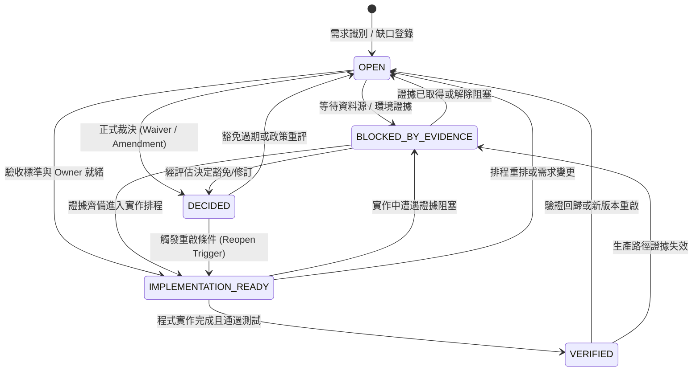

# ODP Requirement Dispositions & Governance Policy

- Status: Active Governance Standard & Registry
- Date: 2026-09-03
- Authority: Architecture Board / Platform Governance
- Enforcement: `delivery_toolchain/governance/check_requirement_members.py`
- Manifest: `delivery_toolchain/governance/set_valued_requirements.json`

---

## 1. 核心原則與治理目的

在軟體系統演進過程中，規格與實作常因時序、資料依賴或業務邊界產生落差。過往的失效模式顯示：
1. **缺席冒充完成**：將未實作的 MUST 需求僅以文字備註 `decided-not-doing`，在未經權限核准下實質改寫規格。
2. **AI 自簽豁免**：AI 代理人在開發或修復過程中自行決定放棄需求並登記豁免，使架構債務無聲累積。
3. **無期限的永久債務**：豁免與風險接受未設有效期限（Expiry），一經登記便永久脫離稽核視線。
4. **裝飾性限制與假精度**：在缺乏資料量測支撐的前提下實作複雜限制（例如無每期產能資料的時序限制，或充滿高度不確定性係數的配對稀釋優化）。

本政策確立機器可讀的 **Requirement Disposition Gate**，擴充既有 `set_valued_requirements.json`，將每一個集合型需求成員納入可驗證的生命週期治理，杜絕未經授權的規格縮水與虛假合規。

---

## 2. 五階段 Disposition 生命週期

每個需求成員的狀態處置必須嚴格遵循五個具名狀態：


```mermaid
stateDiagram-v2
    [*] --> OPEN: 需求識別 / 缺口登錄
    OPEN --> BLOCKED_BY_EVIDENCE: 等待資料源 / 環境證據
    OPEN --> DECIDED: 正式裁決 (Waiver / Amendment)
    OPEN --> IMPLEMENTATION_READY: 驗收標準與 Owner 就緒

    BLOCKED_BY_EVIDENCE --> OPEN: 證據已取得或解除阻塞
    BLOCKED_BY_EVIDENCE --> DECIDED: 經評估決定豁免/修訂
    BLOCKED_BY_EVIDENCE --> IMPLEMENTATION_READY: 證據齊備進入實作排程

    DECIDED --> IMPLEMENTATION_READY: 觸發重啟條件 (Reopen Trigger)
    DECIDED --> OPEN: 豁免過期或政策重評

    IMPLEMENTATION_READY --> VERIFIED: 程式實作完成且通過測試
    IMPLEMENTATION_READY --> BLOCKED_BY_EVIDENCE: 實作中遭遇證據阻塞
    IMPLEMENTATION_READY --> OPEN: 排程重排或需求變更

    VERIFIED --> OPEN: 驗證回歸或新版本重啟
    VERIFIED --> BLOCKED_BY_EVIDENCE: 生產路徑證據失效
```

### 狀態定義

| 狀態 | 英文標識 | 意義與進入條件 | 退出條件 / 必須欄位 |
|---|---|---|---|
| **待裁決** | `OPEN` | 需求缺口已識別，尚在調查或討論中，尚未做成正式裁決。 | 需具備 `rationale`/`note` 及 `assigned_to` 或 `next_review_date`。 |
| **證據阻塞** | `BLOCKED_BY_EVIDENCE` | 缺乏特定資料源、環境存取或執行期證據，無法判定可行性或進行實作；亦為「已移交人類治理、尚未裁決」之缺口的正確狀態。 | 必須具名 `evidence_needed`、`evidence_owner` 與 `next_review_date`；若宣稱已移交，必須具備可解析之 `formal_handback_ref`（見 §3.7）。**不得**要求其補 `decider`／`expiry`——無人裁決者不得被逼著簽署。 |
| **已裁決** | `DECIDED` | 經有權限之人類負責人做成正式裁決（需求修訂 Amendment 或具期限 Waiver）。 | 必須具備 7 大法定欄位：`formal_decision_ref`、`decider`（非 AI）、`decision_date`（不得為未來日期）、`scope`、`risk_owner`、`expiry`（未過期）、`reopen_trigger`。 |
| **實作就緒** | `IMPLEMENTATION_READY` | 需求與驗收標準已鎖定，已指派實作 Owner，排入具體交付批次。 | 必須具備 `assigned_to`、`target_phase` 或 `acceptance_criteria`。 |
| **已驗證** | `VERIFIED` | 程式碼已實作於代碼庫中，符號可解析，且通過 CI 自動化測試驗證。 | `status` 必須為 `satisfied` 且 `evidence` 參照真實存在的 Python 符號。 |

---

## 3. 嚴格治理守則（Hard Governance Gates）

### 3.1 索引與裁決嚴格區分（Absent is an Index, not a Decision）
- `status: "absent"` 僅表示該成員在目前的代碼庫中尚未有程式碼符號滿足，純屬技術現況索引。
- `absent` **絕對不得冒充裁決**。任何標記為 `absent` 的項目，其 `disposition.state` 不得為 `VERIFIED`。
- 在 `note` 中自行填寫 `DECIDED ...` 而未提供合規結構化 `disposition` 物件者，CI 檢查視為違規並直接中斷。
- **本條自 `ODP-MERGE-QUEUE-DISPOSITION-AUDIT-001` 起才真正被執行。** 此前它只是政策文字：`check_requirement_members.py` 僅審查自願宣告 `state: DECIDED` 的成員，note 內的裁決宣稱無人比對。現由 `find_nonimplementation_claim()` 比對成員 `note` 與 `disposition.rationale`，命中不實作裁決語（`DECIDED <日期>`、`not pursued`、`decided not to implement`、`已裁決不做`、`決定不實作`…）而狀態非 `DECIDED` 者一律拒絕。
- 偵測樣式刻意收窄：**描述缺席的句子必須繼續通過**（例如 `It is not a release mode, so a release cannot be gated on a backtest result.`）。若讓描述性語句命中，每個誠實登記的缺口都會被逼去申請它並不具備的豁免，反而製造假裁決。

### 3.2 嚴禁 AI 自簽豁免（Prohibition of AI Self-Signed Waivers）
- AI 代理人（包含但不限於 `Antigravity*`, `Claude*`, `Gemini*`, `Codex*`, `Copilot*` 等）**不得**作為 `decider` 簽署任何 Waiver、Risk Acceptance 或 Requirement Amendment。
- 裁決者必須為具名的人類治理角色（如 `Human/Ops`, `Architecture Board`, `Platform Governance Lead`, `Product Lead`, `Security Officer`, `Risk Committee` 等）。
- 檢驗工具 `check_requirement_members.py` 會自動以模式匹配拒絕任何 AI 簽署的裁決。

### 3.3 豁免有效期限與持續驗證（Expiry Gate）
- 任何 `DECIDED` 豁免或風險接受必須包含明確的 `expiry`（ISO 日期格式 `YYYY-MM-DD`）。
- CI 執行時會比對當前日期；一旦豁免超過有效期限，CI 立即報紅中斷，強制團隊重新檢視該項架構債務或推進實作。

### 3.4 明確的重啟條件與風險擁有者（Reopen Trigger & Risk Owner）
- 每個 Waiver 必須定義客觀、可觀測的 `reopen_trigger`（例如「當某資料源上線且覆蓋率超過 80% 時」、「當規劃週期需要每期排程時」）。
- 每個 Waiver 必須指派明確的 `risk_owner`，確保殘餘風險有人負責。

### 3.5 法定欄位在何處出現，即在何處受審（No Waiver Parking）
- 法定欄位構成一份豁免，**與它掛在哪個 `state` 底下無關**。成員只要帶有其中任一法定欄位，就必須帶齊全部七項，並通過 reference 可解析、`decider` 非 AI、`expiry` 未過期的完整檢驗。
- 此條修補的實際缺口：`ODP-FR-NET-002 / DILUTION` 為 `status: satisfied` + `disposition.state: VERIFIED`，其 note 裁定完整 pairwise 形式不實作，並帶有 `decider`、`expiry: 2027-09-01` 與 `reopen_trigger`——但在本條生效前，**這些欄位沒有任何一項被驗證過**，其有效期限會在 2027-09-01 靜默失效而 CI 全綠。
- 部分滿足的成員仍可合法在 `VERIFIED` 下承載其未實作部分的豁免；差別在於該豁免現在會如同 `DECIDED` 一樣到期、一樣拒絕 AI 簽署。
- **例外：`reopen_trigger` 不是裁決訊號。** 七項法定欄位中有六項描述「已經做成的裁決」——誰裁、何時裁、範圍、風險擁有者、何時失效、記錄在哪——沒有裁決就寫不出來，因此它們出現即代表有裁決。`reopen_trigger` 描述的是「未來哪個觀測會改變答案」，而移交（handback）需要它的理由與豁免完全相同。觸發集合因此定義為 `WAIVER_SIGNAL_FIELDS`（法定七項扣除 `reopen_trigger`）。
- 此例外的實際成因：`ODP-FR-SITE-001` 的 `BRAND_TRANSFER` 與 `FORMAT_CONVERSION` 是本政策所鼓勵的誠實形狀（`BLOCKED_BY_EVIDENCE` + 未簽署移交單），各自寫明「哪一份資料合約到位就解除阻塞」。把該欄位讀成裁決訊號，會使這兩筆被判為「缺 `decider` 與 `expiry` 的半份豁免」，而唯一的通過方式是把那兩個欄位編出來——正是 §3.2 禁止的 AI 自簽。**閘不得把誠實的缺口逼成假裁決。**
- 只要另有任一項真正的裁決訊號欄位（例如 `decider`）出現在非 `DECIDED` 狀態上，仍須補齊全部七項；`DECIDED` 亦仍須含 `reopen_trigger`。

### 3.6 裁決必須有日期（Decision Date）
- `decision_date`（ISO `YYYY-MM-DD`）為第七項法定欄位，且不得晚於檢查當日。
- 沒有日期的裁決無法計齡、無法排序、無法追溯到做成它的那場會議；`expiry` 只說何時失效，不說它從哪一天起算。

### 3.7 移交必須有可開啟的封包（Handback Must Point At Something）

- 移交（handback）是 AI 面對不得自簽之 MUST 缺口的**唯一合法出口**：缺口原封不動退回人類治理，不製造任何簽署。正因如此，它是 §3.1 的「已裁決不做」被堵死之後，下一個最值得偽造的句子——而且更廉價：一句「已提報 Human/Ops」就能讓成員無限期停在 `BLOCKED_BY_EVIDENCE`，而沒有任何人被記錄為收件者。
- 因此：成員的 `note` 或 `disposition.rationale` 宣稱已移交（`handback ... submitted`、`handed back to`、`HB-XXX-NNN` 封包編號、`已移交`、`移交單`、`已提報`）者，必須具備 `formal_handback_ref`，且該 reference 需通過與 `formal_decision_ref` 相同的可解析檢驗（庫內文件路徑、URL 或 PR/RFC 編號）。由 `find_handback_claim()` 比對。
- 偵測樣式同樣刻意收窄：**描述「尚未做、還欠什麼」的句子必須繼續通過**（例如 `Awaiting Batch 0 data source audit before scheduling solver integration or formal waiver.`）。若讓意向句命中，每個誠實登記的阻塞都會被逼去編一份它並不具備的移交單，與 §3.5 例外要避免的是同一個錯誤。

---

## 4. 正式需求裁決與豁免登錄表（Formal Dispositions Registry）

本節記錄各集合型 MUST 需求成員的正式處置與裁決依據：

### 4.1 `ODP-FR-NET-002`：NetPlan 硬限制

#### 成員：`SEQUENCING`（時序硬限制）
- **處置狀態**：`DECIDED`（正式 Waiver / 技術決策）
- **Formal Decision Ref**: `docs/governance/ODP_REQUIREMENT_DISPOSITIONS.md#odp-fr-net-002-sequencing`
- **裁決者 (Decider)**: `Human/Ops (Architecture Board)`
- **裁決日期 (Decision Date)**: `2026-09-02`
- **適用範圍 (Scope)**: NetPlan 展店求解器最佳化模型與時序排程邊界
- **風險擁有者 (Risk Owner)**: `Platform Architecture Lead`
- **有效期限 (Expiry)**: `2027-09-01`
- **重啟條件 (Reopen Trigger)**: 當業務規劃週期明確需要每期時序排程，且來源系統具備 per-period 施工與人力產能資料時。
- **裁決理由 (Rationale)**:
  時序限制需要 per-period 資源上限與行動先後順序資料。目前施工與人力容量僅以單一總量提供給求解器。在沒有真實數據餵入的情況下建立時序約束，將形成「裝飾性限制」。未建模的時序風險目前已由求解器在每次執行時明確於 `unmodelled_constraint_classes` 回報 `ConstraintClass.SEQUENCING`，避免操作者誤判。

#### 成員：`DILUTION`（稀釋硬限制）
- **處置狀態**：`VERIFIED`（實作 count-cap，並正式修訂 pairwise 形式）
- **Formal Decision Ref**: `docs/governance/ODP_REQUIREMENT_DISPOSITIONS.md#odp-fr-net-002-dilution`
- **裁決者 (Decider)**: `Human/Ops (Architecture Board)`
- **裁決日期 (Decision Date)**: `2026-09-02`
- **適用範圍 (Scope)**: NetPlan 展店求解器商圈稀釋效應模型
- **風險擁有者 (Risk Owner)**: `Optimization & Modeling Lead`
- **有效期限 (Expiry)**: `2027-09-01`
- **重啟條件 (Reopen Trigger)**: 當門市間配對稀釋係數之估計不確定性大幅降低，足以支撐高階線性化最佳化時。
- **裁決理由 (Rationale)**:
  現行採用商圈內開店數上限（`max_open_per_dilution_zone`）作為稀釋約束。完整的門市配對稀釋形式需引入 $O(n^2)$ 輔助變數，且配對稀釋係數本身帶有實質不確定性，對其過度優化屬於製造假精度。投資於 `ODP-FR-HZ-004` 熱區吸收率的真實量測是更優路徑。

#### 成員：`LEASE`（租約條件限制）
- **處置狀態**：`BLOCKED_BY_EVIDENCE`（已確認實作方向 D18；A 階段工程準備已交付；等待 H05 真實租約資料）
- **Formal Handback Ref**: `docs/evidence/ODP_NET002_LEASE_DISPOSITION_2026-09-03.md#2-人類授權移交單human-authority-handback-package`
- **Evidence Request Ref**: `docs/evidence/ODP_NET002_LEASE_DATA_READINESS_2026-09-03.md#六決策記錄與重啟觸發條件-disposition--reopen-triggers`
- **Handback Package ID**: `HB-NET002-LEASE-001`
- **2026-09-08 人工決策更新 (Decision D18)**:
  使用者確認選擇「選項 A：實作／補齊租約契約」，不刪除需求、不建立 Waiver。
- **A 階段交付成果 (Stage 32A)**:
  `ODP-NET002-LEASE-CONTRACT-PREP-001` (PR [#1256](https://github.com/alfloop-dev/odayplus/pull/1256)，Approved HEAD `d70563166e344e2d560ea7cac2eb236ddd118892`，已合併入 `dev`)，交付目錄：[`docs/evidence/human-decisions/ODP-NET002-LEASE-CONTRACT-PREP-001/`](../evidence/human-decisions/ODP-NET002-LEASE-CONTRACT-PREP-001/)。
  包含 `lease-contract-draft.json`、`field-dictionary.md`、`solver-acceptance-matrix.md`、`human-input-request-H05.md` 與 `implementation-handoff.md`。
- **待確認證據 (Evidence Needed / H05 請求)**: 門市租約合約主檔（`core.store_leases` 或 CLM 系統，含 `lease_expiry_date`、解約金公式與續約權）及具備生產新鮮度保證與簽約截止日之候選新址 Feed 生產者。
- **證據／風險負責人 (Evidence & Risk Owner)**: `Store Operations Lead / Real Estate Finance Lead / Data Platform Lead`
- **下次檢視日期 (Next Review Date)**: `2026-10-01`
- **B 階段接續實作任務 (Stage 32B)**: `ODP-NET002-LEASE-IMPLEMENTATION-001`（目前處於 `blocked`，待收到 H05 授權匯出資料後入場）。
- **重啟條件 (Reopen Trigger)**:
  1. 企業建立或導入門市租約合約主檔 (`core.store_leases`)，提供每家門市之 `lease_expiry_date`、解約違約金公式與續約狀態。
  2. 建立具備生產新鮮度保證之候選新址 Feed 生產者（如完成 `listing.partner_feed` 簽約配置），並擴展資料模型納入簽約截止日 (`signing_deadline`) 與免租裝潢期。
  3. 財務與法務部門建立門市提前解約違約金與 MOVE 雙側檔期重疊試算服務 (`LeaseAdmissibilityChecker`) 並通過生產驗證。
- **裁決理由 (Rationale)**:
  Batch 0 查證確認生產系統無門市合約檔（`core.stores` 無 lease 到期日、解約金、續約權），候選新址雖有 `expansion.listings` Schema 定義，但外部來源受策略與安全閘門限制僅能人工單筆進件，`partner_feed` 未簽約配置，無任何自動化生產管線與新鮮度保證，且簽約截止日與租期條件完全缺失。
  若在無資料情況下強行實作限制，只能依賴常數或將 `None` 當作 `0.0`，將製造裝飾性限制並導致誤將關店視為零成本之重大決策風險。因此維持 `ConstraintClass.LEASE` 於 `unmodelled_constraint_classes`，以誠實宣告替代虛構限制，向 `Human/Ops` 與 `Architecture Board` 提交移交單 `HB-NET002-LEASE-001`，並依 D18 完成 A 階段契約與驗收矩陣準備。

---

### 4.2 `ODP-FR-SITE-001`：SiteScore 需求因子

#### 成員：`BRAND_TRANSFER`（品牌移轉）
- **處置狀態**：`BLOCKED_BY_EVIDENCE`（已確認實作方向 D16；A 階段工程準備已交付；等待 H03 真實跨品牌資料）
- **Formal Handback Ref**: `docs/evidence/ODP_SITE001_COMPONENT_DISPOSITIONS_2026-09-03.md#2-member-1brand-transfer既有品牌客群移轉處置`
- **Evidence Request Ref**: `docs/evidence/ODP_SITE001_DATA_READINESS_2026-09-03.md#34-待查證需求單evidence-request`（`ER-SITE001-BRAND-TRANSFER-001`）
- **Handback Package ID**: `HB-SITE001-BRAND-TRANSFER-001`
- **2026-09-08 人工決策更新 (Decision D16)**:
  使用者確認選擇「選項 A：實作／補齊真實資料與契約」，不刪除需求、不建立 Waiver。
- **A 階段交付成果 (Stage 30A)**:
  `ODP-BRAND-TRANSFER-CONTRACT-PREP-001` (PR [#1254](https://github.com/alfloop-dev/odayplus/pull/1254)，Approved HEAD `961225f63afc462cd55e474eda7fc4b0e300faa9`，已合併入 `dev`)，交付目錄：[`docs/evidence/human-decisions/ODP-BRAND-TRANSFER-CONTRACT-PREP-001/`](../evidence/human-decisions/ODP-BRAND-TRANSFER-CONTRACT-PREP-001/)。
  包含 `contract-draft.json`、`field-dictionary.md`、`source-consumer-map.json`、`human-input-request-H03.md` 與 `implementation-handoff.md`。
- **待確認證據 (Evidence Needed / H03 請求)**: 外部會員跨店消費數據/市調發票面板數據接入協議、資料綱要與特徵提取規格。
- **證據／風險負責人 (Evidence & Risk Owner)**: `Market Intelligence Lead / Commercial Strategy Lead`
- **下次檢視日期 (Next Review Date)**: `2026-10-01`
- **B 階段接續實作任務 (Stage 30B)**: `ODP-BRAND-TRANSFER-IMPLEMENTATION-001`（目前處於 `blocked`，待收到 H03 真實資料後入場）。
- **重啟條件 (Reopen Trigger)**: 外部消費者面板數據源或跨品牌 POS 會員數據庫正式簽約並接入 raw data platform，具備可驗證之生產 SLA 與特徵規格。
- **裁決理由 (Rationale)**:
  Repo 內僅有 `core.brands` 靜態代碼主檔；`brand_transfer_view.sql` 僅為基於笛卡兒積的 mock 視圖（`transfer_ratio = 0.15`），無真實生產者與消費路徑。為避免注入裝飾性固定常數與偽造假精度，拒絕將合成視圖接進生產評分模型。已建立人類授權移交單提報至 `Human/Ops`、`Architecture Board` 與 `Commercial Strategy Lead`，並依 D16 完成 A 階段契約草案與資料字典準備。

#### 成員：`FORMAT_CONVERSION`（店型轉換）
- **處置狀態**：`BLOCKED_BY_EVIDENCE`（已確認實作方向 D17；A 階段工程準備已交付；等待 H04 真實轉型事件與財務定義）
- **Formal Handback Ref**: `docs/evidence/ODP_SITE001_COMPONENT_DISPOSITIONS_2026-09-03.md#3-member-2format-conversion店型轉換業務事件處置`
- **Evidence Request Ref**: `docs/evidence/ODP_SITE001_DATA_READINESS_2026-09-03.md#44-待查證需求單evidence-request`（`ER-SITE001-FORMAT-CONVERSION-001`）
- **Handback Package ID**: `HB-SITE001-FORMAT-CONVERSION-001`
- **2026-09-08 人工決策更新 (Decision D17)**:
  使用者確認選擇「選項 A：實作／補齊真實資料與流程」，不刪除需求、不建立 Waiver。
- **A 階段交付成果 (Stage 31A)**:
  `ODP-FORMAT-CONVERSION-CONTRACT-PREP-001` (PR [#1252](https://github.com/alfloop-dev/odayplus/pull/1252)，Approved HEAD `a64b26c4b11a8cc8d3170eda9dd9e970ff4538d3`，已合併入 `dev`)，交付目錄：[`docs/evidence/human-decisions/ODP-FORMAT-CONVERSION-CONTRACT-PREP-001/`](../evidence/human-decisions/ODP-FORMAT-CONVERSION-CONTRACT-PREP-001/)。
  包含 `event-contract-draft.json`、`field-dictionary.md`、`source-consumer-map.json`、`human-input-request-H04.md` 與 `implementation-handoff.md`。
- **待確認證據 (Evidence Needed / H04 請求)**: 門市營運端之既有店型改裝轉型（Brownfield Conversion）標準作業手冊（Playbook）、停業期營收折損與改裝財務模型參數。
- **證據／風險負責人 (Evidence & Risk Owner)**: `Retail Operations Lead / Site Economics Lead`
- **下次檢視日期 (Next Review Date)**: `2026-10-01`
- **B 階段接續實作任務 (Stage 31B)**: `ODP-FORMAT-CONVERSION-IMPLEMENTATION-001`（目前處於 `blocked`，待收到 H04 轉型事件與財務參數後入場）。
- **重啟條件 (Reopen Trigger)**: 門市營運端正式核准 Brownfield 店型改裝轉型作業規範與改裝成本/停業損失排程，且資料庫完成 `core.store_format_conversions` 轉型履歷表之 schema migration。
- **裁決理由 (Rationale)**:
  PostgreSQL（`000001`）與 SQLite（`000004`）Schema 僅存靜態 `store_format_code`，無改裝轉型歷程表；`TargetFormatRegistry` 僅依坪數推薦新設店型（選型非轉型）；`simulator.py` 僅模擬 Greenfield 新店經濟效益，無 Brownfield 停業損失與設備殘值折抵邏輯。已明確排除房源流轉與證據等級遷移註記等非店型語境假陽性。已建立人類授權移交單提報至 `Human/Ops`、`Architecture Board` 與 `Retail Operations Lead`，並依 D17 完成 A 階段事件契約與來源地圖準備。

---

### 4.3 `ODP-FR-LH-003`：LearningHub 發布模式

#### 成員：`BACKTEST`（回測發布閘）
- **處置狀態**：`VERIFIED`
- **Formal Decision Ref**: `docs/governance/ODP_REQUIREMENT_DISPOSITIONS.md#odp-fr-lh-003-backtest`
- **負責人 (Assigned To)**: `ML Platform Lead`
- **理由 (Rationale)**: `BacktestReceipt` 已作為版本化 release admission gate 接入 LearningHub 發布流程（FULL 與 CANARY），綁定 model version、dataset snapshot、code version (git SHA) 與 DecisionPolicy 閾值。


---

### 4.4 `ODP-FR-INTV-006`：介入處置生命週期

#### 成員：`ADJUST`（調整中途狀態）
- **處置狀態**：`BLOCKED_BY_EVIDENCE`（已交付 stop-plus-recreate 技術準備與 durable lineage 實作；待門市營運實務確認或正式業務決策）
- **Evidence Needed**: 依據 `docs/plans/ODP_OPEN_DECISIONS_2026-09-03.md` 項目 16，需確認門市營運端目前針對進行中介入之實際調整做法（直接就地調整或停舊開新），並由業務權責人做成具備適用範圍與日期之正式業務決策。
- **Evidence Owner**: Operations Lead / Product Lead
- **Next Review Date**: 2026-10-01
- **實作證據 (Evidence)**:
  - `modules/intervention/application/workflow.py::InterventionWorkflow.adjust_case`
  - `modules/intervention/infrastructure/repositories.py::InMemoryInterventionRepository`
  - `shared/infrastructure/persistence/repositories.py::DurableInterventionRepository`
  - `infra/db/migrations/000004_durable_product_domain.sql`
  - `infra/db/migrations/000025_intervention_adjust_lineage.sql`
- **驗證證據 (Verification Evidence)**:
  - `tests/integration/test_intervention_workflow.py`（涵蓋 production-entry API、storage CAS、concurrent barrier、SQLite commit failure rollback、pre-upgrade relational backfill、explicit rollback plan consistency）
  - `tests/integration/test_official_real_estate_postgresql.py`（涵蓋 PostgreSQL 雙引擎受控交錯、API 409 STALE_UPDATE_CONFLICT、雙向 lineage 一致性與 audit 斷言）
- **理由 (Rationale)**: 依循 ODP Remediation Plan 之工程條件建議實作具 lineage 之 stop-plus-recreate replacement/adjust action，停止前置介入並建立繼承/調整之新介入案例，具備 predecessor_id、replacement_id 與 adjustment_json 之 durable lineage，保留原介入參數、理由、actor、policy version 與 rollback plan；未誤用 AdLift Change Channel 詞彙；透過 storage-level CAS、row lock、RLock 與引擎級 transaction 提供 API、In-Memory、SQLite 與 PostgreSQL 交易原子性、並行衝突拒絕（STALE_UPDATE_CONFLICT）、回滾一致性與既有 document 資料庫升級 backfill 保證。
- **實務決策缺口說明 (Open Decision Gap)**: 依據 `docs/plans/ODP_OPEN_DECISIONS_2026-09-03.md` 項目 16（「先問實務：現在要調整的介入人是怎麼做的」）與 `docs/plans/ODP_REMEDIATION_PLAN_2026-09-03.md` 第 247 行（「若是『停掉再開一個』，可能只需要把兩者關聯記下來」），目前僅有工程條件建議，尚無可追溯之門市營運實務確認或正式業務決策（缺乏正式決策人、決策日期、適用門市/介入範圍與可追溯來源證據）。在取得正式實務確認前，此實作係作為條件建議之技術準備，誠實記錄 open decision gap，不虛構決策人、日期或來源，亦不將條件建議改述為已獲確認之現行門市營運實務。

---

### 4.5 `ODP-FR-SHARED-001`：工作狀態回報

#### 成員：`PARTIAL`（部分成功狀態）
- **處置狀態**：`BLOCKED_BY_EVIDENCE`（已確認實作方向 D19；A 階段工程準備已交付；前置 PR #1280 審查中；等待 H06 業務 job 選定）
- **Formal Handback Ref**: `docs/evidence/ODP_JOB_PARTIAL_DISPOSITION_2026-09-03.md#3-人類授權移交單human-authority-handback-package`
- **Evidence Request Ref**: `docs/evidence/ODP_JOB_PARTIAL_PRODUCER_EVIDENCE_2026-09-03.md`
- **Handback Package ID**: `HB-SHARED001-PARTIAL-001`
- **2026-09-08 人工決策更新 (Decision D19)**:
  使用者確認選擇「選項 A：實作 partial／receipt／retry」，不刪除需求、不建立 Waiver。
- **A 階段交付成果 (Stage 33A)**:
  `ODP-DURABLE-PARTIAL-CONTRACT-PREP-001` (PR [#1257](https://github.com/alfloop-dev/odayplus/pull/1257)，Approved HEAD `57019d8d94ab1df9111046061b4be04190dce7bf`，已合併入 `dev`)，交付目錄：[`docs/evidence/human-decisions/ODP-DURABLE-PARTIAL-CONTRACT-PREP-001/`](../evidence/human-decisions/ODP-DURABLE-PARTIAL-CONTRACT-PREP-001/)。
  包含 `producer-inventory.json`、`partial-retry-contract-draft.json`、`human-input-request-H06.md` 與 `implementation-handoff.md`。
- **前置佇列修復 (Prerequisite Task)**:
  `ODP-JOB-DELIVERY-STATE-CLEAR-001` (PR #1280 · review)，修復 `PARTIAL`/`CANCELLED` 終態清除 `delivery_state` 之寫入語意。
- **待確認證據 (Evidence Needed / H06 請求)**: 兩項非代碼庫可獨立判定之證據。(1) live production queue／scheduler／worker receipt inventory；(2) 產品裁決：核定至少一項業務長任務（工程推薦 `batch-listing-intake`）採用 PARTIAL 與成員重試契約。
- **證據／風險負責人 (Evidence & Risk Owner)**: `Platform Infrastructure Lead`
- **下次檢視日期 (Next Review Date)**: `2026-10-01`
- **B 階段接續實作任務 (Stage 33B)**: `ODP-DURABLE-PARTIAL-IMPL-001`（目前處於 `blocked`，待收到 H06 業務 job 選定後入場）。
- **重啟條件 (Reopen Trigger)**: (1) Production worker registry 新增具備可達 `JobStatus.PARTIAL` 狀態轉移之多工作項目批次任務 handler；或 (2) 同步指令操作（批次房源寫入/外部資料攝取）正式排程昇格為具備成員明細收據與成員級重試契約之 durable jobs；或 (3) 線上執行期隊列/worker 審計日誌出現回報 `PARTIAL` 之部署任務。
- **裁決理由 (Rationale)**:
  `JobStatus` 詞彙與 `JobDeliveryState` 交付狀態已完成型別分離，但代碼庫中現行 default worker registry 與所有模組 worker entry points 皆無任何寫入 `JobStatus.PARTIAL` 的生產者。批次房源 207 收據、XLSX commit 與外部資料攝取隔離計數皆屬同步指令或資料層品質標記，而非隊列任務成果；隊列的 `RETRYING` 與 `DEAD_LETTER` 亦屬傳遞狀態而非業務成果。嚴禁為湊齊成員而進行偽實作。已建立結構化人類授權移交單提報至 `Human/Ops`、`Architecture Board` 與 `Platform Infrastructure Lead`，並依 D19 完成 A 階段明細收據與重試契約準備。

---

### 4.6 `ODP-FR-LH-005`：模型漂移監控

#### 成員：`PREDICTION_DRIFT`（預測分布漂移）
- **處置狀態**：`BLOCKED_BY_EVIDENCE`（`status: satisfied`；程式已交付，缺 production 實測收據）
- **實作證據 (Evidence)**: `modules/learninghub/application/release.py::LearningHubService.monitor_prediction_drift`
  （PR #1154，merge `0cbc5330f6a076344d2dff32370dedae5b82da4a`，`ODP-LH-PREDICTION-DRIFT-001`）；由
  `modules/learninghub/workers/release_worker.py` 呼叫，執行 `EvidentlyDriftMonitor.run_prediction`。
- **證據負責人 (Evidence Owner)**: `ML Monitoring Lead`
- **下次檢視日期 (Next Review Date)**: `2026-10-17`
- **欠缺證據 (Evidence Needed)**: 對實際 PRODUCTION alias 模型版本、真實 reference／current 預測 snapshot、受治理 DecisionPolicy 執行 `monitor_prediction_drift` 的 production 收據，並自 production repository 讀回 `MonitoringEvaluation`。
- **理由 (Rationale)**: 程式、worker 接線與離線測試已存在，故成員以程式而言 `satisfied`；但從未對真實 production 模型執行（真實 Forecast 模型／歷史交接本身仍缺，見 `ODP-MODEL-ARTIFACT-HISTORY-RECOVERY-001`），因此運行驗收不得升為 `VERIFIED`。
- **歷史 (History)**: 2026-09-03 登錄為 `absent`／`IMPLEMENTATION_READY`（`ML Monitoring Lead`，`Batch 4a (ODP Remediation Plan)`：「Evidently 預測分布漂移監控已完成技術規格設計，排入 Batch 4a 實作」）。2026-10-03 由 `ODP-REMEDIATION-TRUTH-RECONCILIATION-001` 依已合併實作更正，證據見 [`docs/evidence/completion/ODP-REMEDIATION-TRUTH-RECONCILIATION-001/README.md`](../evidence/completion/ODP-REMEDIATION-TRUTH-RECONCILIATION-001/README.md)。

---

### 4.7 `ODP-FR-INT-001`：整合層攝取模式

#### 成員：`BATCH`（批次快照與增量）
- **處置狀態**：`VERIFIED`
- **實作證據 (Evidence)**: `apps/data_platform/source.py::MongoSource`
- **理由 (Rationale)**: 支援 `SNAPSHOT_SOURCE_KINDS` 全量快照分頁讀取及 `_window_query` 水位線時間窗增量讀取，生產路徑已驗證。

#### 成員：`API`（外部 API 介接）
- **處置狀態**：`VERIFIED`
- **實作證據 (Evidence)**: `modules/external_data/connectors/provider_registry.py::PROVIDER_REGISTRY`
- **理由 (Rationale)**: 外部資料提供者註冊表支援商用 POI、地理編碼等多來源 API 介接。

#### 成員：`FILE`（檔案與 Feed 匯入）
- **處置狀態**：`VERIFIED`
- **實作證據 (Evidence)**: `modules/external_data/application/xlsx_import.py::XlsxCommitReceipt`
- **理由 (Rationale)**: 具備治理化 XLSX 試算表解析、預覽驗證與冪等提交，另支援 feed 與 public_dataset。

#### 成員：`EVENT`（事件串流）
- **處置狀態**：`BLOCKED_BY_EVIDENCE`（`status: satisfied`；scoped 程式已交付，缺 lifecycle 欄位與 live 實測）
- **實作證據 (Evidence)**: `apps/data_platform/definitions.py::scoped_cdc_device_log_sensor`（PR #1340，merge `dc0eb370b29e50f2fc916e008bdab3d08e0a3ddc`，`ODP-CDC-SCOPED-ADAPTER-IMPLEMENTATION-001`）。依 H07 第 5 項，`device_log` change stream（`core.machine_status_events` 的來源，即宣告 `integration_mode: event_stream` 的 `machine_status_event` 契約）由 Dagster 常駐 sensor 經 `ScopedCdcAdapter` 消費，依裁決不引入 Broker。
- **負責人 (Assigned To)**: `Platform Infrastructure Lead`
- **證據負責人 (Evidence Owner)**: `Platform Infrastructure Lead / Data Platform Lead`
- **下次檢視日期 (Next Review Date)**: `2026-10-17`
- **仍屬剩餘範圍 (Remaining Scope)**:
  1. sensor 預設 `STOPPED`，從未對 `fongniao_prod` 啟動；
  2. `core.machine_status_events` 沒有記錄生命週期欄位，`device_log` 退場只留稽核墓碑而保留原列——由 `ODP-CDC-MACHINE-EVENT-LIFECYCLE-001` 負責；
  3. 批次水位線路徑仍是 fallback；replica set、oplog 窗與 sub-10s 延遲未實測。
- **理由 (Rationale)**: 「全樹無 Stream Consumer」對程式已不成立，故以程式而言 `satisfied`；但未曾 live 執行且機台事件生命週期仍缺，不得升為 `VERIFIED`。H07 已定案，不再要求重答。
- **歷史 (History)**: 2026-09-03 登錄為 `absent`／`OPEN`（「`machine_status_event` 契約宣告 event_stream，但生產以 `SourceKind.DEVICE_LOG` 批次水位線落地；全樹無事件 Broker／Stream Consumer」）。2026-10-03 更正。

#### 成員：`CDC`（異動資料擷取）
- **處置狀態**：`BLOCKED_BY_EVIDENCE`（`status: satisfied`；scoped adapter 已交付，缺 live 實測）
- **實作證據 (Evidence)**: `apps/data_platform/cdc.py::ScopedCdcAdapter`（PR #1340，merge `dc0eb370b29e50f2fc916e008bdab3d08e0a3ddc`）：僅 `orders` 與 `device_log` 啟用 change stream（`SCOPED_CDC_POLICIES`，其餘 13 集合維持批次）、resume token checkpoint 與 snapshot recovery、adapter 內遮罩、軟刪除與稽核墓碑、GDPR 清除、`cdc_staging_events`／`cdc_checkpoints` 控制表，以 `STOPPED` sensor 接線。
- **負責人 (Assigned To)**: `Data Platform Lead`
- **證據負責人 (Evidence Owner)**: `Data Platform Lead`
- **下次檢視日期 (Next Review Date)**: `2026-10-17`
- **欠缺證據 (Evidence Needed)**: 上游 replica set／oplog 窗讀回（`rs.status()` 或 `db.getReplicationInfo()`）、`odp_cdc_reader` 角色讀回、控制表 DDL 經 install 路徑於真實 PostgreSQL 執行、啟動 scoped sensor 後 `orders`／`device_log` 端到端延遲對 sub-10s 目標之實測。
- **正式移交文件 (Formal Handback Ref)**: `docs/evidence/ODP_INT001_CDC_DISPOSITION_2026-09-03.md`
- **理由 (Rationale)**: scoped adapter 不等於全面 CDC live 驗證；模組本身聲明不證明任何 live 叢集事實。H07（2026-09-13）已定案，不再要求重答。
- **歷史 (History，保留)**:
  - 2026-09-08 人工決策 D20：使用者確認選擇「選項 A：實作／補齊 CDC 適用性與契約」，不刪除需求、不建立 Waiver。
  - A 階段交付成果 (Stage 34A)：`ODP-CDC-SOURCE-CONTRACT-PREP-001` (PR [#1258](https://github.com/alfloop-dev/odayplus/pull/1258)，Approved HEAD `ec3a218805ff1ccbd176262c3c76d70a62034eac`，已合併入 `dev`)，交付目錄：[`docs/evidence/human-decisions/ODP-CDC-SOURCE-CONTRACT-PREP-001/`](../evidence/human-decisions/ODP-CDC-SOURCE-CONTRACT-PREP-001/)，包含 `source-applicability-matrix.json`、`event-contract-draft.json`、`human-input-request-H07.md` 與 `implementation-handoff.md`。
  - 獨立跟進任務：`ODP-DATA-PLANE-DELETE-PROPAGATION-001`、`ODP-SCHEMA-STORE-OPENING-AUTHORITY-001`、`ODP-DATA-CATALOG-METADATA-ALIGNMENT-001`。
  - 2026-09-03 查證結論：依 `docs/evidence/ODP_INT001_CDC_SOURCE_EVIDENCE_2026-09-03.md` 與 `docs/evidence/ODP_INT001_CDC_DISPOSITION_2026-09-03.md`，全樹 15 個內部集合中僅 `orders` 與 `device_log` 具近即時 CDC 串流價值，外部來源均為快照。
  - 2026-09-13 H07 裁決；Stage 34B `ODP-CDC-SCOPED-ADAPTER-IMPLEMENTATION-001` 於 PR #1340 合併（先前本節記載其為 `blocked` 待 H07，已過時）。
  - 2026-10-03 由 `ODP-REMEDIATION-TRUTH-RECONCILIATION-001` 自 `absent`／`OPEN` 更正。

### 4.8 `ODP-FR-FCT-004`：ForecastOps 預測特徵與根因契約

#### 成員：`ROOT_CAUSE_CANDIDATE`（根因候選）
- **處置狀態**：`IMPLEMENTATION_READY`
- **負責人 (Assigned To)**: `ForecastOps / Platform Ops`
- **目標交付批次 (Target Phase)**: `Wave 5+`
- **工程處置 (Engineering Disposition)**:
  全樹追溯證實目前代碼庫中沒有自動化根因推導生產者。保留相容的
  `WorkOrder.root_cause`、`RootCauseEvidenceCardContract.causeCandidate` 與資料庫欄位，並在各契約明確標示為 `RESERVED (unproduced)`；不得製造裝飾性 Heuristic 假生產者。
- **裁決狀態 (Decision Status)**:
  `ODP_OPEN_DECISIONS_2026-09-03.md` § 8 仍為 `OPEN`。本項是已具備 owner／target phase 的工程實作準備，不是本任務代替人類治理角色建立 Waiver 或 Requirement Amendment。

---

### 4.9 `ODP-FR-AVM-001`：AVM 估值組成

#### 成員：`DEPRECIATION`（資產折舊）
- **處置狀態**：`BLOCKED_BY_EVIDENCE`（`status: satisfied`；程式已交付，缺 Finance activation 證據）
- **實作證據 (Evidence)**: `modules/avm/domain/valuation.py::calculate_depreciation`，於 `modules/avm/application/production.py::AVMProductionExecutor` 套用（PR #1295，merge `898c192d59b0e39d51844b8596d952104771b6d8`，`ODP-AVM-DEPRECIATION-INTEGRATION-001`）。`modules/avm/tests/test_avm_depreciation_contract.py` 的八條 `xfail(strict=True)` 標記已因實作通過而移除。
- **契約文件 (Contract Ref)**: [`docs/design/ODP_AVM_DEPRECIATION_CONTRACT_2026-09-03.md`](../design/ODP_AVM_DEPRECIATION_CONTRACT_2026-09-03.md)
- **處置證據 (Evidence Ref)**: [`docs/evidence/ODP_AVM001_DEPRECIATION_DISPOSITION_2026-09-04.md`](../evidence/ODP_AVM001_DEPRECIATION_DISPOSITION_2026-09-04.md)（2026-09-04 契約處置，歷史）；2026-10-03 更正見 [`docs/evidence/completion/ODP-REMEDIATION-TRUTH-RECONCILIATION-001/README.md`](../evidence/completion/ODP-REMEDIATION-TRUTH-RECONCILIATION-001/README.md)。
- **證據負責人 (Evidence Owner)**: `Finance Analytics Lead / AVM Domain Lead`
- **下次檢視日期 (Next Review Date)**: `2026-10-17`
- **欠缺證據 (Evidence Needed)**: Finance 擁有的 `DepreciationCutoverEvidence`（具名核准人與時間、`thresholds_reference`、R-4 三個回滾門檻），以及 production AVM 以 `depreciation_applied=true` 執行後的讀回。
- **為何不是其他狀態**:
  - 不是 `VERIFIED`：production v1 啟用路徑在缺 Finance cutover 證據時拒絕執行；門檻無人簽署前，v1 折舊在 production 不生效。
  - 不是 `absent`／`IMPLEMENTATION_READY`：實作已合併，契約規格已通過，欠的不再是工。
  - 不是 `DECIDED`：沒有任何人類裁決；本處置不攜帶任何法定裁決欄位。
- **仍屬人類治理、本次不代簽**:
  1. 契約 R-4 的三個回滾門檻（數值／結構／校準）由財務 owner 填入，**門檻未填不得 cutover**；
  2. `ODP-FR-AVM-001` 的來源 bytes 已定位於 `oday_plus_batch_02_sa_documents.zip` 內 `ODP-SA-06_FUNCTIONAL_REQUIREMENTS_SPECIFICATION.md` 第 104 行（version `0.1.0`，sha256 `43dad7bf171a5e80511a01fd289bf2132c060e08c27799dcd8f91f86fb2073ec`），但該文件為 `draft-for-review`，authority 批准仍為 `BLOCKED_BY_EVIDENCE`，見 [`ODP_SPEC_SOURCE_PROVENANCE_2026-09-03.md`](../evidence/ODP_SPEC_SOURCE_PROVENANCE_2026-09-03.md)。
- **歷史 (History)**: 2026-09-04 登錄為 `absent`／`IMPLEMENTATION_READY`（`AVM Domain Lead / Finance Analytics Lead`，`Batch 1 (ODP Remediation Plan) — AVM 估值`；驗收標準為上述八條 strict xfail 規格）。當時判定 AVM 折舊與 `site_economics` 稅盾折舊不是同一概念，採 AVM-specific model，此判定不變。
- **回歸測試**: `tests/governance/test_avm001_disposition.py`、`tests/governance/test_remediation_truth_reconciliation.py`（含負向測試：改回 `absent`、冒充 `VERIFIED`、AI 簽署的 `DECIDED`、移除 `disposition` 區塊均須被拒絕）。

---

## 5. 自動化檢驗與 CI 整合

所有登錄於 `delivery_toolchain/governance/set_valued_requirements.json` 的需求成員均由 `delivery_toolchain/governance/check_requirement_members.py` 於 CI 流程中機械式驗證：

```bash
uv run python delivery_toolchain/governance/check_requirement_members.py
```

測試驗證命令：
```bash
uv run pytest delivery_toolchain/governance/test_check_requirement_members.py
```
