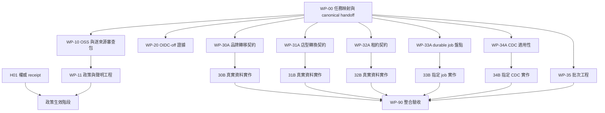

# ODP 人工決策落地與 Supervisor／Auto Worker 執行規畫

- 文件日期：2026-09-08。
- 編製者：Codex；決策來源：本對話使用者逐項回覆。
- 文件狀態：工作規畫與決策轉錄，已依使用者授權提交獨立審查（task `ODP-HUMAN-DECISIONS-EXECUTION-PLAN-001`，PR #1247，merge `be04fe79`，approved head `c7d97358`，reviewer：Codex）。**2026-09-09 更新**：11 個工作包已由 `ODP-HUMAN-DECISIONS-HANDBACK-INTEGRATION-001`（WP-90）完成正式匯入與派工映射（見 §9 執行登錄表）；Stage A 準備任務已全數完成合併，Stage B 與 follow-up 實作任務已建立（部分依 H01–H08 處於 blocked/todo）。本文件仍不是權威法務 receipt，不構成任何 exception、waiver 或人類簽署；各項目未獲真實資料/runtime 前仍保留未完成實作與 live 邊界。
- 編製時 canonical checkout：`9054479a776dce41e8a144c12032a85471a91f1b`。此為編製當下本機 canonical checkout 的 `dev` 指標，本輪實測**不存在於任何 remote branch**（`git branch -r --contains` 無結果），僅供追溯編製環境，不得當成 remote 可解析的證據引用。
- 本文件實際提交基準（task base）：`00c0347383806e8aa6679ed78215b4ac31b1da57`，即本輪 `origin/dev` tip。執行時重新解析最新基準，不固定使用上述任一 SHA。
- 適用範圍：OSS 使用政策、Google OIDC 關閉決策、六項原始需求的實作交付。

## 1. 目標與完成定義

將使用者已確認的選項落成可執行、可審查的工作，讓 Supervisor 派出所有已具備條件的工程任務；資料或權限未到位的部分需精確指出缺口。

使用者的「寬鬆」指降低本公司採用與維護成本、保留自家程式權利，不是授予他人更寬鬆的自家程式使用權。上游授權原有義務仍適用。本文件列的是內部政策方向，不重新判定上游授權條文。

完成分為四層，分別回報：

1. **決策轉錄完成**：選項有可追溯記錄，未把未回答欄位補成批准。
2. **任務交接完成**：canonical 任務具有範圍、owner、reviewer、依賴、驗收與驗證命令。
3. **工程交付完成**：程式、契約與測試通過 exact-head 審查及所需 CI，依既有流程合併與封存。
4. **實際能力完成**：涉及真實資料／runtime 的項目，有合法資料、執行與回讀證據，原始需求才可滿足。

本文件交付屬第 1 層及第 2 層的規畫準備，不代表已派工或功能完成。選擇「實作」已足以開始契約設計、程式盤點等工作；不必等 OSS receipt 才能做無關工程。

## 2. 已確認決策清單

本節準確轉錄對話。具名 approver 與權威系統 reference 仍待補；不以 `Human/Ops` 或 Codex 名稱充當正式簽署人。

### 2.1 OSS 個案

| 決策編號 | 個案 | 使用者選擇 | 落地方式 |
|---|---|---|---|
| D01 | LGPL-SHARP-LIBVIPS | A：允許使用 | 保留既有功能；檢核實際 binary、連結方式與適用的上游義務，允許不等於免除義務 |
| D02 | LGPL-PSYCOPG2 | A：接受上游 linking exception | receipt 綁定實際版本與例外條文；先確認當前依賴仍包含該版本 |
| D03 | LGPL-PSYCOPG3 | A：附條件允許 | 按已選條件處理動態連結、NOTICE、source offer、relink；不沿用 psycopg2 的例外 |
| D04 | LGPL-MOOCORE | A：附條件允許 | 動態載入、使用未修改的上游 binary、保留 NOTICE；核對實際發布形態的其他義務 |
| D05 | FIRST-PARTY-UNLICENSED | B：自家套件標示 UNLICENSED | 僅對能證明第一方身分的套件套用；保留自家權利，不將第三方 UNKNOWN 一併放行 |

D05 涵蓋對話列出的八個 workspace package：`@oday-plus/ui`、`@oday-plus/design-tokens`、`@oday-plus/testkit`、`@oday-plus/ui-domain`、`@oday-plus/domain-types`、`@oday-plus/schemas`、`@oday-plus/web`、`@oday-plus/openapi-client`。執行前核對仍存在的 package 與 ownership，不猜測新增套件的歸屬。

`UNLICENSED` 是套件授權標示，不是部署開關或供應鏈驗證結果；不應因此禁止本公司正常提供產品服務，也不應據此授予第三方自家原始碼權利。

### 2.2 OSS 共通政策

| 決策編號 | 項目 | 已確認方向 | 尚需落地 |
|---|---|---|---|
| D06 | Dev toolchain | TEMPORARY_ACCEPT，限內部 dev scope | 具體 finding／PURL、版本、release、理由、負責人、期限與複核日尚缺，不能啟用任何 exception |
| D07 | UNKNOWN／PROPRIETARY | 第一方可依 D05 處理；第三方逐件審查 | 第三方未審查前不進入可發布產物 |
| D08 | MIT、ISC、BSD、Apache 等 permissive licenses | 允許本公司使用，保留各自適用義務 | 明確 SPDX 清單與各授權義務；不得把所有義務一概套到每個 license |
| D09 | NOTICE／第三方聲明 | 每次發布自動產生並附帶 | 綁定實際 SBOM／發布物，驗證缺失或不一致能被偵測 |
| D10 | 例外核准權 | 具名且有權限的 Legal／Security／Risk | AI 可轉錄使用者指示、準備文件；不能自行裁決、冒名簽署或偽造回讀 |
| D11 | 例外範圍與期限 | 限 package／finding、環境、release、期限、複核；禁止永久或全域例外 | 每筆指定撤銷方式與 reopen trigger；未決欄位保持待補 |
| D12 | Receipt 驗證失敗 | 缺失、過期、不可回讀、scope／hash 不符時 fail closed | 限受影響的 gate；不讓無關工程一起停擺 |
| D13 | 窄 denylist | AGPL／SSPL／BSL 預設拒絕，GPL 逐件 review，LGPL 依個案 | 這是公司選定的分類，不是對所有版本或用途的法律結論 |
| D14 | 權威 receipt | 外部權威系統可回讀，含身分、scope、release、期限、hash／簽章資訊 | 系統、principal 與實際 reference 尚未提供；hash 只能驗完整性，不能單獨證明批准權 |

**修正前文歧義：** `TEMPORARY_ACCEPT` 若讓含 finding 的 audit 放行，本質上就是風險例外，不能稱它「不是 waiver」來繞過禁止規則。D06 目前只是政策方向；不追認 PR #1188 的 NLTK waiver，不修改 no-suppression/no-waiver 任務的要求，也不建立 waiver 檔、`--ignore-vuln` 或環境變數旁路。先取得當下未抑制的掃描結果；若已無 finding，直接記錄無需例外，不建立預防性空白例外。

### 2.3 OIDC 與六項原始需求

| 決策編號 | 項目 | 已確認方向 | 未完成條件 |
|---|---|---|---|
| D15 | Google OIDC | A：帳密為預設，Google OIDC 不啟用 | 核實 password-first／optional-OIDC 實作與證據，調整待命任務說明；不宣告 OAuth provider 已驗證 |
| D16 | SITE-001 BRAND_TRANSFER | A：實作／補齊真實資料與契約 | 真實品牌轉移來源、資料 ownership、schema、freshness、consumer integration |
| D17 | SITE-001 FORMAT_CONVERSION | A：實作／補齊真實資料與流程 | 轉型事件、停業、Capex、殘值、ramp 等業務定義與資料 |
| D18 | NET-002 LEASE | A：實作／補齊租約契約 | 每店租約、解約金、候選起迄檔期及可追溯來源 |
| D19 | SHARED-001 PARTIAL | A：實作 partial／receipt／retry | 真正 durable job 範圍、逐項結果、重試契約與 runtime 證據 |
| D20 | INT-001 CDC | A：實作／補齊 CDC 適用性與契約 | 具體來源、SLA、順序、刪除與權限需求；不是授權全面啟用所有 CDC |
| D21 | Merge queue 批次 | B：保留為正式實作需求 | 批次規格、實作、測試與實際 queue 回讀；參數尚未決定 |

D16–D21 均未選需求刪除或 waiver。選項字母只適用當時題目，不能把 D21 的 B 誤轉成其他題目的「修訂／不做」。

## 3. 三個 Human task 如何接續

| Canonical task | 本次可推進內容 | 保留的驗收缺口 |
|---|---|---|
| HUMAN-OSS-LEGAL-APPROVAL-001 | 交付 D01–D14 供政策文件與 receipt 準備 | 原 task 還要求**逐精確資料集**決定；目前沒有來源逐筆批准，也沒有權威 receipt |
| HUMAN-GCP-WEB-OAUTH-CLIENTS-001 | 記錄 D15 的關閉／按需啟用方向 | 先核實兩個 password-first 前置任務的完成證據；不得只刪依賴或標 provider 驗證完成 |
| HUMAN-ODP-OPEN-REQUIREMENT-DISPOSITIONS-001 | 記錄 D16–D21 已選實作，建立工程任務與後續資料請求 | 功能與資料證據未齊；人工方向已選不應繼續泛稱「等待是否實作」 |

對工程需求，資料齊備後走 `IMPLEMENTATION_READY → VERIFIED`，不把「選擇實作」登記成 waiver 專用的 `DECIDED`。人類交接 task 是否能結案，依原 acceptance 的決策轉錄與實際任務交接判定；原始功能仍保持自己的未完成狀態。

本輪未重查遠端 PR／merge 狀態。active board 查不到某 task 不等於依賴失蹤或未完成：派工前必須查 canonical archive、原 PR 與 exact SHA，再決定復用或恢復歷史。

## 4. 尚需使用者提供的資料

以下是具體資料請求，不重問已確認的 A／B 選項。未提供前可先做盤點、契約草案與離線工程。

| 編號 | 請求 | 使用者／權責人提供 | 工程方負責 |
|---|---|---|---|
| H01 | OSS 正式身分與來源 | 具名 approver、principal、實際授權角色、外部決策系統與可回讀 reference | 整理文件、確認系統已被現有 validator 信任，驗證回讀及雜湊 |
| H02 | Dev 風險接受個案 | 在最新 audit 清單上逐件確認理由、risk owner、有效／複核日期與範圍 | 先交未抑制 finding 清單與修復方案；不得讓使用者批准過期「13 high」數字 |
| H03 | 品牌轉移 | 公司已有的跨品牌交易／會員／panel 資料位置、資料負責人與授權範圍 | 資料字典、遮蔽樣本、品質／freshness 量測；沒有資料則交取得方案，不自行採購 |
| H04 | 店型轉換 | 真實轉型事件、原／新店型、財務與停業規則、資料負責人 | 定義契約、追蹤每個輸入來源、把可選欄位與必要欄位分開 |
| H05 | 租約 | 既有合約系統／授權匯出、解約／續約／復原費用與檔期 | 最小欄位契約與校驗；秘密與敏感原始合約不提交 repo |
| H06 | Durable job 範圍 | 在工程提供的候選清單上指定需要部分成功的業務工作 | 先盤點實際生產者，列出使用情境與結果差異 |
| H07 | CDC 需求 | 在來源矩陣上確認必要來源、可接受延遲、刪除與順序要求 | 先提出既有批次與 CDC 的能力差距；任何新 production 權限另附最小差異 |
| H08 | 批次 queue 目標 | 工程實測後若涉及等待時間／成本取捨，再確認產品目標 | 先量測隊列深度與 CI 時間、提出參數方案，不能只要求使用者猜數值 |

### 4.1 資料來源許可仍待逐筆處理

原 HUMAN-OSS task 引用的 `external-source-update-policy.md` 在 pinned 版本列了下列 16 個**來源群組**。它們不是精確 dataset 清單，也不是已批准的外部抓取範圍。

| 群組 | 準備審查時要拆出的資訊 |
|---|---|
| CWA、TDX | 各氣象／警示／停車／道路／公車 endpoint、範圍、發布頻率與 quota |
| 市場事件、MOF、MOI、RIS、NLSC | 逐資料集名稱、版本、地域、發布日、保存與顯名規則 |
| OSM、Overture | 精確 extract／release、用途、資料授權與衍生／再散布條件 |
| Foursquare、Google Places、TGOS | 實際契約／API 方案、可保存欄位、查詢用途、成本與配額 |
| 品牌門市定位器、Listings | 逐品牌／feed／網站與 endpoint 的授權依據；不能群組批准 |
| Mobility、Survey | 真實供應者、聚合與個資範圍、可用目的、保存期限 |

每筆最後交付：`source_id`、provider、dataset／endpoint、license／terms 版本、用途、商用範圍、保存／再散布限制、顯名、費用、quota、地域、官方發布頻率、建議更新週期、到期／複核日、證據 reference。未知欄位明記未知，不能將 runbook 的預設 cron 說成官方發布頻率。逐筆 ALLOW／ALLOW_WITH_OBLIGATIONS／DENY 留待使用者決定。

## 5. 任務建立與派工共同規則

以下 `WP-*` 是**本文件工作包識別碼**，不是已建立的 canonical task ID。Supervisor 匯入時先搜尋 active／archive：已有等價 execution task 就接續原 ID／PR；只有缺少後續執行任務時才建立新 ID，並回寫映射到本文件。已封存的稽核不因其功能尚缺就被當成未做過，也不重建同名任務。

- 實作 owner 從已啟用的 Claude／Antigravity execution lane 指派；審查由符合獨立性要求的 Codex reviewer 擔任。Human task 保留原 owner／reviewer，候選人不是已派工證據。
- 由既有 canonical writer 建立／更新任務，使用 Worker Manager、task_start、task_finalize 與 review／merge 流程；不手改 dashboard JSON、不新增另一個 scheduler。
- 每個 task 建立時固定 repository、base、owner、reviewer、task_class、source_refs、acceptance、verification、owned_paths、forbidden_paths、depends_on 與 blocker。路徑以當時 source tree 為準，以下路徑是範圍指引。
- 一個 worker 只取得一個可獨立交付的階段。不要把「盤點＋等待人類資料＋實作＋production」綁成永遠 in_progress 的大任務。
- 資料缺失只阻塞依賴該資料的階段；契約草案／離線測試可以完成，但不能冒充資料已驗證或實際功能完成。
- code review／CI 成功不替代資料、法務與 live 驗收。沿既有 governance 欄位記錄各層證據。

## 6. 工作包與驗收

### WP-00：決策轉錄、重複任務盤點與交接

- **優先級／owner**：P0；Claude execution，Codex review。
- **輸入**：本文件、三個 Human task、active／archive、原始 disposition 與原 PR。
- **交付**：決策到 task／PR／requirement 的映射；已存在、需接續、缺證據三類清單；更新人類待辦的 next，將「是否做」改為具體資料請求。
- **驗收**：D01–D21 全部有映射；每個新 task 具備 §5 欄位；active 缺項已查 archive；沒有重複 task／假 done／偽造 decision reference。
- **範圍**：本規畫、既有治理文件與 canonical writer。治理 manifest 集中由 WP-90 更新，避免多 worker 爭寫。

### WP-10：OSS 現況盤點、來源審查包與 receipt 準備

- **優先級／owner**：P0；Claude execution，Codex review。
- **可先做**：核對當前 lockfile、SBOM、NOTICE、license policy／gate；比對 2026-08-08 盤點，逐 case 列版本與變更；依 §4.1 拆資料來源審查卡。
- **交付**：當前 dependency／license 差異清單、未抑制 audit receipt、逐資料集決策卡、未簽署 receipt 草案、H01／H02 缺欄表。
- **驗收**：D01–D05 對應真實版本／第一方 ownership；舊 audit 數字不被引用為現況；逐來源未知資料明示；沒有把本文件雜湊當權威批准。
- **驗證**：復用當前 SBOM／audit／license 工具；只在需確認新狀態時跑適用掃描，保存原工具 exit code、SHA、時間及指令。
- **邊界**：不讀回 secret、不建立 exception、不開啟來源。這個工程包可完成，但 HUMAN-OSS 的正式批准另有 H01 等條件。

### WP-11：OSS 政策、第一方標示與自動聲明落地

- **優先級／owner**：P1；Antigravity execution，Codex review。
- **階段一**：WP-10 後更新政策提案與測試、明確第一方 `UNLICENSED`；復用既有 NOTICE generator，僅補缺口，不重建工具。
- **階段二**：需權威批准才生效的政策，等 H01 與適用 receipt 驗證成功後才啟用。H02 未齊不建立 dev 例外。
- **驗收**：第三方 unknown 不因第一方規則被放行；GPL review／窄 denylist 符合 D13；發布物的 NOTICE 對應該版 SBOM，含適用聲明；receipt 過期／竄改／scope 不符會被現有 gate 拒絕。
- **範圍**：經獨立工程 task 授予的 package manifests、`docs/security/license_policy.json`、既有 license／NOTICE 工具與測試；HUMAN-OSS 的 forbidden_paths 不因本文件而解除。
- **驗證**：適用 license gate、NOTICE／SBOM contract 回歸及 required CI；無需為文件改動重跑全產品 suite。

### WP-20：Password-first／OIDC-off 證據與待辦對齊

- **優先級／owner**：P1；Claude execution，Codex review。
- **工作**：查 `ODP-WEB-OIDC-OPTIONAL-DEPLOYMENT-001` 與 `ODP-WEB-PASSWORD-FIRST-SECURITY-E2E-001` 的 archive／PR／證據；核對最新設定如何選擇 password-first。
- **交付**：已驗證與未驗證分列的矩陣，OAuth human task 改為將來明確啟用時才需要的待命交接。
- **驗收**：帳密登入路徑不要求 OAuth client secret；OIDC 關閉時不呈現可用的 Google 登入、不呼叫該 provider；未因此弱化 session／CSRF／callback 驗證；有 regression 證據才對齊部署依賴。
- **邊界**：此包不建立 OAuth clients，不讀 secret，不修改 live deployment。若現有證據足夠就引用，不重做已完成能力。

### WP-30：BRAND_TRANSFER 契約與實作

- **優先級／owner**：P1；Claude execution，Codex review。
- **30A 可先派**：定位現有 brands、model-ready view、SiteScore consumer；交契約草案及 H03 清單。建議欄位包括來源／目標品牌、時間窗、地域、觀測樣本、轉移量／比例、量測方法、confidence、source reference、freshness；統計定義仍需資料 owner 確認。
- **30B 入場條件**：H03 合法資料及穩定契約到位；取得對應 source ingestion 的權限。producer／consumer 分 repo 且以版本化契約交接。
- **交付**：真實 producer、儲存／model-ready 視圖、SiteScore consumer 與結果來源回溯；將合成值隔離於明示的測試 fixture。
- **驗收**：不同品牌轉移資料會改變相應輸出；缺失、過期、樣本不足不變成 `0.15`／`1.0`；隔離不同 tenant／來源；真實資料端到端可回溯。
- **範圍**：既有 source contract、`pipelines/dbt/models/model_ready/` 中本 feature、`modules/sitescore/` 及對應 tests。與 WP-31 共享檔案時串行。

### WP-31：FORMAT_CONVERSION 契約與實作

- **優先級／owner**：P1；Antigravity execution，Codex review。
- **31A 可先派**：盤點既有店型與模擬器；草擬真實轉型事件 schema，列 store、原／新店型、生效／停業區間、改裝 Capex、殘值／處分費、ramp、資料來源與版本。
- **31B 入場條件**：H04 真實事件與財務定義到位；跨 source／consumer 契約核對完成。
- **交付**：事件寫入與回讀、Brownfield 轉型成本／收益路徑、可解釋輸出。
- **驗收**：停業天數、改裝成本、殘值與 ramp 的改變有可驗證影響；缺資料明示；新店選型不冒充轉型；回放事件不重複計費或重複套用。
- **範圍**：店型事件契約／儲存、既有 simulator 與 consumer；與 WP-30 協調共享 scoring 檔案。

### WP-32：NET-002 租約資料與硬限制

- **優先級／owner**：P1；Claude execution，Codex review。
- **32A 可先派**：盤點並設計 H05 最小契約；包含 store／candidate、租約起迄、續約、提前終止／押金／復原費、裝修許可、新址可得／簽約截止日與 lineage。
- **32B 入場條件**：真實租約來源、必要欄位及可用檔期完成驗證。
- **交付**：既有 NetPlan 輸入、admissibility、MIP／CP-SAT 一致約束及 UI 揭露。
- **驗收**：OPEN／KEEP／IMPROVE／MOVE／EXIT 分別測試；MOVE 同時驗舊約與新址；衝突方案被拒絕或標不可判定；missing 不等於零解約金；已量測為零仍可合法使用；兩 solver 判斷一致。
- **範圍**：`modules/netplan/`、`solver/netplan/`、租約契約／儲存及既有 disclosure consumer。與現有 NetPlan task 重複的部分復用。

### WP-33：SHARED-001 durable PARTIAL 與逐項重試

- **優先級／owner**：P1；Antigravity execution，Codex review。
- **33A 可先派**：從實際 handler／queue／狀態寫入點盤點候選；可信 runtime 可讀時補 inventory，無存取時清楚標 static-only。交 H06，不能把同步 207 或 XLSX 結果當 durable producer。
- **33B 入場條件**：至少一個真實業務 job 被指定採用 partial，鎖定結果與重試語意。
- **交付**：job／item ID、逐項 outcome／error／attempt／結果 reference、aggregate 狀態、失敗項 retry、API 回讀。取消、空批次與最終 aggregate 規則需在契約中明確。
- **驗收**：混合成功／失敗真實寫 PARTIAL；重試不重做成功項；重啟後 receipt 可讀；重複／亂序訊息冪等；JobStatus 與 RETRYING／DEAD_LETTER delivery state 保持區分。
- **範圍**：既有 shared job contract、實際 durable handler、API／queue／儲存及必要 UI；不另建第二套 job manager。

### WP-34：INT-001 CDC 適用性、刪除傳播與實作

- **優先級／owner**：P1；Claude execution，Codex review。
- **34A 可先派**：逐來源整理讀取模式、owner、資料延遲、排序、刪除／撤回、冪等與最小權限；更新舊稽核事實後交 H07。舊文的權限描述不直接當成新的 IAM 設計。
- **34B 入場條件**：指定實際 CDC 來源與 SLA、契約及所需權限。若資料尚不支持設計，回報具體缺口，不把 D20 偷改成不做。
- **交付**：依既有 ingestion 模式建立 scoped adapter、checkpoint／resume、事件 envelope 與 tombstone／delete consumer；先盤點已有刪除傳播缺陷，能獨立處理則拆子任務。
- **驗收**：新增、更新、刪除／撤回、重複、亂序、斷線恢復與 checkpoint 回放；tenant 隔離、資料最小化、真實延遲與最後一致狀態證據。空 connector 不算完成。
- **邊界**：新增 production credential／broker／來源啟用需提出具體變更與依據；離線契約與測試可先行。

### WP-35：Merge queue 批次正式需求與交付

- **優先級／owner**：P1；Antigravity execution，Codex review。
- **35A 可先派**：將第 19 項舊「已裁決不做」對齊 D21；在交付治理文件登錄批次需求。只讀量測 queue 深度、等待、CI 時間／失敗率；提出 min／max batch、max wait、失敗隔離與回退條件。
- **35B 工程**：復用原 queue 能力與 policy-as-code；查當前平台支援與精確設定，完成參數化配置／契約測試。數值由量測提出，不能因 user 選 B 就擅自設定。
- **驗收**：多個合格 PR 可形成有效 batch；無限等湊數被 bounded wait 防止；未核准／required check 失敗者不能混入；head 變更重新驗證；批次失敗可隔離並重排；merge_group 所需 CI 真正執行。
- **35C live 驗收**：交付具體 reviewed config diff、目標 repo／branch、前後 readback、回退與觀測方案，再循既有設定啟用授權流程執行。PR／文件交付不算 live 批次已驗證。
- **範圍**：`.github/branch-protection/policy.json`、既有 queue 工具／workflow contract／runbook；不刪 required checks、不降低 review gate、不另建 merge bot。

### WP-90：集中整合、需求狀態與 Structural Closeout

- **優先級／owner**：P1；Claude execution，Codex review。
- **依賴**：相應工作包的已合併與驗證證據。可增量登錄已完成部分，全案 closeout 等全部必要項目。
- **交付**：集中更新 requirement manifest、governance registry、open-decisions、原 Human task handback 與 `ODP-STRUCTURAL-REMEDIATION-CLOSEOUT-001` 的引用。
- **驗收**：D16–D20 每一 member 指向真實 producer／consumer 與測試；D21 指向交付治理需求及 queue 證據，不憑空冒稱已有 ODP-FR ID；code、live、Human acceptance 各層清楚。
- **驗證**：既有 `check_requirement_members.py`、相關治理回歸與 required CI；治理格式通過不得當成六項功能均完成。

## 7. 最大可行平行執行

30B／31B／32B／33B／34B 各自另外受 H03–H07 與相應契約完成條件約束，圖中的箭頭不代表已滿足這些條件。

**第一批**：WP-00 完成映射後，WP-10、WP-20、30A、31A、32A、33A、34A、35A 可在路徑不衝突下平行。H01 缺失不阻塞其他契約工程。

**第二批**：每條線的必要資料到位就接續其 B 階段，不要求所有資料同時到齊。共享 migration ordinal、generated contract、scoring 或 governance 檔案由單一 task 整合，其他 worker 交 scoped 片段。

**派工上限**：每輪讀取當時 enabled slots、帳戶有效併發、reviewer 容量、workspace lease 與 task readiness。前文 14／9 slots 與 0 runnable 是舊觀測，不當成當下容量承諾。配置容量也不保證每個 execution lane 都能使用 reviewer slots。

**避免空轉**：waiting-data／waiting-approval 的階段記錄具體 blocker 與重新檢查事件；不要重派同樣工作消耗 quota。已有 CI run 時等原 run 收據，不因問進度重跑。CI 綠燈後進審查／合併，不重跑全套只為湊測試數。

## 8. 驗證、回退與完成回報

1. 契約階段驗 schema／樣本／邊界，模擬資料明確標示 fixture；缺真實資料不宣稱 runtime 完成。
2. 實作跑受影響單元／整合測試及 required CI，保存 exact SHA、原命令、時間、exit code、CI URL／run ID。
3. Reviewer 審 exact head 與驗收；head 改變就重新依流程審查，禁止復用不相符批准。
4. 資料 migration 使用現有 reversible migration 流程；資料不合格回到不可用／待補，不補零／高信心常數。
5. Queue 設定回退至前一個已審查設定；保留 required checks／review gate。OIDC 維持 off，未批准來源保持 off。
6. OSS receipt 失效時阻擋適用路徑，記錄具體原因；不自動延長有效期、不刪 finding。文件修正、風險修復、UI 告警解除分開回報。

每輪 Supervisor 回報至少包含：task ID、目前階段、owner／reviewer、running worker／queue event、PR head、CI 原 run、已通過驗收、缺口、下一個可觀測事件、等待責任人。任務建立、派出、worker 存活、CI 通過、合併、runtime 完成是不同事實。

本次規畫不包含 production deploy／GO／lease、啟用外部來源、提前清除 retention 資料或清除此對話平台告警。這些各有既有執行路徑；六項需求未完成也不一概增加為 sources-off dev 基礎部署前置。

## 9. 執行登錄表 (已於 WP-90 完成映射)

本表已由 `ODP-HUMAN-DECISIONS-HANDBACK-INTEGRATION-001` (WP-90) 完成正式匯入與映射，真實記錄各工作包之 canonical 任務 ID、PR 編號、Approved HEAD SHA、Owner、Reviewer、目前狀態與驗收收據。

| 工作包 | Canonical task／PR 映射 | 正式 owner／reviewer | 當前階段／blocker | 驗收收據 |
|---|---|---|---|---|
| WP-00 | `ODP-HUMAN-DECISIONS-EXECUTION-PLAN-001` (PR #1247, merge `be04fe79`, head `c7d97358`) | Claude / Codex | `done` (archived) | 本規畫文件 (`docs/plans/ODP_HUMAN_DECISIONS_EXECUTION_PLAN_2026-09-08.md`) |
| WP-10 | `ODP-OSS-DECISION-PACK-001` (PR #1255, merge `b6b729d9`, head `21a5e783`) | Antigravity2 / Codex | Stage A `done` (archived)；Stage B 等 H01/H02 簽署 | `docs/evidence/human-decisions/ODP-OSS-DECISION-PACK-001/` (SBOM `sbom.cdx.json`, `npm-audit-receipt.json`, 16 來源決策卡) |
| WP-11 | `ODP-OSS-POLICY-NOTICE-IMPLEMENTATION-001` (PR #1279) | Antigravity2 / Codex | `review`；8 個第一方套件 `UNLICENSED` 與 NOTICE 落地；生效另等 H01 | PR #1279 head SHA & CI 收據 |
| WP-20 | `ODP-OIDC-OFF-EVIDENCE-ALIGNMENT-001` (PR #1253, merge `0af51e04`, head `9fc7e2a8`) | Claude / Codex2 | `done` (archived)；`HUMAN-GCP-WEB-OAUTH-CLIENTS-001` 轉待命 | `docs/evidence/human-decisions/ODP-OIDC-OFF-EVIDENCE-ALIGNMENT-001/` (`auth-mode-evidence-matrix.json` 15 controls, `human-task-handoff.json`) |
| WP-30 | Stage 30A: `ODP-BRAND-TRANSFER-CONTRACT-PREP-001` (PR #1254, merge `7a25dfea`, head `961225f6`)；Stage 30B: `ODP-BRAND-TRANSFER-IMPLEMENTATION-001` | 30A: Antigravity2 / Codex；30B: Claude / Codex | Stage 30A `done` (archived)；Stage 30B `blocked` (等 H03 真實資料) | `docs/evidence/human-decisions/ODP-BRAND-TRANSFER-CONTRACT-PREP-001/` (`contract-draft.json`, `field-dictionary.md`, `human-input-request-H03.md`) |
| WP-31 | Stage 31A: `ODP-FORMAT-CONVERSION-CONTRACT-PREP-001` (PR #1252, merge `ae2472a4`, head `a64b26c4`)；Stage 31B: `ODP-FORMAT-CONVERSION-IMPLEMENTATION-001` | 31A: Claude / Codex2；31B: Claude2 / Codex2 | Stage 31A `done` (archived)；Stage 31B `blocked` (等 H04 事件與財務定義) | `docs/evidence/human-decisions/ODP-FORMAT-CONVERSION-CONTRACT-PREP-001/` (`event-contract-draft.json`, `field-dictionary.md`, `human-input-request-H04.md`) |
| WP-32 | Stage 32A: `ODP-NET002-LEASE-CONTRACT-PREP-001` (PR #1256, merge `95646a5c`, head `d7056316`)；Stage 32B: `ODP-NET002-LEASE-IMPLEMENTATION-001` | 32A: Antigravity2 / Codex；32B: Claude / Codex2 | Stage 32A `done` (archived)；Stage 32B `blocked` (等 H05 租約匯出與檔期) | `docs/evidence/human-decisions/ODP-NET002-LEASE-CONTRACT-PREP-001/` (`lease-contract-draft.json`, `solver-acceptance-matrix.md`, `human-input-request-H05.md`) |
| WP-33 | Stage 33A: `ODP-DURABLE-PARTIAL-CONTRACT-PREP-001` (PR #1257, merge `1c7bb182`, head `57019d8d`)；前置修正: `ODP-JOB-DELIVERY-STATE-CLEAR-001` (PR #1280)；Stage 33B: `ODP-DURABLE-PARTIAL-IMPL-001` | 33A: Claude2 / Codex2；前置: Antigravity / Codex2；33B: Claude2 / Codex | Stage 33A `done` (archived)；前置 PR #1280 `review`；Stage 33B `blocked` (等 H06 業務 job 選定) | `docs/evidence/human-decisions/ODP-DURABLE-PARTIAL-CONTRACT-PREP-001/` (`producer-inventory.json`, `partial-retry-contract-draft.json`, `human-input-request-H06.md`) |
| WP-34 | Stage 34A: `ODP-CDC-SOURCE-CONTRACT-PREP-001` (PR #1258, merge `414b5c17`, head `ec3a2188`)；跟進: `ODP-DATA-PLANE-DELETE-PROPAGATION-001`, `ODP-SCHEMA-STORE-OPENING-AUTHORITY-001`, `ODP-DATA-CATALOG-METADATA-ALIGNMENT-001`；Stage 34B: `ODP-CDC-SCOPED-ADAPTER-IMPLEMENTATION-001` | 34A: Antigravity2 / Codex；跟進 1: Antigravity3 / Codex2；跟進 2: Antigravity2 / Codex；跟進 3: Claude / Codex2；34B: Claude / Codex2 | Stage 34A `done` (archived)；三個跟進任務 `todo`；Stage 34B `blocked` (等 H07 來源與 SLA) | `docs/evidence/human-decisions/ODP-CDC-SOURCE-CONTRACT-PREP-001/` (`source-applicability-matrix.json`, `event-contract-draft.json`, `human-input-request-H07.md`) |
| WP-35 | Stage 35A: `ODP-MERGE-QUEUE-BATCH-DESIGN-001` (PR #1250, merge `7a2caa0a`, head `1ed3f7a9`)；Stage 35B: `ODP-MERGE-QUEUE-BATCH-IMPLEMENTATION-001` | 35A: Claude2 / Codex；35B: Claude2 / Codex | Stage 35A `done` (archived)；Stage 35B `blocked` (等 H08 參數選擇) | `docs/evidence/human-decisions/ODP-MERGE-QUEUE-BATCH-DESIGN-001/` (`queue-observations.json`, `configuration-options.md`, `governance-handoff.md`) |
| WP-90 | `ODP-HUMAN-DECISIONS-HANDBACK-INTEGRATION-001` | Antigravity / Codex2 | `in_progress`；集中整合 21 決策、8 項 A 階段成果與後續實作映射 | `docs/evidence/human-decisions/ODP-HUMAN-DECISIONS-HANDBACK-INTEGRATION-001/README.md` |

## 10. 證據來源與時效限制

- 本對話逐題回答是 D01–D21 的來源。編製日不冒充實際外部批准時間；對話轉錄不是可驗身分的外部法務 receipt。
- `ai-status.json`：本輪讀取三個 Human task 的 acceptance、source_docs、forbidden_paths。動態 task status 在派工時重讀。
- [OSS 舊盤點](../evidence/oss-legal-policy/LICENSE_INVENTORY_2026-08-08.md) 與 [舊法務交辦單](../evidence/OSS_LEGAL_POLICY_HUMAN_HANDOFF_2026-07-31.md)：僅供 case／receipt 契約溯源。舊版本、漏洞數與「尚無 gate」敘述不得當成現況。
- [Merge queue disposition audit](../evidence/ODP_MERGE_QUEUE_DISPOSITION_2026-09-03.md)：本地舊稽核證據，D21 已提供新的實作方向，舊「不做」不得沿用。
- 六項需求的 pinned 文件基準：`alfloop-dev/odayplus@04e1572f802a54c2646ba678fe2975226dfbd7c4`。本輪從本地 source-doc-cache 讀取 SITE001、NET002、JOB_PARTIAL、INT001 disposition 與 governance policy；它們描述 2026-09-03 查證，不保證今天程式仍相同。
- [SITE001 pinned evidence](https://github.com/alfloop-dev/odayplus/blob/04e1572f802a54c2646ba678fe2975226dfbd7c4/docs/evidence/ODP_SITE001_COMPONENT_DISPOSITIONS_2026-09-03.md)、[NET002 pinned evidence](https://github.com/alfloop-dev/odayplus/blob/04e1572f802a54c2646ba678fe2975226dfbd7c4/docs/evidence/ODP_NET002_LEASE_DISPOSITION_2026-09-03.md)、[PARTIAL pinned evidence](https://github.com/alfloop-dev/odayplus/blob/04e1572f802a54c2646ba678fe2975226dfbd7c4/docs/evidence/ODP_JOB_PARTIAL_DISPOSITION_2026-09-03.md)、[CDC pinned evidence](https://github.com/alfloop-dev/odayplus/blob/04e1572f802a54c2646ba678fe2975226dfbd7c4/docs/evidence/ODP_INT001_CDC_DISPOSITION_2026-09-03.md)、[governance pinned policy](https://github.com/alfloop-dev/odayplus/blob/04e1572f802a54c2646ba678fe2975226dfbd7c4/docs/governance/ODP_REQUIREMENT_DISPOSITIONS.md)。這些連結供定位 immutable 來源，本輪未發出遠端請求。
- [來源更新 pinned policy](https://github.com/alfloop-dev/oday-data-platform/blob/cf5c48d60f3d33b9863b0458f44b4fd49d842b12/docs/runbooks/external-source-update-policy.md)：本地 cached copy；§4.1 的群組來自該文，不是本輪查核的官方授權結論。

編製本文件沒有執行產品測試、audit、部署或派工；此處列出的測試與操作都是後續任務的驗收規畫。正式交付時須附真實執行證據。
