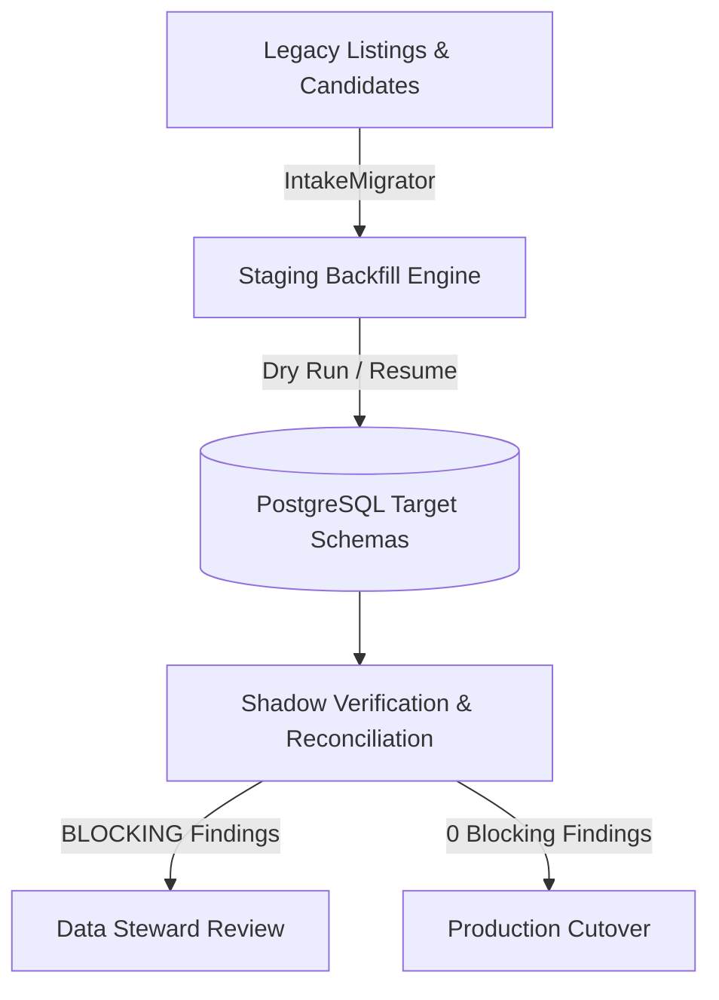

# Operational Runbook: Assisted Listing Intake Migration & Rollback

**Migration Ref**: `ODP-INTAKE-MIGRATION-001`
**Subsystem**: Assisted Listing Intake & Expansion
**Target Schema**: `intake`, `identity`, `expansion`, `workflow`, `audit`

---

## 1. Overview & Architecture

This runbook outlines the operational procedures for executing the staging backfill, data reconciliation, shadow identity comparison, rollback, and forward recovery for the Assisted Listing Intake subsystem migration (`ODP-INTAKE-MIGRATION-001`).

The migration transitions legacy listing ingestion and candidate site drafts into formal relational schemas with full lineage tracking, row-level security (RLS), and snapshot verification.



---

## 2. Pre-Migration Prerequisites & Verification

Before executing any migration in staging or production:

1. **Verify Database State**:
   ```bash
   uv run pytest tests/contract/test_assisted_listing_intake_schema.py -v
   uv run pytest tests/integration/test_assisted_listing_intake_persistence.py -v
   ```

2. **Verify Auto Worker & Environment**:
   ```bash
   AI_NAME=Antigravity3 python3 scripts/ai_status.py
   ```

---

## 3. Staging Backfill Execution

The backfill process supports dry-run validation, partition-level execution (by tenant, source, or month), and resuming interrupted backfills cleanly.

### 3.1 Dry Run Execution (Verification Only)

Run a dry run to validate mapping rules and check for potential reconciliation findings without committing changes to the database:

```python
from scripts.migrations.assisted_listing_intake.migrate import IntakeMigrator

migrator = IntakeMigrator(db_conn)
report = migrator.backfill(
    legacy_intakes=intakes,
    legacy_listings=listings,
    legacy_candidates=candidates,
    dry_run=True,
)
print(report)
```

### 3.2 Partitioned Live Backfill

Backfill specific tenants, sources, or monthly partitions:

```python
# Backfill Tenant A for July 2026
report = migrator.backfill(
    legacy_intakes=intakes,
    legacy_listings=listings,
    legacy_candidates=candidates,
    tenant_id="00000000-0000-0000-0000-00000000000a",
    source_id="SRC-591",
    month="2026-07",
    dry_run=False,
    resume=True,
)
```

---

## 4. Reconciliation Findings & Shadow Verification

Every backfill execution automatically analyzes target records and records findings into `workflow.reconciliation_findings`.

### 4.1 Shadow Verification Command

Run shadow comparison to prove data count parity and check for blocking findings prior to cutover:

```python
results = migrator.verify_shadow_comparison(tenant_id="00000000-0000-0000-0000-00000000000a")

assert results["shadow_comparison_success"] is True
assert results["blocking_findings"] == 0
```

### 4.2 Handling Findings

- **BLOCKING Findings** (`STATE_MAPPING_CONFLICT`, `CROSS_TENANT_REFERENCE`):
  - **Action**: Must be resolved by a Data Steward or assigned a waived approval before cutover.
- **WARNING Findings** (`MISSING_EVIDENCE`, `DUPLICATE_CANDIDATE`):
  - **Action**: Legacy candidate is quarantined with status `REJECTED`, preserving historical lineage without creating active candidate conflicts.

---

## 5. Rollback & Forward Recovery Runbook

### 5.1 Trigger Conditions for Rollback

Execute rollback if any of the following occur during staging or cutover validation:
1. `shadow_comparison_success` returns `False` due to unresolvable data corruption.
2. High-severity data loss or tenant isolation leakage.
3. Live application error rate increases above SLA threshold during canary deployment.

### 5.2 Rollback Procedure

To roll back the relational intake schema cleanly:

```python
migrator = IntakeMigrator(db_conn)
migrator.rollback_schema()
```

This safely drops `intake`, `identity`, `expansion`, `workflow`, and `audit` upgrade tables without destroying the legacy document store tables.

### 5.3 Forward Recovery Procedure

If blocking findings occur during backfill:

1. **Query Open Findings**:
   ```sql
   SELECT finding_id, source_kind, source_id, finding_type, severity, expected, actual
   FROM workflow.reconciliation_findings
   WHERE status = 'OPEN' AND severity = 'BLOCKING';
   ```
2. **Apply Remediation**:
   - Provide missing source evidence/revisions for legacy candidates.
   - Re-run backfill with `--resume` enabled.
