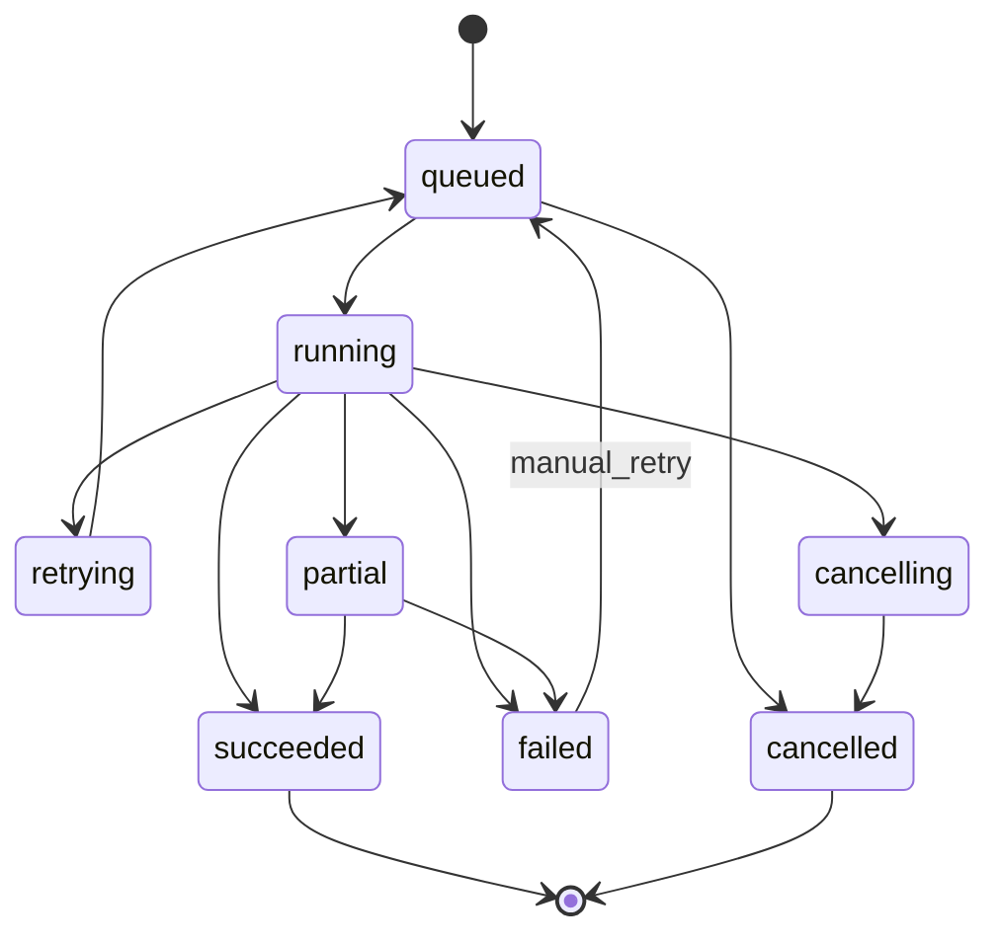
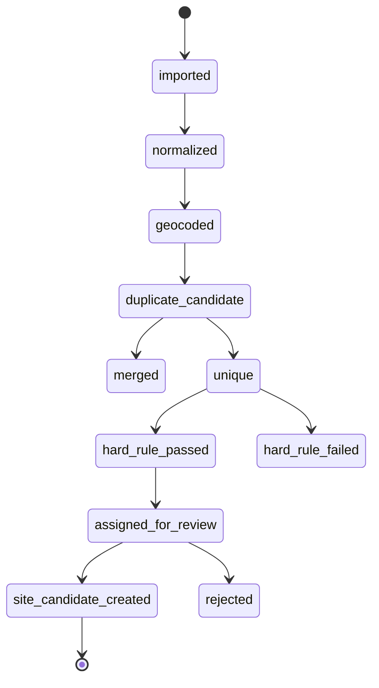
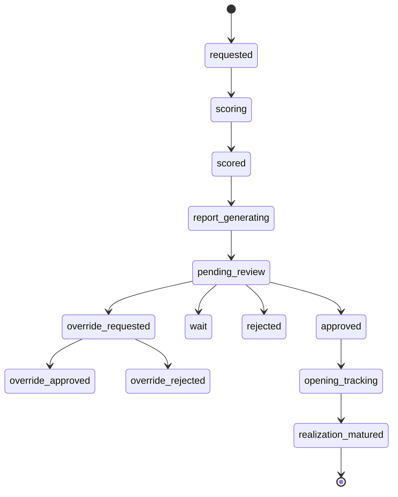
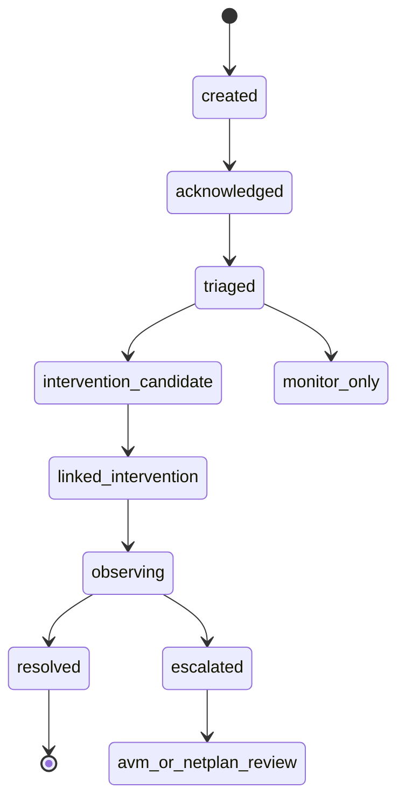
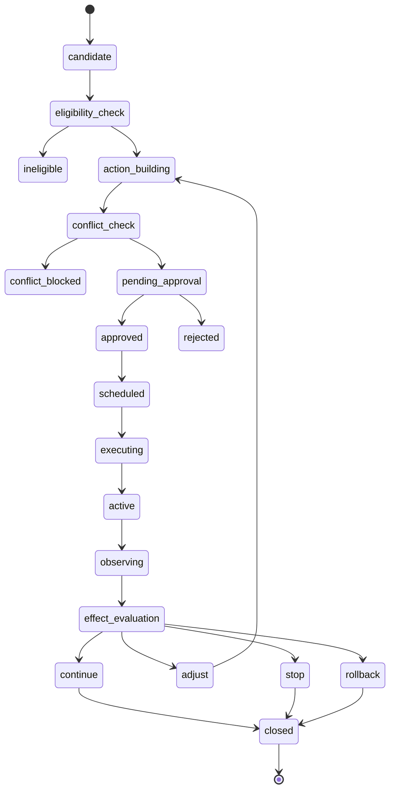
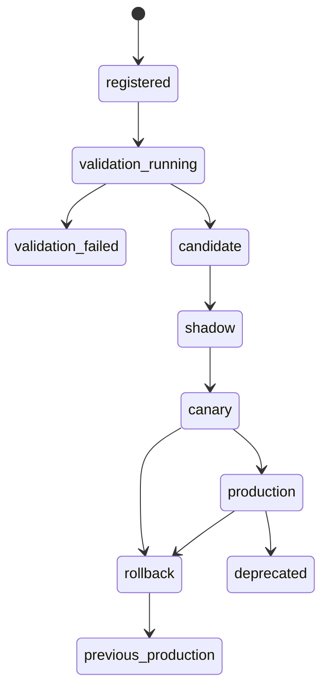

# ODay Plus Workflow、Job 與狀態機設計

## 1. 文件目的

本文件定義 ODay Plus 的長流程、人工核准、批次 Job、非同步任務與狀態機設計。它確保 SiteScore、ForecastOps、InterventionOps、PriceOps、AdLift、DealRoomAVM、NetPlan 與 Learning Hub 能用一致的狀態、重試、取消、審核與稽核模式運作。

## 0. 文件基線與引用規則

本文件屬於第 4 批「平台 SD 主文件」，必須與第 1 至第 3 批文件共同使用：

| 參照文件 | 用途 |
|---|---|
| `ODP-00-01_SCOPE_AND_BOUNDARIES.md` | 系統範圍、完整目標架構、上游 IoT／內部資料底座責任邊界 |
| `ODP-00-02_GLOSSARY_AND_SEMANTICS.md` | 全平台名詞、狀態、代碼與共用業務語意 |
| `ODP-00-03_STAKEHOLDERS_AND_RACI.md` | Ownership、RACI、責任分離與治理會議 |
| `ODP-00-04_DOCUMENT_VERSION_AND_ADR_GOVERNANCE.md` | 文件版本、ADR、Deviation、變更與核准流程 |
| `ODP-00-05_REQUIREMENTS_TRACEABILITY_MATRIX.md` | HLR、FR、SD、Test、Evidence 的追蹤骨架 |
| `ODP-SA-01` 至 `ODP-SA-10` | 業務架構、流程、角色、FR、NFR、整合與 KPI 基線 |
| `ODP-DATA-01` 至 `ODP-DATA-07` | 資料來源、交換契約、Canonical Model、Model-ready Views、資料品質與時間語意 |

來源基線：`SRC-ODP-ARCH`、`SRC-ODP-PLAN`、`SRC-ODP-REVIEW`、`SRC-LEGACY-CLOUD`、`SRC-WORKING-DECISIONS`。若本文件與第 1 批治理文件衝突，以第 1 批治理文件及已核准 ADR 為準。

規範用語：本文中的「必須」表示驗收必要條件；「不得」表示禁止；「應」表示預設要求，若不採用必須有核准 Deviation；「可」表示可選或延伸能力。

## 2. Workflow 與 Job 分工

| 類型 | 定義 | 例子 |
|---|---|---|
| Job | 可執行、可重試、產生明確結果的技術任務 | geocode、sitescore_score、forecast_daily_score、solver_run |
| Workflow | 含多步驟、人工核准、等待事件或長時間觀察的業務流程 | SiteScore approval、Intervention lifecycle、Model release |
| Task | 指派給人員的工作項目 | 現勘、審核、處置回報、資料修正 |
| State Machine | 資源生命週期與允許轉換 | Listing status、Alert status、Intervention status |
| Schedule | 定時觸發的 job/workflow | 每日 Forecast、每週 HeatZone、每月 retraining |

## 3. 共用 Job Model

### 3.1 Job 欄位

| 欄位 | 說明 |
|---|---|
| `job_id` | Job ID |
| `job_type` | `sitescore_score`、`forecast_score`、`netplan_solve` 等 |
| `status` | `queued`、`running`、`succeeded`、`failed`、`retrying`、`cancelled`、`partial` |
| `priority` | low/normal/high |
| `submitted_by` | actor 或 system |
| `submitted_at` | 建立時間 |
| `started_at` / `finished_at` | 執行時間 |
| `correlation_id` | 追蹤 ID |
| `idempotency_key` | 冪等鍵 |
| `input_ref` | GCS/DB/BQ input snapshot reference |
| `output_ref` | 結果 reference |
| `error_code` / `error_detail` | 失敗資訊 |
| `retry_count` / `max_retries` | 重試資訊 |
| `cancel_requested` | 取消標記 |
| `owner_service` | 負責服務 |

### 3.2 Job 狀態機

## 4. Workflow Engine 選擇

| 選項 | 適用 | 備註 |
|---|---|---|
| Google Workflows | 串接 GCP 服務、相對簡單流程 | 快速、雲原生；人工長流程需搭配 DB 狀態 |
| Temporal OSS | 長時間 workflow、人工核准、retry、signal、query | 推薦作為複雜狀態機候選；可 Cloud Run/GKE 部署 |
| Camunda | BPMN 與業務流程視覺化 | 若非工程使用者需流程編排可評估 |
| 自建輕量狀態機 | 第一版快速落地 | 必須有明確 transition table、audit、timeout |

第一版可先使用「Cloud SQL 狀態機 + worker + Pub/Sub + scheduler」；若流程複雜度提高，再以 ADR 導入 Temporal。

## 5. 主要狀態機

### 5.1 Listing 狀態

| 狀態 | 說明 |
|---|---|
| `imported` | 原始匯入 |
| `normalized` | 欄位與地址正規化完成 |
| `geocoded` | 已取得座標與 H3 |
| `duplicate_candidate` | 需去重判斷 |
| `merged` | 合併至既有物件 |
| `unique` | 判定為唯一物件 |
| `hard_rule_passed` | 通過硬性條件 |
| `hard_rule_failed` | 未通過硬性條件 |
| `assigned_for_review` | 指派業務或審查 |
| `site_candidate_created` | 產生 Candidate Site |
| `rejected` | 人工或規則拒絕 |

### 5.2 SiteScore Workflow

### 5.3 Alert Workflow

### 5.4 Intervention Workflow

### 5.5 Model Release Workflow

## 6. Scheduled Jobs

| Job | 頻率 | 觸發 | 產出 |
|---|---|---|---|
| `external_source_sync` | daily/weekly/monthly | Cloud Scheduler | source snapshots |
| `geocode_batch` | daily/on demand | source ingested | geocode results |
| `geo_feature_build` | weekly/monthly | schedule | geo_grid_view |
| `heatzone_score` | weekly/monthly | geo feature refreshed | heatzone score run |
| `listing_dedup` | on demand/daily | listing imported | duplicate groups |
| `forecast_daily_score` | daily | transactions refreshed | forecast outputs / alerts |
| `data_quality_check` | daily/per pipeline | source/model-ready refresh | dq report |
| `drift_monitor` | daily/weekly | prediction logs | drift report |
| `model_backtest` | per model release | model registered | validation results |
| `outcome_maturity_scan` | daily | schedule | matured outcomes |
| `avm_refresh` | monthly/on demand | financial close | valuation update |
| `netplan_quarterly_solve` | quarterly/on demand | management cycle | network plan |

## 7. Timeout、Retry、Cancellation

| 類型 | Timeout | Retry | Cancel |
|---|---|---|---|
| Geocode | per item + batch timeout | retry transient provider error | yes |
| SiteScore scoring | minutes | retry model/service transient | yes before completed |
| Report generation | minutes | retry render/storage transient | yes |
| Forecast scoring | daily window | retry task partition | yes with rerun |
| Effect evaluation | observation matured | retry data unavailable later | no if finalized |
| Pricing optimizer | minutes | retry solver transient | yes |
| NetPlan solver | configured long timeout | retry only if infrastructure error | yes, checkpoint if possible |
| Model training | hours | retry infrastructure only | yes |

## 8. 人工核准規則

| 動作 | 是否必須核准 | 核准角色 | 附加條件 |
|---|---|---|---|
| SiteScore GO | MUST | 展店審查／管理層 | 高風險或 override 需二級核准 |
| Price action | MUST | 定價／營運主管 | 毛利底線零違反 |
| Ad spend change | SHOULD/MUST by threshold | 行銷主管 | 超過預算需管理層 |
| Maintenance/Cleaning | SHOULD | 區域督導 | 可依金額自動 |
| AVM reserve price | MUST | 財務／法務 | 估值正常化需核准 |
| NetPlan MOVE/EXIT | MUST | 管理層 | 需 Alternative Plan |
| Model promotion | MUST | Model Owner + Release Owner | 驗證通過 |
| Data quality override | MUST | Data Owner + Security if sensitive | 需 expiry |

## 9. Workflow Audit

每次 state transition 必須記錄：

| 欄位 | 說明 |
|---|---|
| `workflow_instance_id` | 流程 ID |
| `entity_type` / `entity_id` | 對應資源 |
| `from_state` / `to_state` | 狀態轉換 |
| `transition_reason` | 原因 |
| `actor_type` / `actor_id` | system/user/service |
| `policy_version` | 狀態機或核准政策版本 |
| `occurred_at` | 時間 |
| `correlation_id` | trace |
| `evidence_ref` | 報告、模型結果或附件 |

## 10. 驗收條件

| AC ID | 驗收條件 | 驗證方式 |
|---|---|---|
| `ODP-AC-SD08-001` | Job model 支援 queued/running/succeeded/failed/retrying/cancelled/partial | Unit/Integration Test |
| `ODP-AC-SD08-002` | SiteScore、Intervention、Model Release 至少有完整狀態機 | Design Review |
| `ODP-AC-SD08-003` | 每個 workflow transition 有 audit event | E2E Test |
| `ODP-AC-SD08-004` | 長流程可 timeout、retry、cancel、escalate | Workflow Test |
| `ODP-AC-SD08-005` | 人工核准檢查 actor、role、scope、state 與 policy | Security/Workflow Test |

## 追蹤與驗收

| Trace 類型 | 對應 |
|---|---|
| HLR | `ODP-HLR-GOV-*`、`ODP-HLR-INT-*`、`ODP-HLR-HZ-*`、`ODP-HLR-SITE-*`、`ODP-HLR-FCT-*`、`ODP-HLR-INTV-*`、`ODP-HLR-PRICE-*`、`ODP-HLR-AD-*`、`ODP-HLR-AVM-*`、`ODP-HLR-NET-*`、`ODP-HLR-LH-*`、`ODP-HLR-OPS-*` |
| FR | `ODP-SA-06_FUNCTIONAL_REQUIREMENTS_SPECIFICATION.md` 中列出的全平台 FR |
| NFR | `ODP-SA-08_NON_FUNCTIONAL_REQUIREMENTS.md` 中的效能、可用性、資安、資料品質、模型治理與可觀測性要求 |
| Data | `ODP-DATA-04_CANONICAL_DATA_MODEL.md`、`ODP-DATA-06_MODEL_READY_VIEWS_SPECIFICATION.md` |
| QA | 第 8 批 QA 文件需將本文件的架構決策轉為 Contract Test、Integration Test、E2E、Security Test、Performance Test 與 Audit Evidence |

本文件中列為 `MUST` 的架構與設計項目，後續必須在程式碼、IaC、OpenAPI、AsyncAPI、dbt、Migration、Test Case 或 Runbook 中至少有一項可查證交付物。
