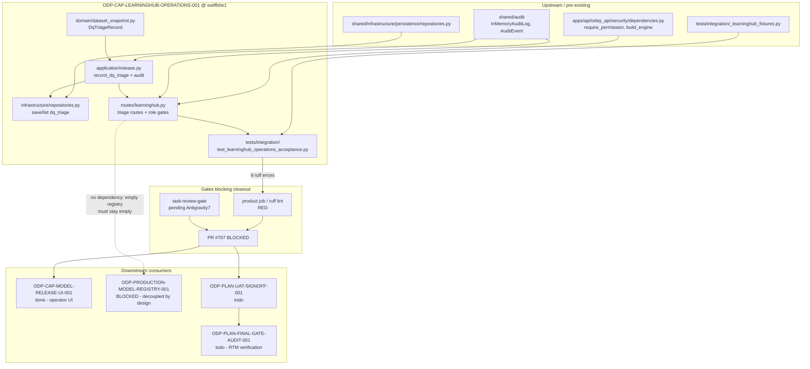

# LearningHub Operations Acceptance Packet & Dependency Map

- Sidecar task: `ODP-CAP-LEARNINGHUB-OPERATIONS-001-SIDECAR-ACCEPTANCE`
- Parent task: `ODP-CAP-LEARNINGHUB-OPERATIONS-001`
- Helper kind: `acceptance_packet`
- Owner: Claude2 · Reviewer: Antigravity
- Evidence snapshot: 2026-08-10T11:30Z
- Parent head evaluated: `ea9fb0e1cf1afa9ce45631b9899634943624ded4` (parent `review_gate_sha`)
- Prior approved head: `c9ea148fc52c8f3b5b51960983c4c4b41749abc0`
- Parent PR: [#707](https://github.com/alfloop-dev/odayplus/pull/707) — OPEN / BLOCKED / MERGEABLE
- Companion packet: `ODP-CAP-LEARNINGHUB-OPERATIONS-001-SIDECAR-REVIEW.md`
  (task `…-SIDECAR-REVIEW`, done 2026-08-08, snapshot at `c9ea148f`)

## Scope Boundary

This is a support artifact. It does not modify L1 canonical truth, contract
truth, or any runtime / registry / governance implementation, and it does not
touch the parent branch. Everything below is an observation about the parent
head; the parent owner decides what to absorb.

---

## 0. Headline (讀這一段就夠)

**平行支援結論：parent 在 `c9ea148f → ea9fb0e1` 之間只做了 rebase，
2026-08-08 review packet 標示的 merge blocker（9 個 ruff 錯誤）一個都沒修，
`product` job 在新 head 上再次 fail。**

The parent's `next` field records "Base advanced to dev tip (HEAD: ea9fb0e1),
rebased cleanly, PR #707 updated with auto-merge enabled, tests verified passing
(4/4 passed)". That statement is accurate about **pytest** and misleading about
**merge readiness**: the failing CI step is lint, not pytest, and lint was never
re-run.

Proof that no task-owned content changed across the rebase:

```text
git diff --stat c9ea148f ea9fb0e1 -- \
  tests/integration/test_learninghub_operations_acceptance.py \
  apps/api/app/routes/learninghub.py \
  modules/learninghub \
  shared/infrastructure/persistence/repositories.py \
  docs/evidence/completion/ODP-CAP-LEARNINGHUB-OPERATIONS-001
```

Result: **empty output** — all nine task-owned files are byte-identical at both
heads. The rebase moved the base, not the defect.

---

## 1. Acceptance Checklist (per criterion, at `ea9fb0e1`)

Rule: every row must cite an implementation anchor **and** a test anchor. A
criterion is not accepted because an anchor exists — it is accepted because a
test exercises the behaviour the criterion names.

Legend: ✅ met · ⚠️ met with a stated coverage boundary · ❌ not met.

### 1.1 `DQ actions persist actor, time, and rationale`

- [x] `DqTriageRecord` carries `actor`, `time`, `rationale`
      (`modules/learninghub/domain/dataset_snapshot.py`, exported via
      `modules/learninghub/domain/__init__.py`).
- [x] `LearningHubService.record_dq_triage`
      (`modules/learninghub/application/release.py:304`) builds the record,
      persists via `repository.save_dq_triage` (`:335`), and emits
      `learninghub.dq_triage_recorded.v1` (`:337-341`).
- [x] Persistence exists on both the in-memory repository
      (`modules/learninghub/infrastructure/repositories.py`) and the durable one
      (`shared/infrastructure/persistence/repositories.py`).
- [x] `test_dq_actions_persist_actor_time_and_rationale` asserts triage id
      prefix, snapshot binding, action, actor, rationale, non-null time, one
      persisted row, and one audit event.
- ⚠️ **Boundary:** the test asserts `len(dq_events) == 1` against the **service**
  audit log. Over HTTP the same request writes **two** identical-typed events —
  see finding **A-1**. Persistence is accepted; the audit-cardinality claim is
  only accepted at the service layer.

**Verdict: ⚠️ accepted at service layer; audit cardinality unproven at API layer.**

### 1.2 `Model operations are role gated`

- [x] `require_permission("model", Action.…)` is attached as a route dependency
      across LearningHub dataset, model, release, evidence and triage routes
      (`apps/api/app/routes/learninghub.py`, 12 sites: `:215`, `:245`, `:285`,
      `:291`, `:367`, `:455`, `:489`, `:502`, `:519`, `:565`, `:573`, `:586`).
- [x] The triage route additionally binds the record to the authenticated
      principal: `_trusted_actor(request)` and a `403 UNTRUSTED_TRIAGE_ACTOR`
      rejection when the body actor disagrees (`:250-258`). This is a real
      gate and is **not** covered by any test.
- [x] `test_learninghub_api_role_gating_and_triage_endpoints` asserts an
      unauthenticated `GET /learninghub/models` returns 401/403.
- ❌ The rest of that test is **structural**: it reads `routes_by_path[...]
      .dependencies` and asserts the list is non-empty. It never asserts *which*
      permission, and never drives an authorised principal.
- ❌ No authorised-role matrix: no test shows role R may `CREATE` but not
      `PUBLISH`, or that `Action.APPROVE` on the approval route rejects a
      viewer.
- ❌ `UNTRUSTED_TRIAGE_ACTOR` (a fail-closed identity gate introduced by this
      task) has zero test coverage.

**Verdict: ❌ not met as stated.** "Role gated" is currently proven as "a
dependency object is present and anonymous access is denied". See finding
**A-3**.

### 1.3 `Empty registry never fabricates a model`

- [x] `test_empty_registry_never_fabricates_a_model` asserts
      `len(all_versions) == 0`, `len(versions) == 0`, `card is None`,
      `version is None` against a fresh `InMemoryLearningHubRepository`.
- [x] `GET /models` serialises repository contents with no fallback
      construction.
- ⚠️ **Boundary:** the invariant is proven at repository level only. No
      authenticated HTTP request is made against an empty `/learninghub/models`,
      so the operator-visible response shape for an empty registry is unproven.
- ⚠️ The test constructs a `LearningHubService` it never uses — that unused
      binding is the `F841` lint error (see 1.5). Removing it is safe **and**
      removes the only line that hints the service layer was meant to be
      exercised here.

**Verdict: ⚠️ accepted at repository layer.** This is the criterion most safely
met; the HTTP boundary is a nice-to-have, not a blocker.

### 1.4 `Unsupported promotion fails closed`

`test_unsupported_promotion_fails_closed` has three sub-cases:

- ❌ **Sub-case 1 does not test fail-closed behaviour.** It asserts
      `pytest.raises(TypeError, match="missing .* required keyword-only
      arguments")`. A `TypeError` for a missing keyword-only argument is raised
      by CPython's argument binding **before any method body runs**. It proves
      the signature's arity, not that an unsupported promotion is refused. If a
      future change gives those parameters defaults, this assertion breaks while
      the actual guard may still be intact — or vice versa: the guard could be
      deleted and this sub-case would still pass.
- [x] **Sub-case 2** — self-review (`requested_by == approved_by`) raises
      `LearningHubError("self-review is prohibited")`. Genuine domain guard.
- [x] **Sub-case 3** — `ReleaseType.FULL` with `rollback_target=None` raises
      `LearningHubError` matching `"rollback target"`. Genuine domain guard.
- ⚠️ Both genuine guards are **pre-existing** `request_release` preconditions,
      not behaviour added by this task. The task contributes the test, not the
      guard.

**Verdict: ⚠️ 2 of 3 sub-cases are real.** See finding **A-4** — sub-case 1
should be replaced with an actual unsupported-promotion path (e.g. promoting a
version whose validation status is not passing, or an unsupported
`ReleaseType`), otherwise the criterion is one third theatre.

### 1.5 `Lifecycle and permission tests are delivered`

- [x] `tests/integration/test_learninghub_operations_acceptance.py` exists
      (172 lines, 4 tests) and reuses the pre-existing
      `tests/integration/_learninghub_fixtures.py`.
- [x] Parent `verification.md` records focused `4 passed in 21.64s` and full
      LearningHub `41 passed, 3 skipped in 186.80s`.
- [x] The `…-SIDECAR-REVIEW` packet independently reproduced the focused
      `4 passed` at `c9ea148f`; task-owned content is unchanged at `ea9fb0e1`,
      so that result carries forward.
- ❌ **The delivered test file does not pass repo lint.** 9 errors, all in this
      one new file. This is the merge blocker.

**Verdict: ❌ not met** — a test artifact that fails the repo's own lint gate is
not deliverable. See finding **A-2**.

---

## 2. Findings

### A-2 (blocker) — the 2026-08-08 lint blocker is unfixed at the current head

Reproduced by this sidecar at `ea9fb0e1`:

```text
python3 -m ruff check --stdin-filename \
  tests/integration/test_learninghub_operations_acceptance.py - \
  < <(git show ea9fb0e1:tests/integration/test_learninghub_operations_acceptance.py)
```

```text
:1:1   I001  Import block is un-sorted or un-formatted
:9:5   F401  `models.shared_ml.MetricThreshold` imported but unused
:10:5  F401  `models.shared_ml.ModelAlias` imported but unused
:11:5  F401  `models.shared_ml.ModelCardApproval` imported but unused
:12:5  F401  `models.shared_ml.ModelStage` imported but unused
:13:5  F401  `models.shared_ml.ModelVersion` imported but unused
:25:19 F401  `tests.integration._learninghub_fixtures.model_card` imported but unused
:26:22 F401  `tests.integration._learninghub_fixtures.model_version` imported but unused
:75:5  F841  Local variable `service` is assigned to but never used
Found 9 errors.  [*] 8 fixable with `--fix`.
```

Byte-for-byte the same nine errors the review packet reported at `c9ea148f`.
`8 fixable with --fix`; the `F841` needs a one-line human decision (drop the
binding, or use the service in the empty-registry assertion — see 1.3).

CI at `ea9fb0e1` agrees:

| Check | State at `ea9fb0e1` |
| --- | --- |
| `product` | **failure** (1m4s — fails fast, consistent with the lint step) |
| `orchestrator` | success |
| `performance-gate` | success |
| `product-e2e-gate` | in_progress at snapshot time |
| `task-review-gate` | pending — "Pending review by Antigravity7" |

PR #707: `state OPEN`, `mergeable MERGEABLE`, `mergeStateStatus BLOCKED`.
`MERGEABLE` here means *no merge conflict*; `BLOCKED` is the required-check
failure. Auto-merge being armed does not help while `product` is red.

> Note on ruff version: this sidecar used the locally available `ruff 0.15.20`
> via `python3 -m ruff`, whereas CI runs
> `uv run ruff check tests modules apps shared models solver pipelines infra`
> against the pinned `ruff>=0.6` from `pyproject.toml`. The findings are
> identical to the review packet's `uv run` output at `c9ea148f`, so the version
> difference does not change the result.

### A-1 (correctness, confirmed) — one triage API call writes two identical audit events

The review packet raised this as a question. At `ea9fb0e1` it is confirmed, and
it is confirmed to be *inconsistent with the file's own convention*.

Wiring in `apps/api/app/routes/learninghub.py`:

- `:178` `active_audit_log = audit_log or InMemoryAuditLog()`
- `:191` the same object is injected into the service: `audit_log=active_audit_log`
- `:260` the triage route calls `service.record_dq_triage(...)`, which records
  `learninghub.dq_triage_recorded.v1` at `release.py:337-341`
- `:272-279` the route then calls `_record_audit(active_audit_log, …,
  "learninghub.dq_triage_recorded.v1", …)` — same log object, same event type

So `POST /learninghub/dataset-snapshots/{id}/triage` appends **two**
`learninghub.dq_triage_recorded.v1` events to one audit log.

The convention check that makes this a defect rather than a style choice — the
other two `_record_audit` call sites in the same file are correct:

| Route | Service-layer audit? | Route-layer `_record_audit`? | Events per call |
| --- | --- | --- | --- |
| `POST /dataset-snapshots` (`:231`) | no (`register_dataset_snapshot` does not audit) | yes, `learninghub.dataset_registered.v1` | 1 ✅ |
| `POST /models/{name}/versions` (`:353`) | no (`register_model_version` does not audit) | yes, `learninghub.model_registered.v1` | 1 ✅ |
| `POST …/{id}/triage` (`:272`) | **yes** (`release.py:337`) | yes, **same** event type | **2** ❌ |

`record_dq_triage` is the only service method in this task's diff that audits;
the route was written to the "route audits" pattern without noticing.

Failure scenario: an operator records one DQ override; the audit trail shows two
`learninghub.dq_triage_recorded.v1` entries with the same actor and rationale but
different `event_id`s. Any downstream count-based audit assertion, DQ-action
report, or reconciliation over `learninghub.dq_triage_recorded.v1` double-counts.
The acceptance test's own `assert len(dq_events) == 1` would fail if rewritten to
go through `TestClient` — which is exactly the API-level test 1.2 and 1.3 are
missing.

Two clean fixes, owner's call:

1. Drop the route-level `_record_audit` for triage and surface
   `record.audit_event_id` from the service (keeps the service as the audit
   authority, matches where the event semantically belongs); or
2. Remove the audit emission from `LearningHubService.record_dq_triage` and keep
   the route-level record (matches the other two routes in this file).

Option 1 is preferable — the service already owns audit for every other
LearningHub lifecycle event (`model_release.v1`, `release_monitor.v1`,
`alias_reconciliation.v1`, …), and option 2 would leave non-HTTP callers of
`record_dq_triage` with no audit trail at all.

### A-3 (coverage) — "role gated" is proven structurally, not behaviourally

See 1.2. Concretely missing:

- an authorised-principal request per action class (`CREATE` / `VIEW` /
  `UPDATE` / `APPROVE` / `PUBLISH`), asserting allow;
- the same with an under-privileged principal, asserting deny;
- the `UNTRUSTED_TRIAGE_ACTOR` 403 path (`:250-258`).

Asserting `route.dependencies` is non-empty passes even if the dependency is the
wrong `Action`, or if `require_permission` is later stubbed to a no-op. This is
the reviewer's decision to make: either accept structural coverage explicitly and
record the boundary, or require the matrix before parent closeout. Given that
"model operations are role gated" is a stated acceptance criterion and the task
title is *Make … operable*, this packet's recommendation is **require at least
the deny-side matrix**.

### A-4 (test quality) — one third of the fail-closed test tests CPython, not the domain

See 1.4 sub-case 1. Recommended replacement: drive `request_release` with a
`ReleaseType` / model state that the domain is supposed to refuse (e.g. a
candidate whose validation status is not passing) and assert `LearningHubError`,
so the sub-case tracks the guard instead of the signature.

### A-5 (boundary, low) — empty-registry invariant is not proven at the HTTP edge

See 1.3. Cheap to close if 1.2's API test is extended anyway: one authenticated
`GET /learninghub/models` against a fresh repository asserting `200` and `[]`.

---

## 3. Dependency Map



### 3.1 Dependency table

| Direction | Item | State (2026-08-10) | Relationship to the parent |
| --- | --- | --- | --- |
| Upstream | `apps/api/oday_api/security/dependencies.py` | on `dev` | Supplies `require_permission` / `build_engine`. Parent adds no new authz primitives — it only wires existing ones, which is why 1.2 is only structurally proven. |
| Upstream | `shared/audit` | on `dev` | `InMemoryAuditLog` is shared between service and routes (`:178`/`:191`) — this sharing is what makes A-1 a real double-write rather than two separate logs. |
| Upstream | `tests/integration/_learninghub_fixtures.py` | on `dev` | Pre-existing; the new test imports 4 names and uses 2. The 2 unused ones are 2 of the 9 lint errors. |
| Upstream | `shared/infrastructure/persistence/repositories.py` | modified by parent (+18) | Durable DQ triage persistence. |
| Blocking gate | `product` CI job | **failure at `ea9fb0e1`** | Lint step. Sole hard merge blocker. |
| Blocking gate | `task-review-gate` | pending (Antigravity7) | Cannot go green until the reviewer approves the head, and the head must change to fix lint. |
| Sibling | `…-SIDECAR-REVIEW` | done 2026-08-08, PR #723 merged | Review packet at `c9ea148f`. Its blocker was not actioned. |
| Downstream | `ODP-CAP-MODEL-RELEASE-UI-001` | done, PR #647 merged | Operator UI already on `dev`; it consumes LearningHub routes. Route-shape changes here land under an already-shipped UI. |
| Downstream | `ODP-PRODUCTION-MODEL-REGISTRY-001` | **blocked** (owner Antigravity) | Intentionally decoupled — parent summary states 不要求 production model 存在, and criterion 1.3 makes the empty registry a *supported* state. This task must not be held for the registry, and must not be used to unblock it. |
| Downstream | `ODP-PLAN-UAT-SIGNOFF-001` | todo | Six-role UAT needs operable DQ triage; blocked on #707 merging. |
| Downstream | `ODP-PLAN-FINAL-GATE-AUDIT-001` | todo | RTM re-run decides whether the LearningHub FRs may be marked verified. **`done` on the parent ≠ FR verified** — the coverage boundaries in 1.2 / 1.4 are exactly what the RTM must re-adjudicate. |

### 3.2 Critical path to parent closeout

```text
fix 9 ruff errors (A-2)  ──┐
decide A-1 (dup audit)   ──┤
decide A-3 / A-4 scope   ──┴─> new parent head
                              -> re_review (approved head changes)
                              -> product + task-review-gate green
                              -> PR #707 merges into dev
                              -> parent `done`
                              -> UAT signoff -> RTM audit
```

The parent is **not** blocked on any other task. Every blocker is inside its own
diff. The only external wait is reviewer availability.

---

## 4. Handoff to the parent owner (Antigravity) / reviewer (Antigravity7)

Minimum to unblock (≈ 10 minutes of work):

```bash
# on task/ODP-CAP-LEARNINGHUB-OPERATIONS-001
uv run ruff check --fix tests/integration/test_learninghub_operations_acceptance.py
# then hand-resolve the F841 at :75 (see §1.3 — deleting the binding is safe)
uv run ruff check tests modules apps shared models solver pipelines infra
python3 -m pytest tests/integration/test_learninghub_operations_acceptance.py -q
```

Then, in order:

1. Decide **A-1**. Recommendation: option 1 (service owns the audit event, drop
   the route-level duplicate). One-line route change plus surfacing
   `record.audit_event_id`.
2. Decide **A-3** and **A-4** — either extend the test, or record an explicit
   accepted-boundary note in `verification.md`. Silently accepting is the
   outcome this packet exists to prevent.
3. `A-5` is optional and rides along with any API-level test added for A-3.
4. Because every one of these changes the head beyond `ea9fb0e1`, use the formal
   **`re_review`** flow. Do not treat the existing `last_approved_head`
   (`c9ea148f`) as carrying forward.
5. Update `docs/evidence/completion/ODP-CAP-LEARNINGHUB-OPERATIONS-001/verification.md`
   to record the **lint** command and result alongside the pytest result. The
   current evidence file records only pytest, which is how a red `product` job
   coexisted with a "verified" claim for two days.
6. Merge #707, then run `done`.

**Process note for the parent's `next` field:** "tests verified passing (4/4
passed)" was true and still left the PR un-mergeable. When a required check is
red, the `next` note should name the red check. A base advance is not a fix.

---

## 5. Verification Log

- Mode: static inspection + CI/API state query. No parent code was executed or
  modified; no parent branch was checked out.
- Location: `/tmp/pantheon-worker-worktrees/oday-plus-supervisor-live/odp-cap-learninghub-operations-001-sidecar-acceptance`
- Basis: parent head `ea9fb0e1` (read via `git show`), `origin/dev` at
  `d37e6e5c`, live status root `$PANTHEON_STATUS_ROOT`.

### 5.1 Commands actually run

```bash
# parent state
AI_NAME=Claude2 "$PANTHEON_STATUS_ROOT/scripts/ai-status.sh" show ODP-CAP-LEARNINGHUB-OPERATIONS-001
#   -> status review, review_gate_sha ea9fb0e1, last_approved_head c9ea148f

gh pr view 707 --json state,mergeStateStatus,headRefOid,mergeable
#   -> OPEN / BLOCKED / ea9fb0e1… / MERGEABLE
gh api repos/alfloop-dev/odayplus/commits/ea9fb0e1…/check-runs
#   -> product failure; orchestrator success; performance-gate success; product-e2e-gate in_progress
gh api repos/alfloop-dev/odayplus/commits/ea9fb0e1…/status
#   -> task-review-gate pending "Pending review by Antigravity7"

# headline: rebase-only, no content change
git diff --stat c9ea148f ea9fb0e1 -- tests/integration/test_learninghub_operations_acceptance.py \
  apps/api/app/routes/learninghub.py modules/learninghub \
  shared/infrastructure/persistence/repositories.py \
  docs/evidence/completion/ODP-CAP-LEARNINGHUB-OPERATIONS-001
#   -> (empty)
git diff --stat $(git merge-base origin/dev ea9fb0e1)..ea9fb0e1
#   -> 9 files changed, 401 insertions(+)   [identical shape to the c9ea148f snapshot]

# A-2: lint still red
git show ea9fb0e1:tests/integration/test_learninghub_operations_acceptance.py > /tmp/lh_accept_ea9f.py
python3 -m ruff check --output-format=concise \
  --stdin-filename tests/integration/test_learninghub_operations_acceptance.py - < /tmp/lh_accept_ea9f.py
#   -> 9 errors (I001, 7x F401, F841) — see §2 A-2

# A-1: shared audit log + double emission
git show ea9fb0e1:apps/api/app/routes/learninghub.py | grep -n 'active_audit_log\|audit_log'
#   -> 178 active_audit_log = audit_log or InMemoryAuditLog()
#      191 audit_log=active_audit_log        (into LearningHubService)
#      232 / 273 / 354 _record_audit(active_audit_log, …)
git show ea9fb0e1:modules/learninghub/application/release.py | grep -n 'audit_log.record\|event_type='
#   -> 337-341 learninghub.dq_triage_recorded.v1  (service side)
#      register_dataset_snapshot / register_model_version emit nothing -> routes 232/354 are correct

# A-4: sub-case 1 asserts a CPython TypeError
git show ea9fb0e1:tests/integration/test_learninghub_operations_acceptance.py | sed -n '97,156p'
#   -> pytest.raises(TypeError, match="missing .* required keyword-only arguments")

# dependency map states
#   ODP-PRODUCTION-MODEL-REGISTRY-001 blocked; ODP-PLAN-UAT-SIGNOFF-001 todo;
#   ODP-PLAN-FINAL-GATE-AUDIT-001 todo; …-SIDECAR-REVIEW done (archive snapshot)
```

### 5.2 Scope compliance

- Files changed by this sidecar: exactly one, under
  `support/sidecars/ODP-CAP-LEARNINGHUB-OPERATIONS-001/`.
- Zero changes to L1 canonical truth, contract truth, or runtime / registry /
  governance implementation. Zero changes to the parent branch or PR #707.
- Verify with: `git diff --stat origin/dev...HEAD`.

### 5.3 Freshness caveat

CI state was read at 2026-08-10T11:30Z while workflow run `31382797314` was
still in progress (`product-e2e-gate` had not reported). `product` had already
concluded `failure`, which is the finding that matters; `product-e2e-gate` passed
at the previous head. Re-read check state before acting if more than a few hours
have elapsed.
