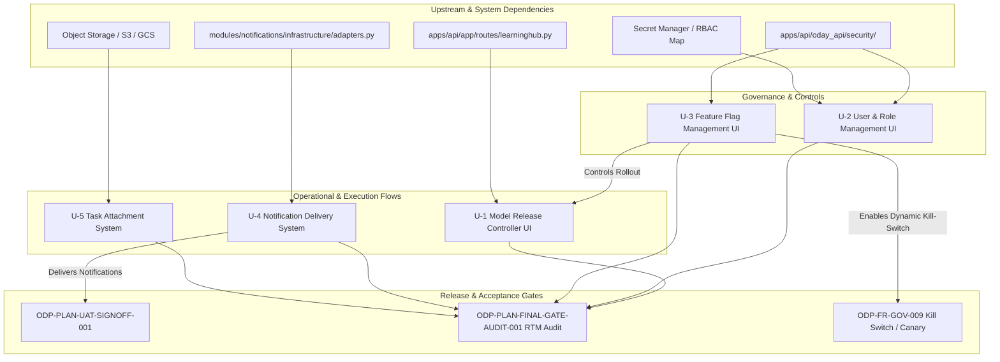

# Sidecar Acceptance Packet & Dependency Map

- **Task ID**: `ODP-CAP-UNOWNED-SCOPE-DECISION-001-SIDECAR-ACCEPTANCE`
- **Parent Task**: `ODP-CAP-UNOWNED-SCOPE-DECISION-001`
- **Helper Kind**: `acceptance_packet`
- **Owner**: Antigravity4
- **Reviewer**: Claude
- **Status**: Support Artifact / Ready for Review
- **Reference Doc**: `docs/design/ODAY_PLUS_UNOWNED_CAPABILITY_SCOPE_DECISION_2026-08-03.md`

---

## 1. Executive Summary & Context

在 `ODP-UNOWNED-CAPABILITY-SCOPE-DECISION-2026-08-03` 的轉型評估中，盤點出 5 項在 `ODP-SA-06` / `ODP-UX-03` 中標註為 **MUST**、但目前尚未有特定模組 Owner 或完整前端/系統實作的能力（U-1 ~ U-5）。

Parent Task `ODP-CAP-UNOWNED-SCOPE-DECISION-001` 之決策方向為 **全部選擇選項 A（排入下一個 release）**。為避免後續實作陷入「僅拉出 UI 框架 / 有畫面即宣告結案」的假性完成陷阱，本 Sidecar Acceptance Packet 提供：

1. **依據全域條文寫明的條列化 Acceptance Checklist**（細化至 API、狀態轉化、Audit Trail、異常處理與 UI/UX 等檢驗點）。
2. **5 項能力的完整 Dependency Map**（包含上游模組、後端 API/Schema 現狀、影響範圍與門檻關係）。
3. **主線 Parent Task 吸收與分派建議 Packet**（供 Task Owner Claude 直接引用或納入下一步 Task Breakdown）。

---

## 2. Dependency Map (U-1 ~ U-5)

### 2.1 依能力分項之依賴矩陣 (Dependency Matrix)

| 能力代號 | 能力名稱 | 上游依賴 (Upstream Dependencies) | 下游/受影響模組 (Downstream / Impact) | 關聯 Gate / Requirement |
|---|---|---|---|---|
| **U-1** | Model Release Controller UI | `apps/api/app/routes/learninghub.py` (10 REST endpoints), `LearningHubService` | `apps/web/features/operator/`, Model Audit Log, Canary Telemetry | `UX-SCR-LEARN-003`, `ODP-FR-LH-003`, `ODP-FR-GOV-009` |
| **U-2** | User & Role Management UI | Secret Manager (`ODP_AUTH_PRINCIPAL_MAP`), Auth API (`apps/api/oday_api/security/`) | Tenant/Brand/Region/Store RBAC System, Operator Shell Workspace | `UX-SCR-ADMIN-001`, `ODP-FR-OPS-003` |
| **U-3** | Feature Flag Management UI | `apps/api/oday_api/security/` Feature Flag Evaluator, App Config / Redis | PriceOps, AdLift, NetPlan, Model Canary, Runtime Router | `UX-SCR-ADMIN-002`, `ODP-FR-SHARED-004`, `ODP-FR-GOV-009` (P1 Priority) |
| **U-4** | 通知實際投遞 (Email/站內) | `modules/notifications/infrastructure/adapters.py`, SMTP/SendGrid/SES Provider | Task Assignment, SLA Timeout Alerts, Escalation Engine, Operator Inbox | `ODP-FR-SHARED-006`, `ODP-PLAN-UAT-SIGNOFF-001` (P1 Priority) |
| **U-5** | 任務附件系統 | Cloud Object Storage (GCS/S3 Bucket), Attachment Metadata DB Table | Operator Task Detail Modal, Field Survey Photos, Lease Scans, Repair Evidence | `ODP-FR-OPS-002` |

---

## 3. Rigorous Acceptance Checklists (條列化驗收要點)

為避免以「畫面截圖」或「單純 UI 元素存在」作為結案依據，各能力驗收要點劃分為 **後端/API驗收**、**前端/互動驗收**、**安全與稽核驗收** 以及 **極端與異常處理**。

### 3.1 U-1: Model Release Controller UI

- [ ] **API 完整整合**
  - [ ] 前端能正確呼叫 `POST /releases` 建立發布計畫。
  - [ ] 支援 `POST /releases/{id}/monitor` 即時讀取 Canary / Shadow 監控指標。
  - [ ] 支援 `GET /models/{name}/evidence` 呈現 Backtest / Champion-Challenger 驗證報告。
- [ ] **模型生命週期狀態機驗收**
  - [ ] 提供「Backtest -> Shadow -> Canary -> Promote -> Rollback」完整的狀態轉化操作。
  - [ ] 在 Canary 階段能動態調整流量配比（例如 5% -> 20% -> 50% -> 100%）。
  - [ ] 一鍵 Rollback 按鈕能在 5 秒內完成前一版本復原，並切斷 Canary 流量。
- [ ] **安全與稽核軌跡 (Audit Log)**
  - [ ] 每次 Promote / Rollback 操作皆記錄發起人 User ID、時間戳記、變更前後 Model SHA256 與理由。
  - [ ] 高風險操作（如將未完成 Backtest 的模型強制 Promote）必須跳出二次確認聲明並紀錄阻擋/稽核點。

### 3.2 U-2: User and Role Management UI

- [ ] **多層級 RBAC/ABAC CRUD**
  - [ ] 管理者能在 UI 新增、修改、停用使用者帳號與角色配置。
  - [ ] 正確支援 Tenant / Brand / Region / Store 五層架構的資料範圍限定設定。
- [ ] **憑證與秘鑰同步**
  - [ ] UI 的權限變更不需重新部署容器，且變更後能在 30 秒內於 API 網關快取中生效。
  - [ ] 提供 Secret Manager 匯入/匯出與狀態同步機制。
- [ ] **自我審查與權限安全驗收**
  - [ ] 禁止管理者移除自身之「Role Admin」權限（防鎖死保護）。
  - [ ] 異動任何角色的權限矩陣時，須提供 Diff 預覽對照。

### 3.3 U-3: Feature Flag Management UI (P1)

- [ ] **動態 Feature Flag 控制盤**
  - [ ] 條列目前系統中所有 Feature Flag，顯示名稱、預設值、評估規則與生效範圍。
  - [ ] 提供全局 Kill-Switch 開關，能在 3 秒內切斷特定高風險功能（如新版定價演算法、新模型推理入口）。
- [ ] **多維度 Rollout 策略設定**
  - [ ] 支援依據 Tenant ID、Store ID、Region 或特定 User 比例（Percentage Rollout）進行分階段啟用。
  - [ ] 能即時在 UI 檢視目前受 Feature Flag 影響的實體數量統計。
- [ ] **無縫轉銜與零重補 (Zero-Redeploy)**
  - [ ] 切換 Flag 狀態時，UI/API/Job 行為即時改變，不得要求重新啟動服務或部署。
  - [ ] 包含完整稽核紀錄（記錄切換者、異動前後規則、生效原因）。

### 3.4 U-4: 通知實際投遞 (Email/站內) (P1)

- [ ] **多通道投遞 Adapter 實作**
  - [ ] 補齊 SMTP / SendGrid / Amazon SES 等正式 Email 投遞 Adapter，替換全 Console/Mock 現狀。
  - [ ] 支援站內通知（In-App Notification Banner / Drawer）之即時推送與未讀狀態管理。
- [ ] **任務事件觸發鏈驗收**
  - [ ] 任務指派（Task Assigned）、逾時警告（SLA Timeout）、核准請求（Approval Required）與失敗回滾（Failure Rollback）四類事件能觸發發送。
  - [ ] 正確依照 Actor 設定之預設通道（`channels = ["email", "in_app"]`）發送。
- [ ] **UAT 6 角色連帶簽核驗收**
  - [ ] 在 UAT 測試中，真實使用者（包含 Store Manager, Regional Ops, Pricing Specialist 等 6 種角色）可在其真實 Mailbox 收到信件並點擊連結直達作業頁面。
  - [ ] 處理投遞失敗 retry 邏輯與死信佇列 (Dead Letter Queue)。

### 3.5 U-5: 任務附件系統

- [ ] **雲端儲存整合與 API**
  - [ ] 提供安全的上傳/下載預簽名 URL (Presigned URL) 產生器，檔案上傳至指定 Object Storage Bucket。
  - [ ] 支援圖片、PDF、試算表等常見格式（最大限制 25MB），並在前端提供上傳進度條與縮圖預覽。
- [ ] **任務細節頁面 (Task Detail Modal) 綁定**
  - [ ] 附件能正確掛載於 Task、Comment 或 Approval Node 節點下。
  - [ ] 刪除附件支援 Soft-delete 與權限控管（僅上傳者或 Admin 可刪除）。
- [ ] **現場證據與稽核備份**
  - [ ] 現勘照片、租約掃描檔上傳後，發送端自動寫入 Metadata（檔案大小、Hash、上傳者、地理位置資訊（若有））。

---

## 4. Handoff Packet for Mainline Task (`ODP-CAP-UNOWNED-SCOPE-DECISION-001`)

致 Parent Task Owner (`Claude`):

1. **決策吸收**：
   - 請將本文件之 Acceptance Checklist 納入 `ODP-CAP-UNOWNED-SCOPE-DECISION-001` 的結案說明與後續 Release Planning。
2. **建議分拆的後續 Release Task ID**:
   - `ODP-CAP-U1-MODEL-RELEASE-CTRL`: 實作 Model Release Controller UI (`UX-SCR-LEARN-003`)
   - `ODP-CAP-U2-USER-ROLE-MGMT`: 實作 User & Role Management UI (`UX-SCR-ADMIN-001`)
   - `ODP-CAP-U3-FEATURE-FLAG-MGMT`: 實作 Feature Flag Management UI (`UX-SCR-ADMIN-002`) - **優先執行 (P1)**
   - `ODP-CAP-U4-NOTIFICATION-DELIVERY`: 實作 Email/站內通知實際投遞 (`ODP-FR-SHARED-006`) - **優先執行 (P1)**
   - `ODP-CAP-U5-TASK-ATTACHMENTS`: 實作 任務附件系統與 Cloud Storage (`ODP-FR-OPS-002`)
3. **對 L1/L2 文件的相依性處理**:
   - 不修改目前 L1 規範真相。主線完成時，請在 RTM (`ODP-PLAN-FINAL-GATE-AUDIT-001`) 中將 U-1~U-5 狀態更新為「已納入 Next Release 排期並有明確 Acceptance Criteria」。

---

## 5. Verification Log & Status

- **Verification Mode**: Structural & Documentation Inspection (No runtime execution required for sidecar support packet).
- **Scope Compliance Check**:
  - `support/sidecars/ODP-CAP-UNOWNED-SCOPE-DECISION-001/ODP-CAP-UNOWNED-SCOPE-DECISION-001-SIDECAR-ACCEPTANCE.md` (Created as support artifact).
  - 零修改 L1 規範文件、零修改核心代碼或真相廣播檔。
