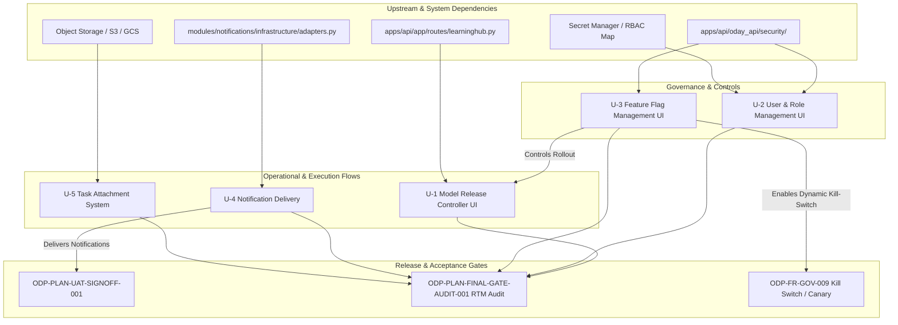

# Sidecar Acceptance Packet & Dependency Map

- **Task ID**: `ODP-CAP-UNOWNED-SCOPE-DECISION-001-SIDECAR-ACCEPTANCE`
- **Parent Task**: `ODP-CAP-UNOWNED-SCOPE-DECISION-001`
- **Helper Kind**: `acceptance_packet`
- **Owner**: Claude · **Reviewer**: Antigravity4
- **Round**: 2（round 1 由 Claude 以 reviewer 身分 REOPEN，findings 見同目錄
  `review_findings_claude_round1.md`；本輪 owner 角色經 helper claim 換手）
- **Status**: Support Artifact / Ready for Review

## 基準（Baseline）

本 packet 的所有主張以下列兩個基準比對，兩者**不同**，讀者必須先分清楚：

| 基準 | 位置 | 內容 |
|---|---|---|
| **決策真相** | 分支 `task/ODP-CAP-UNOWNED-SCOPE-DECISION-001` commit `dda55b91`（PR **#646**，OPEN / BLOCKED，**尚未併入 `dev`**） | §6 決策記錄（五項全 A + 已裁決 task id）、§6.1 落實確認、§7 五項驗收要點 |
| **程式碼現況** | 本 worktree HEAD，`docs/design/…` 與 `origin/dev` 同版 | `modules/`、`apps/` 的實際實作狀態 |

> **警告**：`dev` 上的 `docs/design/ODAY_PLUS_UNOWNED_CAPABILITY_SCOPE_DECISION_2026-08-03.md`
> §6 五列仍全為 `_pending_`，§4 對 U-2 標「A 或 C」、U-5 標「A 或 B」。
> 只讀 `dev` 會對不上本 packet。決策已定案於 `dda55b91`，在 PR #646 併入前，
> 引用時**必須連 commit sha 一起引用**。

---

## 1. Executive Summary & Context

`ODP-UNOWNED-CAPABILITY-SCOPE-DECISION-2026-08-03` 盤點出 5 項在 `ODP-SA-06` /
`ODP-UX-03` 中屬 **MUST**、但當時既未實作也未正式排除的能力（U-1 ~ U-5）。

Human/Ops 於 2026-08-04 對五項**全部裁決為選項 A（排入下一個 release）**
（依據：`dda55b91` §6）。無一項走 deviation 或範圍變更，因此 `ODP-SA-06` 與
`ODP-UX-03` 的原始 MUST 範圍維持不變，**五項都必須實作到規格深度**。

本 packet 的唯一用途，是避免後續實作陷入「拉出 UI 框架 / 有畫面即宣告結案」的
假性完成陷阱。因此它提供：

1. **回扣 `dda55b91` §7 原文的條列化 Acceptance Checklist**——每條驗收要點都必須
   能對應到 §7 或原始 FR 條文，不得比 §7 寬鬆。
2. **5 項能力的 Dependency Map**，含上游模組、後端現狀與 Gate 關聯。
3. **掛載建議**：本 packet 的 checklist 掛到 §6 **已裁決的既有 task id** 底下，
   不新增任何 task 命名。

### 1.1 本輪修正摘要（round 1 findings 對應）

| Finding | 修正位置 |
|---|---|
| F-1 §4.2 五個新 task id 與 §6 已裁決 id 相撞 | §4.2 全數改為對映既有 id，不再提出新命名 |
| F-2 U-4 現況已過期（宣稱全 Console/Mock） | §2.1、§3.4 改為「驗收既有 adapter」 |
| F-3 FR-SHARED-006 五種觸發被壓成四種 | §3.4 拆回五條獨立驗收 |
| F-4 `channels` 預設值寫成 `["email","in_app"]` | §3.4 更正為 `["email"]`，並註明不改資料模型 |
| F-5 U-5 缺 FR-SHARED-007 遮罩、卻新增地理位置蒐集 | §3.5 補遮罩驗收，並讓地理位置受其約束 |
| F-6 U-2 缺 ODP-00-04 ADR 護欄、維度寫錯 | §2.1、§3.2 改為六維度並補防縮水閘門 |

---

## 2. Dependency Map (U-1 ~ U-5)



### 2.1 依能力分項之依賴矩陣 (Dependency Matrix)

| 能力代號 | 能力名稱 | 上游依賴 (Upstream) | 下游/受影響模組 (Downstream / Impact) | 關聯 Gate / Requirement |
|---|---|---|---|---|
| **U-1** | Model Release Controller UI | `apps/api/app/routes/learninghub.py`（10 個 route decorator，已具備）、`LearningHubService` | `apps/web/features/operator/governance/`、Model Audit Log、Canary Telemetry | `UX-SCR-LEARN-003`、`ODP-FR-LH-003`、`ODP-FR-GOV-009` |
| **U-2** | User & Role Management UI | Secret Manager (`ODP_AUTH_PRINCIPAL_MAP`)、Auth API (`apps/api/oday_api/security/`) | **Tenant / Brand / Region / Store / Role / Attribute 六維度**資料範圍控制、Operator Shell Workspace | `UX-SCR-ADMIN-001`、`ODP-FR-OPS-003`、**`ODP-00-04`（範圍變更須補 ADR）** |
| **U-3** | Feature Flag Management UI | `apps/api/oday_api/security/` feature flag 判定、App Config / Redis | PriceOps、AdLift、NetPlan、模型發布、決策政策變更 | `UX-SCR-ADMIN-002`、`ODP-FR-SHARED-004`、`ODP-FR-GOV-009`（**P1**） |
| **U-4** | 通知實際投遞（Email / 站內） | `modules/notifications/infrastructure/adapters.py`——**Email / In-App / MultiChannel adapter 已存在**，本項為**驗收既有實作**而非新建 | Task Assignment、SLA Timeout Alerts、Escalation Engine、Operator Inbox | `ODP-FR-SHARED-006`、`ODP-PLAN-UAT-SIGNOFF-001`（**P1**） |
| **U-5** | 任務附件系統 | Cloud Object Storage (GCS/S3)、Attachment Metadata 資料表 | Operator Task Detail、現勘照片、租約掃描、維修證據 | `ODP-FR-OPS-002`、**`ODP-FR-SHARED-007`（敏感度遮罩）** |

### 2.2 交付現況快照（2026-08-07，本 worktree + live status root）

**這張表是驗收的起點，不是結論。** §6.1 已明確：封存為 done 只代表 task 走完流程，
**不等於對應 FR 可標記 verified**——那要由 `ODP-PLAN-FINAL-GATE-AUDIT-001` 重跑
84-row RTM 時逐條認定。

| 能力 | 已裁決 Task ID | Task 狀態 | PR | 程式碼是否已在 `dev` | 本 packet checklist 用途 |
|---|---|---|---|---|---|
| U-1 | `ODP-CAP-MODEL-RELEASE-UI-001` | done（2026-08-05 封存） | #647 merged | **是**（`apps/web/features/operator/governance/ModelReleaseController.tsx`） | 事後回驗 §3.1，供 RTM 認定 |
| U-2 | `ODP-CAP-USER-ROLE-UI-001` | review | 尚無 PR（anchor `35ec57e3`） | 否 | 現行 review 的驗收依據 |
| U-3 | `ODP-CAP-FEATURE-FLAG-UI-001` | review_approved（`approved_head 114ffaab`） | #668 OPEN / BLOCKED（CI 未過） | 否 | closeout 前的回驗清單 |
| U-4 | `ODP-CAP-NOTIFICATION-DELIVERY-001` | done（2026-08-07 封存） | #670 merged | **是**（adapters + `application/service.py` 五個 trigger） | 事後回驗 §3.4，供 RTM 認定 |
| U-5 | `ODP-CAP-TASK-ATTACHMENTS-001` | review_approved（`approved_head d2af7238`） | #669 OPEN / BLOCKED（CI 未過） | 否（`attachment` 於 `modules/`、`apps/api/` 零命中） | closeout 前的回驗清單 |

---

## 3. Rigorous Acceptance Checklists（條列化驗收要點）

原則：**每條驗收都要能回指 `dda55b91` §7 或原始 FR 條文**。不得以「有畫面」、
「有截圖」或「UI 元素存在」結案。標註 `[§7]` 者為 §7 明列的要求，刪減即為縮水。

### 3.1 U-1 `ODP-CAP-MODEL-RELEASE-UI-001`（Model Release Controller UI）

- [ ] **API 完整整合**（後端 10 個 endpoint 已具備，本項為補操作面 `[§7]`）
  - [ ] 前端能正確呼叫 `POST /releases` 建立發布計畫。
  - [ ] 支援 `POST /releases/{release_id}/monitor` 讀取 Canary / Shadow 監控指標。
  - [ ] 支援 `GET /models/{model_name}/evidence` 呈現 Backtest / Champion-Challenger 報告。
- [ ] **生命週期狀態機**：`FR-LH-003` 要求 Backtest、Champion/Challenger、Shadow、
      Canary、Rollback **五者皆可操作** `[§7]`
  - [ ] 五個階段各自可從 UI 操作，不得只做其中一部分。
  - [ ] Canary 階段能動態調整流量配比（例：5% → 20% → 50% → 100%）。
  - [ ] Rollback 能切斷 Canary 流量並復原前一版本。
- [ ] **稽核軌跡**：依 `FR-GOV-009`，**每個動作**都要留下核准與稽核軌跡 `[§7]`
  - [ ] 每次 Promote / Rollback 記錄發起人 User ID、時間戳、變更前後 Model SHA256、理由。
  - [ ] 高風險操作（如強制 Promote 未完成 Backtest 的模型）須二次確認並記錄阻擋/稽核點。

### 3.2 U-2 `ODP-CAP-USER-ROLE-UI-001`（User and Role Management UI）

- [ ] **六維度 RBAC/ABAC CRUD**
  - [ ] 管理者能在 UI 新增、修改、停用使用者帳號與角色配置。
  - [ ] 正確支援 `FR-OPS-003` 原文的**六個維度**：
        **Tenant / Brand / Region / Store / Role / Attribute** `[§7]`。
        ⚠️ 只做 Tenant/Brand/Region/Store 四維度即為未達規格；`Role` 與 `Attribute` 不可省略。
- [ ] **憑證與秘鑰同步**（現況：異動需改 `ODP_AUTH_PRINCIPAL_MAP` secret 並重新部署 `[§7]`）
  - [ ] UI 的權限變更不需重新部署容器，且變更後能在 30 秒內於 API 網關快取生效。
  - [ ] 提供 Secret Manager 匯入/匯出與狀態同步機制。
- [ ] **異動稽核軌跡**：§7 明文「驗收需包含異動的 audit trail」`[§7]`
  - [ ] 任何角色/權限異動皆記錄異動者、時間、前後值。
  - [ ] 異動任何角色的權限矩陣時提供 Diff 預覽對照。
- [ ] **自我鎖死保護**
  - [ ] 禁止管理者移除自身之「Role Admin」權限。
- [ ] 🚧 **範圍護欄（防縮水閘門，`ODP-00-04`）** `[§7]`
  - [ ] 若實作中判定此能力應由**外部 IdP** 承擔而非平台自建，屬**範圍變更**，
        須依 `ODP-00-04` 補 ADR 後才可調整本 task 範圍。
  - [ ] **不得直接縮小交付**：沒有已核准 ADR 之前，以「改由 IdP 負責」為由減少上述任一條，
        一律視為未通過驗收。

### 3.3 U-3 `ODP-CAP-FEATURE-FLAG-UI-001`（Feature Flag Management UI，P1）

- [ ] **三個執行面都受同一 flag 控制**——`FR-SHARED-004` 原文為
      「未啟用 Feature Flag 時 **UI、API、Job 均不得執行**該功能」`[§7]`
  - [ ] **UI** 面：flag 關閉時入口不可執行。
  - [ ] **API** 面：flag 關閉時直呼 API 亦被拒絕（不可只靠前端隱藏）。
  - [ ] **Job** 面：flag 關閉時排程/背景工作不執行該功能。
  - [ ] ⚠️ 驗收「不只是管理介面」`[§7]`：只交付管理台而未證明三面受控，即為未達規格。
- [ ] **動態控制盤**
  - [ ] 條列所有 Feature Flag，顯示名稱、預設值、評估規則與生效範圍。
  - [ ] 全局 Kill-Switch 能切斷特定高風險功能（新版定價演算法、新模型推理入口等）。
  - [ ] 涵蓋 `FR-GOV-009` 指定的五個對象：PriceOps、AdLift、NetPlan、模型發布、
        決策政策變更 `[§7]`。
- [ ] **多維度 Rollout 策略**
  - [ ] 支援依 Tenant ID、Store ID、Region 或 User 比例（Percentage Rollout）分階段啟用。
  - [ ] 即時檢視目前受 Feature Flag 影響的實體數量統計。
- [ ] **零重新部署（Zero-Redeploy）**：§7 明文「必須能在**營運時段**切換而不需重新部署」`[§7]`
  - [ ] 切換 Flag 時 UI/API/Job 行為即時改變，不得要求重啟服務或部署。
  - [ ] 完整稽核紀錄（切換者、異動前後規則、生效原因）。

### 3.4 U-4 `ODP-CAP-NOTIFICATION-DELIVERY-001`（通知實際投遞，P1）

> **現況更正**：`modules/notifications/infrastructure/adapters.py` 目前**已具備**
> `EmailNotificationAdapter`（SMTP，含 production fail-closed，line 395）、
> `InAppNotificationAdapter`（line 557）、`MultiChannelNotificationAdapter`（line 646），
> 加上原有的 `ConsoleNotificationAdapter`(44) / `OnCallNotificationAdapter`(84)。
> 「全 Console/Mock」是 2026-08-03 決策文件當時的現況，**已不成立**。
> 因此本節是**驗收既有實作是否滿足 `FR-SHARED-006`**，不是要求重新建置。

- [ ] **三通道覆蓋**：`FR-SHARED-006` 要求站內、Email、Webhook `[§7]`
  - [ ] Webhook（`OnCallNotificationAdapter`）：既有，確認仍在服務。
  - [ ] Email（`EmailNotificationAdapter`）：驗收 SMTP 實際投遞、production fail-closed
        行為與 delivery receipt。
  - [ ] 站內（`InAppNotificationAdapter`）：驗收 inbox 寫入、未讀/ack 狀態。
- [ ] **五種觸發，逐條獨立驗收**——§7 明列「規格列舉的**五種**觸發：
      任務指派、逾時、核准、失敗、回滾」`[§7]`
  - [ ] 1. **任務指派**（Task Assigned）
  - [ ] 2. **逾時**（SLA Timeout）
  - [ ] 3. **核准**（Approval Required）
  - [ ] 4. **失敗**（Failure）
  - [ ] 5. **回滾**（Rollback）
  - [ ] ⚠️ **失敗與回滾是兩個獨立觸發點，不得合併計為一項**：失敗未必回滾、
        回滾未必來自失敗。合併後只實作其中一種也會通過驗收，正是本 packet 要防的假性完成。
        （現況佐證：`modules/notifications/application/service.py` 已有五個對應方法
        `send_task_assigned_notification`(206)、`send_timeout_notification`(230)、
        `send_approval_notification`(252)、`send_failure_notification`(275)、
        `send_rollback_notification`(300)——驗收需逐一確認實際送達，而非僅確認方法存在。）
- [ ] **資料模型不變更**
  - [ ] 依 Actor 設定之預設通道發送。`modules/notifications/domain/models.py:11` 的
        `channels` 預設**為 `["email"]`**（非 `["email","in_app"]`）。
  - [ ] ⚠️ §7 明文「`channels` 預設已是 `["email"]`，所以是**補投遞實作而非改資料模型**」`[§7]`。
        以「預設值不對」為由修改資料模型預設，屬超出範圍。
- [ ] **UAT 六角色實際送達**：`ODP-PLAN-UAT-SIGNOFF-001` 的六角色簽核依賴此項 `[§7]`
  - [ ] 六種角色（含 Store Manager、Regional Ops、Pricing Specialist 等）可在真實
        Mailbox 收到信件並點擊連結直達作業頁面。
  - [ ] 投遞失敗 retry 邏輯與死信佇列（Dead Letter Queue）行為可驗證。

### 3.5 U-5 `ODP-CAP-TASK-ATTACHMENTS-001`（任務附件系統）

- [ ] **儲存與 API**（§7：需一併處理**儲存、權限範圍**與遮罩 `[§7]`）
  - [ ] 提供安全的上傳/下載預簽名 URL（Presigned URL）產生器，檔案存入指定 Object Storage Bucket。
  - [ ] 支援圖片、PDF、試算表等常見格式（上限 25MB），前端提供上傳進度與縮圖預覽。
- [ ] **權限範圍（Scoped Access）** `[§7]`
  - [ ] 附件能正確掛載於 Task、Comment 或 Approval Node 節點下（`FR-OPS-002` 列舉項目）。
  - [ ] 刪除附件支援 Soft-delete 與權限控管（僅上傳者或 Admin 可刪除）。
  - [ ] 讀取權限依任務可視範圍限定，不得因取得 URL 即可跨範圍存取。
- [ ] 🔒 **`FR-SHARED-007` 敏感度遮罩**——§7 明文要求，**因現勘照片與租約掃描屬受控資料** `[§7]`
  - [ ] 受控附件依角色權限與請求的 masking profile 自動遮罩。
  - [ ] 遮罩失效時採 fail-closed（不得因遮罩服務異常而回傳未遮罩原件）。
  - [ ] 遮罩判定結果納入稽核紀錄。
- [ ] **現場證據與稽核備份**
  - [ ] 上傳後自動寫入 Metadata（檔案大小、Hash、上傳者）。
  - [ ] ⚠️ **地理位置 metadata（若蒐集）必須明確納入 `FR-SHARED-007` 受控欄位**，
        適用上述遮罩與權限範圍規則。在遮罩驗收通過前，不得新增地理位置蒐集——
        否則等於在無遮罩護欄下多蒐一類敏感欄位。

---

## 4. Handoff Packet for Mainline Task (`ODP-CAP-UNOWNED-SCOPE-DECISION-001`)

致 Parent Task Owner（`Claude`）／Reviewer（`Antigravity2`）：

### 4.1 決策吸收

- 請將 §3 的 Acceptance Checklist 作為 `dda55b91` §7 驗收要點的**展開版**引用，
  納入 parent 的結案說明與後續 Release Planning。
- §3 的每條 `[§7]` 標註都對應 §7 原文，**吸收時不得刪減標註條目**；
  刪減即等同放寬已裁決的驗收面。

### 4.2 掛載到既有 Task ID（**不新增 task 命名**）

`dda55b91` §6 已把五項的後續 task id 裁決完畢，五個 task 也都已建立並指派到人。
本 packet 的 checklist **掛到這些既有 id 底下**，不另提新命名——另開新 id 會為
已交付的能力重複開 lane，並讓 RTM 出現兩組互不對應的 task 座標。

| 能力 | §6 已裁決 Task ID | 2026-08-07 狀態 | 本 packet 對應節次 | 建議動作 |
|---|---|---|---|---|
| U-3（**P1**） | `ODP-CAP-FEATURE-FLAG-UI-001` | review_approved，PR #668 OPEN/BLOCKED | §3.3 | closeout 前以 §3.3 回驗，特別確認 UI/API/Job 三面受控 |
| U-4（**P1**） | `ODP-CAP-NOTIFICATION-DELIVERY-001` | done（2026-08-07 封存），PR #670 merged | §3.4 | 事後回驗，重點為五種觸發**分別**送達 |
| U-5 | `ODP-CAP-TASK-ATTACHMENTS-001` | review_approved，PR #669 OPEN/BLOCKED | §3.5 | closeout 前以 §3.5 回驗，特別確認 `FR-SHARED-007` 遮罩 |
| U-1 | `ODP-CAP-MODEL-RELEASE-UI-001` | done（2026-08-05 封存），PR #647 merged | §3.1 | 事後回驗，重點為五個生命週期階段皆可操作 |
| U-2 | `ODP-CAP-USER-ROLE-UI-001` | review（尚無 PR，anchor `35ec57e3`） | §3.2 | 現行 review 直接採用，特別確認六維度與 `ODP-00-04` 護欄 |

排序依 `dda55b91` §4 的建議優先序（U-3 → U-4 → U-1 → U-2 → U-5），非 U 編號。

> **已封存 ≠ FR verified**（`dda55b91` §6.1）：U-1 / U-4 雖已 done 封存，
> 仍受 §7 驗收要點約束。封存代表 task 走完流程，對應 FR 能否標記 verified
> 要由 `ODP-PLAN-FINAL-GATE-AUDIT-001` 重跑 RTM 時逐條認定。§3.1 / §3.4
> 因此仍是活的回驗清單，不是歷史紀錄。

### 4.3 對 L1/L2 文件的相依性處理

- 本 packet **不修改** L1 規範真相、核心 contract 或 runtime/registry/governance 實作。
- 主線完成時，請在 RTM（`ODP-PLAN-FINAL-GATE-AUDIT-001`）中將 U-1~U-5 標為
  「已排期並有明確 Acceptance Criteria」；依 `dda55b91` §8，
  **在五個 task 完成前，相關 FR 不得標記為 verified**。

---

## 5. Verification Log

- **Verification Mode**: Structural inspection + repo/decision-record cross-check
  （support packet，無 runtime 執行）。
- **執行位置**: `/tmp/pantheon-worker-worktrees/oday-plus-supervisor-live/odp-cap-unowned-scope-decision-001-sidecar-acceptance`
- **比對基準**: parent `dda55b91`（PR #646）+ 本 worktree HEAD（`docs/design/…` 與 `origin/dev` 同版）

### 5.1 實際執行的查證指令與結果

```bash
# 決策真相：parent §6 / §6.1 / §7 原文
git show dda55b91:docs/design/ODAY_PLUS_UNOWNED_CAPABILITY_SCOPE_DECISION_2026-08-03.md
#   -> §6 五項全 A，task id 表已裁決；§7 五節驗收要點

# dev 上同檔仍為未決狀態（故引用必須帶 sha）
sed -n '/^## 6/,/^## 7/p' docs/design/ODAY_PLUS_UNOWNED_CAPABILITY_SCOPE_DECISION_2026-08-03.md
#   -> 五列皆 _pending_
git diff --stat origin/dev -- docs/design/ODAY_PLUS_UNOWNED_CAPABILITY_SCOPE_DECISION_2026-08-03.md
#   -> 無差異（本分支未動 canonical doc）

# F-2 / F-4：通知模組現況
grep -nE '^class ' modules/notifications/infrastructure/adapters.py
#   -> 44 Console / 84 OnCall / 395 Email(SMTP) / 557 InApp / 646 MultiChannel
grep -n 'channels' modules/notifications/domain/models.py
#   -> 11: channels: list[str] = field(default_factory=lambda: ["email"])

# F-3：五種觸發是否各自存在
grep -nE 'def send_(task_assigned|timeout|approval|failure|rollback)_notification' \
  modules/notifications/application/service.py
#   -> 206 / 230 / 252 / 275 / 300（五個獨立方法）

# U-1 後端與前端現況
grep -cE '@[a-z_]+\.(get|post|put|patch|delete)\(' apps/api/app/routes/learninghub.py   # -> 10
ls apps/web/features/operator/governance/ModelReleaseController.tsx                     # -> 存在

# U-5 現況（尚未進 dev）
grep -rli 'attachment' modules/ apps/api/                                               # -> 零命中

# F-1 / §2.2：五個既有 task 的實際狀態
python3 - <<'PY'  # 讀 $PANTHEON_STATUS_ROOT/ai-status.json
PY
#   -> FEATURE-FLAG-UI-001 review_approved(114ffaab) / TASK-ATTACHMENTS-001 review_approved(d2af7238)
#      USER-ROLE-UI-001 review / UNOWNED-SCOPE-DECISION-001 review_approved(dda55b91)
ls "$PANTHEON_STATUS_ROOT/ai-task-archive/tasks/" | grep -E 'MODEL-RELEASE-UI-001|NOTIFICATION-DELIVERY-001'
#   -> 兩檔皆存在，terminal_status=done（封存 2026-08-05 / 2026-08-07）

gh pr list --head task/<id> --state all --json number,state,mergeStateStatus
#   -> #646 OPEN/BLOCKED、#668 OPEN/BLOCKED、#669 OPEN/BLOCKED、USER-ROLE 無 PR
```

### 5.2 Scope Compliance

- 本 task 僅新增/更新 `support/sidecars/ODP-CAP-UNOWNED-SCOPE-DECISION-001/` 下的
  support artifact（本 packet + round 1 findings）。
- 零修改 L1 規範文件、核心 contract、runtime / registry / governance 實作與真相廣播檔。
- 驗證：`git diff --stat origin/dev...HEAD` 僅顯示上述 support 路徑。

### 5.3 環境註記

本 worktree 無 `delivery_toolchain/git/`，`worker_commit.py` 不可用；commit 依
`.orchestrator/skills/task-closeout-finalization.md` 的 foreground fallback 流程建立
（`git restore --staged --` → 明列檔案 `git add` → `git diff --cached --name-only` → `git commit -F`）。

---

## 6. 交付與收斂條件

- 本輪（round 2）已處理 round 1 的 F-1 ~ F-6，並在 §5.1 補上實際查證指令與結果。
- Reviewer（`Antigravity4`）若同意，本 packet 即可由 parent owner 決定吸收方式；
  parent task `ODP-CAP-UNOWNED-SCOPE-DECISION-001` 目前為 review_approved
  且 head 凍結於 `dda55b91`，**吸收動作不得改動該凍結內容**——
  如需寫回 parent 文件，應另開後續 task。
