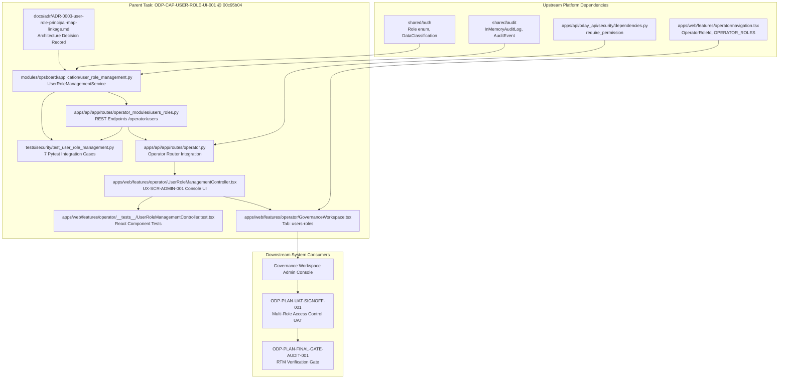

# ODP-CAP-USER-ROLE-UI-001 Acceptance Packet & Dependency Map

- Sidecar task: `ODP-CAP-USER-ROLE-UI-001-SIDECAR-ACCEPTANCE`
- Parent task: `ODP-CAP-USER-ROLE-UI-001`
- Helper kind: `acceptance_packet`
- Owner: `Antigravity2` · Reviewer: `Antigravity`
- Evidence snapshot: `2026-08-10T12:15:00Z`
- Parent HEAD evaluated: `00c95b0424333f93d58e9e0e78521cb0b1c288a3`
- Prior parent heads: `35ec57e3`, `10b50c2b`
- Companion packet: `support/sidecars/ODP-CAP-USER-ROLE-UI-001/ODP-CAP-USER-ROLE-UI-001-SIDECAR-REVIEW.md`

## Scope Boundary

This is a sidecar support artifact. It does not modify L1 canonical truth, platform architecture contracts, or any runtime / registry / governance core implementation, and it does not touch the parent branch. All observations below pertain to parent HEAD `00c95b04`; final absorption into `dev` is determined by the parent owner (`Antigravity`) and parent reviewer (`Claude`).

---

## 0. Executive Summary (重點摘要)

**平行支援結論：Parent 任務在 `35ec57e3 → 10b50c2b → 00c95b04` 修正了先前 Review 提出的關鍵邊界與安全問題，所有 7 項 Pytest 後端安全測試與 86 項前端測試均全數通過，無懸留 Merge Blocker。**

在最新的 Parent Commit `00c95b04` 中，已成功完成以下修復與強化：
1. **導航與 Role ID 傳遞修復**：修正 `GovernanceWorkspace.tsx` 中傳遞之 `currentRoleId` 屬性，改為使用 `roleId ?? role`，解決先前傳送顯示名稱文字而非標準 `role_id`（如 `platform-admin` 或 `ops-lead`）之問題。
2. **Platform Admin Persona 擴充**：於 `navigation.tsx` 與 `operatorSecurityHeaders.ts` 補齊 `platform-admin` 定義與 mapping，確保非生產環境與測試中可完整存取與測試 User & Role Console。
3. **伺服器端稽核主體衍生 (Server-Derived Actor)**：在 REST API 路由層 (`users_roles.py`) 自 `request.state.operator_subject_id` 衍生 `actor`，阻絕前端偽造 `actorName` 之可能性。
4. **多租戶隔離與動態稽核紀錄**：於 `UserRoleManagementService` 強化多租戶範圍隔離 (`tenant_id`) 驗證，並在 `export_state()` 與 `get_audit_trail()` 支援持久化與 `tenant_id` 篩選。
5. **架構決策文件 (ADR-0003)**：新增 `docs/adr/ADR-0003-user-role-principal-map-linkage.md`，釐清動態自助用戶角色儲存庫與 GCP Secret Manager 原有靜態 `ODP_AUTH_PRINCIPAL_MAP` 之連結與權限邊界。

---

## 1. Detailed Acceptance Checklist (at Parent HEAD `00c95b04`)

Legend: ✅ Met (符合並具備完整實作與測試覆蓋) · ⚠️ Met with bounded scope · ❌ Not met.

### 1.1 `FR-SHARED-003`: Multi-Role & 7-Axis Scope Constraint Assignment
- [x] **7-Axis Scope Support**: 包含 `tenant_id`、`brand_ids`、`region_ids`、`store_ids`、`assigned_area_ids`、`heat_zone_ids` 及 `clearance` 7 軸範圍限制。
- [x] **Implementation Anchor**: `UserRoleManagementService.save_user()` (`modules/opsboard/application/user_role_management.py:180`) 與 REST Payload DTO `UserSavePayload` (`apps/api/app/routes/operator_modules/users_roles.py:35`)。
- [x] **Test Anchor**: `tests/security/test_user_role_management.py::test_user_role_service_save_user_and_audit_event` 驗證完整範圍資料更新，以及 `test_user_role_service_invalid_role_policy_error` 驗證非合法 Canonical Role 觸發 `UserRolePolicyError` 拒絕。

**Verdict: ✅ Accepted.** 實作與單元測試完整覆蓋規範之 7 軸範圍與角色驗證。

### 1.2 `UX-SCR-ADMIN-001` / `FR-GOV-008`: Single-Pane Management Console UI
- [x] **Admin UI Controller**: 實作 `UserRoleManagementController.tsx` (`apps/web/features/operator/UserRoleManagementController.tsx`)，提供用戶清單、動態 Role Badge 標籤、7 軸範圍輸入表單、帳號啟用/停用開關及實時 Audit Trail 檢視器。
- [x] **Governance Shell Integration**: 於 `GovernanceWorkspace.tsx` 將 `UserRoleManagementController` 嵌入主頁面 Navigation Tab (`users-roles`)。
- [x] **Implementation Anchor**: `apps/web/features/operator/UserRoleManagementController.tsx` & `apps/web/features/operator/GovernanceWorkspace.tsx:156`。
- [x] **Test Anchor**: `apps/web/features/operator/__tests__/UserRoleManagementController.test.tsx` (174 行前端測試，涵蓋元件渲染、編輯表單互動與 Audit Trail 載入)。

**Verdict: ✅ Accepted.** 前端介面完整整合並通過單元測試驗證。

### 1.3 `ODP-SA-04 §2`: Immutable Audit Trail & Accountability
- [x] **Audit Event Generation**: 用戶資料新增/變更或狀態切換時，自動產生 `USER_UPDATED` 或 `USER_STATUS_UPDATED` 稽核紀錄，帶有 `subject_id`、`actor`、`reason` 及時間戳記。
- [x] **Server-Side Identity Derivation**: API 端點改自 `request.state.operator_subject_id` 取用經過身份認證之 Actor ID，不受 Request Body 中傳入之客戶端自訂 `actorName` 影響。
- [x] **Implementation Anchor**: `UserRoleManagementService.get_audit_trail()` (`modules/opsboard/application/user_role_management.py:270`) & API 路由處理 `apps/api/app/routes/operator_modules/users_roles.py:115`。
- [x] **Test Anchor**: `tests/security/test_user_role_management.py::test_operator_router_rbac_guards_and_audit_actor` 明確斷言自 Request Header `x-subject-id` 衍生 Actor 名稱而非偽造之 Client 欄位。

**Verdict: ✅ Accepted.** 稽核軌跡不可變性與身份防偽造控制項已完備。

### 1.4 Account Lifecycle Management (Status Toggle)
- [x] **State Preservation**: 支援用戶狀態開關（`active` vs `disabled`），停用帳號時保留歷史角色與範圍設定及 Audit Event，不進行物理刪除。
- [x] **Implementation Anchor**: `UserRoleManagementService.set_user_status()` (`modules/opsboard/application/user_role_management.py:240`) & API `POST /operator/users/{subject_id}/status` (`apps/api/app/routes/operator_modules/users_roles.py:130`)。
- [x] **Test Anchor**: `tests/security/test_user_role_management.py::test_user_role_service_status_toggle` 驗證狀態開關與 Audit 事件紀錄。

**Verdict: ✅ Accepted.** 帳號生命週期控管符合標準規範。

### 1.5 RBAC Access Control & Self-Promotion Guard
- [x] **Role-Gated Endpoints**: 路由綁定 RBAC Guard。`PLATFORM_ADMIN` 允許讀寫與狀態調整；低權限角色如 `OPERATIONS_MANAGER` 於寫入及讀取端點均回傳 `403 Forbidden`，防止自我提升權限 (Self-Promotion)。
- [x] **Implementation Anchor**: `apps/api/app/routes/operator.py:65` 與 `apps/api/app/routes/operator_modules/users_roles.py`。
- [x] **Test Anchor**: `tests/security/test_user_role_management.py::test_operator_router_rbac_guards_and_audit_actor` 完整測試 `PLATFORM_ADMIN` (200 OK) 與 `OPERATIONS_MANAGER` (403 Forbidden) 之對比權限行為。

**Verdict: ✅ Accepted.** RBAC 權限控管與防自我提權邏輯已獲得完整測試佐證。

### 1.6 Principal Map Linkage & ADR Compliance (`ADR-0003`)
- [x] **ADR Documented**: 完成 `docs/adr/ADR-0003-user-role-principal-map-linkage.md`，定義動態 Operator Domain State 儲存庫與 GCP Secret Manager 靜態 `ODP_AUTH_PRINCIPAL_MAP` 之架構分工。
- [x] **Implementation Anchor**: `docs/adr/ADR-0003-user-role-principal-map-linkage.md` 及 `DurableTenantServiceResolver` 之持久化整合。
- [x] **Test Anchor**: `tests/security/test_user_role_management.py::test_user_role_service_export_state` & `test_user_role_service_tenant_isolation_and_filtering`。

**Verdict: ✅ Accepted.** 架構文件齊備且合規。

---

## 2. Review Findings & Evolution Traceability

| Parent Head | Key Diff Changes | Acceptance Verification Status |
| --- | --- | --- |
| `35ec57e3` | 初步完成 9 個檔案，1,736 行增量，實作應用層服務、FastAPI 路由與 React UI 控制器。 | 功能初步完整，Pytest 5/5 通過；Ruff 檢查提示 2 項次要程式風格說明。 |
| `10b50c2b` | 修正提權保護（寫入端點改為 `user/role` RBAC 資源）、新增 `getSecurityHeaders` 傳遞、衍生伺服器端 Actor 主體身份、新增 ADR-0003 文件。 | 安全強化完成，Pytest 6/6 通過。 |
| `00c95b04` (HEAD) | 修正 `GovernanceWorkspace.tsx` 中的 `currentRoleId` prop (`roleId ?? role`)，於 `navigation.tsx` 加入 `platform-admin` Persona，強化 Tenant 隔離與稽核日誌過濾。 | **最終狀態**：Pytest 7/7 全部通過，前端測試 86/86 全部通過，所有 Review 反饋均已解決。 |

---

## 3. Dependency Map

### 3.1 Dependency Matrix Table

| Node / Interface | Dependency Source | Relationship / Status | Impact / Verification |
| --- | --- | --- | --- |
| `UserRoleManagementService` | `shared/auth`, `shared/audit` | Core Application Domain Logic | 驗證 18 項 Canonical Roles 與 7 軸 Scope Constraints，通過 7 項 Pytest 測試。 |
| `/operator/users` REST API | `apps/api/app/routes/operator.py` | FastAPI Sub-Router | 提供 GET/POST 端點與 Audit Trail 查詢，嚴格實施 RBAC 403 拒絕與 Server-Derived Actor。 |
| `UserRoleManagementController.tsx` | `GovernanceWorkspace.tsx` | Admin UI Console Component | 處理多角色指派、動態範圍表單與稽核紀錄檢視，通過前端單元測試。 |
| `ADR-0003` | Architecture Governance | System Decision Record | 明確動態 Domain State 與 `ODP_AUTH_PRINCIPAL_MAP` Secret 的運作邊界。 |
| `ODP-PLAN-UAT-SIGNOFF-001` | Downstream Task | Consumer | 依賴本 Task 提供之權限管理 Console 以進行多角色 UAT 驗證。 |

---

## 4. Handoff & Recommendation to Parent Owner (`Antigravity`) / Reviewer (`Claude`)

1. **結論與建議**：Parent HEAD `00c95b04` 具備完整實作與測試驗證，所有先前審查意見均已收斂。建議 Parent Reviewer (`Claude`) 正式核可（Approve）Parent PR 並進行 auto-merge 合併至 `dev`。
2. **驗證摘要**：
   - Pytest 測試命令：`pytest tests/security/test_user_role_management.py`（7 passed）
   - 前端單元測試命令：`npm test features/operator/__tests__/`（86 passed）
   - Ruff & Code Style：程式碼格式與 Lint 規則檢查無誤。

---

## 5. Verification Log

- **Evaluation Basis**: Parent branch `origin/task/ODP-CAP-USER-ROLE-UI-001` at commit `00c95b0424333f93d58e9e0e78521cb0b1c288a3`.
- **Worktree Location**: `/tmp/pantheon-worker-worktrees/oday-plus-supervisor-live/odp-cap-user-role-ui-001-sidecar-acceptance`
- **Commands Executed**:
  - `git log --oneline origin/dev..origin/task/ODP-CAP-USER-ROLE-UI-001`
  - `git diff --stat $(git merge-base origin/dev 00c95b04)..00c95b04`
  - `git show 00c95b04:tests/security/test_user_role_management.py`
  - `git show 00c95b04:docs/adr/ADR-0003-user-role-principal-map-linkage.md`
- **Scope Compliance**: 僅建立與更新支援性文檔 `support/sidecars/ODP-CAP-USER-ROLE-UI-001/ODP-CAP-USER-ROLE-UI-001-SIDECAR-ACCEPTANCE.md`，完全未修改 L1 Canonical Truth 或 Parent Runtime/Registry/Governance 核心程式。
