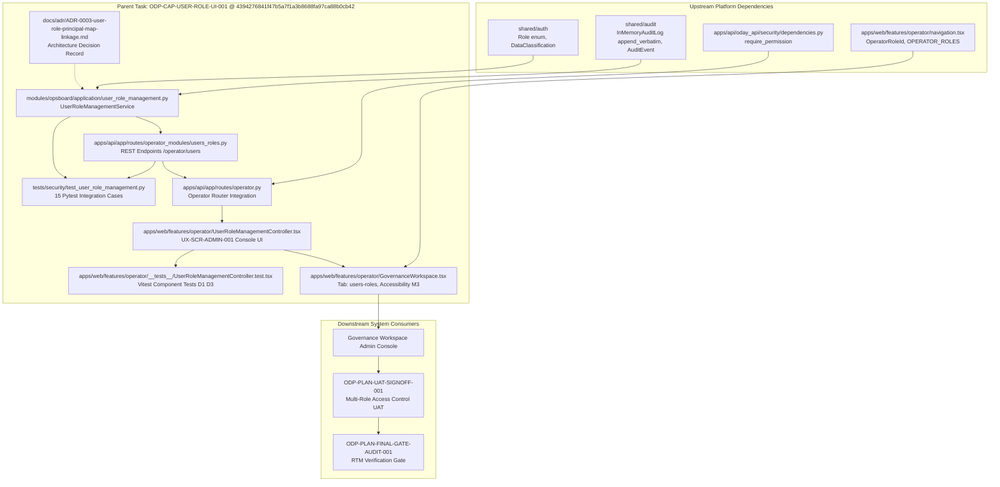

# ODP-CAP-USER-ROLE-UI-001 Acceptance Packet & Dependency Map

- Sidecar task: `ODP-CAP-USER-ROLE-UI-001-SIDECAR-ACCEPTANCE`
- Parent task: `ODP-CAP-USER-ROLE-UI-001`
- Helper kind: `acceptance_packet`
- Sidecar Owner: `Antigravity` · Sidecar Reviewer: `Codex`
- Parent Owner: `Claude` · Parent Reviewer: `Antigravity`
- Evidence snapshot: `2026-08-10T14:54:00Z`
- Parent HEAD evaluated: `4394276841f47b5a7f1a3b8688fa97ca88b0cb42`
- Prior parent heads: `00c95b0424333f93d58e9e0e78521cb0b1c288a3`, `10b50c2b43671ac629f5f730d083344b3110a90b`, `06e630a4db49444dd2b5a9a80fbc6cdbb7b7074b`, `1e5dabd77fef72f44667dac2114c71d80beabf31`, `3f2afe373bc7af94ec306f24e007a8e197e1fd87`, `1e1fd205dc4ab0e7a195f51e951ad966aa18ed75`
- Companion packet: `support/sidecars/ODP-CAP-USER-ROLE-UI-001/ODP-CAP-USER-ROLE-UI-001-SIDECAR-REVIEW.md`

## Scope Boundary

This is a sidecar support artifact. It does not modify L1 canonical truth, platform architecture contracts, or any runtime / registry / governance core implementation, and it does not touch the parent branch. All observations below pertain to parent approved HEAD `4394276841f47b5a7f1a3b8688fa97ca88b0cb42`; final absorption into `dev` is determined by the parent owner (`Claude`) and parent reviewer (`Antigravity`).

---

## 0. Executive Summary (重點摘要)

**平行支援結論：Parent 任務從 `00c95b04` 經過歷史節點 `3f2afe373bc7af94ec306f24e007a8e197e1fd87` 與 `1e1fd205dc4ab0e7a195f51e951ad966aa18ed75`，推進至最新 approved HEAD Gate `4394276841f47b5a7f1a3b8688fa97ca88b0cb42`。補齊了稽核紀錄預設租戶隔離漏洞 E1 (`1e1fd205`)，以及 Round-4 審查小項 M2-M4 與前端 UI 測試覆蓋 (`43942768`)。15 項 Pytest 後端安全整合測試、17 項 OpenAPI 契約與客戶端測試、1 項 Soak 測試、以及 13 項 Vitest 前端測試均已全數通過。目前 Parent 任務狀態為 `review_approved`，本 Sidecar Packet 正式更新評估錨點至 SHA `4394276841f47b5a7f1a3b8688fa97ca88b0cb42` 供審查參考。**

在 Parent Commit `4394276841f47b5a7f1a3b8688fa97ca88b0cb42` 中，演進修復與強化項目包含：
1. **導航與 Role ID 傳遞與鍵盤可達性修復 (M3)**：修正 `GovernanceWorkspace.tsx:1401` 中傳遞之 `currentRoleId` 屬性，改為使用 `roleId ?? role`；於 Users 治理卡片補齊 `role="button"`、`tabIndex={0}` 與 Enter/Space 鍵盤事件處理常式。
2. **Platform Admin Persona 擴充**：於 `navigation.tsx` 與 `operatorSecurityHeaders.ts` 補齊 `platform-admin` 定義與 mapping，確保非生產環境與測試中可完整存取與測試 User & Role Console。
3. **伺服器端稽核主體衍生 (Server-Derived Actor)**：在 REST API 路由層 (`users_roles.py:156`, `195`) 自 `request.state.operator_subject_id` 衍生 `actor`，阻絕前端偽造 `actorName` 之可能性。
4. **多租戶隔離與動態稽核紀錄 (E1, M2, M4)**：在 `1e1fd205` 解耦 Audit partition key 與 scope tenant，紀錄 `metadata.tenant_id = caller tenant` 並保留 `metadata.scope_tenant_id`，解決 `tenant-default` Flow 下稽核紀錄隱形問題；`43942768` 於 `InMemoryAuditLog` 增加 `append_verbatim()` 供復原路徑使用 (M2)，並將 Audit 列改以 `event_id` Identity 綁定 (M4)。
5. **ABAC 屬性保留與 UI 缺陷修復 (B1-B3, D1-D3)**：`1e5dabd7` 與 `3f2afe37` 解決了 ABAC 屬性遺失問題、補齊 seeded principal 邊界，修復了 UI Console 邊界與 OpenAPI Schema 對齊，並加入前端 Payload 測試驅動 (D1, D3)。
6. **架構決策文件 (ADR-0003)**：完成 `docs/adr/ADR-0003-user-role-principal-map-linkage.md`，釐清動態自助用戶角色儲存庫與 GCP Secret Manager 原有靜態 `ODP_AUTH_PRINCIPAL_MAP` 之連結與權限邊界。

---

## 1. Detailed Acceptance Checklist (at Parent HEAD `4394276841f47b5a7f1a3b8688fa97ca88b0cb42`)

Legend: ✅ Met (符合並具備完整實作與測試覆蓋) · ⚠️ Met with bounded scope · ❌ Not met.

### 1.1 `FR-OPS-003`: Multi-Role & 7-Axis Scope Constraint Assignment
- [x] **7-Axis Scope Support**: 包含 `tenant_id`、`brand_ids`、`region_ids`、`store_ids`、`assigned_area_ids`、`heat_zone_ids` 及 `clearance` 7 軸範圍限制。
- [x] **Implementation Anchor**: `UserRoleManagementService.save_user()` (`modules/opsboard/application/user_role_management.py:335`) 與 REST Payload DTO `UserSavePayload` (`apps/api/app/routes/operator_modules/users_roles.py:46`)。
- [x] **Test Anchor**: `tests/security/test_user_role_management.py` (15 項 Pytest 安全測試)，包含 `test_user_role_service_save_user_and_audit_event` 驗證完整範圍資料更新，`test_save_user_preserves_abac_attributes_when_attributes_omitted` 驗證 ABAC 屬性保留，`test_set_user_status_tenant_guard_and_audit_partition` 驗證 E1 partition key 解耦，以及 `test_user_role_service_invalid_role_policy_error` 驗證非合法 Canonical Role 觸發 `UserRolePolicyError` 拒絕。

**Verdict: ✅ Accepted.** 實作與 15 項單元測試完整覆蓋規範之 7 軸範圍與角色驗證。

### 1.2 `UX-SCR-ADMIN-001` / `FR-GOV-008`: Single-Pane Management Console UI
- [x] **Admin UI Controller**: 實作 `UserRoleManagementController.tsx` (`apps/web/features/operator/UserRoleManagementController.tsx`)，提供用戶清單、動態 Role Badge 標籤、7 軸範圍輸入表單、帳號啟用/停用開關及實時 Audit Trail 檢視器。
- [x] **Governance Shell Integration & Accessibility**: 於 `GovernanceWorkspace.tsx` 將 `UserRoleManagementController` 嵌入主頁面 Navigation Tab (`users-roles`)，並補齊 `role="button"`、`tabIndex={0}` 與 Enter/Space 鍵盤事件處理解決 M3 鍵盤可達性。
- [x] **Implementation Anchor**: `apps/web/features/operator/UserRoleManagementController.tsx` & `apps/web/features/operator/GovernanceWorkspace.tsx:1401`。
- [x] **Test Anchor**: `apps/web/features/operator/__tests__/UserRoleManagementController.test.tsx` (13 項 Vitest 前端測試，執行時需設定 cwd `apps/web` 或以 `npm --workspace=apps/web run test -- UserRoleManagementController GovernanceWorkspace` 執行，涵蓋元件渲染、編輯表單互動、ABAC attributes 保留 D1 與 admin-typed subject ID 傳送 D3)。

**Verdict: ✅ Accepted.** 前端介面完整整合並通過 Vitest 單元與整合測試驗證。

### 1.3 `ODP-SA-04 §2`: Immutable Audit Trail & Accountability
- [x] **Audit Event Generation & Partition Key Decoupling**: 用戶資料新增/變更或狀態切換時，自動產生 `USER_UPDATED` 或 `USER_STATUS_UPDATED` 稽核紀錄。在 `1e1fd205` 中將 Audit partition key 與 scope tenant 解耦 (`metadata.tenant_id = caller tenant`)，使預設流程下的 Audit Trail 不再因 scope tenant 隔離而隱形。
- [x] **Server-Side Identity Derivation & Event Identity Keying**: API 端點改自 `request.state.operator_subject_id` 取用經過身份認證之 Actor ID，不受 Client 傳入之 `actorName` 影響。M4 中 `get_audit_trail` 回傳 `event_id`，前端 UI Row 改以 `event_id` 作為 Key 進行渲染。
- [x] **Implementation Anchor**: `UserRoleManagementService.get_audit_trail()` (`modules/opsboard/application/user_role_management.py:494`)、`shared/audit/events.py` (`append_verbatim()` M2) & API 路由處理 `apps/api/app/routes/operator_modules/users_roles.py:156` (save_user) / `195` (set_status)。
- [x] **Test Anchor**: `tests/security/test_user_role_management.py::test_operator_router_rbac_guards_and_audit_actor` 明確斷言自 Request Header `x-subject-id` 衍生 Actor 名稱，`test_operator_router_ui_shaped_flow_leaves_visible_audit_trail` 驗證 E1 稽核軌跡可見性。

**Verdict: ✅ Accepted.** 稽核軌跡不可變性、身份防偽造與租戶隔離查詢控制項已完備。

### 1.4 Account Lifecycle Management (Status Toggle)
- [x] **State Preservation**: 支援用戶狀態開關（`active` vs `disabled`），停用帳號時保留歷史角色與範圍設定及 Audit Event，不進行物理刪除。
- [x] **Implementation Anchor**: `UserRoleManagementService.set_user_status()` (`modules/opsboard/application/user_role_management.py:454`) & API `POST /operator/users/{subject_id}/status` (`apps/api/app/routes/operator_modules/users_roles.py:188`)。
- [x] **Test Anchor**: `tests/security/test_user_role_management.py::test_user_role_service_status_toggle` & `test_set_user_status_tenant_guard_and_audit_partition` 驗證狀態開關與 Audit 事件紀錄。

**Verdict: ✅ Accepted.** 帳號生命週期控管符合標準規範。

### 1.5 RBAC Access Control & Self-Promotion Guard
- [x] **Role-Gated Endpoints**: 路由綁定 RBAC Guard。`PLATFORM_ADMIN` 允許讀寫與狀態調整；低權限角色如 `OPERATIONS_MANAGER` 於寫入及讀取端點均回傳 `403 Forbidden`，防止自我提升權限 (Self-Promotion)。
- [x] **Implementation Anchor**: `apps/api/app/routes/operator.py:924` 與 `apps/api/app/routes/operator_modules/users_roles.py`。
- [x] **Test Anchor**: `tests/security/test_user_role_management.py::test_operator_router_rbac_guards_and_audit_actor` 完整測試 `PLATFORM_ADMIN` (200 OK) 與 `OPERATIONS_MANAGER` (403 Forbidden) 之對比權限行為。

**Verdict: ✅ Accepted.** RBAC 權限控管與防自我提權邏輯已獲得完整測試佐證。

### 1.6 Principal Map Linkage & ADR Compliance (`ADR-0003`)
- [x] **ADR Documented**: 完成 `docs/adr/ADR-0003-user-role-principal-map-linkage.md`，定義動態 Operator Domain State 儲存庫與 GCP Secret Manager 靜態 `ODP_AUTH_PRINCIPAL_MAP` 之架構分工。
- [x] **Implementation Anchor**: `docs/adr/ADR-0003-user-role-principal-map-linkage.md` 及 `DurableTenantServiceResolver` 之持久化整合。
- [x] **Test Anchor**: `tests/security/test_user_role_management.py::test_user_role_service_export_state` & `test_user_role_service_tenant_isolation_and_filtering`。

**Verdict: ✅ Accepted.** 架構文件齊備且合規。

---

## 2. Review Findings & Evolution Traceability

| Parent Head | Key Diff Changes | Acceptance Verification Status |
| --- | --- | --- |
| `35ec57e3` | 初步完成 9 個檔案，1,736 行增量，實作應用層服務、FastAPI 路由與 React UI 控制器。 | 功能初步完整，Pytest 5/5 通過；Ruff 檢查提示 2 項次要程式風格說明。 |
| `10b50c2b43671ac629f5f730d083344b3110a90b` | 修正提權保護（寫入端點改為 `user/role` RBAC 資源）、新增 `getSecurityHeaders` 傳遞、衍生伺服器端 Actor 主體身份、新增 ADR-0003 文件。 | 安全強化完成，Pytest 6/6 通過。 |
| `00c95b0424333f93d58e9e0e78521cb0b1c288a3` | 修正 `GovernanceWorkspace.tsx` 中的 `currentRoleId` prop (`roleId ?? role`)，於 `navigation.tsx` 加入 `platform-admin` Persona，強化 Tenant 隔離與稽核日誌過濾。 | 完成基礎驗證，Pytest 7/7 通過。 |
| `06e630a4db49444dd2b5a9a80fbc6cdbb7b7074b` | 修復 durable tenant-scoped audit logging，防止共享 audit log 造成指數膨脹與效能退化。 | 稽核日誌隔離修復完成。 |
| `1e5dabd77fef72f44667dac2114c71d80beabf31` | 修正審查反饋 B1-B3：ABAC 屬性保留 (B1)、Tenant 隔離防護 (B2)、Seeded Principal 預設租戶權限 (B3)。 | 審查意見 B1-B3 修復完成。 |
| `3f2afe373bc7af94ec306f24e007a8e197e1fd87` | 修正 UI 缺陷 D1-D3、對齊 OpenAPI Schema 契約，擴充 Pytest 安全測試套件至 13 項測試 (+202 行測試碼)。 | Pytest 13/13 全數通過，前端測試 86/86 通過。歷史轉折節點。 |
| `1e1fd205dc4ab0e7a195f51e951ad966aa18ed75` | 修正 Audit Trail 隱形漏洞 E1：解耦 Audit partition key 與 scope tenant，記錄 caller tenant 並寫入 `metadata.tenant_id`。 | Pytest 安全測試擴充至 15 項全數通過。 |
| `4394276841f47b5a7f1a3b8688fa97ca88b0cb42` (HEAD Gate) | 修正 Round-4 審查意見 M2 (`InMemoryAuditLog.append_verbatim`)、M3 (Users 卡片鍵盤可達性 `role="button"`)、M4 (`event_id` Identity keying)，補齊 D1/D3 前端 Payload 測試。 | **當前 approved HEAD 狀態**：Pytest 15/15 通過、OpenAPI 契約 17/17 通過、Soak 1/1 通過、Vitest 前端 13/13 通過、Drift Check PASS。Parent Task 現為 `review_approved`。 |

---

## 3. Dependency Map

### 3.1 Dependency Matrix Table

| Node / Interface | Dependency Source | Relationship / Status | Impact / Verification |
| --- | --- | --- | --- |
| `UserRoleManagementService` | `shared/auth`, `shared/audit` | Core Application Domain Logic | 驗證 18 項 Canonical Roles 與 7 軸 Scope Constraints，提供 E1/M2 稽核紀錄隔理解耦與復原機制，通過 15 項 Pytest 測試。 |
| `/operator/users` REST API | `apps/api/app/routes/operator.py` | FastAPI Sub-Router | 提供 GET/POST 端點與 Audit Trail 查詢，嚴格實施 RBAC 403 拒絕、Server-Derived Actor 與 Partition Tenant 查詢。 |
| `UserRoleManagementController.tsx` | `GovernanceWorkspace.tsx` | Admin UI Console Component | 處理多角色指派、動態範圍表單與 Audit Trail (以 `event_id` 為 Key - M4)，補齊 M3 鍵盤可達性與 D1/D3 測試。 |
| `ADR-0003` | Architecture Governance | System Decision Record | 明確動態 Domain State 與 `ODP_AUTH_PRINCIPAL_MAP` Secret 的運作邊界。 |
| `ODP-PLAN-UAT-SIGNOFF-001` | Downstream Task | Consumer | 依賴本 Task 提供之權限管理 Console 以進行多角色 UAT 驗證。 |

---

## 4. Handoff & Recommendation to Parent Owner (`Claude`) / Reviewer (`Antigravity`)

1. **結論與建議**：Parent HEAD `4394276841f47b5a7f1a3b8688fa97ca88b0cb42` 具備完整實作與擴充之 15 項 Pytest 安全整合測試驗證。先前審查提出的耐用稽核紀錄隔離 (`06e630a4`)、審查意見 B1-B3 (`1e5dabd7`)、UI 缺陷 D1-D3 (`3f2afe37`)、Audit Trail 隱形漏洞 E1 (`1e1fd205`) 以及 M2-M4 審查小項 (`43942768`) 均已全部修復完成。目前 Parent 任務已為 `review_approved` 狀態，建議 Parent Owner (`Claude`) 與 Reviewer (`Antigravity`) 依據 HEAD `4394276841f47b5a7f1a3b8688fa97ca88b0cb42` 進行 PR 合併與 closeout。
2. **驗證摘要與完整執行命令**：
   - Pytest 安全性整合測試套件：`python3 -m pytest tests/security/test_user_role_management.py`（15 passed）
   - Pytest OpenAPI 契約與客戶端測試：`python3 -m pytest tests/contract/test_openapi_artifact_and_client.py`（17 passed）
   - Pytest 效能與 Soak 測試：`python3 -m pytest tests/performance/test_load_and_soak.py::test_concurrency_and_soak_execution`（1 passed）
   - Vitest 前端組件測試：`npm --workspace=apps/web run test -- UserRoleManagementController GovernanceWorkspace` 或在 `apps/web` 目錄執行 `npx vitest UserRoleManagementController GovernanceWorkspace`（13 passed: 7 passed + 6 passed；在 root 目錄直接執行 `npx vitest` 會因缺少 Vite JSX context 導致 0 tests 並報錯）
   - OpenAPI Schema 漂移檢查：`python3 delivery_toolchain/openapi/check_drift.py`（PASS）

---

## 5. Verification Log

- **Evaluation Basis**: Parent branch `origin/task/ODP-CAP-USER-ROLE-UI-001` at approved commit `4394276841f47b5a7f1a3b8688fa97ca88b0cb42`.
- **Historical SHA Disambiguation**: Historical snapshot `3f2afe37` full SHA is `3f2afe373bc7af94ec306f24e007a8e197e1fd87`; audit gap fix commit is `1e1fd205dc4ab0e7a195f51e951ad966aa18ed75`; latest approved HEAD is `4394276841f47b5a7f1a3b8688fa97ca88b0cb42`.
- **Worktree Location**: `/tmp/pantheon-worker-worktrees/oday-plus-supervisor-live/odp-cap-user-role-ui-001-sidecar-acceptance`
- **Commands Executed & Results**:
  - `git rev-parse 43942768 1e1fd205 3f2afe37`: Verified all commit SHAs in repository history.
  - `git log 3f2afe373bc7af94ec306f24e007a8e197e1fd87..4394276841f47b5a7f1a3b8688fa97ca88b0cb42 --oneline`: Analyzed full evolution diff from 3f2afe37 to HEAD.
  - `git show --stat 4394276841f47b5a7f1a3b8688fa97ca88b0cb42`: Inspected commit metadata and verification trailers.
  - `git show 4394276841f47b5a7f1a3b8688fa97ca88b0cb42:tests/security/test_user_role_management.py`: Verified 15 test cases present in parent security test suite.
  - `npm --workspace=apps/web run test -- UserRoleManagementController GovernanceWorkspace`: Verified Vitest reproducible execution from `apps/web` context.
- **Scope Compliance**: 僅建立與更新支援性文檔 `support/sidecars/ODP-CAP-USER-ROLE-UI-001/ODP-CAP-USER-ROLE-UI-001-SIDECAR-ACCEPTANCE.md`，完全未修改 L1 Canonical Truth 或 Parent Runtime/Registry/Governance 核心程式。
