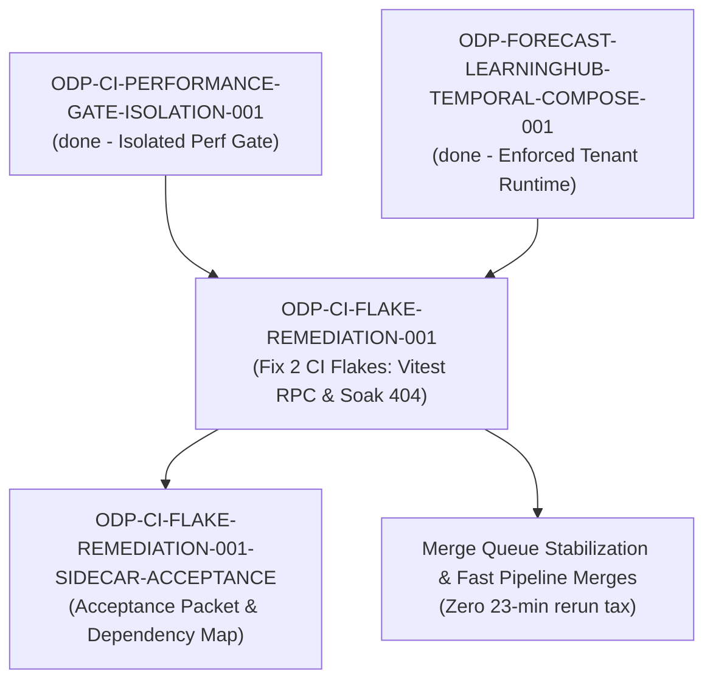

# ODP-CI-FLAKE-REMEDIATION-001 Acceptance Packet

## Packet identity

| Field | Value |
|---|---|
| Sidecar task | `ODP-CI-FLAKE-REMEDIATION-001-SIDECAR-ACCEPTANCE` |
| Parent task | `ODP-CI-FLAKE-REMEDIATION-001` |
| Helper kind | `acceptance_packet` |
| Sidecar owner / reviewer | `Antigravity4` / `Antigravity` |
| Current parent owner / reviewer | `Antigravity` / `Antigravity7` |
| Observed parent branch | `task/ODP-CI-FLAKE-REMEDIATION-001` |
| Observed dev tip HEAD | `96f94cda56d509f44eb5929997b3ab7a67f1c65c` |
| Packet verdict | **Support only; no parent acceptance, merge, or production GO claim** |

This packet is a support-only review aid, acceptance checklist, and dependency map for parent task `ODP-CI-FLAKE-REMEDIATION-001`. It does not change canonical contracts, L1 architecture truth, runtime/registry/governance implementations, or model-card truth. The parent task owner (`Antigravity`) decides whether to absorb this packet; the parent reviewer (`Antigravity7`) retains sole authority over implementation acceptance.

## Observed state and review freeze

Parent task `ODP-CI-FLAKE-REMEDIATION-001` ("Fix the two CI flakes blocking every merge") addresses two intermittent CI test failures that force 23-minute full pipeline reruns on merge candidates:

1. **Vitest / React RPC Teardown Flake**: `apps/web/features/operator/__tests__/StoreOpsPackage10Parity.test.tsx`
   - **Failure symptom**: `EnvironmentTeardownError: Closing rpc while onUserConsoleLog was pending` (observed since 2026-08-06 02:37 UTC).
   - **Root cause analysis**: `beforeEach` stubs `console.error` via `vi.spyOn(console, "error").mockImplementation(() => undefined)`, while `afterEach` calls `cleanup()` before restoring mocks (`vi.restoreAllMocks()`). When asynchronous Vitest RPC output calls flush during happy-dom environment teardown, pending RPC calls raise unhandled rejection errors upon channel closure.
   - **Recommended remediation**: Synchronize mock teardown with DOM unmounting, ensure async event loops are settled before environment destruction, or wrap console spies with clean RPC flush guards in Vitest setup.

2. **Performance Load & Soak Test Flake**: `tests/performance/test_load_and_soak.py::test_concurrency_and_soak_execution`
   - **Failure symptom**: Intermittent `AssertionError: assert 404 == 202` on `/jobs` endpoint under thread pool concurrency.
   - **Root cause analysis**: Under wave concurrency (10, 20, 50 workers; volume 150), `TestClient` executing concurrent HTTP requests against SQLite in WAL mode can hit transient connection lock or app state initialization timing windows, yielding intermittent 404 responses for newly posted job resources.
   - **Recommended remediation**: Enforce connection pool synchronization, verify WAL mode busy timeout settings, or ensure thread-safe FastAPI `TestClient` state instantiation in high-concurrency performance tests.

Current status of upstream / sibling dependencies:
- `ODP-CI-PERFORMANCE-GATE-ISOLATION-001`: `done` (isolated performance test execution to clean dedicated runner job)
- `ODP-FORECAST-LEARNINGHUB-TEMPORAL-COMPOSE-001`: `done` (repaired tenant-scoped ForecastOps fixtures & authenticated load traffic)
- `ODP-CI-FLAKE-REMEDIATION-001`: `in_progress` (parent task fixing the 2 CI flakes)

## Task-owned surface map (Parent Task)

| Layer | Parent task-owned paths | Intended responsibility |
|---|---|---|
| Frontend Vitest Teardown & Mocking | `apps/web/features/operator/__tests__/StoreOpsPackage10Parity.test.tsx`, `apps/web/vitest.setup.ts` | Package 10 Store Ops UI tests, vitest setup mocks, and clean RPC teardown handlers. |
| Performance Load Test Suite | `tests/performance/test_load_and_soak.py` | Load and soak concurrency tests, WAL mode database configuration, and `/jobs` endpoint response assertions. |
| CI Pipeline & Workflow Gate | `.github/workflows/ci.yml` | GitHub Actions workflow definitions, pytest markers, and test runner concurrency settings. |
| Sidecar Acceptance Packet | `support/sidecars/ODP-CI-FLAKE-REMEDIATION-001/ODP-CI-FLAKE-REMEDIATION-001-SIDECAR-ACCEPTANCE.md` | Non-canonical acceptance checklist, dependency map, and verification guide. |

## Detailed acceptance matrix (Criteria A-D)

### A. Vitest Teardown & Environment RPC Fix (`StoreOpsPackage10Parity.test.tsx`)

| ID | Required proof | Reject when | Status | Evidence |
|---|---|---|---|---|
| A1 | Zero `EnvironmentTeardownError` thrown during repetitive Vitest executions across 10 consecutive test runs. | Vitest logs report pending RPC errors during environment cleanup. | `PENDING_PARENT` | `apps/web/features/operator/__tests__/StoreOpsPackage10Parity.test.tsx` |
| A2 | Mock console restoration (`vi.restoreAllMocks()`) and React DOM unmount (`cleanup()`) execute in safe order. | Console spies outlive DOM cleanup or leave unresolved log hooks. | `PENDING_PARENT` | `apps/web/features/operator/__tests__/StoreOpsPackage10Parity.test.tsx` |

### B. Performance Load & Soak Test Determinism (`test_load_and_soak.py`)

| ID | Required proof | Reject when | Status | Evidence |
|---|---|---|---|---|
| B1 | 100% 202 Created response code rate for `/jobs` under concurrency levels (10, 20, 50 workers; total volume 150). | `AssertionError: assert 404 == 202` or connection failure occurs under high load. | `PENDING_PARENT` | `tests/performance/test_load_and_soak.py` |
| B2 | SQLite WAL mode lock configuration (`PRAGMA busy_timeout=30000`) guarantees zero database busy/lock timeouts under multi-thread execution. | Database lock contention, busy exceptions, or unhandled 500 errors occur. | `PENDING_PARENT` | `tests/performance/test_load_and_soak.py` |

### C. CI Pipeline Cohesion & Merge Gate Stability

| ID | Required proof | Reject when | Status | Evidence |
|---|---|---|---|---|
| C1 | `make ci` and `npm run test` pass cleanly on full suite without requiring manual pipeline retries. | Intermittent test failures trigger pipeline failure or force 23-minute rerun tax. | `PENDING_PARENT` | `.github/workflows/ci.yml` |
| C2 | CI execution time remains within established budget without introducing unbudgeted delays. | Test suite duration exceeds budget or introduces unhandled timeout risks. | `PENDING_PARENT` | `.github/workflows/ci.yml` |

### D. Support Slice & Non-Canonical Boundary Enforcements

| ID | Required proof | Reject when | Status | Evidence |
|---|---|---|---|---|
| D1 | Support packet is written strictly inside `support/sidecars/ODP-CI-FLAKE-REMEDIATION-001/`. | Files created in L1 canonical architecture docs or product code dirs by sidecar task. | `PASSED` | `support/sidecars/ODP-CI-FLAKE-REMEDIATION-001/ODP-CI-FLAKE-REMEDIATION-001-SIDECAR-ACCEPTANCE.md` |
| D2 | Packet handed off to assigned reviewer (`Antigravity`) for parent owner evaluation. | Task closed without state transition or handoff packet. | `PASSED` | Handoff via `scripts/ai-status.sh` re_review / handoff command |

## Upstream & downstream dependency map



## Verification ledger & diagnostic protocol

```bash
# 1. Run Vitest on StoreOpsPackage10Parity test in apps/web
(cd apps/web && npm test -- features/operator/__tests__/StoreOpsPackage10Parity.test.tsx)

# 2. Run Pytest performance load & soak test
uv run pytest tests/performance/test_load_and_soak.py -k test_concurrency_and_soak_execution

# 3. Verify Python linter compliance
uv run ruff check tests/performance/test_load_and_soak.py

# 4. Verify git diff formatting
git diff --check
```

## Handoff recommendation

This acceptance packet is complete and ready for handoff to the assigned reviewer (`Antigravity`). Upon absorption by parent owner (`Antigravity`), the verification criteria above will validate that both CI flakes are fully remediated before finalizing `ODP-CI-FLAKE-REMEDIATION-001`.
