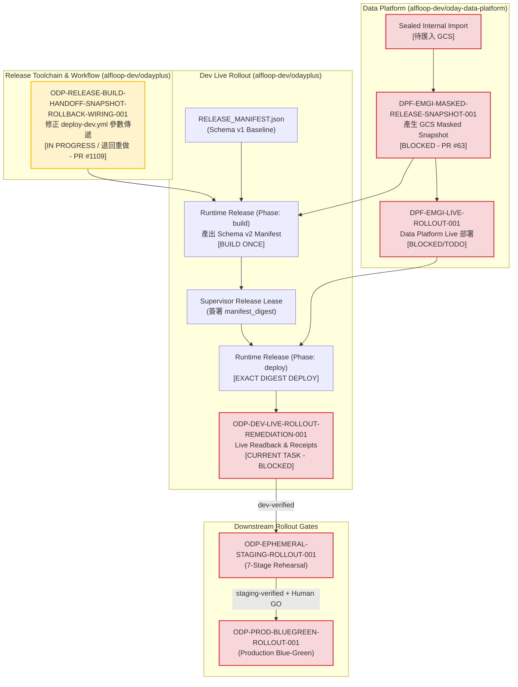

# ODP-DEV-LIVE-ROLLOUT-REMEDIATION-001 阻塞診斷與驗證交接包

## 1. 身分、範圍與治理資訊

| 欄位 | 值 |
|---|---|
| **Sidecar Task ID** | `ODP-DEV-LIVE-ROLLOUT-REMEDIATIO-SIDECAR-7CC5581A` |
| **Parent Task ID** | `ODP-DEV-LIVE-ROLLOUT-REMEDIATION-001` |
| **Parent Task Title** | 以真實 artifact 完成 dev live rollout 並取代 false-done 前提 |
| **Helper Kind** | `blocked_task_diagnostics` |
| **Sidecar Owner / Reviewer** | `Antigravity5` / `Claude` |
| **Parent Owner / Reviewer** | `Antigravity3` / `Claude` |
| **Target Branch / Task Branch** | `dev` / `task/ODP-DEV-LIVE-ROLLOUT-REMEDIATIO-SIDECAR-7CC5581A` |
| **Parent Task Status** | `blocked`（Phase: Wave 3 - Dev Live Rollout Remediation, Priority: P0） |
| **診斷日期 / Board 讀取時間** | `2026-09-01` / `2026-09-01T14:08:00Z` |
| **範圍界線** | 僅限 `support/sidecars/ODP-DEV-LIVE-ROLLOUT-REMEDIATION-001/ODP-DEV-LIVE-ROLLOUT-REMEDIATIO-SIDECAR-7CC5581A.md` 下的支援材料；不修改 L1 canonical platform documents、核心 contract 真相、runtime table 或 governance policy。 |

本 packet 依 task board、GitHub Actions 執行紀錄（Run #33509435127）、live readback 與既有 reviewer 紀錄整理。它是供 parent owner（`Antigravity3`）與 reviewer（`Claude`）判斷是否可解除阻塞的支援性材料，不是部署證明，也不會取代 parent task 的 canonical truth。

---

## 2. 結論摘要與 Blocker 診斷

Parent task `ODP-DEV-LIVE-ROLLOUT-REMEDIATION-001` 目前正確維持在 **`blocked` / `NO-GO`** 狀態。這項阻塞並非暫態 flake，而是由多層 fail-closed 治理機制作業所引發的實質阻擋：

1. **直接 Toolchain 執行阻擋（Deploy Dev Run #33509435127 Fail-Closed）**：
   在執行 `deploy-dev.yml` 的 `build` 階段時，E2E 部署健康預檢、GCP WIF 驗證、Docker 映像建置/推送以及 Cosign 簽署/CycloneDX SBOM 證明皆已順利完成；然而調用 `delivery_toolchain/release/build_release_handoff.py` 時，未傳入 Schema v2 所要求的 `--data-snapshot-*`（核准的 masked data snapshot）與 `--rollback-manifest`/`--rollback-release-file`（上一核准 release manifest），導致手握建置產物的 handoff 步驟依 Schema v2 規範 fail closed。
2. **Toolchain 修正任務重做中（`ODP-RELEASE-BUILD-HANDOFF-SNAPSHOT-ROLLBACK-WIRING-001` / PR #1109）**：
   為修正上述 workflow 呼叫參數與 handoff wiring 缺陷，原由 `Antigravity4` 開立獨立 remediation task 並提交 PR #1109。但在審查時發現 `--data-snapshot-file` 存在靜默覆蓋 approved snapshot exact binding 之缺陷（使 vars 覆蓋 dispatch inputs 破壞 fail closed 邊界），於 `13:50:42Z` 被 Reviewer（`Claude`）退回，隨後於 `13:52:19Z` 依 review churn 規則改派 `Claude2`（Reviewer: `Antigravity3`）重新於 `in_progress` 狀態實作中。尚未完成合規修正與合併至 `dev`。
3. **上游 Masked Data Snapshot 仍處於實質阻塞（`DPF-EMGI-MASKED-RELEASE-SNAPSHOT-001` in `alfloop-dev/oday-data-platform`）**：
   即使 PR #1109 合併，Schema v2 所需的 `data_snapshot` 亦不能使用 placeholder、合成資料或 schema v1 假資料。上游 `alfloop-dev/oday-data-platform` 的 `DPF-EMGI-MASKED-RELEASE-SNAPSHOT-001` 目前在 PR #63 中處於 `blocked`，等待於 `odayplus-runtime-20260825` 匯入經核准之 sealed internal import 以產生真實 GCS immutable snapshot object（含 exact generation/SHA/contract digest）。
4. **歷史 Release Manifest 為 Schema v1，無法直接作為 v2 Rollback 綁定來源**：
   Canonical repo 現存之 `docs/evidence/gates/RELEASE_MANIFEST.json`（candidate `ebc4fca5c2dd`）為 `schema_version: 1`，缺少 `data_snapshot` 與 `rollback_release` 結構。在正式發布 Schema v2 候選版本前，必須確保上一核准版本的 manifest 具備完整且可重算的 canonical digest。
5. **環境與網路邊界約束必須嚴格維持**：
   - `dev` 環境**僅限使用 Cloud Run 自動產生的服務網址**（`url_source: cloud_run_generated`），禁止建立自訂網域、DNS 或網域憑證。
   - 16 個外部資料 provider 在部署前後必須保持 `disabled`，provider credentials 不存在，public egress 維持 `default-deny`。
   - 所有產生的收據必須為 **secret-free** 並套用完整 redaction。

---

## 3. Parent Task 目標與架構邊界

### 3.1 驗收條件檢核清單（Acceptance Criteria）

Parent task `ODP-DEV-LIVE-ROLLOUT-REMEDIATION-001` 共有 10 項嚴格驗收條件：

| # | 驗收條款 | 目前狀態 | 診斷判定 |
|---|---|---|---|
| 1 | 驗證最新 authoritative manifest 之 candidate SHA、image digests、SBOM、Cosign 與 registry refs 均真實可解析 | PARTIAL | Run #33509435127 已產生真實 image 與簽章，但因 handoff 未完成尚未產出權威 Schema v2 manifest |
| 2 | 若 candidate 到 `origin/dev` 間含任何變更則建新 release 並重新 build once，不得沿用舊 digest | READY | 遵從單一建置原則；一旦 dev 有新 commit 即由 build phase 重新產出 |
| 3 | 以 signed Supervisor lease 僅執行既有 Runtime Release deploy phase，不得建立第二套 workflow | READY | 依循 `deploy-dev.yml` 單一管線，禁止 sidecar 或臨時腳本直接部署 |
| 4 | `odayplus-runtime-20260825` live readback 顯示 data platform 先部署且 oday-api/oday-web/migration/worker/scheduler 均存在並綁定 exact digests | BLOCKED | 等待 deploy phase 執行與 data platform 前置部署 |
| 5 | dev Web 僅使用 Cloud Run 自動產生網址，不建立 DNS、自訂網域或網域憑證 | READY | 架構規範明確固定，不使用自訂 domain |
| 6 | Cloud Run jobs one-shot、API/Web authenticated smoke、contract、provider-off 與 default-deny egress 均通過 | BLOCKED | 等待 deploy 執行後的現場 live smoke 與 contract readback |
| 7 | 16 個第三方來源保持 disabled 且 provider credentials 不存在 | READY | `ODP_EXTERNAL_PROVIDER_MODE=disabled` 且 boundary 測試 100% 通過 |
| 8 | 所有收據含真實 resource identity、Cloud Run URL、revision、execution、timestamp、candidate SHA 與 manifest digest，無 placeholder | BLOCKED | 待 live 部署完成後以 live readback 產生 |
| 9 | 歷史 `ODP-DEV-ROLLOUT-001` 收據保持不變，由新 evidence 明確標示已被 live reconciliation 推翻 | READY | 歷史目錄受 `forbidden_paths` 保護，嚴禁修改舊收據 |
| 10 | 若 workflow 或部署程式有缺陷則 fail closed 並另建獨立 remediation task，不得在 rollout task 內擴大修 code | SATISFIED | Antigravity3 正確回報 blocker 並退回，已開立 `ODP-RELEASE-BUILD-HANDOFF-SNAPSHOT-ROLLBACK-WIRING-001` |

### 3.2 權限與檔案路徑邊界（Owned vs Forbidden Paths）

- **Owned Paths**:
  - `docs/evidence/runtime/ODP-DEV-LIVE-ROLLOUT-REMEDIATION-001/`
- **Forbidden Paths**（嚴禁修改）:
  - `docs/evidence/runtime/ODP-DEV-ROLLOUT-001/`（歷史假收據保持唯讀，僅能被新收據推翻）
  - `.github/workflows/`（workflow 修正由獨立 remediation task 擁有）
  - `.orchestrator/`
  - `product_ops/deployment/`
  - `delivery_toolchain/release/`

---

## 4. 上游與相依任務狀態盤點

> **Live Task Board 讀取時間戳記**：`2026-09-01T14:08:00Z`（依據 canonical live status 查詢結果）

```
┌────────────────────────────────────────────────────────────────────────────────────────────────────────┐
│                                   UPSTREAM DEPENDENCY AUDIT MATRIX                                     │
├───────────────────────────────────────────────────────┬────────────┬─────────────┬─────────────────────┤
│ Task ID                                               │ Repo       │ Status      │ 影響與解除條件      │
├───────────────────────────────────────────────────────┼────────────┼─────────────┼─────────────────────┤
│ ODP-RELEASE-MANIFEST-LIVE-ARTIFACT-RECONCILE-001      │ odayplus   │ DONE (PR#1028)│ 已提供 candidate digest 綁定│
├───────────────────────────────────────────────────────┼────────────┼─────────────┼─────────────────────┤
│ ODP-RUNTIME-RELEASE-SINGLE-PATH-001                   │ odayplus   │ DONE (PR#1025)│ 已確立 build / deploy 兩階段 │
├───────────────────────────────────────────────────────┼────────────┼─────────────┼─────────────────────┤
│ ODP-GITHUB-GCP-ENV-BOOTSTRAP-001                      │ odayplus   │ DONE (PR#1015)│ GCP WIF 與 dev 環境變數已就緒│
├───────────────────────────────────────────────────────┼────────────┼─────────────┼─────────────────────┤
│ DPF-EMGI-LIVE-ROLLOUT-001                             │ data-plat  │ BLOCKED/TODO│ Data platform live 部署前置  │
├───────────────────────────────────────────────────────┼────────────┼─────────────┼─────────────────────┤
│ ODP-RELEASE-BUILD-HANDOFF-SNAPSHOT-ROLLBACK-WIRING-001│ odayplus   │ IN_PROGRESS │ 修正 workflow 參數傳遞 (PR#1109 退回重做中)│
├───────────────────────────────────────────────────────┼────────────┼─────────────┼─────────────────────┤
│ DPF-EMGI-MASKED-RELEASE-SNAPSHOT-001                  │ data-plat  │ BLOCKED     │ 提供真實 GCS masked snapshot │
├───────────────────────────────────────────────────────┼────────────┼─────────────┼─────────────────────┤
│ ODP-WEB-PASSWORD-FIRST-AUTH-CONTRACT-001              │ odayplus   │ DONE (PR#1097)│ 取代 OIDC 人工相依，以密碼登入 │
└───────────────────────────────────────────────────────┴────────────┴─────────────┴─────────────────────┘
```

### 4.1 各相依項詳細分析

1. **`ODP-RELEASE-BUILD-HANDOFF-SNAPSHOT-ROLLBACK-WIRING-001`**：
   - **負責人 / 審查者**：`Claude2` / `Antigravity3`（原 `Antigravity4` / `Claude` 因 2 次審查退回觸發 review churn 於 `13:52:19Z` 改派）。
   - **現狀**：狀態為 `in_progress`。PR #1109 原 head `338f8998a787dcfb72399f4020f43a46c228b374` 於 `13:50:42Z` 被退回。
   - **退回原因**：PR #1109 舊 head 存在 `--data-snapshot-file` 靜默覆蓋 `--data-snapshot-id/uri/content-sha` 的漏洞，使得 workflow vars 會覆蓋 dispatch inputs，造成 approved snapshot exact binding 可能被靜默取代，違反了 fail closed 邊界；另 `rollback_manifest` input 說明指向不存在檔案等問題。
   - **目標**：讓 `.github/workflows/deploy-dev.yml` 在 `build` 階段能正確傳入 approved masked snapshot 與 rollback release manifest 相關參數至 `build_release_handoff.py`，且在 snapshot 雙管道同時傳入衝突時嚴格 fail-closed 互斥拒絕，絕不允許靜默覆蓋。
   - **解除條件**：`Claude2` 完成互斥 fail-closed 等修復、通過 CI 與 contract 驗證、經 `Antigravity3` 審查通過並正式 merge 進 `dev`。

2. **`DPF-EMGI-MASKED-RELEASE-SNAPSHOT-001`**（在 `alfloop-dev/oday-data-platform`）：
   - **負責人**：`Antigravity`，審查者：`Claude`
   - **現狀**：PR #63，處於 `blocked`。
   - **核心瓶頸**：`odayplus-runtime-20260825` 專案中 4 個 source snapshot GCS bucket 尚無 raw object。在沒有經核准且具 provenance 的 sealed internal import 之前，嚴禁猜測 schema 或產生假資料。
   - **解除條件**：於 GCS 寫入 approved sealed internal import，透過 EMGI one-shot lane 執行 materialization，產生正式的 `consumer-snapshot-readback-receipt.json` 與 GCS snapshot artifact。

3. **`ODP-WEB-PASSWORD-FIRST-*` 系列已消除 OIDC Blocker**：
   - 經由 `ODP-WEB-PASSWORD-FIRST-AUTH-CONTRACT-001`（PR #1097）、`ODP-WEB-LOCAL-IDENTITY-CORE-001`（PR #1098）與 `ODP-WEB-PASSWORD-FIRST-LOGIN-001`（PR #1100），dev/local runtime 預設改採 password-first authentication，不再直接被 `HUMAN-GCP-WEB-OAUTH-CLIENTS-001` 的 OIDC secret 設定所硬性阻塞。

---

## 5. 核心失敗根本原因分析（Root Cause Analysis）

### 5.1 Run #33509435127 的斷點追蹤

在 `deploy-dev.yml` 執行時，其控制流如下：

```text
[Run 33509435127]
  ├── release_phase: Validate release phase inputs -> SUCCESS
  └── build: Build once and publish the immutable artifact handoff
        ├── Confirm dev-build environment bindings -> SUCCESS
        ├── Install uv & Python 3.12 -> SUCCESS
        ├── Secret Scan & SAST Scan -> SUCCESS
        ├── Generate SBOM -> SUCCESS
        ├── E2E deployment health proof -> SUCCESS
        ├── Authenticate to Google Cloud (WIF) -> SUCCESS
        ├── Build, push, Cosign sign, Cosign attest 4 images -> SUCCESS
        │     ├── api: asia-east1-docker.pkg.dev/.../oday-api@sha256:...
        │     ├── web: asia-east1-docker.pkg.dev/.../oday-web@sha256:...
        │     ├── worker: asia-east1-docker.pkg.dev/.../oday-worker@sha256:...
        │     └── scheduler: asia-east1-docker.pkg.dev/.../oday-scheduler@sha256:...
        └── Write the build-once artifact handoff (build_release_handoff.py) -> FAILED (Closed)
              └── Refusal:
                  - 缺少 masked data snapshot 參照；build 階段必須綁定本次核准的 masked snapshot。
                  - 缺少 rollback release 參照；build 階段必須綁定上一核准 release 與 snapshot pointer。
```

### 5.2 為什麼 Fail-Closed 是正確且必要的治理行為

`build_release_handoff.py`（§194-203）強制執行 Schema v2 規範：
```python
if schema_version >= 2:
    if data_snapshot is None:
        errors.append("缺少 masked data snapshot 參照；build 階段必須綁定本次核准的 masked snapshot。")
    if resolved_rollback_release is None:
        errors.append("缺少 rollback release 參照；build 階段必須綁定上一核准 release 與 snapshot pointer。")
```
如果允許在缺少 `data_snapshot` 或 `rollback_release` 的情況下產出 manifest，將會造成：
1. Deploy 階段無法驗證資料平台契約與 masked snapshot 的不可變性。
2. 後續發生異常時無法執行受治理的 snapshot rollback 與指標反轉。
3. 產生「假放行」的權威 manifest，破壞整個 release admission 的密碼學完整性。

因此，Antigravity3 拒絕降級為 Schema v1、拒絕填寫假 digest，並將任務狀態轉為 `blocked`，完全符合治理規範。

---

## 6. 相依性與 Blast Radius 架構圖



---

## 7. 解除阻塞執行協議（Unblocking Protocol）

當 PR #1109 合併且上游 masked snapshot 完成產出後，Parent Task Owner（`Antigravity3`）應依循以下六階段標準協議執行收尾，本 sidecar 不執行任何實際部署動作：

### Phase 1: 前置條件核對（Pre-Flight Check）
1. 確認 `ODP-RELEASE-BUILD-HANDOFF-SNAPSHOT-ROLLBACK-WIRING-001` 完成互斥 fail-closed 修復經審查通過，且 PR #1109 已合併至 `dev` tip。
2. 確認上游 `DPF-EMGI-MASKED-RELEASE-SNAPSHOT-001` 的 GCS snapshot URI、object generation 與 content SHA256 可公開解析。
3. 取得上一核准版本的完整 release manifest（Schema v2 相容）。

### Phase 2: 執行 Build Once 產出不可變 Artifacts
1. 觸發 `deploy-dev.yml`：
   ```bash
   gh workflow run deploy-dev.yml \
     -f phase=build \
     -f environment=dev \
     -f release_sha=<EXACT_40_CHAR_SHA> \
     -f task_id=ODP-DEV-LIVE-ROLLOUT-REMEDIATION-001
   ```
2. 驗證產出的 `runtime-release-images.json` 與 `RELEASE_MANIFEST.json`：
   - 包含 4 個 `@sha256:` immutable container images。
   - 包含 Cosign signature refs 與 CycloneDX SBOM attestation refs。
   - 包含 `data_snapshot` 與 `rollback_release` 完整欄位。
   - 計算並記錄產出的 `manifest_digest`。

### Phase 3: 簽發 Supervisor Release Lease
1. 以 Supervisor 授權私鑰簽發 release lease，綁定：
   - `action: deploy`
   - `environment: dev`
   - `sha: <EXACT_40_CHAR_SHA>`
   - `manifest_digest: <EXACT_MANIFEST_DIGEST>`
   - `task_id: ODP-DEV-LIVE-ROLLOUT-REMEDIATION-001`
2. 將 lease state 寫入 `ODP_RELEASE_LEASE_STATE_URI`（CAS store）。

### Phase 4: 執行 Deploy Phase
1. 帶入簽發之 lease 與 4 個映像 digest 觸發部署：
   ```bash
   gh workflow run deploy-dev.yml \
     -f phase=deploy \
     -f environment=dev \
     -f release_sha=<EXACT_40_CHAR_SHA> \
     -f task_id=ODP-DEV-LIVE-ROLLOUT-REMEDIATION-001 \
     -f release_lease=<BASE64_LEASE> \
     -f api_image=<EXACT_API_IMAGE> \
     -f web_image=<EXACT_WEB_IMAGE> \
     -f worker_image=<EXACT_WORKER_IMAGE> \
     -f scheduler_image=<EXACT_SCHEDULER_IMAGE>
   ```
2. 監控 Cloud Run migration job 執行、Cloud Run API/Web service 部署、Worker job 與 Scheduler trigger 更新。

### Phase 5: 現場 Live Readback 與驗證閘門
1. 取得 Cloud Run 自動產生之網址（如 `https://oday-web-...-de.a.run.app`）。
2. 執行 live authenticated smoke 與 health probe。
3. 驗證 16 個外部 provider 維持 `disabled`，確認無 external credentials。
4. 驗證 VPC connector 與 default-deny public egress。

### Phase 6: 收據產出與 Evidence Packaging
1. 將所有包含 execution id、Cloud Run URL、revision、timestamp 與 manifest digest 的 readback 收據寫入：
   `docs/evidence/runtime/ODP-DEV-LIVE-ROLLOUT-REMEDIATION-001/`
2. 確保收據內容 100% **secret-free** 並套用完整 redaction。
3. 產生與歷史 `ODP-DEV-ROLLOUT-001` 的比對說明，宣告舊收據已由 live readback 正式推翻。

---

## 8. Bounded Verification 紀錄

為確保本 sidecar 在產出診斷報告時未破壞 repository 本地契約、程式邊界或既有發布閘門，本 worktree 執行了以下有限且唯讀的驗證套件：

| 驗證項目 | 執行命令 | 執行結果 | 治理意涵 |
|---|---|---|---|
| **Release Toolchain & Manifest Suite** | `uv run --python 3.12 pytest tests/release/ -q` | `201 passed in 4.96s` | 驗證 `build_release_handoff.py`、`release_manifest.py`、admission 與 lease 驗證邏輯完整無損。 |
| **E2E Proof Checker & Ops Suite** | `uv run --python 3.12 pytest tests/e2e/test_remote_staging_proof_checker.py tests/ops/ -q` | `889 passed, 24 skipped in 143.20s` | 驗證 remote proof checker、Cloud Run live deployment 合約與 ops 工具鏈符合規範。 |
| **Code Boundary Conformance** | `python3 delivery_toolchain/governance/check_code_boundaries.py` | `Code boundary checks passed for 1026 files.` | 1026 個 Python 檔案 100% 符合系統邊界定義（未越界觸碰 canonical runtime）。 |
| **Config Wiring Integrity** | `python3 delivery_toolchain/governance/check_config_wiring.py` | `All 172 config keys are read by production code.` | 所有 172 項 production 設定鍵皆有明確讀取端點，無死設定。 |
| **External Data Boundary** | `python3 scripts/validate_external_data_boundary.py` | `contract: odayplus.legacy-external-data-disposition.v2`<br/>`classified: 2867, unclassified: 0`<br/>`external-data boundary: OK` | 2867 個檔案皆已明確分類，外部 provider 邊界完全封閉。 |
| **Release Gate Registry Audit** | `python3 delivery_toolchain/e2e/check_release_gate_registry.py` | `0/7 gates cleared`<br/>`RELEASE STATE: NO-GO` | 發布閘門維持 fail-closed，證明目前不可在無 live receipt 下冒進。 |

---

## 9. 建議事項（Actionable Recommendations）

1. **維持 Parent Task 之 `blocked` 狀態**：
   在 PR #1109 合併且上游 `DPF-EMGI-MASKED-RELEASE-SNAPSHOT-001` 提供真實 GCS snapshot 之前，`ODP-DEV-LIVE-ROLLOUT-REMEDIATION-001` 應維持 `blocked` / `NO-GO`。
2. **待 Toolchain Remediation 完成重做與審查（PR #1109）**：
   `ODP-RELEASE-BUILD-HANDOFF-SNAPSHOT-ROLLBACK-WIRING-001` 目前由 `Claude2` 針對 snapshot 參數互斥 fail closed 進行重做中。待 `Claude2` 提交修復後，由 Reviewer（`Antigravity3`）嚴格審查 snapshot binding 是否具備互斥防呆且無靜默覆蓋，確認通過並合併進 `dev`，以解除 workflow 層級的參數阻礙。嚴禁指示合併已被退回的舊 head `338f8998`。
3. **推進上游 Data Platform Sealed Import**：
   協同 `alfloop-dev/oday-data-platform` 匯入經核准之 sealed internal import，產生 Schema v2 所需的受治理 masked snapshot。
4. **禁止任何非標準部署路徑**：
   不得透過本機 gcloud、手動 Cloud Run 修改、placeholder digest 或第二套 workflow 繞過既有 `deploy-dev.yml` 管線。
5. **保持歷史檔案唯讀**：
   `docs/evidence/runtime/ODP-DEV-ROLLOUT-001/` 保持不變，待 live 部署完成後於新目錄產出推翻說明。
