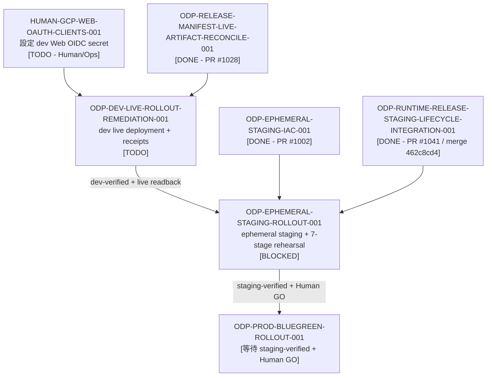

# ODP-EPHEMERAL-STAGING-ROLLOUT-001 阻塞診斷與驗證交接包

## 1. 身分、範圍與治理資訊

| 欄位 | 值 |
|---|---|
| **Sidecar Task ID** | `ODP-EPHEMERAL-STAGING-ROLLOUT-0-SIDECAR-C1E25549` |
| **Parent Task ID** | `ODP-EPHEMERAL-STAGING-ROLLOUT-001` |
| **Parent Task Title** | 建立 ephemeral staging 並完成全套 release rehearsal |
| **Helper Kind** | `blocked_task_diagnostics` |
| **Sidecar Owner / Reviewer** | `Antigravity4` / `Codex` |
| **Parent Owner / Reviewer** | `Codex` / `Claude` |
| **Target Branch / Task Branch** | `dev` / `task/ODP-EPHEMERAL-STAGING-ROLLOUT-0-SIDECAR-C1E25549` |
| **Parent Task Status** | `blocked`（`waiting_for: Human/Ops, dev live rollout remediation, dev live readback`） |
| **Parent Task Phase** | `Wave 3 - Staging Rollout` |
| **診斷日期** | `2026-08-28` |
| **範圍界線** | 僅限 `support/sidecars/ODP-EPHEMERAL-STAGING-ROLLOUT-001/` 下的支援材料；不修改 L1 canonical platform documents、核心 contract、runtime table 或 governance policy。 |

本 packet 依 task board、live readback 與既有 reviewer 紀錄整理。它是供 parent owner 與 reviewer 判斷是否可解除阻塞的支援性材料，不是部署證明，也不會取代 parent task 的 canonical truth。

## 2. 結論摘要

`ODP-EPHEMERAL-STAGING-ROLLOUT-001` 目前仍不可進入 staging admission。阻塞來自尚未完成的前置條件與尚缺的 live evidence：

1. `HUMAN-GCP-WEB-OAUTH-CLIENTS-001`：尚待 Human/Ops 在 GCP Secret Manager 設定 Web OIDC client secret。依 task board 與 live readback，dev 使用的 secret 名稱是 `oday-dev-web-oidc-client-secret`。
2. `ODP-DEV-LIVE-ROLLOUT-REMEDIATION-001`：尚待完成 dev live deployment，並產生可驗證的 live readback receipts。
3. `ODP-RUNTIME-RELEASE-STAGING-LIFECYCLE-INTEGRATION-001`：程式碼與 workflow 整合已完成（PR #1041，merge `462c8cd4`，已將 ephemeral staging lifecycle、收據路徑統一至 `RELEASE_RECEIPT_DIR` 與 contract tests 併入 `deploy-dev.yml`），但尚待實際 dev live rollout 產出真實環境的 live readback receipts 與 runtime evidence。

目前不能把 dry-run、placeholder digest、模擬輸出或未經遮罩的紀錄當成部署或 rehearsal 證據。所有 receipt 都必須為 secret-free，且套用 redaction；本 packet 只記錄可供核對的狀態與解除阻塞條件。

環境網域邊界也必須固定如下：

- `dev` 僅使用 Cloud Run 自動產生的服務網址，不建立或宣稱自訂網域。
- `staging` 使用 `console-staging.oday-plus.com.tw`。
- `prod` 使用 `console.oday-plus.com.tw`。

因此 parent task 應維持 `blocked` / `NO-GO`，直到上述前置條件完成、live receipts 可核對，且 `dev-verified` admission boundary 成立。

## 3. 證據基礎與 blocker 診斷

### 3.1 已滿足的前置條件
 
| Task | 狀態 | 證據與影響 |
|---|---|---|
| `ODP-EPHEMERAL-STAGING-IAC-001` | DONE，PR #1002 | Ephemeral staging Terraform module 與 lifecycle engine 已可供 parent task 使用。 |
| `ODP-RELEASE-MANIFEST-LIVE-ARTIFACT-RECONCILE-001` | DONE，PR #1028 | Candidate `ebc4fca5c2dd5871275aee39a18406dd67464f04` 的實際 Artifact Registry digests 與 Cosign/SBOM 證據已繫結。 |
| `ODP-RUNTIME-RELEASE-STAGING-LIFECYCLE-INTEGRATION-001` | DONE，PR #1041（merge `462c8cd4`） | Ephemeral staging lifecycle 與 workflow 已整合進唯一 Runtime Release（`.github/workflows/deploy-dev.yml`，收據路徑統一至 `RELEASE_RECEIPT_DIR`）；程式碼與 contract tests 整合已完備。 |

### 3.2 仍未滿足的直接 blocker

| Task | 負責方 | 狀態 | 解除條件 |
|---|---|---|---|
| `HUMAN-GCP-WEB-OAUTH-CLIENTS-001` | Human/Ops | TODO / 等待人工處理 | 在 `odayplus-runtime-20260825` 的 Secret Manager 建立 `oday-dev-web-oidc-client-secret`，並由安全 readback 證明存在；不得在 receipt 中寫入 secret 值。 |
| `ODP-DEV-LIVE-ROLLOUT-REMEDIATION-001` | Antigravity3 | TODO / 進行中 | 將 candidate `ebc4fca5c2dd` 部署至 dev、確認健康狀態與 contract readback，並提交 secret-free、已套用 redaction 的 live receipts（包含已整合之 runtime lifecycle readback）。 |

### 3.3 Live readback 與 Gate Registry 摘要

1. **Release Gate Registry 檢驗**（`python3 delivery_toolchain/e2e/check_release_gate_registry.py`）：
   - Release Candidate: `ebc4fca5c2dd5871275aee39a18406dd67464f04`
   - Admission boundary: `candidate-built / dev -> dev`
   - 決議狀態：`0/7 gates cleared, RELEASE STATE: NO-GO`
   - Gate 0 至 Gate 6 均處於 blocked/open 狀態，證明目前系統維持 fail-closed，未滿足 release gate 條件。
2. **Cloud Run 實體環境唯讀審計**：
   - GCP project `odayplus-runtime-20260825` 中，Cloud Run 只有 `oday-mlflow`；ODay Plus API、Web、worker、migration、scheduler workload 尚未形成可核對的 dev deployment。
   - 同一 project 的 staging 沒有 ephemeral ODay Plus workload；因此尚無可執行完整 rehearsal 的 staging baseline。
   - `odayplus-prod-20260826` 也只有 `oday-prod-mlflow`，尚未達到 production admission 條件。
   - Candidate image artifacts 已存在，但「artifact 可用」不等於「dev live deployment 已驗證」。
   - dev Web OIDC secret 的設定仍是必要的人工前置條件；readback 只可證明 secret 的存在與 metadata，不得揭露內容。

這些觀察足以支持 parent task 維持 fail-closed：在 dev live baseline 與 OIDC 設定完成前，不得建立 staging rehearsal 的成功證據。

## 4. 影響範圍與依賴順序

未完成的 dev live deployment 會阻擋 staging 建立、7-stage rehearsal、staging receipt 產生，以及後續 production blue-green rollout。這是依賴鏈的阻塞，不是 sidecar 可以透過文件或測試解除的問題。

## 5. 解除阻塞後的 bounded execution protocol

parent owner 在前置 blocker 完成並合併至 `dev` 後，依下列順序重新核對；本 sidecar 不執行這些部署動作：

1. **Dev admission pre-flight**：確認 dev workload、candidate SHA、exact image digests、健康狀態與 contract readback 一致；確認 receipts 為 secret-free 且已 redaction。
2. **Ephemeral staging 建立**：使用 release-scoped `release_id`、candidate SHA 與 manifest digest 啟動 lifecycle manager；確認資源隔離、TTL 與 Cloud Scheduler 初始狀態為 `PAUSED`。
3. **Exact-digest deployment**：只部署 `RELEASE_MANIFEST.json` 記載的 immutable digests；16 個外部資料 provider 維持 disabled，public egress 維持 default-deny。
4. **七階段 rehearsal**：依序驗證 migration compatibility、data snapshot materialization、authenticated API/Web smoke、worker idempotency、scheduler one-shot、backup/restore，以及 rollback pointer reversal。
5. **Receipt 與 teardown**：每一份 receipt 都必須 secret-free 並套用 redaction，且含命令、時間、資源識別與 digest 等可核對欄位；成功或失敗後依 TTL/cleanup policy 處理 ephemeral resources。

環境 URL 的核對規則不可混用：dev receipt 只記 Cloud Run 自動網址；staging receipt 記 `console-staging.oday-plus.com.tw`；prod receipt 記 `console.oday-plus.com.tw`。不得把 staging/prod 網域回填到 dev，也不得把任何 secret 值寫入 receipt。

## 6. Bounded verification 紀錄

以下是既有 task evidence 與本次執行的完整唯讀/測試驗證紀錄；本次執行未部署、未改變 product behavior，也未擴大測試範圍：

| 驗證項目 | 命令 | 執行結果 | 判讀 |
|---|---|---|---|
| Ephemeral staging lifecycle 與 IaC | `uv run --python 3.12 pytest tests/ops/test_ephemeral_staging_lifecycle.py infra/terraform/tests/test_ephemeral_staging.py -q` | `114 passed` | Lifecycle、TTL、命名、tfvars 與 Terraform 邊界可供 parent task 使用。 |
| Remote staging proof checker | `uv run --python 3.12 pytest tests/e2e/test_remote_staging_proof_checker.py -q` | `7 passed` | Proof checker 會核對 SHA、健康狀態與 receipt redaction。這不是 live deployment 證明。 |
| Release gate registry | `python3 delivery_toolchain/e2e/check_release_gate_registry.py` | `0/7 gates cleared`, `RELEASE STATE: NO-GO` | Registry 維持 fail-closed，不能把 candidate-built 視為 dev-verified。 |
| Configuration wiring | `python3 delivery_toolchain/governance/check_config_wiring.py` | `All 166 config keys are read by production code.` | 設定 wiring 檢查通過，但不代表 GCP secret 已設定。 |
| External data boundary | `python3 scripts/validate_external_data_boundary.py` | `external-data boundary: OK` | 外部資料邊界分類完整（2788 個檔案已分類）；rehearsal 仍須維持 provider disabled。 |
| Code boundary | `python3 delivery_toolchain/governance/check_code_boundaries.py` | `Code boundary checks passed for 983 files.` | 支援材料未越入 canonical runtime 或治理實作。 |

本次 sidecar 修改的 bounded verification 是文件級與唯讀測試檢查：確認 dev/staging/prod URL 邊界已明確、receipt 規則統一為 secret-free 且 redacted，並且變更僅限本指定 support artifact。沒有執行部署，也沒有宣稱 live rehearsal 已完成。

## 7. 交接決議與建議

1. Parent task 維持 `blocked` 與 `NO-GO`，等待 `HUMAN-GCP-WEB-OAUTH-CLIENTS-001` 與 `ODP-DEV-LIVE-ROLLOUT-REMEDIATION-001` 完成 dev live deployment 與 live readback receipts（`ODP-RUNTIME-RELEASE-STAGING-LIFECYCLE-INTEGRATION-001` 程式碼整合已由 PR #1041 / merge `462c8cd4` 完成，但仍缺 dev live runtime evidence）。
2. Reviewer 應以 live readback 核對 `oday-dev-web-oidc-client-secret` 的存在，不接受 secret 值、未遮罩輸出、placeholder digest 或模擬 deployment 作為證據。
3. Parent owner 只在 dev-verified 成立後開始 staging admission；staging/prod URL 不得回寫成 dev 的自訂網域。
4. 後續若阻塞條件改變，請由 parent owner 重新核對依賴與 receipts；本 sidecar 不吸收為 L1 canonical truth。
