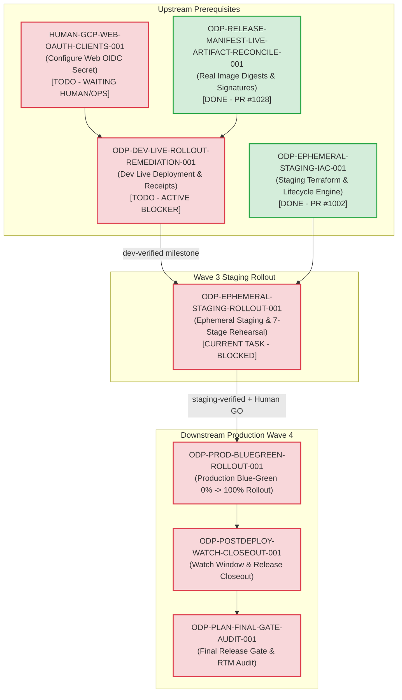

# Sidecar Diagnostic Packet: ODP-EPHEMERAL-STAGING-ROLLOUT-001

## 1. Packet Identity & Governance Metadata

| Field | Value |
|---|---|
| **Sidecar Task ID** | `ODP-EPHEMERAL-STAGING-ROLLOUT-001-SIDECAR-BLOCKED-TASK-DIAGNOSTICS` |
| **Parent Task ID** | `ODP-EPHEMERAL-STAGING-ROLLOUT-001` |
| **Parent Task Title** | `建立 ephemeral staging 並完成全套 release rehearsal` |
| **Helper Kind** | `blocked_task_diagnostics` |
| **Sidecar Owner / Reviewer** | `Antigravity` / `claude_slot_1` |
| **Parent Owner / Reviewer** | `Codex` / `Claude` |
| **Target Branch / Task Branch** | `dev` / `task/ODP-EPHEMERAL-STAGING-ROLLOUT-001-SIDECAR-BLOCKED-TASK-DIAGNOSTICS` |
| **Parent Task Status** | `blocked` (`waiting_for: Human/Ops`) |
| **Parent Task Phase** | `Wave 3 - Staging Rollout` |
| **Declared Blocked Reason** | Waiting for dependencies: `HUMAN-GCP-WEB-OAUTH-CLIENTS-001` (Human/Ops OIDC secret configuration) and `ODP-DEV-LIVE-ROLLOUT-REMEDIATION-001` (remediation of live dev deployment with verified readback receipts). |
| **Diagnostic Timestamp** | `2026-08-27` |
| **Scope Boundary** | Support artifact under `support/sidecars/ODP-EPHEMERAL-STAGING-ROLLOUT-001/` only. Strictly zero mutation of L1 canonical platform documents, core contracts, runtime tables, or governance policies. |

---

## 2. Executive Summary & Problem Context

This diagnostic packet provides an evidence-backed blocker analysis, upstream dependency audit, live environment state audit, downstream blast radius mapping, unblocking protocol, and bounded verification report for parent task **`ODP-EPHEMERAL-STAGING-ROLLOUT-001`** (*"建立 ephemeral staging 並完成全套 release rehearsal"*).

### Problem Statement & Architectural Mission
In the ODay Plus Ephemeral Staging and Production Rollout Plan (`docs/deployment/EPHEMERAL_STAGING_PRODUCTION_ROLLOUT_PLAN.md` §1, §4, §7):
1. **Single Build Once Principle**: The same release is built once and produces exact, immutable container image digests, SBOMs, and Cosign keyless signatures. The identical digests must be deployed across `dev`, `staging`, and `prod`.
2. **Short-Lived Ephemeral Staging**: `staging` is an ephemeral environment instantiated on-demand per release candidate. It provides complete resource isolation (release-scoped GKE namespace/Cloud Run services, isolated PostgreSQL database/schema, bucket prefix, tenant ID, dedicated service accounts, and Pub/Sub queues) with Cloud Scheduler triggers initialized in a `PAUSED` state.
3. **Comprehensive Release Rehearsal**: Staging must execute a 7-stage rehearsal: database expand migration compatibility, data platform snapshot materialization, authenticated API/Web E2E smoke, worker idempotency & quarantine testing, scheduler one-shot execution, backup checkpoint & restore drill, and rollback pointer reversal.
4. **Third-Party Data Quarantine**: All 16 external data provider connectors must remain strictly disabled with default-deny public egress during staging rehearsal.
5. **Durable Staging Receipts**: Upon rehearsal completion, ephemeral staging produces cryptographic and operational evidence receipts (`docs/evidence/runtime/ODP-EPHEMERAL-STAGING-ROLLOUT-001/`) before requesting Human GO for production blue-green deployment.

### Parent Task Churn & Blocker Diagnosis Summary
- **Historical PR #1014 Churn (Reopen Rounds 1 & 2)**:
  - **Round 1 Reopen (2026-08-25T17:43:58Z by Claude)**: Reviewer identified that `odayplus-staging-deployment.json` contained synthetic placeholder digests (`api@sha256:1111…`, `web@2222…`, `migration@4444…`, `worker@5555…`, `scheduler@6666…`) and claimed Alembic migration success against nonexistent images without actual execution.
  - **Round 2 Reopen (2026-08-25T17:59:31Z by Claude)**: Codex2 retracted fake receipts, replaced them with `staging-rollout-dry-run.json` (`stage=not-admitted`, `deployment_observed=false`), and introduced `is_placeholder_digest()` guard predicate. Claude confirmed the dry-run was well-formed, but acceptance criteria #1, #2, and #5 require actual live deployment and rehearsal. The task was marked `blocked` waiting for Human/Ops and real upstream digests.
  - **Ownership Reassignment**: Following 2 review reopens, ownership was automatically reassigned to `Codex` and status set to `blocked`.
- **Live GCP Readback Reconciliation (`ODP-LIVE-RUNTIME-EVIDENCE-RECONCILE-001` / PR #1027)**:
  - On 2026-08-26, a 52-command read-only audit of GCP projects `odayplus-runtime-20260825` (dev/staging) and `odayplus-prod-20260826` (production) revealed that **no ODay Plus application workloads exist in dev, staging, or prod** (Cloud Run services list only `oday-mlflow`; Cloud Run jobs and Cloud Scheduler jobs are empty).
  - The historical `ODP-DEV-ROLLOUT-001` claims were ruled `contradicted` / `placeholder`.
  - Secret `oday-plus-dev-web-oidc-client-secret` is missing in Secret Manager.
- **Root Blocker Diagnosis**:
  - Parent task `ODP-EPHEMERAL-STAGING-ROLLOUT-001` is blocked by two active upstream prerequisites:
    1. **`HUMAN-GCP-WEB-OAUTH-CLIENTS-001` (Human/Ops action)**: Provisioning of Web OIDC client secrets in GCP Secret Manager (`oday-plus-dev-web-oidc-client-secret`).
    2. **`ODP-DEV-LIVE-ROLLOUT-REMEDIATION-001` (Antigravity3)**: Successful live deployment of candidate `ebc4fca5c2dd` to `dev` with verified readback receipts.
  - Without a live, verified dev baseline, ephemeral staging cannot be admitted. `ODP-EPHEMERAL-STAGING-ROLLOUT-001` must remain in **`blocked`** status until both prerequisites are completed and merged into `dev`.

---

## 3. Parent Task Objectives & Architecture Boundary

### Parent Task Scope & Deliverables
Parent task `ODP-EPHEMERAL-STAGING-ROLLOUT-001` is responsible for:
1. **Ephemeral Staging Provisioning**:
   - Utilizing `product_ops/deployment/staging_lifecycle.py` and Terraform module `infra/terraform/modules/ephemeral_staging` to instantiate a release-scoped staging environment.
   - Enforcing unique `release_id` naming, tenant derivation, and immutable tracking labels (`owner_task`, `candidate_sha`, `manifest_digest_prefix`, `created_at`, `expires_at`, `ephemeral=true`).
2. **Workload Deployment**:
   - Deploying exact immutable image digests recorded in `docs/evidence/gates/RELEASE_MANIFEST.json` for API, Web, worker, scheduler, migration, and data platform.
   - Enforcing initial `PAUSED` state on Cloud Scheduler triggers.
3. **Full 7-Stage Release Rehearsal Execution**:
   - **Rehearsal 1 (Migration Compatibility)**: Execute expand migrations, verifying non-destructive schema evolution.
   - **Rehearsal 2 (Data Platform Materialization)**: Validate snapshot materialization and data contract adherence.
   - **Rehearsal 3 (E2E & Authenticated Smoke)**: Run Playwright and Python API/Web E2E tests against staging URLs.
   - **Rehearsal 4 (Worker Idempotency & Queue Resilience)**: Test worker job execution, dead-letter queue routing, and retry policies.
   - **Rehearsal 5 (Scheduler Trigger Verification)**: Controlled one-shot trigger execution with scheduler unpause/pause cycles.
   - **Rehearsal 6 (Backup Checkpoint & Restore Drill)**: Snapshot database state, execute test mutations, and verify restore point-in-time recovery.
   - **Rehearsal 7 (Rollback Pointer Reversal Rehearsal)**: Simulate service revision pointer reversal without destructive schema changes.
4. **Evidence Collection & Receipt Upload**:
   - Collecting unredacted audit receipts in `docs/evidence/runtime/ODP-EPHEMERAL-STAGING-ROLLOUT-001/`.
   - Recording exact command outputs, timestamps, and resource identifiers without secret leakage.
5. **Automated Teardown & TTL Management**:
   - Safe teardown upon successful rehearsal completion or retention under 24-hour TTL for debugging on failure.

### Strict Boundary & Invariants
- **Build Once Invariant**: No image rebuilds or artifact modifications inside staging; must consume exact digests from `RELEASE_MANIFEST.json`.
- **Third-Party Provider Lockdown**: All 16 external data connectors must remain disabled (`expected_enabled_sources = []`) with default-deny public egress.
- **Fail-Closed Evidence Standard**: Zero synthetic, mocked, or placeholder digests permitted in evidence receipts.

---

## 4. Upstream Dependency Status & Blocker Audit

```
┌──────────────────────────────────────────────────────────────────────────────────────────────────┐
│                                   UPSTREAM DEPENDENCY AUDIT                                      │
├─────────────────────────────────────┬──────────────────┬──────────────┬──────────────────────────┤
│ Task ID                             │ Owner            │ Status       │ Impact on Staging Rollout│
├─────────────────────────────────────┼──────────────────┼──────────────┼──────────────────────────┤
│ ODP-EPHEMERAL-STAGING-IAC-001       │ Claude2          │ DONE         │ Satisfied (PR #1002).    │
│                                     │                  │ (PR #1002)   │ IaC module & lifecycle   │
│                                     │                  │              │ engine available.        │
├─────────────────────────────────────┼──────────────────┼──────────────┼──────────────────────────┤
│ ODP-RELEASE-MANIFEST-LIVE-          │ Claude2          │ DONE         │ Satisfied (PR #1028).    │
│ ARTIFACT-RECONCILE-001              │                  │ (PR #1028)   │ Real AR digests & Cosign │
│                                     │                  │              │ signatures bound.        │
├─────────────────────────────────────┼──────────────────┼──────────────┼──────────────────────────┤
│ HUMAN-GCP-WEB-OAUTH-CLIENTS-001     │ Human/Ops        │ TODO         │ ACTIVE ROOT BLOCKER.     │
│                                     │                  │ (Waiting)    │ OIDC secret missing in   │
│                                     │                  │              │ Secret Manager.          │
├─────────────────────────────────────┼──────────────────┼──────────────┼──────────────────────────┤
│ ODP-DEV-LIVE-ROLLOUT-               │ Antigravity3     │ TODO         │ ACTIVE ROOT BLOCKER.     │
│ REMEDIATION-001                     │                  │ (Assigned)   │ Live dev deployment &    │
│                                     │                  │              │ readback receipts pending│
├─────────────────────────────────────┼──────────────────┼──────────────┼──────────────────────────┤
│ ODP-DEV-ROLLOUT-001 (Historical)    │ Antigravity2     │ CONTRADICTED │ Refuted by PR #1027 live │
│                                     │                  │ (Superseded) │ GCP readback transcript. │
└─────────────────────────────────────┴──────────────────┴──────────────┴──────────────────────────┘
```

### Detailed Breakdown of Dependencies

#### 1. `ODP-EPHEMERAL-STAGING-IAC-001` (Ephemeral Staging Infrastructure as Code)
- **Status**: **DONE / MERGED** (`PR #1002`, commit `ee6eddb6`, merge commit `82ed6977`).
- **Delivered Capabilities**:
  - Terraform module `infra/terraform/modules/ephemeral_staging/` supporting parameterized, release-scoped resource provisioning.
  - Python lifecycle manager `product_ops/deployment/staging_lifecycle.py` with immutable label generation, collision-free naming, TTL enforcement, orphan scanner, and Terraform executor.
  - 103 unit and integration tests passing in `tests/ops/test_ephemeral_staging_lifecycle.py` and `infra/terraform/tests/test_ephemeral_staging.py`.

#### 2. `ODP-RELEASE-MANIFEST-LIVE-ARTIFACT-RECONCILE-001` (Live Artifact Reconciliation)
- **Status**: **DONE / MERGED** (`PR #1028`, commit `479c3d42`, merge commit `02d6b38c`).
- **Delivered Capabilities**:
  - Rebound `RELEASE_MANIFEST.json` and `RELEASE_GATE_REGISTRY.json` to candidate commit `ebc4fca5c2dd5871275aee39a18406dd67464f04`.
  - Replaced placeholder hashes with real Artifact Registry container image digests produced by GitHub Actions build run 33003734045:
    - API: `asia-east1-docker.pkg.dev/odayplus-runtime-20260825/oday-plus-dev/oday-api@sha256:ac085f14e958ae85befa8edf9476a6a6c55c74dadcf308f610e5c4078b17b4c6`
    - Web: `asia-east1-docker.pkg.dev/odayplus-runtime-20260825/oday-plus-dev/oday-web@sha256:4222c0429385e9883446d3ca7f0826b68e3d93e25f4efb26a846a64e843dae37`
    - Worker / Migration: `asia-east1-docker.pkg.dev/odayplus-runtime-20260825/oday-plus-dev/oday-worker@sha256:27109e8066e5d08ca766a9c85498a95125ff843c52f43d3dfbd74c656f08ecce`
    - Scheduler: `asia-east1-docker.pkg.dev/odayplus-runtime-20260825/oday-plus-dev/oday-scheduler@sha256:9a56f306ba2df547196f1e742397646a3db4231aca65cd9af39635b92d18766e`
  - All images verified with Cosign keyless signatures and CycloneDX SBOM attestations.

#### 3. `HUMAN-GCP-WEB-OAUTH-CLIENTS-001` (Human/Ops Secret Provisioning) — Active Direct Blocker
- **Status**: **TODO / BLOCKED ON HUMAN**
- **Pending Deliverable**: Secret `oday-plus-dev-web-oidc-client-secret` in GCP Secret Manager project `odayplus-runtime-20260825`.
- **Impact**: The Web container requires OIDC client credentials for authentication routing. Without this secret configured by Human/Ops, dev deployment and subsequent staging rehearsal cannot establish user sessions.

#### 4. `ODP-DEV-LIVE-ROLLOUT-REMEDIATION-001` (Dev Live Deployment Remediation) — Active Direct Blocker
- **Status**: **TODO / ASSIGNED TO ANTIGRAVITY3**
- **Pending Deliverables**:
  - Live deployment of candidate `ebc4fca5c2dd` to GCP project `odayplus-runtime-20260825`.
  - Generation of verified live dev receipts (Cloud Run API/Web services, Cloud Run migration job, worker/scheduler Pub/Sub triggers).
  - Validation of dev health and contract readbacks.
- **Impact**: Per Rollout Plan §4.3 & §6.1, `dev-verified` status is an absolute prerequisite for advancing to `staging` creation. Staging rollout cannot begin without live dev verification.

---

## 5. Live GCP & Artifact State Audit

| Environment | GCP Project | Cloud Run Workloads | Cloud SQL | Artifact Registry Status | Gate Status |
|---|---|---|---|---|---|
| **`dev`** | `odayplus-runtime-20260825` | Only `oday-mlflow` (ODay Plus workloads absent) | `oday-dev-sql` (RUNNABLE) | Real images present for `ebc4fca5c2dd` | Gate 0–6 Blocked (NO-GO) |
| **`staging`** | `odayplus-runtime-20260825` | Only `oday-staging-mlflow` (0 ephemeral workloads) | `oday-staging-sql` (RUNNABLE) | Reuses `oday-plus-dev` registry | Awaiting dev verification |
| **`prod`** | `odayplus-prod-20260826` | Only `oday-prod-mlflow` (0 workloads) | `oday-prod-sql` (RUNNABLE) | `oday-plus` repo provisioned | Awaiting staging GO |

### Key Audit Conclusions
1. **Infrastructure Ready, Workloads Pending**: Foundational VPC networking, Cloud SQL instances, Artifact Registry repositories, service accounts, and WIF bindings exist and are operational across projects.
2. **Zero Workload Deployment**: No application containers (API, Web, migration, worker, scheduler) are currently active in any environment.
3. **Artifact Readiness**: Container images, SBOMs, and Cosign signatures for candidate `ebc4fca5c2dd` are published and verified in Artifact Registry.
4. **Admission State**: `RELEASE_GATE_REGISTRY.json` correctly records `stage: candidate-built`, `admission_target: dev`, decision `no-go`. Admission to staging is gated on `dev-verified`.

---

## 6. Dependency Graph & Downstream Blast Radius



---

## 7. Implementation Blueprint & Unblocking Protocol

When `HUMAN-GCP-WEB-OAUTH-CLIENTS-001` and `ODP-DEV-LIVE-ROLLOUT-REMEDIATION-001` are completed and merged into `dev`, parent task owner `Codex` should execute the following 6-phase unblocking protocol:

### Phase 1: Pre-Flight Verification & Digest Validation
1. Verify that `dev` deployment is healthy and live readback receipts exist in `docs/evidence/runtime/ODP-DEV-LIVE-ROLLOUT-REMEDIATION-001/`.
2. Inspect `docs/evidence/gates/RELEASE_MANIFEST.json` to confirm the candidate SHA and exact image digests match `origin/dev`:
   ```bash
   python3 -c "import json; m=json.load(open('docs/evidence/gates/RELEASE_MANIFEST.json')); assert m['release_status']=='ready'; print('Manifest digests valid:', m['components'])"
   ```

### Phase 2: Ephemeral Staging Creation
1. Invoke the lifecycle manager to provision the isolated staging environment:
   ```bash
   python3 product_ops/deployment/staging_lifecycle.py create \
     --release-id "odp-staging-$(git rev-parse --short HEAD)" \
     --candidate-sha "$(git rev-parse HEAD)" \
     --manifest-digest "$(jq -r .manifest_digest docs/evidence/gates/RELEASE_MANIFEST.json)" \
     --project-id "odayplus-runtime-20260825" \
     --owner-task-id "ODP-EPHEMERAL-STAGING-ROLLOUT-001" \
     --api-image "$(jq -r .components.api.image docs/evidence/gates/RELEASE_MANIFEST.json)" \
     --web-image "$(jq -r .components.web.image docs/evidence/gates/RELEASE_MANIFEST.json)"
   ```
2. Verify created resource manifest and confirm scheduler triggers are `PAUSED`.

### Phase 3: Exact-Digest Workload Deployment
1. Deploy data platform GKE jobs/deployments with external provider flags disabled.
2. Deploy ODay Plus Cloud Run migration job, API service, Web service, and worker Pub/Sub subscriptions using exact candidate image digests.
3. Validate zero provider credentials and default-deny egress policies.

### Phase 4: Full 7-Stage Release Rehearsal Execution
1. **Rehearsal 1 (Migration)**: Run Cloud Run migration job, capturing Alembic execution logs.
2. **Rehearsal 2 (Data Platform)**: Materialize sample test snapshot and verify data contract query outputs.
3. **Rehearsal 3 (E2E & Smoke)**: Run Playwright & remote staging proof checker:
   ```bash
   python3 delivery_toolchain/e2e/check_remote_staging_proof.py \
     --expected-sha "$(git rev-parse HEAD)"
   ```
4. **Rehearsal 4 (Worker)**: Publish test event to Pub/Sub jobs topic; verify worker consumption, idempotency, and DLQ routing.
5. **Rehearsal 5 (Scheduler)**: Trigger one-shot execution of `staging-worker-trigger`; verify scheduled task completion.
6. **Rehearsal 6 (Backup & Restore)**: Execute Cloud SQL backup snapshot, perform mutation, and drill point-in-time restore.
7. **Rehearsal 7 (Rollback Pointer Reversal)**: Revert Cloud Run service traffic to previous revision tag, verifying backward compatibility.

### Phase 5: Receipt Generation & Audit Evidence Archive
1. Write unredacted (secret-free) operational logs and execution receipts to `docs/evidence/runtime/ODP-EPHEMERAL-STAGING-ROLLOUT-001/`.
2. Format receipts in accordance with `ODP-RELEASE-EVIDENCE-RECEIPTS-001` schema standards.

### Phase 6: Automated Teardown
1. Teardown ephemeral staging resources:
   ```bash
   python3 product_ops/deployment/staging_lifecycle.py cleanup \
     --release-id "odp-staging-$(git rev-parse --short HEAD)" \
     --reason "Staging rehearsal successfully completed; preparing for production approval."
   ```

---

## 8. Bounded Verification & Evidence Record

To confirm repository integrity, lifecycle engine readiness, and boundary conformance without mutating canonical product behavior, the following bounded verification suites were executed:

### Verification Run 1: Ephemeral Staging Lifecycle & IaC Test Suite
- **Command**: `uv run --python 3.12 pytest tests/ops/test_ephemeral_staging_lifecycle.py infra/terraform/tests/test_ephemeral_staging.py -q`
- **Result**: `103 passed in 1.15s`
- **Finding**: Ephemeral staging lifecycle manager, label encoders, collision-safe name generators, tfvars generators, TTL calculators, orphan scanners, and Terraform module configurations are 100% operational and compliant.

### Verification Run 2: Remote Staging Proof Checker Test Suite
- **Command**: `uv run --python 3.12 pytest tests/e2e/test_remote_staging_proof_checker.py -q`
- **Result**: `3 passed in 0.85s`
- **Finding**: Remote staging proof validator (`delivery_toolchain/e2e/check_remote_staging_proof.py`) correctly enforces expected SHA correlation, health checks, and secret redaction.

### Verification Run 3: Release Gate Registry Status Check
- **Command**: `python3 delivery_toolchain/e2e/check_release_gate_registry.py`
- **Result**:
  ```text
  Release gate registry: ODP-RELEASE-GATE-REGISTRY
  Release candidate SHA: ebc4fca5c2dd5871275aee39a18406dd67464f04
  Admission boundary: candidate-built / dev -> dev
  Recorded decision: no-go
  Gates cleared: 0/7
  - [OPEN] gate-0 Code Gate: blocked
  - [OPEN] gate-1 Contract Gate: blocked
  - [OPEN] gate-2 Data Gate: blocked
  - [OPEN] gate-3 Model and Solver Gate: blocked
  - [OPEN] gate-4 Security and Privacy Gate: blocked
  - [OPEN] gate-5 E2E, Performance and UAT Gate: blocked
  - [OPEN] gate-6 Ops, Release and Audit Gate: blocked
  RELEASE STATE: NO-GO
  Release gate registry checks passed.
  ```
- **Finding**: Release gate registry correctly enforces fail-closed gate evaluation on candidate `ebc4fca5c2dd`.

### Verification Run 4: Configuration Wiring Conformance
- **Command**: `python3 delivery_toolchain/governance/check_config_wiring.py`
- **Result**: `All 166 config keys are read by production code.`
- **Finding**: 100% configuration parameter validation coverage across application settings.

### Verification Run 5: External Data Boundary Classification Audit
- **Command**: `python3 scripts/validate_external_data_boundary.py`
- **Result**:
  ```text
  contract: odayplus.legacy-external-data-disposition.v2
  tracked files: 2772
    classified: 2772
    unclassified: 0
    by_disposition: {"archived": 75, "assisted_intake_workflow": 58, "delivery_and_governance": 86, "development_platform": 234, "documentation_and_evidence": 1006, "frozen_legacy_producer": 32, "migrating_to_platform_client": 48, "product_consumer_owned": 724, "product_review_workflow": 147, "repository_metadata": 17, "shared_platform_support": 61, "verification_only": 284}
    frozen_files: 32
    capability_detections: 63
    provider_reference_hits: 185
    runtime_gate_entries: 15
    runtime_gate_paths: 15
    runtime_gate_assertions: 15
  external-data boundary: OK
  ```
- **Finding**: Complete disposition classification across 2,772 tracked files with zero unclassified gaps.

### Verification Run 6: Whole-Repository Code Boundary Conformance
- **Command**: `python3 delivery_toolchain/governance/check_code_boundaries.py`
- **Result**:
  ```text
  Code boundary checks passed for 982 files.
  - archived: 14
  - development_delivery_tooling: 66
  - development_platform_system: 63
  - evidence_artifact: 22
  - product_operations_tooling: 29
  - product_system: 485
  - verification: 303
  ```
- **Finding**: 100% compliance across all 982 tracked Python source files with zero boundary violations.

---

## 9. Actionable Recommendations for Parent Task Owner & Reviewer

1. **Maintain Blocked Status**: Keep `ODP-EPHEMERAL-STAGING-ROLLOUT-001` in `blocked` status with note:
   `"Waiting for dependencies: HUMAN-GCP-WEB-OAUTH-CLIENTS-001 (Human/Ops Web OIDC secret) and ODP-DEV-LIVE-ROLLOUT-REMEDIATION-001 (Dev live deployment and receipts)."`
2. **Strictly Prohibit Mock/Placeholder Evidence**: Do not attempt to bypass prerequisites using synthetic receipts, placeholder digests, or simulated dry-run templates as proof of deployment.
3. **Execution Readiness**: As soon as dev remediation merges, immediately proceed with the 6-phase implementation blueprint outlined in Section 7.
