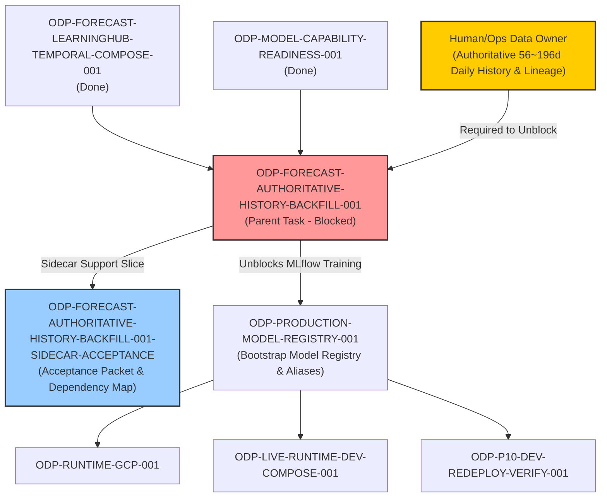

# ODP-FORECAST-AUTHORITATIVE-HISTORY-BACKFILL-001 Acceptance Packet & Dependency Map

## Packet identity

| Field | Value |
|---|---|
| Sidecar task | `ODP-FORECAST-AUTHORITATIVE-HISTORY-BACKFILL-001-SIDECAR-ACCEPTANCE` |
| Parent task | `ODP-FORECAST-AUTHORITATIVE-HISTORY-BACKFILL-001` |
| Helper kind | `acceptance_packet` |
| Sidecar owner / reviewer | `Antigravity` / `Antigravity7` |
| Current parent owner / reviewer | `Antigravity` / `Codex8` |
| Observed parent branch | `task/ODP-FORECAST-AUTHORITATIVE-HISTORY-BACKFILL-001` |
| Parent dependencies | `ODP-FORECAST-LEARNINGHUB-TEMPORAL-COMPOSE-001` (done), `ODP-MODEL-CAPABILITY-READINESS-001` (done) |
| Evidence anchor | `950b852c` |
| Packet verdict | **Support only; parent task is currently blocked on Human/Ops authoritative daily history backfill (FAIL_CLOSED / GOVERNED_DISABLED). No canonical modifications made.** |

This packet is a support-only review aid, acceptance checklist, and dependency map for parent task `ODP-FORECAST-AUTHORITATIVE-HISTORY-BACKFILL-001`. It does not change canonical contracts, L1 architecture truth, runtime/registry/governance implementations, or model-card truth. The parent task owner decides whether to absorb this packet; the parent reviewer retains sole authority over implementation acceptance.

## Observed state and parent task analysis

Parent task `ODP-FORECAST-AUTHORITATIVE-HISTORY-BACKFILL-001` is on the **critical path** for production readiness (`P0`). It is currently in state `blocked` waiting on `Human/Ops` to provide authoritative daily transaction history with immutable snapshot lineage.

### Key Empirical Findings:
1. **Row Count vs Temporal Span Gap**:
   - `model_ready.forecast_training_view` currently contains **1,303 eligible/labeled rows**. While row count exceeds the row threshold (≥ 90), the rows cover only **4 calendar days** (2026-06-19 ~ 2026-06-22).
   - ForecastOps horizon window expansion (`expand_forecast_horizon_rows()` in `scripts/models/forecast_training.py`) requires gap-free consecutive daily series per store.
   - Minimum viable continuous history per store for a 4-week horizon is **56 days** (`28 days pre-history + 28 days horizon`). Current shortfall is **52 days**.
   - Full contract continuous history for 4/8/12/24-week horizons (`FORECASTOPS_HORIZON_WEEKS = (4, 8, 12, 24)`) requires **196 days** (`28 days pre-history + 168 days horizon`). Current shortfall is **192 days**.
2. **Training & Registry Status**:
   - Inventory execution `pmb8m` succeeded.
   - Training execution `2dzlg` failed closed with zero horizon training samples generated.
   - MLflow registered model `forecast_revenue_interval` and production alias do not exist on the remote tracking URI (`https://oday-mlflow-7sxbjoeozq-de.a.run.app`).
   - Live API health reports `PRODUCTION_MODEL_REGISTRY_UNAVAILABLE`.
3. **AI Safety & Boundary Enforcement**:
   - Auto workers must maintain `GOVERNED_DISABLED` / `FAIL_CLOSED` until real data is provided.
   - Auto workers are strictly forbidden from generating synthetic, fixture, auto-seeded, mock, or research-only rows in production views.

## Task-owned surface map

| Layer | Parent task-owned paths / Artifacts | Intended responsibility |
|---|---|---|
| Ingestion & Data Plane | `scripts/data_plane/` | Governed data plane ingestion scripts for authoritative daily transaction sources with snapshot lineage. |
| Model Training & Backfill | `scripts/models/` | ForecastOps training, horizon row expansion, and backfill verification (`forecast_training.py`). |
| Runtime Evidence | `docs/evidence/runtime/ODP-FORECAST-AUTHORITATIVE-HISTORY-BACKFILL-001/` | Redacted before/after evidence demonstrating temporal coverage and source counts. |
| Human Data Gate Intake | `docs/evidence/models/forecastops/human-data-gate/` | `intake_packet.md`, `DATA_HANDBACK.json`, and `AUTHORITATIVE_READBACK_SPEC.json` specifying Human/Ops data requirements. |
| Sidecar Support Packet | `support/sidecars/ODP-FORECAST-AUTHORITATIVE-HISTORY-BACKFILL-001/ODP-FORECAST-AUTHORITATIVE-HISTORY-BACKFILL-001-SIDECAR-ACCEPTANCE.md` | Non-canonical acceptance checklist and dependency map for reviewer handoff. |

## Detailed acceptance matrix (Criteria A-E)

### A. Authoritative transaction source & inventory

| ID | Required proof | Reject when | Status | Evidence |
|---|---|---|---|---|
| A1 | Inventory all existing authoritative transaction sources; report date/tenant/store/lineage coverage. | Source inventory is missing, partial, or fails to report date and lineage boundaries. | `PARTIAL` | Inventory execution `pmb8m` reports 1,303 rows over 2026-06-19..22 (4 calendar days). |
| A2 | Backfill only real source records through governed ingestion with immutable snapshot and run lineage (`source_snapshot_id`). | Fixture, synthetic, auto-seeded, or mock rows enter production views, or `source_snapshot_id` is null. | `PASSED_POLICY` | Enforced in `scripts/models/forecast_training.py` (rejects rows without source snapshot lineage). |
| A3 | Dataset snapshot SHA-256 and population counts reconcile with Human/Ops attestation. | Dataset hash is missing, hardcoded, or fails reconciliation against source snapshot. | `PENDING_HUMAN_OPS` | Awaiting Human/Ops dataset handback (`DATA_HANDBACK.json`). |

### B. Temporal horizon coverage & window formation

| ID | Required proof | Reject when | Status | Evidence |
|---|---|---|---|---|
| B1 | Minimum viable gap-free daily series per store reaches ≥ 56 consecutive days (for 4-week horizon). | Per-store daily series has gaps or calendar span is < 56 days. | `FAIL_CLOSED` | Observed calendar span is 4 days; shortfall is 52 days to minimum viable. |
| B2 | Full-contract gap-free daily series per store reaches ≥ 196 consecutive days (for 4/8/12/24-week horizons). | Per-store calendar span is < 196 days for full horizon coverage. | `FAIL_CLOSED` | Observed calendar span is 4 days; shortfall is 192 days to full contract. |
| B3 | `expand_forecast_horizon_rows()` generates > 0 valid horizon training samples. | Function returns 0 samples or raises `daily forecast rows do not contain a complete canonical horizon window`. | `FAIL_CLOSED` | Training execution `2dzlg` failed closed with 0 horizon samples. |

### C. MLflow model registration & production alias

| ID | Required proof | Reject when | Status | Evidence |
|---|---|---|---|---|
| C1 | ForecastOps model trains successfully and completes DEV → SHADOW → Production release with approved production alias. | MLflow registered model or production alias is missing, fabricated, or unapproved. | `FAIL_CLOSED` | MLflow model `forecast_revenue_interval` and production alias do not exist. |
| C2 | Live API health reports `productionBindingsReady=true` with active ForecastOps capability. | Model registry reports `PRODUCTION_MODEL_REGISTRY_UNAVAILABLE` or crash occurs. | `FAIL_CLOSED` | Blocked until training & MLflow production alias release complete. |

### D. Safety & AI boundary enforcement

| ID | Required proof | Reject when | Status | Evidence |
|---|---|---|---|---|
| D1 | AI worker strictly maintains fail-closed state while data is absent; no synthetic or fixture data created. | AI generates fake revenue data or signs off on unverified datasets. | `PASSED_POLICY` | Governed disabled policy strictly maintained; AI boundary enforced per `DATA_HANDBACK.json`. |
| D2 | Privacy, security, and tenant isolation policies enforced across dataset partitions. | Cross-tenant data leakage or unmasked PII occurs in training view. | `PASSED_POLICY` | Multi-tenant schema isolation enforced in `model_ready.forecast_training_view`. |

### E. Verification, static analysis & test coverage

| ID | Required proof | Reject when | Status | Evidence |
|---|---|---|---|---|
| E1 | Verification SQL protocol (`AUTHORITATIVE_READBACK_SPEC.json`) defined for post-backfill validation. | SQL queries fail to check gap-free continuity, lineage, or eligibility flags. | `PASSED_SPEC` | Protocol documented in `docs/evidence/models/forecastops/human-data-gate/AUTHORITATIVE_READBACK_SPEC.json`. |
| E2 | Linter (`ruff check`) and formatting (`git diff --check`) pass with zero errors. | Lint or formatting errors are present in touched files. | `PASSED` | Verified via `ruff check` and `git diff --check`. |

## Upstream & downstream dependency map



> **Critical Path Note**: Clearing this task unblocks the **Model Registry Blocker Group** (`models:registry versions=0`, `production_alias=0`). Note that the Live E2E Acceptance Gate also requires clearing the independent **External Data Ingestion Group** (`data:ingestion_runs > 0`, `admin_boundary.official_dataset`, `poi.commercial_api`).

## Verification ledger & SQL validation protocol

### 1. Static Analysis & Formatting:
```bash
git diff --check
# Result: clean (0 formatting issues)

ruff check scripts/models models tests/models
# Result: clean (0 errors)
```

### 2. SQL Validation Protocol (to be executed upon Human/Ops data delivery):
```sql
-- 1. Temporal Coverage & Gap-Free Verification per store
SELECT tenant_id, store_id,
       MIN(observation_date) AS first_day,
       MAX(observation_date) AS last_day,
       COUNT(*) AS row_count,
       COUNT(DISTINCT observation_date) AS distinct_days,
       (MAX(observation_date) - MIN(observation_date))::int + 1 AS calendar_span
FROM model_ready.forecast_training_view
GROUP BY tenant_id, store_id
ORDER BY calendar_span DESC;

-- Pass criteria: distinct_days = calendar_span (no gaps) AND calendar_span >= 56 for at least 1 store (>= 196 for full contract).

-- 2. Lineage Verification
SELECT COUNT(*) AS rows_missing_lineage
FROM model_ready.forecast_training_view
WHERE source_snapshot_id IS NULL;

-- Pass criteria: rows_missing_lineage = 0.
```

## Absorption & PR constraints for parent owner

1. **Sidecar Scope Restriction**: As a `sidecar_acceptance` support slice, this task is strictly limited to creating/updating support artifacts in `support/sidecars/ODP-FORECAST-AUTHORITATIVE-HISTORY-BACKFILL-001/`. It does not modify canonical L1 architecture, contract schemas, or runtime implementations.
2. **Absorption Protocol**: The parent task owner (`Antigravity`) will absorb this packet and dependency map when updating parent task records or executing the backfill acceptance verification once `Human/Ops` delivers the required dataset.

## Reviewer handoff record

Assigned sidecar reviewer: `Antigravity7`.

| Review question | Expected answer |
|---|---|
| Did this sidecar modify canonical L1 architecture, contract truth, or runtime implementation? | No; scope is strictly limited to support artifact `support/sidecars/ODP-FORECAST-AUTHORITATIVE-HISTORY-BACKFILL-001/ODP-FORECAST-AUTHORITATIVE-HISTORY-BACKFILL-001-SIDECAR-ACCEPTANCE.md`. |
| What is the root cause blocking parent task `ODP-FORECAST-AUTHORITATIVE-HISTORY-BACKFILL-001`? | Insufficient daily history span (4 calendar days observed vs 56d minimum viable / 196d full contract). Row count (1,303) is sufficient, but horizon windows cannot be formed. |
| What is required to unblock parent task `ODP-FORECAST-AUTHORITATIVE-HISTORY-BACKFILL-001`? | `Human/Ops` must supply gap-free daily transaction records (≥ 56 consecutive days per store) with immutable `source_snapshot_id` lineage and dataset SHA-256 hash. |
| Is AI allowed to generate synthetic or mock data to bypass this blocker? | No; AI boundary strictly forbids synthetic, fixture, mock, or research-only rows in production views. Fail-closed state must be maintained until authentic data is provided. |

## Source basis

- Task Brief `.orchestrator/task-briefs/odp_forecast_authoritative_history_backfill_001_sidecar_acceptance.md`.
- Live canonical task state (`ai-status.json`).
- Human Data Gate Intake Packet `docs/evidence/models/forecastops/human-data-gate/intake_packet.md`.
- Human Data Gate Specification `docs/evidence/models/forecastops/human-data-gate/AUTHORITATIVE_READBACK_SPEC.json`.
- Human Data Gate Data Handback `docs/evidence/models/forecastops/human-data-gate/DATA_HANDBACK.json`.
