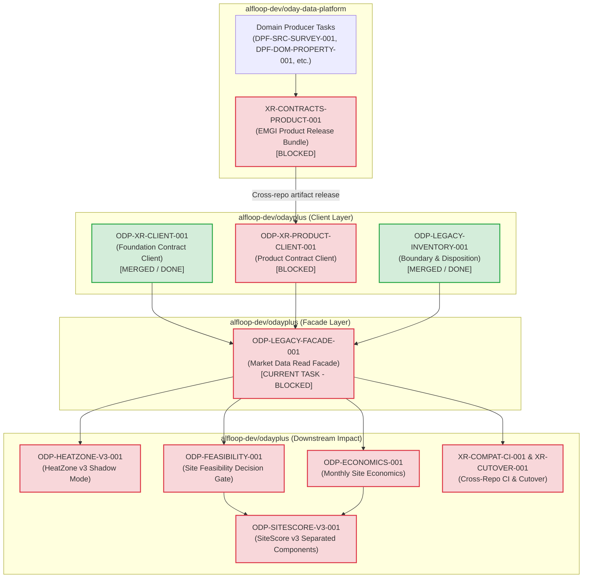

# Sidecar Diagnostic Packet: ODP-LEGACY-FACADE-001

## 1. Packet Identity & Governance Metadata

| Field | Value |
|---|---|
| **Sidecar Task ID** | `ODP-LEGACY-FACADE-001-SIDECAR-BLOCKED-TASK-DIAGNOSTICS` |
| **Parent Task ID** | `ODP-LEGACY-FACADE-001` |
| **Parent Task Title** | `Replace direct external ingestion with a data-platform read facade` |
| **Helper Kind** | `blocked_task_diagnostics` |
| **Sidecar Owner / Reviewer** | `Antigravity6` / `Codex` |
| **Parent Owner / Reviewer** | `Antigravity5` / `Claude` |
| **Target / Parent Branch** | `dev` / `task/ODP-LEGACY-FACADE-001-SIDECAR-BLOCKED-TASK-DIAGNOSTICS` |
| **Parent Task Status** | `blocked` |
| **Declared Blocked Reason** | `waiting for dependencies: ODP-XR-CLIENT-001, ODP-XR-PRODUCT-CLIENT-001, ODP-LEGACY-INVENTORY-001` |
| **Diagnostic Timestamp** | `2026-08-22` |
| **Scope Boundary** | Support artifact under `support/sidecars/ODP-LEGACY-FACADE-001/` only. Strictly zero mutation of L1 canonical platform documents, core contracts, runtime tables, or governance policies. |

---

## 2. Executive Summary & Problem Context

This diagnostic packet provides an evidence-backed blocker analysis, dependency status audit, migration coupling inventory, downstream blast radius mapping, unblocking protocol, and bounded verification report for parent task **`ODP-LEGACY-FACADE-001`** (*"Replace direct external ingestion with a data-platform read facade"*).

### Problem Statement & Architectural Mission
In the EMGI v0.4.1 target architecture, direct external data ingestion (scraping, scheduled fetching, raw third-party provider connectivity, and direct table writes) is segregated into `alfloop-dev/oday-data-platform`. The consumer repository `odayplus` must cease all direct provider ingestion and instead consume market data through formal, versioned contract clients.

Parent task `ODP-LEGACY-FACADE-001` is the critical architectural junction in `odayplus` that:
1. Implements a unified read facade (`modules/external_data/application/market_data_facade.py`) and underlying data platform client adapter (`modules/external_data/infrastructure/data_platform_client.py`).
2. Provides the `odayplus.market-data-facade.v2` contract to downstream consumer routes, workers, connectors, and analysis services.
3. Decouples consumer application logic from raw provider credentials, direct HTTP fetch, and legacy source-snapshot database tables, while preserving product authorization in `odayplus`.

### Diagnostic Finding Summary
- **Dependency 1 Satisfied (`ODP-LEGACY-INVENTORY-001`)**: Completed via PR #950 (merged into `dev`). Delivered frozen legacy inventory classification, automated boundary validator (`scripts/validate_external_data_boundary.py`), 69 boundary architecture tests (`tests/architecture/test_external_data_boundary.py`), and formally declared the `migrating_to_platform_client` coupling list in `docs/design/emgi/v0.4.1/LEGACY_EXTERNAL_DATA_DISPOSITION.yaml`.
- **Dependency 2 Satisfied (`ODP-XR-CLIENT-001`)**: Completed via PR #951 (merged into `dev`). Delivered the foundation contract client (`packages/oday_data_contracts_client/`), pin config (`config/oday_data_contracts.toml`), and 32 contract pin tests (`tests/contract/test_oday_data_contract_pin.py`).
- **Dependency 3 True Active Blocker (`ODP-XR-PRODUCT-CLIENT-001`)**: Currently **in progress / blocked**. `ODP-XR-PRODUCT-CLIENT-001` is responsible for delivering the product contract client (`packages/oday_data_product_contracts_client/`), which requires upstream release `XR-CONTRACTS-PRODUCT-001` from `alfloop-dev/oday-data-platform`.
- **Root Blocker Diagnosis**: While 2 of the 3 dependencies are fully merged and verified in `dev`, `ODP-LEGACY-FACADE-001` cannot complete its contract (`odayplus.market-data-facade.v2`) without `ODP-XR-PRODUCT-CLIENT-001` because the facade requires decision-ready product models (`emgi.site-market-context.v1`, `emgi.market-cell-profile.v1`, `emgi.catchment-profile.v1`). Therefore, `ODP-LEGACY-FACADE-001` must remain in `blocked` status until `ODP-XR-PRODUCT-CLIENT-001` completes.

---

## 3. Parent Task Objectives & Architecture Boundary

### Parent Task Scope & Deliverables
Parent task `ODP-LEGACY-FACADE-001` owns the following implementation paths:
- `modules/external_data/infrastructure/data_platform_client.py`:
  - Infrastructure adapter encapsulating communication with the generated foundation and product contract clients (`packages/oday_data_contracts_client` and `packages/oday_data_product_contracts_client`).
- `modules/external_data/application/market_data_facade.py`:
  - Application read facade providing query interfaces for market context, cell profiles, catchment data, and listing snapshots without direct provider access.
- `tests/integration/test_market_data_facade.py`:
  - Comprehensive integration test suite verifying facade query execution, error handling, contract mapping, and product authorization enforcement.

### Contract Boundaries
- **Requires Contracts**:
  - `odayplus.data-platform-foundation-client.v1` (delivered by `ODP-XR-CLIENT-001`)
  - `odayplus.data-platform-product-client.v1` (to be delivered by `ODP-XR-PRODUCT-CLIENT-001`)
  - `odayplus.legacy-external-data-disposition.v2` (delivered by `ODP-LEGACY-INVENTORY-001`)
  - `emgi.site-market-context.v1` (from upstream product contracts)
- **Provides Contracts**:
  - `odayplus.market-data-facade.v2`

### Forbidden Paths & Architectural Rules
Per task specification and repo-wide governance:
- **Forbidden Paths**:
  - `docs/design/emgi/v0.4.1/tasks/manifest.json`
  - `packages/generated/oday_data_contracts/`
  - `infra/db/migrations/`
  - `modules/external_data/providers/`
  - `modules/external_data/connectors/providers/`
  - `modules/external_data/workers/scheduled_fetch.py`
- **Architectural Invariants**:
  - Keep product authorization in `odayplus`.
  - Remove all provider credentials, raw HTTP fetch, and direct source-snapshot table writes from the facade path.
  - Do not introduce mock or synthetic contract clients that bypass official pin definitions.

---

## 4. Upstream Dependency Status & Blocker Audit

```
┌──────────────────────────────────────────────────────────────────────────────────────────────────┐
│                                   UPSTREAM DEPENDENCY AUDIT                                      │
├──────────────────────────┬───────────────────────┬────────────┬──────────────────────────────────┤
│ Task ID                  │ Repository            │ Status     │ Impact on ODP-LEGACY-FACADE-001  │
├──────────────────────────┼───────────────────────┼────────────┼──────────────────────────────────┤
│ ODP-LEGACY-INVENTORY-001 │ alfloop-dev/odayplus  │ DONE (PR#950) | Satisfied. Boundary & inventory │
│                          │                       │            │ rules fully in place.            │
├──────────────────────────┼───────────────────────┼────────────┼──────────────────────────────────┤
│ ODP-XR-CLIENT-001        │ alfloop-dev/odayplus  │ DONE (PR#951) | Satisfied. Foundation client     │
│                          │                       │            │ available at packages/oday_data_ │
│                          │                       │            │ contracts_client.                │
├──────────────────────────┼───────────────────────┼────────────┼──────────────────────────────────┤
│ ODP-XR-PRODUCT-CLIENT-001│ alfloop-dev/odayplus  │ IN PROGRESS│ TRUE BLOCKER. Product client     │
│                          │                       │ / BLOCKED  │ packages/oday_data_product_      │
│                          │                       │            │ contracts_client not yet landed. │
└──────────────────────────┴───────────────────────┴────────────┴──────────────────────────────────┘
```

### Detailed Breakdown of Dependencies

#### 1. `ODP-LEGACY-INVENTORY-001` (Legacy External Data Disposition & Boundary)
- **Status**: **DONE / MERGED** (`PR #950`, commit `d41db0fb90465961254fbb513a40b5434aefe28d` merged into `dev` as `96cce066e6019c14dfd87af5f7edf3e7d40d90a5`).
- **Delivered Capabilities**:
  - 2,542 files classified across 12 disposition categories with 0 unclassified entries.
  - Fail-closed boundary check script (`scripts/validate_external_data_boundary.py`).
  - Architecture test suite (`tests/architecture/test_external_data_boundary.py` — 69 tests).
  - Explicit declaration of `migrating_to_platform_client` surfaces awaiting facade migration.

#### 2. `ODP-XR-CLIENT-001` (Foundation Contract Client)
- **Status**: **DONE / MERGED** (`PR #951`, commit `f22787e433033b9ccd411325e73af18cc54a6ba8` merged into `dev` as `bdd6f4702f9c41457f13198bc3ba5e92423309ed`).
- **Delivered Capabilities**:
  - `packages/oday_data_contracts_client/` containing 13 generated consumer model modules.
  - `config/oday_data_contracts.toml` pinning upstream release `oday-data-foundation-contracts.v0.4.1`.
  - 32 contract pin tests passing in `tests/contract/test_oday_data_contract_pin.py`.

#### 3. `ODP-XR-PRODUCT-CLIENT-001` (Product Contract Client) — Active Root Cause Blocker
- **Status**: **IN PROGRESS / BLOCKED**
- **Pending Deliverables**:
  - `packages/oday_data_product_contracts_client/`
  - `config/oday_data_product_contracts.toml`
  - `tests/contract/test_oday_data_product_contract_pin.py`
- **Upstream Root Cause**:
  - Blocked on cross-repo upstream task `XR-CONTRACTS-PRODUCT-001` in `alfloop-dev/oday-data-platform`.
  - Upstream release bundle requires completion of 8 domain producer tasks (`DPF-SRC-SURVEY-001`, `DPF-DOM-PROPERTY-001`, `DPF-DP-COVERAGE-001`, `DPF-DP-MARKET-CELL-001`, `DPF-DP-CATCHMENT-001`, `DPF-DP-SITE-CONTEXT-001`, `DPF-DP-ACQUISITION-001`, and `XR-CONTRACTS-001`).

---

## 5. Consumer Coupling Inventory (The Facade Work List)

Per `docs/design/emgi/v0.4.1/LEGACY_EXTERNAL_DATA_DISPOSITION.yaml` (§ `consumer_coupling_pending_facade`), the following 12 entry points currently couple consumer code directly to legacy producer internals or direct data stores. These call sites constitute the exact migration work list to be redirected to `MarketDataFacade`:

| # | Consumer Surface / File Path | Current Legacy Coupling | Target State via `MarketDataFacade` |
|---|---|---|---|
| 1 | `apps/api/app/routes/external_data.py` | Direct provider route handlers & raw queries | Query `MarketDataFacade` for sanitized market context |
| 2 | `apps/api/oday_api/main.py` | Imports legacy external data services | Initialize and inject `MarketDataFacade` |
| 3 | `apps/data_platform/geography_backfill.py` | Direct provider & raw geo ingestion queries | Fetch validated profiles through facade |
| 4 | `apps/worker/oday_worker/handlers.py` | Worker tasks handling raw external snapshots | Use facade read models for asynchronous processing |
| 5 | `modules/integration/connectors/__init__.py` | Direct connector exports | Use facade abstraction for data platform connectivity |
| 6 | `modules/integration/connectors/base.py` | Base connector coupling to raw sources | Standardize on data-platform client adapter |
| 7 | `product_ops/external_data_backfill.py` | Backfill operations hitting legacy tables | Consume platform contract stream via facade |
| 8 | `product_ops/modeling/real_estate_outcomes.py` | Modeling scripts reading raw provider tables | Read `emgi.site-market-context.v1` models from facade |
| 9 | `product_ops/deployment/validate_cloud_run_live_deployment.py` | Deployment verification checks legacy endpoints | Validate data-platform client & facade health |
| 10 | `shared/infrastructure/persistence/external_data.py` | Direct table persistence of raw external data | Deprecate write path; read through client models |
| 11 | `shared/infrastructure/persistence/factory.py` | Factory constructing legacy persistence | Instantiate `DataPlatformClient` & `MarketDataFacade` |
| 12 | `delivery_toolchain/e2e/check_live_e2e_gate.py` | E2E gate testing legacy ingestion paths | Assert facade contract responses and boundary rules |

---

## 6. Dependency Graph & Downstream Blast Radius



---

## 7. Implementation Blueprint & Unblocking Protocol

When `ODP-XR-PRODUCT-CLIENT-001` is completed and merged into `dev`, parent task owner `Antigravity5` should execute the following implementation sequence:

### Phase 1: Environment & Dependency Validation
1. Verify that `packages/oday_data_contracts_client/` and `packages/oday_data_product_contracts_client/` are both present and passing their contract pin tests:
   ```bash
   uv run --python 3.12 pytest tests/contract/ -q
   ```
2. Confirm that `config/oday_data_contracts.toml` and `config/oday_data_product_contracts.toml` are properly pinned.

### Phase 2: Data Platform Client Infrastructure Adapter
1. Implement `modules/external_data/infrastructure/data_platform_client.py`:
   - Initialize connection / client instances using `packages.oday_data_contracts_client` and `packages.oday_data_product_contracts_client`.
   - Provide typed access methods for foundation contracts (`PlatformFoundation`, `StoreCoverage`, `SourceEvidence`) and product contracts (`SiteMarketContext`, `MarketCellProfile`, `CatchmentProfile`).
   - Implement fail-closed error translation, transforming client connection errors and contract validation failures into domain exceptions.

### Phase 3: Application Read Facade
1. Implement `modules/external_data/application/market_data_facade.py`:
   - Construct `MarketDataFacade` with injected `DataPlatformClient`.
   - Define clean query interfaces:
     - `get_site_market_context(site_id: str) -> SiteMarketContext`
     - `get_market_cell_profile(cell_id: str) -> MarketCellProfile`
     - `get_catchment_profile(catchment_id: str) -> CatchmentProfile`
     - `get_listing_observation(listing_id: str) -> ListingObservation`
   - Enforce product authorization checks in `odayplus` before returning model data.
   - Guarantee strictly read-only semantics (no provider credentials, no HTTP crawler calls, no table mutation).

### Phase 4: Integration Verification Suite
1. Implement `tests/integration/test_market_data_facade.py`:
   - Test facade queries against mock/test data platform contract clients.
   - Test product authorization pass/fail scenarios.
   - Assert fail-closed behavior when upstream data platform responses are corrupted or unavailable.
   - Run verification command:
     ```bash
     uv run --python 3.12 pytest tests/integration/test_market_data_facade.py -q
     ```

### Phase 5: Boundary & Governance Conformance
1. Verify code boundaries:
   - Ensure `modules/external_data/infrastructure/data_platform_client.py`, `modules/external_data/application/market_data_facade.py`, and `tests/integration/test_market_data_facade.py` are classified under `product_system` and `verification` respectively.
2. Run full boundary checks:
   ```bash
   python3 delivery_toolchain/governance/check_code_boundaries.py
   python3 scripts/validate_external_data_boundary.py
   uv run --python 3.12 pytest tests/architecture/test_external_data_boundary.py -q
   ```

---

## 8. Bounded Verification & Evidence Record

To confirm the current repository state, boundary conformance, and readiness of existing client layers without mutating canonical product behavior, the following bounded verification suites were executed:

### Verification Run 1: Foundation Contract Client Suite
- **Command**: `uv run --python 3.12 pytest tests/contract/test_oday_data_contract_pin.py -q`
- **Result**: `32 passed in 1.25s`
- **Finding**: Foundation client (`ODP-XR-CLIENT-001`) is fully operational and healthy.

### Verification Run 2: Architecture & External Data Boundary Suite
- **Command**: `uv run --python 3.12 pytest tests/architecture/test_external_data_boundary.py -q`
- **Result**: `69 passed in 40.81s`
- **Finding**: Full isolation of frozen external data paths; zero unauthorized provider calls or leakage.

### Verification Run 3: External Data Boundary Classification Audit
- **Command**: `python3 scripts/validate_external_data_boundary.py`
- **Result**:
  ```text
  contract: odayplus.legacy-external-data-disposition.v2
  tracked files: 2574
    classified: 2574
    unclassified: 0
    by_disposition: {"archived": 75, "assisted_intake_workflow": 58, "delivery_and_governance": 78, "development_platform": 223, "documentation_and_evidence": 944, "frozen_legacy_producer": 32, "migrating_to_platform_client": 46, "product_consumer_owned": 637, "product_review_workflow": 146, "repository_metadata": 16, "shared_platform_support": 61, "verification_only": 258}
    frozen_files: 32
    capability_detections: 68
    provider_reference_hits: 218
  external-data boundary: OK
  ```
- **Finding**: Complete disposition classification across 2,574 files with 0 unclassified gaps.

### Verification Run 4: Whole-Repository Code Boundary Conformance
- **Command**: `python3 delivery_toolchain/governance/check_code_boundaries.py`
- **Result**: `Code boundary checks passed for 865 files (product_system: 414, verification: 271, development_platform_system: 60, development_delivery_tooling: 58, product_operations_tooling: 27, evidence_artifact: 21, archived: 14)`
- **Finding**: 100% compliance across all 865 tracked Python files.

---

## 9. Actionable Recommendations for Parent Task Owner & Reviewer

1. **Maintain Blocked State**: Keep `ODP-LEGACY-FACADE-001` in `blocked` status until `ODP-XR-PRODUCT-CLIENT-001` completes and merges into `dev`.
2. **Do Not Bypass Contracts**: Do not attempt to construct mock product contract models or copy upstream DDL tables directly into `odayplus`, as this violates the fail-closed contract governance invariant.
3. **Execution Readiness**: Once `ODP-XR-PRODUCT-CLIENT-001` merges, immediately proceed with the Phase 1–5 implementation blueprint outlined in Section 7.
