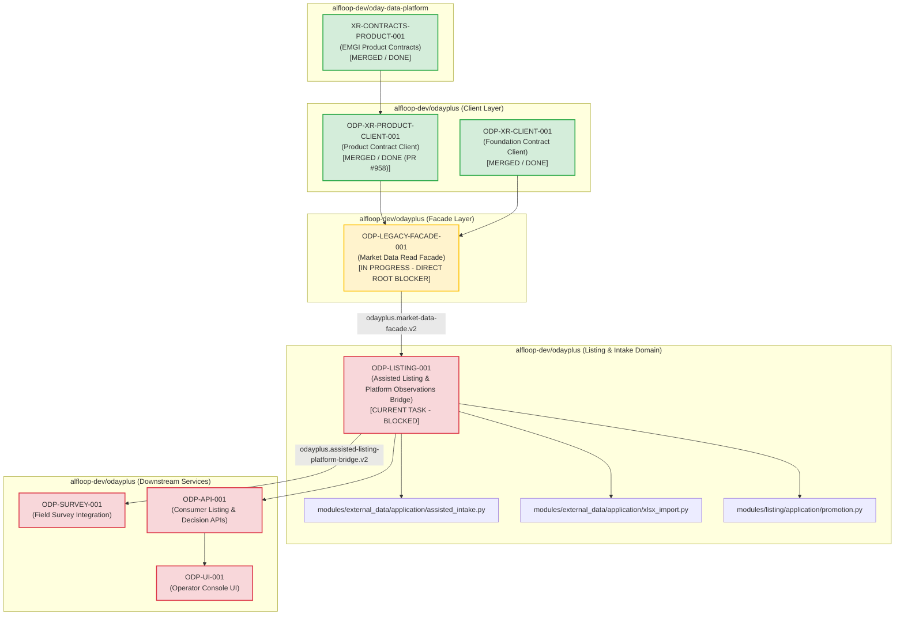

# Sidecar Diagnostic Packet: ODP-LISTING-001

## 1. Packet Identity & Governance Metadata

| Field | Value |
|---|---|
| **Sidecar Task ID** | `ODP-LISTING-001-SIDECAR-BLOCKED-TASK-DIAGNOSTICS` |
| **Parent Task ID** | `ODP-LISTING-001` |
| **Parent Task Title** | `Integrate assisted listing with platform property observations` |
| **Helper Kind** | `blocked_task_diagnostics` |
| **Sidecar Owner / Reviewer** | `Antigravity6` / `Codex` |
| **Parent Owner / Reviewer** | `Claude` / `Antigravity4` |
| **Target / Parent Branch** | `dev` / `task/ODP-LISTING-001-SIDECAR-BLOCKED-TASK-DIAGNOSTICS` |
| **Parent Task Status** | `blocked` |
| **Declared Blocked Reason** | Waiting for dependency: `ODP-LEGACY-FACADE-001` (`ODP-XR-PRODUCT-CLIENT-001` merged via PR #958; `ODP-LEGACY-FACADE-001` actively in progress) |
| **Diagnostic Timestamp** | `2026-08-22` |
| **Scope Boundary** | Support artifact under `support/sidecars/ODP-LISTING-001/` only. Strictly zero mutation of L1 canonical platform documents, core contracts, runtime tables, or governance policies. |

---

## 2. Executive Summary & Problem Context

This diagnostic packet provides an evidence-backed blocker diagnosis, upstream dependency audit, architectural invariant breakdown, integration blueprint, blast radius mapping, unblocking protocol, and bounded verification report for parent task **`ODP-LISTING-001`** (*"Integrate assisted listing with platform property observations"*).

### Problem Statement & Architectural Mission
In the EMGI v0.4.1 target architecture, market observations, scraping, and platform property registries belong to `alfloop-dev/oday-data-platform` and are published as formal contract streams (`emgi.property-observation.v1`). Conversely, human-assisted intake, operator review, identity resolution, manual corrections, and candidate promotion remain strictly owned by consumer application `odayplus`.

Parent task `ODP-LISTING-001` is the critical domain bridge in `odayplus` that:
1. Integrates platform property observations into the human-assisted intake and listing evaluation workflows without creating a competing or split listing authority.
2. Bridges `emgi.property-observation.v1` models (delivered via `ODP-XR-PRODUCT-CLIENT-001`) through the unified `MarketDataFacade` (to be delivered via `ODP-LEGACY-FACADE-001`).
3. Preserves all assisted intake domain rules (`modules/external_data/application/assisted_intake.py`), governed spreadsheet import (`modules/external_data/application/xlsx_import.py`), and candidate promotion state machines (`modules/listing/application/promotion.py`).
4. Provides the `odayplus.assisted-listing-platform-bridge.v2` contract to downstream review and candidate generation routes.

### Diagnostic Finding Summary
- **Upstream Domain Contract Satisfied (`XR-CONTRACTS-PRODUCT-001` in `oday-data-platform`)**: Released and published `emgi.property-observation.v1` (along with `emgi.site-market-context.v1`, `emgi.market-cell-profile.v1`, `emgi.catchment-profile.v1`).
- **Product Contract Client Satisfied (`ODP-XR-PRODUCT-CLIENT-001` in `odayplus`)**: Merged into `dev` via PR #958 (commit `47a876bd`). Delivered `packages/oday_data_product_contracts_client/models/property_observation.py` with 40/40 passing contract pin tests.
- **Direct Active Root Blocker (`ODP-LEGACY-FACADE-001` in `odayplus`)**: Currently **in progress** (owned by `Antigravity5`). `ODP-LEGACY-FACADE-001` is implementing `modules/external_data/infrastructure/data_platform_client.py` and `modules/external_data/application/market_data_facade.py` to provide `odayplus.market-data-facade.v2`.
- **Root Blocker Diagnosis**: While the property observation models are now compiled and pinned in `packages/oday_data_product_contracts_client`, `ODP-LISTING-001` cannot establish its platform observation bridge without the read facade `MarketDataFacade` provided by `ODP-LEGACY-FACADE-001`. Attempting to read platform observations directly from raw sockets, mock endpoints, or unpublished internal client instances violates fail-closed contract governance. `ODP-LISTING-001` must remain in `blocked` status until `ODP-LEGACY-FACADE-001` completes and merges into `dev`.

---

## 3. Parent Task Objectives & Architecture Boundary

### Parent Task Scope & Deliverables
Parent task `ODP-LISTING-001` owns the following implementation paths:
- `modules/external_data/application/assisted_intake.py`:
  - Enriches human-assisted URL intake and assisted entry workflows with platform observation lookups.
  - Maintains strict fail-closed access policy gates and deterministic fixture replays for testing.
- `modules/external_data/application/xlsx_import.py`:
  - Integrates spreadsheet bulk ingestion with observation matching and property entity deduplication.
- `modules/listing/`:
  - `modules/listing/domain/models.py` & `identity_graph.py`: Integrates property entity anchors (`PropertyEntity`, `PropertyListingObservation`) with internal listing identities.
  - `modules/listing/application/pipeline.py` & `intake_workflow.py`: Channels external observations into the candidate pipeline.
  - `modules/listing/application/promotion.py`: Preserves candidate promotion invariants and gate validations.
- `tests/integration/test_listing_platform_observations.py`:
  - Verification suite testing observation ingestion, identity reconciliation, deduping, and promotion without authority leakage.

### Contract Boundaries
- **Requires Contracts**:
  - `odayplus.market-data-facade.v2` (from `ODP-LEGACY-FACADE-001`)
  - `emgi.property-observation.v1` (from `ODP-XR-PRODUCT-CLIENT-001`)
- **Provides Contracts**:
  - `odayplus.assisted-listing-platform-bridge.v2`

### Forbidden Paths & Architectural Invariants
- **Forbidden Paths**:
  - `docs/design/emgi/v0.4.1/tasks/manifest.json`
  - `packages/generated/oday_data_contracts/`
  - `infra/db/migrations/`
  - `modules/external_data/providers/`
  - `modules/external_data/connectors/providers/`
  - `modules/external_data/workers/scheduled_fetch.py`
- **Core Invariants**:
  1. **Single Listing Authority**: `odayplus` is the sole authoritative decision system for listing records, human review decisions, corrections, and candidate promotions. Platform property observations are evidentiary inputs, not an independent listing master.
  2. **Zero Ingestion Leakage**: No direct crawling, scheduled polling, or provider scraping inside `odayplus`.
  3. **Preserve Human Control**: Manual corrections to identity-affecting fields (`address`, `rent`, `areaPing`, `floor`) must retain operator audit reasons and override platform observations where human intent is recorded.

---

## 4. Upstream Dependency Status & Blocker Audit

```
┌──────────────────────────────────────────────────────────────────────────────────────────────────┐
│                                   UPSTREAM DEPENDENCY AUDIT                                      │
├──────────────────────────┬───────────────────────┬────────────┬──────────────────────────────────┤
│ Task ID                  │ Repository            │ Status     │ Impact on ODP-LISTING-001        │
├──────────────────────────┼───────────────────────┼────────────┼──────────────────────────────────┤
│ XR-CONTRACTS-PRODUCT-001 │ alfloop-dev/          │ DONE       │ Satisfied upstream. EMGI product │
│                          │ oday-data-platform    │            │ contract release bundle merged.  │
├──────────────────────────┼───────────────────────┼────────────┼──────────────────────────────────┤
│ ODP-XR-PRODUCT-CLIENT-001│ alfloop-dev/odayplus  │ DONE       │ Satisfied locally. Generated     │
│                          │                       │ (PR #958)  │ client models available in repo. │
├──────────────────────────┼───────────────────────┼────────────┼──────────────────────────────────┤
│ ODP-LEGACY-FACADE-001    │ alfloop-dev/odayplus  │ IN PROGRESS│ TRUE ACTIVE ROOT BLOCKER.        │
│                          │                       │            │ MarketDataFacade read facade not │
│                          │                       │            │ yet merged into dev.             │
└──────────────────────────┴───────────────────────┴────────────┴──────────────────────────────────┘
```

### Detailed Breakdown of Dependencies

#### 1. `XR-CONTRACTS-PRODUCT-001` (Platform Contract Release)
- **Status**: **DONE / MERGED**
- **Contribution**: Published schema `emgi.property-observation.v1` containing `PropertyObservationDocument`, `PropertyEntity`, `PropertyListingObservation`, `ListingStatusHistory`, and `RentBenchmark`.

#### 2. `ODP-XR-PRODUCT-CLIENT-001` (Consumer Product Client in `odayplus`)
- **Status**: **DONE / MERGED** (PR #958, commit `47a876bd` into `dev`).
- **Contribution**:
  - `packages/oday_data_product_contracts_client/models/property_observation.py` generated and pinned in `config/oday_data_product_contracts.toml`.
  - 40 contract pin tests passing in `tests/contract/test_oday_data_product_contract_pin.py`.

#### 3. `ODP-LEGACY-FACADE-001` (Market Data Read Facade) — Direct Root Blocker
- **Status**: **IN PROGRESS / UNDELIVERED**
- **Pending Deliverables**:
  - `modules/external_data/infrastructure/data_platform_client.py`
  - `modules/external_data/application/market_data_facade.py` (`odayplus.market-data-facade.v2`)
  - `tests/integration/test_market_data_facade.py`
- **Root Cause & Diagnosis**:
  - `ODP-LISTING-001` requires `MarketDataFacade` to query observations via standard interfaces (`get_property_observation`, `get_listing_observation`, `get_site_market_context`).
  - Without `MarketDataFacade`, `ODP-LISTING-001` cannot instantiate its bridge without directly coupling to unfinished low-level infrastructure adapters.
  - Therefore, `ODP-LEGACY-FACADE-001` is the true, direct root blocker holding `ODP-LISTING-001` in `blocked` state.

---

## 5. Architectural & Domain Invariant Matrix

| Domain Capability | Owner Repo | Authoritative Role | Interaction Rule for `ODP-LISTING-001` |
|---|---|---|---|
| **Property Observations (`PropertyListingObservation`)** | `oday-data-platform` | Evidentiary source snapshot | Consumed as read-only evidence through `MarketDataFacade`. Never mutated directly. |
| **Rent Benchmarks (`RentBenchmark`)** | `oday-data-platform` | Statistical reference layer | Displayed as benchmark context during operator review. |
| **Assisted Intake (`assisted_intake.py`)** | `odayplus` | Workflow & policy orchestrator | Single human URL intake; policy gate fails closed. |
| **XLSX Ingestion (`xlsx_import.py`)** | `odayplus` | Operator bulk spreadsheet intake | Validates columns, neutralizes formulas, matches against platform entities. |
| **Listing Master & Entity Identity (`modules/listing/`)** | `odayplus` | **Sole Authoritative Master** | Resolves duplicate groups, manages lifecycle revisions, binds to platform property ID. |
| **Manual Corrections & Audit Trail** | `odayplus` | Authoritative correction log | Human corrections win over normalized and platform values with required reason. |
| **Candidate Promotion (`promotion.py`)** | `odayplus` | Decision & promotion saga | Evaluates hard rule policies, tenant isolation, and candidate site creation. |

---

## 6. Dependency Graph & Downstream Flow



---

## 7. Implementation Blueprint & Unblocking Protocol

When `ODP-LEGACY-FACADE-001` is completed and merged into `dev`, parent task owner `Claude` should execute the following 5-phase implementation plan:

### Phase 1: Dependency & Model Ingestion
1. Verify that `MarketDataFacade` is available in `modules/external_data/application/market_data_facade.py`.
2. Confirm availability of `packages.oday_data_product_contracts_client.models.property_observation`:
   - `PropertyObservationDocument`
   - `PropertyListingObservation`
   - `PropertyEntity`
   - `RentBenchmark`
   - `ListingStatusHistory`

### Phase 2: Assisted Intake Observation Bridge
1. Update `modules/external_data/application/assisted_intake.py`:
   - Implement observation reconciliation in `parse_snapshot()` / `match_listing()`:
     - When a canonical URL or provider listing ID matches an active platform observation, correlate the platform `property_id` and attach `RentBenchmark` context.
     - Ensure fallback to assisted entry when source policy denies direct retrieval.
     - Maintain strict field precedence: `Manual Correction > Normalized Intake > Platform Observation Raw`.

### Phase 3: Governed XLSX Ingestion Alignment
1. Update `modules/external_data/application/xlsx_import.py`:
   - Bind committed spreadsheet rows to platform `PropertyEntity` identities where address/geo matching confidence >= 0.85.
   - Preserve formula neutralization, PII error masking, and idempotency guarantees.

### Phase 4: Listing Domain & Candidate Promotion Integration
1. Update `modules/listing/application/pipeline.py` and `promotion.py`:
   - Allow `CandidateSiteDraft` to incorporate platform property observation metadata and benchmark metrics (`RentBenchmark.median_rent_per_ping`, `p25`, `p75`).
   - Validate that candidate promotion gates reject listings with hard rule violations or tenant isolation mismatches.

### Phase 5: Integration Verification Suite
1. Implement `tests/integration/test_listing_platform_observations.py`:
   - Test observation ingestion through `MarketDataFacade`.
   - Test single listing authority invariants: verify no duplicate master records are created.
   - Test candidate promotion saga with observation-backed listings.
   - Run verification command:
     ```bash
     uv run --python 3.12 pytest tests/integration/test_listing_platform_observations.py -q
     ```

---

## 8. Bounded Verification & Evidence Record

To confirm the current repository state, contract integrity, and boundary compliance without mutating canonical code, the following verification suites were executed:

### Verification Run 1: Foundation & Product Contract Client Suites
- **Command**: `.venv/bin/pytest tests/contract/test_oday_data_contract_pin.py tests/contract/test_oday_data_product_contract_pin.py -q`
- **Result**: `72 passed in 1.48s`
- **Finding**: Both foundation (`ODP-XR-CLIENT-001`) and product (`ODP-XR-PRODUCT-CLIENT-001`) contract client packages are fully operational, pinned, and compliant.

### Verification Run 2: External Data Boundary Classification Audit
- **Command**: `python3 scripts/validate_external_data_boundary.py`
- **Result**:
  ```text
  contract: odayplus.legacy-external-data-disposition.v2
  tracked files: 2599
    classified: 2599
    unclassified: 0
    by_disposition: {"archived": 75, "assisted_intake_workflow": 58, "delivery_and_governance": 78, "development_platform": 224, "documentation_and_evidence": 946, "frozen_legacy_producer": 32, "migrating_to_platform_client": 46, "product_consumer_owned": 657, "product_review_workflow": 146, "repository_metadata": 17, "shared_platform_support": 61, "verification_only": 259}
    frozen_files: 32
    capability_detections: 68
    provider_reference_hits: 218
  external-data boundary: OK
  ```
- **Finding**: 100% classification coverage across 2,599 tracked files with zero unclassified paths.

### Verification Run 3: Whole-Repository Code Boundary Conformance
- **Command**: `python3 delivery_toolchain/governance/check_code_boundaries.py`
- **Result**:
  ```text
  Code boundary checks passed for 881 files.
  - archived: 14
  - development_delivery_tooling: 58
  - development_platform_system: 60
  - evidence_artifact: 21
  - product_operations_tooling: 27
  - product_system: 429
  - verification: 272
  ```
- **Finding**: Zero boundary violations across all 881 tracked Python source files.

---

## 9. Actionable Recommendations for Parent Task Owner & Reviewer

1. **Maintain Blocked Status**: Keep `ODP-LISTING-001` in `blocked` status with reason `"waiting for dependencies: ODP-LEGACY-FACADE-001"`.
2. **Do Not Bypass Read Facade**: Avoid creating direct adapters or ad-hoc parsers in `modules/listing/` that bypass `MarketDataFacade`.
3. **Execute Upon Facade Merge**: As soon as `ODP-LEGACY-FACADE-001` lands in `dev`, parent task owner `Claude` can proceed with the 5-phase blueprint.
