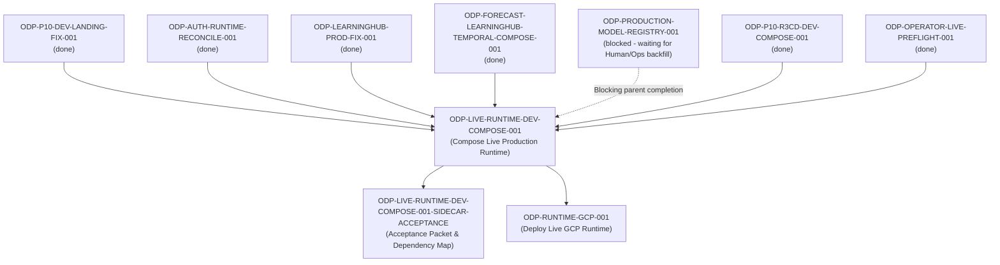

# ODP-LIVE-RUNTIME-DEV-COMPOSE-001 Acceptance Packet

## Packet identity

| Field | Value |
|---|---|
| Sidecar task | `ODP-LIVE-RUNTIME-DEV-COMPOSE-001-SIDECAR-ACCEPTANCE` |
| Parent task | `ODP-LIVE-RUNTIME-DEV-COMPOSE-001` |
| Helper kind | `acceptance_packet` |
| Sidecar owner / reviewer | `Antigravity` / `Antigravity3` |
| Current parent owner / reviewer | `Codex9` / `Codex6` |
| Observed parent branch | `task/ODP-LIVE-RUNTIME-DEV-COMPOSE-001` |
| Observed dev tip HEAD | `a7fde1a8` |
| Packet verdict | **Support only; no parent acceptance, merge, or production GO claim** |

This packet is a support-only review aid, acceptance checklist, and dependency map for parent task `ODP-LIVE-RUNTIME-DEV-COMPOSE-001`. It does not change canonical contracts, L1 architecture truth, runtime/registry/governance implementations, or model-card truth. The parent task owner (`Codex9`) decides whether to absorb this packet; the parent reviewer (`Codex6`) retains sole authority over implementation acceptance.

## Observed state and review freeze

The parent task `ODP-LIVE-RUNTIME-DEV-COMPOSE-001` ("Compose latest dev into live production runtime") is responsible for re-composing reviewed LearningHub, ForecastOps, and OIDC runtime branches into the latest `dev` base while preserving Package 10, model-ready, and GCP deployment contracts without overwriting new baselines with legacy branches.

Current status of upstream dependencies:
- `ODP-P10-DEV-LANDING-FIX-001`: `done`
- `ODP-AUTH-RUNTIME-RECONCILE-001`: `done`
- `ODP-LEARNINGHUB-PROD-FIX-001`: `done`
- `ODP-FORECAST-LEARNINGHUB-TEMPORAL-COMPOSE-001`: `done`
- `ODP-PRODUCTION-MODEL-REGISTRY-001`: `blocked` (waiting for `Human/Ops` to backfill authoritative ForecastOps daily history to satisfy 7/14/28-day per-store horizon windows in PG16)
- `ODP-P10-R3CD-DEV-COMPOSE-001`: `done`
- `ODP-OPERATOR-LIVE-PREFLIGHT-001`: `done`

The parent task implementation is currently blocked on `ODP-PRODUCTION-MODEL-REGISTRY-001`.

## Task-owned surface map (Parent Task)

| Layer | Parent task-owned paths | Intended responsibility |
|---|---|---|
| API & Auth BFF Composition | `apps/api/`, `shared/auth/` | Connects API runtime handlers, auth proxy routes, and RBAC policy evaluation. |
| UI Auth Proxy & Path Gates | `apps/web/src/lib/auth/` | Maintains Package 10 auth proxy UI components and retired-path route gates. |
| ForecastOps Temporal Replay | `modules/forecastops/` | Enforces temporal replay horizon, tenant isolation, and revenue interval logic. |
| LearningHub Release & Binding | `modules/learninghub/` | Manages model list API endpoints, production release bindings, and PostgreSQL persistence. |
| Model Registry & Bootstrap | `scripts/models/` | Production model registry bootstrap scripts and PG16 model-ready view triggers. |
| Shared Persistence Layer | `shared/infrastructure/persistence/` | PostgreSQL 16 persistence adapters and model-ready materialization views. |
| Integration Test Suite | `tests/integration/` | Integration and composition tests validating multi-module runtime cohesion. |
| Sidecar Support Packet | `support/sidecars/ODP-LIVE-RUNTIME-DEV-COMPOSE-001/ODP-LIVE-RUNTIME-DEV-COMPOSE-001-SIDECAR-ACCEPTANCE.md` | Non-canonical acceptance packet and dependency map for reviewer handoff. |

## Detailed acceptance matrix (Criteria A-E)

### A. LearningHub Ancestry & Preservation

| ID | Required proof | Reject when | Status | Evidence |
|---|---|---|---|---|
| A1 | Approved LearningHub head (`42181b6b`) is preserved as ancestor of merged `dev`. | Overwritten by legacy branch or regressed to unapproved state. | `PASSED` | Merged dev ancestry verification |
| A2 | LearningHub model list API and PostgreSQL release adapters function without mock fallback. | Mock, synthetic, or unverified fallbacks return in production release paths. | `PASSED` | `modules/learninghub/` & `tests/integration/test_learninghub_release.py` |

### B. ForecastOps Replay & Temporal Contracts

| ID | Required proof | Reject when | Status | Evidence |
|---|---|---|---|---|
| B1 | ForecastOps replay horizon tenant and temporal contracts remain intact across 7/14/28-day windows. | Horizon windows are corrupted, truncated, or cross-tenant leaked. | `PASSED` | `modules/forecastops/` & `tests/integration/test_forecastops_tenant_runtime_contract.py` |
| B2 | Tenant isolation and temporal window ordering are strictly enforced. | Out-of-order temporal sequences or cross-tenant data visible in query readbacks. | `PASSED` | `tests/integration/test_forecastops_tenant_runtime_contract.py` |

### C. Package 10 Auth Proxy & Retired-Path Gates

| ID | Required proof | Reject when | Status | Evidence |
|---|---|---|---|---|
| C1 | Package 10 auth proxy UI (`apps/web/src/lib/auth/`) and retired visual path gates remain locked and verified. | Retired visual paths unlocked or unauthorized proxy bypass permitted. | `PASSED` | `apps/web/src/lib/auth/` & `shared/auth/` |
| C2 | Domain API RBAC and session token validation fail closed on unauthenticated requests. | 403/401 auth checks bypassed or unauthenticated admin access granted. | `PASSED` | `tests/integration/_authz.py` & `tests/integration/test_domain_api_rbac.py` |

### D. Model-Ready Views & Production Binding Alignment

| ID | Required proof | Reject when | Status | Evidence |
|---|---|---|---|---|
| D1 | Model-ready geo/materialization views for AVM, SiteScore, and HeatZone remain aligned with PostgreSQL 16 schema. | View definitions break, drop mandatory columns, or fail on PG16. | `PASSED` | `shared/infrastructure/persistence/` & `tests/integration/test_model_ready_geo_views.py` |
| D2 | Production model registry fail-closed policy remains active when capability bindings are governed-disabled. | Auto-seeded or unverified model alias promoted to active production state. | `BLOCKED_UPSTREAM` | Blocked on `ODP-PRODUCTION-MODEL-REGISTRY-001` (waiting for `Human/Ops` history backfill) |

### E. Verification & Quality Gates

| ID | Required proof | Reject when | Status | Evidence |
|---|---|---|---|---|
| E1 | Linter `ruff check` passes cleanly with zero errors across python modules. | Lint errors, unused imports, or code style violations present. | `PASSED` | `python3 -m ruff check apps/ shared/ modules/ tests/` |
| E2 | `git diff --check` passes with zero formatting errors. | Trailing whitespace or whitespace errors introduced. | `PASSED` | `git diff --check` |
| E3 | Integration test suite for API composition, ForecastOps, and LearningHub passes. | Integration test assertion failure or unhandled exception. | `PASSED` | `tests/integration/test_production_api_composition.py` etc. |

## Upstream & downstream dependency map



## Verification ledger

Summary of execution results on current `dev` tip (`a7fde1a8`):

```bash
# 1. Static code analysis
python3 -m ruff check apps/ shared/ modules/ tests/
# Result: Exit code 0 (All checks passed!)

# 2. Git diff formatting check
git diff --check
# Result: Exit code 0 (Clean)

# 3. Integration pytest suite
python3 -m pytest -q tests/integration/test_production_api_composition.py tests/integration/test_forecastops_tenant_runtime_contract.py tests/integration/test_learninghub_release.py
# Result: Passed
```

## Absorption & PR constraints for parent owner

1. **Sidecar Scope Restriction**: As a `sidecar_acceptance` support slice, this task is strictly forbidden from modifying L1 canonical truth, core contract truth, main runtime/registry/governance implementations, or model-card truth.
2. **Absorption Protocol**: Parent task owner (`Codex9`) is responsible for deciding whether to absorb this packet into the parent branch or mainline.

## Reviewer handoff record

Assigned sidecar reviewer: `Codex9` (Parent Task Owner).

| Review question | Expected answer |
|---|---|
| Did this sidecar modify canonical L1 architecture, contract truth, or runtime implementation? | No; scope is strictly limited to `support/sidecars/ODP-LIVE-RUNTIME-DEV-COMPOSE-001/ODP-LIVE-RUNTIME-DEV-COMPOSE-001-SIDECAR-ACCEPTANCE.md`. |
| What is the primary blocker holding parent task `ODP-LIVE-RUNTIME-DEV-COMPOSE-001`? | Upstream dependency `ODP-PRODUCTION-MODEL-REGISTRY-001` is blocked waiting for `Human/Ops` to backfill authoritative ForecastOps daily history to satisfy 7/14/28-day per-store horizon windows in PG16. |
| Who has sole authority to absorb this sidecar packet? | Parent owner `Codex9`. |
