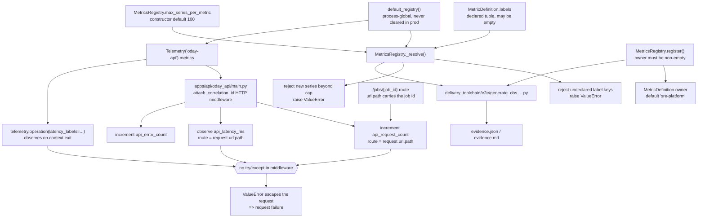

# ODP-OBS-INSTRUMENTATION-AS-CODE-001 Acceptance Packet

## Packet identity and authority

| Field | Value |
|---|---|
| Sidecar task | `ODP-OBS-INSTRUMENTATION-AS-CODE-001-SIDECAR-ACCEPTANCE` |
| Parent task | `ODP-OBS-INSTRUMENTATION-AS-CODE-001` |
| Helper kind | `acceptance_packet` |
| Sidecar owner / reviewer | `Claude2` / `Antigravity` |
| Parent owner / reviewer | `Antigravity` / `Codex` |
| Parent PR | `#704`, head `4ad48c9b7684780e12d4358004b9c3424a39c634` |
| Parent `review_gate_sha` | `4ad48c9b7684780e12d4358004b9c3424a39c634` |
| Parent `last_approved_head` | `5dba12f89a927bcc8ad8c562d6c89bc5cf6419ee` (superseded; reopened by `Codex`) |
| Evidence observed at | `2026-08-10`, against `origin/dev` `438c8df4a3b0bf16c1c23dc4c1944ae76f52efbc` |
| Packet verdict | Support only. **One blocking acceptance defect confirmed.** No parent acceptance, merge, rollout, or production claim. |

This packet is a review aid for the parent owner and parent reviewer. It records
an acceptance matrix, a dependency and call-path map, an independently
reproduced blocking defect, and a runtime evidence plan. It does not modify or
supersede canonical truth, `shared/observability/*` runtime code, monitoring
configuration, the evidence generator, or the parent task's acceptance
authority.

It complements — and does not replace — the earlier
`ODP-OBS-INSTRUMENTATION-AS-CODE-001-SIDECAR-REVIEW` packet, which was captured
against the now-superseded head `5dba12f8`.

## Executive disposition

The parent head `4ad48c9b` materially answers four of the five findings raised
by the prior sidecar review. Lint is clean, ownership metadata exists, runbook
anchors are validated, and the generated evidence narrative is now derived from
a real pytest run rather than a hard-coded string.

The mechanism chosen to satisfy the *"cardinality is bounded"* acceptance
criterion, however, converts a previously non-failing telemetry emit path into a
**fail-closed exception on the live HTTP request path**. This is not a
hypothetical: PR `#704`'s `performance-gate` is red because of it, with 52
load-test request failures whose recorded exception is the new cardinality
guard.

Recommended disposition: **do not approve or merge parent head `4ad48c9b`.**
Return the parent to implementation for finding **C1**, then require a new head
and `re_review`. Findings **R1**–**R4** are reviewer-judgement items that can be
accepted with explicit documentation rather than code change.

## Change surface at reviewed head

`origin/dev` is an ancestor of `4ad48c9b`, so the branch is not `BEHIND`. The
task-owned diff versus `origin/dev` is five files:

| File | Change | Layer |
|---|---|---|
| `shared/observability/metrics.py` | +83 / −27 | **Runtime behavior change** (new fail-closed gates) |
| `tests/reliability/test_runtime_observability.py` | +64 | Tests `B40`–`B42` |
| `delivery_toolchain/e2e/generate_obs_instrumentation_evidence.py` | +367 (new) | Evidence generator |
| `docs/evidence/completion/.../evidence.json` | +182 (new) | Generated artifact |
| `docs/evidence/completion/.../evidence.md` | +262 (new) | Generated artifact |

The earlier review packet observed a documentation/evidence-only diff. That is
no longer true: `metrics.py` is now modified, so this parent must be reviewed as
a runtime change, not as an evidence packaging task.

## Dependency and call-path map



### Declared versus logical dependencies

The task record declares `depends_on: []`, and no upstream task blocks it. The
patch nevertheless acquires **new logical downstream dependents** that the task
brief does not name, because `_resolve()` is on the emit path of every
instrumented caller:

| Dependent surface | Reached via | Consequence of the new gates |
|---|---|---|
| `apps/api/oday_api/main.py` HTTP middleware | `Telemetry("oday-api")` → `default_registry()` | Unbounded `route` label; exception escapes to the request. |
| `shared/observability/metrics.py::record_data_signal` / `record_model_signal` | `default_registry()` | Bounded label sets; low risk. |
| `shared/observability/metrics.py::record_business_kpi_signal` | caller-supplied `labels` mapping | Passing any label to a metric that declares `labels=()` now raises. |
| `shared/observability/audit.py` replay counters | `self.metrics.increment(...)` | Declared labels only; low risk. |
| `MetricLatencyTimer.__exit__` (`metrics.py:225`) | `observe(..., labels=self._labels)` | Raises during context-manager exit. |

Any acceptance decision on this parent is therefore an acceptance decision about
API request-path behavior, not only about observability configuration.

## Disposition of prior sidecar review findings

Verified independently at head `4ad48c9b`. See the verification ledger for
commands.

| Prior finding | Status at `4ad48c9b` | Evidence |
|---|---|---|
| `B1` four `F401` unused imports fail required CI | **RESOLVED** | `ruff check` on all three changed source files: `All checks passed!` |
| `B2` signal ownership unsupported | **RESOLVED WITH CAVEAT** | `MetricDefinition.owner` added; all 34 metrics carry an owner; `register()` rejects empty owner; test `B41`. Caveat in `R1`. |
| `B3` cardinality unsupported | **ADDRESSED BUT REGRESSES RUNTIME** | Declared-label and series-cap enforcement added and tested (`B40`); `bounded_cardinality_verified` is now derived from two negative tests rather than literal `True`. **Introduces blocking finding `C1`.** |
| `B4` alert release identity incomplete | **PARTIALLY RESOLVED** | Runbook file existence *and* anchor slugs are now validated (`B42`, generator loop, `all_anchors_valid`). Release binding is still not proven — see `R2`. |
| `N1` synthetic `release_sha` presented as release evidence | **RESOLVED WITH CAVEAT** | `get_git_commit_sha()` reads real HEAD; `is_test_simulated` is emitted. Committed artifact records `2a45a8ce`, not the reviewed head — see `R3`. |
| `N2` stale hard-coded test narrative | **RESOLVED** | `test_suite_execution` is captured from an actual subprocess pytest run (`passed_tests: 74`, `exit_code: 0`). |
| `N3` absolute `file://` links | **RESOLVED** | Artifact links are repository-relative (`../../../shared/...`). |

## Parent acceptance matrix

Status describes evidence at head `4ad48c9b`. It is not approval.

| ID | Parent acceptance criterion | Required proof | Current evidence | Verdict |
|---|---|---|---|---|
| A1 | Required signals have stable names and owners | Every required signal resolves to a non-defaulted, auditable owner; unowned signals are rejected | 34-entry `PLATFORM_METRICS` catalog, all with explicit `owner`; `register()` raises on empty owner; `B41` asserts coverage | **PASS with caveat `R1`** |
| A2 | Sensitive values are excluded | Redaction proven for secret-bearing fields, recursively, with non-sensitive fields preserved | Generator asserts password / access token / API key redaction; focused suite covers recursive redaction | **PASS** |
| A3 | Cardinality is bounded | Undeclared labels and series explosion are rejected **without breaking instrumented callers** | Rejection is implemented and tested in isolation; the same gate produces 52 load-test request failures on PR `#704` | **FAIL — see `C1`** |
| A4 | Alerts link to runbooks and release identity | Every alert resolves to an existing runbook file *and* a real section anchor, and carries a verifiable release identity | 11/11 alerts validated for file and anchor; release identity is recorded as a hard-coded literal | **PARTIAL — see `R2`** |
| A5 | Configuration and emission tests are reproducible | Generator reruns deterministically; focused suite green; repository CI green | Generator runs clean; `74 passed` locally; **`performance-gate` red on the PR head** | **FAIL until `C1` clears** |
| A6 | Delivery | PR merged into `dev`, every required context green | PR `#704` `OPEN` / `BLOCKED`; `performance-gate` `fail`; `orchestrator`, `product`, `product-e2e-gate` `pending`; `task-review-gate` `pending` | **NOT MET** |
| A7 | Runtime rollout | Running service on a revision containing the merged change, with post-rollout observation | No rollout evidence attached | **UNPROVEN** |

## C1 — Blocking: the cardinality gate fails the live HTTP request path

**Severity: blocking. Confirmed by both repository CI and independent local
reproduction.**

### Mechanism

1. `MetricsRegistry.__init__` defaults `max_series_per_metric=100`, and
   `default_registry()` is a process-global registry that production never
   clears.
2. `_resolve()` raises `ValueError` when a metric's distinct series count
   reaches the cap.
3. `apps/api/oday_api/main.py` labels `api_request_count`, `api_error_count`,
   and `api_latency_ms` with `route=request.url.path` — the **raw URL path**,
   not the matched route template.
4. `/jobs/{job_id}` is a real registered route, so each distinct job id is a
   distinct `route` value. Unmatched paths (404s, scanners, health probes with
   query-free variants) also traverse the middleware and mint further values.
5. The middleware has **no `try` / `except`** around the emit calls, and
   `telemetry.operation(latency_labels=...)` observes during context exit. The
   `ValueError` therefore escapes into the request.

The failure is monotonic and permanent for the process lifetime: once
`api_request_count` reaches 100 series, **every subsequent request fails** until
the process restarts.

### CI evidence (causally attributed, not a flake)

PR `#704`, run `31394848590`, job `93475118773`, `performance-gate`, step
`Enforce load and soak P95 budget`:

```text
E  AssertionError: Encountered 52 failures during load test:
   ["ValueError: Metric 'api_request_count' exceeded maximum allowed series
     cardinality threshold (100). High-cardinality label explosion rejected.
     Fail-closed gate enforced.", ... x52]
```

All 52 recorded failures carry the new guard's exact message. Unlike the
historical `performance-gate` reds seen on docs-only sidecar PRs, this one is
directly attributable to this diff and must not be dismissed as a known flake or
resolved by rerunning the job.

### Independent local reproduction

Executed read-only against a detached worktree at `4ad48c9b`, mirroring the
middleware's label construction:

```text
max_series_per_metric = 100
RAISED after 100 distinct routes
error: Metric 'api_request_count' exceeded maximum allowed series cardinality
       threshold (100). High-cardinality label explosion rejected.

undeclared label RAISED: Metric 'api_request_count' received undeclared label
       key(s) ['tenant']. Declared allowed labels: ('service', 'route', 'status')

no-label metric RAISED: Metric 'listing_dedup_accuracy' received undeclared
       label key(s) ['tenant']. Declared allowed labels: ()
```

The third result is a second exposure: `record_business_kpi_signal` forwards
caller-supplied `labels` unfiltered, and most business KPI metrics declare
`labels=()`. Any caller that passes a label to those metrics now raises.

### Why the focused suite did not catch it

`B40` constructs a **local** `MetricsRegistry(max_series_per_metric=5)` and
asserts the raise in isolation. It never exercises an instrumented caller
against `default_registry()`, so it proves the gate fires without proving the
gate is survivable. The `performance-gate` job is currently the only check that
crosses that boundary.

### Remediation options (parent owner decides; this sidecar prescribes nothing)

The tension is that fail-closed rejection is a correct *ingestion* policy and an
incorrect *emit* policy for a caller that cannot handle the exception. Options
that would satisfy `A3` without regressing `A5`/`A6`:

- Label with the matched route template (`request.scope["route"].path`) rather
  than `request.url.path`, so `/jobs/{job_id}` collapses to one series. This
  fixes the unbounded dimension at its source and is independently correct.
- Make the cap **shed** rather than raise: drop or fold the overflow series into
  a reserved `__overflow__` bucket and increment a dedicated
  drop/rejection counter, keeping the emit path total.
- Keep raising only for the *undeclared label key* class (a programming error,
  bounded and detectable in tests) and shed for the *series cap* class (a
  traffic-shaped condition).
- If the raise is deliberate, guard every emit call site — but note that this
  spreads exception handling across all instrumented callers and is the widest
  of the four.

Whichever is chosen, acceptance should require a test that exercises the API
middleware (or an equivalent instrumented caller) past the cap and asserts the
request still succeeds.

## Reviewer attention items

These are review questions, not defects this sidecar has authority to resolve.

### R1 — the ownership gate cannot fail for a new metric

`MetricDefinition.owner` defaults to `"sre-platform"`. `register()` rejects only
an explicitly empty or whitespace owner, and `B41` asserts that every catalog
entry has a non-empty owner — which the default guarantees. A future metric
added without any ownership consideration silently inherits `sre-platform` and
passes every check.

The acceptance claim "100% metric ownership verified" is therefore true of the
current catalog but tautological as a forward-looking gate. The reviewer should
decide whether `owner` should be a required field with no default, or whether
default attribution to `sre-platform` is an accepted policy that belongs in the
runbook.

### R2 — alert release-identity binding is asserted, not proven

`alerts.json` contains no release field. The generator emits
`"release_identity_bound": True` as a hard-coded literal per alert, and
`"alert_release_identity_verified": True` as a hard-coded top-level literal. The
only executed release check is:

```python
exporter = ProductionMetricsExporter(release_sha=git_sha, ...)
assert exporter.release_sha == git_sha
```

which asserts that a constructor stored the value the generator itself passed
in. `evidence.md` nevertheless states that all alert definitions "bind to exact
`RELEASE_SHA`".

This is the residue of prior finding `B4`. Either exercise the release-bound
alert delivery/routing path so the claim is derived, or narrow the artifact's
wording to "runbook file and anchor linkage verified; release binding is
provided by the exporter and is not asserted per alert."

### R3 — the committed evidence artifact is one commit behind the reviewed head

`evidence.json` records `release_sha = 2a45a8ce5c2149aef7dcda70feda91050f5a2631`
with `is_test_simulated = False`. That is the merge commit `2a45a8ce`, the
parent of the reviewed head `4ad48c9b`. The artifact therefore attests to a tree
that does not include the cardinality and ownership enforcement it describes.

Because the generator derives its identity from `git rev-parse HEAD`, the
artifact must be regenerated as the **last** step before the final push, or
acceptance should record that the committed artifact intentionally lags its own
head by one commit.

### R4 — series-count scan is linear per new series

`_resolve()` computes `sum(1 for k in self._series if k[0] == name)` on every
new series creation, scanning all series across all metrics. With the cap at 100
per metric and 34 metrics the absolute bound is small, so this is a note rather
than a defect — but if the cap is raised as part of remediating `C1`, the cost
becomes quadratic in total series and a per-metric counter would be preferable.

## Runtime evidence plan

To be filled by the parent owner after `C1` is remediated and the PR merges.
"Merged" is not evidence that a running service carries the change.

| Gate | Evidence to capture | Pass condition |
|---|---|---|
| Lint / focused tests | `ruff` on changed files; `tests/reliability/test_runtime_observability.py` | Clean; all tests pass. |
| Cardinality survivability | New test driving an instrumented caller past `max_series_per_metric` | Caller completes normally; overflow is shed and counted, not raised. |
| Performance gate | PR `performance-gate` job id and conclusion | Zero load-test failures; no `cardinality` exception in the failure list. |
| All required checks | `orchestrator`, `product`, `product-e2e-gate`, `performance-gate`, `task-review-gate` | Every required context green at the exact reviewed head. |
| Evidence freshness | `evidence.json.release_sha` versus PR `headRefOid` | Equal, or the lag is explicitly documented. |
| Merge | PR `#704` merge commit into `dev` | Merged; head is an ancestor of `dev`. |
| Deployment identity | Running service revision / HEAD SHA | Contains the merge commit. |
| Post-rollout observation | Request error rate and metric series counts over one observation window | No new 5xx attributable to telemetry; series counts plateau below the cap. |

## Sidecar verification ledger

All commands were executed read-only. Parent implementation files, monitoring
configuration, canonical truth, and the evidence generator were **not**
modified by this sidecar.

```bash
# Status truth (live canonical writer)
AI_NAME=Claude2 "$PANTHEON_STATUS_ROOT/scripts/ai-status.sh" show \
  ODP-OBS-INSTRUMENTATION-AS-CODE-001-SIDECAR-ACCEPTANCE
AI_NAME=Claude2 "$PANTHEON_STATUS_ROOT/scripts/ai-status.sh" show \
  ODP-OBS-INSTRUMENTATION-AS-CODE-001

# Provenance
git fetch origin
git rev-parse origin/dev                       # 438c8df4a3b0bf16c1c23dc4c1944ae76f52efbc
git rev-parse origin/task/ODP-OBS-INSTRUMENTATION-AS-CODE-001
                                               # 4ad48c9b7684780e12d4358004b9c3424a39c634
git merge-base --is-ancestor origin/dev \
  origin/task/ODP-OBS-INSTRUMENTATION-AS-CODE-001   # exit 0 (not BEHIND)
git diff --stat origin/dev...origin/task/ODP-OBS-INSTRUMENTATION-AS-CODE-001
                                               # 5 files, +931 / -27

# Disposable detached worktree at the reviewed head
git worktree add --detach /tmp/obs-verify-4ad48c9b 4ad48c9b

ruff check delivery_toolchain/e2e/generate_obs_instrumentation_evidence.py \
           shared/observability/metrics.py \
           tests/reliability/test_runtime_observability.py
# All checks passed!  (prior finding B1 resolved)

python -m pytest -o addopts='' -q tests/reliability/test_runtime_observability.py
# 74 passed, 5 warnings in 13.53s

python /tmp/obs_card_repro.py
# reproduces C1: raise after 100 distinct route values; undeclared-label raise;
# labels-on-unlabelled-metric raise

# CI attribution
gh pr checks 704
gh api repos/alfloop-dev/odayplus/actions/jobs/93475118773
gh api repos/alfloop-dev/odayplus/actions/jobs/93475118773/logs
# performance-gate = fail; 52 load-test failures, all the cardinality guard
```

The detached worktree and the reproduction script live outside the repository
and were removed after execution. Both the parent branch and this sidecar
worktree were clean before this artifact was written.

## Reviewer handoff and absorption constraints

Assigned sidecar reviewer: `Antigravity`.

| Review question | Expected answer |
|---|---|
| Did this sidecar modify L1 / canonical truth, runtime, registry, monitoring config, or parent tests? | No. It adds exactly one support artifact under `support/sidecars/`. |
| Does the packet approve or reject the parent task? | Neither. It records evidence. Parent acceptance authority remains with parent reviewer `Codex`. |
| Is the red `performance-gate` on PR `#704` the known unrelated flake? | **No.** All 52 recorded failures carry the new cardinality guard's message. It is causally attributable to this diff. |
| What blocks parent acceptance today? | `C1`. Secondarily, `A6` is unmet: the PR is open with one failing and four pending checks. |
| What can be accepted with documentation instead of code? | `R1`, `R2`, `R3`, `R4` — subject to parent reviewer judgement. |
| Who decides absorption? | Parent owner `Antigravity`; parent reviewer `Codex` retains parent implementation acceptance authority. |

Before reusing this packet for a parent acceptance decision, refresh every SHA,
PR, and check-status value in the tables above. The dated observations are a
snapshot, not durable operational truth. Any new parent head requires a fresh
`re_review`; approval frozen at `5dba12f8` does not carry forward to `4ad48c9b`.
