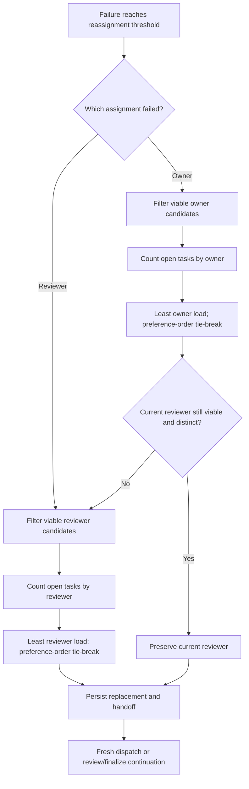

# Sidecar Acceptance Packet: ODP-ORCH-AGENT-LOAD-BALANCE-001

## Packet identity

- Sidecar task: `ODP-ORCH-AGENT-LOAD-BALANCE-001-SIDECAR-ACCEPTANCE`
- Parent task: `ODP-ORCH-AGENT-LOAD-BALANCE-001`
- Helper kind: `acceptance_packet`
- Sidecar owner / reviewer: `Claude` / `Codex9`
- Parent owner / reviewer: `Claude` / `Codex`
- Parent PR: `#730`
- Parent branch: `task/ODP-ORCH-AGENT-LOAD-BALANCE-001`
- Parent HEAD evaluated: `5dd1ea0c7182ee03b1e297d6c2bdd2207896af23`
- Evidence captured: `2026-08-08T16:05:29Z` (round 2)
- Scope: acceptance checklist, dependency map, and handoff guidance only. This
  sidecar does not choose or modify canonical runtime behavior.

### Revision history

| Round | Owner | Parent HEAD | Disposition |
| --- | --- | --- | --- |
| 1 (`b9a5496d`) | `Codex9` | `96500cc0` | Blocked: owner-only failure replaced a healthy reviewer. |
| 2 (this revision) | `Claude` | `5dd1ea0c` | Blocker resolved and re-verified; packet checklist satisfied except PR merge. |

The sidecar was helper-claimed from `Codex9` to `Claude` after round 1, so the
owner/reviewer pair above is inverted relative to the round-1 commit trailers.

## Current disposition

**The blocker recorded in round 1 is resolved. Parent HEAD `5dd1ea0c` satisfies
every behavioral item in this checklist. The only outstanding acceptance gate is
mechanical: PR `#730` must merge into `dev`.**

Parent commit `77aa8c9d` ("keep a viable reviewer on owner failure") fixes the
round-1 regression, and `5dd1ea0c` composes that fix with `origin/dev@d1c1d66d`.
The parent task is already `review_approved` with `approved_head`
`5dd1ea0c`, and its `task-review-gate` is green on that exact HEAD.

At round-2 capture, PR `#730` is `OPEN` / `BLOCKED`, with `orchestrator`,
`performance-gate`, and `task-review-gate` green and `product` plus
`product-e2e-gate` still in progress. The PR diff is still limited to
`.orchestrator/supervisor.py` and `.orchestrator/test_supervisor.py`. `BLOCKED`
here reflects the in-flight required checks, not a content defect.

## Intended behavior boundary

The parent change may alter candidate selection after existing viability checks
have completed. It must not alter candidate eligibility, task lifecycle,
failure classification, persistence semantics, or unrelated dispatch policy.

The intended behavior is:

1. Gather candidates that already pass the existing exclusion, human-gate,
   enabled/provider, runtime-block, dispatch-pause, quota, and task-lane checks.
2. For an owner replacement, choose the viable candidate with the smallest
   open owner workload.
3. For a reviewer replacement, choose the viable candidate with the smallest
   open reviewer workload.
4. Preserve caller preference order as the deterministic tie-break.
5. When an owner fails but the current reviewer remains valid and distinct from
   the new owner, preserve that reviewer. Do not treat owner replacement as an
   implicit reviewer-rebalancing event.
6. Replace the reviewer only when the reviewer is the failed assignment, is no
   longer viable, or would conflict with the selected owner.

All six hold at `5dd1ea0c`. See § Evidence at evaluated parent HEAD.

## Dependency map



| Dependency / boundary | Required input | Acceptance consequence |
| --- | --- | --- |
| Status board | Current non-terminal task assignments | Load counts must be derived from the supplied/current status and omit finished work. |
| Viability filters | Agent config, runtime state, task, exclusions, provider report | Load must never make an ineligible candidate selectable. |
| Assignment role | Explicit `owner` or `reviewer` context | Owner choice uses owner counts; reviewer choice uses reviewer counts. |
| Existing reviewer | Current reviewer plus selected new owner | A healthy, distinct reviewer is retained during owner-only recovery. |
| Candidate ordering | Caller-provided preferred list | Equal load resolves deterministically in existing preference order. |
| Persistence and handoff | Selected owner/reviewer pair | Existing task requeue, handoff, activity-log, and failure-streak cleanup semantics remain unchanged. |
| Branch / CI | Parent branch refreshed against current `dev` | Final evidence must apply to the exact reviewed HEAD with no unrelated PR files and all required checks green. |

The parent task declares no formal task dependency. The items above are
behavioral and verification dependencies, not new task graph edges.

## Parent acceptance checklist

Checked boxes were verified by this sidecar at parent HEAD `5dd1ea0c`.

### Scope and composition

- [x] The parent PR diff contains only the intended supervisor implementation
  and focused tests; no L1 canonical document, status truth, registry, config,
  governance file, or unrelated support artifact is changed.
  Verified: the diff against the `origin/dev` merge base is
  `.orchestrator/supervisor.py` (+41/-13) and `.orchestrator/test_supervisor.py`
  (+120), and GitHub reports the same two files on PR `#730`.
- [x] The final parent HEAD is composed with current `dev`, and verification is
  rerun after that composition. `5dd1ea0c` is the merge of `origin/dev@d1c1d66d`
  into the task branch, and round-2 verification was run on that HEAD.
- [x] This packet remains advisory support material. The parent owner decides
  whether to absorb its recommendations.

### Candidate selection

- [x] Zero viable candidates returns `None`.
- [x] A single candidate retains the existing viability-only fast path and does
  not require a board read.
- [x] Multiple viable owner candidates select the smallest open owner workload.
- [x] Multiple viable reviewer candidates select the smallest open reviewer
  workload when reviewer replacement is required.
- [x] Equal workloads preserve original candidate order.
- [x] Explicit exclusions and all pre-existing viability checks take precedence
  over low workload.
- [x] Finished/archived work does not contribute to load. The accepted set of
  open statuses is explicit (`AGENT_OPEN_TASK_STATUSES`) and covered by tests.

Covered by the seven `AgentLoadBalancingTests` cases, all passing.

### Reassignment invariants

- [x] A failure of the owner alone does not replace a healthy current reviewer.
  `maybe_reassign_task_after_worker_failure` now re-checks only the incumbent
  reviewer with `balance_load=False`, and falls back to reviewer-load selection
  solely when that incumbent is not viable.
- [x] A failure of the assigned reviewer selects a viable replacement using
  reviewer workload (`first_viable_agent(..., role="reviewer")`).
- [x] If the selected owner conflicts with the current reviewer, the reviewer
  replacement path selects a distinct viable agent deterministically: the
  incumbent check excludes `new_owner`, so a conflicting reviewer falls through
  to the reviewer-load path.
- [x] Human-gate and sidecar-only assignment restrictions remain enforced for
  both roles. The `is_human_gate_agent` guards and
  `get_agent_reassignment_candidates(..., task=task)` lane filtering are
  untouched; `role=` only reaches the count function.
- [x] Existing task status transitions, handoff target, reassignment log fields,
  and failure-streak cleanup are unchanged outside the selected agent names.

Also checked in this round: `normalize_mainline_task_assignment` preserves the
same invariant independently. It returns early when owner and reviewer are both
allowed, and enters the reviewer branch only when the reviewer is unset, not
allowed, or equal to the newly selected owner, so its added `role="reviewer"`
argument cannot churn a healthy reviewer either.

### Required regression evidence

- [x] `AgentLoadBalancingTests` passes, including least-load selection,
  tie-breaking, exclusions, the single-candidate fast path, finished-work
  omission, role-aware counts, and reviewer-role selection.
- [x]
  `WorkerReassignmentTests.test_reassigns_owned_task_to_new_owner_after_repeated_failure`
  passes and retains reviewer `Claude` in its fixture.
- [x]
  `WorkerPreemptionSyncTests.test_reassigns_finalize_task_to_new_owner_after_repeated_failure`
  passes and retains reviewer `Codex` in its fixture.
- [x] A focused regression test states directly that an owner-only failure
  preserves a viable current reviewer:
  `test_owner_failure_keeps_a_viable_reviewer_however_loaded` asserts the
  incumbent reviewer `Claude` is kept while holding four open reviews against a
  zero-load alternative.
- [x] A focused regression test covers forced reviewer replacement and proves
  reviewer-load selection still applies in that branch:
  `test_reviewer_replacement_still_balances_reviewer_load` disables the
  incumbent reviewer and asserts the lower-load `Codex2` wins over the
  preference-ordered `Codex`.
- [x] The full non-live orchestrator suite and lint pass on the exact parent HEAD.
- [ ] All required PR checks, including `orchestrator` and `task-review-gate`,
  are green for the exact reviewed parent HEAD, and the PR merges into `dev`.
  `orchestrator`, `performance-gate`, and `task-review-gate` are green at
  round-2 capture; `product` and `product-e2e-gate` are still running. This is
  the only item the parent owner still has to close.

## Evidence at evaluated parent HEAD

Round-2 verification ran against a `git archive` extraction of exact parent HEAD
`5dd1ea0c`, isolated from any worker worktree state.

```text
PYTHONPATH=.orchestrator python3 -m pytest -q .orchestrator/test_supervisor.py
# 386 tests collected, exit 0

PYTHONPATH=.orchestrator python3 -m pytest -q \
  .orchestrator/test_supervisor.py::AgentLoadBalancingTests \
  .orchestrator/test_supervisor.py::WorkerReassignmentTests::test_reassigns_owned_task_to_new_owner_after_repeated_failure \
  .orchestrator/test_supervisor.py::WorkerPreemptionSyncTests::test_reassigns_finalize_task_to_new_owner_after_repeated_failure
# ......... (9 passed), exit 0

ruff check .orchestrator/supervisor.py .orchestrator/test_supervisor.py
# All checks passed!
```

### Round-1 blocker, now closed

Round 1 evaluated `96500cc0` and reported two failures where owner-only recovery
replaced a healthy reviewer:

| Scenario | Expected reviewer | Round 1 (`96500cc0`) | Round 2 (`5dd1ea0c`) |
| --- | --- | --- | --- |
| In-progress owner fails with reviewer still healthy | `Claude` | `Grok` (fail) | `Claude` (pass) |
| Finalize owner fails with reviewer still healthy | `Codex` | `Gemini` (fail) | `Codex` (pass) |

GitHub run `31264000853` had independently reproduced the round-1 failures
(`2 failed, 986 passed, 10 deselected, 277 subtests passed`). The `orchestrator`
check is green on the current PR head, consistent with the local round-2 result.

## Recommended remaining action

For the parent owner, no further implementation work is indicated by this
packet. Remaining steps are closeout mechanics:

1. Let the in-flight `product` and `product-e2e-gate` checks finish on `#730`.
2. Merge `#730` into `dev`. Do not base-advance the branch: `approved_head`
   `5dd1ea0c` is frozen and re-pointing it would invalidate the approval and
   force a re-review.
3. Run closeout for `ODP-ORCH-AGENT-LOAD-BALANCE-001` only after GitHub reports
   the PR merged.

If the branch does have to move for an unrelated reason, rerun the round-2
command block above on the new HEAD and record the new SHA here before
re-approving.

## Handoff and absorption

- Sidecar owner: `Claude`
- Sidecar reviewer: `Codex9`
- Parent owner: `Claude`
- Parent reviewer: `Codex`
- Requested sidecar action: confirm that this round-2 refresh accurately
  represents parent HEAD `5dd1ea0c` — specifically the resolved blocker, the
  checked invariants, and the single open PR-merge item — then approve or
  request packet-only corrections.
- Requested parent action: none beyond merging `#730` and finalizing closeout.
- Absorption rule: the parent owner decides how to implement or reference this
  packet. This sidecar makes no runtime, registry, governance, or canonical
  truth change.

## Scope conformance

This sidecar adds only:

`support/sidecars/ODP-ORCH-AGENT-LOAD-BALANCE-001/ODP-ORCH-AGENT-LOAD-BALANCE-001-SIDECAR-ACCEPTANCE.md`

It intentionally does not modify `.orchestrator/supervisor.py`,
`.orchestrator/test_supervisor.py`, status truth, L1 canonical documents,
runtime contracts, registry, config, or governance implementation.
