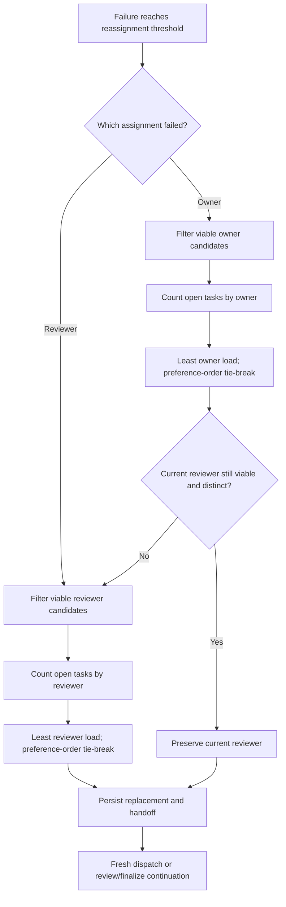

# Sidecar Acceptance Packet: ODP-ORCH-AGENT-LOAD-BALANCE-001

## Packet identity

- Sidecar task: `ODP-ORCH-AGENT-LOAD-BALANCE-001-SIDECAR-ACCEPTANCE`
- Parent task: `ODP-ORCH-AGENT-LOAD-BALANCE-001`
- Helper kind: `acceptance_packet`
- Sidecar owner / reviewer: `Codex9` / `Claude`
- Parent owner / reviewer: `Claude` / `Codex`
- Parent PR: `#730`
- Parent branch: `task/ODP-ORCH-AGENT-LOAD-BALANCE-001`
- Parent HEAD evaluated: `96500cc099d69e6dc3cba7809729c799c10e4cc3`
- Evidence captured: `2026-08-08T15:52:23Z`
- Scope: acceptance checklist, dependency map, and handoff guidance only. This
  sidecar does not choose or modify canonical runtime behavior.

## Current disposition

**The packet is ready for sidecar review. Parent HEAD `96500cc0` is not ready
for acceptance.**

The least-loaded selection and role-aware counting tests pass, but owner-failure
reassignment currently replaces a healthy existing reviewer. That behavior
breaks two established reassignment tests and the parent PR's orchestrator CI
job. Parent acceptance therefore depends on preserving the current reviewer
when only the owner must be replaced, while retaining reviewer-load balancing
for paths where a reviewer replacement is actually required.

At evidence capture, PR `#730` is open. Its PR diff is limited to
`.orchestrator/supervisor.py` and `.orchestrator/test_supervisor.py`; product,
performance, and product end-to-end checks pass, while `orchestrator` and
`task-review-gate` fail.

## Intended behavior boundary

The parent change may alter candidate selection after existing viability checks
have completed. It must not alter candidate eligibility, task lifecycle,
failure classification, persistence semantics, or unrelated dispatch policy.

The intended behavior is:

1. Gather candidates that already pass the existing exclusion, human-gate,
   enabled/provider, runtime-block, dispatch-pause, quota, and task-lane checks.
2. For an owner replacement, choose the viable candidate with the smallest
   open owner workload.
3. For a reviewer replacement, choose the viable candidate with the smallest
   open reviewer workload.
4. Preserve caller preference order as the deterministic tie-break.
5. When an owner fails but the current reviewer remains valid and distinct from
   the new owner, preserve that reviewer. Do not treat owner replacement as an
   implicit reviewer-rebalancing event.
6. Replace the reviewer only when the reviewer is the failed assignment, is no
   longer viable, or would conflict with the selected owner.

## Dependency map



| Dependency / boundary | Required input | Acceptance consequence |
| --- | --- | --- |
| Status board | Current non-terminal task assignments | Load counts must be derived from the supplied/current status and omit finished work. |
| Viability filters | Agent config, runtime state, task, exclusions, provider report | Load must never make an ineligible candidate selectable. |
| Assignment role | Explicit `owner` or `reviewer` context | Owner choice uses owner counts; reviewer choice uses reviewer counts. |
| Existing reviewer | Current reviewer plus selected new owner | A healthy, distinct reviewer is retained during owner-only recovery. |
| Candidate ordering | Caller-provided preferred list | Equal load resolves deterministically in existing preference order. |
| Persistence and handoff | Selected owner/reviewer pair | Existing task requeue, handoff, activity-log, and failure-streak cleanup semantics remain unchanged. |
| Branch / CI | Parent branch refreshed against current `dev` | Final evidence must apply to the exact reviewed HEAD with no unrelated PR files and all required checks green. |

The parent task declares no formal task dependency. The items above are
behavioral and verification dependencies, not new task graph edges.

## Parent acceptance checklist

### Scope and composition

- [ ] The parent PR diff contains only the intended supervisor implementation
  and focused tests; no L1 canonical document, status truth, registry, config,
  governance file, or unrelated support artifact is changed.
- [ ] The final parent HEAD is composed with current `dev`, and verification is
  rerun after that composition.
- [ ] This packet remains advisory support material. The parent owner decides
  whether to absorb its recommendations.

### Candidate selection

- [ ] Zero viable candidates returns `None`.
- [ ] A single candidate retains the existing viability-only fast path and does
  not require a board read.
- [ ] Multiple viable owner candidates select the smallest open owner workload.
- [ ] Multiple viable reviewer candidates select the smallest open reviewer
  workload when reviewer replacement is required.
- [ ] Equal workloads preserve original candidate order.
- [ ] Explicit exclusions and all pre-existing viability checks take precedence
  over low workload.
- [ ] Finished/archived work does not contribute to load. The accepted set of
  open statuses is explicit and covered by tests.

### Reassignment invariants

- [ ] A failure of the owner alone does not replace a healthy current reviewer.
- [ ] A failure of the assigned reviewer selects a viable replacement using
  reviewer workload.
- [ ] If the selected owner conflicts with the current reviewer, the reviewer
  replacement path selects a distinct viable agent deterministically.
- [ ] Human-gate and sidecar-only assignment restrictions remain enforced for
  both roles.
- [ ] Existing task status transitions, handoff target, reassignment log fields,
  and failure-streak cleanup are unchanged outside the selected agent names.

### Required regression evidence

- [ ] `AgentLoadBalancingTests` passes, including least-load selection,
  tie-breaking, exclusions, the single-candidate fast path, finished-work
  omission, role-aware counts, and reviewer-role selection.
- [ ]
  `WorkerReassignmentTests.test_reassigns_owned_task_to_new_owner_after_repeated_failure`
  passes and retains reviewer `Claude` in its fixture.
- [ ]
  `WorkerPreemptionSyncTests.test_reassigns_finalize_task_to_new_owner_after_repeated_failure`
  passes and retains reviewer `Codex` in its fixture.
- [ ] A focused regression test states directly that an owner-only failure
  preserves a viable current reviewer.
- [ ] A focused regression test covers forced reviewer replacement (failed,
  non-viable, or owner-conflicting reviewer) and proves reviewer-load selection
  still applies in that branch.
- [ ] The full non-live orchestrator suite and lint pass on the exact parent HEAD.
- [ ] All required PR checks, including `orchestrator` and `task-review-gate`,
  are green for the exact reviewed parent HEAD.

## Evidence at evaluated parent HEAD

### Passing behavior

The seven tests in `AgentLoadBalancingTests` pass at `96500cc0`. They cover the
core least-load selector, deterministic tie-breaking, exclusions, the
single-candidate fast path, omission of finished tasks, role-aware counting,
and reviewer-role selection.

### Blocking regressions

The following isolated verification was run against a `git archive` of exact
parent HEAD `96500cc0`:

```text
PYTHONPATH=.orchestrator uv run pytest -q \
  .orchestrator/test_supervisor.py::AgentLoadBalancingTests \
  .orchestrator/test_supervisor.py::WorkerReassignmentTests::test_reassigns_owned_task_to_new_owner_after_repeated_failure \
  .orchestrator/test_supervisor.py::WorkerPreemptionSyncTests::test_reassigns_finalize_task_to_new_owner_after_repeated_failure

.......FF
```

Observed mismatches:

| Scenario | Expected reviewer | Actual reviewer | Result |
| --- | --- | --- | --- |
| In-progress owner fails with reviewer still healthy | `Claude` | `Grok` | Fail |
| Finalize owner fails with reviewer still healthy | `Codex` | `Gemini` | Fail |

GitHub run `31264000853` independently reports the same two failures in the
full non-live suite: `2 failed, 986 passed, 10 deselected, 277 subtests passed`.
This is the active acceptance blocker, not a test-only discrepancy: changing a
healthy reviewer creates an unnecessary assignment and handoff mutation.

## Recommended focused verification

After the parent owner updates the implementation, run at minimum:

```text
PYTHONPATH=.orchestrator uv run pytest -q \
  .orchestrator/test_supervisor.py::AgentLoadBalancingTests \
  .orchestrator/test_supervisor.py::WorkerReassignmentTests::test_reassigns_owned_task_to_new_owner_after_repeated_failure \
  .orchestrator/test_supervisor.py::WorkerPreemptionSyncTests::test_reassigns_finalize_task_to_new_owner_after_repeated_failure

uv run ruff check .orchestrator/supervisor.py .orchestrator/test_supervisor.py
uv run pytest -m "not requires_live_env" .orchestrator scripts
```

The parent reviewer should record the exact verified HEAD and confirm that the
PR file list remains the two intended `.orchestrator` files before approval.

## Handoff and absorption

- Sidecar reviewer: `Claude`
- Parent owner: `Claude`
- Parent reviewer: `Codex`
- Requested sidecar action: verify that this packet accurately captures the
  acceptance boundary and current blocker, then approve or request packet-only
  corrections.
- Requested parent action: preserve a healthy reviewer during owner-only
  recovery, add the focused branch tests above, and rerun full verification.
- Absorption rule: the parent owner decides how to implement or reference this
  packet. This sidecar makes no runtime, registry, governance, or canonical
  truth change.

## Scope conformance

This sidecar adds only:

`support/sidecars/ODP-ORCH-AGENT-LOAD-BALANCE-001/ODP-ORCH-AGENT-LOAD-BALANCE-001-SIDECAR-ACCEPTANCE.md`

It intentionally does not modify `.orchestrator/supervisor.py`,
`.orchestrator/test_supervisor.py`, status truth, L1 canonical documents,
runtime contracts, registry, config, or governance implementation.
