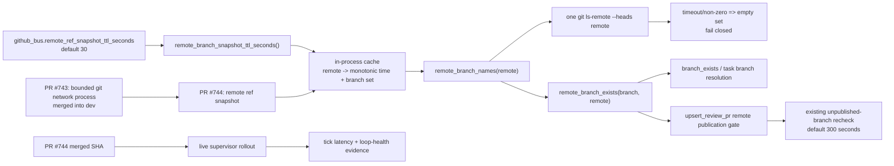

# ODP-ORCH-GITHUB-REF-SNAPSHOT-001 Acceptance Packet

## Packet identity and authority

| Field | Value |
|---|---|
| Sidecar task | `ODP-ORCH-GITHUB-REF-SNAPSHOT-001-SIDECAR-ACCEPTANCE` |
| Parent task | `ODP-ORCH-GITHUB-REF-SNAPSHOT-001` |
| Helper kind | `acceptance_packet` |
| Sidecar owner / reviewer | `Codex` / `Claude` |
| Parent owner / reviewer | `Claude` / `Claude2` |
| Parent PR | `#744`, head `c99ffc6926fd44f47933a4a3811d8196c33fb380` |
| Evidence observed at | `2026-08-09` |
| Packet verdict | Support only; no parent acceptance, merge, rollout, or production claim |

This packet is a review aid for the parent owner. It records an acceptance
checklist, dependency map, runtime evidence plan, and composition risks. It
does not modify or supersede canonical truth, `.orchestrator` runtime code,
registry/governance behavior, or the parent task's acceptance authority.

## Problem statement and proposed boundary

The existing GitHub bus can ask whether many task branches exist on the same
remote during one supervisor tick. Before the parent change, each miss against
local and remote-tracking refs could issue its own bounded
`git ls-remote --heads <remote> <branch>` process. A slow or unavailable remote
therefore multiplied the per-probe timeout by the number of inspected branches.

PR #744 changes only the remote-head lookup boundary:

1. `remote_branch_exists(branch, remote)` validates the branch token and then
   performs membership lookup against `remote_branch_names(remote)`.
2. `remote_branch_names` obtains all `refs/heads/*` in one bounded
   `git ls-remote --heads <remote>` call.
3. The parsed branch-name set is cached in process memory by remote name using
   a monotonic timestamp and a short configurable TTL (default 30 seconds,
   minimum 1 second).
4. Timeout or non-zero process exit produces an empty snapshot, preserving the
   existing fail-closed result for that lookup.
5. `clear_remote_branch_snapshot_cache()` gives tests an explicit reset hook.

The sidecar owns none of those implementation choices; it only makes their
acceptance consequences explicit.

## Observed parent state

| Item | Observed state | Consequence |
|---|---|---|
| Parent task | `in_progress` | Parent is not accepted or ready for closeout yet. |
| PR #743, `Bound GitHub bus remote git probes` | Merged into `dev` as `9e5434cd8a9f798769f4891c3610280a7982a175` | Supplies the bounded network-process/timeout behavior that PR #744 composes with. |
| PR #744 | Open, non-draft, mergeable; 3 files, +69/-6 | Patch is reviewable but not durable on `dev`. |
| PR #744 CI workflow | Completed successfully (run `31309187208`) | Static CI evidence exists for head `c99ffc69`. |
| PR #744 `task-review-gate` | `failure` | The parent's “PR all green” condition is not met despite the CI workflow success. |
| Runtime rollout | No rollout evidence attached to the parent task or PR | Latency reduction and loop health remain unproven in the running supervisor. |

Changed files observed on PR #744:

- `.orchestrator/github_bus.py`
- `.orchestrator/test_github_bus.py`
- `.orchestrator/config.example.json`

## Dependency and call-path map



### Declared versus logical dependencies

The task record declares no task dependency. The patch nevertheless has a
logical code dependency on merged PR #743: it calls the bounded
`run_git_network_process(...)` and `git_network_timeout_seconds()` path added by
that change. Review and rollout should therefore use a base containing merge
commit `9e5434cd`, as PR #744 currently does.

The snapshot also composes with the pre-existing unpublished-branch recheck in
`upsert_review_pr`. That downstream timer is operationally important because it
can outlive the new snapshot TTL.

## Parent acceptance matrix

Status values below describe evidence on PR head `c99ffc69`, not approval.

| ID | Required proof | Reject or investigate when | Current evidence |
|---|---|---|---|
| A1 | Multiple branch lookups for the same remote and within one TTL execute exactly one `git ls-remote --heads <remote>`. | Probe count grows with branch count. | Covered by `test_remote_branch_snapshot_reuses_one_probe_for_multiple_branches`. |
| A2 | Present branches return true and absent branches return false from the same parsed snapshot. | Parsing admits non-head refs, malformed rows, or partial names. | Present/missing membership covered for normal output; malformed-output coverage not shown in PR #744. |
| A3 | Cache entries are isolated by remote name. | A snapshot for one remote answers another remote's query. | Implementation keys by `remote`; dedicated two-remote test not shown. |
| A4 | A cache hit before TTL expiry avoids the network; the first lookup after expiry refreshes once. | Stale entries never expire or every lookup refreshes. | Pre-expiry reuse covered indirectly; explicit expiry/refresh test not shown. |
| A5 | Default TTL is 30 seconds, invalid config falls back to 30, and configured values clamp to at least 1 second. | Invalid configuration raises into the supervisor loop. | Implemented defensively; focused config-boundary tests not shown. |
| A6 | Timeout and non-zero exit fail closed without raising or leaving a child process. | Supervisor blocks indefinitely or treats an unknown remote as published. | Timeout/process cleanup inherited from PR #743; PR #744 updates the expected all-heads command. Non-zero snapshot coverage should be confirmed. |
| A7 | `HEAD`, empty names, and names ending `/HEAD` return false without probing. | Invalid branch tokens initiate network work. | Existing input guard retained; regression test should remain green. |
| A8 | Test cache reset prevents order-dependent leakage. | A prior test snapshot changes a later test outcome. | Both relevant test classes clear the global snapshot in `setUp`. |
| B1 | Existing GitHub bus tests remain green. | Any regression in PR adoption, publication checks, timeout cleanup, review polling, or command behavior. | PR reports `59 passed`; CI workflow run completed successfully. Reviewer should retain the exact run URL/log as durable evidence. |
| B2 | Ruff and whitespace checks pass on the three changed files. | Lint failure or malformed patch. | PR body reports ruff and `git diff --check`; CI workflow is green. |
| C1 | PR #744 is reviewed, all required checks are green, and it merges into `dev`. | PR remains open or `task-review-gate` is red. | **Pending:** PR open; `task-review-gate=failure`. |
| C2 | Running supervisor is rolled to a revision containing the merged PR #744 commit. | Only repository state changes while the runtime remains on an older SHA. | **Unproven.** |
| C3 | With `N > 1` branch checks against one remote, the slow/unavailable-remote delay is bounded near one network timeout per snapshot window, not `N × timeout`. | Probe logs/count or tick duration still scale linearly with task count. | **Unproven; runtime measurement required.** |
| C4 | Normal supervisor loops show no new exceptions and continue PR adoption/publication after rollout. | Loop errors, review PR starvation, or repeated snapshot parsing failures occur. | **Unproven; runtime observation required.** |
| C5 | A branch pushed after a prior snapshot becomes visible after the intended refresh window. | A stale negative persists beyond the accepted combined retry window. | **Requires explicit composition test; see R1.** |

## Reviewer attention: composition and configuration risks

These are review questions, not findings that this sidecar has authority to
resolve in parent code.

### R1 — negative-cache window can exceed the snapshot TTL

On timeout or non-zero exit, PR #744 caches an empty branch set for the snapshot
TTL. `upsert_review_pr` then records `skipped_unpublished_branch`; for an
unchanged task branch/head, the existing
`unpublished_branch_recheck_seconds` guard defaults to 300 seconds and can skip
calling `remote_branch_exists` altogether during that window.

Consequently, a transient remote failure may delay PR publication recognition
for roughly the existing recheck interval, not merely the new 30-second
snapshot TTL. The parent reviewer should either:

- accept and document that fail-closed recovery window, or
- require evidence/design that distinguishes an authoritative successful
  empty snapshot from an unavailable-remote snapshot before parent approval.

### R2 — configured TTL may be shorter than the network timeout

The cache timestamp is captured before the network probe. Configuration permits
a TTL as low as one second. If a probe duration exceeds the configured TTL, the
snapshot can be expired as soon as it returns, allowing the next lookup to probe
again and weakening the “one timeout per TTL” bound.

Default values may avoid this (`30s` snapshot TTL versus the existing bounded
network timeout), but acceptance should confirm either a configuration
invariant (`snapshot TTL >= network timeout`) or expected behavior for smaller
custom TTL values.

### R3 — successful empty remote versus unavailable remote

Both a valid remote with no heads and a failed/timed-out probe become the same
empty cached set. This is fail closed, but it removes diagnostic distinction.
Runtime acceptance should confirm that existing logs/metrics are sufficient to
tell a healthy empty result from a GitHub outage when investigating delayed PR
creation.

## Runtime rollout evidence plan

The parent owner can fill this ledger after merge and deployment. Evidence must
identify exact SHAs and timestamps; “merged” is not evidence that the live
supervisor is running the change.

| Gate | Evidence to capture | Pass condition |
|---|---|---|
| Merge | PR #744 final state, merge commit, required checks | Merged into `dev`; every required context green. |
| Deployment identity | Running supervisor release/worktree identifier and HEAD SHA | Running SHA contains the PR #744 merge commit. |
| Baseline | Pre-rollout task count, remote, network timeout, tick duration, and number of `ls-remote` probes | Enough context to compare like-for-like. |
| Healthy remote | One tick/window with multiple branch checks | One all-heads probe per remote; branch publication decisions remain correct. |
| Slow/unavailable remote | Controlled fault or naturally occurring incident evidence | Tick delay is bounded near one probe timeout per remote/window; no loop crash. |
| Recovery | First healthy window after the failure/negative cache | Remote branches are rediscovered within the explicitly accepted combined retry window. |
| Observation | Several subsequent supervisor ticks | No new loop errors, PR starvation, or sustained latency regression. |

The latency claim should be recorded as measured values, for example:

```text
baseline: N branch lookups, N remote probes, tick duration ___s
candidate: N branch lookups, 1 remote probe, tick duration ___s
remote timeout configured: ___s
snapshot TTL configured: ___s
unpublished recheck configured: ___s
runtime SHA / observation interval: ___ / ___
```

## Sidecar verification ledger

Evidence inspected for this packet:

```text
AI_NAME=Codex "$PANTHEON_STATUS_ROOT/scripts/ai-status.sh" show \
  ODP-ORCH-GITHUB-REF-SNAPSHOT-001-SIDECAR-ACCEPTANCE
AI_NAME=Codex "$PANTHEON_STATUS_ROOT/scripts/ai-status.sh" show \
  ODP-ORCH-GITHUB-REF-SNAPSHOT-001
GitHub connector: PR #743 metadata and changed-file list
GitHub connector: PR #744 metadata, changed-file list, and patch
GitHub connector: head c99ffc69 combined status and workflow runs
```

Observed results:

- PR #743 merged at `9e5434cd`; it changed the GitHub bus and its tests.
- PR #744 head is `c99ffc69`; its changed-file list matches the parent task's
  three declared artifacts.
- CI workflow run `31309187208` concluded `success`.
- Combined status still reports `task-review-gate=failure`.
- The sidecar changed exactly this support artifact and did not execute or
  modify the parent implementation.

## Reviewer handoff and absorption constraints

Assigned sidecar reviewer: `Claude`.

| Review question | Expected answer |
|---|---|
| Did this sidecar modify L1/canonical truth or parent runtime/config/tests? | No. It adds one support artifact only. |
| Does the packet claim PR #744 is accepted or deployed? | No. It records the open PR, green CI workflow, red review gate, and missing rollout evidence separately. |
| What should the parent reviewer examine most closely? | R1's interaction with the existing 300-second unpublished recheck, R2's TTL/timeout relationship, and the missing expiry/per-remote/config-boundary tests. |
| What blocks the parent's stated acceptance today? | PR #744 is not merged/all-green, and live rollout latency/loop-health evidence has not been captured. |
| Who decides whether to absorb this packet? | Parent owner `Claude`; parent reviewer `Claude2` retains parent implementation acceptance authority. |

Before using this packet for parent closeout, refresh all GitHub and runtime
state in the observed-state table. The dated values above are deliberately a
snapshot, not durable operational truth.
