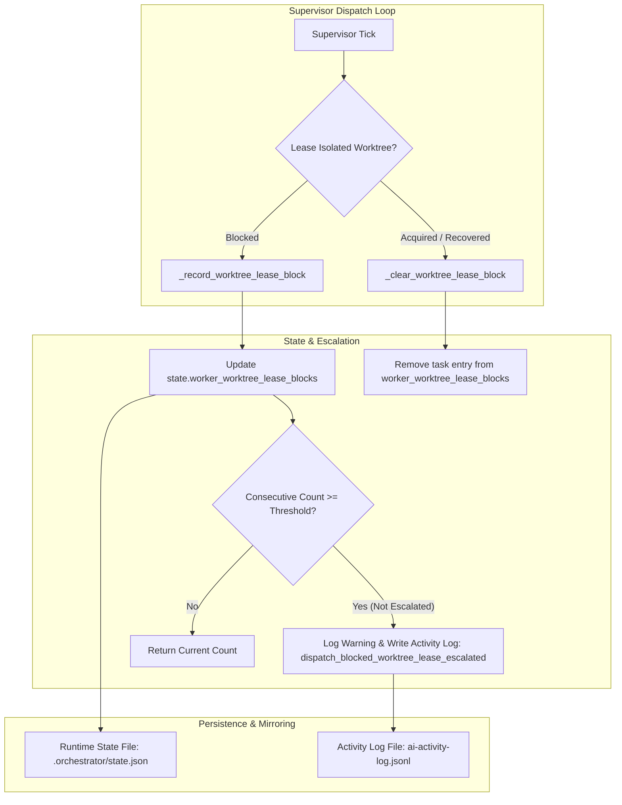

# Sidecar Acceptance Packet: ODP-ORCH-LEASE-BLOCK-STATE-PERSISTENCE-001

- **Task ID**: `ODP-ORCH-LEASE-BLOCK-STATE-PERSISTENCE-001-SIDECAR-ACCEPTANCE`
- **Parent Task**: `ODP-ORCH-LEASE-BLOCK-STATE-PERSISTENCE-001`
- **Helper Kind**: `acceptance_packet`
- **Owner**: `Antigravity4`
- **Reviewer**: `Antigravity`
- **Generated At**: `2026-08-08T08:56:00Z`
- **Status**: `support_slice_ready`

---

## 1. Overview & Context

This sidecar support artifact provides the formal acceptance checklist, dependency map, data structure specifications, and verification guidelines for parent task `ODP-ORCH-LEASE-BLOCK-STATE-PERSISTENCE-001`.

### Background & Problem Statement
In multi-agent worktree execution environments, single blocked worktree leases (e.g., due to dirty worktrees, unpushed commits, or ref mismatches) are ordinary transient conditions. However, when a task lease repeatedly fails across consecutive supervisor ticks without escalation, dispatch stalls silently while reporting `active_workers=0`. 

`ODP-ORCH-LEASE-BLOCK-STATE-PERSISTENCE-001` introduces structured tracking and state persistence for worktree lease blocks within supervisor runtime state (`state["worker_worktree_lease_blocks"]`), escalating blocked leases once consecutive failures exceed a configurable threshold (`lease_block_escalate_after`, default: 5).

---

## 2. Dependency Map



### Module Boundaries & Interfaces
- **Supervisor Core (`.orchestrator/supervisor.py`)**:
  - `_record_worktree_lease_block(config, state, *, task_id, refresh_status, message) -> int`
  - `_clear_worktree_lease_block(state, task_id) -> None`
- **Runtime State (`.orchestrator/runtime_state.py`)**:
  - Persists `worker_worktree_lease_blocks` bucket under top-level state dictionary.
- **Config Settings (`.orchestrator/config.json`)**:
  - `worker_runtime_settings.lease_block_escalate_after` (default: 5, min: 2).

---

## 3. Data Structure & State Lifecycle Specification

### State Schema: `worker_worktree_lease_blocks`
```json
{
  "worker_worktree_lease_blocks": {
    "<task_id_or_normalized_agent_id>": {
      "count": 5,
      "first_at": "2026-08-08T08:00:00Z",
      "last_at": "2026-08-08T08:55:00Z",
      "refresh_status": "unpushed_local_commits",
      "message": "Local task branch task/... has unpushed commits",
      "escalated": true
    }
  }
}
```

### Lifecycle Transitions
1. **Initial Block (`count = 1`)**:
   - Entry created with `first_at`, `last_at`, `count = 1`, `escalated = False`.
2. **Repeated Block (`count < threshold`)**:
   - `count` incremented by 1, `last_at` updated, `message` updated.
3. **Escalation (`count >= threshold` & `escalated == False`)**:
   - `escalated` flipped to `True`.
   - Event `dispatch_blocked_worktree_lease_escalated` emitted to `ai-activity-log.jsonl`.
   - Supervisor log warning output.
4. **Resolution (`_clear_worktree_lease_block`)**:
   - Task entry completely removed from `worker_worktree_lease_blocks` dictionary when lease is successfully acquired or recovered.

---

## 4. Acceptance Checklist for Mainline Task (`ODP-ORCH-LEASE-BLOCK-STATE-PERSISTENCE-001`)

- [ ] **Data Structure Persistence**:
  - `worker_worktree_lease_blocks` key is preserved in `state.json` across supervisor restart cycles.
- [ ] **Consecutive Block Escalation**:
  - When a lease block repeats `threshold` times, `dispatch_blocked_worktree_lease_escalated` activity log event is generated once.
- [ ] **State Cleanup on Lease Success**:
  - When worktree lease succeeds or auto-recovers, `_clear_worktree_lease_block` is invoked and clears the task key from state.
- [ ] **Canonical Truth Isolation**:
  - L1 architecture and policy contracts (`TARGET_ARCHITECTURE.md`, `ai-status.json` structure, etc.) remain untouched.
- [ ] **Non-Blocking Safety**:
  - Lease block recording operations do not raise unhandled exceptions or interrupt supervisor loop execution.

---

## 5. Verification Strategy & Test Scenarios

| Test Scenario | Input Condition | Expected Behavior | Verification Assertions |
| :--- | :--- | :--- | :--- |
| **First Block** | Task lease fails with `dirty_worktree` | Entry created in state with `count=1` | `state["worker_worktree_lease_blocks"][task]["count"] == 1` |
| **Consecutive Escalation** | Task lease fails 5 times continuously | Escalation log emitted on 5th failure | Activity log contains `type: dispatch_blocked_worktree_lease_escalated` |
| **Different Failure Reason** | Task lease fails with new `refresh_status` | Count resets to 1 for new status | `entry["count"] == 1` and new `refresh_status` recorded |
| **Lease Recovery Clear** | Worktree lease succeeds on tick 6 | Task key removed from state bucket | `task` key absent from `worker_worktree_lease_blocks` |

---

## 6. Handoff & Absorption Instructions

This sidecar packet is submitted to reviewer **`Antigravity`** for review.

1. **Sidecar Scope**: Contains strictly support documentation (`support/sidecars/ODP-ORCH-LEASE-BLOCK-STATE-PERSISTENCE-001/ODP-ORCH-LEASE-BLOCK-STATE-PERSISTENCE-001-SIDECAR-ACCEPTANCE.md`).
2. **Canonical Exclusions**: No changes were made to L1 canonical documents, supervisor runtime code, or core schemas in this sidecar slice.
3. **Absorption Recommendation**: Parent owner of `ODP-ORCH-LEASE-BLOCK-STATE-PERSISTENCE-001` can reference this acceptance packet when validating lease block state persistence implementation.
