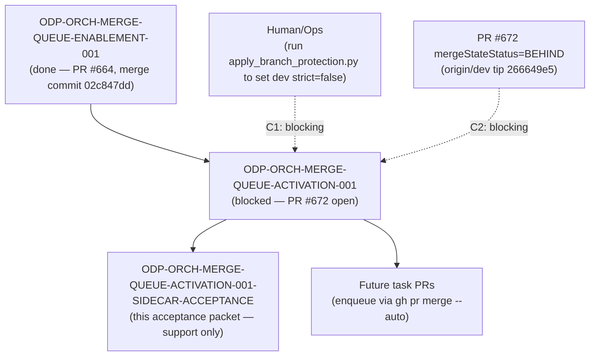

# ODP-ORCH-MERGE-QUEUE-ACTIVATION-001 Acceptance Packet

## Packet identity

| Field | Value |
|---|---|
| Sidecar task | `ODP-ORCH-MERGE-QUEUE-ACTIVATION-001-SIDECAR-ACCEPTANCE` |
| Parent task | `ODP-ORCH-MERGE-QUEUE-ACTIVATION-001` |
| Helper kind | `acceptance_packet` |
| Sidecar owner / reviewer (current) | `Claude` / `Antigravity4` |
| Sidecar owner / reviewer (round 1) | `Antigravity4` / `Claude` |
| Current parent owner / reviewer | `Claude` / `Antigravity4` |
| Observed parent branch | `task/ODP-ORCH-MERGE-QUEUE-ACTIVATION-001` (PR #672, open) |
| Observed `origin/dev` tip | `266649e5` (merge of PR #666) |
| Packet verdict | **Support only; no parent acceptance, merge, or production GO claim** |

This packet is a support-only review aid, acceptance checklist, and dependency map for parent task `ODP-ORCH-MERGE-QUEUE-ACTIVATION-001`. It does not change canonical contracts, L1 architecture truth, runtime/registry/governance implementations, or model-card truth. The parent task owner (`Claude`) decides whether to absorb this packet; the parent reviewer (`Antigravity4`) retains sole authority over implementation acceptance.

### Round 2 corrections

Round 1 (`c0a36d5f`) was reopened by the sidecar reviewer with three required fixes. All three are corrected here and independently re-verified:

1. **Wrong script path.** The auto-merge script is `.orchestrator/auto_merge_green_prs.py`, not `scripts/auto_merge_green_prs.py` (which does not exist). Evidence: PR #672 file list, and `tests/security/test_auto_merge_green_prs.py:7` resolves `parents[2] / ".orchestrator" / "auto_merge_green_prs.py"`.
2. **Conflated commits.** `02c847dd` is the *merge commit of PR #664* (`ODP-ORCH-MERGE-QUEUE-ENABLEMENT-001`), not the `dev` tip. At the time of writing, `origin/dev` tip is `266649e5`. The two are now recorded separately.
3. **Missing second gate.** PR #672 is currently `mergeStateStatus=BEHIND`. That is a real gate on parent completion independent of the `strict=true` blocker, and is now tracked as `C2` and in the dependency map.

## Observed state and review freeze

The parent task `ODP-ORCH-MERGE-QUEUE-ACTIVATION-001` ("Activate merge queue in dev branch protection") is responsible for codifying GitHub merge queue rulesets on the `dev` branch, providing branch protection verification and rollback tooling, and ensuring `task-review-gate` compliance within `merge_group` CI events.

Current status of parent task & dependencies:

| Item | State | Evidence |
|---|---|---|
| `ODP-ORCH-MERGE-QUEUE-ENABLEMENT-001` | `done` | PR #664 merged into `dev`; merge commit `02c847dd` |
| `ODP-ORCH-MERGE-QUEUE-ACTIVATION-001` | `blocked`, `waiting_for: Human/Ops` | `ai-status.json` task entry |
| PR #672 (parent deliverable) | `OPEN`, `mergeable=MERGEABLE`, `mergeStateStatus=BEHIND` | `gh pr view 672` |
| `origin/dev` tip | `266649e5` | `git log -1 origin/dev` |

### Detailed status of parent deliverables

1. **PR #672 open** — files changed: `.github/branch-protection/policy.json`, `.orchestrator/auto_merge_green_prs.py`, `docs/runbooks/README.md`, `docs/runbooks/dev-merge-queue.md`, `scripts/apply_branch_protection.py`, `tests/security/test_auto_merge_green_prs.py`.
   - Codifies `dev` merge queue ruleset (`dev-merge-queue`: `MERGE` method, `ALLGREEN` concurrency, 60 min timeout, 5-5-1 retry limit, 5 min minimum wait).
   - Extends `scripts/apply_branch_protection.py` with standard apply, rollback (`--disable-merge-queue`), and dry-run verification (`--verify-only`).
   - Updates `.orchestrator/auto_merge_green_prs.py` to enqueue via `gh pr merge --auto`, with coverage for queue-on, queue-off, and probe-fail states.
   - Adds operational procedures in `docs/runbooks/dev-merge-queue.md`. Note: this file **does not yet exist on `dev`** — it lands only when PR #672 merges.
2. **Current governance & branch protection state**:
   - GraphQL query verifies `mergeQueue(branch: "dev")` is active (ruleset ID `20508144`).
   - However, `dev` branch protection currently remains `strict=true`. This creates a half-applied state: the queue already blocks direct merges, but `strict=true` still forces every PR to rebase/update onto `dev` before queuing, defeating the race-condition elimination the queue is meant to provide.
   - Command policy prevented the parent worker from executing `apply_branch_protection.py` against the live repo.
   - Action item for `Human/Ops`: run `python3 scripts/apply_branch_protection.py` with GitHub administrative privileges (sets `dev` `strict=false`; `main` unchanged, no queue). Rollback alternative: `python3 scripts/apply_branch_protection.py --disable-merge-queue`.
3. **PR #672 is `BEHIND`** — its base has advanced past its branch point. Even once the `strict=true` blocker is resolved, PR #672 must be brought up to date (or enqueued once `strict=false` makes that unnecessary) before the parent can close out.

## Task-owned surface map (parent task)

Ownership is split deliberately: some files listed as in-scope for review were delivered by the upstream `ENABLEMENT-001` task or pre-date both tasks, and PR #672 does not modify them.

| Layer | Path | Owned by | In PR #672? | Intended responsibility |
|---|---|---|---|---|
| Review gate & CI workflow | `.github/workflows/merge-queue-review-gate.yml` | `ODP-ORCH-MERGE-QUEUE-ENABLEMENT-001` (PR #664, `037b1a9f`) | No — inherited, already on `dev` | Re-asserts `task-review-gate` status checks for queued PRs during `merge_group` events. |
| Branch protection tooling | `scripts/apply_branch_protection.py` | `ODP-ORCH-MERGE-QUEUE-ACTIVATION-001` (extends `ODP-OC-R5-012`) | Yes | Enforces GitHub API branch protection rules, dry-run readbacks, `--disable-merge-queue` rollback. |
| PR auto-merge automation | `.orchestrator/auto_merge_green_prs.py` | `ODP-ORCH-MERGE-QUEUE-ACTIVATION-001` | Yes | Automatically enqueues reviewer-approved green PRs via `gh pr merge --auto`. |
| Branch protection policy | `.github/branch-protection/policy.json` | `ODP-ORCH-MERGE-QUEUE-ACTIVATION-001` (extends `ODP-OC-R5-012`) | Yes | Declarative configuration for status checks, review requirements, admin enforcement. |
| Operational runbook | `docs/runbooks/dev-merge-queue.md`, `docs/runbooks/README.md` | `ODP-ORCH-MERGE-QUEUE-ACTIVATION-001` | Yes — not yet on `dev` | On-call procedures for merge queue monitoring, troubleshooting, emergency rollback. |
| Auto-merge test coverage | `tests/security/test_auto_merge_green_prs.py` | `ODP-ORCH-MERGE-QUEUE-ACTIVATION-001` (extends earlier suite) | Yes | Validates queue-on / queue-off / probe-fail enqueue behaviour. |
| Pre-existing policy tests | `tests/security/test_branch_protection_policy.py`, `tests/security/test_pr_merge_eligibility.py` | `ODP-OC-R5-012`, `ODP-INTAKE-JOBS-001` | No — regression guard only | Existing guards on branch protection policy structure and PR merge eligibility; must stay green. |
| Sidecar support packet | `support/sidecars/ODP-ORCH-MERGE-QUEUE-ACTIVATION-001/ODP-ORCH-MERGE-QUEUE-ACTIVATION-001-SIDECAR-ACCEPTANCE.md` | This sidecar | No | Support-only acceptance checklist, state ledger, dependency map for reviewer handoff. |

## Detailed acceptance matrix (criteria A–E)

### A. Ruleset & merge queue configuration

| ID | Required proof | Reject when | Status | Evidence |
|---|---|---|---|---|
| A1 | Ruleset `dev-merge-queue` is defined with `MERGE` method, `ALLGREEN` concurrency, 60 min timeout, and 5-5-1 retry parameters. | Missing ruleset definition or incorrect concurrency/timeout properties. | `PASSED` | PR #672 ruleset configuration & `docs/runbooks/dev-merge-queue.md` |
| A2 | GraphQL query returns non-null `mergeQueue(branch: "dev")`. | GraphQL returns `null` or an unconfigured merge queue on `dev`. | `PASSED` | Active ruleset ID `20508144` on `dev` |

### B. Review gate integration

| ID | Required proof | Reject when | Status | Evidence |
|---|---|---|---|---|
| B1 | `.github/workflows/merge-queue-review-gate.yml` handles `merge_group` events and re-asserts `task-review-gate` on `github.event.merge_group.head_sha`. | Workflow fails to re-assert status, causing queued PRs to stall and time out. | `PASSED` (inherited from PR #664) | `.github/workflows/merge-queue-review-gate.yml` lines 39–53 |
| B2 | Group status checks fail closed if any PR head in the merge group lacks a reviewer approval stamp. | Unapproved PR head permitted to bypass `task-review-gate` in a merge group. | `PASSED` (inherited from PR #664) | `.github/workflows/merge-queue-review-gate.yml` lines 77–79 (`[ "$state" = "success" ] \|\| fail ...`) |

### C. Merge-path gates on parent completion

| ID | Required proof | Reject when | Status | Evidence |
|---|---|---|---|---|
| C1 | `dev` branch protection `strict=true` disabled (`strict=false`) once the merge queue is active. | `strict=true` remains enabled alongside the merge queue, keeping the race the queue was meant to remove. | `BLOCKED_UPSTREAM` | Blocked on `Human/Ops` running `python3 scripts/apply_branch_protection.py` with admin privileges |
| C2 | PR #672 reaches a mergeable-and-current state (`mergeStateStatus` no longer `BEHIND`) so the parent deliverable can land on `dev`. | PR #672 stays `BEHIND` — even with `strict=false` resolved, the parent cannot close out on an unlanded PR. | `BLOCKED` | `gh pr view 672` → `state=OPEN`, `mergeable=MERGEABLE`, `mergeStateStatus=BEHIND`; `origin/dev` tip is `266649e5` |

### D. Operational & rollback tooling

| ID | Required proof | Reject when | Status | Evidence |
|---|---|---|---|---|
| D1 | `scripts/apply_branch_protection.py` supports `--disable-merge-queue` for fast rollback to the pre-queue state. | Rollback command fails or leaves branch protection in a corrupted state. | `PASSED` | `scripts/apply_branch_protection.py` |
| D2 | `.orchestrator/auto_merge_green_prs.py` gracefully handles queue-on, queue-off, and probe-fail states. | Unhandled exceptions when probing merge queue capabilities or auto-enqueueing PRs. | `PASSED` | `tests/security/test_auto_merge_green_prs.py` |

### E. Test & quality verification

| ID | Required proof | Reject when | Status | Evidence |
|---|---|---|---|---|
| E1 | Security pytest suite (`test_auto_merge_green_prs.py`, `test_branch_protection_policy.py`, `test_pr_merge_eligibility.py`) passes 100%. | Test assertion failures or non-zero exit code. | `PASSED` | 22 passed (see verification ledger) |
| E2 | `ruff check` passes cleanly across the parent-owned script and test files. | Python linting errors or formatting violations. | `PASSED` | `All checks passed!` (see verification ledger) |
| E3 | `git diff --check` passes with zero formatting errors. | Trailing whitespace or formatting defects introduced. | `PASSED` | exit code 0 |

## Upstream & downstream dependency map



Ordering note: C1 and C2 are independent gates, but resolving C1 first is preferable. With `strict=false` the queue itself brings PR #672 current at enqueue time, so a manual base advance for C2 may become unnecessary.

## Verification ledger

Commands run in this worktree (`task/ODP-ORCH-MERGE-QUEUE-ACTIVATION-001-SIDECAR-ACCEPTANCE`, based on `origin/dev` `266649e5`):

```bash
# 1. Security pytest suite
/home/lupin/oday-plus/.venv/bin/pytest \
  tests/security/test_auto_merge_green_prs.py \
  tests/security/test_branch_protection_policy.py \
  tests/security/test_pr_merge_eligibility.py -q
# Result: 22 passed

# 2. Static analysis (ruff) — note the corrected auto-merge path
/home/lupin/oday-plus/.venv/bin/ruff check \
  scripts/apply_branch_protection.py \
  .orchestrator/auto_merge_green_prs.py \
  tests/security/test_auto_merge_green_prs.py
# Result: All checks passed!

# 3. Formatting check
git diff --check
# Result: clean (exit code 0)

# 4. Path and state facts asserted in this packet
find . -name auto_merge_green_prs.py -not -path './.git/*'
# Result: ./.orchestrator/auto_merge_green_prs.py   (scripts/auto_merge_green_prs.py does not exist)

git log -1 --format='%h %s' origin/dev
# Result: 266649e5 Merge pull request #666 ...

git log -1 --format='%h %s' 02c847dd
# Result: 02c847dd Merge pull request #664 from alfloop-dev/task/ODP-ORCH-MERGE-QUEUE-ENABLEMENT-001

gh pr view 672 --json state,mergeable,mergeStateStatus,files
# Result: OPEN / MERGEABLE / BEHIND; files include .orchestrator/auto_merge_green_prs.py
```

Scope note: these checks validate the state of `dev` as of `266649e5` plus this sidecar's own artifact. They do **not** execute PR #672's branch contents, and they are not a substitute for the parent reviewer's acceptance of PR #672.

## Absorption & PR constraints for parent owner

1. **Sidecar scope restriction**: as an `acceptance_packet` support slice, this task must not modify L1 canonical truth, core contract truth, main runtime/registry/governance implementations, or model-card truth. This round touches exactly one file — this packet.
2. **Absorption protocol**: parent task owner (`Claude`) decides whether to absorb this packet into the parent branch or mainline. This packet grants no acceptance, merge, or GO authority.
3. **Freshness**: every state claim here is stamped against `origin/dev` `266649e5` and the PR #672 state observed at that time. Re-verify C1/C2 before using this packet to justify any parent closeout.

## Reviewer handoff record

Assigned sidecar reviewer: `Antigravity4`.

| Review question | Expected answer |
|---|---|
| Did this sidecar modify canonical L1 architecture, contract truth, or runtime implementation? | No. Scope is limited to `support/sidecars/ODP-ORCH-MERGE-QUEUE-ACTIVATION-001/ODP-ORCH-MERGE-QUEUE-ACTIVATION-001-SIDECAR-ACCEPTANCE.md`. |
| Were the three round-1 reviewer findings fixed? | Yes — script path corrected to `.orchestrator/auto_merge_green_prs.py` (line-level fixes in the deliverables list and the surface map), `02c847dd` separated from the `origin/dev` tip `266649e5`, and PR #672 `mergeStateStatus=BEHIND` added as gate `C2` plus a dependency-map edge. |
| What blocks parent task `ODP-ORCH-MERGE-QUEUE-ACTIVATION-001`? | Two independent gates. C1: `dev` is half-applied (`mergeQueue` ON, `strict=true` still set) and needs `Human/Ops` to run `python3 scripts/apply_branch_protection.py` with admin privileges. C2: PR #672 is `BEHIND` and has not landed on `dev`. |
| Who has sole authority to absorb this sidecar packet? | Parent owner `Claude`; parent reviewer `Antigravity4` retains acceptance authority over PR #672. |
