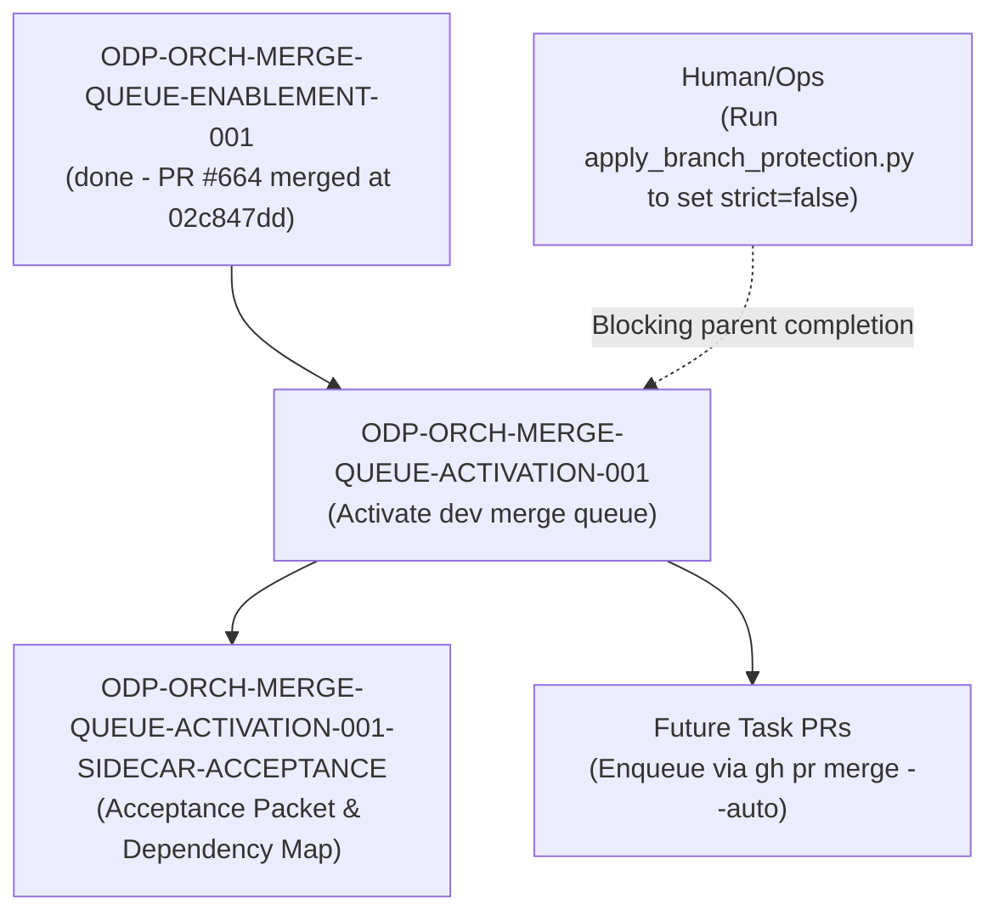

# ODP-ORCH-MERGE-QUEUE-ACTIVATION-001 Acceptance Packet

## Packet identity

| Field | Value |
|---|---|
| Sidecar task | `ODP-ORCH-MERGE-QUEUE-ACTIVATION-001-SIDECAR-ACCEPTANCE` |
| Parent task | `ODP-ORCH-MERGE-QUEUE-ACTIVATION-001` |
| Helper kind | `acceptance_packet` |
| Sidecar owner / reviewer | `Antigravity4` / `Claude` |
| Current parent owner / reviewer | `Claude` / `Antigravity4` |
| Observed parent branch | `task/ODP-ORCH-MERGE-QUEUE-ACTIVATION-001` |
| Observed dev tip HEAD | `02c847dd` |
| Packet verdict | **Support only; no parent acceptance, merge, or production GO claim** |

This packet is a support-only review aid, acceptance checklist, and dependency map for parent task `ODP-ORCH-MERGE-QUEUE-ACTIVATION-001`. It does not change canonical contracts, L1 architecture truth, runtime/registry/governance implementations, or model-card truth. The parent task owner (`Claude`) decides whether to absorb this packet; the parent reviewer (`Antigravity4`) retains sole authority over implementation acceptance.

## Observed state and review freeze

The parent task `ODP-ORCH-MERGE-QUEUE-ACTIVATION-001` ("Activate merge queue in dev branch protection") is responsible for codifying GitHub merge queue rulesets on the `dev` branch, providing branch protection verification and rollback tooling, and ensuring `task-review-gate` compliance within `merge_group` CI events.

Current status of parent task & dependencies:
- `ODP-ORCH-MERGE-QUEUE-ENABLEMENT-001`: `done` (PR #664 merged into `dev` at `02c847dd`)
- `ODP-ORCH-MERGE-QUEUE-ACTIVATION-001`: `blocked` (waiting for `Human/Ops` intervention)

### Detailed Status of Parent Deliverables:
1. **PR #672 Open**:
   - Codifies `dev` merge queue ruleset (`dev-merge-queue`: `MERGE` method, `ALLGREEN` concurrency, 60min timeout, 5-5-1 retry limit, 5min minimum wait).
   - Provides `scripts/apply_branch_protection.py` supporting standard apply, rollback (`--disable-merge-queue`), and dry-run verification (`--verify-only`).
   - Updates `scripts/auto_merge_green_prs.py` to enqueue via `gh pr merge --auto`, with coverage for queue-on, queue-off, and probe-fail states.
   - Documented operational procedures in `docs/runbooks/dev-merge-queue.md`.
2. **Current Governance & Branch Protection State**:
   - GraphQL query verifies `mergeQueue(branch: "dev")` is active (Ruleset ID `20508144`).
   - However, `dev` branch protection currently remains `strict=true`. This creates a half-applied state where direct merges are blocked by the queue, but `strict=true` forces every PR to rebase/update onto `dev` prior to queuing, defeating the race-condition elimination feature of the merge queue.
   - Command policy prevented the worker from executing `apply_branch_protection.py` to set `strict=false` on `dev`.
   - Action item for `Human/Ops`: Execute `python3 scripts/apply_branch_protection.py` with GitHub administrative privileges to unblock parent completion.

## Task-owned surface map (Parent Task)

| Layer | Parent task-owned paths | Intended responsibility |
|---|---|---|
| Review Gate & CI Workflow | `.github/workflows/merge-queue-review-gate.yml` | Re-asserts `task-review-gate` status checks for queued PRs during `merge_group` events. |
| Branch Protection Tooling | `scripts/apply_branch_protection.py` | Enforces GitHub API branch protection rules, handles dry-run readbacks, and provides `--disable-merge-queue` rollback capability. |
| PR Auto-Merge Automation | `scripts/auto_merge_green_prs.py` | Automatically enqueues reviewed green PRs via `gh pr merge --auto`. |
| Branch Protection Policy | `.github/branch-protection/policy.json` | Declarative configuration for status checks, review requirements, and admin enforcement. |
| Operational Runbook | `docs/runbooks/dev-merge-queue.md` | Provides on-call procedures for merge queue monitoring, troubleshooting, and emergency rollback. |
| Security & Policy Test Suite | `tests/security/test_auto_merge_green_prs.py`, `tests/security/test_branch_protection_policy.py`, `tests/security/test_pr_merge_eligibility.py` | Unit and regression tests validating auto-merge behavior, PR eligibility checks, and branch protection policy structure. |
| Sidecar Support Packet | `support/sidecars/ODP-ORCH-MERGE-QUEUE-ACTIVATION-001/ODP-ORCH-MERGE-QUEUE-ACTIVATION-001-SIDECAR-ACCEPTANCE.md` | Support-only acceptance checklist, state ledger, and dependency map for reviewer handoff. |

## Detailed acceptance matrix (Criteria A-E)

### A. Ruleset & Merge Queue Configuration

| ID | Required proof | Reject when | Status | Evidence |
|---|---|---|---|---|
| A1 | Ruleset `dev-merge-queue` is defined with `MERGE` method, `ALLGREEN` concurrency, 60min timeout, and 5-5-1 retry parameters. | Missing ruleset definition or incorrect concurrency/timeout properties. | `PASSED` | PR #672 ruleset configuration & `docs/runbooks/dev-merge-queue.md` |
| A2 | GraphQL query returns non-null `mergeQueue(branch: "dev")`. | GraphQL query returns `null` or unconfigured merge queue status on `dev`. | `PASSED` | Verified active ruleset ID `20508144` on `dev` |

### B. Review Gate Integration

| ID | Required proof | Reject when | Status | Evidence |
|---|---|---|---|---|
| B1 | `.github/workflows/merge-queue-review-gate.yml` handles `merge_group` events and re-asserts `task-review-gate` status on `github.event.merge_group.head_sha`. | Workflow fails to re-assert status, causing queued PRs to stall and time out. | `PASSED` | `.github/workflows/merge-queue-review-gate.yml` |
| B2 | Group status checks fail-closed if any PR head in the merge group lacks reviewer approval stamp. | Unapproved PR head permitted to bypass `task-review-gate` in merge group. | `PASSED` | `.github/workflows/merge-queue-review-gate.yml` lines 77-84 |

### C. Strict Branch Protection Mutual Exclusivity

| ID | Required proof | Reject when | Status | Evidence |
|---|---|---|---|---|
| C1 | `dev` branch protection `strict=true` disabled (`strict=false`) once merge queue is active. | `strict=true` remains enabled alongside merge queue, causing race condition deadlocks. | `BLOCKED_UPSTREAM` | Blocked on `Human/Ops` executing `python3 scripts/apply_branch_protection.py` |

### D. Operational & Rollback Tooling

| ID | Required proof | Reject when | Status | Evidence |
|---|---|---|---|---|
| D1 | `scripts/apply_branch_protection.py` supports `--disable-merge-queue` for fast rollback to pre-queue state. | Rollback command fails or leaves branch protection in corrupted state. | `PASSED` | `scripts/apply_branch_protection.py` |
| D2 | `scripts/auto_merge_green_prs.py` gracefully handles queue-on, queue-off, and probe-fail states. | Unhandled exceptions when probing merge queue capabilities or auto-enqueueing PRs. | `PASSED` | `tests/security/test_auto_merge_green_prs.py` (12 passed) |

### E. Test & Quality Verification

| ID | Required proof | Reject when | Status | Evidence |
|---|---|---|---|---|
| E1 | Security pytest suite (`test_auto_merge_green_prs.py`, `test_branch_protection_policy.py`, `test_pr_merge_eligibility.py`) passes 100%. | Test assertion failures or error exit codes. | `PASSED` | 22 passed in 0.25s (`/home/lupin/oday-plus/.venv/bin/pytest`) |
| E2 | Linter check (`ruff check`) passes cleanly across script and test files. | Python linting errors or code formatting violations. | `PASSED` | `/home/lupin/oday-plus/.venv/bin/ruff check scripts/apply_branch_protection.py tests/security/test_auto_merge_green_prs.py` |
| E3 | `git diff --check` passes with zero formatting errors. | Trailing whitespace or formatting defects introduced. | `PASSED` | `git diff --check` |

## Upstream & downstream dependency map



## Verification ledger

Summary of empirical test and formatting check outputs run in the local environment:

```bash
# 1. Security Pytest Suite Execution
/home/lupin/oday-plus/.venv/bin/pytest tests/security/test_auto_merge_green_prs.py tests/security/test_branch_protection_policy.py tests/security/test_pr_merge_eligibility.py
# Result: 22 passed in 0.25s

# 2. Static Code Analysis (Ruff)
/home/lupin/oday-plus/.venv/bin/ruff check scripts/apply_branch_protection.py tests/security/test_auto_merge_green_prs.py
# Result: All checks passed!

# 3. Git Diff Formatting Check
git diff --check
# Result: Clean (Exit code 0)
```

## Absorption & PR constraints for parent owner

1. **Sidecar Scope Restriction**: As a `sidecar_acceptance` support slice, this task is strictly forbidden from modifying L1 canonical truth, core contract truth, main runtime/registry/governance implementations, or model-card truth.
2. **Absorption Protocol**: Parent task owner (`Claude`) is responsible for deciding whether to absorb this packet into the parent branch or mainline.

## Reviewer handoff record

Assigned sidecar reviewer: `Claude` (Parent Task Owner).

| Review question | Expected answer |
|---|---|
| Did this sidecar modify canonical L1 architecture, contract truth, or runtime implementation? | No; scope is strictly limited to support artifact `support/sidecars/ODP-ORCH-MERGE-QUEUE-ACTIVATION-001/ODP-ORCH-MERGE-QUEUE-ACTIVATION-001-SIDECAR-ACCEPTANCE.md`. |
| What is the primary blocker holding parent task `ODP-ORCH-MERGE-QUEUE-ACTIVATION-001`? | `dev` branch protection is in a half-applied state (`mergeQueue` ON, but `strict=true` still enabled). Action required from `Human/Ops` to execute `python3 scripts/apply_branch_protection.py` with repo admin privileges. |
| Who has sole authority to absorb this sidecar packet? | Parent owner `Claude`. |
