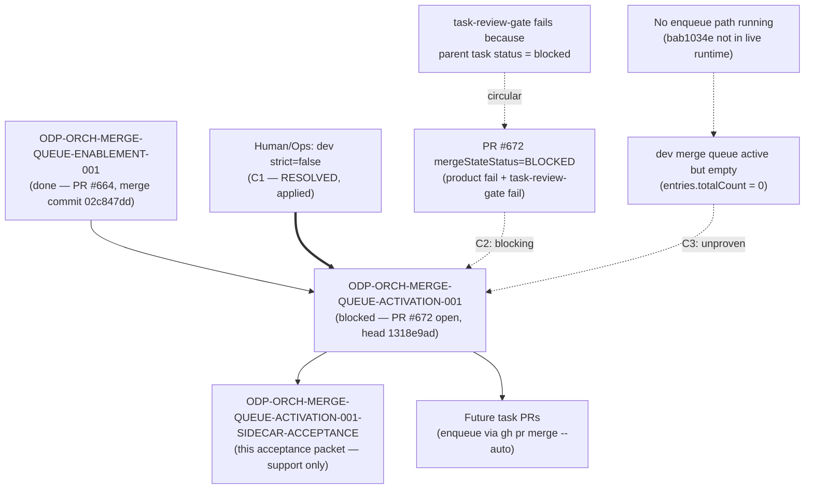

# ODP-ORCH-MERGE-QUEUE-ACTIVATION-001 Acceptance Packet

## Packet identity

| Field | Value |
|---|---|
| Sidecar task | `ODP-ORCH-MERGE-QUEUE-ACTIVATION-001-SIDECAR-ACCEPTANCE` |
| Parent task | `ODP-ORCH-MERGE-QUEUE-ACTIVATION-001` |
| Helper kind | `acceptance_packet` |
| Sidecar owner / reviewer (current) | `Claude` / `Antigravity4` |
| Sidecar owner / reviewer (round 1) | `Antigravity4` / `Claude` |
| Current parent owner / reviewer | `Claude` / `Antigravity4` |
| Observed parent branch | `task/ODP-ORCH-MERGE-QUEUE-ACTIVATION-001` (PR #672, open, head `1318e9ad`) |
| Observed `origin/dev` tip | `44109779` (merge of PR #670) |
| State stamped at | 2026-08-07 (round 3 re-verification) |
| Packet verdict | **Support only; no parent acceptance, merge, or production GO claim** |

This packet is a support-only review aid, acceptance checklist, and dependency map for parent task `ODP-ORCH-MERGE-QUEUE-ACTIVATION-001`. It does not change canonical contracts, L1 architecture truth, runtime/registry/governance implementations, or model-card truth. The parent task owner (`Claude`) decides whether to absorb this packet; the parent reviewer (`Antigravity4`) retains sole authority over implementation acceptance.

### Round 2 corrections

Round 1 (`c0a36d5f`) was reopened by the sidecar reviewer with three required fixes. All three are corrected here and independently re-verified:

1. **Wrong script path.** The auto-merge script is `.orchestrator/auto_merge_green_prs.py`, not `scripts/auto_merge_green_prs.py` (which does not exist). Evidence: PR #672 file list, and `tests/security/test_auto_merge_green_prs.py:7` resolves `parents[2] / ".orchestrator" / "auto_merge_green_prs.py"`.
2. **Conflated commits.** `02c847dd` is the *merge commit of PR #664* (`ODP-ORCH-MERGE-QUEUE-ENABLEMENT-001`), not the `dev` tip. At the time of writing, `origin/dev` tip is `266649e5`. The two are now recorded separately.
3. **Missing second gate.** PR #672 is currently `mergeStateStatus=BEHIND`. That is a real gate on parent completion independent of the `strict=true` blocker, and is now tracked as `C2` and in the dependency map.

### Round 3 re-verification (2026-08-07)

Round 2 was approved, but its two blocking gates were re-measured against live GitHub state during closeout and **both had changed**. Correcting them here, because shipping the packet with a stale `C1` would tell the parent owner to ask Ops for work that is already done.

1. **`C1` is resolved.** `dev` branch protection now reports `required_status_checks.strict = false`. The half-applied state described in round 2 (queue ON + `strict=true`) no longer exists; Ops has applied the branch-protection change. Note that the parent task's own `next` field in `ai-status.json` still describes the `strict=true` state — it was last updated 2026-08-06T12:36:16Z and is now stale as well.
2. **`C2` changed shape.** PR #672 is no longer `BEHIND`; with `strict=false` the base-currency gate is gone. It is now `mergeStateStatus=BLOCKED` for a different reason: two required contexts are red (`product` and `task-review-gate`). A base advance on PR #672 would therefore not help.
3. **New gate `C3`.** The merge queue is fully configured and active, but has **never processed an entry** — the queue is empty and nothing enqueues approved PRs, so the parent's second acceptance criterion ("first queued PR merges through the queue") cannot be demonstrated yet. See `C3` below.

## Observed state and review freeze

The parent task `ODP-ORCH-MERGE-QUEUE-ACTIVATION-001` ("Activate merge queue in dev branch protection") is responsible for codifying GitHub merge queue rulesets on the `dev` branch, providing branch protection verification and rollback tooling, and ensuring `task-review-gate` compliance within `merge_group` CI events.

Current status of parent task & dependencies:

| Item | State | Evidence |
|---|---|---|
| `ODP-ORCH-MERGE-QUEUE-ENABLEMENT-001` | `done` | PR #664 merged into `dev`; merge commit `02c847dd` |
| `ODP-ORCH-MERGE-QUEUE-ACTIVATION-001` | `blocked`, `waiting_for: Human/Ops` | `ai-status.json` task entry (last update 2026-08-06T12:36:16Z; its `next` text is stale — see round 3) |
| PR #672 (parent deliverable) | `OPEN`, `mergeable=MERGEABLE`, `mergeStateStatus=BLOCKED` | `gh pr view 672`, `gh pr checks 672` |
| `dev` merge queue | active, **empty** (`entries.totalCount = 0`) | GraphQL `repository.mergeQueue(branch:"dev")` |
| `dev` branch protection `strict` | `false` (round 2 recorded `true`) | `gh api repos/alfloop-dev/odayplus/branches/dev/protection` |
| `origin/dev` tip | `44109779` | `git log -1 origin/dev` |

### Detailed status of parent deliverables

1. **PR #672 open** — files changed: `.github/branch-protection/policy.json`, `.orchestrator/auto_merge_green_prs.py`, `docs/runbooks/README.md`, `docs/runbooks/dev-merge-queue.md`, `delivery_toolchain/github/apply_branch_protection.py`, `tests/security/test_auto_merge_green_prs.py`.
   - Codifies `dev` merge queue ruleset (`dev-merge-queue`: `MERGE` method, `ALLGREEN` concurrency, 60 min timeout, 5-5-1 retry limit, 5 min minimum wait).
   - Extends `delivery_toolchain/github/apply_branch_protection.py` with standard apply, rollback (`--disable-merge-queue`), and dry-run verification (`--verify-only`).
   - Updates `.orchestrator/auto_merge_green_prs.py` to enqueue via `gh pr merge --auto`, with coverage for queue-on, queue-off, and probe-fail states.
   - Adds operational procedures in `docs/runbooks/dev-merge-queue.md`. Note: this file **does not yet exist on `dev`** — it lands only when PR #672 merges.
2. **Current governance & branch protection state** (re-measured 2026-08-07):
   - Ruleset `dev-merge-queue` (ID `20508144`) is `enforcement=active` on `refs/heads/dev`, with `merge_method=MERGE`, `grouping_strategy=ALLGREEN`, `check_response_timeout_minutes=60`, `max_entries_to_build=5`, `max_entries_to_merge=5`, `min_entries_to_merge=1`, `min_entries_to_merge_wait_minutes=5`. `bypass_actors` is empty and `current_user_can_bypass` is `never` — **no identity can merge into `dev` outside the queue.**
   - `dev` branch protection is now `strict=false` (round 2 recorded `true`). The half-applied state is cleared; the `Human/Ops` action item from round 2 is **done** and should not be re-requested.
   - Required contexts on `dev` are unchanged: `orchestrator`, `product`, `product-e2e-gate`, `task-review-gate`; `enforce_admins=true`.
   - `.github/branch-protection/policy.json` on `dev` is still the pre-`ACTIVATION` form (four contexts + `enforce_admins`, no `strict` key, no queue block). The declarative policy therefore does **not** yet describe the live configuration; PR #672 is what closes that gap.
3. **PR #672 is `BLOCKED`, not `BEHIND`.** `mergeable=MERGEABLE`, head `1318e9ad`. Check results: `orchestrator` pass, `product-e2e-gate` pass, `performance-gate` pass, **`product` fail**, **`task-review-gate` fail** (`Review rejected or reopened. Task status is blocked`). The `task-review-gate` failure is circular: it fails *because* the parent task is `blocked` in `ai-status.json`, and the parent cannot leave `blocked` until its PR lands. Unblocking the parent task record and fixing the `product` failure are both required; a base advance is not.

## Task-owned surface map (parent task)

Ownership is split deliberately: some files listed as in-scope for review were delivered by the upstream `ENABLEMENT-001` task or pre-date both tasks, and PR #672 does not modify them.

| Layer | Path | Owned by | In PR #672? | Intended responsibility |
|---|---|---|---|---|
| Review gate & CI workflow | `.github/workflows/merge-queue-review-gate.yml` | `ODP-ORCH-MERGE-QUEUE-ENABLEMENT-001` (PR #664, `037b1a9f`) | No — inherited, already on `dev` | Re-asserts `task-review-gate` status checks for queued PRs during `merge_group` events. |
| Branch protection tooling | `delivery_toolchain/github/apply_branch_protection.py` | `ODP-ORCH-MERGE-QUEUE-ACTIVATION-001` (extends `ODP-OC-R5-012`) | Yes | Enforces GitHub API branch protection rules, dry-run readbacks, `--disable-merge-queue` rollback. |
| PR auto-merge automation | `.orchestrator/auto_merge_green_prs.py` | `ODP-ORCH-MERGE-QUEUE-ACTIVATION-001` | Yes | Automatically enqueues reviewer-approved green PRs via `gh pr merge --auto`. |
| Branch protection policy | `.github/branch-protection/policy.json` | `ODP-ORCH-MERGE-QUEUE-ACTIVATION-001` (extends `ODP-OC-R5-012`) | Yes | Declarative configuration for status checks, review requirements, admin enforcement. |
| Operational runbook | `docs/runbooks/dev-merge-queue.md`, `docs/runbooks/README.md` | `ODP-ORCH-MERGE-QUEUE-ACTIVATION-001` | Yes — not yet on `dev` | On-call procedures for merge queue monitoring, troubleshooting, emergency rollback. |
| Auto-merge test coverage | `tests/security/test_auto_merge_green_prs.py` | `ODP-ORCH-MERGE-QUEUE-ACTIVATION-001` (extends earlier suite) | Yes | Validates queue-on / queue-off / probe-fail enqueue behaviour. |
| Pre-existing policy tests | `tests/security/test_branch_protection_policy.py`, `tests/security/test_pr_merge_eligibility.py` | `ODP-OC-R5-012`, `ODP-INTAKE-JOBS-001` | No — regression guard only | Existing guards on branch protection policy structure and PR merge eligibility; must stay green. |
| Sidecar support packet | `support/sidecars/ODP-ORCH-MERGE-QUEUE-ACTIVATION-001/ODP-ORCH-MERGE-QUEUE-ACTIVATION-001-SIDECAR-ACCEPTANCE.md` | This sidecar | No | Support-only acceptance checklist, state ledger, dependency map for reviewer handoff. |

## Detailed acceptance matrix (criteria A–E)

### A. Ruleset & merge queue configuration

| ID | Required proof | Reject when | Status | Evidence |
|---|---|---|---|---|
| A1 | Ruleset `dev-merge-queue` is defined with `MERGE` method, `ALLGREEN` concurrency, 60 min timeout, and 5-5-1 retry parameters. | Missing ruleset definition or incorrect concurrency/timeout properties. | `PASSED` (live-verified) | `gh api repos/alfloop-dev/odayplus/rulesets/20508144` — every parameter read back and matched; see round 3 |
| A2 | GraphQL query returns non-null `mergeQueue(branch: "dev")`. | GraphQL returns `null` or an unconfigured merge queue on `dev`. | `PASSED` (live-verified) | GraphQL returned `url = .../queue/dev`, non-null; ruleset `20508144` `enforcement=active` |

### B. Review gate integration

| ID | Required proof | Reject when | Status | Evidence |
|---|---|---|---|---|
| B1 | `.github/workflows/merge-queue-review-gate.yml` handles `merge_group` events and re-asserts `task-review-gate` on `github.event.merge_group.head_sha`. | Workflow fails to re-assert status, causing queued PRs to stall and time out. | `PASSED` (inherited from PR #664) | `.github/workflows/merge-queue-review-gate.yml` lines 39–53 |
| B2 | Group status checks fail closed if any PR head in the merge group lacks a reviewer approval stamp. | Unapproved PR head permitted to bypass `task-review-gate` in a merge group. | `PASSED` (inherited from PR #664) | `.github/workflows/merge-queue-review-gate.yml` lines 77–79 (`[ "$state" = "success" ] \|\| fail ...`) |

### C. Merge-path gates on parent completion

| ID | Required proof | Reject when | Status | Evidence |
|---|---|---|---|---|
| C1 | `dev` branch protection `strict=true` disabled (`strict=false`) once the merge queue is active. | `strict=true` remains enabled alongside the merge queue, keeping the race the queue was meant to remove. | `RESOLVED` (was `BLOCKED_UPSTREAM` in round 2) | `gh api .../branches/dev/protection` → `required_status_checks.strict = false`. Ops has applied it; do not re-request. |
| C2 | PR #672 lands on `dev` so the parent deliverable is durable. | PR #672 cannot merge. | `BLOCKED` (cause changed) | `gh pr view 672` → `OPEN`, `MERGEABLE`, `mergeStateStatus=BLOCKED`. `gh pr checks 672` → `product` **fail**, `task-review-gate` **fail** (`Review rejected or reopened. Task status is blocked`). No longer a `BEHIND`/base-currency problem. |
| C3 | Merge queue demonstrably merges at least one PR (parent acceptance criterion 2: all four required contexts green on the merge-group SHA). | The queue is configured but never exercised, so activation is unproven in production. | `UNPROVEN` | GraphQL `mergeQueue(branch:"dev").entries.totalCount = 0` — the queue has no entries and no PR has been observed transiting it. Nothing currently enqueues approved PRs; see § Enqueue gap. |

### D. Operational & rollback tooling

| ID | Required proof | Reject when | Status | Evidence |
|---|---|---|---|---|
| D1 | `delivery_toolchain/github/apply_branch_protection.py` supports `--disable-merge-queue` for fast rollback to the pre-queue state. | Rollback command fails or leaves branch protection in a corrupted state. | `PASSED` | `delivery_toolchain/github/apply_branch_protection.py` |
| D2 | `.orchestrator/auto_merge_green_prs.py` gracefully handles queue-on, queue-off, and probe-fail states. | Unhandled exceptions when probing merge queue capabilities or auto-enqueueing PRs. | `PASSED` | `tests/security/test_auto_merge_green_prs.py` |

### E. Test & quality verification

| ID | Required proof | Reject when | Status | Evidence |
|---|---|---|---|---|
| E1 | Security pytest suite (`test_auto_merge_green_prs.py`, `test_branch_protection_policy.py`, `test_pr_merge_eligibility.py`) passes 100%. | Test assertion failures or non-zero exit code. | `PASSED` | 22 passed (see verification ledger) |
| E2 | `ruff check` passes cleanly across the parent-owned script and test files. | Python linting errors or formatting violations. | `PASSED` | `All checks passed!` (see verification ledger) |
| E3 | `git diff --check` passes with zero formatting errors. | Trailing whitespace or formatting defects introduced. | `PASSED` | exit code 0 |

## Enqueue gap (why `C3` cannot be proven yet)

The queue is active and non-bypassable, so **the only way anything reaches `dev` is by being enqueued**. Nothing is doing that today, which is why `entries.totalCount = 0` and why the parent's "first queued PR merges" criterion has no evidence.

Observed on 2026-08-07:

| Enqueue path | State |
|---|---|
| `.orchestrator/github_bus.py` → `enable_review_pr_auto_merge()` | On `origin/dev` (`github_bus.py:1073`, called at `:1944`), landed via commit `bab1034e` / PR #676. **Not in the running supervisor runtime** — `oday-plus-supervisor-runtime-current` resolves to `oday-plus-supervisor-runtime-d9c4b474` at HEAD `0abbc9a9`, and `git merge-base --is-ancestor bab1034e 0abbc9a9` exits `1`. Merged ≠ running. |
| `.orchestrator/auto_merge_green_prs.py` | Present on `dev`, but PR #672 is what teaches it to enqueue via `gh pr merge --auto`; that change has not landed. |
| Background worker running `gh pr merge --auto` | Denied by command policy. |
| Manual operator enqueue | Possible, but not automated. |

Worked example, this sidecar's own PR #674: `OPEN`, not draft, `MERGEABLE`, `mergeStateStatus=CLEAN`, head `2466e221` matching `approved_head`, all checks green, approved — and still not merged across five finalize-dispatch rounds, because no path above fired. It is a live instance of `C3` failing, not a defect in this packet.

Consequence for the parent owner: `C3` stays `UNPROVEN` until an enqueue path exists. Rolling the supervisor runtime forward past `bab1034e` is the smallest change that produces the first queue entry, and it would exercise `C3` fleet-wide rather than for one PR. That rollout is **out of scope for this sidecar** and is recorded here as an observation for the parent owner, not as a recommendation this packet has authority to make.

## Upstream & downstream dependency map



Ordering note (revised in round 3): `C1` is done, so the round-2 ordering advice no longer applies. `C2` is now the lead gate and is **not** a base-currency problem — a base advance on PR #672 would change nothing. It needs the `product` check fixed and the circular `task-review-gate` failure broken (the gate reads the parent's `blocked` status, which only clears once the PR lands). `C3` is independent of both and cannot be closed by any change to PR #672 alone.

## Verification ledger

Commands run in this worktree (`task/ODP-ORCH-MERGE-QUEUE-ACTIVATION-001-SIDECAR-ACCEPTANCE`, based on `origin/dev` `266649e5`):

```bash
# 1. Security pytest suite
/home/lupin/oday-plus/.venv/bin/pytest \
  tests/security/test_auto_merge_green_prs.py \
  tests/security/test_branch_protection_policy.py \
  tests/security/test_pr_merge_eligibility.py -q
# Result: 22 passed

# 2. Static analysis (ruff) — note the corrected auto-merge path
/home/lupin/oday-plus/.venv/bin/ruff check \
  delivery_toolchain/github/apply_branch_protection.py \
  .orchestrator/auto_merge_green_prs.py \
  tests/security/test_auto_merge_green_prs.py
# Result: All checks passed!

# 3. Formatting check
git diff --check
# Result: clean (exit code 0)

# 4. Path and state facts asserted in this packet
find . -name auto_merge_green_prs.py -not -path './.git/*'
# Result: ./.orchestrator/auto_merge_green_prs.py   (scripts/auto_merge_green_prs.py does not exist)

git log -1 --format='%h %s' origin/dev
# Result: 266649e5 Merge pull request #666 ...

git log -1 --format='%h %s' 02c847dd
# Result: 02c847dd Merge pull request #664 from alfloop-dev/task/ODP-ORCH-MERGE-QUEUE-ENABLEMENT-001

gh pr view 672 --json state,mergeable,mergeStateStatus,files
# Result (round 2): OPEN / MERGEABLE / BEHIND; files include .orchestrator/auto_merge_green_prs.py
```

### Round 3 re-verification commands (2026-08-07)

Run against live GitHub and the live runtime; these supersede the round-2 state claims where they differ.

```bash
# C1 — dev branch protection
gh api repos/alfloop-dev/odayplus/branches/dev/protection
# Result: required_status_checks.strict = false   (round 2 recorded true -> C1 RESOLVED)
#         contexts = orchestrator, product, product-e2e-gate, task-review-gate
#         enforce_admins.enabled = true

# A1 — merge queue ruleset, full parameter readback
gh api repos/alfloop-dev/odayplus/rulesets/20508144
# Result: name=dev-merge-queue, enforcement=active, include=refs/heads/dev,
#         rules[0].type=merge_queue, merge_method=MERGE, grouping_strategy=ALLGREEN,
#         check_response_timeout_minutes=60, max_entries_to_build=5,
#         max_entries_to_merge=5, min_entries_to_merge=1,
#         min_entries_to_merge_wait_minutes=5,
#         bypass_actors=[], current_user_can_bypass=never

# A2 / C3 — queue liveness and depth
gh api graphql -f query='query { repository(owner:"alfloop-dev", name:"odayplus") {
  mergeQueue(branch:"dev") { url entries(first:20) { totalCount } } } }'
# Result: mergeQueue non-null, url=.../queue/dev, entries.totalCount = 0

# C2 — parent PR
gh pr view 672 --json state,mergeable,mergeStateStatus,headRefOid
# Result: OPEN / MERGEABLE / BLOCKED / 1318e9ad
gh pr checks 672
# Result: product fail; task-review-gate fail ("Review rejected or reopened. Task status is blocked");
#         orchestrator pass; performance-gate pass; product-e2e-gate pass

# Enqueue gap — automation present on dev but absent from the running runtime
git grep -n enable_review_pr_auto_merge origin/dev -- .orchestrator/github_bus.py
# Result: :1073 (definition), :1944 (call site)
git merge-base --is-ancestor bab1034e 0abbc9a9; echo $?
# Result: 1  (not an ancestor -> not in runtime HEAD 0abbc9a9 / runtime-d9c4b474)

# Declarative policy on dev is still pre-ACTIVATION
git show origin/dev:.github/branch-protection/policy.json
# Result: four required contexts + enforce_admins; no strict key, no queue block

git log -1 --format='%h %s' origin/dev
# Result: 44109779 Merge pull request #670 ...
```

Scope note: these checks validate live `dev` governance state as of `origin/dev` `44109779` plus this sidecar's own artifact. They do **not** execute PR #672's branch contents, and they are not a substitute for the parent reviewer's acceptance of PR #672. The round-2 pytest/ruff results (E1–E3) were not re-run in round 3; they remain stamped at `266649e5`.

## Absorption & PR constraints for parent owner

1. **Sidecar scope restriction**: as an `acceptance_packet` support slice, this task must not modify L1 canonical truth, core contract truth, main runtime/registry/governance implementations, or model-card truth. This round touches exactly one file — this packet.
2. **Absorption protocol**: parent task owner (`Claude`) decides whether to absorb this packet into the parent branch or mainline. This packet grants no acceptance, merge, or GO authority.
3. **Freshness**: state claims are stamped against `origin/dev` `44109779` and live GitHub governance state read on 2026-08-07 (round 3); E1–E3 remain stamped at `266649e5` (round 2). Re-verify `C1`–`C3` before using this packet to justify any parent closeout — round 3 exists precisely because two round-2 gate statuses had gone stale between approval and closeout.
4. **Stale record to fix elsewhere**: the parent task's `next` field in `ai-status.json` still describes the `strict=true` half-applied state and asks Ops to run `apply_branch_protection.py`. That work is done. Correcting that field belongs to the parent task, not this sidecar.

## Reviewer handoff record

Assigned sidecar reviewer: `Antigravity4`.

| Review question | Expected answer |
|---|---|
| Did this sidecar modify canonical L1 architecture, contract truth, or runtime implementation? | No. Scope is limited to `support/sidecars/ODP-ORCH-MERGE-QUEUE-ACTIVATION-001/ODP-ORCH-MERGE-QUEUE-ACTIVATION-001-SIDECAR-ACCEPTANCE.md`. |
| Were the three round-1 reviewer findings fixed? | Yes — script path corrected to `.orchestrator/auto_merge_green_prs.py` (line-level fixes in the deliverables list and the surface map), `02c847dd` separated from the `origin/dev` tip, and PR #672's merge-state gate added as `C2` plus a dependency-map edge. |
| What changed in round 3, after approval? | Two of the packet's own gate statuses had gone stale and were corrected against live state: `C1` is `RESOLVED` (`dev` is now `strict=false`), and `C2`'s cause changed from `BEHIND` to `BLOCKED` (`product` + `task-review-gate` failing). A new gate `C3` records that the queue is active but has never processed an entry. The base was also advanced onto `origin/dev` `44109779`. |
| What blocks parent task `ODP-ORCH-MERGE-QUEUE-ACTIVATION-001`? | `C2` and `C3`. `C2`: PR #672 is `BLOCKED` — `product` fails, and `task-review-gate` fails circularly because the parent task record is `blocked`. `C3`: the merge queue has never merged a PR (`entries.totalCount = 0`), so the parent's second acceptance criterion is unproven; no enqueue path is currently running. `C1` is done — do not re-request the Ops branch-protection change. |
| Who has sole authority to absorb this sidecar packet? | Parent owner `Claude`; parent reviewer `Antigravity4` retains acceptance authority over PR #672. |
