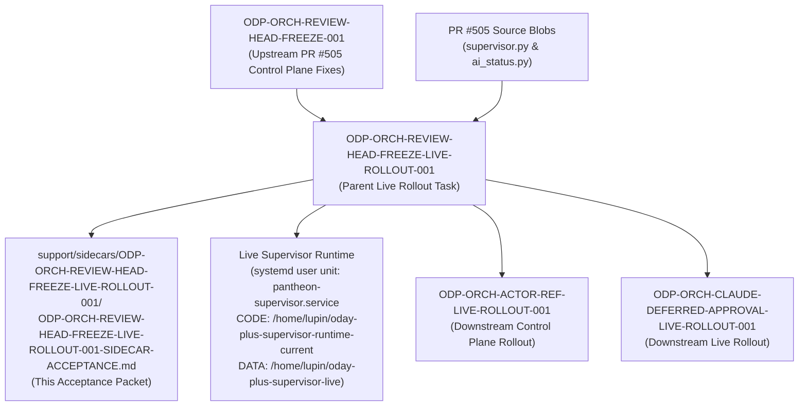

# Sidecar Acceptance Packet & Dependency Map: ODP-ORCH-REVIEW-HEAD-FREEZE-LIVE-ROLLOUT-001

- **Task ID**: `ODP-ORCH-REVIEW-HEAD-FREEZE-LIVE-ROLLOUT-001-SIDECAR-ACCEPTANCE`
- **Parent Task ID**: `ODP-ORCH-REVIEW-HEAD-FREEZE-LIVE-ROLLOUT-001`
- **Helper Kind**: `acceptance_packet`
- **Task Class**: `sidecar`
- **Sidecar Owner**: `Antigravity`
- **Sidecar Reviewer**: `Codex2`
- **Parent Task Owner**: `Antigravity`
- **Parent Task Reviewer**: `Claude`
- **Target Release Claim**: `no-go-until-final-gate-audit`
- **Phase**: `Orchestrator Control Plane`

---

## 1. Executive Summary & Scope Boundary

This document serves as the sidecar support packet and acceptance specification for parent task `ODP-ORCH-REVIEW-HEAD-FREEZE-LIVE-ROLLOUT-001` ("Roll merged review-head freeze into live Supervisor").

### Scope Boundaries
- **Support Only**: This packet is a support artifact created under sidecar isolation. It does **not** mutate L1 canonical architecture documents, core runtime contracts, or production Supervisor binaries directly.
- **Purpose**: Establishes the authoritative acceptance checklist, dependency map, fail-closed verification rules, live probe isolation requirements, and handoff criteria required before parent task `ODP-ORCH-REVIEW-HEAD-FREEZE-LIVE-ROLLOUT-001` can be submitted for canonical review and closeout.

---

## 2. Live Rollout & Controlled Publication Requirements

Parent implementation `ODP-ORCH-REVIEW-HEAD-FREEZE-LIVE-ROLLOUT-001` deploys the control plane review-head freeze (PR #505 exact-head freeze) to the live Supervisor roots (`/home/lupin/oday-plus-supervisor-runtime-current` for CODE and `/home/lupin/oday-plus-supervisor-live` for DATA) while preserving active worker processes and dirty runtime state.

### Key Deployment Gates & Verification Criteria

| Deployment Stage | Required Operation | Verification / Receipt Proof |
| :--- | :--- | :--- |
| **1. Fleet Dispatch Documentation** | Create `docs/evidence/fleet_dispatch/ODP-ORCH-REVIEW-HEAD-FREEZE-LIVE-ROLLOUT-001.md` before any live write. | Document committed with execution steps, preflight plan, and rollback procedures. |
| **2. Source SHA Hash Verification** | Validate exact source SHA256 hashes from PR #505 for `.orchestrator/supervisor.py` and `scripts/ai_status.py`. | `.orchestrator/supervisor.py` SHA: `3bb01341fee9b5d10f78591003d74aab299826a68c9b5fa9c1529175c90e6050`<br/>`scripts/ai_status.py` SHA: `bc1ba0c2f60e58d6038480e686c69abc064f08fd36c38c1b4b7ec33dc832856e` |
| **3. Preflight State Capture** | Log live Supervisor state prior to modification using systemd user unit commands (`systemctl --user show pantheon-supervisor`). | Record `ActiveState`, `SubState`, `MainPID` (captured dynamically via `systemctl --user show pantheon-supervisor --property=MainPID`), `ExecMainStartTimestamp`, `NRestarts`, heartbeat, and active worker list. |
| **4. Backup & Rollback Provisioning** | Create byte-level backups and executable rollback scripts. | Backup binaries stored in `docs/evidence/runtime/ODP-ORCH-REVIEW-HEAD-FREEZE-LIVE-ROLLOUT-001/backup/` with atomic revert commands. |
| **5. Atomic Publication** | Publish exact-head files using atomic `os.replace` operations across live target roots (CODE root `/home/lupin/oday-plus-supervisor-runtime-current` for supervisor scripts and DATA root `/home/lupin/oday-plus-supervisor-live` for status state). | Zero partial writes or broken sibling imports; destination file hashes match source exactly. |
| **6. Controlled Single Restart** | Execute exactly one controlled Supervisor restart via `systemctl --user restart pantheon-supervisor.service` / SIGTERM driver. | New live `MainPID` dynamically verified; `SubState` running; `NRestarts` unchanged or incremented by exactly 1; fresh heartbeat recorded. |
| **7. Fail-Closed Live Probes** | Run B23, B24, N3 live probes using an isolated temporary `PANTHEON_STATUS_ROOT`. | Probes pass without mutating live status files (`ai-status.json`), task archive, or dashboard bundles. |
| **8. Preserved Disabled Agents** | Maintain `ready_dispatcher.disabled_agents` configuration. | Ensure `Claude`, `Claude2`, and `Claude3` worker lanes remain in `ready_dispatcher.disabled_agents` to prevent dispatcher collision, while active `Antigravity` worker lanes execute rollout safety gates. |

---

## 3. Comprehensive Dependency Map



### Upstream Dependencies
- **`ODP-ORCH-REVIEW-HEAD-FREEZE-001`**: Upstream task delivering PR #505 control plane fix (exact review-head freeze, CI status check classification, and on-disk status sync).
- **PR #505 Source Hashes**: Merge commit `6af7b86ba4aa34d5bf26142f64f3cb96c429b557` providing immutable SHA256 hashes for `.orchestrator/supervisor.py` and `scripts/ai_status.py`.

### Downstream Dependencies
- **`ODP-ORCH-ACTOR-REF-LIVE-ROLLOUT-001`**: Depends on live Supervisor running the exact-head review freeze to prevent dispatch churn during actor reference rollout.
- **`ODP-ORCH-CLAUDE-DEFERRED-APPROVAL-LIVE-ROLLOUT-001`**: Depends on review-head freeze control plane stability for deferred approval reconciliation.

---

## 4. Fail-Closed Acceptance Checklist Matrix

Parent task `ODP-ORCH-REVIEW-HEAD-FREEZE-LIVE-ROLLOUT-001` must satisfy all fail-closed criteria below. Any violation requires an immediate fail-closed state.

| Criterion | Rule Description | Fail-Closed Trigger (Must Reject) | Verification & Audit Evidence |
| :--- | :--- | :--- | :--- |
| **Criterion A** | **Fleet Dispatch Preflight Rule** | Modifying live files before committing `docs/evidence/fleet_dispatch/ODP-ORCH-REVIEW-HEAD-FREEZE-LIVE-ROLLOUT-001.md`. | Preflight dispatch doc commit receipt timestamp prior to live write. |
| **Criterion B** | **Source Blob Integrity Rule** | Source file SHA256 mismatch with PR #505 exact-head hashes (`3bb01341...` / `bc1ba0c2...`), or target files left undefined without publishing to CODE target root (`/home/lupin/oday-plus-supervisor-runtime-current`). | Direct `sha256sum` verification output on source files and deployed target files in CODE root. |
| **Criterion C** | **Preflight Backup & Atomic Write Rule** | Non-atomic file copying, missing byte backups, or overwriting live files without rollback script. | Preflight backup file existence and `os.replace` invocation log. |
| **Criterion D** | **Controlled Single Restart Rule** | Uncontrolled process crash, multiple restarts, running `systemctl` commands without `--user` (returning PID 0 inactive dead), or failure of live Supervisor to achieve running state. | Systemd user unit journal timestamp (`journalctl --user -u pantheon-supervisor`), dynamic PID transition evidence via `systemctl --user show pantheon-supervisor --property=MainPID`, and single restart assertion. |
| **Criterion E** | **Isolated Probe Execution Rule** | Running live probes (B23, B24, N3) against the live status root instead of temporary `PANTHEON_STATUS_ROOT`. | Probe command logs proving `$PANTHEON_STATUS_ROOT` redirection to `/tmp/...`. |
| **Criterion F** | **Disabled Agents Safety Rule** | Failing to maintain `Claude`, `Claude2`, and `Claude3` in `ready_dispatcher.disabled_agents` during rollout, or illegally altering disabled agent lanes in dispatcher config. | Config inspection receipt showing `ready_dispatcher.disabled_agents` intact with `Claude`, `Claude2`, and `Claude3` disabled. |
| **Criterion G** | **Independent Review & Non-Mutation Rule** | Modifying Package 10 UI, API logic, cloud resources, or completing closeout without independent `Antigravity5` review of hashes, transcript, probes, and rollback evidence. | Independent `Antigravity5` review approval entry of hashes, transcript, probes, and rollback evidence in activity log and clean diff outside control plane evidence. |

---

## 5. Verification Suite & Baseline Checks

### Required Verification Commands
1. **Orchestrator Unit Test Suite**:
   ```bash
   /home/lupin/oday-plus/.venv/bin/pytest .orchestrator scripts -q -m "not requires_live_env"
   ```
2. **Code & Style Integrity**:
   ```bash
   /home/lupin/oday-plus/.venv/bin/ruff check .orchestrator scripts
   git diff --check
   ```
3. **Live Probe & Review Freeze Verification (Isolated Environment)**:
   ```bash
   PANTHEON_STATUS_ROOT=/tmp/test-status-root AI_NAME=Antigravity5 /home/lupin/oday-plus/.venv/bin/pytest .orchestrator/test_supervisor.py -k "ReviewHeadFreezeTests" -q
   ```

---

## 6. Handoff & Sign-Off Instructions

- **Sidecar Task Owner**: `Antigravity`
- **Sidecar Task Reviewer**: `Codex2`
- **Parent Task Owner**: `Antigravity`
- **Parent Task Reviewer**: `Claude`
- **Sidecar Owner Verification**: `Antigravity` (Sidecar support packet updated to align with live parent acceptance gates; role definitions, disabled agents policy [Claude, Claude2, Claude3 disabled], and independent Antigravity5 verification criteria corrected; git diff clean; ready for handoff to Codex2)
- **Handoff Instructions**:
  1. Review this acceptance packet for alignment with parent task `ODP-ORCH-REVIEW-HEAD-FREEZE-LIVE-ROLLOUT-001`.
  2. Verify that live Supervisor rollout evidence satisfies all 7 criteria in Section 4.
  3. Confirm that safety gates (Claude, Claude2, Claude3 in disabled_agents) and independent Antigravity5 review requirements match parent acceptance criteria.
  4. Keep this support packet linked as the authoritative acceptance reference for parent rollout closeout.
