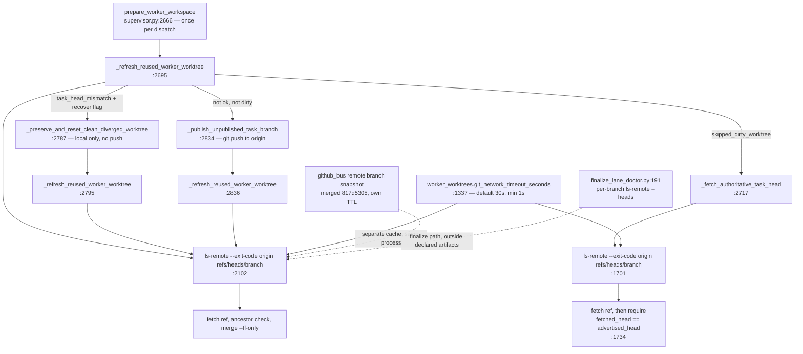

# ODP-ORCH-SUPERVISOR-REF-SNAPSHOT-001 Acceptance Packet

## Packet identity and authority

| Field | Value |
|---|---|
| Sidecar task | `ODP-ORCH-SUPERVISOR-REF-SNAPSHOT-001-SIDECAR-ACCEPTANCE` |
| Parent task | `ODP-ORCH-SUPERVISOR-REF-SNAPSHOT-001` |
| Helper kind | `acceptance_packet` |
| Sidecar owner / reviewer | `Claude2` / `Antigravity` |
| Parent owner / reviewer | `Antigravity` / `Codex` |
| Parent PR | none open at packet time |
| Repository state observed | `origin/dev` = `ebfe128e9d79061c8490331e096ebcf94eb2787d` |
| Evidence observed at | `2026-08-09` |
| Packet verdict | Support only; no parent acceptance, merge, rollout, or production claim |

This packet is a review aid for the parent owner. It records the current probe
topology, a dependency and call-path map, an acceptance matrix, and composition
risks. It does not modify or supersede canonical truth, `.orchestrator` runtime
code, registry/governance behavior, or the parent task's acceptance authority.

Because the parent has no PR yet, this packet is **prospective**: the matrix
below states conditions a future patch must satisfy, not verdicts on code that
already exists. Every row must be re-evaluated against the real diff.

## Problem statement and current probe topology

The parent task proposes replacing per-branch `git ls-remote` probes on the
dispatch and finalize paths with a single short-lived remote head snapshot,
while preserving fail-closed SHA verification and existing tests.

`.orchestrator/supervisor.py` currently issues exactly two per-branch remote-ref
probes, both single-ref and both inside the worker-workspace preparation path:

| Site | Function | Command | Failure mapping |
|---|---|---|---|
| `supervisor.py:1701` | `_fetch_authoritative_task_head` | `ls-remote --exit-code origin refs/heads/<branch>` | timeout → `fetch_timed_out`; rc 2 → `unverifiable_refs: remote task branch is missing`; other rc → `fetch_failed` |
| `supervisor.py:2102` | `_refresh_reused_worker_worktree` | `ls-remote --exit-code origin refs/heads/<expected_branch>` | timeout → `fetch_timed_out`; rc ∉ {0,2} → `fetch_failed`; rc 2 → treated as "remote task branch absent" |

Both are reached from `prepare_worker_workspace` (`supervisor.py:2666`), which
runs once per dispatch decision. Within a **single** call,
`_refresh_reused_worker_worktree` can execute up to three times:

- `supervisor.py:2695` — first refresh of the reused worktree;
- `supervisor.py:2795` — re-verify after `_preserve_and_reset_clean_diverged_worktree`;
- `supervisor.py:2836` — re-verify after `_publish_unpublished_task_branch`.

So today's probe count is roughly `O(dispatched tasks × retries)`, and each probe
is bounded by `worker_worktrees.git_network_timeout_seconds`
(`supervisor.py:1337-1347`; falls back to `supervisor.external_command_timeout_seconds`,
then `30.0`, clamped to a minimum of `1.0`). A slow or unavailable `origin`
multiplies that timeout by the number of probes in the tick.

### What the probe is used for — and why this is not the GitHub-bus case

The already-merged sibling `ODP-ORCH-GITHUB-REF-SNAPSHOT-001` (PR #744, merged
into `dev` as `817d53052e23cf867085342fcafa340743e4a7cb`) cached a **set of
branch names** because `github_bus.remote_branch_exists` only needs membership.

The supervisor probes need strictly more: the **advertised object id**.
`_fetch_authoritative_task_head` reads the advertised SHA
(`supervisor.py:1714-1717`), fetches the ref, and then refuses recovery unless
`fetched_head == advertised_head` (`supervisor.py:1734-1739`). That equality is
the fail-closed core the parent task promises to keep. A name-only snapshot
would silently delete it; an OID-carrying snapshot re-times it. See R2.

There is an in-repo precedent for the batched form:
`scripts/ai_status.py:5572-5600` (`resolve_task_sha`) already issues one
`git ls-remote --heads origin <ref> <ref> …` for multiple refs, parses
`OID<TAB>ref` rows, validates each OID against `[0-9a-fA-F]{40,64}`, caches with
a short TTL (default 5 s) and — importantly — exposes `force_refresh` / `fresh`
bypasses. That call shows the multi-ref form still returns advertised SHAs, so
batching and SHA verification are compatible.

## Observed parent state

| Item | Observed state | Consequence |
|---|---|---|
| Parent task `ODP-ORCH-SUPERVISOR-REF-SNAPSHOT-001` | `in_progress`, owner `Antigravity`, reviewer `Codex` | Implementation not yet submitted. |
| Parent branch / PR | No `task/ODP-ORCH-SUPERVISOR-REF-SNAPSHOT-001` on origin; no open or merged PR | Nothing to review yet; this packet is a design-constraint checklist. |
| Parent declared artifacts | `.orchestrator/supervisor.py`, `.orchestrator/test_supervisor.py` | Excludes the finalize-lane probe in `scripts/orchestrator/finalize_lane_doctor.py`; see R6. |
| Sibling `ODP-ORCH-GITHUB-REF-SNAPSHOT-001` | Merged at `817d5305` | A second, independently-configured snapshot cache already exists in-process; see R7. |
| Declared dependencies | none | Correct as a task graph statement, but the patch will share process state with the merged sibling. |
| Runtime rollout | No rollout evidence exists | Latency reduction and loop health are unproven by construction. |

## Dependency and call-path map



The map's decisive detail is that `PUB` **writes to the remote** and is followed
immediately by `R3`, which re-reads it. Any snapshot spanning that edge is a
read-after-write hazard. By contrast `PRE` mutates only local state, so a
snapshot reused across `R1 → R2` is legitimately the same remote observation —
that edge is where batching is safe and valuable.

## Parent acceptance matrix

Status values describe what a reviewer must confirm; none are satisfied today,
because no patch exists.

| ID | Required proof | Reject or investigate when | Current evidence |
|---|---|---|---|
| A1 | Multiple task-branch lookups against `origin` inside one snapshot window execute exactly one `ls-remote`. | Probe count still scales with dispatched-task count. | **Not implemented.** |
| A2 | The snapshot stores the advertised object id per ref, not just ref presence. | Only membership is cached, or the OID is dropped. | **Not implemented.** Required by `supervisor.py:1734-1739`. |
| A3 | Every OID admitted from the snapshot is validated against `[0-9a-fA-F]{40,64}` before use, as at `supervisor.py:1716`. | Unvalidated or truncated OIDs reach the equality check. | **Not implemented.** |
| A4 | A probe timeout still yields `fetch_timed_out`, distinct from `unverifiable_refs` and `fetch_failed`. | A failed snapshot is reported as "branch missing" for every branch. | **Not implemented.** See R3. |
| A5 | A branch absent from a **successful** snapshot maps to the current rc 2 semantics; a branch absent because the snapshot **failed** does not. | Both collapse to the same status string. | **Not implemented.** See R3. |
| A6 | Any supervisor-initiated push (`_publish_unpublished_task_branch`, `supervisor.py:1910`) invalidates or bypasses the snapshot before the following re-verification. | `supervisor.py:2836` re-reads a pre-push snapshot. | **Not implemented.** See R1 — highest severity. |
| A7 | Cache identity keys on the resolved remote URL, not the literal name `origin`. | Two worktrees with different `origin` URLs share one entry. | **Not implemented.** See R4. |
| A8 | A test-visible reset hook exists and is called in `setUp` of every test class that runs real git against a temporary bare origin. | Snapshot state leaks between tests and makes results order-dependent. | **Not implemented.** See R4. |
| A9 | TTL is configurable with a documented default, invalid values fall back rather than raise, and the relationship to `git_network_timeout_seconds` is stated. | Invalid config raises into the supervisor loop, or TTL < timeout goes unexamined. | **Not implemented.** See R5. |
| A10 | The batch's ref set and its miss policy are explicit: which branches are in one snapshot, and what happens for a branch not in it. | Lazy per-branch population leaves the probe count unchanged. | **Not implemented.** See R5. |
| B1 | `python3 -m pytest .orchestrator/test_supervisor.py` is green, with `ReusedWorkerWorktreeBaseAdvanceTests` (`test_supervisor.py:8974`) and `CleanDivergedWorktreeRecoveryTests` (`test_supervisor.py:386`) unmodified in intent. | Existing assertions are relaxed to accommodate the cache. | **Not run for a parent patch.** |
| B2 | `test_publishing_an_unpublished_commit_makes_the_lease_verifiable` (`test_supervisor.py:9108`) still passes, and a new test covers the same flow *with the snapshot warm before the push*. | Only the cold-cache path is tested. | **Not implemented.** Directly guards the 2026-08-05 deadlock. |
| B3 | `test_local_and_remote_task_head_mismatch_blocks` (`test_supervisor.py:9188`) and `test_git_network_timeout_is_bounded_and_reported` (`test_supervisor.py:387`) remain green. | Fail-closed mismatch or timeout reporting changes. | **Not implemented.** |
| B4 | Ruff and `git diff --check` pass on changed files. | Lint failure or malformed patch. | **Not run.** |
| C1 | The parent PR is reviewed by `Codex`, all required checks green, merged into `dev`. | PR stays open or `task-review-gate` is red. | **Pending.** |
| C2 | The running supervisor is rolled to a revision containing the merged commit. | Only repository state advances while the runtime lags. | **Unproven.** |
| C3 | With `N > 1` dispatched tasks in one tick, observed `ls-remote` invocations drop from `O(N × retries)` to one per snapshot window, and tick delay against a stalled remote is bounded near one timeout. | Probe count or tick duration still scales with `N`. | **Unproven; runtime measurement required.** |
| C4 | Post-rollout ticks show no new `unverifiable_refs`, `fetch_failed`, or lease-block escalations attributable to snapshot staleness. | Lease blocks or dispatch refusals rise after rollout. | **Unproven; runtime observation required.** |
| C5 | A branch pushed during a tick is visible to the verification that follows it, with no added delay. | Any regression of the publish-then-verify flow. | **Unproven; see R1 and B2.** |

## Reviewer attention: composition and configuration risks

These are review questions. This sidecar has no authority to resolve them in
parent code.

### R1 — read-after-write across the publish path (highest severity)

`_publish_unpublished_task_branch` pushes the task branch to `origin`
(`supervisor.py:1910`) and the caller immediately re-runs
`_refresh_reused_worker_worktree` (`supervisor.py:2836`), whose first act is the
remote probe at `supervisor.py:2102`. A snapshot taken earlier in the same
`prepare_worker_workspace` call — or earlier in the tick — would answer that
re-read with a pre-push view: either the branch is absent, or its OID is the old
one. Both outcomes make the refresh fail, so the publish that just succeeded is
reported as not having satisfied the policy.

That is precisely the failure the publish path was written to end. The docstring
at `supervisor.py:1862-1871` records the 2026-08-05 incident: eight tasks
deadlocked for roughly eight hours, each re-reported about 300 times, with the
fleet running no work. A snapshot without post-push invalidation reintroduces it
and makes it TTL-periodic.

The parent must therefore either invalidate the snapshot entry after any
supervisor-initiated push, or give the post-publish verification an explicit
freshness bypass — the shape `resolve_task_sha(force_refresh=…)` already uses in
`scripts/ai_status.py:5579-5583`. A reviewer should treat "the TTL is short, so
it self-heals" as insufficient: the caller does not retry within the tick.

### R2 — the snapshot changes what `fetched_head == advertised_head` proves

`_fetch_authoritative_task_head` fetches the ref and then requires the fetched
OID to equal the advertised one (`supervisor.py:1734-1739`). Today both readings
come from the same instant, so the check means "the ref did not move under us".

With a snapshot, the advertised OID may be up to one TTL older than the fetch.
The check then means "the ref has not moved since the snapshot", and a normal
concurrent push by the task's own worker turns into
`unverifiable_refs: fetched remote task HEAD does not match advertised HEAD`.
The direction is fail-closed, so nothing unsafe is admitted — but it converts a
routine race into a refused lease, and dirty-worktree lease recovery is exactly
the path where a worker is already stuck.

Acceptance should state which of these the parent intends: exclude
`_fetch_authoritative_task_head` from the snapshot, re-probe on mismatch before
declaring `unverifiable_refs`, or accept and document the new false-negative
class with its expected frequency.

### R3 — one batched exit code cannot carry per-branch outcomes

The current code distinguishes three outcomes per branch: rc 2 → the branch is
genuinely absent; other non-zero → `fetch_failed` with stderr detail; timeout →
`fetch_timed_out`. `--exit-code` gives that per branch because each probe covers
one ref.

A single batched `ls-remote` returns one exit code for the whole set, and an
absent branch is simply a missing row. Reviewers should confirm the snapshot
records probe success independently of row presence, so that a transient failure
does not render every branch as "missing" — which would flow into
`unverifiable_refs: remote task branch is missing` and mislead any operator
reading the lease-block escalation. The inverse error, treating a failed probe
as "unchanged, still present", must also be excluded: that would be fail-open.
Note that `--exit-code` and the multi-ref form interact — with several refs
requested, "no matching refs" is a property of the whole request, not of a
branch.

### R4 — process-global cache versus the real-git test suite

`ReusedWorkerWorktreeBaseAdvanceTests` (`test_supervisor.py:8974`) and its
siblings create a fresh bare repository per test and add it as a remote named
`origin`. A cache keyed by remote *name*, as the merged github-bus snapshot is,
would therefore serve one test's remote state to another test's assertions, and
failures would be order-dependent and hard to attribute.

Two requirements follow: key the cache on the resolved remote URL or repository
path, and expose a reset hook that these test classes call in `setUp`. The same
name-collision concern applies in production wherever worktrees under different
roots each define their own `origin`.

### R5 — where the batch comes from, and TTL versus timeout

Two configuration questions should be settled before implementation review.

First, batching only pays if the snapshot is populated with the full set of
branches the tick will ask about. If it is filled lazily on first miss per
branch, the probe count is unchanged for distinct branches and only the retry
edges at `supervisor.py:2795` and `:2836` benefit. The parent should state the
ref set explicitly — for example, all task branches eligible for dispatch at
tick start — and define the miss policy for a branch outside it.

Second, the snapshot timestamp is naturally taken around a probe bounded by
`git_network_timeout_seconds` (default 30 s, minimum 1 s,
`supervisor.py:1337-1347`). If the TTL may be configured below that timeout, a
slow probe can expire on arrival and the "one timeout per window" bound is lost.
Acceptance should record either an invariant (`TTL >= git_network_timeout_seconds`)
or the accepted behavior for smaller TTLs.

### R6 — the finalize path is outside the declared artifacts

The parent summary names the "dispatch/finalize" paths, but its artifacts list
only `.orchestrator/supervisor.py` and `.orchestrator/test_supervisor.py`.
`scripts/orchestrator/finalize_lane_doctor.py:191` still runs a per-branch
`ls-remote --heads origin <branch>` for each task it inspects, in the finalize
lane. Either it is in scope and the artifact list should say so, or it is
explicitly deferred and the parent's summary should be narrowed to dispatch.
Leaving this implicit risks a closeout that claims more coverage than it has.

### R7 — two independent snapshot caches in one process

The merged sibling `817d5305` added a remote-branch snapshot in
`.orchestrator/github_bus.py` (`remote_branch_names`,
`remote_branch_snapshot_ttl_seconds`, `clear_remote_branch_snapshot_cache`) with
its own TTL and its own configuration key. A second cache in `supervisor.py`
gives one process two views of the same remote that can disagree — one may hold
a branch the other does not — and two TTLs an operator must reason about
together during an incident.

This may be an acceptable cost for keeping the modules independent; that is the
parent owner's call. What acceptance should require is that the choice is
deliberate and written down, including whether the two caches share a
configuration key and whether a single operator action can clear both.

## Runtime rollout evidence plan

The parent owner can fill this ledger after merge and deployment. Evidence must
identify exact SHAs and timestamps. Merged is not evidence that the live
supervisor runs the change.

| Gate | Evidence to capture | Pass condition |
|---|---|---|
| Merge | Parent PR final state, merge commit, required checks | Merged into `dev`; every required context green. |
| Deployment identity | Running supervisor root and HEAD SHA, verified with `git merge-base --is-ancestor <merge-sha> HEAD` | The merge commit is an ancestor of the running SHA. A green freshness alarm is not proof. |
| Baseline | Pre-rollout dispatched-task count per tick, configured network timeout, observed `ls-remote` invocations, tick duration | Enough context for a like-for-like comparison. |
| Healthy remote | One tick dispatching several tasks | One remote probe per snapshot window; every dispatch decision unchanged versus baseline. |
| Publish path | A tick that exercises `_publish_unpublished_task_branch` | The refresh immediately after the push succeeds; no `task_head_mismatch` or `unverifiable_refs` attributable to a stale snapshot. |
| Slow or unavailable remote | Controlled fault or a naturally occurring incident | Tick delay bounded near one probe timeout per window, not `N ×` it; no loop crash. |
| Recovery | First healthy window after the failure | Branch state is rediscovered within the explicitly accepted window. |
| Observation | Several subsequent ticks | No new loop errors, no rise in lease-block escalations, no dispatch starvation. |

Record the latency claim as measured values:

```text
baseline:   N dispatched tasks, ___ ls-remote invocations, tick duration ___s
candidate:  N dispatched tasks, ___ ls-remote invocations, tick duration ___s
git_network_timeout_seconds: ___
snapshot TTL configured:     ___
github_bus snapshot TTL:     ___
runtime root / SHA / observation interval: ___ / ___ / ___
```

## Sidecar verification ledger

Evidence inspected for this packet:

```text
AI_NAME=Claude2 "$PANTHEON_STATUS_ROOT/scripts/ai-status.sh" show \
  ODP-ORCH-SUPERVISOR-REF-SNAPSHOT-001-SIDECAR-ACCEPTANCE
AI_NAME=Claude2 "$PANTHEON_STATUS_ROOT/scripts/ai-status.sh" show \
  ODP-ORCH-SUPERVISOR-REF-SNAPSHOT-001
git fetch origin; git rev-parse origin/dev
grep -rn 'ls-remote' --include=*.py .orchestrator/ scripts/
read .orchestrator/supervisor.py lines 1330-1360, 1643-1745, 1858-1922,
     2003-2160, 2666-2860
read .orchestrator/test_supervisor.py lines 386-430, 8974-9000, 9100-9200
read scripts/ai_status.py lines 5570-5610
read scripts/orchestrator/finalize_lane_doctor.py lines 175-215
gh pr list --search ODP-ORCH-SUPERVISOR-REF-SNAPSHOT-001 --state all
gh pr view 744 --json mergeCommit,mergedAt,baseRefName
```

Observed results:

- No parent branch on origin and no parent PR; the parent task is `in_progress`.
- `origin/dev` is `ebfe128e`; sibling PR #744 merged at `817d5305`.
- `.orchestrator/supervisor.py` contains exactly two per-branch `ls-remote`
  probes, at lines 1701 and 2102, both reached from `prepare_worker_workspace`.
- `scripts/ai_status.py:5589` already batches multiple refs into one
  `ls-remote --heads` with a short TTL and explicit refresh bypasses.
- `scripts/orchestrator/finalize_lane_doctor.py:191` retains a per-branch probe.
- No supervisor code, test, or configuration was modified by this sidecar. No
  supervisor test was executed; this packet makes no test-result claim.

## Reviewer handoff and absorption constraints

Assigned sidecar reviewer: `Antigravity`, who is also the parent owner.

| Review question | Expected answer |
|---|---|
| Did this sidecar modify L1/canonical truth or parent runtime/config/tests? | No. It adds one support artifact under `support/sidecars/`. |
| Does the packet claim the parent is accepted, implemented, or deployed? | No. It records that no parent branch or PR exists yet. |
| What should the parent owner read first? | R1 — the publish-then-verify read-after-write hazard, which can reproduce the 2026-08-05 dispatch deadlock. Then R2 and R3, which change what the fail-closed checks prove. |
| What is the cheapest way to de-risk the design? | Exclude `_fetch_authoritative_task_head` and the post-publish re-verification from the snapshot, and batch only the first-pass `_refresh_reused_worker_worktree` probe. Most of the `O(N)` saving lives there and none of R1/R2 applies. |
| What blocks parent acceptance today? | The implementation itself: no branch, no PR, no tests, no rollout evidence. |
| Who decides whether to absorb this packet? | Parent owner `Antigravity`; parent reviewer `Codex` retains parent implementation acceptance authority. |

Before using this packet for parent review or closeout, refresh the observed
state tables. The dated values above are a snapshot, not durable operational
truth.
